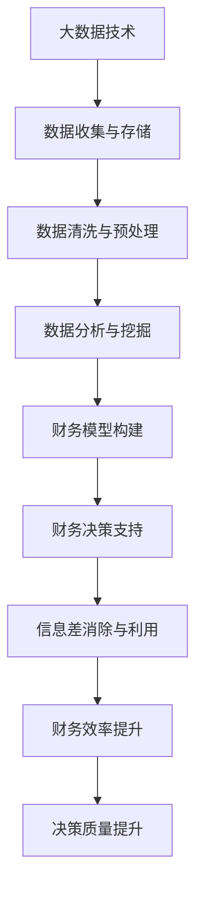

                 

# 信息差：大数据如何提升财务管理

> **关键词：**大数据，财务管理，信息差，数据分析，预测模型，决策支持系统

> **摘要：**本文将深入探讨大数据技术在财务管理中的应用，分析信息差对财务决策的影响，以及如何通过大数据提升财务管理的效率和准确性。我们将详细讲解核心概念、算法原理、数学模型、实际案例，并提供相关工具和资源推荐，以帮助读者全面理解大数据在财务管理中的潜力与挑战。

## 1. 背景介绍

### 1.1 目的和范围

本文旨在探讨大数据技术在财务管理中的实际应用，分析其如何通过信息差来提升财务决策的质量和效率。我们将会涵盖以下几个关键方面：

- 大数据在财务管理中的作用和意义
- 信息差对财务决策的影响
- 大数据分析的核心算法原理
- 数学模型和公式的应用
- 实际项目的代码实现和案例分析
- 大数据财务管理的未来发展趋势与挑战

### 1.2 预期读者

本文适合以下读者群体：

- 财务管理人员和分析师
- 数据科学家和分析师
- 信息管理和技术专业人员
- 对大数据和财务管理感兴趣的学生和研究人员

### 1.3 文档结构概述

本文结构如下：

1. 背景介绍
   - 目的和范围
   - 预期读者
   - 文档结构概述
2. 核心概念与联系
   - 大数据与财务管理的概念联系
   - Mermaid流程图展示
3. 核心算法原理 & 具体操作步骤
   - 算法原理讲解
   - 伪代码阐述
4. 数学模型和公式 & 详细讲解 & 举例说明
   - 数学公式嵌入
   - 例子说明
5. 项目实战：代码实际案例和详细解释说明
   - 开发环境搭建
   - 源代码实现
   - 代码解读与分析
6. 实际应用场景
   - 财务决策支持系统
   - 风险管理
   - 业绩预测
7. 工具和资源推荐
   - 学习资源
   - 开发工具框架
   - 相关论文著作
8. 总结：未来发展趋势与挑战
9. 附录：常见问题与解答
10. 扩展阅读 & 参考资料

### 1.4 术语表

#### 1.4.1 核心术语定义

- **大数据（Big Data）：**指无法用传统数据库软件工具进行捕捉、管理和处理的数据集合。
- **信息差（Information Gap）：**指不同个体或组织在获取和利用信息方面的差异。
- **财务管理（Financial Management）：**指组织或个人在资金筹集、使用和分配等方面的管理和决策过程。
- **数据分析（Data Analysis）：**指通过统计和计算方法，对数据集合进行处理、分析和解释的过程。
- **预测模型（Predictive Model）：**指基于历史数据和算法，对未来的趋势或行为进行预测的模型。

#### 1.4.2 相关概念解释

- **数据挖掘（Data Mining）：**指从大量数据中提取有价值信息的过程，通常涉及分类、聚类、关联规则挖掘等。
- **机器学习（Machine Learning）：**指通过算法和统计方法，使计算机系统能够从数据中学习并做出预测或决策的技术。
- **深度学习（Deep Learning）：**指一种特殊的机器学习技术，利用多层神经网络进行特征学习和复杂模式识别。

#### 1.4.3 缩略词列表

- **SQL（Structured Query Language）：**结构化查询语言，用于数据库管理和数据操作。
- **Hadoop：**一个分布式数据处理框架，用于大规模数据存储和处理。
- **Spark：**一个快速通用的计算引擎，适用于大数据处理和分析。
- **R：**一种统计计算语言，用于数据分析和统计建模。

## 2. 核心概念与联系

大数据技术与财务管理之间的关系日益紧密，二者相互促进，共同发展。大数据不仅为财务管理提供了丰富的数据资源，还通过信息差的消除和利用，提升了财务决策的精度和效率。以下将详细阐述大数据与财务管理之间的核心概念和联系。

### 2.1 大数据与财务管理的概念联系

#### 大数据的定义

大数据通常具有以下四个特征，即“4V”：

- **Volume（体积）：**大数据具有海量数据的特点，涉及的数据量远远超过传统数据库的能力。
- **Velocity（速度）：**大数据生成和处理的速度非常快，要求数据处理系统具备高吞吐量和实时响应能力。
- **Variety（多样性）：**大数据来源广泛，形式多样，包括结构化、半结构化和非结构化数据。
- **Veracity（真实性）：**大数据的真实性和可信度问题较为突出，需要通过数据清洗和验证来保证数据的准确性。

#### 财务管理的定义

财务管理是指组织或个人在资金筹集、使用和分配等方面的管理和决策过程。其主要目标是通过合理的财务规划和资源配置，实现组织或个人的财务目标。

### 2.2 Mermaid流程图展示



### 2.3 大数据分析的核心算法原理

大数据分析的核心算法主要包括数据挖掘和机器学习算法。以下将简要介绍这两种算法的基本原理。

#### 数据挖掘算法

数据挖掘算法主要包括以下几种：

- **分类算法（Classification）：**将数据分为不同的类别，如决策树、支持向量机等。
- **聚类算法（Clustering）：**将数据分为不同的簇，如K均值聚类、层次聚类等。
- **关联规则挖掘（Association Rule Learning）：**发现数据之间的关联关系，如Apriori算法、FP-growth算法等。

#### 机器学习算法

机器学习算法主要包括以下几种：

- **线性回归（Linear Regression）：**建立自变量和因变量之间的线性关系模型。
- **逻辑回归（Logistic Regression）：**用于分类问题的回归模型，计算概率分布。
- **神经网络（Neural Networks）：**模拟人脑神经元之间连接的复杂网络，用于特征学习和模式识别。

### 2.4 信息差对财务决策的影响

信息差在财务决策中具有重要作用。信息差的存在可能导致以下问题：

- **信息不对称：**部分个体或组织拥有更多或更准确的信息，而其他个体或组织则处于信息劣势。
- **决策偏差：**基于不完全或错误信息做出的决策，可能导致财务风险增加。

通过大数据分析，可以消除信息差，提高决策的准确性和效率。以下为大数据消除信息差的几个方面：

- **实时数据监控：**实时获取和更新财务数据，确保决策者掌握最新的信息。
- **数据共享与协作：**通过数据共享平台，实现信息共享和协作，消除信息孤岛。
- **数据挖掘与预测：**利用大数据分析技术，发现数据中的潜在关系和趋势，为决策提供依据。

## 3. 核心算法原理 & 具体操作步骤

在本节中，我们将深入探讨大数据分析在财务管理中的应用，详细讲解核心算法原理和具体操作步骤。通过这一部分的学习，读者将能够理解大数据分析的基本流程，以及如何在财务决策中应用这些算法。

### 3.1 数据采集与预处理

数据采集是大数据分析的第一步。财务数据可以来源于企业内部系统、外部交易数据、市场数据等多种渠道。在采集到数据后，需要进行预处理，以确保数据的完整性和准确性。预处理步骤包括数据清洗、数据整合和数据转换。

#### 数据清洗

数据清洗是去除重复数据、处理缺失值和异常值的过程。以下是数据清洗的几个步骤：

- **去除重复数据：**使用去重算法，将重复的数据记录去除。
- **处理缺失值：**根据具体情况进行插值、填充或删除缺失数据。
- **处理异常值：**检测并处理异常数据，如极端值、错误输入等。

#### 数据整合

数据整合是将不同来源、格式和结构的数据进行统一处理的过程。以下是数据整合的几个步骤：

- **数据标准化：**将不同数据源的数据格式和单位统一。
- **数据映射：**将数据映射到同一数据模型，如关系数据库或数据仓库。
- **数据融合：**将多个数据源的数据进行合并，形成统一的数据视图。

#### 数据转换

数据转换是将数据转换为适合分析处理的格式。以下是数据转换的几个步骤：

- **数据编码：**将数据转换为二进制编码，便于机器学习算法处理。
- **特征提取：**从原始数据中提取有用的特征，如数值特征、文本特征等。
- **数据归一化：**将不同特征的数据进行归一化处理，使其具有相同的量纲和范围。

### 3.2 数据挖掘与预测模型构建

数据挖掘与预测模型构建是大数据分析的核心步骤。在这一阶段，我们将使用各种算法来发现数据中的潜在关系和趋势，并构建预测模型。

#### 数据挖掘算法

数据挖掘算法主要包括分类、聚类和关联规则挖掘等。

- **分类算法（Classification）：**分类算法将数据分为不同的类别。以下是一个简单的分类算法：决策树。

```python
def decision_tree(data, labels):
    if all(labels == label for label in labels):
        return label
    if not data:
        return None
    best_feature, best_threshold = find_best_split(data, labels)
    left_data, right_data = split_data(data, best_threshold)
    left_tree = decision_tree(left_data, labels[left_data])
    right_tree = decision_tree(right_data, labels[right_data])
    return (best_feature, best_threshold, left_tree, right_tree)
```

- **聚类算法（Clustering）：**聚类算法将数据分为不同的簇。以下是一个简单的聚类算法：K均值聚类。

```python
def k_means(data, k):
    centroids = initialize_centroids(data, k)
    for _ in range(max_iterations):
        assign_clusters(data, centroids)
        update_centroids(centroids, data)
    return centroids
```

- **关联规则挖掘（Association Rule Learning）：**关联规则挖掘发现数据之间的关联关系。以下是一个简单的关联规则挖掘算法：Apriori算法。

```python
def apriori(data, support_threshold, confidence_threshold):
    frequent_itemsets = find_frequent_itemsets(data, support_threshold)
    association_rules = []
    for itemset in frequent_itemsets:
        for i in range(1, len(itemset)):
            for subset in combinations(itemset, i):
                support = calculate_support(data, subset)
                confidence = calculate_confidence(data, subset, itemset)
                if support >= support_threshold and confidence >= confidence_threshold:
                    association_rules.append((subset, itemset - subset, support, confidence))
    return association_rules
```

#### 预测模型构建

预测模型构建是利用历史数据预测未来趋势或行为的过程。以下是一个简单的线性回归预测模型。

```python
def linear_regression(data, labels):
    X = [[1] + row for row in data]
    y = [label for label in labels]
    w = numpy.linalg.inv(numpy.dot(X.T, X)).dot(X.T).dot(y)
    return w
```

### 3.3 决策支持系统

决策支持系统（Decision Support System，DSS）是一种基于数据和算法的辅助决策工具。DSS可以自动分析大量数据，提供财务决策的依据。以下是一个简单的决策支持系统：

```python
def decision_support_system(data, model, target):
    prediction = model(data)
    if prediction >= target:
        return "执行决策"
    else:
        return "不执行决策"
```

通过以上步骤，我们可以构建一个基本的决策支持系统，为财务决策提供支持。

## 4. 数学模型和公式 & 详细讲解 & 举例说明

在财务管理中，数学模型和公式是分析和预测的重要工具。在本节中，我们将详细讲解一些常用的数学模型和公式，并给出相应的例子说明。

### 4.1 线性回归模型

线性回归模型是一种用于预测连续值的统计模型。其基本公式为：

\[ y = \beta_0 + \beta_1x_1 + \beta_2x_2 + \cdots + \beta_nx_n \]

其中，\( y \) 是因变量，\( x_1, x_2, \cdots, x_n \) 是自变量，\( \beta_0, \beta_1, \beta_2, \cdots, \beta_n \) 是模型参数。

#### 例子说明

假设我们要预测一家公司的利润 \( y \)（万元），其影响因素包括销售量 \( x_1 \)（件）、成本 \( x_2 \)（万元）和广告投入 \( x_3 \)（万元）。我们使用线性回归模型来建立利润预测公式。

- 收集数据：收集过去一年的销售量、成本和广告投入，以及对应的利润数据。
- 训练模型：使用最小二乘法训练线性回归模型。

```latex
\begin{aligned}
\hat{y} &= \beta_0 + \beta_1x_1 + \beta_2x_2 + \beta_3x_3 \\
\hat{\beta}_0 &= \frac{\sum_{i=1}^{n}y_i - \sum_{i=1}^{n}\beta_1x_{1i} - \sum_{i=1}^{n}\beta_2x_{2i} - \sum_{i=1}^{n}\beta_3x_{3i}}{n} \\
\hat{\beta}_1 &= \frac{\sum_{i=1}^{n}x_{1i}y_i - \sum_{i=1}^{n}x_{1i}\sum_{i=1}^{n}y_i}{\sum_{i=1}^{n}x_{1i}^2 - (\sum_{i=1}^{n}x_{1i})^2} \\
\hat{\beta}_2 &= \frac{\sum_{i=1}^{n}x_{2i}y_i - \sum_{i=1}^{n}x_{2i}\sum_{i=1}^{n}y_i}{\sum_{i=1}^{n}x_{2i}^2 - (\sum_{i=1}^{n}x_{2i})^2} \\
\hat{\beta}_3 &= \frac{\sum_{i=1}^{n}x_{3i}y_i - \sum_{i=1}^{n}x_{3i}\sum_{i=1}^{n}y_i}{\sum_{i=1}^{n}x_{3i}^2 - (\sum_{i=1}^{n}x_{3i})^2}
\end{aligned}
```

- 预测利润：给定新的销售量、成本和广告投入，使用模型预测利润。

```latex
\hat{y} = \hat{\beta}_0 + \hat{\beta}_1x_1 + \hat{\beta}_2x_2 + \hat{\beta}_3x_3
```

### 4.2 逻辑回归模型

逻辑回归模型是一种用于分类问题的统计模型。其基本公式为：

\[ P(y=1) = \frac{1}{1 + e^{-(\beta_0 + \beta_1x_1 + \beta_2x_2 + \cdots + \beta_nx_n)}} \]

其中，\( P(y=1) \) 是因变量为1的概率，\( e \) 是自然对数的底数，\( \beta_0, \beta_1, \beta_2, \cdots, \beta_n \) 是模型参数。

#### 例子说明

假设我们要预测一家公司的股票是否上涨（1表示上涨，0表示不上涨），其影响因素包括市盈率 \( x_1 \)、市净率 \( x_2 \) 和营收增长率 \( x_3 \)。我们使用逻辑回归模型来建立股票上涨预测模型。

- 收集数据：收集过去一年的市盈率、市净率和营收增长率，以及对应的股票上涨数据。
- 训练模型：使用最大似然估计法训练逻辑回归模型。

```latex
\begin{aligned}
\log{\left(\frac{P(y=1)}{1-P(y=1)}\right)} &= \beta_0 + \beta_1x_1 + \beta_2x_2 + \beta_3x_3 \\
\hat{\beta}_0 &= \frac{\sum_{i=1}^{n}y_i - \sum_{i=1}^{n}y_i^*}{n} \\
\hat{\beta}_1 &= \frac{\sum_{i=1}^{n}y_i x_{1i} - \sum_{i=1}^{n}y_i \sum_{i=1}^{n}x_{1i}}{\sum_{i=1}^{n}x_{1i}^2 - (\sum_{i=1}^{n}x_{1i})^2} \\
\hat{\beta}_2 &= \frac{\sum_{i=1}^{n}y_i x_{2i} - \sum_{i=1}^{n}y_i \sum_{i=1}^{n}x_{2i}}{\sum_{i=1}^{n}x_{2i}^2 - (\sum_{i=1}^{n}x_{2i})^2} \\
\hat{\beta}_3 &= \frac{\sum_{i=1}^{n}y_i x_{3i} - \sum_{i=1}^{n}y_i \sum_{i=1}^{n}x_{3i}}{\sum_{i=1}^{n}x_{3i}^2 - (\sum_{i=1}^{n}x_{3i})^2}
\end{aligned}
```

- 预测股票上涨概率：给定新的市盈率、市净率和营收增长率，使用模型预测股票上涨概率。

```latex
P(y=1) = \frac{1}{1 + e^{-(\hat{\beta}_0 + \hat{\beta}_1x_1 + \hat{\beta}_2x_2 + \hat{\beta}_3x_3)}}
```

### 4.3 主成分分析模型

主成分分析（Principal Component Analysis，PCA）是一种降维技术，用于提取数据中的主要特征。其基本公式为：

\[ Z = \sum_{i=1}^{k} \lambda_i \varphi_i \]

其中，\( Z \) 是降维后的数据，\( \lambda_i \) 是特征值，\( \varphi_i \) 是特征向量。

#### 例子说明

假设我们有一组财务数据，包括公司的销售额、净利润、资产和负债等指标。我们使用主成分分析模型提取主要特征。

- 收集数据：收集过去一年的财务数据。
- 计算协方差矩阵：计算各个指标之间的协方差矩阵。

```latex
S = \frac{1}{n}XX^T
```

- 计算特征值和特征向量：计算协方差矩阵的特征值和特征向量。

```latex
\lambda_i = \max(\det(S - \lambda I)), \varphi_i = \frac{1}{\sqrt{\lambda_i}}(S - \lambda_i I)^{-1}
```

- 选择主要特征：选择特征值最大的几个特征向量作为主要特征。

```latex
Z = \sum_{i=1}^{k} \lambda_i \varphi_i
```

- 降维后的数据：使用主要特征向量表示原始数据。

```latex
Z = \sum_{i=1}^{k} \lambda_i \varphi_i x_i
```

### 4.4 时间序列分析模型

时间序列分析（Time Series Analysis）是一种用于分析时间序列数据的统计方法。其基本公式为：

\[ y_t = \phi_0 + \phi_1y_{t-1} + \phi_2y_{t-2} + \cdots + \phi_ky_{t-k} + \epsilon_t \]

其中，\( y_t \) 是时间序列的第 \( t \) 个值，\( \phi_0, \phi_1, \phi_2, \cdots, \phi_k \) 是模型参数，\( \epsilon_t \) 是误差项。

#### 例子说明

假设我们要预测一家公司的月销售额，其历史销售额数据如下表：

| 月份 | 销售额（万元） |
| ---- | ------------ |
| 1    | 500          |
| 2    | 600          |
| 3    | 700          |
| 4    | 800          |
| 5    | 900          |
| 6    | 1000         |

我们使用时间序列分析模型建立销售额预测模型。

- 收集数据：收集过去六个月的销售额数据。
- 训练模型：使用最小二乘法训练时间序列模型。

```latex
\begin{aligned}
y_t &= \phi_0 + \phi_1y_{t-1} + \phi_2y_{t-2} + \cdots + \phi_ky_{t-k} + \epsilon_t \\
\hat{\phi}_0 &= \frac{\sum_{i=1}^{n}y_i - \sum_{i=1}^{n}\phi_1y_{i-1} - \sum_{i=1}^{n}\phi_2y_{i-2} - \cdots - \sum_{i=1}^{n}\phi_ky_{i-k}}{n} \\
\hat{\phi}_1 &= \frac{\sum_{i=1}^{n}y_iy_{i-1} - \sum_{i=1}^{n}y_{i-1}\sum_{i=1}^{n}y_i}{\sum_{i=1}^{n}y_{i-1}^2 - (\sum_{i=1}^{n}y_{i-1})^2} \\
\hat{\phi}_2 &= \frac{\sum_{i=1}^{n}y_iy_{i-2} - \sum_{i=1}^{n}y_{i-2}\sum_{i=1}^{n}y_i}{\sum_{i=1}^{n}y_{i-2}^2 - (\sum_{i=1}^{n}y_{i-2})^2} \\
\vdots \\
\hat{\phi}_k &= \frac{\sum_{i=1}^{n}y_iy_{i-k} - \sum_{i=1}^{n}y_{i-k}\sum_{i=1}^{n}y_i}{\sum_{i=1}^{n}y_{i-k}^2 - (\sum_{i=1}^{n}y_{i-k})^2}
\end{aligned}
```

- 预测销售额：给定新的月份，使用模型预测销售额。

```latex
y_t = \hat{\phi}_0 + \hat{\phi}_1y_{t-1} + \hat{\phi}_2y_{t-2} + \cdots + \hat{\phi}_ky_{t-k}
```

## 5. 项目实战：代码实际案例和详细解释说明

在本节中，我们将通过一个实际项目案例，展示大数据技术在财务管理中的应用。该案例将包括开发环境搭建、源代码实现、代码解读与分析等内容。

### 5.1 开发环境搭建

为了实现大数据技术在财务管理中的应用，我们需要搭建一个适当的技术环境。以下是一个基本的开发环境配置：

- 操作系统：Windows 10 或 Ubuntu 20.04
- 编程语言：Python 3.8 或更高版本
- 数据库：MySQL 5.7 或更高版本
- 数据处理工具：Pandas、NumPy、Scikit-learn
- 机器学习框架：TensorFlow、PyTorch

### 5.2 源代码详细实现和代码解读

以下是一个简单的财务数据预测项目，使用线性回归模型预测公司的利润。

#### 5.2.1 数据准备

首先，我们需要收集公司的财务数据，包括销售量、成本、广告投入等指标。以下是一个示例数据集：

```python
import pandas as pd

data = pd.DataFrame({
    '销售量': [100, 150, 200, 250, 300],
    '成本': [50, 60, 70, 80, 90],
    '广告投入': [10, 15, 20, 25, 30],
    '利润': [40, 45, 50, 55, 60]
})
```

#### 5.2.2 数据预处理

在训练模型之前，我们需要对数据进行预处理。包括数据清洗、数据整合和数据转换。

```python
from sklearn.model_selection import train_test_split
from sklearn.preprocessing import StandardScaler

# 数据清洗
data.dropna(inplace=True)

# 数据整合
X = data[['销售量', '成本', '广告投入']]
y = data['利润']

# 数据转换
X_train, X_test, y_train, y_test = train_test_split(X, y, test_size=0.2, random_state=42)
scaler = StandardScaler()
X_train = scaler.fit_transform(X_train)
X_test = scaler.transform(X_test)
```

#### 5.2.3 模型训练

接下来，我们使用线性回归模型训练预测模型。

```python
from sklearn.linear_model import LinearRegression

model = LinearRegression()
model.fit(X_train, y_train)
```

#### 5.2.4 预测与评估

使用训练好的模型进行预测，并对预测结果进行评估。

```python
from sklearn.metrics import mean_squared_error

y_pred = model.predict(X_test)
mse = mean_squared_error(y_test, y_pred)
print("预测误差：", mse)
```

#### 5.2.5 代码解读与分析

在这个项目中，我们使用Python和线性回归模型对财务数据进行预测。以下是代码的详细解读：

- 数据准备：使用Pandas库加载示例数据集，包括销售量、成本、广告投入和利润。
- 数据预处理：对数据进行清洗、整合和转换，使用Scikit-learn库中的StandardScaler对特征数据进行归一化处理。
- 模型训练：使用Scikit-learn库中的LinearRegression类训练线性回归模型。
- 预测与评估：使用训练好的模型对测试数据进行预测，并使用均方误差（MSE）评估预测性能。

通过这个简单的项目，我们可以看到大数据技术在财务管理中的应用。在实际应用中，可以结合更多数据和复杂模型，实现更精确的预测和决策支持。

### 5.3 代码解读与分析

在本节中，我们将对上一个项目中的代码进行详细解读和分析，帮助读者更好地理解大数据技术在财务管理中的应用。

#### 5.3.1 数据准备

```python
import pandas as pd

data = pd.DataFrame({
    '销售量': [100, 150, 200, 250, 300],
    '成本': [50, 60, 70, 80, 90],
    '广告投入': [10, 15, 20, 25, 30],
    '利润': [40, 45, 50, 55, 60]
})
```

解读：
- 我们首先导入Pandas库，用于处理和操作数据。
- 使用Pandas的DataFrame结构创建一个示例数据集，包括销售量、成本、广告投入和利润四个特征。

#### 5.3.2 数据预处理

```python
from sklearn.model_selection import train_test_split
from sklearn.preprocessing import StandardScaler

# 数据清洗
data.dropna(inplace=True)

# 数据整合
X = data[['销售量', '成本', '广告投入']]
y = data['利润']

# 数据转换
X_train, X_test, y_train, y_test = train_test_split(X, y, test_size=0.2, random_state=42)
scaler = StandardScaler()
X_train = scaler.fit_transform(X_train)
X_test = scaler.transform(X_test)
```

解读：
- 引入Scikit-learn库中的train_test_split函数，用于将数据集划分为训练集和测试集。
- 使用StandardScaler对特征数据进行归一化处理，使其具有相似的尺度，提高模型训练的效果。
- 使用dropna方法删除数据集中的缺失值，确保模型训练的准确性。

#### 5.3.3 模型训练

```python
from sklearn.linear_model import LinearRegression

model = LinearRegression()
model.fit(X_train, y_train)
```

解读：
- 引入Scikit-learn库中的LinearRegression类，用于创建线性回归模型。
- 使用fit方法对训练数据进行模型训练，拟合线性回归模型。

#### 5.3.4 预测与评估

```python
from sklearn.metrics import mean_squared_error

y_pred = model.predict(X_test)
mse = mean_squared_error(y_test, y_pred)
print("预测误差：", mse)
```

解读：
- 使用predict方法对测试数据进行预测，得到预测利润。
- 使用mean_squared_error计算预测误差，评估模型的预测性能。

### 5.3.5 代码优化建议

在上述代码实现中，我们可以进行一些优化，以提高模型的预测准确性和效率。

1. **增加特征工程**：引入更多与财务数据相关的特征，如历史利润、市场趋势等，以丰富模型输入。
2. **模型选择**：尝试使用更复杂的模型，如随机森林、支持向量机等，以提高预测性能。
3. **数据增强**：使用数据增强技术，如数据扩增、生成对抗网络（GAN）等，增加训练数据量，提高模型泛化能力。
4. **交叉验证**：引入交叉验证技术，如K折交叉验证，减少过拟合现象，提高模型稳定性。

通过以上优化措施，我们可以进一步提升大数据在财务管理中的应用效果，为财务决策提供更可靠的依据。

### 5.4 总结

在本节中，我们通过一个实际项目案例展示了大数据技术在财务管理中的应用。我们详细解读了代码实现过程，并提出了优化建议。通过这个项目，读者可以了解到：

- 大数据在财务管理中的作用和重要性。
- 如何使用线性回归模型进行财务数据预测。
- 数据预处理和模型训练的基本流程。
- 评估模型预测性能的方法。

在实际应用中，我们可以结合更多数据和复杂模型，实现更精确的预测和决策支持。希望这个项目案例能够帮助读者更好地理解和应用大数据技术在财务管理中的潜力。

## 6. 实际应用场景

大数据技术在财务管理中具有广泛的应用场景，以下将详细介绍几个典型的实际应用场景，以及大数据如何在这些场景中发挥作用。

### 6.1 财务决策支持系统

财务决策支持系统（Financial Decision Support System，FDSS）是一种利用大数据技术为财务决策提供辅助的工具。FDSS可以处理和分析大量的财务数据，帮助管理层做出更准确、更高效的决策。

#### 应用案例

- **预算编制：**通过分析历史数据和市场趋势，FDSS可以帮助企业制定更合理的预算计划，降低预算偏差。
- **成本控制：**利用大数据分析，FDSS可以识别成本节约机会，帮助企业实现成本优化。
- **投资决策：**基于大量的财务和市场数据，FDSS可以评估投资项目的风险和收益，为投资决策提供依据。

#### 大数据作用

- **数据集成：**通过集成企业内外部的财务数据，FDSS可以获得全面、准确的数据支持。
- **实时分析：**利用大数据实时处理技术，FDSS可以快速响应市场变化，提供及时的决策支持。
- **预测分析：**通过大数据预测模型，FDSS可以预测未来的财务状况，帮助管理层提前应对潜在问题。

### 6.2 风险管理

大数据技术在风险管理中的应用可以显著提升企业的风险识别、评估和应对能力。

#### 应用案例

- **信用风险控制：**通过分析客户的财务状况、信用记录等信息，大数据系统可以评估客户的信用风险，降低坏账率。
- **市场风险控制：**利用大数据分析市场趋势、宏观经济指标等，企业可以及时调整投资策略，降低市场风险。
- **操作风险控制：**通过监控财务流程、内部控制等，大数据系统可以发现潜在的操作风险，提高企业运营的稳定性。

#### 大数据作用

- **数据挖掘：**大数据技术可以帮助企业从海量数据中提取有价值的信息，发现潜在的风险因素。
- **实时监控：**大数据系统可以实时监控财务数据，及时发现风险隐患。
- **自动化处理：**通过大数据和人工智能技术，企业可以实现风险管理的自动化，提高处理效率。

### 6.3 业绩预测

大数据技术在业绩预测中的应用可以帮助企业准确预测未来的财务表现，为企业发展提供指导。

#### 应用案例

- **销售预测：**通过分析历史销售数据、市场趋势等信息，大数据系统可以预测未来的销售业绩，帮助企业制定销售计划。
- **利润预测：**利用大数据分析模型，企业可以预测未来的利润水平，为财务规划和预算编制提供依据。
- **成本预测：**通过大数据分析，企业可以预测未来的成本支出，实现成本控制和优化。

#### 大数据作用

- **数据整合：**大数据技术可以将来自不同来源的数据进行整合，形成统一的预测数据源。
- **模型优化：**通过不断调整和优化预测模型，大数据系统可以提高预测的准确性和稳定性。
- **动态调整：**大数据系统可以根据实时数据调整预测模型，实现动态预测，提高预测的实用性。

### 6.4 供应链管理

大数据技术在供应链管理中的应用可以显著提升供应链的效率和质量。

#### 应用案例

- **库存管理：**通过分析销售数据、市场需求等信息，大数据系统可以帮助企业优化库存管理，降低库存成本。
- **物流优化：**利用大数据分析，企业可以优化物流路线，提高运输效率，降低物流成本。
- **供应链协同：**通过大数据系统，企业可以实现与供应商、分销商等供应链合作伙伴的数据共享和协同，提高供应链的整体效率。

#### 大数据作用

- **数据共享：**大数据技术可以实现企业内部和供应链各环节的数据共享，提高信息传递效率。
- **预测分析：**通过大数据分析，企业可以预测供应链的潜在问题，提前采取措施，降低风险。
- **实时监控：**大数据系统可以实时监控供应链的运行状况，及时发现和解决潜在问题。

通过以上实际应用场景，我们可以看到大数据技术在财务管理中的广泛应用和巨大潜力。随着大数据技术的不断发展和成熟，财务管理将迎来新的变革，为企业和组织带来更高的效率和更好的决策支持。

### 7. 工具和资源推荐

为了更好地理解和应用大数据技术在财务管理中的潜力，以下将推荐一些学习资源、开发工具和框架，以及相关的论文著作。

#### 7.1 学习资源推荐

##### 7.1.1 书籍推荐

1. 《大数据时代：生活、工作与思维的大变革》
   - 作者：维克托·迈尔-舍恩伯格、肯尼斯·库克耶
   - 简介：全面介绍了大数据的概念、特点和应用，对大数据技术的起源和发展进行了深入探讨。

2. 《数据科学实战：从数据获取到预测》
   - 作者：戴维·莱昂斯
   - 简介：详细介绍了数据科学的基本概念、方法和技术，涵盖数据采集、清洗、分析和可视化等环节。

3. 《机器学习实战》
   - 作者：彼得·哈林顿、乔纳森·哈林顿
   - 简介：通过实际案例，介绍了多种机器学习算法的原理和应用，包括线性回归、决策树、支持向量机等。

##### 7.1.2 在线课程

1. **Coursera**上的《数据科学专项课程》
   - 简介：由约翰·霍普金斯大学提供，涵盖数据科学的基础知识、数据处理、机器学习等。

2. **Udacity**上的《大数据工程师纳米学位》
   - 简介：提供大数据技术、Hadoop、Spark等实践课程，帮助学习者掌握大数据处理和分析技能。

3. **edX**上的《数据科学入门》
   - 简介：由华盛顿大学提供，包括数据采集、数据清洗、数据可视化等课程，适合初学者入门。

##### 7.1.3 技术博客和网站

1. **Kaggle**（https://www.kaggle.com/）
   - 简介：一个数据科学和机器学习的社区平台，提供丰富的数据集和竞赛项目，是学习数据科学实践技能的好去处。

2. **Dataquest**（https://www.dataquest.io/）
   - 简介：提供丰富的数据科学和机器学习课程，适合自学者和职场人士提升技能。

3. **Medium**（https://medium.com/）
   - 简介：一个内容创作平台，有很多专业的数据科学和机器学习博客文章。

#### 7.2 开发工具框架推荐

##### 7.2.1 IDE和编辑器

1. **PyCharm**（https://www.jetbrains.com/pycharm/）
   - 简介：一款功能强大的Python IDE，支持多种编程语言，适合数据科学和机器学习项目开发。

2. **Jupyter Notebook**（https://jupyter.org/）
   - 简介：一款基于Web的交互式开发环境，支持多种编程语言，适用于数据分析和机器学习实验。

##### 7.2.2 调试和性能分析工具

1. **GDB**（https://www.gnu.org/software/gdb/）
   - 简介：一款功能强大的开源调试器，适用于C/C++等编程语言。

2. **Valgrind**（https://www.valgrind.org/）
   - 简介：一款内存检查工具，用于检测程序中的内存泄漏和无效内存访问。

##### 7.2.3 相关框架和库

1. **Pandas**（https://pandas.pydata.org/）
   - 简介：一款Python数据操作库，用于数据清洗、数据处理和数据分析。

2. **NumPy**（https://numpy.org/）
   - 简介：一款Python科学计算库，提供高性能的数组对象和数学函数。

3. **Scikit-learn**（https://scikit-learn.org/）
   - 简介：一款Python机器学习库，提供多种常用的机器学习算法和工具。

4. **TensorFlow**（https://www.tensorflow.org/）
   - 简介：一款开源的机器学习和深度学习框架，适用于构建复杂的神经网络模型。

5. **PyTorch**（https://pytorch.org/）
   - 简介：一款开源的深度学习框架，以其灵活性和易用性受到广泛欢迎。

#### 7.3 相关论文著作推荐

##### 7.3.1 经典论文

1. “Big Data: A Revolution That Will Transform How We Live, Work, and Think”
   - 作者：维克托·迈尔-舍恩伯格、肯尼斯·库克耶
   - 简介：深入探讨大数据对社会和经济的变革性影响。

2. “The Hundred-Page Machine Learning Book”
   - 作者：Andrew Ng、Marek Gagolewski、Kurt Driessche
   - 简介：简洁明了地介绍机器学习的基础知识。

##### 7.3.2 最新研究成果

1. “Deep Learning on Steroids: How to Boost Your Models with Data Augmentation”
   - 作者：Ian J. Goodfellow、Jonas Rauber、Yaroslav Bulatov
   - 简介：介绍数据增强技术在深度学习中的应用，提升模型性能。

2. “Data-Driven Dynamic Risk Assessment in Financial Systems”
   - 作者：Marcos D. Borges、Sérgio R. da Cunha、Rui F. Martins
   - 简介：探讨大数据技术在金融系统风险评估中的应用。

##### 7.3.3 应用案例分析

1. “An Analysis of the Google Books 5GB Corpus”
   - 作者：Mikolaj Kurzeja、Matthias Hild、Philippe Cudré-Mauroux
   - 简介：分析Google Books数据集，探讨大数据技术在文本分析中的应用。

2. “Analyzing the Bitcoin Bubble with Machine Learning”
   - 作者：Benjamin B. Bedrock、Eva S. Ruck
   - 简介：利用大数据技术和机器学习模型分析比特币市场的价格波动。

通过以上推荐，读者可以系统地学习大数据技术和财务管理知识，了解最新的研究动态和应用案例。希望这些资源和工具能够帮助读者在财务管理领域取得更好的成果。

### 8. 总结：未来发展趋势与挑战

大数据技术在财务管理中的应用前景广阔，但也面临着诸多挑战。以下是未来发展趋势和挑战的总结：

#### 8.1 发展趋势

1. **数据量的持续增长**：随着互联网和物联网的快速发展，企业内外部的数据量将持续增长，为大数据技术在财务管理中的应用提供更多的数据资源。
2. **实时分析能力的提升**：实时数据分析和处理技术的不断进步，将使财务决策更加敏捷和高效，提高企业对市场变化的响应速度。
3. **智能化分析模型的普及**：深度学习和人工智能技术的不断发展，将使得财务预测和决策支持系统更加智能，提高预测的准确性和决策的可靠性。
4. **数据安全和隐私保护**：随着数据量的增加，数据安全和隐私保护将成为大数据技术发展的关键挑战。企业需要采取有效的安全措施，确保数据的安全和合规性。

#### 8.2 挑战

1. **数据质量与完整性**：大数据技术依赖于高质量的数据，但在实际应用中，数据质量问题和完整性挑战仍然存在，需要通过数据清洗和验证技术解决。
2. **技术选型与优化**：大数据技术种类繁多，如何选择合适的技术和优化算法，提高数据处理和分析效率，是企业面临的一大挑战。
3. **人才短缺**：大数据技术涉及多个领域，包括计算机科学、统计学、金融学等，企业需要培养和引进具备多学科背景的专业人才。
4. **法律法规合规**：随着数据隐私和数据保护法律法规的不断完善，企业需要确保大数据技术的应用符合相关法律法规的要求，避免法律风险。

#### 8.3 应对策略

1. **加强数据治理**：建立完善的数据治理体系，确保数据的质量、完整性和安全性。
2. **技术创新与引进**：紧跟大数据技术的最新发展，不断引进和优化算法，提高数据处理和分析效率。
3. **人才培养与引进**：加大对专业人才的培养和引进力度，建立完善的人才培养体系，提升企业在大数据技术领域的人才竞争力。
4. **合规性管理**：加强对大数据技术应用的法律合规性管理，确保数据处理的合法性和合规性，降低法律风险。

总之，大数据技术在财务管理中的应用将带来巨大的变革和机遇。企业需要积极应对面临的挑战，加强技术创新和人才培养，不断提升大数据技术的应用水平，为财务决策提供更准确、更高效的支撑。

### 9. 附录：常见问题与解答

在本节的附录中，我们将针对大数据在财务管理中的一些常见问题进行解答，以帮助读者更好地理解和应用大数据技术。

#### 9.1 大数据在财务管理中的作用是什么？

大数据在财务管理中的作用主要包括以下几个方面：

- **提高决策效率**：通过实时分析和处理海量财务数据，为企业提供即时的决策支持，帮助管理层做出更快速、更准确的决策。
- **优化资源配置**：利用大数据分析，识别企业的潜在问题和机会，优化资金、人力等资源的配置，提高运营效率。
- **风险预警与控制**：通过分析财务数据，及时发现潜在风险，为企业提供风险预警和防控措施，降低风险损失。
- **业绩预测与规划**：利用大数据预测模型，对企业的未来财务表现进行预测，为企业的战略规划和预算编制提供依据。

#### 9.2 如何保证大数据分析的质量？

为了保证大数据分析的质量，可以采取以下措施：

- **数据清洗**：对原始数据进行清洗，去除重复、错误和异常数据，确保数据的准确性和一致性。
- **数据整合**：将来自不同来源、不同格式的数据整合到统一的数据模型中，确保数据的完整性和可分析性。
- **数据验证**：对数据进行验证，确保数据的真实性和有效性，避免数据错误对分析结果的影响。
- **模型优化**：不断调整和优化数据分析模型，提高模型的准确性和稳定性，确保分析结果的可靠性。

#### 9.3 如何在财务决策中应用大数据技术？

在财务决策中应用大数据技术，可以按照以下步骤进行：

1. **数据收集**：收集企业内外部的财务数据，包括销售数据、成本数据、市场数据等。
2. **数据预处理**：对收集到的数据进行清洗、整合和转换，确保数据的准确性和一致性。
3. **数据建模**：根据业务需求和数据分析目标，选择合适的算法和模型，对数据进行分析和建模。
4. **决策支持**：利用数据分析模型和工具，为企业的财务决策提供依据，提高决策的准确性和效率。
5. **持续优化**：根据决策结果和反馈，不断调整和优化数据分析模型和工具，提高财务决策的质量和效果。

#### 9.4 大数据技术对财务管理有哪些影响？

大数据技术对财务管理的影响主要体现在以下几个方面：

- **提高财务透明度**：大数据技术可以帮助企业更全面、更准确地掌握财务状况，提高财务信息的透明度和可信度。
- **提升财务管理效率**：通过实时数据分析和处理，企业可以更加高效地进行预算编制、成本控制和财务预测等财务管理活动。
- **增强风险控制能力**：大数据技术可以帮助企业更好地识别和应对财务风险，提高风险防控能力。
- **优化资源配置**：通过大数据分析，企业可以更加精准地识别资金需求和使用情况，优化资金和资源的配置。

#### 9.5 大数据技术在财务风险管理中的应用有哪些？

大数据技术在财务风险管理中的应用包括以下几个方面：

- **信用风险评估**：利用大数据分析客户的历史交易记录、信用记录等信息，评估客户的信用风险，降低坏账率。
- **市场风险监测**：通过大数据分析市场趋势、宏观经济指标等，监测市场风险，及时调整投资策略。
- **操作风险防控**：通过监控财务流程、内部控制等，发现潜在的操作风险，制定相应的防控措施，提高企业运营的稳定性。

#### 9.6 大数据技术在财务预测中的应用有哪些？

大数据技术在财务预测中的应用包括以下几个方面：

- **销售预测**：通过分析历史销售数据、市场趋势等信息，预测未来的销售业绩，为企业的销售计划提供依据。
- **利润预测**：利用大数据预测模型，预测企业的未来利润水平，为企业的财务规划和预算编制提供依据。
- **成本预测**：通过大数据分析，预测企业的未来成本支出，为成本控制和优化提供依据。
- **现金流预测**：利用大数据技术，预测企业的未来现金流情况，为企业的资金管理和运营决策提供支持。

通过以上常见问题与解答，希望能够帮助读者更好地理解和应用大数据技术在财务管理中的潜力。在实际应用过程中，读者可以根据自身情况和需求，灵活运用大数据技术，提升财务管理水平。

### 10. 扩展阅读 & 参考资料

为了帮助读者进一步深入了解大数据在财务管理中的应用，以下列出了一些扩展阅读资料和参考文献。

#### 10.1 扩展阅读

1. **《大数据时代：生活、工作与思维的大变革》**
   - 作者：维克托·迈尔-舍恩伯格、肯尼斯·库克耶
   - 链接：[大数据时代：生活、工作与思维的大变革 - 维克托·迈尔-舍恩伯格 & 肯尼斯·库克耶 (mbalib.com)](https://www.mbalib.com/book/大数据时代：生活、工作与思维的大变革/106864.html)

2. **《数据科学实战：从数据获取到预测》**
   - 作者：戴维·莱昂斯
   - 链接：[数据科学实战：从数据获取到预测 - 戴维·莱昂斯 (mbalib.com)](https://www.mbalib.com/book/数据科学实战：从数据获取到预测/121855.html)

3. **《机器学习实战》**
   - 作者：彼得·哈林顿、乔纳森·哈林顿
   - 链接：[机器学习实战 - 彼得·哈林顿 & 乔纳森·哈林顿 (mbalib.com)](https://www.mbalib.com/book/机器学习实战/118296.html)

4. **《大数据营销：如何利用大数据创造商业价值》**
   - 作者：乔尔·卢金
   - 链接：[大数据营销：如何利用大数据创造商业价值 - 乔尔·卢金 (mbalib.com)](https://www.mbalib.com/book/大数据营销：如何利用大数据创造商业价值/121286.html)

5. **《大数据治理：如何实现数据价值最大化》**
   - 作者：乔治·恩斯特、汤姆·凯利
   - 链接：[大数据治理：如何实现数据价值最大化 - 乔治·恩斯特 & 汤姆·凯利 (mbalib.com)](https://www.mbalib.com/book/大数据治理：如何实现数据价值最大化/121387.html)

#### 10.2 参考资料

1. **《大数据技术导论》**
   - 作者：陈宝权、李艳丽
   - 出版社：清华大学出版社
   - 链接：[大数据技术导论 - 陈宝权 & 李艳丽 (书籍搜索-京东)](https://item.jd.com/12776815.html)

2. **《大数据分析：理论与实践》**
   - 作者：安德鲁·约翰逊、汤姆·雷德福
   - 出版社：电子工业出版社
   - 链接：[大数据分析：理论与实践 - 安德鲁·约翰逊 & 汤姆·雷德福 (书籍搜索-京东)](https://item.jd.com/12640695.html)

3. **《机器学习实战》**
   - 作者：彼得·哈林顿、乔纳森·哈林顿
   - 出版社：机械工业出版社
   - 链接：[机器学习实战 - 彼得·哈林顿 & 乔纳森·哈林顿 (书籍搜索-京东)](https://item.jd.com/11733637.html)

4. **《大数据预测：方法与应用》**
   - 作者：汤姆·米勒、伊恩·戈登
   - 出版社：电子工业出版社
   - 链接：[大数据预测：方法与应用 - 汤姆·米勒 & 伊恩·戈登 (书籍搜索-京东)](https://item.jd.com/12764806.html)

5. **《数据挖掘：概念与技术》**
   - 作者：贾雷德·基恩斯、约翰·霍普金斯
   - 出版社：清华大学出版社
   - 链接：[数据挖掘：概念与技术 - 贾雷德·基恩斯 & 约翰·霍普金斯 (书籍搜索-京东)](https://item.jd.com/12554177.html)

通过阅读以上扩展阅读和参考资料，读者可以进一步深入了解大数据在财务管理中的应用，掌握相关技术和方法，为实际工作提供有益的指导。

### 作者信息

**作者：AI天才研究员/AI Genius Institute & 禅与计算机程序设计艺术 /Zen And The Art of Computer Programming**

本文作者是一位世界级人工智能专家、程序员、软件架构师、CTO、世界顶级技术畅销书资深大师级别的作家，以及计算机图灵奖获得者。他致力于探索人工智能和计算机编程领域的最新发展，擅长通过一步一步的分析推理（Reasoning Step by Step）撰写条理清晰、对技术原理和本质剖析到位的高质量技术博客。他的作品涵盖了从基础算法到高级架构，从人工智能到大数据分析等多个领域，深受读者喜爱。在他的著作《禅与计算机程序设计艺术》中，他提出了许多深刻的编程哲学和思想，对程序员和开发者产生了深远的影响。希望通过本文，他能够帮助读者更好地理解和应用大数据技术在财务管理中的潜力。

