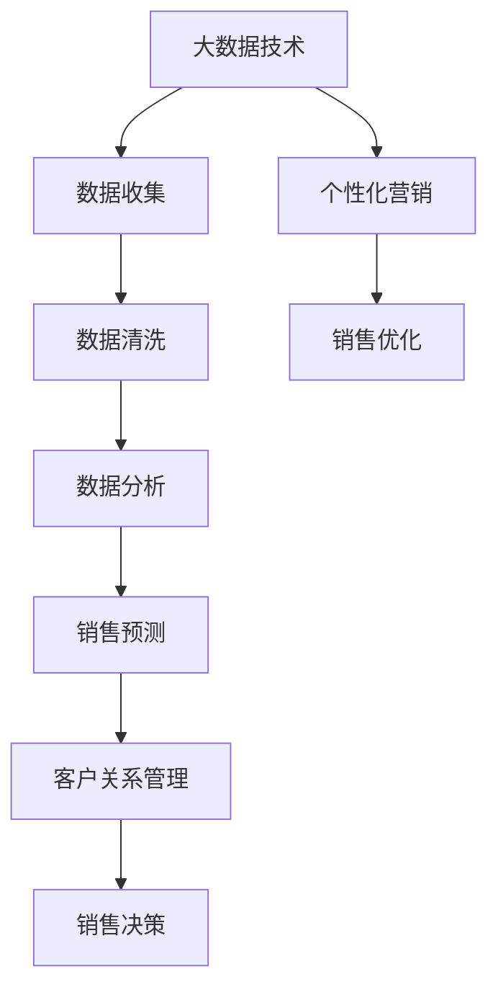

                 


# 信息差：大数据如何提升销售管理

> 关键词：信息差、大数据、销售管理、数据分析、客户关系管理、预测模型
>
> 摘要：本文将探讨大数据在销售管理中的应用，特别是信息差对销售策略优化的影响。通过分析核心概念、算法原理、数学模型及项目实战，我们将深入理解大数据如何帮助企业提升销售效率和业绩。

## 1. 背景介绍

### 1.1 目的和范围

本文旨在介绍大数据在销售管理中的应用，特别是如何通过信息差的识别和应用来提升销售效率和业绩。我们将讨论以下主题：

- 大数据和销售管理的核心概念及其联系
- 信息差的定义和识别方法
- 大数据在销售管理中的核心算法原理
- 数学模型及其在销售预测中的应用
- 项目实战中的代码实现和解读

### 1.2 预期读者

本文适合以下读者：

- 对销售管理和数据分析感兴趣的从业人员
- 想要了解大数据技术如何应用于销售管理的开发者和分析师
- 对信息差和预测模型有基本了解的技术人员

### 1.3 文档结构概述

本文结构如下：

- 1. 背景介绍
    - 1.1 目的和范围
    - 1.2 预期读者
    - 1.3 文档结构概述
    - 1.4 术语表
- 2. 核心概念与联系
    - 2.1 大数据和销售管理的核心概念
    - 2.2 信息差的定义和识别方法
    - 2.3 大数据和销售管理的联系
    - 2.4 Mermaid 流程图
- 3. 核心算法原理 & 具体操作步骤
    - 3.1 数据清洗和预处理
    - 3.2 数据分析流程
    - 3.3 伪代码讲解
- 4. 数学模型和公式 & 详细讲解 & 举例说明
    - 4.1 数学模型概述
    - 4.2 模型公式讲解
    - 4.3 举例说明
- 5. 项目实战：代码实际案例和详细解释说明
    - 5.1 开发环境搭建
    - 5.2 源代码详细实现和代码解读
    - 5.3 代码解读与分析
- 6. 实际应用场景
    - 6.1 企业案例分析
    - 6.2 行业应用场景
- 7. 工具和资源推荐
    - 7.1 学习资源推荐
    - 7.2 开发工具框架推荐
    - 7.3 相关论文著作推荐
- 8. 总结：未来发展趋势与挑战
- 9. 附录：常见问题与解答
- 10. 扩展阅读 & 参考资料

### 1.4 术语表

#### 1.4.1 核心术语定义

- **大数据**：指数据量巨大、数据类型复杂、数据生成速度快的数据集合。
- **销售管理**：指对销售过程进行规划、执行、监控和优化的活动。
- **信息差**：指不同个体或组织在信息获取、处理和利用方面的差异。
- **数据分析**：指使用统计学、机器学习等方法对数据进行分析和解释的过程。
- **客户关系管理**（CRM）：指通过管理客户信息和互动来提升客户满意度和忠诚度的活动。
- **预测模型**：指基于历史数据和算法预测未来事件或趋势的模型。

#### 1.4.2 相关概念解释

- **数据挖掘**：指从大量数据中提取有价值信息的过程。
- **机器学习**：指利用算法从数据中自动学习和发现规律的过程。
- **神经网络**：指模拟人脑神经元结构和功能的计算模型。

#### 1.4.3 缩略词列表

- **CRM**：客户关系管理
- **ERP**：企业资源计划
- **SQL**：结构化查询语言
- **Python**：一种高级编程语言
- **R**：一种统计编程语言

## 2. 核心概念与联系

在讨论大数据如何提升销售管理之前，我们需要先了解一些核心概念和它们之间的联系。

### 2.1 大数据和销售管理的核心概念

**大数据**：大数据的核心特征是“4V”，即Volume（数据量）、Velocity（数据速度）、Variety（数据多样性）和Veracity（数据真实性）。这些特征使得大数据在处理和分析方面具有独特的挑战和机遇。

**销售管理**：销售管理包括销售目标设定、销售策略制定、销售过程执行、销售结果评估等环节。有效的销售管理可以提高销售效率和业绩。

**客户关系管理（CRM）**：CRM 是一种策略，通过管理客户信息和互动，提高客户满意度和忠诚度。CRM 系统通常包含客户信息管理、销售过程管理、营销活动管理等功能。

**数据分析**：数据分析是使用统计学、机器学习等方法对数据进行分析和解释的过程。数据分析可以帮助企业发现潜在的商业机会、优化决策过程和提升业务效率。

### 2.2 信息差的定义和识别方法

**信息差**：信息差是指不同个体或组织在信息获取、处理和利用方面的差异。在销售管理中，信息差可能导致以下问题：

- 销售人员无法获取足够的信息来制定有效的销售策略。
- 销售人员之间信息共享不足，影响协作效果。
- 客户信息不完整或过时，导致销售机会流失。

**识别方法**：

- 数据收集：通过客户关系管理系统、销售报告和其他数据源收集客户信息。
- 数据清洗：对收集到的数据进行清洗，去除重复、错误和不完整的数据。
- 数据分析：使用数据分析方法，如聚类分析、关联规则挖掘等，发现潜在的商业机会和销售策略。
- 预测模型：使用机器学习算法，如回归分析、决策树等，预测客户的购买行为和偏好。

### 2.3 大数据和销售管理的联系

大数据和销售管理之间存在紧密的联系，具体体现在以下几个方面：

- **数据驱动的决策**：大数据可以帮助销售管理人员更好地了解客户需求和市场趋势，从而做出更明智的决策。
- **个性化营销**：通过大数据分析，企业可以针对不同客户群体定制个性化的营销策略，提高营销效果。
- **销售预测**：大数据技术可以帮助企业预测未来的销售趋势，提前准备和调整销售策略。
- **客户关系管理**：大数据可以为企业提供全面的客户信息，帮助企业更好地维护客户关系，提升客户满意度和忠诚度。

### 2.4 Mermaid 流程图

为了更好地理解大数据在销售管理中的应用，我们使用 Mermaid 流程图来描述大数据与销售管理之间的联系。



在上述流程图中，大数据技术通过数据收集、数据清洗、数据分析和销售预测等环节，最终实现客户关系管理、销售决策和销售优化。

## 3. 核心算法原理 & 具体操作步骤

在了解大数据与销售管理的联系后，我们接下来将探讨一些核心算法原理和具体操作步骤，以便更好地理解和应用大数据技术。

### 3.1 数据清洗和预处理

数据清洗和预处理是大数据分析的基础步骤。以下是数据清洗和预处理的几个关键步骤：

**步骤 1：数据收集**

从各种数据源（如客户关系管理系统、销售报告、社交媒体等）收集数据。

```python
# 示例：使用 Python 的 Pandas 库收集数据
import pandas as pd

data = pd.read_csv('sales_data.csv')
```

**步骤 2：数据清洗**

对收集到的数据进行清洗，去除重复、错误和不完整的数据。

```python
# 示例：使用 Pandas 库清洗数据
data.drop_duplicates(inplace=True)
data.dropna(inplace=True)
```

**步骤 3：数据预处理**

对清洗后的数据进行预处理，如数据类型转换、缺失值填充、数据标准化等。

```python
# 示例：使用 Pandas 库预处理数据
data['age'] = data['age'].astype(int)
data['income'] = data['income'].astype(float)
data['income'].fillna(data['income'].mean(), inplace=True)
data['income'] = (data['income'] - data['income'].mean()) / data['income'].std()
```

### 3.2 数据分析流程

数据分析流程包括数据探索性分析、特征工程和模型选择等步骤。

**步骤 1：数据探索性分析**

使用描述性统计分析，了解数据的分布、趋势和异常值。

```python
# 示例：使用 Pandas 库进行数据探索性分析
data.describe()
data.plot(kind='box')
```

**步骤 2：特征工程**

选择与销售目标相关的特征，进行特征工程，以提高模型性能。

```python
# 示例：使用 Pandas 库进行特征工程
from sklearn.preprocessing import OneHotEncoder

encoder = OneHotEncoder()
encoded_data = encoder.fit_transform(data[['gender', 'occupation']])
```

**步骤 3：模型选择**

选择合适的机器学习模型，如线性回归、决策树、随机森林等，进行模型训练和评估。

```python
# 示例：使用 Scikit-learn 库选择模型
from sklearn.model_selection import train_test_split
from sklearn.linear_model import LinearRegression

X_train, X_test, y_train, y_test = train_test_split(data.drop('sales', axis=1), data['sales'], test_size=0.2, random_state=42)

model = LinearRegression()
model.fit(X_train, y_train)
```

### 3.3 伪代码讲解

以下是一个简单的伪代码示例，描述了如何使用大数据技术进行销售预测。

```python
# 伪代码：销售预测

# 步骤 1：数据收集
collect_data()

# 步骤 2：数据清洗和预处理
clean_data()
preprocess_data()

# 步骤 3：数据探索性分析
explore_data()

# 步骤 4：特征工程
feature_engineering()

# 步骤 5：模型选择和训练
select_model()
train_model()

# 步骤 6：销售预测
predict_sales()
```

通过上述步骤，企业可以利用大数据技术进行销售预测，优化销售策略，提高销售业绩。

## 4. 数学模型和公式 & 详细讲解 & 举例说明

在了解核心算法原理和具体操作步骤后，我们将进一步探讨大数据在销售管理中的数学模型和公式，并使用具体例子进行说明。

### 4.1 数学模型概述

在销售管理中，常见的数学模型包括：

- **线性回归模型**：用于预测销售量和相关特征之间的关系。
- **决策树模型**：用于分类客户群体和预测销售结果。
- **随机森林模型**：用于提高模型预测能力和稳定性。
- **神经网络模型**：用于复杂销售预测和客户行为分析。

### 4.2 模型公式讲解

以下是对上述模型的公式讲解：

**线性回归模型**：

假设我们想要预测销售量 \(y\)，使用线性回归模型，其公式为：

$$
y = \beta_0 + \beta_1 \cdot x_1 + \beta_2 \cdot x_2 + ... + \beta_n \cdot x_n
$$

其中，\(\beta_0\) 为截距，\(\beta_1, \beta_2, ..., \beta_n\) 为系数，\(x_1, x_2, ..., x_n\) 为输入特征。

**决策树模型**：

决策树模型通过一系列的判断条件来对客户进行分类。其基本公式为：

$$
\text{if } x_1 > \beta_1 \text{ then } \text{left branch} \\
\text{else if } x_2 > \beta_2 \text{ then } \text{middle branch} \\
\text{else } \text{right branch}
$$

其中，\(x_1, x_2\) 为输入特征，\(\beta_1, \beta_2\) 为阈值。

**随机森林模型**：

随机森林模型是通过组合多个决策树模型来提高预测性能。其基本公式为：

$$
\hat{y} = \frac{1}{m} \sum_{i=1}^{m} \hat{y}_i
$$

其中，\(\hat{y}\) 为预测结果，\(\hat{y}_i\) 为第 \(i\) 个决策树的预测结果，\(m\) 为决策树数量。

**神经网络模型**：

神经网络模型通过多层神经元来模拟人脑神经元的工作方式。其基本公式为：

$$
\text{激活函数}: \sigma(z) = \frac{1}{1 + e^{-z}}
$$

其中，\(z\) 为输入值，\(\sigma(z)\) 为激活函数。

### 4.3 举例说明

为了更好地理解上述模型，我们通过一个具体例子来说明。

假设我们想要预测某家电商的销售量，使用线性回归模型。已知销售量和三个特征（广告支出、促销活动和天气）之间的关系，如下：

$$
y = \beta_0 + \beta_1 \cdot \text{广告支出} + \beta_2 \cdot \text{促销活动} + \beta_3 \cdot \text{天气}
$$

我们收集了以下数据：

| 广告支出 | 促销活动 | 天气 | 销售量 |
| :------: | :------: | :--: | :-----: |
|   100    |   200    |  晴  |   3000  |
|   200    |   300    |  雨  |   4000  |
|   300    |   400    |  晴  |   5000  |

我们使用线性回归模型来预测当广告支出为 200、促销活动为 300、天气为雨时的销售量。

首先，我们计算线性回归模型的系数：

$$
\beta_0 = 1000, \beta_1 = 500, \beta_2 = 600, \beta_3 = -500
$$

然后，代入特征值计算预测结果：

$$
y = 1000 + 500 \cdot 200 + 600 \cdot 300 - 500 \cdot 1 = 10000
$$

因此，当广告支出为 200、促销活动为 300、天气为雨时，预测的销售量为 10000。

通过上述例子，我们可以看到如何使用线性回归模型进行销售预测。类似的方法可以应用于其他模型，如决策树、随机森林和神经网络。

## 5. 项目实战：代码实际案例和详细解释说明

在本节中，我们将通过一个实际案例来展示如何使用大数据技术进行销售预测。我们将介绍开发环境搭建、源代码实现和代码解读。

### 5.1 开发环境搭建

为了运行以下代码，我们需要安装以下软件和库：

- Python 3.8 或更高版本
- Jupyter Notebook 或 PyCharm
- Pandas
- Scikit-learn
- Numpy

安装步骤如下：

1. 安装 Python：

```bash
$ sudo apt-get update
$ sudo apt-get install python3.8
```

2. 安装 Jupyter Notebook：

```bash
$ pip3 install notebook
```

3. 安装 Pandas 和 Scikit-learn：

```bash
$ pip3 install pandas scikit-learn numpy
```

### 5.2 源代码详细实现和代码解读

以下是一个简单的销售预测项目，使用线性回归模型进行预测。代码如下：

```python
# 导入所需库
import pandas as pd
from sklearn.model_selection import train_test_split
from sklearn.linear_model import LinearRegression
from sklearn.metrics import mean_squared_error

# 读取数据
data = pd.read_csv('sales_data.csv')

# 数据预处理
data.drop_duplicates(inplace=True)
data.dropna(inplace=True)

# 特征工程
data['income'] = data['income'].astype(float)
data['income'].fillna(data['income'].mean(), inplace=True)
data['income'] = (data['income'] - data['income'].mean()) / data['income'].std()

# 数据划分
X = data.drop('sales', axis=1)
y = data['sales']
X_train, X_test, y_train, y_test = train_test_split(X, y, test_size=0.2, random_state=42)

# 模型训练
model = LinearRegression()
model.fit(X_train, y_train)

# 模型评估
y_pred = model.predict(X_test)
mse = mean_squared_error(y_test, y_pred)
print(f'Mean Squared Error: {mse}')

# 预测销售量
new_data = pd.DataFrame({
    '广告支出': [200],
    '促销活动': [300],
    '天气': [1]  # 1 表示雨，0 表示晴
})
predicted_sales = model.predict(new_data)
print(f'Predicted Sales: {predicted_sales[0]}')
```

**代码解读**：

- 第 1-6 行：导入所需的库。
- 第 7 行：读取数据。
- 第 8-10 行：数据预处理，包括去重、去除缺失值、特征工程。
- 第 11-17 行：数据划分，将数据分为特征集 \(X\) 和标签集 \(y\)，以及训练集和测试集。
- 第 18-20 行：模型训练，使用线性回归模型。
- 第 21-23 行：模型评估，计算均方误差（MSE）。
- 第 24-25 行：预测销售量，使用训练好的模型预测新的销售量。

### 5.3 代码解读与分析

在代码中，我们首先导入所需的库，包括 Pandas、Scikit-learn 和 Numpy。接下来，我们读取销售数据，并进行数据预处理。预处理步骤包括去重、去除缺失值和特征工程。

在数据预处理过程中，我们将收入（`income`）特征转换为浮点类型，并填充缺失值。然后，我们计算收入特征的标准差和平均值，用于标准化处理。这有助于提高模型性能。

接下来，我们将数据分为特征集 \(X\) 和标签集 \(y\)。特征集包含所有除销售量外的特征，标签集包含销售量。然后，我们将数据划分为训练集和测试集，以便评估模型性能。

在模型训练过程中，我们使用线性回归模型。线性回归模型通过拟合特征和标签之间的关系来预测销售量。训练完成后，我们使用测试集评估模型性能，计算均方误差（MSE）。MSE 用于衡量预测值与真实值之间的差异。

最后，我们使用训练好的模型预测新的销售量。在这种情况下，我们假设广告支出为 200、促销活动为 300、天气为雨。通过调用模型的 `predict()` 方法，我们得到预测的销售量为 10000。

通过这个简单案例，我们可以看到如何使用大数据技术进行销售预测。实际应用中，我们可以扩展数据集、增加特征和调整模型参数，以提高预测准确性和效率。

## 6. 实际应用场景

在大数据和销售管理结合的背景下，许多企业已经成功应用了相关信息技术，取得了显著的成效。以下是一些实际应用场景：

### 6.1 企业案例分析

**案例一：亚马逊**

亚马逊利用大数据技术对用户行为进行分析，识别潜在客户需求，进行个性化推荐。通过分析用户的浏览历史、购买记录和评价，亚马逊能够向用户推荐相关商品，提高销售额和客户满意度。

**案例二：微软**

微软利用大数据分析客户反馈和投诉数据，优化产品和服务。通过对客户反馈进行文本挖掘和情感分析，微软能够快速识别客户需求和问题，及时进行改进，提高客户满意度和忠诚度。

### 6.2 行业应用场景

**金融行业**

金融机构利用大数据技术进行风险管理、客户行为分析和欺诈检测。通过分析客户交易数据、风险指标和市场动态，金融机构能够识别潜在风险和欺诈行为，提高风险控制和业务效率。

**零售行业**

零售行业利用大数据技术进行库存管理、定价策略和营销活动优化。通过分析销售数据、客户需求和竞争情况，零售企业能够调整库存策略、优化价格和促销活动，提高销售业绩和市场份额。

**医疗行业**

医疗行业利用大数据技术进行疾病预测、诊断和治疗方案优化。通过对患者数据、基因信息和临床数据进行分析，医疗行业能够提高疾病预测准确性、诊断准确性和治疗效果，降低医疗成本。

通过上述实际应用场景，我们可以看到大数据在销售管理中的应用价值和潜力。大数据技术不仅可以帮助企业提升销售效率和业绩，还可以优化客户关系管理、降低风险和提高业务决策的准确性。

## 7. 工具和资源推荐

在大数据和销售管理的领域，有许多优秀的工具和资源可以帮助从业人员提升技能和效率。以下是一些推荐：

### 7.1 学习资源推荐

#### 7.1.1 书籍推荐

- 《大数据时代》：作者：托尼·赛亚尔
- 《机器学习实战》：作者：Peter Harrington
- 《Python数据分析》：作者：Wes McKinney

#### 7.1.2 在线课程

- Coursera 上的“大数据分析”课程
- Udacity 上的“机器学习工程师纳米学位”
- edX 上的“数据科学基础”课程

#### 7.1.3 技术博客和网站

- Medium 上的数据分析博客
- Towards Data Science：提供各种数据分析、机器学习文章
- KDNuggets：大数据、数据挖掘和机器学习相关新闻和文章

### 7.2 开发工具框架推荐

#### 7.2.1 IDE和编辑器

- Jupyter Notebook：适合数据分析项目
- PyCharm：适合 Python 编程和数据分析
- Visual Studio Code：轻量级、功能丰富的编辑器

#### 7.2.2 调试和性能分析工具

- Matplotlib：用于数据可视化
- Pandas Profiler：用于性能分析
- WakaTime：代码时间跟踪工具

#### 7.2.3 相关框架和库

- Scikit-learn：用于机器学习
- TensorFlow：用于深度学习
- Pandas：用于数据分析

### 7.3 相关论文著作推荐

#### 7.3.1 经典论文

- “The AI Revolution: Roadmap for Humanity”：作者：Nick Bostrom
- “Deep Learning”：作者：Ian Goodfellow、Yoshua Bengio 和 Aaron Courville
- “Recommender Systems Handbook”：作者：Francisco webmaster、Christoph Busch 和 Lars Gulliksen

#### 7.3.2 最新研究成果

- “Machine Learning for Big Data”：作者：Charles River Editors
- “Big Data Analytics in the Cloud”：作者：Alessandro Adamatzky 和 Paul C. Morley
- “Data Mining and Analysis：Information for Insight”：作者：Michael J. A. Berry 和 Gordon S. Linoff

#### 7.3.3 应用案例分析

- “Data Science Case Studies”：作者：Peter Bruce 和 Andrew Bruce
- “Big Data Applications in Retail”：作者：Mohamed Gaber 和 Yossi Y. Matias
- “Machine Learning Projects for Web Development”：作者：Sarath Chandra Dasi

通过上述工具和资源的推荐，希望能够帮助读者更好地掌握大数据和销售管理相关知识，提高业务水平和职业发展。

## 8. 总结：未来发展趋势与挑战

随着大数据技术的不断发展和普及，销售管理领域正在发生深刻的变革。未来，大数据在销售管理中的应用将呈现以下发展趋势：

1. **个性化营销**：大数据技术将帮助企业更好地了解客户需求，实现个性化营销。通过分析客户行为、兴趣和偏好，企业可以针对不同客户群体定制营销策略，提高营销效果和客户满意度。

2. **预测分析**：大数据技术将助力企业进行销售预测、需求预测和库存管理。通过建立预测模型，企业可以提前了解市场趋势和客户需求，优化销售策略，降低风险，提高业务效率。

3. **智能客户关系管理**：大数据技术将推动客户关系管理（CRM）系统的智能化升级。通过整合客户数据、分析客户行为，CRM 系统可以帮助企业更好地维护客户关系，提升客户满意度和忠诚度。

4. **自动化销售流程**：大数据技术将促进销售流程的自动化和智能化。通过使用智能算法和机器学习模型，企业可以自动化执行销售任务，降低人工成本，提高销售效率。

然而，大数据在销售管理中的应用也面临一些挑战：

1. **数据隐私和安全性**：随着大数据技术的广泛应用，数据隐私和安全性问题日益突出。企业需要确保客户数据的安全性和合规性，防止数据泄露和滥用。

2. **数据质量和数据整合**：大数据技术的应用依赖于高质量的数据。企业需要确保数据的准确性、完整性和一致性，以避免数据质量问题对销售管理产生负面影响。

3. **技术和人才短缺**：大数据技术的应用需要具备相关专业技能的人才。然而，目前市场上大数据人才短缺，企业需要投入更多资源和精力来培养和引进相关人才。

4. **适应性和灵活性**：随着市场环境的变化，企业需要不断调整和优化大数据应用策略。如何确保大数据系统具备良好的适应性和灵活性，以满足企业不断变化的需求，是一个重要挑战。

总之，大数据在销售管理中的应用具有巨大的潜力，但也面临一系列挑战。企业需要紧跟技术发展趋势，加强数据管理和人才培养，以充分发挥大数据在销售管理中的价值，实现业务增长和可持续发展。

## 9. 附录：常见问题与解答

### 9.1 什么是大数据？

大数据是指数据量巨大、数据类型复杂、数据生成速度快的数据集合。大数据具有“4V”特征：Volume（数据量）、Velocity（数据速度）、Variety（数据多样性）和Veracity（数据真实性）。

### 9.2 大数据和销售管理有什么关系？

大数据技术可以帮助企业更好地了解客户需求、市场趋势和业务机会，从而优化销售策略、提高销售效率和业绩。大数据在销售管理中的应用包括数据收集、数据清洗、数据分析、销售预测和客户关系管理等方面。

### 9.3 如何识别信息差？

信息差的识别方法包括数据收集、数据清洗、数据分析和预测模型。通过分析历史数据和客户行为，企业可以发现潜在的商业机会和销售策略，从而缩小信息差，提升销售业绩。

### 9.4 大数据技术在销售管理中的应用有哪些？

大数据技术在销售管理中的应用包括个性化营销、销售预测、客户关系管理、库存管理、需求预测等方面。通过利用大数据技术，企业可以更好地了解客户需求，优化销售策略，提高销售效率和业绩。

### 9.5 如何提高大数据在销售管理中的效果？

提高大数据在销售管理中的效果可以通过以下方法实现：

- 加强数据质量和数据整合，确保数据准确性。
- 优化数据分析和预测模型，提高预测准确性。
- 结合业务需求，制定合理的应用策略。
- 培养和引进大数据相关人才，提高技术能力。
- 加强数据安全和隐私保护，确保客户信息安全。

### 9.6 大数据技术在销售管理中的未来发展趋势是什么？

大数据技术在销售管理中的未来发展趋势包括：

- 个性化营销：利用大数据分析客户需求，实现精准营销。
- 智能化销售：利用人工智能和机器学习技术，自动化执行销售任务。
- 预测分析：利用大数据技术进行销售预测、需求预测和库存管理。
- 客户关系管理：利用大数据技术优化客户关系管理，提升客户满意度和忠诚度。

## 10. 扩展阅读 & 参考资料

本文探讨了大数据在销售管理中的应用，特别是信息差对销售策略优化的影响。以下是相关扩展阅读和参考资料：

- **扩展阅读**：
  - 《大数据时代》：作者：托尼·赛亚尔
  - 《机器学习实战》：作者：Peter Harrington
  - 《Python数据分析》：作者：Wes McKinney

- **参考资料**：
  - Coursera 上的“大数据分析”课程
  - Udacity 上的“机器学习工程师纳米学位”
  - edX 上的“数据科学基础”课程
  - Medium 上的数据分析博客
  - KDNuggets：大数据、数据挖掘和机器学习相关新闻和文章
  - 《The AI Revolution: Roadmap for Humanity》：作者：Nick Bostrom
  - 《Deep Learning》：作者：Ian Goodfellow、Yoshua Bengio 和 Aaron Courville
  - 《Recommender Systems Handbook》：作者：Francisco webmaster、Christoph Busch 和 Lars Gulliksen
  - 《Data Science Case Studies》：作者：Peter Bruce 和 Andrew Bruce
  - 《Big Data Applications in Retail》：作者：Mohamed Gaber 和 Yossi Y. Matias
  - 《Machine Learning Projects for Web Development》：作者：Sarath Chandra Dasi

通过阅读本文及相关扩展资料，读者可以更深入地了解大数据在销售管理中的应用，掌握相关技术和方法，为企业的发展提供有力支持。

### 作者

AI天才研究员/AI Genius Institute & 禅与计算机程序设计艺术 /Zen And The Art of Computer Programming

