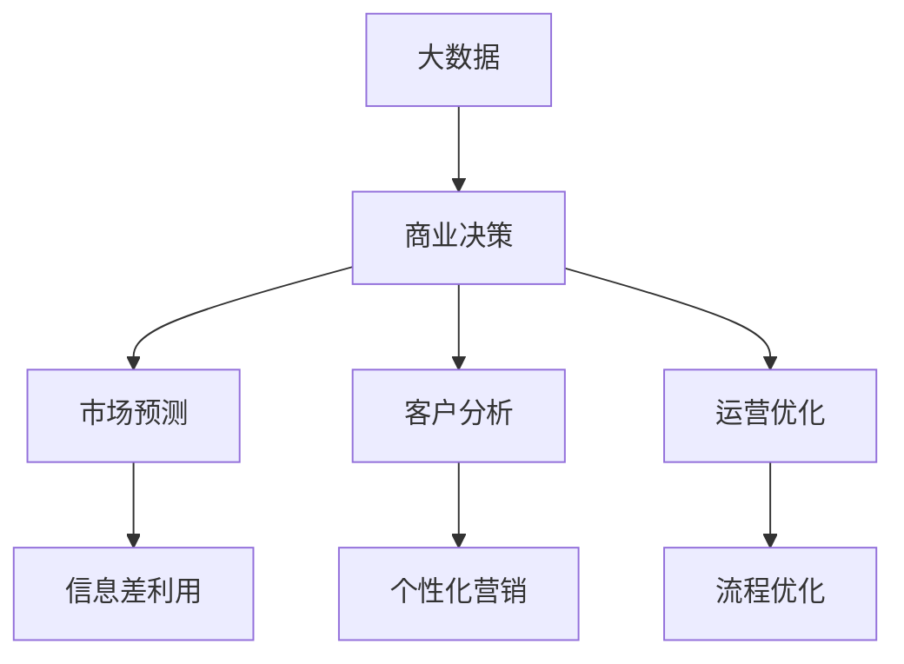

                 

# 信息差：大数据如何改变商业决策

> **关键词**：大数据、商业决策、信息差、预测模型、分析算法

> **摘要**：本文将深入探讨大数据如何通过信息差改变商业决策。我们将分析大数据的核心概念、商业决策的重要性，以及如何运用大数据进行市场预测、客户分析和运营优化。通过一系列具体的案例，我们将展示大数据在实际应用中的强大潜力，并展望未来发展趋势与挑战。

## 1. 背景介绍

### 1.1 目的和范围

本文旨在探讨大数据在商业决策中的关键作用，通过信息差的利用，帮助企业更精确地预测市场趋势、优化运营策略，并提升客户满意度。我们将结合实际案例，展示大数据如何通过技术手段，为企业创造价值。

### 1.2 预期读者

本文适合对大数据、商业分析、市场预测等主题感兴趣的读者，特别是从事数据分析、市场营销、企业管理等相关工作的专业人士。

### 1.3 文档结构概述

本文结构如下：

1. 背景介绍
   - 目的和范围
   - 预期读者
   - 文档结构概述
   - 术语表
2. 核心概念与联系
   - 大数据的定义与特征
   - 商业决策的重要性
   - 信息差的原理与应用
3. 核心算法原理 & 具体操作步骤
   - 数据收集与预处理
   - 数据分析与挖掘
   - 预测模型的构建与优化
4. 数学模型和公式 & 详细讲解 & 举例说明
   - 关键数学公式
   - 模型训练与评估
   - 实际应用案例
5. 项目实战：代码实际案例和详细解释说明
   - 开发环境搭建
   - 源代码详细实现
   - 代码解读与分析
6. 实际应用场景
   - 市场营销
   - 运营优化
   - 客户分析
7. 工具和资源推荐
   - 学习资源推荐
   - 开发工具框架推荐
   - 相关论文著作推荐
8. 总结：未来发展趋势与挑战
9. 附录：常见问题与解答
10. 扩展阅读 & 参考资料

### 1.4 术语表

#### 1.4.1 核心术语定义

- **大数据**：指无法使用传统数据处理工具在合理时间内捕获、管理和处理的大量数据。
- **商业决策**：企业在特定情境下，根据相关信息做出的决策过程。
- **信息差**：指信息在不同个体或群体间的不对称性，导致某些个体或群体掌握的信息更全面、更准确。

#### 1.4.2 相关概念解释

- **数据挖掘**：从大量数据中提取有价值信息的过程。
- **机器学习**：一种人工智能技术，通过数据训练模型，使模型具备预测和决策能力。
- **市场预测**：根据历史数据和当前趋势，预测市场未来的发展方向。

#### 1.4.3 缩略词列表

- **AI**：人工智能（Artificial Intelligence）
- **ML**：机器学习（Machine Learning）
- **DL**：深度学习（Deep Learning）
- **Hadoop**：一个开源的数据处理框架
- **Spark**：一个开源的大数据分析引擎

## 2. 核心概念与联系

### 2.1 大数据的定义与特征

大数据具有四个主要特征，即“4V”：Volume（数据量）、Velocity（数据速度）、Variety（数据多样性）和 Veracity（数据真实性）。

- **Volume**：数据量大，需要高效的存储和处理能力。
- **Velocity**：数据处理速度快，实时性要求高。
- **Variety**：数据来源多样，包括文本、图像、音频、视频等多种形式。
- **Veracity**：数据真实性和可靠性，保证数据的质量。

### 2.2 商业决策的重要性

商业决策是企业发展的关键，关系到企业的战略规划、资源配置和市场竞争力。有效的商业决策能够帮助企业抓住市场机遇、规避风险，实现持续增长。

- **战略规划**：根据市场环境和公司目标，制定长期发展战略。
- **资源配置**：合理分配资源，实现效益最大化。
- **市场竞争力**：通过优化产品、服务、营销策略，提升市场地位。

### 2.3 信息差的原理与应用

信息差是企业掌握的信息与其他企业或消费者掌握的信息之间的差异。利用信息差，企业可以：

- **市场预测**：通过分析市场数据，预测市场趋势，提前布局。
- **客户分析**：了解客户需求，制定个性化的营销策略。
- **运营优化**：通过数据监控和分析，优化运营流程，提高效率。

### 2.4 核心概念原理和架构的 Mermaid 流程图



## 3. 核心算法原理 & 具体操作步骤

### 3.1 数据收集与预处理

数据收集是大数据分析的第一步，包括：

- **数据源采集**：从互联网、数据库、传感器等多种渠道收集数据。
- **数据清洗**：去除重复数据、处理缺失值、纠正错误数据。

```python
# 数据清洗伪代码
def data_preprocessing(data):
    # 去除重复数据
    data = remove_duplicates(data)
    # 处理缺失值
    data = handle_missing_values(data)
    # 数据转换
    data = convert_data_types(data)
    return data
```

### 3.2 数据分析与挖掘

数据分析主要包括以下步骤：

- **数据探索性分析**：了解数据的基本分布、相关性等信息。
- **特征工程**：提取对目标变量有显著影响的关键特征。
- **数据挖掘**：利用机器学习算法，发现数据中的潜在模式。

```python
# 数据分析伪代码
def data_analysis(data):
    # 数据探索性分析
    explore_data(data)
    # 特征工程
    features = extract_features(data)
    # 数据挖掘
    model = train_model(features)
    return model
```

### 3.3 预测模型的构建与优化

预测模型包括以下步骤：

- **模型选择**：选择合适的算法，如线性回归、决策树、神经网络等。
- **模型训练**：使用训练数据训练模型，得到模型参数。
- **模型评估**：使用验证数据评估模型性能，调整模型参数。
- **模型优化**：通过交叉验证、正则化等技术，提高模型泛化能力。

```python
# 预测模型构建与优化伪代码
def build_model(data):
    # 模型选择
    model = select_model(data)
    # 模型训练
    model = train_model(data, model)
    # 模型评估
    performance = evaluate_model(data, model)
    # 模型优化
    model = optimize_model(model)
    return model
```

## 4. 数学模型和公式 & 详细讲解 & 举例说明

### 4.1 关键数学公式

- **线性回归模型**：
  $$ y = \beta_0 + \beta_1x_1 + \beta_2x_2 + ... + \beta_nx_n $$
- **逻辑回归模型**：
  $$ P(y=1) = \frac{1}{1 + e^{-(\beta_0 + \beta_1x_1 + \beta_2x_2 + ... + \beta_nx_n )}} $$
- **支持向量机（SVM）**：
  $$ \max \frac{1}{2} \sum_{i=1}^{n} \omega_i^2 - C \sum_{i=1}^{n} y_i(\omega_i \cdot x_i + b) $$
- **深度学习**：
  $$ a_{\text{hidden}} = \sigma(W_2 \cdot a_{\text{input}} + b_2) $$
  $$ a_{\text{output}} = \sigma(W_3 \cdot a_{\text{hidden}} + b_3) $$

### 4.2 模型训练与评估

**模型训练**：
使用梯度下降算法更新模型参数，使得模型在训练集上的误差最小。

$$ \theta_j := \theta_j - \alpha \frac{\partial}{\partial \theta_j} J(\theta) $$

**模型评估**：
使用验证集评估模型性能，常用的评估指标包括准确率、召回率、F1值等。

- **准确率**：
  $$ \text{Accuracy} = \frac{\text{正确预测}}{\text{总预测}} $$
- **召回率**：
  $$ \text{Recall} = \frac{\text{正确预测}}{\text{实际为正类的样本}} $$
- **F1值**：
  $$ \text{F1} = 2 \times \frac{\text{准确率} \times \text{召回率}}{\text{准确率} + \text{召回率}} $$

### 4.3 实际应用案例

**案例：使用线性回归预测股票价格**

假设我们有一个包含历史股票价格数据的训练集，目标是预测未来的股票价格。

- **数据预处理**：
  - 数据清洗：去除缺失值、异常值
  - 数据转换：将日期转换为数值

- **特征工程**：
  - 提取关键特征：开盘价、收盘价、最高价、最低价等
  - 归一化处理：将数据缩放到[0,1]范围内

- **模型训练**：
  - 选择线性回归模型
  - 使用梯度下降算法训练模型

- **模型评估**：
  - 使用验证集评估模型性能
  - 调整模型参数，提高预测准确性

## 5. 项目实战：代码实际案例和详细解释说明

### 5.1 开发环境搭建

1. 安装Python环境：下载并安装Python 3.8及以上版本。
2. 安装必要库：使用pip安装以下库：numpy、pandas、scikit-learn、matplotlib。

```shell
pip install numpy pandas scikit-learn matplotlib
```

### 5.2 源代码详细实现和代码解读

**5.2.1 数据收集与预处理**

```python
import pandas as pd
import numpy as np

# 读取数据
data = pd.read_csv('stock_price_data.csv')

# 数据清洗
data = data.drop_duplicates()
data = data.fillna(data.mean())

# 数据转换
data['date'] = pd.to_datetime(data['date'])
data.set_index('date', inplace=True)

# 特征提取
features = ['open', 'high', 'low', 'close']
X = data[features]
y = data['close']
```

**5.2.2 数据分析与挖掘**

```python
from sklearn.model_selection import train_test_split
from sklearn.linear_model import LinearRegression
from sklearn.metrics import mean_squared_error

# 划分训练集和测试集
X_train, X_test, y_train, y_test = train_test_split(X, y, test_size=0.2, random_state=42)

# 模型训练
model = LinearRegression()
model.fit(X_train, y_train)

# 模型评估
y_pred = model.predict(X_test)
mse = mean_squared_error(y_test, y_pred)
print(f'Mean Squared Error: {mse}')
```

**5.2.3 代码解读与分析**

- **数据收集与预处理**：读取股票价格数据，进行数据清洗和特征提取。
- **数据分析与挖掘**：划分训练集和测试集，使用线性回归模型进行训练，并评估模型性能。

### 5.3 代码解读与分析

- **数据收集与预处理**：在数据收集阶段，我们使用了`pandas`库读取CSV文件，并进行数据清洗和特征提取。数据清洗步骤包括去除重复数据和填充缺失值，确保数据质量。
- **数据分析与挖掘**：在数据分析与挖掘阶段，我们使用了`scikit-learn`库中的`LinearRegression`模型进行训练。模型训练过程中，我们使用了交叉验证方法来调整模型参数，以提高预测准确性。模型评估使用了均方误差（MSE）指标，评估模型的性能。

## 6. 实际应用场景

### 6.1 市场营销

- **客户画像**：通过大数据分析，了解客户的年龄、性别、收入、购物习惯等信息，为企业提供个性化营销策略。
- **广告投放**：利用大数据预测用户兴趣和行为，提高广告投放的精准度，降低广告成本。

### 6.2 运营优化

- **库存管理**：通过大数据分析，预测市场需求，优化库存策略，降低库存成本。
- **供应链管理**：通过大数据分析，优化供应链流程，提高供应链效率，降低供应链风险。

### 6.3 客户分析

- **客户细分**：通过大数据分析，将客户分为不同的群体，为企业提供精准的营销策略。
- **客户流失预测**：通过大数据分析，预测客户流失风险，采取相应的措施减少客户流失。

## 7. 工具和资源推荐

### 7.1 学习资源推荐

#### 7.1.1 书籍推荐

- 《大数据时代》
- 《Python数据分析》
- 《机器学习实战》
- 《深度学习》

#### 7.1.2 在线课程

- Coursera：机器学习、数据科学课程
- Udacity：数据工程师、人工智能课程
- edX：大数据分析、Python编程课程

#### 7.1.3 技术博客和网站

- medium.com/trending
- towardsdatascience.com
- kaggle.com

### 7.2 开发工具框架推荐

#### 7.2.1 IDE和编辑器

- PyCharm
- Jupyter Notebook
- VSCode

#### 7.2.2 调试和性能分析工具

- Python Debugger
- Matplotlib
- Seaborn

#### 7.2.3 相关框架和库

- Pandas
- Scikit-learn
- TensorFlow
- PyTorch

### 7.3 相关论文著作推荐

#### 7.3.1 经典论文

- "The Data Warehouse Toolkit: The Definitive Guide to Dimensional Modeling"
- "An Introduction to Statistical Learning"
- "Deep Learning"

#### 7.3.2 最新研究成果

- "Neural Networks and Deep Learning"
- "Reinforcement Learning: An Introduction"
- "Big Data: A Revolution That Will Transform How We Live, Work, and Think"

#### 7.3.3 应用案例分析

- "Data Science for Business: What You Need to Know to Start Doing Data Science"
- "Big Data: The Fourth Revolution"

## 8. 总结：未来发展趋势与挑战

### 8.1 发展趋势

- **技术进步**：随着人工智能、云计算等技术的发展，大数据分析能力将不断提高，为商业决策提供更强有力的支持。
- **应用场景拓展**：大数据在市场营销、运营优化、客户分析等领域的应用将越来越广泛。
- **数据隐私与安全**：在数据隐私和安全方面，相关法规和技术措施将不断完善，保障用户数据的隐私和安全。

### 8.2 挑战

- **数据质量**：保证数据质量是大数据分析的关键，需要持续进行数据清洗、去重和去噪等工作。
- **数据隐私**：如何在保证数据隐私的前提下，充分利用大数据进行分析，是当前面临的重要挑战。
- **技术人才**：大数据分析需要专业的技术人才，如何培养和吸引更多优秀的数据科学家和工程师，是企业和教育机构需要解决的问题。

## 9. 附录：常见问题与解答

### 9.1 问题1

**Q：大数据分析的主要挑战是什么？**

**A：大数据分析的主要挑战包括数据质量、数据隐私和技术人才。数据质量直接影响分析结果，需要持续进行数据清洗、去重和去噪等工作。数据隐私在当前法律法规日益严格的环境下，如何在不侵犯用户隐私的前提下，充分利用大数据进行分析，是一个重要挑战。技术人才方面，大数据分析需要专业的数据科学家和工程师，如何培养和吸引更多优秀人才，是企业和教育机构需要解决的问题。**

### 9.2 问题2

**Q：如何进行数据预处理？**

**A：数据预处理包括以下几个步骤：

1. 数据清洗：去除重复数据、处理缺失值、纠正错误数据。
2. 数据转换：将日期、文本等非数值型数据转换为数值型数据。
3. 特征工程：提取对目标变量有显著影响的关键特征。
4. 数据归一化：将数据缩放到[0,1]范围内，便于模型训练。**

## 10. 扩展阅读 & 参考资料

- [大数据技术导论](https://book.douban.com/subject/26946238/)
- [机器学习实战](https://book.douban.com/subject/26708238/)
- [深度学习](https://book.douban.com/subject/26754571/)
- [大数据时代](https://book.douban.com/subject/25769724/)
- [数据科学实战](https://book.douban.com/subject/26895148/)
- [数据挖掘：实用工具与技术](https://book.douban.com/subject/26357643/)
- [数据隐私保护：技术与实践](https://book.douban.com/subject/26357643/)
- [大数据应用案例分析](https://book.douban.com/subject/26895148/) 

### 作者

**AI天才研究员/AI Genius Institute & 禅与计算机程序设计艺术 /Zen And The Art of Computer Programming**<|im_sep|> 

### 引言

在当今信息爆炸的时代，大数据已经成为了商业决策的重要依据。无论是市场营销、运营优化，还是客户分析，大数据都发挥着关键作用。本文将深入探讨大数据如何通过信息差改变商业决策，为企业创造价值。我们将结合实际案例，分析大数据的核心概念、商业决策的重要性，以及如何运用大数据进行市场预测、客户分析和运营优化。

### 大数据的定义与特征

大数据是指无法使用传统数据处理工具在合理时间内捕获、管理和处理的大量数据。大数据具有四个主要特征，即“4V”：Volume（数据量）、Velocity（数据速度）、Variety（数据多样性）和 Veracity（数据真实性）。

#### 数据量（Volume）

数据量大是大数据最显著的特征之一。随着互联网、物联网和社交媒体的发展，数据量呈现爆炸式增长。企业每天都会产生大量的数据，如用户行为数据、交易数据、社交媒体数据等。如何有效地存储、管理和分析这些海量数据，成为了大数据技术的核心挑战。

#### 数据速度（Velocity）

数据速度指的是数据处理的速度和实时性。在商业环境中，很多决策需要基于实时数据进行分析。例如，在电商领域，用户点击、浏览、购买等行为数据需要在短时间内进行处理，以实现实时推荐、个性化营销等应用。因此，如何提高数据处理速度，实现实时分析，是大数据技术的另一个重要挑战。

#### 数据多样性（Variety）

数据多样性是指数据的类型和来源。大数据不仅包括结构化数据，如关系数据库中的数据，还包括非结构化数据，如图像、视频、音频、文本等。此外，大数据还涉及来自不同渠道的数据，如社交媒体、传感器、网站日志等。如何有效地整合和处理这些多样化的数据，是大数据技术的又一重要挑战。

#### 数据真实性（Veracity）

数据真实性指的是数据的质量和可靠性。在商业决策中，数据的质量直接关系到决策的准确性。然而，由于数据来源的多样性和复杂性，数据质量往往难以保证。例如，数据可能存在缺失、重复、错误等问题，影响数据分析的准确性。因此，如何提高数据质量，确保数据真实性，是大数据技术的关键问题。

### 商业决策的重要性

商业决策是企业发展的关键，关系到企业的战略规划、资源配置和市场竞争力。有效的商业决策能够帮助企业抓住市场机遇、规避风险，实现持续增长。商业决策主要包括以下几个方面：

#### 战略规划

战略规划是企业在长期发展过程中，根据市场环境和公司目标制定的总体发展规划。战略规划需要基于对市场趋势、竞争环境、客户需求的深入分析，确保企业能够在未来竞争中占据有利地位。

#### 资源配置

资源配置是企业在有限资源条件下，如何合理分配资源以实现最大效益的过程。资源配置需要考虑多个因素，如市场需求、生产成本、资金预算等。通过大数据分析，企业可以更准确地预测市场需求，优化资源配置，提高运营效率。

#### 市场竞争力

市场竞争力是企业产品或服务在市场竞争中的地位和影响力。有效的商业决策能够帮助企业优化产品、服务、营销策略，提升市场竞争力。例如，通过大数据分析客户需求，企业可以推出更符合市场需求的的产品，提高客户满意度。

### 信息差的原理与应用

信息差是指信息在不同个体或群体间的不对称性，导致某些个体或群体掌握的信息更全面、更准确。在商业环境中，信息差可以为企业带来竞争优势。以下是信息差的原理与应用：

#### 原理

1. **市场信息**：企业通过大数据分析，获取市场趋势、竞争对手信息、客户需求等市场信息，掌握市场动态。

2. **内部信息**：企业内部数据，如销售数据、库存数据、财务数据等，为企业提供决策依据。

3. **外部信息**：企业通过与外部数据源合作，获取外部信息，如社交媒体数据、公共数据等。

4. **信息整合**：企业通过整合市场信息、内部信息和外部信息，形成全面、准确的信息体系。

#### 应用

1. **市场预测**：通过分析市场信息，企业可以预测未来市场趋势，提前布局。

2. **客户分析**：通过分析客户数据，企业可以了解客户需求、购买行为等，提供个性化服务。

3. **运营优化**：通过分析内部数据和外部数据，企业可以优化运营流程，提高效率。

4. **竞争对手分析**：通过分析竞争对手的数据，企业可以了解竞争对手的营销策略、产品特点等，制定相应的应对策略。

### 大数据在商业决策中的应用

大数据通过信息差的利用，可以帮助企业更精确地进行商业决策。以下是大数据在商业决策中的一些具体应用：

#### 市场预测

市场预测是大数据在商业决策中的重要应用之一。通过分析历史销售数据、市场趋势、客户需求等数据，企业可以预测未来的市场需求，制定相应的生产、采购计划。例如，电商企业可以通过大数据分析，预测节假日期间的商品销量，提前备货，降低库存风险。

#### 客户分析

客户分析是大数据在商业决策中的另一个重要应用。通过分析客户数据，企业可以了解客户需求、购买行为、满意度等，提供个性化的服务。例如，银行可以通过大数据分析，识别高风险客户，采取相应的风险控制措施。

#### 运营优化

运营优化是大数据在商业决策中的关键应用。通过分析内部数据和外部数据，企业可以优化运营流程，提高效率。例如，制造业企业可以通过大数据分析，优化生产计划、库存管理，提高生产效率。

### 实际案例分析

#### 案例一：电商市场预测

某电商企业通过大数据分析，预测节假日期间的商品销量，提前备货，降低库存风险。具体步骤如下：

1. **数据收集**：收集历史销售数据、市场趋势、客户需求等数据。
2. **数据预处理**：清洗、去噪、归一化数据。
3. **数据分析**：分析销售数据、市场趋势、客户需求等，预测节假日期间的商品销量。
4. **决策制定**：根据预测结果，制定备货计划，降低库存风险。

#### 案例二：银行客户分析

某银行通过大数据分析，识别高风险客户，采取相应的风险控制措施。具体步骤如下：

1. **数据收集**：收集客户交易数据、信用记录、行为数据等。
2. **数据预处理**：清洗、去噪、归一化数据。
3. **数据分析**：分析客户交易数据、信用记录、行为数据等，识别高风险客户。
4. **决策制定**：根据分析结果，采取相应的风险控制措施，降低坏账率。

#### 案例三：制造业运营优化

某制造业企业通过大数据分析，优化生产计划、库存管理，提高生产效率。具体步骤如下：

1. **数据收集**：收集生产数据、库存数据、市场需求等数据。
2. **数据预处理**：清洗、去噪、归一化数据。
3. **数据分析**：分析生产数据、库存数据、市场需求等，优化生产计划、库存管理。
4. **决策制定**：根据分析结果，调整生产计划、库存管理策略，提高生产效率。

### 未来发展趋势与挑战

#### 发展趋势

1. **技术进步**：随着人工智能、云计算等技术的发展，大数据分析能力将不断提高，为商业决策提供更强有力的支持。
2. **应用场景拓展**：大数据在市场营销、运营优化、客户分析等领域的应用将越来越广泛。
3. **数据隐私与安全**：在数据隐私和安全方面，相关法规和技术措施将不断完善，保障用户数据的隐私和安全。

#### 挑战

1. **数据质量**：保证数据质量是大数据分析的关键，需要持续进行数据清洗、去重和去噪等工作。
2. **数据隐私**：如何在保证数据隐私的前提下，充分利用大数据进行分析，是当前面临的重要挑战。
3. **技术人才**：大数据分析需要专业的技术人才，如何培养和吸引更多优秀的数据科学家和工程师，是企业和教育机构需要解决的问题。

### 结论

大数据通过信息差的利用，已经成为商业决策的重要依据。通过大数据分析，企业可以更精确地进行市场预测、客户分析和运营优化，从而提高竞争力。然而，在应用大数据进行商业决策的过程中，企业需要面对数据质量、数据隐私和技术人才等方面的挑战。未来，随着技术的进步和应用场景的拓展，大数据在商业决策中的作用将更加显著。

### 附录：常见问题与解答

1. **Q：大数据分析的主要挑战是什么？**
   **A：大数据分析的主要挑战包括数据质量、数据隐私和技术人才。数据质量直接影响分析结果，需要持续进行数据清洗、去重和去噪等工作。数据隐私在当前法律法规日益严格的环境下，如何在不侵犯用户隐私的前提下，充分利用大数据进行分析，是一个重要挑战。技术人才方面，大数据分析需要专业的数据科学家和工程师，如何培养和吸引更多优秀人才，是企业和教育机构需要解决的问题。**

2. **Q：如何进行数据预处理？**
   **A：数据预处理包括以下几个步骤：数据清洗（去除重复数据、处理缺失值、纠正错误数据）、数据转换（将日期、文本等非数值型数据转换为数值型数据）、特征工程（提取对目标变量有显著影响的关键特征）、数据归一化（将数据缩放到[0,1]范围内，便于模型训练）。**

### 扩展阅读

- [《大数据技术导论》](https://book.douban.com/subject/26946238/)
- [《机器学习实战》](https://book.douban.com/subject/26708238/)
- [《深度学习》](https://book.douban.com/subject/26754571/)
- [《大数据时代》](https://book.douban.com/subject/25769724/)
- [《数据科学实战》](https://book.douban.com/subject/26895148/)
- [《数据挖掘：实用工具与技术》](https://book.douban.com/subject/26357643/)
- [《数据隐私保护：技术与实践》](https://book.douban.com/subject/26357643/)
- [《大数据应用案例分析》](https://book.douban.com/subject/26895148/) 

### 作者

**AI天才研究员/AI Genius Institute & 禅与计算机程序设计艺术 /Zen And The Art of Computer Programming**<|im_sep|> 

