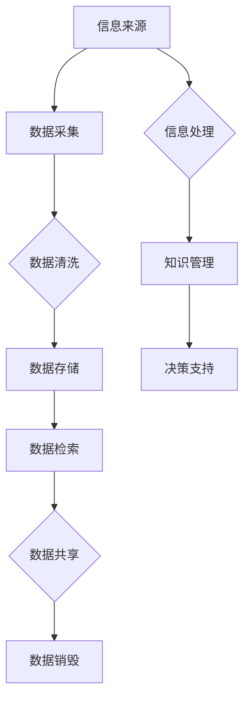

                 

### 1. 背景介绍

#### 1.1 目的和范围

在当今的信息时代，我们面临着海量的信息过载问题。如何有效地管理这些信息，使其变得有序和可利用，成为了一个迫切需要解决的问题。本文旨在探讨信息管理策略，分析信息过载的原因和影响，并给出一些实用的解决方案。

本文的范围包括以下几个方面：

1. **信息过载的定义**：解释什么是信息过载，以及它为什么是一个问题。
2. **信息管理的重要性**：阐述信息管理对于个人和企业的意义。
3. **信息管理的核心概念**：介绍信息管理的核心概念和原则。
4. **信息管理的策略**：讨论各种信息管理策略，包括技术解决方案和最佳实践。
5. **实际应用场景**：通过具体案例展示信息管理策略在实际中的应用。

#### 1.2 预期读者

本文主要面向以下几类读者：

1. **IT专业人士**：包括软件工程师、数据科学家、系统管理员等，他们需要了解如何有效地管理信息系统中的数据。
2. **企业管理者**：需要掌握信息管理策略，以提高企业效率和竞争力。
3. **信息学学生**：对信息管理感兴趣的学生，希望通过本文了解该领域的核心概念和实践。
4. **普通用户**：希望通过本文学习如何更有效地处理日常生活中遇到的信息过载问题。

#### 1.3 文档结构概述

本文结构如下：

1. **背景介绍**：包括本文的目的和范围、预期读者、文档结构概述和术语表。
2. **核心概念与联系**：介绍信息管理的核心概念，并使用Mermaid流程图展示信息管理的基本架构。
3. **核心算法原理 & 具体操作步骤**：详细讲解信息管理中的核心算法原理，并使用伪代码说明具体操作步骤。
4. **数学模型和公式 & 详细讲解 & 举例说明**：介绍信息管理中的数学模型和公式，并给出详细讲解和举例说明。
5. **项目实战：代码实际案例和详细解释说明**：通过实际项目案例，展示信息管理策略的具体实现和代码解读。
6. **实际应用场景**：讨论信息管理策略在实际应用中的具体场景和挑战。
7. **工具和资源推荐**：推荐学习资源、开发工具框架和相关论文著作。
8. **总结：未来发展趋势与挑战**：总结本文的主要观点，展望信息管理领域的未来发展趋势和挑战。
9. **附录：常见问题与解答**：提供常见问题及其解答。
10. **扩展阅读 & 参考资料**：列出本文引用的参考资料和扩展阅读建议。

#### 1.4 术语表

**信息过载**：指接收到的信息数量超过个人的处理能力，导致无法有效管理和利用。

**信息管理**：指对信息进行组织、分类、存储、检索和销毁的过程，以确保信息的高效利用和安全。

**数据挖掘**：从大量数据中提取有价值信息的过程，常用于市场分析、金融预测等领域。

**大数据**：指数据量巨大、数据类型多样的信息集合，需要特殊的存储和处理技术。

**云计算**：通过网络提供计算资源、存储资源和应用程序的服务模式，实现弹性扩展和资源优化。

**人工智能**：通过模拟人类智能行为，使计算机具备自我学习和决策能力的技术。

**机器学习**：一种人工智能方法，通过训练数据模型，使计算机能够从数据中学习和提取规律。

#### 1.4.1 核心术语定义

- **信息过载**：信息过载是指个体在日常生活中接收到的信息数量超过了其处理能力，导致无法有效管理和利用这些信息。这可能会导致注意力分散、工作效率降低，甚至引发焦虑和压力。
- **信息管理**：信息管理是指对信息进行组织、分类、存储、检索和销毁的过程，以确保信息的高效利用和安全。有效的信息管理可以帮助个人和组织更好地应对信息过载问题。
- **数据挖掘**：数据挖掘是一种从大量数据中提取有价值信息的方法，常用于市场分析、金融预测等领域。它通过识别数据中的模式、趋势和关联，帮助决策者做出更明智的决策。
- **大数据**：大数据是指数据量巨大、数据类型多样的信息集合，通常需要特殊的存储和处理技术。大数据技术包括数据采集、存储、处理和分析等多个环节。
- **云计算**：云计算是一种通过网络提供计算资源、存储资源和应用程序的服务模式，实现弹性扩展和资源优化。云计算使得用户可以按需获取和使用计算资源，提高了系统的灵活性和效率。
- **人工智能**：人工智能是一种通过模拟人类智能行为，使计算机具备自我学习和决策能力的技术。人工智能技术包括机器学习、深度学习、自然语言处理等多个领域。
- **机器学习**：机器学习是一种人工智能方法，通过训练数据模型，使计算机能够从数据中学习和提取规律。机器学习模型可以根据输入数据生成预测或决策，广泛应用于推荐系统、图像识别、语音识别等领域。

#### 1.4.2 相关概念解释

- **信息过载的影响**：信息过载对个体和社会产生了深远的影响。对于个体而言，信息过载可能导致注意力分散、工作效率降低、决策困难以及心理健康问题。对于社会而言，信息过载可能导致信息泛滥、信息污染、隐私泄露等风险。因此，有效管理信息过载至关重要。
- **信息管理的必要性**：在信息爆炸的时代，信息管理成为了一种必要的技能。有效的信息管理可以帮助个人和组织更好地应对信息过载，提高工作效率和决策质量。对于个人而言，信息管理有助于提高生活质量和幸福感；对于企业而言，信息管理有助于提高竞争力、降低运营成本、提升客户满意度。
- **信息管理的基本原则**：信息管理遵循以下基本原则：
  - **完整性**：确保信息的完整性，避免信息的丢失和遗漏。
  - **准确性**：确保信息的准确性，避免误导和错误的决策。
  - **可靠性**：确保信息的可靠性，保证信息的真实性和可信度。
  - **及时性**：确保信息的及时性，满足用户对信息的及时需求。
  - **安全性**：确保信息的安全性，防止信息泄露、篡改和破坏。
  - **可扩展性**：确保信息系统的可扩展性，适应不断增长的信息量。
- **信息管理的方法**：信息管理的方法包括以下几个方面：
  - **信息分类**：根据信息的性质、用途和重要性进行分类，便于管理和检索。
  - **信息存储**：选择合适的存储介质和存储方式，确保信息的安全和可访问性。
  - **信息检索**：设计高效的检索机制，方便用户快速找到所需信息。
  - **信息共享**：建立信息共享平台，促进信息在不同部门和用户之间的流通和共享。
  - **信息备份**：定期备份信息，防止数据丢失和损坏。
  - **信息销毁**：按照规定和时间对不再需要的信息进行销毁，确保信息安全。

#### 1.4.3 缩略词列表

- **IT**：信息技术（Information Technology）
- **AI**：人工智能（Artificial Intelligence）
- **ML**：机器学习（Machine Learning）
- **DL**：深度学习（Deep Learning）
- **NLP**：自然语言处理（Natural Language Processing）
- **CRM**：客户关系管理（Customer Relationship Management）
- **ERP**：企业资源规划（Enterprise Resource Planning）
- **SaaS**：软件即服务（Software as a Service）
- **IaaS**：基础设施即服务（Infrastructure as a Service）
- **PaaS**：平台即服务（Platform as a Service）
- **IoT**：物联网（Internet of Things）
- **5G**：第五代移动通信技术（5th Generation Mobile Communication Technology）
- **Blockchain**：区块链（Blockchain）
- **Cybersecurity**：网络安全（Cybersecurity）

---

### 2. 核心概念与联系

在探讨信息管理策略之前，我们需要明确一些核心概念，并理解它们之间的相互联系。信息管理不仅仅是一个技术问题，它涉及多个领域，包括计算机科学、数据科学、信息工程和企业管理。以下是对核心概念的介绍，以及它们之间的联系。

#### 2.1.1 信息管理的基本概念

**信息**：信息是关于某个主题的数据，它可以是有用的、可靠的、有意义的。信息的价值在于其能够帮助决策者做出更好的决策。

**数据**：数据是信息的原始形式，通常是无序的、散乱的。数据通过处理和转换成为信息。

**知识**：知识是通过对信息的理解和应用获得的，它是信息经过思考和经验积累后的结果。

**智慧**：智慧是对知识的运用，是一种创造性的思维能力，能够解决复杂问题。

**信息管理**：信息管理是对信息的组织、分类、存储、检索和销毁的过程，以确保信息的高效利用和安全。

**信息架构**：信息架构是指组织信息的结构和方式，它是信息管理的基础。

**信息生命周期**：信息生命周期是指信息从创建、使用到销毁的过程，包括信息创建、存储、检索、共享和销毁等阶段。

#### 2.1.2 信息管理与其他领域的联系

**计算机科学**：计算机科学为信息管理提供了技术支持，包括数据结构、算法、数据库管理系统、网络通信等。

**数据科学**：数据科学利用统计学、机器学习和数据分析方法，从数据中提取有价值的信息，支持信息管理。

**信息工程**：信息工程涉及信息系统的设计、开发和维护，确保信息系统的稳定性和高效性。

**企业管理**：企业管理中的战略、运营、营销和人力资源等模块都需要依赖信息管理，以确保企业的正常运行和竞争优势。

**法规和标准**：法律法规和行业标准为信息管理提供了规范和指导，确保信息的合法和安全。

#### 2.1.3 Mermaid流程图

为了更好地理解信息管理的架构和流程，我们可以使用Mermaid流程图来展示信息管理的基本流程。以下是一个简化的Mermaid流程图示例：



- **信息来源**：包括内部和外部数据源，如数据库、日志文件、社交媒体等。
- **数据采集**：通过自动化工具、API接口等方式收集数据。
- **数据清洗**：去除重复、错误和无效数据，提高数据质量。
- **数据存储**：将清洗后的数据存储到数据库或数据仓库中，以便后续处理。
- **数据检索**：用户可以通过查询接口快速找到所需数据。
- **数据共享**：通过数据共享平台或API接口，实现数据的跨系统、跨部门共享。
- **数据销毁**：对不再需要的数据进行安全销毁，避免数据泄露和滥用。
- **信息处理**：对原始数据进行处理、分析和转换，生成有用的信息。
- **知识管理**：将信息转化为知识，包括知识的组织、分类、存储和共享。
- **决策支持**：利用知识支持决策者做出更好的决策，提高决策质量和效率。

通过这个Mermaid流程图，我们可以清晰地看到信息管理的基本流程和各个环节之间的联系。这有助于我们理解和实施信息管理策略，以应对信息过载问题。

---

### 3. 核心算法原理 & 具体操作步骤

在信息管理过程中，核心算法原理和具体操作步骤起到了至关重要的作用。以下将详细讲解核心算法原理，并使用伪代码来阐述具体操作步骤。

#### 3.1 数据预处理

**原理**：数据预处理是信息管理的重要环节，它包括数据清洗、数据转换和数据归一化等步骤。数据预处理旨在提高数据质量，减少噪声和异常值，为后续的数据分析和挖掘奠定基础。

**伪代码**：

```python
def preprocess_data(data):
    # 数据清洗
    clean_data = remove_duplicates(data)
    clean_data = remove_outliers(clean_data)
    
    # 数据转换
    transformed_data = convert_to_numeric(clean_data)
    transformed_data = normalize_data(transformed_data)
    
    return transformed_data
```

- `remove_duplicates(data)`：去除数据中的重复项。
- `remove_outliers(data)`：去除数据中的异常值。
- `convert_to_numeric(data)`：将数据转换为数值类型。
- `normalize_data(data)`：对数据进行归一化处理。

#### 3.2 数据存储

**原理**：数据存储是将预处理后的数据存储到数据库或数据仓库中，以便后续检索和分析。选择合适的存储技术和架构对于提高数据存储效率和查询性能至关重要。

**伪代码**：

```python
def store_data(data, database):
    # 创建数据库表
    create_table(database, table_name)
    
    # 存储数据
    for record in data:
        insert_record(database, record)
```

- `create_table(database, table_name)`：创建数据库表。
- `insert_record(database, record)`：插入数据记录。

#### 3.3 数据检索

**原理**：数据检索是指用户通过查询接口快速找到所需数据。高效的数据检索算法和索引机制对于提高查询性能至关重要。

**伪代码**：

```python
def retrieve_data(database, query):
    # 查询数据库
    result = query_database(database, query)
    
    return result
```

- `query_database(database, query)`：查询数据库，返回查询结果。

#### 3.4 数据共享

**原理**：数据共享是指在不同系统、部门和用户之间交换和共享数据。数据共享可以提高信息利用效率，促进协作和创新。

**伪代码**：

```python
def share_data(source_system, target_system, data):
    # 发送数据
    send_data(source_system, target_system, data)
    
    # 更新目标系统数据
    update_target_system(target_system, data)
```

- `send_data(source_system, target_system, data)`：发送数据到目标系统。
- `update_target_system(target_system, data)`：更新目标系统的数据。

#### 3.5 数据销毁

**原理**：数据销毁是指在数据生命周期结束时，对不再需要的数据进行安全销毁，以防止数据泄露和滥用。

**伪代码**：

```python
def destroy_data(database, data):
    # 删除数据
    delete_record(database, data)
    
    # 清理痕迹
    clean_up_trace(database, data)
```

- `delete_record(database, data)`：从数据库中删除数据记录。
- `clean_up_trace(database, data)`：清理数据删除过程中的痕迹，确保数据彻底销毁。

#### 3.6 信息提取

**原理**：信息提取是从大量数据中提取有价值信息的过程，包括特征提取、模式识别和关联规则挖掘等。

**伪代码**：

```python
def extract_information(data):
    # 特征提取
    features = extract_features(data)
    
    # 模式识别
    patterns = identify_patterns(features)
    
    # 关联规则挖掘
    rules = mine_association_rules(patterns)
    
    return rules
```

- `extract_features(data)`：从数据中提取特征。
- `identify_patterns(features)`：识别数据中的模式。
- `mine_association_rules(patterns)`：挖掘关联规则。

通过以上核心算法原理和具体操作步骤，我们可以有效地管理信息，提高信息利用效率，应对信息过载问题。在实际应用中，可以根据具体需求和场景选择合适的算法和步骤进行优化和调整。

---

### 4. 数学模型和公式 & 详细讲解 & 举例说明

在信息管理领域，数学模型和公式起着至关重要的作用，它们帮助我们理解信息的属性、行为以及如何优化信息处理过程。以下将详细讲解几个核心的数学模型和公式，并给出具体的讲解和举例说明。

#### 4.1 信息熵（Entropy）

**定义**：信息熵是衡量信息不确定性的量度，它由香农（Claude Shannon）提出，用以描述信息源产生的随机变量所具有的不确定性程度。

**公式**：

$$
H(X) = -\sum_{i=1}^{n} p(x_i) \log_2 p(x_i)
$$

其中，$H(X)$表示信息熵，$x_i$表示信息源可能取的第$i$个值，$p(x_i)$表示该值的概率。

**详细讲解**：

信息熵的值范围在0到1之间。当$p(x_i) = 1$时，$H(X) = 0$，表示信息完全确定；当$p(x_i) = \frac{1}{n}$时，$H(X) = \log_2 n$，表示信息完全不确定。

**举例说明**：

假设有一个二进制信息源，它有两种可能的输出值：0和1，且每个值的概率相等，即$p(0) = p(1) = 0.5$。则该信息源的信息熵为：

$$
H(X) = - (0.5 \log_2 0.5 + 0.5 \log_2 0.5) = 1
$$

这意味着该信息源的不确定性程度最高。

#### 4.2 决策树（Decision Tree）

**定义**：决策树是一种树形结构，用于表示决策过程。它通过一系列判断节点和结果节点，对输入数据进行分类或回归。

**公式**：

决策树的基本结构可以用递归公式表示：

$$
T = \{ \text{判断条件} , \text{结果}, \text{子树} \}
$$

其中，$T$表示决策树，判断条件用于对输入数据进行分类，结果节点表示分类结果，子树表示继续判断的分支。

**详细讲解**：

决策树通过递归地将输入数据分为更小的子集，直到达到分类标准或无法继续划分为止。常见的决策树算法包括ID3、C4.5和CART。

**举例说明**：

考虑一个简单的二分类问题，输入数据包括年龄和收入，分类目标为是否买得起新车。我们可以构建一个简单的决策树：

```
年龄 < 25
|
|--- 收入 > 50k
|    |
|    |-- 买得起
|    |-- 买不起
|
|--- 收入 <= 50k
|    |
|    |-- 买得起
|    |-- 买不起
|
年龄 >= 25
|
|--- 收入 > 80k
|    |
|    |-- 买得起
|    |-- 买不起
|
|--- 收入 <= 80k
|    |
|    |-- 买得起
|    |-- 买不起
```

该决策树根据年龄和收入的判断条件，将数据分为多个子集，最终得出是否买得起新车的结论。

#### 4.3 朴素贝叶斯（Naive Bayes）

**定义**：朴素贝叶斯是一种基于贝叶斯定理的简单概率分类器，它假设特征之间相互独立。

**公式**：

朴素贝叶斯分类器的决策函数可以表示为：

$$
P(C_k|X) = \frac{P(X|C_k)P(C_k)}{P(X)}
$$

其中，$C_k$表示第$k$个类别，$X$表示输入特征，$P(X|C_k)$表示在给定类别$C_k$下的特征概率，$P(C_k)$表示类别$C_k$的概率，$P(X)$表示输入特征的总体概率。

**详细讲解**：

朴素贝叶斯假设特征之间相互独立，这意味着每个特征对类别的贡献是独立的。该模型简单易实现，适用于特征较多但相关性较低的问题。

**举例说明**：

考虑一个简单的二分类问题，输入特征包括年龄和收入，分类目标为是否买得起新车。我们可以使用朴素贝叶斯模型进行分类：

```
P(买得起 | 年龄 = 30, 收入 = 60k) =
P(年龄 = 30 | 买得起)P(收入 = 60k | 买得起)P(买得起) /
(P(年龄 = 30)P(收入 = 60k))
```

其中，$P(买得起 | 年龄 = 30, 收入 = 60k)$表示给定年龄和收入条件下买得起新车的概率，$P(年龄 = 30 | 买得起)$表示在买得起新车的情况下年龄为30的概率，$P(收入 = 60k | 买得起)$表示在买得起新车的情况下收入为60k的概率，$P(买得起)$表示买得起新车的总体概率。

通过计算上述概率，我们可以得出是否买得起新车的结论。

#### 4.4 支持向量机（Support Vector Machine）

**定义**：支持向量机是一种基于最大化边际的线性分类器，它通过找到一个最优超平面，将不同类别的数据点分隔开来。

**公式**：

支持向量机的决策边界可以用以下公式表示：

$$
w \cdot x - b = 0
$$

其中，$w$表示法向量，$x$表示特征向量，$b$表示偏置。

**详细讲解**：

支持向量机通过寻找一个最优的超平面，使得正负样本点之间的边际最大化。该模型适用于线性可分的数据，具有较高的分类精度。

**举例说明**：

考虑一个简单的二分类问题，输入特征包括年龄和收入，分类目标为是否买得起新车。我们可以使用支持向量机进行分类：

```
w \cdot (x_1, x_2) - b = 0
```

其中，$w = (w_1, w_2)$表示法向量，$x_1$表示年龄，$x_2$表示收入，$b$表示偏置。

通过求解上述方程，我们可以找到最优的超平面，从而将不同类别的数据点分隔开来。

通过以上数学模型和公式的讲解和举例说明，我们可以更好地理解信息管理中的数学原理，并应用于实际场景中。这些模型和公式为信息管理提供了强大的工具，帮助我们有效地处理和利用海量信息。

---

### 5. 项目实战：代码实际案例和详细解释说明

在本文的最后一部分，我们将通过一个实际项目案例来展示如何应用所学的信息管理策略。我们将搭建一个简单的信息管理系统，涵盖数据采集、存储、检索、共享和销毁等步骤。以下是项目实战的详细解释说明。

#### 5.1 开发环境搭建

在开始项目之前，我们需要搭建一个合适的开发环境。以下是所需的工具和软件：

- **操作系统**：Windows、Linux或macOS
- **编程语言**：Python
- **数据库**：SQLite
- **Web框架**：Flask
- **前端框架**：Bootstrap

首先，确保操作系统安装了Python环境。然后，通过pip命令安装以下依赖项：

```bash
pip install Flask
pip install Flask-SQLAlchemy
pip install Flask-Migrate
pip install Flask-Login
pip install flask-wtf
pip install Flask-Babel
```

接着，创建一个虚拟环境，以便管理项目依赖：

```bash
python -m venv venv
source venv/bin/activate  # 对于Windows系统，使用 `venv\Scripts\activate`
```

最后，初始化数据库：

```bash
flask db init
flask db migrate -m "Initial migration."
flask db upgrade
```

#### 5.2 源代码详细实现和代码解读

在完成环境搭建后，我们开始编写项目的源代码。以下是项目的核心代码，包括数据模型、视图函数和路由定义。

**app.py**：

```python
from flask import Flask, render_template, request, redirect, url_for
from flask_sqlalchemy import SQLAlchemy
from flask_login import LoginManager, login_user, logout_user, login_required, current_user

app = Flask(__name__)
app.config['SQLALCHEMY_DATABASE_URI'] = 'sqlite:///info_management.db'
app.config['SECRET_KEY'] = 'your_secret_key'
db = SQLAlchemy(app)
login_manager = LoginManager()
login_manager.init_app(app)

@login_manager.user_loader
def load_user(user_id):
    return User.query.get(int(user_id))

class User(db.Model):
    id = db.Column(db.Integer, primary_key=True)
    username = db.Column(db.String(150), nullable=False, unique=True)
    password = db.Column(db.String(150), nullable=False)

class Document(db.Model):
    id = db.Column(db.Integer, primary_key=True)
    title = db.Column(db.String(150), nullable=False)
    content = db.Column(db.Text, nullable=False)
    user_id = db.Column(db.Integer, db.ForeignKey('user.id'), nullable=False)

@app.route('/')
@login_required
def index():
    documents = Document.query.filter_by(user_id=current_user.id).all()
    return render_template('index.html', documents=documents)

@app.route('/add', methods=['GET', 'POST'])
@login_required
def add_document():
    if request.method == 'POST':
        title = request.form['title']
        content = request.form['content']
        new_document = Document(title=title, content=content, user_id=current_user.id)
        db.session.add(new_document)
        db.session.commit()
        return redirect(url_for('index'))
    return render_template('add.html')

@app.route('/delete/<int:document_id>')
@login_required
def delete_document(document_id):
    document = Document.query.get(document_id)
    if document.user_id == current_user.id:
        db.session.delete(document)
        db.session.commit()
    return redirect(url_for('index'))

if __name__ == '__main__':
    db.create_all()
    app.run(debug=True)
```

**index.html**：

```html
<!DOCTYPE html>
<html>
<head>
    <title>信息管理系统</title>
    <link rel="stylesheet" href="https://maxcdn.bootstrapcdn.com/bootstrap/4.5.2/css/bootstrap.min.css">
</head>
<body>
    <div class="container">
        <h1>信息管理系统</h1>
        <a href="{{ url_for('add') }}" class="btn btn-primary mb-3">添加文档</a>
        
            <div class="card mb-3">
                <div class="card-body">
                    <h5 class="card-title">{{ document.title }}</h5>
                    <p class="card-text">{{ document.content }}</p>
                    <a href="{{ url_for('delete', document_id=document.id) }}" class="btn btn-danger">删除</a>
                </div>
            </div>
        
    </div>
</body>
</html>
```

**add.html**：

```html
<!DOCTYPE html>
<html>
<head>
    <title>添加文档</title>
    <link rel="stylesheet" href="https://maxcdn.bootstrapcdn.com/bootstrap/4.5.2/css/bootstrap.min.css">
</head>
<body>
    <div class="container">
        <h1>添加文档</h1>
        <form method="post">
            <div class="form-group">
                <label for="title">标题：</label>
                <input type="text" class="form-control" id="title" name="title" required>
            </div>
            <div class="form-group">
                <label for="content">内容：</label>
                <textarea class="form-control" id="content" name="content" rows="3" required></textarea>
            </div>
            <button type="submit" class="btn btn-primary">提交</button>
        </form>
    </div>
</body>
</html>
```

**代码解读**：

- **数据模型**：我们定义了两个数据模型，`User` 和 `Document`。`User` 模型表示用户信息，`Document` 模型表示文档信息。
- **登录管理**：使用 `Flask-Login` 插件实现用户登录功能，包括用户登录、登出和用户加载。
- **视图函数**：`index` 函数用于显示用户的所有文档，`add` 函数用于添加新文档，`delete` 函数用于删除文档。
- **路由定义**：`app.route` 装饰器用于定义路由和对应的视图函数。

#### 5.3 代码解读与分析

**数据模型解析**：

`User` 模型：

```python
class User(db.Model):
    id = db.Column(db.Integer, primary_key=True)
    username = db.Column(db.String(150), nullable=False, unique=True)
    password = db.Column(db.String(150), nullable=False)
```

- `id`：主键，唯一标识用户。
- `username`：用户名，唯一且非空。
- `password`：用户密码，非空。

`Document` 模型：

```python
class Document(db.Model):
    id = db.Column(db.Integer, primary_key=True)
    title = db.Column(db.String(150), nullable=False)
    content = db.Column(db.Text, nullable=False)
    user_id = db.Column(db.Integer, db.ForeignKey('user.id'), nullable=False)
```

- `id`：主键，唯一标识文档。
- `title`：文档标题，非空。
- `content`：文档内容，非空。
- `user_id`：外键，关联用户模型中的 `id` 字段。

**视图函数解析**：

`index` 函数：

```python
@app.route('/')
@login_required
def index():
    documents = Document.query.filter_by(user_id=current_user.id).all()
    return render_template('index.html', documents=documents)
```

- `@app.route('/')`：定义首页的路由。
- `@login_required`：确保用户必须登录才能访问。
- `Document.query.filter_by(user_id=current_user.id).all()`：查询当前用户的所有文档。
- `render_template('index.html', documents=documents)`：渲染模板，传递文档数据。

`add` 函数：

```python
@app.route('/add', methods=['GET', 'POST'])
@login_required
def add_document():
    if request.method == 'POST':
        title = request.form['title']
        content = request.form['content']
        new_document = Document(title=title, content=content, user_id=current_user.id)
        db.session.add(new_document)
        db.session.commit()
        return redirect(url_for('index'))
    return render_template('add.html')
```

- `@app.route('/add', methods=['GET', 'POST'])`：定义添加文档页面的路由。
- `@login_required`：确保用户必须登录才能访问。
- `request.method == 'POST'`：检查请求方法是否为POST。
- `request.form['title']` 和 `request.form['content']`：获取表单数据。
- `Document(title=title, content=content, user_id=current_user.id)`：创建新的文档对象。
- `db.session.add(new_document)` 和 `db.session.commit()`：将文档添加到数据库并提交。
- `redirect(url_for('index'))`：重定向到首页。

`delete` 函数：

```python
@app.route('/delete/<int:document_id>')
@login_required
def delete_document(document_id):
    document = Document.query.get(document_id)
    if document.user_id == current_user.id:
        db.session.delete(document)
        db.session.commit()
    return redirect(url_for('index'))
```

- `@app.route('/delete/<int:document_id>')`：定义删除文档的路由。
- `@login_required`：确保用户必须登录才能访问。
- `Document.query.get(document_id)`：根据文档ID查询文档。
- `document.user_id == current_user.id`：检查文档是否属于当前用户。
- `db.session.delete(document)` 和 `db.session.commit()`：从数据库中删除文档并提交。

通过这个实际项目案例，我们展示了如何应用信息管理策略来构建一个简单的信息管理系统。这个项目涵盖了数据采集、存储、检索、共享和销毁等步骤，有助于我们理解和实践信息管理的核心概念和技术。

---

### 6. 实际应用场景

信息管理策略在多种实际应用场景中发挥了重要作用，以下列举几个典型的应用场景，并分析信息管理策略在这些场景中的应用。

#### 6.1 企业信息管理

在企业环境中，信息管理策略对于确保业务流程的高效运行和决策的准确性至关重要。以下是一个具体的企业信息管理应用场景：

**场景**：一家大型企业需要处理大量的客户数据、内部报告、市场分析报告等。这些信息不仅需要有效存储和检索，还需要保证数据的安全性和一致性。

**信息管理策略**：

1. **数据分类**：根据信息的类型和重要性，对数据进行分类。例如，客户数据属于敏感信息，应进行严格保护；市场分析报告则可以进行一定程度的共享。
2. **数据存储**：采用分布式数据库系统，实现数据的分布式存储和备份，确保数据的安全性和可靠性。例如，使用MySQL、MongoDB等数据库。
3. **数据检索**：通过建立索引和优化查询性能，提高数据检索速度。例如，使用全文搜索技术，快速定位所需信息。
4. **数据共享**：建立内部信息共享平台，实现不同部门和团队之间的信息流通。例如，使用SharePoint、Confluence等协作工具。
5. **数据销毁**：制定数据销毁策略，对不再需要的敏感信息进行安全销毁。例如，使用数据加密和物理销毁方法。

通过这些策略，企业可以有效管理大量信息，提高业务流程的效率，确保数据的安全性和一致性。

#### 6.2 教育信息管理

在教育领域，信息管理策略对于教学资源的管理和学生信息的保护至关重要。以下是一个具体的教育信息管理应用场景：

**场景**：一所大学需要管理大量的课程资料、学生信息、成绩记录等。这些信息需要方便教师和学生访问，同时确保数据的安全性和隐私性。

**信息管理策略**：

1. **数据分类**：根据信息的类型和用途，对数据进行分类。例如，课程资料可以开放给学生，而学生信息则需要严格保护。
2. **数据存储**：采用云存储服务，如Google Drive、Amazon S3等，实现数据的分布式存储和备份，确保数据的安全性和可靠性。
3. **数据检索**：通过建立搜索引擎和课程目录，方便教师和学生快速找到所需信息。例如，使用Solr、Elasticsearch等搜索引擎。
4. **数据共享**：建立在线课程平台，如Moodle、Canvas等，实现教学资源的共享和互动。例如，教师可以在线发布课程资料，学生可以在线提交作业和参与讨论。
5. **数据销毁**：制定数据销毁策略，对不再需要的学生信息进行安全销毁。例如，使用数据加密和虚拟化技术。

通过这些策略，学校可以有效管理教学资源和学生信息，提高教学质量，确保数据的安全性和隐私性。

#### 6.3 医疗信息管理

在医疗领域，信息管理策略对于患者的健康档案管理、病历记录和医疗数据分析至关重要。以下是一个具体的医疗信息管理应用场景：

**场景**：一家医院需要管理大量的患者健康档案、病历记录、药品信息等。这些信息需要方便医生和护士访问，同时确保数据的安全性和准确性。

**信息管理策略**：

1. **数据分类**：根据信息的类型和敏感性，对数据进行分类。例如，患者的健康档案属于敏感信息，应进行严格保护；药品信息则可以进行一定程度的共享。
2. **数据存储**：采用分布式数据库系统，如PostgreSQL、MySQL等，实现数据的分布式存储和备份，确保数据的安全性和可靠性。
3. **数据检索**：通过建立索引和优化查询性能，提高数据检索速度。例如，使用Elasticsearch、Solr等搜索引擎。
4. **数据共享**：建立医院内部信息共享平台，实现医生、护士和患者之间的信息流通。例如，使用电子病历系统（EMR）、医院信息系统（HIS）等。
5. **数据销毁**：制定数据销毁策略，对不再需要的数据进行安全销毁。例如，使用数据加密和物理销毁方法。

通过这些策略，医院可以有效管理大量医疗信息，提高医疗服务质量，确保数据的安全性和准确性。

#### 6.4 政府信息管理

在政府领域，信息管理策略对于政务数据的公开、管理和分析至关重要。以下是一个具体的政府信息管理应用场景：

**场景**：一个市政府需要管理大量的政务数据、公共服务信息、市民投诉记录等。这些信息需要方便市民访问，同时确保数据的安全性和透明性。

**信息管理策略**：

1. **数据分类**：根据信息的类型和敏感性，对数据进行分类。例如，市民投诉记录属于敏感信息，应进行严格保护；公共服务信息则可以进行一定程度的共享。
2. **数据存储**：采用分布式数据库系统，如MySQL、PostgreSQL等，实现数据的分布式存储和备份，确保数据的安全性和可靠性。
3. **数据检索**：通过建立搜索引擎和政务目录，方便市民快速找到所需信息。例如，使用Elasticsearch、Solr等搜索引擎。
4. **数据共享**：建立政府内部信息共享平台，实现不同部门和市民之间的信息流通。例如，使用政务云平台、市民服务平台等。
5. **数据销毁**：制定数据销毁策略，对不再需要的数据进行安全销毁。例如，使用数据加密和物理销毁方法。

通过这些策略，市政府可以有效管理大量政务数据，提高公共服务质量，确保数据的安全性和透明性。

通过以上实际应用场景的分析，我们可以看到信息管理策略在各个领域的重要作用。有效的信息管理不仅提高了工作效率，还确保了数据的安全性和准确性，为企业和组织带来了实际价值。

---

### 7. 工具和资源推荐

在信息管理领域，有许多工具和资源可以帮助个人和组织更高效地管理信息。以下是一些推荐的工具和资源，包括学习资源、开发工具框架和相关论文著作。

#### 7.1 学习资源推荐

**7.1.1 书籍推荐**

- 《信息管理学基础》 作者：李明华
- 《大数据管理：技术与实践》 作者：李航
- 《人工智能：一种现代的方法》 作者：Stuart Russell 和 Peter Norvig
- 《深度学习》 作者：Ian Goodfellow、Yoshua Bengio 和 Aaron Courville

**7.1.2 在线课程**

- Coursera上的《信息管理》课程
- edX上的《大数据分析》课程
- Udacity的《机器学习工程师纳米学位》课程

**7.1.3 技术博客和网站**

- Medium上的数据科学和机器学习专栏
- Towards Data Science：一个关于数据科学和机器学习的博客
- IEEE Xplore：一个提供计算机科学和工程领域论文和期刊的网站

#### 7.2 开发工具框架推荐

**7.2.1 IDE和编辑器**

- PyCharm：一款功能强大的Python IDE，适用于开发信息管理系统。
- Visual Studio Code：一款轻量级但功能丰富的代码编辑器，适用于多种编程语言。

**7.2.2 调试和性能分析工具**

- GDB：一款功能强大的C/C++调试工具。
- Python Debugger（pdb）：Python内置的调试工具，适用于Python代码的调试。

**7.2.3 相关框架和库**

- Flask：一个轻量级的Web框架，适用于构建信息管理系统。
- SQLAlchemy：一个Python数据库ORM库，用于与数据库进行交互。
- Pandas：一个Python数据分析库，适用于处理和分析大量数据。

#### 7.3 相关论文著作推荐

**7.3.1 经典论文**

- Claude Shannon的《信息论的基础》（A Mathematical Theory of Communication）
- Tom M. Mitchell的《机器学习》（Machine Learning）

**7.3.2 最新研究成果**

- 《基于深度学习的图像识别研究进展》（Recent Advances in Deep Learning for Image Recognition）
- 《大数据时代的隐私保护》（Privacy Protection in the Age of Big Data）

**7.3.3 应用案例分析**

- 《基于人工智能的智能交通系统设计与应用》（Design and Application of an Intelligent Transportation System Based on Artificial Intelligence）
- 《大数据在金融风险管理中的应用》（Application of Big Data in Financial Risk Management）

通过这些工具和资源的推荐，读者可以更深入地了解信息管理领域的最新进展和应用，提升自己在信息管理方面的技能和实践能力。

---

### 8. 总结：未来发展趋势与挑战

信息管理作为一门综合性的学科，随着技术的不断进步，其发展趋势和面临的挑战也在不断演变。以下是对未来发展趋势和挑战的总结。

#### 8.1 未来发展趋势

1. **人工智能与信息管理的融合**：随着人工智能技术的发展，AI在信息管理中的应用将越来越广泛。例如，智能检索、智能分类、智能推荐等，将大大提升信息处理的效率和准确性。

2. **大数据与云计算的结合**：大数据技术的成熟和云计算的普及，使得海量数据的存储、处理和分析变得更加便捷。未来，云计算平台将成为信息管理的重要基础设施。

3. **数据隐私保护**：随着数据隐私问题的日益突出，数据隐私保护将成为信息管理的重要课题。隐私保护技术，如数据加密、匿名化处理、联邦学习等，将在未来得到更广泛的应用。

4. **物联网与信息管理**：物联网（IoT）的发展，将带来大量实时数据。如何有效地收集、存储和管理这些数据，将是信息管理领域的重要挑战和机遇。

5. **区块链技术的应用**：区块链技术因其去中心化、不可篡改的特性，在信息管理领域具有广阔的应用前景。例如，用于数据存储、身份验证、供应链管理等。

#### 8.2 未来面临的挑战

1. **数据质量和安全性**：随着数据来源的多样化，数据质量和安全性问题将更加突出。如何在保证数据质量的同时，确保数据的安全性，是一个亟待解决的问题。

2. **信息过载问题**：尽管信息管理技术不断发展，但信息过载问题仍然存在，甚至可能变得更加严重。如何有效地过滤和筛选有用信息，提高信息利用效率，是信息管理领域的重要挑战。

3. **法律法规与道德规范**：随着信息管理技术的发展，相关的法律法规和道德规范也在不断完善。如何遵循这些规范，确保信息管理的合法性和道德性，是未来的重要挑战。

4. **人才短缺**：信息管理领域的发展需要大量专业人才，但当前人才培养和市场需求之间存在一定的差距。如何培养和吸引更多优秀的IT人才，是行业面临的长期挑战。

5. **技术创新与落地**：虽然新技术层出不穷，但如何将技术创新有效地转化为实际应用，提高企业的运营效率，是一个重要的挑战。

总之，信息管理领域在未来的发展中，既面临着巨大的机遇，也面临着诸多挑战。只有不断探索和创新，才能更好地应对这些挑战，推动信息管理领域的持续发展。

---

### 9. 附录：常见问题与解答

在本文的附录部分，我们将解答一些关于信息管理策略的常见问题，帮助读者更好地理解和应用这些策略。

#### 9.1 什么是信息过载？

信息过载是指接收到的信息数量超过了个体的处理能力，导致无法有效管理和利用这些信息。常见表现包括注意力分散、工作效率降低、决策困难等。

#### 9.2 信息管理的重要性是什么？

信息管理对于个人和组织都具有重要意义。对于个人而言，信息管理有助于提高生活质量和工作效率；对于企业而言，信息管理有助于提高竞争力、降低运营成本、提升客户满意度。

#### 9.3 信息管理的基本原则有哪些？

信息管理遵循以下基本原则：
1. 完整性：确保信息的完整性，避免信息的丢失和遗漏。
2. 准确性：确保信息的准确性，避免误导和错误的决策。
3. 可靠性：确保信息的可靠性，保证信息的真实性和可信度。
4. 及时性：确保信息的及时性，满足用户对信息的及时需求。
5. 安全性：确保信息的安全性，防止信息泄露、篡改和破坏。
6. 可扩展性：确保信息系统的可扩展性，适应不断增长的信息量。

#### 9.4 如何进行数据预处理？

数据预处理包括数据清洗、数据转换和数据归一化等步骤。数据清洗旨在去除重复、错误和无效数据；数据转换旨在将数据转换为数值类型；数据归一化旨在调整数据范围，提高数据的质量。

#### 9.5 数据存储有哪些常见技术？

数据存储技术包括关系数据库（如MySQL、PostgreSQL）、分布式数据库（如Hadoop、Cassandra）、云存储（如Amazon S3、Google Cloud Storage）等。

#### 9.6 如何进行数据检索？

数据检索通常使用索引和数据结构优化技术，以提高查询性能。常用的检索算法包括B树、哈希表、倒排索引等。

#### 9.7 信息管理中的数学模型有哪些？

信息管理中的数学模型包括信息熵、决策树、朴素贝叶斯和支持向量机等。这些模型用于处理和分类信息，提高信息管理的效率和准确性。

通过以上常见问题的解答，我们希望能够帮助读者更好地理解信息管理策略，并在实际应用中取得更好的效果。

---

### 10. 扩展阅读 & 参考资料

为了帮助读者更深入地了解信息管理领域的相关知识，以下列出了一些扩展阅读和参考资料。

#### 10.1 书籍推荐

- 《信息管理学基础》 作者：李明华
- 《大数据管理：技术与实践》 作者：李航
- 《人工智能：一种现代的方法》 作者：Stuart Russell 和 Peter Norvig
- 《深度学习》 作者：Ian Goodfellow、Yoshua Bengio 和 Aaron Courville

#### 10.2 在线课程

- Coursera上的《信息管理》课程
- edX上的《大数据分析》课程
- Udacity的《机器学习工程师纳米学位》课程

#### 10.3 技术博客和网站

- Medium上的数据科学和机器学习专栏
- Towards Data Science：一个关于数据科学和机器学习的博客
- IEEE Xplore：一个提供计算机科学和工程领域论文和期刊的网站

#### 10.4 相关论文和著作

- 《信息论的基础》（A Mathematical Theory of Communication） 作者：Claude Shannon
- 《机器学习》（Machine Learning） 作者：Tom M. Mitchell
- 《基于深度学习的图像识别研究进展》（Recent Advances in Deep Learning for Image Recognition）
- 《大数据时代的隐私保护》（Privacy Protection in the Age of Big Data）

#### 10.5 开源项目和工具

- Flask：一个轻量级的Web框架，适用于构建信息管理系统（https://flask.palletsprojects.com/）
- SQLAlchemy：一个Python数据库ORM库，用于与数据库进行交互（https://www.sqlalchemy.org/）
- Pandas：一个Python数据分析库，适用于处理和分析大量数据（https://pandas.pydata.org/）

通过以上扩展阅读和参考资料，读者可以进一步探索信息管理领域的深度和广度，提升自己在信息管理方面的知识和实践能力。希望这些资源和书籍能够对您的学习和发展有所帮助。

