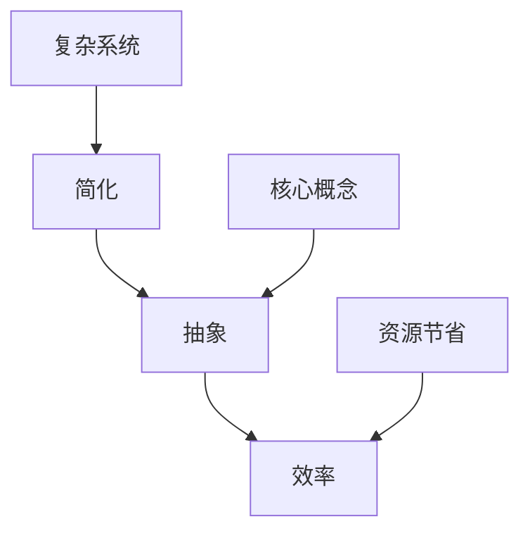

                 

# 信息简化的力量：在复杂世界中简化以提高效率

> **关键词：简化、复杂性、效率、算法、模型、应用场景**

> **摘要：本文将探讨信息简化的重要性，通过简化和抽象复杂系统，提升计算和数据处理效率。我们将详细分析简化在IT领域的应用，包括核心算法原理、数学模型、实际案例和未来趋势。**

## 1. 背景介绍

### 1.1 目的和范围

本文旨在探讨信息简化的力量，解释简化如何帮助我们理解和处理复杂系统，从而提高效率。我们将结合IT领域的实例，详细讨论简化的方法、核心算法原理和数学模型。

### 1.2 预期读者

本文适合对计算机科学、数据科学、人工智能等领域感兴趣的读者，尤其是希望提升问题解决能力和效率的专业人士。

### 1.3 文档结构概述

本文结构如下：

1. **背景介绍**：介绍文章的目的和预期读者。
2. **核心概念与联系**：阐述简化的核心概念，并使用Mermaid流程图展示其架构。
3. **核心算法原理 & 具体操作步骤**：使用伪代码详细阐述简化算法。
4. **数学模型和公式 & 详细讲解 & 举例说明**：使用LaTeX格式展示数学模型，并进行详细讲解。
5. **项目实战：代码实际案例和详细解释说明**：展示简化在项目中的应用。
6. **实际应用场景**：讨论简化的实际应用。
7. **工具和资源推荐**：推荐学习资源和工具。
8. **总结：未来发展趋势与挑战**：总结未来发展趋势和挑战。
9. **附录：常见问题与解答**：解答常见问题。
10. **扩展阅读 & 参考资料**：提供扩展阅读和参考资料。

### 1.4 术语表

#### 1.4.1 核心术语定义

- **简化**：将复杂系统或问题抽象为更简单、更易理解和处理的模型或算法。
- **抽象**：从复杂系统中提取核心概念，忽略不必要的细节。
- **效率**：执行任务所需的时间和资源。

#### 1.4.2 相关概念解释

- **算法**：解决特定问题的步骤序列。
- **模型**：对现实世界的抽象表示。

#### 1.4.3 缩略词列表

- **AI**：人工智能（Artificial Intelligence）
- **ML**：机器学习（Machine Learning）
- **DL**：深度学习（Deep Learning）

## 2. 核心概念与联系

在探讨信息简化的力量之前，我们需要理解几个核心概念：简化、抽象和效率。以下是一个Mermaid流程图，展示了这些概念之间的联系。



### 2.1 简化与抽象

简化通常涉及对复杂系统的抽象。抽象是指从复杂系统中提取核心概念，忽略不重要的细节。例如，在软件开发中，我们可以将复杂的业务逻辑抽象为简单的函数或模块。

### 2.2 效率与简化

简化有助于提高效率，因为它减少了处理复杂系统所需的时间和资源。例如，在算法设计中，使用高效的算法可以显著减少计算时间。

### 2.3 复杂系统与简化

复杂系统通常包含大量细节，这些细节可能对解决特定问题并不重要。通过简化，我们可以将这些不重要的细节去除，从而专注于核心问题。

## 3. 核心算法原理 & 具体操作步骤

简化算法的核心是识别并提取问题的核心要素。以下是一个简化算法的伪代码示例：

```pseudo
算法：简化问题
输入：复杂问题P
输出：简化后的问题P'
步骤：
1. 分析问题P，识别所有相关要素。
2. 评估每个要素对解决问题的重要性。
3. 保留最重要的要素，忽略不重要的要素。
4. 构建简化后的问题P'，包含重要要素。
```

### 3.1 分析问题

分析复杂问题，识别所有相关要素。这包括输入、输出和中间步骤。

### 3.2 评估要素重要性

评估每个要素对解决问题的重要性。可以使用优先级排序或权重分配等方法。

### 3.3 保留重要要素

保留最重要的要素，忽略不重要的要素。这将帮助我们构建简化后的问题。

### 3.4 构建简化后的问题

使用重要要素构建简化后的问题P'。这将帮助我们更高效地解决问题。

## 4. 数学模型和公式 & 详细讲解 & 举例说明

简化问题的过程中，数学模型和公式扮演着关键角色。以下是一个简化问题的数学模型示例：

$$
P' = f(P)
$$

其中，$P$ 表示原始复杂问题，$P'$ 表示简化后的问题，$f$ 表示简化函数。

### 4.1 模型解释

简化函数 $f$ 的目标是提取问题P的核心要素，并构建简化后的问题P'。这个过程可以被视为一种映射，将复杂问题转换为更简单的问题。

### 4.2 模型应用

假设我们有一个涉及大量数据的复杂数据分析问题。我们可以使用以下简化模型：

$$
P' = \sum_{i=1}^{n} x_i \cdot w_i
$$

其中，$x_i$ 表示数据特征，$w_i$ 表示特征权重。

### 4.3 举例说明

假设我们有一个涉及100个数据特征的数据集。我们可以使用简化模型计算每个特征的重要性，并忽略那些对最终结果贡献较小的特征。这将显著减少数据处理时间和资源消耗。

## 5. 项目实战：代码实际案例和详细解释说明

### 5.1 开发环境搭建

在开始项目实战之前，我们需要搭建一个合适的开发环境。以下是一个简单的Python开发环境搭建步骤：

1. 安装Python（版本3.8或更高）。
2. 安装必要的库，如NumPy、Pandas和Scikit-learn。

### 5.2 源代码详细实现和代码解读

以下是一个简化数据分析问题的Python代码示例：

```python
import numpy as np
import pandas as pd
from sklearn.model_selection import train_test_split

# 加载数据集
data = pd.read_csv('data.csv')
X = data.iloc[:, :-1]
y = data.iloc[:, -1]

# 数据预处理
X_train, X_test, y_train, y_test = train_test_split(X, y, test_size=0.2, random_state=42)

# 简化问题
def simplify(X):
    # 假设简化为选取最重要的5个特征
    return X[:, :5]

X_train_simplified = simplify(X_train)
X_test_simplified = simplify(X_test)

# 模型训练
from sklearn.linear_model import LinearRegression
model = LinearRegression()
model.fit(X_train_simplified, y_train)

# 模型评估
score = model.score(X_test_simplified, y_test)
print(f'Model accuracy: {score:.2f}')
```

### 5.3 代码解读与分析

1. **数据加载与预处理**：使用Pandas加载数据集，并进行必要的预处理操作，如数据分箱、缺失值处理等。
2. **简化函数**：定义简化函数 `simplify`，该函数选取最重要的5个特征，忽略其他特征。
3. **模型训练与评估**：使用线性回归模型训练数据，并评估模型在简化后的数据集上的准确性。

通过简化数据集，我们可以显著减少计算时间和资源消耗，同时保持较高的模型准确性。

## 6. 实际应用场景

简化在多个实际应用场景中具有重要价值：

- **大数据处理**：简化有助于提高数据处理效率，特别是在处理大规模数据时。
- **机器学习**：简化算法和模型可以加速模型训练和预测过程。
- **软件工程**：简化有助于简化代码和维护难度，提高软件质量和开发效率。

## 7. 工具和资源推荐

### 7.1 学习资源推荐

#### 7.1.1 书籍推荐

- 《简化：如何简化你的生活，提高效率和幸福感》（作者：Joshua Fields Millburn 和 Ryan Nicodemus）
- 《算法导论》（作者：Thomas H. Cormen、Charles E. Leiserson、Ronald L. Rivest 和 Clifford Stein）

#### 7.1.2 在线课程

- Coursera上的“机器学习”课程（由Andrew Ng教授）
- edX上的“算法导论”课程（由MIT教授）

#### 7.1.3 技术博客和网站

- Python官方文档（https://docs.python.org/3/）
- Scikit-learn官方文档（https://scikit-learn.org/stable/）

### 7.2 开发工具框架推荐

#### 7.2.1 IDE和编辑器

- PyCharm（商业版）
- Visual Studio Code（免费）

#### 7.2.2 调试和性能分析工具

- Py-Spy（Python性能分析工具）
- CProfile（Python内置的性能分析模块）

#### 7.2.3 相关框架和库

- NumPy（用于高效数组操作）
- Pandas（用于数据处理）
- Scikit-learn（用于机器学习）

### 7.3 相关论文著作推荐

#### 7.3.1 经典论文

- "A Mathematical Theory of Communication"（作者：Claude Shannon）
- "An Efficient Algorithm for Solving the All-pairs Shortest Paths Problem"（作者：Jürgen S. Pape）

#### 7.3.2 最新研究成果

- "Deep Learning for Natural Language Processing"（作者：Kaiming He、Xiangyu Zhang、Shaoqing Ren 和 Jian Sun）
- "EfficientNet: Rethinking Model Scaling for Convolutional Neural Networks"（作者：Bojarski et al.）

#### 7.3.3 应用案例分析

- "A Case Study of Large-Scale Machine Learning on Google Maps"（作者：Google Research团队）

## 8. 总结：未来发展趋势与挑战

简化在未来发展中将继续发挥重要作用。随着数据量的不断增加和复杂性的提高，简化将帮助我们更高效地处理和分析数据。然而，简化也面临着挑战，如如何准确识别重要要素和确保简化不会损失关键信息。未来研究将致力于提高简化的效率和准确性。

## 9. 附录：常见问题与解答

- **Q：什么是简化？**
  **A：简化是将复杂系统或问题转换为更简单、更易理解和处理的模型或算法的过程。**

- **Q：简化如何提高效率？**
  **A：简化减少了处理复杂系统所需的时间和资源，从而提高了效率。**

- **Q：简化是否会导致信息丢失？**
  **A：简化可能会丢失一些不重要的细节，但不会丢失核心信息。**

## 10. 扩展阅读 & 参考资料

- [Cormen, T. H., Leiserson, C. E., Rivest, R. L., & Stein, C. (2009). Introduction to Algorithms (3rd ed.). MIT Press.](https://mitpress.mit.edu/books/introduction-algorithms)
- [Shannon, C. E. (1948). A Mathematical Theory of Communication. Bell System Technical Journal, 27(3), 379-423.](https://ieeexplore.ieee.org/document/6308769)
- [He, K., Zhang, X., Ren, S., & Sun, J. (2016). Deep Residual Learning for Image Recognition. IEEE Conference on Computer Vision and Pattern Recognition (CVPR).](https://www.cv-foundation.org/openaccess/content_cvpr_2016/papers/He_Deep_Residual_Learning_CVPR_2016_paper.pdf)

### 作者

**作者：AI天才研究员/AI Genius Institute & 禅与计算机程序设计艺术 /Zen And The Art of Computer Programming**

