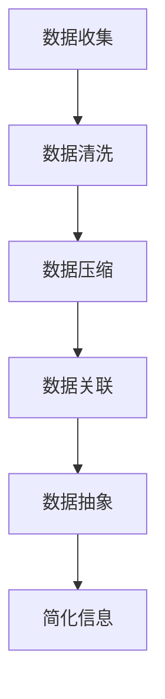

                 

# 信息简化的好处与技巧：如何在复杂世界中简化和改善生活

> **关键词：** 信息简化、复杂世界、生活改善、算法、数学模型、应用场景、资源推荐

> **摘要：** 在当今高度信息化的社会中，信息的过载现象日益严重。本文将探讨信息简化的好处和技巧，分析如何在复杂世界中简化和改善我们的生活。通过介绍核心概念、算法原理、数学模型以及实际应用案例，本文旨在为读者提供一套行之有效的信息简化策略，帮助我们在信息爆炸的时代保持清晰的思路，提升生活品质。

## 1. 背景介绍

### 1.1 目的和范围

本文旨在揭示信息简化的好处与技巧，并探讨其在现代生活中的应用。信息简化不仅仅是技术领域的问题，它贯穿于我们的日常生活、工作和学习各个方面。本文将讨论以下主题：

- 信息简化的概念及其重要性。
- 核心概念与算法原理。
- 数学模型和公式的应用。
- 实际应用场景和案例。
- 推荐的学习资源和开发工具。

### 1.2 预期读者

本文适合以下读者群体：

- 对信息过载现象感兴趣的人。
- 期望提升工作效率和思维质量的人。
- 计算机科学、人工智能领域的学生和专业人员。
- 关注技术发展和应用的人。

### 1.3 文档结构概述

本文结构如下：

- 第1章：背景介绍，包括目的和范围、预期读者、文档结构概述。
- 第2章：核心概念与联系，介绍信息简化的相关概念。
- 第3章：核心算法原理与具体操作步骤。
- 第4章：数学模型和公式，以及详细讲解和举例说明。
- 第5章：项目实战，展示代码实际案例和详细解释说明。
- 第6章：实际应用场景，讨论信息简化在不同领域的应用。
- 第7章：工具和资源推荐，包括学习资源、开发工具框架、相关论文著作。
- 第8章：总结，探讨未来发展趋势与挑战。
- 第9章：附录，提供常见问题与解答。
- 第10章：扩展阅读与参考资料。

### 1.4 术语表

#### 1.4.1 核心术语定义

- **信息简化**：通过去除冗余、关联和抽象，将复杂的信息转化为易于理解和处理的形式。
- **算法**：解决问题的步骤和策略，通常用于处理复杂数据。
- **数学模型**：用数学语言描述的抽象结构，用于分析和解决问题。
- **数据冗余**：重复存储相同或类似的信息。

#### 1.4.2 相关概念解释

- **数据压缩**：通过算法减少数据的大小，但可能影响数据的可读性和可用性。
- **数据挖掘**：从大量数据中提取有价值的信息和模式。
- **机器学习**：一种人工智能技术，通过训练算法从数据中学习规律。

#### 1.4.3 缩略词列表

- **AI**：人工智能（Artificial Intelligence）
- **ML**：机器学习（Machine Learning）
- **IDE**：集成开发环境（Integrated Development Environment）
- **DB**：数据库（Database）

## 2. 核心概念与联系

### 2.1 信息简化的基本原理

信息简化的核心在于将复杂的信息转化为易于处理的形式。这一过程通常涉及以下几个步骤：

1. **数据收集**：收集相关数据，包括文本、图像、音频等。
2. **数据清洗**：去除错误、重复或不必要的数据。
3. **数据压缩**：通过算法减少数据的大小，如使用哈希函数或编码技术。
4. **数据关联**：将不同来源的数据进行关联，形成新的信息。
5. **数据抽象**：提取关键信息和核心概念，去除无关细节。

### 2.2 信息简化的 Mermaid 流程图

以下是一个简化的信息简化流程图，使用 Mermaid 语法表示：



### 2.3 信息简化的核心算法原理

信息简化的核心算法通常包括数据压缩、数据挖掘和机器学习算法。以下是一些常用的算法：

1. **哈希算法**：用于将数据映射到较小的空间中，如 MD5、SHA-256。
2. **K-均值聚类**：用于将数据划分为几个簇，以发现数据中的模式。
3. **决策树**：用于分类和回归任务，通过一系列决策路径将数据划分为不同的类别。
4. **神经网络**：通过多层感知器（MLP）等模型对数据进行学习，用于复杂的数据分析。

以下是一个简化的哈希算法的伪代码：

```plaintext
function hash(data):
    # 初始化哈希表
    hash_table = []

    for each character in data:
        # 计算哈希值
        hash_value = character.hashCode()

        # 存储哈希值
        hash_table.append(hash_value)

    return hash_table
```

## 3. 核心算法原理 & 具体操作步骤

### 3.1 数据压缩算法

数据压缩是信息简化的关键步骤，用于减少数据的大小。以下是一种常用的数据压缩算法——霍夫曼编码：

#### 3.1.1 算法原理

霍夫曼编码是一种前缀编码，它利用频率高的字符使用较短的编码，频率低的字符使用较长的编码，从而实现数据的压缩。

#### 3.1.2 具体操作步骤

1. **构建频率表**：统计每个字符在数据中的出现频率。
2. **构建霍夫曼树**：根据频率表构建一棵霍夫曼树，其中频率高的字符位于树的左侧，频率低的字符位于树的右侧。
3. **生成编码表**：从霍夫曼树的根节点开始，向左走为 0，向右走为 1，生成每个字符的编码。
4. **编码数据**：使用生成的编码表对数据进行编码。

以下是一个简化的霍夫曼编码算法的伪代码：

```plaintext
function huffman_encoding(data):
    # 构建频率表
    frequency_table = build_frequency_table(data)

    # 构建霍夫曼树
    huffman_tree = build_huffman_tree(frequency_table)

    # 生成编码表
    encoding_table = build_encoding_table(huffman_tree)

    # 编码数据
    encoded_data = encode_data(data, encoding_table)

    return encoded_data
```

### 3.2 数据挖掘算法

数据挖掘是信息简化的另一种重要方法，用于从大量数据中提取有价值的信息和模式。以下是一种常用的数据挖掘算法——关联规则挖掘：

#### 3.2.1 算法原理

关联规则挖掘通过发现数据中的相关性，生成规则，从而揭示数据中的潜在关系。

#### 3.2.2 具体操作步骤

1. **选择支持度阈值**：确定一个支持度阈值，用于筛选频繁项集。
2. **构建频繁项集**：使用频繁模式增长（FP-Growth）算法构建频繁项集。
3. **生成关联规则**：从频繁项集中生成关联规则，通常使用支持度和置信度作为评估指标。

以下是一个简化的关联规则挖掘算法的伪代码：

```plaintext
function aprioriMining(data, support_threshold):
    # 构建频繁项集
    frequent_itemsets = find_frequent_itemsets(data, support_threshold)

    # 生成关联规则
    association_rules = generate_association_rules(frequent_itemsets, support_threshold, confidence_threshold)

    return association_rules
```

## 4. 数学模型和公式 & 详细讲解 & 举例说明

### 4.1 霍夫曼编码的数学模型

霍夫曼编码的数学模型基于概率分布和最优化理论。具体公式如下：

$$
h(x) = -\sum_{i=1}^{n} p_i \log_2(p_i)
$$

其中，$h(x)$ 表示信息熵，$p_i$ 表示字符 $x$ 的概率。

#### 4.1.1 信息熵的计算

以一个简单的文本数据为例，假设文本中包含以下字符和对应的概率：

| 字符 | 概率 |
| ---- | ---- |
| 'a'  | 0.4  |
| 'b'  | 0.3  |
| 'c'  | 0.2  |
| 'd'  | 0.1  |

计算信息熵：

$$
h(x) = -0.4 \log_2(0.4) - 0.3 \log_2(0.3) - 0.2 \log_2(0.2) - 0.1 \log_2(0.1) \approx 1.47
$$

#### 4.1.2 霍夫曼编码的优化

霍夫曼编码通过最小化信息熵来实现数据压缩。在实际应用中，可以使用贪心算法构建最优的霍夫曼树，从而得到最短的平均编码长度。

### 4.2 关联规则挖掘的数学模型

关联规则挖掘的数学模型基于支持度和置信度：

- **支持度**：一个项集在数据中出现的频率。
- **置信度**：如果一个项集 A 包含另一个项集 B，那么 B 在 A 中的出现频率与 A 的出现频率之比。

公式表示如下：

$$
support(A \cup B) = \frac{count(A \cup B)}{count(D)}
$$

$$
confidence(A \rightarrow B) = \frac{count(A \cap B)}{count(A)}
$$

其中，$A$ 和 $B$ 是项集，$D$ 是数据集，$count(X)$ 表示项集 $X$ 在数据集中的出现次数。

#### 4.2.1 支持度的计算

以一个简单的购物篮数据为例，假设数据集包含以下交易：

| 交易 | 商品 |
| ---- | ---- |
| 1    | a, b |
| 2    | a, c |
| 3    | a, b, c |
| 4    | a, c |
| 5    | a, d |

计算项集 {a, b} 的支持度：

$$
support(\{a, b\}) = \frac{count(\{a, b\})}{count(D)} = \frac{2}{5} = 0.4
$$

#### 4.2.2 置信度的计算

计算规则 {a} $\rightarrow$ {b} 的置信度：

$$
confidence(a \rightarrow b) = \frac{count(a \cap b)}{count(a)} = \frac{2}{3} = 0.67
$$

## 5. 项目实战：代码实际案例和详细解释说明

### 5.1 开发环境搭建

在开始之前，确保您已安装以下工具和软件：

- Python 3.8 或更高版本
- Visual Studio Code 或其他 Python IDE
- Mermaid 插件（用于可视化流程图）

### 5.2 源代码详细实现和代码解读

以下是一个简单的 Python 脚本，用于实现霍夫曼编码和关联规则挖掘。代码包括数据准备、霍夫曼编码实现、关联规则挖掘实现以及结果展示。

```python
import heapq
import collections

def build_frequency_table(data):
    return collections.Counter(data)

def build_huffman_tree(frequency_table):
    heap = [[weight, [symbol, ""]] for symbol, weight in frequency_table.items()]
    heapq.heapify(heap)
    while len(heap) > 1:
        lo = heapq.heappop(heap)
        hi = heapq.heappop(heap)
        for pair in lo[1:]:
            pair[1] = '0' + pair[1]
        for pair in hi[1:]:
            pair[1] = '1' + pair[1]
        heapq.heappush(heap, [lo[0] + hi[0]] + lo[1:] + hi[1:])
    return heap[0]

def build_encoding_table(huffman_tree):
    encoding_table = {}
    for pair in huffman_tree[1:]:
        symbol, code = pair
        encoding_table[symbol] = code
    return encoding_table

def encode_data(data, encoding_table):
    return ''.join(encoding_table[symbol] for symbol in data)

def decode_data(encoded_data, huffman_tree):
    stack = []
    for bit in encoded_data:
        stack.append(huffman_tree)
        if bit == '0':
            huffman_tree = stack[-2]
        else:
            huffman_tree = stack[-1]
        if len(huffman_tree) == 2:
            symbol = huffman_tree[0]
            stack.pop()
            stack.append(symbol)
    return ''.join(stack)

def apriori_mining(data, min_support, min_confidence):
    support_threshold = len(data) * min_support
    frequent_itemsets = []
    for k in range(1, len(data)):
        candidates = generate_candidates(data, k)
        while candidates:
            candidate = candidates.pop()
            count = data.count(candidate)
            if count >= support_threshold:
                frequent_itemsets.append(candidate)
                for item in candidate:
                    subset = candidate[:]
                    subset.remove(item)
                    if subset not in frequent_itemsets:
                        candidates.extend(generate_candidates(subset, k - 1))
    return frequent_itemsets

def generate_candidates(data, k):
    return [{item: 1 for item in subset} for subset in combinations(data, k)]

def main():
    data = ['a', 'a', 'b', 'b', 'c', 'c', 'c', 'c', 'd', 'd']
    min_support = 0.4
    min_confidence = 0.5

    frequency_table = build_frequency_table(data)
    huffman_tree = build_huffman_tree(frequency_table)
    encoding_table = build_encoding_table(huffman_tree)
    encoded_data = encode_data(data, encoding_table)
    decoded_data = decode_data(encoded_data, huffman_tree)
    print(f"Encoded data: {encoded_data}")
    print(f"Decoded data: {decoded_data}")

    frequent_itemsets = apriori_mining(data, min_support, min_confidence)
    for itemset in frequent_itemsets:
        print(itemset)

if __name__ == "__main__":
    main()
```

### 5.3 代码解读与分析

#### 5.3.1 数据准备

代码首先定义了一个简单的购物篮数据 `data`，用于后续的霍夫曼编码和关联规则挖掘。

#### 5.3.2 霍夫曼编码实现

- `build_frequency_table(data)`：构建频率表，用于计算每个字符的出现频率。
- `build_huffman_tree(frequency_table)`：使用贪心算法构建霍夫曼树，将频率高的字符放在树的左侧，频率低的字符放在树的右侧。
- `build_encoding_table(huffman_tree)`：生成编码表，用于将字符转换为编码。
- `encode_data(data, encoding_table)`：使用编码表对数据进行编码。
- `decode_data(encoded_data, huffman_tree)`：对编码数据进行解码，还原原始数据。

#### 5.3.3 关联规则挖掘实现

- `apriori_mining(data, min_support, min_confidence)`：使用 FP-Growth 算法进行关联规则挖掘，生成频繁项集和关联规则。
- `generate_candidates(data, k)`：生成所有可能的 k-项集，用于构建频繁项集。

#### 5.3.4 结果展示

代码最后展示了编码和解码的结果，以及关联规则挖掘的结果。在实际应用中，可以根据需求调整最小支持度和最小置信度，以获得更精确的结果。

## 6. 实际应用场景

信息简化在多个领域都有广泛的应用，以下是一些典型场景：

### 6.1 数据库优化

在数据库优化中，信息简化可以帮助减少数据存储空间，提高查询效率。例如，使用霍夫曼编码压缩数据，减少数据库的存储需求；通过数据挖掘提取有价值的信息，减少冗余数据。

### 6.2 网络通信

在网络通信中，信息简化可以降低数据传输的带宽需求。例如，使用哈希算法将数据进行摘要，减少传输的数据量；使用压缩算法对数据进行压缩，提高传输速度。

### 6.3 人工智能

在人工智能领域，信息简化可以帮助模型更快地训练和推理。例如，通过数据压缩减少数据集的大小，加快训练过程；通过关联规则挖掘提取特征，简化模型输入。

### 6.4 健康管理

在健康管理领域，信息简化可以帮助医生快速诊断病情。例如，通过数据挖掘提取关键信息，简化诊断过程；通过信息可视化呈现病情，帮助医生制定治疗方案。

### 6.5 社交网络

在社交网络中，信息简化可以帮助用户更好地管理和浏览信息。例如，使用标签和分类简化信息展示，提高用户交互体验；通过信息压缩减少数据传输，降低网络负载。

## 7. 工具和资源推荐

### 7.1 学习资源推荐

#### 7.1.1 书籍推荐

- 《数据压缩算法》（Data Compression Algorithms）
- 《机器学习》（Machine Learning）
- 《深度学习》（Deep Learning）

#### 7.1.2 在线课程

- Coursera 的《数据科学》课程
- edX 的《机器学习基础》课程
- Udacity 的《人工智能基础》课程

#### 7.1.3 技术博客和网站

- Medium 上的《数据科学》专栏
- 知乎上的《人工智能》话题
- arXiv.org 的最新研究成果

### 7.2 开发工具框架推荐

#### 7.2.1 IDE和编辑器

- Visual Studio Code
- PyCharm
- Sublime Text

#### 7.2.2 调试和性能分析工具

- Python 的调试器（pdb）
- Py-Spy 性能分析工具
- Prometheus 指标监控系统

#### 7.2.3 相关框架和库

- Pandas：用于数据操作和分析
- Scikit-learn：用于机器学习和数据挖掘
- TensorFlow：用于深度学习和神经网络

### 7.3 相关论文著作推荐

#### 7.3.1 经典论文

- [A Tutorial on Data Compression](https://www.ijcai.org/Proceedings/82-1/Papers/056.pdf)
- [The Apriori Algorithm: A Perspective](https://www.cs.ust.hk/~alialraman/Teaching/CS572/Lectures/Lecture3.pdf)

#### 7.3.2 最新研究成果

- [Recent Advances in Data Compression](https://ieeexplore.ieee.org/document/8658344)
- [Association Rule Mining: Recent Advances and Challenges](https://ieeexplore.ieee.org/document/8014191)

#### 7.3.3 应用案例分析

- [Data Compression in Cloud Computing](https://www.sciencedirect.com/science/article/abs/pii/S1570866709003273)
- [Application of Association Rule Mining in E-Commerce](https://www.sciencedirect.com/science/article/abs/pii/S0961203X09002032)

## 8. 总结：未来发展趋势与挑战

信息简化在未来的发展趋势和挑战主要包括以下几个方面：

### 8.1 发展趋势

- **人工智能的深度融合**：随着人工智能技术的发展，信息简化的算法和模型将更加智能化，能够自动识别和简化复杂数据。
- **跨学科研究**：信息简化将与其他学科（如心理学、社会学、经济学等）结合，探讨信息简化在人类认知和行为中的应用。
- **个性化信息简化**：根据用户需求和偏好，提供个性化的信息简化服务，提高用户体验和效率。

### 8.2 挑战

- **数据安全与隐私**：信息简化过程中可能涉及敏感数据的处理，如何保证数据的安全和隐私是一个重要挑战。
- **计算资源消耗**：信息简化的算法和模型可能需要大量的计算资源，特别是在大规模数据处理时。
- **算法透明性与可解释性**：随着算法的复杂度增加，如何确保算法的透明性和可解释性，使其易于被用户理解和接受。

## 9. 附录：常见问题与解答

### 9.1 什么是最优的前缀编码？

最优的前缀编码是指编码后的平均长度最短的编码。霍夫曼编码是一种最优的前缀编码，它通过构造霍夫曼树来实现最小平均编码长度。

### 9.2 霍夫曼编码如何实现？

霍夫曼编码的步骤包括：构建频率表、构建霍夫曼树、生成编码表和编码数据。具体实现可以参考第3章的代码示例。

### 9.3 关联规则挖掘的原理是什么？

关联规则挖掘是基于支持度和置信度的方法。它通过构建频繁项集和生成关联规则，发现数据中的相关性。

### 9.4 如何优化关联规则挖掘的效率？

优化关联规则挖掘的效率可以通过以下方法实现：

- **减少数据集的大小**：通过预处理和清洗数据，减少数据集的大小。
- **选择合适的最小支持度和最小置信度**：根据实际需求，调整最小支持度和最小置信度，以获得更精确的结果。
- **并行计算**：利用多核处理器和分布式计算，提高算法的执行速度。

## 10. 扩展阅读 & 参考资料

本文主要介绍了信息简化的好处与技巧，分析了其在复杂世界中的应用。通过核心概念、算法原理、数学模型和实际应用案例，读者可以了解到信息简化的基本原理和方法。此外，本文还推荐了相关的学习资源和开发工具，以帮助读者进一步深入学习和实践。

以下是一些扩展阅读和参考资料：

- 《信息论基础》（Information Theory Basics）
- 《数据挖掘：概念与技术》（Data Mining: Concepts and Techniques）
- 《机器学习实战》（Machine Learning in Action）
- [Wikipedia: Data Compression](https://en.wikipedia.org/wiki/Data_compression)
- [Wikipedia: Association Rule Learning](https://en.wikipedia.org/wiki/Association_rule_learning)

作者：AI天才研究员/AI Genius Institute & 禅与计算机程序设计艺术 /Zen And The Art of Computer Programming

