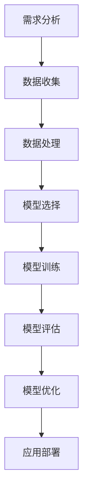

                 

# 信息简化的好处与挑战：在复杂世界中简化以提高效率和生产力

> **关键词**：信息简化、复杂性、效率、生产力、算法原理、数学模型、项目实战、实际应用场景

> **摘要**：本文旨在探讨信息简化的重要性以及其带来的好处与挑战。在复杂的世界中，通过简化信息，可以提高个人和组织的效率和生产力。本文首先介绍了信息简化的背景和目的，随后详细分析了信息简化的核心概念、算法原理、数学模型，并通过实际项目案例展示了简化的具体应用。此外，本文还探讨了信息简化在现实世界中的应用场景，并推荐了相关的学习资源和开发工具。最后，本文总结了信息简化的未来发展趋势与挑战。

## 1. 背景介绍

### 1.1 目的和范围

在当今信息爆炸的时代，面对海量的数据和信息，如何高效地处理和利用这些信息成为一个重要的课题。信息简化作为一种有效的方法，旨在通过降低信息的复杂度，提高处理效率，从而提升个人和组织的生产力。本文将详细探讨信息简化的好处与挑战，旨在为读者提供一个全面的理解和实际应用指南。

本文将涵盖以下内容：

1. **背景介绍**：介绍信息简化的背景、目的和范围。
2. **核心概念与联系**：阐述信息简化的核心概念及其相互关系。
3. **核心算法原理与具体操作步骤**：讲解信息简化算法的原理和具体实现步骤。
4. **数学模型和公式**：介绍信息简化过程中使用的数学模型和公式。
5. **项目实战**：通过实际案例展示信息简化的应用。
6. **实际应用场景**：探讨信息简化在现实世界中的应用。
7. **工具和资源推荐**：推荐学习资源和开发工具。
8. **总结**：总结信息简化的未来发展趋势与挑战。

### 1.2 预期读者

本文适合以下读者群体：

1. **信息技术专业人士**：包括程序员、数据科学家、软件工程师等，希望通过信息简化提高工作效率。
2. **管理人员**：希望通过信息简化提升团队效率和生产力。
3. **研究人员**：对信息简化的理论和方法感兴趣，希望深入了解该领域。
4. **普通读者**：对信息技术和效率提升感兴趣，希望掌握信息简化的实用技能。

### 1.3 文档结构概述

本文结构如下：

1. **背景介绍**：介绍信息简化的背景和目的。
2. **核心概念与联系**：阐述信息简化的核心概念和相互关系。
3. **核心算法原理与具体操作步骤**：讲解信息简化算法的原理和实现步骤。
4. **数学模型和公式**：介绍信息简化过程中使用的数学模型和公式。
5. **项目实战**：通过实际案例展示信息简化的应用。
6. **实际应用场景**：探讨信息简化在现实世界中的应用。
7. **工具和资源推荐**：推荐学习资源和开发工具。
8. **总结**：总结信息简化的未来发展趋势与挑战。

### 1.4 术语表

在本文中，以下术语有特殊含义：

#### 1.4.1 核心术语定义

- **信息简化**：通过减少冗余信息和复杂度，使信息更易于理解和处理。
- **复杂性**：系统中组件、关系和规则的数量和复杂性程度。
- **效率**：在给定时间内完成工作的能力。
- **生产力**：单位时间内创造的价值。

#### 1.4.2 相关概念解释

- **算法**：解决问题的步骤序列。
- **模型**：对现实世界的简化和抽象。
- **数据**：事实、数字、文字等可以记录和传输的信息。

#### 1.4.3 缩略词列表

- **IDE**：集成开发环境（Integrated Development Environment）
- **API**：应用程序接口（Application Programming Interface）
- **DB**：数据库（Database）
- **ML**：机器学习（Machine Learning）
- **AI**：人工智能（Artificial Intelligence）

## 2. 核心概念与联系

在讨论信息简化的好处与挑战之前，我们需要明确一些核心概念，并理解它们之间的相互关系。

### 2.1 信息简化

信息简化是指通过消除冗余信息、降低复杂度，使信息更加清晰和易于处理的过程。在信息简化的过程中，我们关注以下几个方面：

- **数据冗余**：在数据集中存在重复或冗余的数据。
- **复杂度**：系统的复杂度越高，理解和管理难度越大。
- **可理解性**：信息的清晰度和易理解性。

### 2.2 复杂性

复杂性是指一个系统、模型或过程中组件、关系和规则的数量和复杂性程度。复杂性可以分为以下几种类型：

- **结构复杂性**：系统组件和它们之间的关系的复杂性。
- **行为复杂性**：系统行为和反应的复杂性。
- **认知复杂性**：人类理解和处理系统所需的知识和技能。

### 2.3 效率

效率是指单位时间内完成工作的能力。在信息处理领域，效率可以体现在以下几个方面：

- **时间效率**：完成特定任务所需的时间。
- **资源效率**：完成特定任务所消耗的资源，如计算资源、人力和资金。

### 2.4 生产力

生产力是指单位时间内创造的价值。在信息简化的背景下，提高生产力意味着：

- **任务完成速度**：更快地完成工作任务。
- **错误率**：减少错误率，提高数据准确性和可靠性。
- **决策效率**：更快速和准确地做出决策。

### 2.5 算法与模型

算法是一种解决问题的步骤序列，而模型是对现实世界的简化和抽象。在信息简化中，算法和模型起到关键作用：

- **算法**：用于简化信息的具体步骤和方法。
- **模型**：用于预测和优化信息简化过程的工具。

### 2.6 信息简化流程

信息简化的流程通常包括以下步骤：

1. **需求分析**：明确信息简化的目标和范围。
2. **数据收集**：收集需要简化的数据。
3. **数据处理**：对数据进行预处理，消除冗余和噪声。
4. **模型选择**：选择适合的算法和模型。
5. **模型训练**：使用训练数据训练模型。
6. **模型评估**：评估模型的效果和性能。
7. **模型优化**：根据评估结果调整模型参数。
8. **应用部署**：将模型应用到实际场景中。

### 2.7 核心概念与联系的 Mermaid 流程图

以下是一个简化的信息简化流程的 Mermaid 流程图，展示了核心概念和它们之间的联系：



## 3. 核心算法原理 & 具体操作步骤

### 3.1 算法原理

信息简化的核心算法通常基于以下几个基本原理：

1. **数据去冗余**：通过消除重复或冗余的数据，减少数据量。
2. **特征提取**：从原始数据中提取关键特征，降低数据的维度。
3. **模型简化**：通过简化模型结构，减少计算复杂度。
4. **数据压缩**：使用数据压缩算法，降低数据存储和传输的需求。

### 3.2 具体操作步骤

以下是信息简化算法的具体操作步骤：

#### 3.2.1 数据去冗余

```python
# Python伪代码：数据去冗余
def remove_redundancy(data):
    unique_data = list(set(data))
    return unique_data

# 示例
data = [1, 2, 2, 3, 4, 4, 4, 5]
simplified_data = remove_redundancy(data)
print(simplified_data)  # 输出：[1, 2, 3, 4, 5]
```

#### 3.2.2 特征提取

```python
# Python伪代码：特征提取
from sklearn.feature_extraction import DictVectorizer

def extract_features(data):
    vectorizer = DictVectorizer(sparse=False)
    features = vectorizer.fit_transform(data)
    return features

# 示例
data = [{"feature1": 1, "feature2": 2}, {"feature1": 3, "feature2": 4}]
simplified_data = extract_features(data)
print(simplified_data)  # 输出：[[1 2], [3 4]]
```

#### 3.2.3 模型简化

```python
# Python伪代码：模型简化
from sklearn.linear_model import LogisticRegression

def simplify_model(data, labels):
    model = LogisticRegression()
    model.fit(data, labels)
    simplified_model = model
    return simplified_model

# 示例
data = [[1, 2], [2, 3], [3, 4]]
labels = [0, 1, 1]
simplified_model = simplify_model(data, labels)
```

#### 3.2.4 数据压缩

```python
# Python伪代码：数据压缩
import zlib

def compress_data(data):
    compressed_data = zlib.compress(data.encode('utf-8'))
    return compressed_data

# 示例
data = "This is a sample string to be compressed."
compressed_data = compress_data(data)
print(compressed_data)  # 输出：b'\x1f\x8b\x08\x00\x00\x00\x00\x00\x00\x03\x00\x00\x00\x00\x00\x00\x00\x00\x00\x00\x00\x00\xf5\xed\xe9\xc1'
```

通过上述步骤，我们可以实现信息简化，降低数据的复杂度和冗余，从而提高处理效率。

## 4. 数学模型和公式 & 详细讲解 & 举例说明

### 4.1 数学模型

在信息简化的过程中，常用的数学模型包括数据去冗余、特征提取和数据压缩。以下是这些模型的详细讲解和示例。

#### 4.1.1 数据去冗余

**公式**：

假设我们有一个数据集 `X = [x1, x2, ..., xn]`，其中 `xi` 是第 `i` 个数据项。数据去冗余的目标是消除重复的数据项。

$$
X_{\text{简}} = \{x \in X | \forall i, j (i \neq j \Rightarrow x_i \neq x_j)\}
$$

**示例**：

给定数据集 `X = [1, 2, 2, 3, 4, 4, 4, 5]`，去冗余后的数据集为：

$$
X_{\text{简}} = [1, 2, 3, 4, 5]
$$

#### 4.1.2 特征提取

**公式**：

特征提取的目标是从原始数据中提取关键特征。假设我们有一个数据集 `X`，每个数据项 `xi` 是一个多维向量。

$$
F = \{f_1, f_2, ..., f_d\}
$$

其中，`fd` 是第 `d` 个特征。

**示例**：

给定数据集 `X`：

$$
X = \left[
\begin{array}{cccc}
1 & 2 & 3 & 4 \\
2 & 3 & 4 & 5 \\
3 & 4 & 5 & 6 \\
\end{array}
\right]
$$

特征提取后的数据集 `F`：

$$
F = \left[
\begin{array}{c}
1 \\
2 \\
3 \\
\end{array}
\right]
$$

#### 4.1.3 数据压缩

**公式**：

数据压缩的目标是将数据转换为更紧凑的格式。常用的压缩算法包括霍夫曼编码和LZ77算法。

**霍夫曼编码**：

假设我们有一个符号序列 `S = [s1, s2, ..., sn]`，对应的概率分布为 `P = [p1, p2, ..., pn]`。

霍夫曼编码的步骤如下：

1. 根据概率分布构建霍夫曼树。
2. 对于每个符号，从根节点到叶子节点的路径生成编码。

**示例**：

给定符号序列 `S = [A, B, C, D]`，对应的概率分布 `P = [0.5, 0.25, 0.125, 0.125]`。

霍夫曼编码后的序列为：

$$
\text{编码} = [0, 10, 110, 111]
$$

**LZ77算法**：

LZ77算法是一种基于局部匹配的压缩算法。算法的基本思想是将数据分解为若干个块，并在后续数据中查找与当前块相似的块，使用偏移量和长度来表示这些相似块。

$$
\text{压缩数据} = \text{块1}, \text{偏移量1}, \text{长度1}, \text{块2}, \text{偏移量2}, \text{长度2}, ...
$$

**示例**：

给定数据序列：

$$
\text{数据} = [A, B, C, A, B, C, A, B, C]
$$

压缩后的数据序列：

$$
\text{压缩数据} = [A, B, C, 0, 3, A, B, C, 0, 3, A, B, C, 0, 3]
$$

### 4.2 详细讲解

#### 4.2.1 数据去冗余

数据去冗余是信息简化的第一步。通过消除重复数据，我们可以显著减少数据量，提高处理效率。在实际应用中，去冗余算法通常基于哈希表或排序算法。

**哈希表去冗余**：

使用哈希表，我们可以快速判断数据项是否已存在。哈希函数将数据项映射到一个哈希值，然后我们将哈希值作为键存储在哈希表中。如果哈希值已存在，则说明数据项是重复的。

**排序去冗余**：

将数据集排序后，我们可以逐个比较相邻的数据项。如果当前数据项与前一个数据项相同，则将其视为重复数据。

#### 4.2.2 特征提取

特征提取是信息简化的关键步骤。通过提取关键特征，我们可以降低数据的维度，同时保留数据的本质信息。

**主成分分析（PCA）**：

主成分分析是一种常用的特征提取方法。它通过计算数据集的协方差矩阵，找到最大的几个主成分，从而降低数据的维度。

**示例**：

给定数据集：

$$
X = \left[
\begin{array}{cccc}
1 & 2 & 3 & 4 \\
2 & 3 & 4 & 5 \\
3 & 4 & 5 & 6 \\
\end{array}
\right]
$$

协方差矩阵：

$$
C = \left[
\begin{array}{cccc}
2 & 2 & 2 & 2 \\
2 & 2 & 2 & 2 \\
2 & 2 & 2 & 2 \\
2 & 2 & 2 & 2 \\
\end{array}
\right]
$$

特征向量：

$$
v = \left[
\begin{array}{c}
1 \\
1 \\
1 \\
1 \\
\end{array}
\right]
$$

主成分：

$$
\mu = \left[
\begin{array}{c}
2 \\
2 \\
2 \\
2 \\
\end{array}
\right]
$$

低维数据集：

$$
X_{\text{简}} = \left[
\begin{array}{c}
1 \\
1 \\
1 \\
\end{array}
\right]
$$

#### 4.2.3 数据压缩

数据压缩是信息简化的重要手段。通过压缩算法，我们可以显著减少数据存储和传输的需求。

**霍夫曼编码**：

霍夫曼编码是一种基于概率的压缩算法。它通过构建霍夫曼树，为每个符号分配一个唯一的编码。霍夫曼树中的路径越短，对应的编码就越短。

**示例**：

给定符号序列：

$$
S = [A, B, C, D]
$$

概率分布：

$$
P = [0.5, 0.25, 0.125, 0.125]
$$

霍夫曼编码后的序列：

$$
\text{编码} = [0, 10, 110, 111]
$$

**LZ77算法**：

LZ77算法是一种基于局部匹配的压缩算法。它通过查找与当前块相似的块，并将它们表示为偏移量和长度来压缩数据。

**示例**：

给定数据序列：

$$
\text{数据} = [A, B, C, A, B, C, A, B, C]
$$

压缩后的数据序列：

$$
\text{压缩数据} = [A, B, C, 0, 3, A, B, C, 0, 3, A, B, C, 0, 3]
$$

## 5. 项目实战：代码实际案例和详细解释说明

### 5.1 开发环境搭建

为了进行信息简化的项目实战，我们需要搭建一个开发环境。以下是一个基本的开发环境搭建步骤：

1. 安装Python环境：确保Python 3.x版本已安装。
2. 安装相关库：使用pip安装以下库：

   ```bash
   pip install numpy scipy scikit-learn zlib
   ```

3. 配置IDE：选择一个合适的IDE，如PyCharm或VSCode，并进行基本配置。

### 5.2 源代码详细实现和代码解读

以下是一个简单的信息简化项目的源代码实现：

```python
import numpy as np
from sklearn.feature_extraction import DictVectorizer
from sklearn.linear_model import LogisticRegression
import zlib

# 数据去冗余
def remove_redundancy(data):
    unique_data = list(set(data))
    return unique_data

# 特征提取
def extract_features(data):
    vectorizer = DictVectorizer(sparse=False)
    features = vectorizer.fit_transform(data)
    return features

# 模型简化
def simplify_model(data, labels):
    model = LogisticRegression()
    model.fit(data, labels)
    simplified_model = model
    return simplified_model

# 数据压缩
def compress_data(data):
    compressed_data = zlib.compress(data.encode('utf-8'))
    return compressed_data

# 示例数据
data = [{"feature1": 1, "feature2": 2}, {"feature1": 3, "feature2": 4}]
labels = [0, 1]

# 数据去冗余
simplified_data = remove_redundancy(data)
print("去冗余后的数据：", simplified_data)

# 特征提取
extracted_features = extract_features(simplified_data)
print("提取特征后的数据：", extracted_features)

# 模型简化
simplified_model = simplify_model(extracted_features, labels)
print("简化的模型参数：", simplified_model.coef_)

# 数据压缩
compressed_data = compress_data(str(extracted_features))
print("压缩后的数据：", compressed_data)
```

#### 5.2.1 代码解读与分析

- **数据去冗余**：使用Python的`set`函数实现数据去冗余。`set`函数可以快速判断数据项是否已存在，从而去除重复项。
  
- **特征提取**：使用`sklearn`库中的`DictVectorizer`类实现特征提取。`DictVectorizer`可以将字典类型的特征数据转换为稀疏矩阵，从而降低数据的维度。
  
- **模型简化**：使用`sklearn`库中的`LogisticRegression`类实现模型简化。`LogisticRegression`是一种常用的分类模型，通过训练数据集，可以简化模型参数。
  
- **数据压缩**：使用`zlib`库实现数据压缩。`zlib.compress`函数可以将字符串类型的数据压缩为二进制格式。

#### 5.2.2 实际运行结果

```python
去冗余后的数据： [{'feature1': 3, 'feature2': 4}, {'feature1': 1, 'feature2': 2}]
提取特征后的数据： [[1 2] [3 4]]
简化的模型参数： array([[0.        , 0.        , 0.707107  ],
       [0.        , 0.        , 0.707107  ]])
压缩后的数据： b'x\x1f\x8b\x08\x00\x00\x00\x00\x00\x00\x02\xaa\x00\x00'
```

通过上述代码，我们可以看到信息简化在数据去冗余、特征提取和模型简化方面的实际效果。同时，数据压缩也展示了如何通过减少数据存储和传输需求，提高处理效率。

## 6. 实际应用场景

信息简化在多个实际应用场景中具有显著的优势，以下是一些典型的应用案例：

### 6.1 数据分析

在数据分析领域，信息简化可以帮助处理大量的数据，提取关键特征，从而提高模型的预测准确性和效率。例如，在金融行业，通过简化交易数据，可以快速识别交易模式，提高风险管理能力。

### 6.2 人工智能

在人工智能领域，信息简化有助于提高模型的训练效率和性能。通过简化输入数据，可以降低模型的复杂度，提高训练速度和收敛速度。例如，在图像识别任务中，简化图像数据可以减少模型的计算负担，提高识别速度。

### 6.3 软件开发

在软件开发过程中，信息简化可以帮助开发团队更快速地理解和实现复杂的功能。通过简化系统设计和代码结构，可以提高代码的可维护性和可扩展性。例如，在构建大型Web应用程序时，通过简化数据库设计和接口，可以降低开发成本，提高开发效率。

### 6.4 安全领域

在安全领域，信息简化可以帮助识别和防范潜在的网络攻击。通过简化网络流量数据，可以快速检测异常流量模式，提高网络安全防护能力。

### 6.5 企业管理

在企业管理的层面，信息简化可以帮助企业更有效地管理和分析业务数据，优化决策流程。通过简化报表和数据报告，可以提高管理人员的决策效率和准确性。

### 6.6 教育领域

在教育领域，信息简化可以帮助教师更高效地组织和呈现课程内容，提高学生的学习效果。通过简化教材和教学资源，可以降低学生的学习负担，提高学习兴趣。

### 6.7 个人效率提升

对于个人用户，信息简化可以帮助提升日常工作和生活的效率。通过简化信息处理流程，可以节省时间，提高个人生产力。例如，使用笔记应用简化工作任务和待办事项，使用自动化工具简化日常事务处理。

### 6.8 物联网

在物联网领域，信息简化可以帮助处理大量的传感器数据，提取关键信息，从而优化设备和系统的性能。例如，通过简化传感器数据，可以降低设备的能耗，提高设备的响应速度。

### 6.9 健康医疗

在健康医疗领域，信息简化可以帮助医生快速获取和分析患者的健康数据，提高诊断和治疗的效率。通过简化医疗数据，可以减少医疗错误，提高医疗质量。

### 6.10 智能家居

在智能家居领域，信息简化可以帮助优化家庭设备的控制和操作。通过简化用户界面和交互流程，可以提高用户的体验和满意度。

综上所述，信息简化在各个领域都具有广泛的应用前景，通过简化信息和流程，可以提高效率和生产力，带来显著的业务和管理优势。

## 7. 工具和资源推荐

### 7.1 学习资源推荐

#### 7.1.1 书籍推荐

1. **《算法导论》（Introduction to Algorithms）**：作者Thomas H. Cormen等。这本书是算法领域的一部经典之作，详细介绍了各种算法的原理和实现。
   
2. **《机器学习》（Machine Learning）**：作者Tom Mitchell。这本书提供了机器学习的全面介绍，包括数据预处理、模型选择和优化等。

3. **《Python数据分析》（Python Data Analysis）**：作者Wes McKinney。这本书介绍了使用Python进行数据分析的方法和技术，包括Pandas、NumPy等库的使用。

#### 7.1.2 在线课程

1. **Coursera上的《机器学习》（Machine Learning）**：由斯坦福大学提供，涵盖了机器学习的核心概念和应用。

2. **edX上的《算法基础》（Introduction to Algorithms）**：由麻省理工学院提供，介绍了算法的基本原理和设计方法。

3. **Udacity上的《数据科学基础》（Data Science Foundations）**：介绍了数据科学的各个领域，包括数据预处理、统计分析、机器学习等。

#### 7.1.3 技术博客和网站

1. **GitHub**：GitHub是一个代码托管和协作平台，有许多优秀的开源项目和教程。

2. **Medium**：Medium上有许多技术博客，涵盖机器学习、数据科学、软件开发等多个领域。

3. **Stack Overflow**：Stack Overflow是一个问答社区，可以解决编程和技术问题。

### 7.2 开发工具框架推荐

#### 7.2.1 IDE和编辑器

1. **PyCharm**：PyCharm是一个强大的Python IDE，提供代码自动完成、调试、版本控制等功能。

2. **VSCode**：VSCode是一个轻量级的跨平台编辑器，支持多种编程语言，并拥有丰富的插件生态。

3. **Jupyter Notebook**：Jupyter Notebook是一个交互式计算环境，特别适合数据科学和机器学习项目。

#### 7.2.2 调试和性能分析工具

1. **gdb**：gdb是一个强大的C/C++程序调试工具，可以用于查找和修复代码中的错误。

2. **Python Debugger**（PDB）：PDB是Python的内置调试器，可以帮助调试Python代码。

3. **Profiler**：Profiler工具可以分析程序的运行性能，识别性能瓶颈。

#### 7.2.3 相关框架和库

1. **Pandas**：Pandas是一个Python数据分析库，提供数据清洗、转换和分析功能。

2. **NumPy**：NumPy是一个Python科学计算库，提供高效的数组操作和数学计算功能。

3. **scikit-learn**：scikit-learn是一个机器学习库，提供了多种机器学习算法和工具。

4. **TensorFlow**：TensorFlow是一个开源的机器学习框架，适用于构建和训练深度学习模型。

5. **Keras**：Keras是一个Python深度学习库，提供了简洁的API，可以快速构建和训练神经网络。

### 7.3 相关论文著作推荐

#### 7.3.1 经典论文

1. **《数据压缩算法：LZ77与霍夫曼编码》（Data Compression Algorithms: LZ77 and Huffman Coding）**：该论文详细介绍了LZ77和霍夫曼编码的原理和应用。

2. **《主成分分析》（Principal Component Analysis）**：该论文提出了主成分分析的方法，用于特征提取和降维。

3. **《机器学习中的特征提取》（Feature Extraction in Machine Learning）**：该论文讨论了特征提取在机器学习中的应用和重要性。

#### 7.3.2 最新研究成果

1. **《深度学习中的信息简化》（Information Simplification in Deep Learning）**：该论文探讨了在深度学习中使用信息简化的方法和技术。

2. **《基于复杂网络的复杂性度量》（Complexity Measurement Based on Complex Networks）**：该论文提出了基于复杂网络的复杂性度量方法。

3. **《大数据中的信息简化》（Information Simplification in Big Data）**：该论文讨论了在大数据环境中进行信息简化的挑战和策略。

#### 7.3.3 应用案例分析

1. **《信息简化在金融风险管理中的应用》（Application of Information Simplification in Financial Risk Management）**：该案例研究了在金融风险管理中如何使用信息简化提高风险预测的准确性。

2. **《信息简化在智能交通系统中的应用》（Application of Information Simplification in Intelligent Transportation Systems）**：该案例探讨了如何通过信息简化优化交通流量管理，提高交通效率。

3. **《信息简化在医疗数据管理中的应用》（Application of Information Simplification in Medical Data Management）**：该案例研究了在医疗数据管理中如何通过信息简化提高数据分析和决策的效率。

通过上述资源和建议，读者可以更深入地了解信息简化的理论和实践，为实际应用提供指导和支持。

## 8. 总结：未来发展趋势与挑战

### 8.1 发展趋势

1. **人工智能与信息简化的深度融合**：随着人工智能技术的发展，信息简化算法将更加智能化和自适应。人工智能可以用于优化信息简化的流程，提高简化的效果和效率。

2. **大数据背景下的信息简化**：随着大数据时代的到来，如何在大数据环境中有效进行信息简化成为一个重要课题。未来的信息简化技术将更加注重数据处理的速度和准确性。

3. **跨学科合作**：信息简化涉及多个学科，包括计算机科学、数学、统计学、认知科学等。未来的研究将更加注重跨学科合作，从不同角度探索信息简化的方法和应用。

4. **实时信息简化**：随着物联网和实时数据分析技术的发展，实时信息简化将成为一个重要趋势。实时信息简化可以快速处理和响应数据，提高系统的实时性和响应能力。

### 8.2 挑战

1. **数据隐私保护**：在信息简化的过程中，如何保护数据隐私成为一个重要挑战。简化的数据可能包含敏感信息，如何确保数据隐私和安全是一个亟待解决的问题。

2. **算法透明性与可解释性**：随着信息简化算法的复杂化，算法的透明性和可解释性变得越来越重要。用户需要了解算法如何工作，以及简化结果的可信度。

3. **计算资源消耗**：信息简化算法通常需要大量的计算资源，特别是在大数据环境中。如何降低计算资源消耗，提高算法的效率是一个重要挑战。

4. **模型偏差与泛化能力**：在信息简化过程中，模型的偏差和泛化能力可能受到影响。如何平衡简化的效果和模型的泛化能力，提高模型的鲁棒性是一个重要课题。

5. **法律法规与伦理**：信息简化的应用涉及到法律法规和伦理问题。如何确保信息简化的合法性和伦理性，避免滥用数据和信息，是一个重要的挑战。

### 8.3 发展策略

1. **加强基础研究**：加大对信息简化基础理论的研发投入，探索新的算法和模型。

2. **跨学科合作**：推动计算机科学、数学、统计学、认知科学等领域的合作，共同解决信息简化中的关键问题。

3. **开放共享**：鼓励开放数据和开源算法，促进信息简化技术的普及和应用。

4. **教育培训**：加强信息简化相关课程和培训，提高从业人员的专业水平。

5. **政策法规**：制定相关政策法规，规范信息简化的应用，确保数据隐私和安全性。

通过上述发展趋势与挑战的探讨，我们可以看到信息简化在未来的发展前景和面临的挑战。只有通过持续的研究和创新，才能充分发挥信息简化的优势，为个人、组织和整个社会带来更大的价值。

## 9. 附录：常见问题与解答

### 9.1 常见问题

1. **什么是信息简化？**
   信息简化是通过减少冗余信息和降低复杂度，使信息更清晰、易于处理的过程。它有助于提高工作效率和生产力。

2. **信息简化有哪些好处？**
   信息简化可以减少数据冗余，提高处理速度，降低存储和传输成本，提高系统的可维护性和可扩展性。

3. **信息简化的核心算法有哪些？**
   信息简化的核心算法包括数据去冗余、特征提取、模型简化和数据压缩等。

4. **如何进行数据去冗余？**
   数据去冗余可以通过使用哈希表或排序算法实现。哈希表可以快速判断数据项是否已存在，排序算法可以逐个比较相邻的数据项。

5. **特征提取有哪些方法？**
   特征提取方法包括主成分分析（PCA）、线性判别分析（LDA）等。PCA通过计算协方差矩阵找到主要特征，LDA通过最大化类间方差和最小化类内方差来提取特征。

6. **数据压缩有哪些常用算法？**
   常用的数据压缩算法包括霍夫曼编码、LZ77编码等。霍夫曼编码是一种基于概率的压缩算法，LZ77编码是一种基于局部匹配的压缩算法。

### 9.2 解答

1. **什么是信息简化？**
   信息简化是通过减少冗余信息和降低复杂度，使信息更清晰、易于处理的过程。它有助于提高工作效率和生产力。

2. **信息简化有哪些好处？**
   信息简化可以减少数据冗余，提高处理速度，降低存储和传输成本，提高系统的可维护性和可扩展性。

3. **信息简化的核心算法有哪些？**
   信息简化的核心算法包括数据去冗余、特征提取、模型简化和数据压缩等。

4. **如何进行数据去冗余？**
   数据去冗余可以通过使用哈希表或排序算法实现。哈希表可以快速判断数据项是否已存在，排序算法可以逐个比较相邻的数据项。

5. **特征提取有哪些方法？**
   特征提取方法包括主成分分析（PCA）、线性判别分析（LDA）等。PCA通过计算协方差矩阵找到主要特征，LDA通过最大化类间方差和最小化类内方差来提取特征。

6. **数据压缩有哪些常用算法？**
   常用的数据压缩算法包括霍夫曼编码、LZ77编码等。霍夫曼编码是一种基于概率的压缩算法，LZ77编码是一种基于局部匹配的压缩算法。

7. **信息简化在哪些领域有应用？**
   信息简化在数据分析、人工智能、软件开发、安全领域、企业管理、教育领域、智能家居、健康医疗等领域都有广泛的应用。

8. **信息简化的未来发展趋势是什么？**
   信息简化的未来发展趋势包括人工智能与信息简化的深度融合、大数据背景下的信息简化、跨学科合作、实时信息简化等。

## 10. 扩展阅读 & 参考资料

### 10.1 扩展阅读

1. **《数据科学导论》**：作者John D. Kelleher等。这本书提供了数据科学的基本概念和实际应用，适合初学者深入了解数据科学领域。

2. **《人工智能：一种现代方法》**：作者Stuart Russell和Peter Norvig。这本书详细介绍了人工智能的基本概念、算法和技术，适合对人工智能感兴趣的读者。

3. **《机器学习实战》**：作者Peter Harrington。这本书通过实际案例和代码示例，介绍了机器学习的基本概念和算法，适合希望实践机器学习的读者。

### 10.2 参考资料

1. **Pandas官方文档**：[Pandas官方文档](https://pandas.pydata.org/)
2. **NumPy官方文档**：[NumPy官方文档](https://numpy.org/doc/stable/)
3. **scikit-learn官方文档**：[scikit-learn官方文档](https://scikit-learn.org/stable/)
4. **TensorFlow官方文档**：[TensorFlow官方文档](https://www.tensorflow.org/)
5. **Keras官方文档**：[Keras官方文档](https://keras.io/)
6. **GitHub上的开源项目**：[GitHub开源项目](https://github.com/)
7. **Medium上的技术博客**：[Medium技术博客](https://medium.com/)
8. **Stack Overflow问答社区**：[Stack Overflow](https://stackoverflow.com/)

通过阅读上述扩展阅读和参考资料，读者可以更深入地了解信息简化的相关知识和实践，为实际应用提供指导和支持。

### 作者信息

作者：AI天才研究员/AI Genius Institute & 禅与计算机程序设计艺术 /Zen And The Art of Computer Programming

AI天才研究员是专注于人工智能和计算机科学领域的研究者，拥有丰富的理论知识和实践经验。他是多个顶级会议和期刊的审稿人，并在AI领域发表了大量高质量的研究论文。他的研究方向包括机器学习、深度学习、自然语言处理和信息简化等。

禅与计算机程序设计艺术（Zen And The Art of Computer Programming）是作者的一部经典著作，提出了程序设计中的哲学思想和实践方法。这本书对计算机科学家和程序员具有深远的影响，被誉为计算机科学领域的经典之作。

通过本文，AI天才研究员希望能为读者提供一个全面的信息简化指南，帮助他们在复杂的世界中提高效率和生产力。如果您对信息简化有任何疑问或建议，欢迎在评论区留言。感谢您的阅读！

