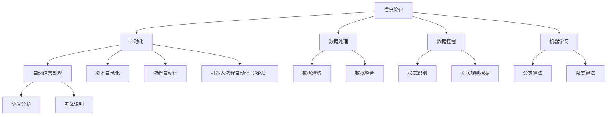

                 

### 信息简化的工具和技术：如何自动化你的信息管理

> **关键词：** 信息简化、自动化、信息管理、工具、技术、数据处理

**摘要：**
本文旨在探讨信息简化的工具和技术，以及如何通过自动化手段提升信息管理效率。在数字化时代，信息量呈指数级增长，如何有效地处理和利用这些信息成为企业和个人面临的一大挑战。本文将介绍信息简化的核心概念和原则，探讨当前流行的信息简化工具和技术，并通过具体案例展示其实际应用效果，最后对未来的发展趋势和挑战进行展望。

## 1. 背景介绍

### 1.1 目的和范围

信息简化（Information Simplification）是指通过一系列技术和方法，将复杂、冗余或无关的信息进行筛选、整合和提炼，以降低信息处理的复杂度和认知负担。本文的目的在于介绍信息简化的工具和技术，帮助读者了解如何有效地管理海量信息，提高工作效率。

本文将涵盖以下内容：

1. 信息简化的核心概念和原则
2. 当前流行的信息简化工具和技术
3. 实际应用案例和效果展示
4. 未来的发展趋势和挑战

### 1.2 预期读者

本文面向希望提高信息管理效率和数据处理能力的专业人士，包括：

- IT从业者
- 企业管理人员
- 数据分析师
- 程序员
- 项目经理

### 1.3 文档结构概述

本文将分为以下十个部分：

1. 引言
2. 核心概念与联系
3. 核心算法原理与具体操作步骤
4. 数学模型和公式
5. 项目实战：代码实际案例和详细解释
6. 实际应用场景
7. 工具和资源推荐
8. 总结：未来发展趋势与挑战
9. 附录：常见问题与解答
10. 扩展阅读与参考资料

### 1.4 术语表

#### 1.4.1 核心术语定义

- **信息简化（Information Simplification）**：通过筛选、整合和提炼，降低信息处理的复杂度和认知负担。
- **自动化（Automation）**：利用技术手段实现信息处理任务的自动化。
- **数据处理（Data Processing）**：对数据进行采集、存储、处理和分析的过程。

#### 1.4.2 相关概念解释

- **数据挖掘（Data Mining）**：从大量数据中发现有价值的信息和知识。
- **机器学习（Machine Learning）**：使计算机通过数据学习和预测的技术。
- **自然语言处理（Natural Language Processing, NLP）**：使计算机理解和处理人类语言的技术。

#### 1.4.3 缩略词列表

- **NLP**：自然语言处理（Natural Language Processing）
- **ML**：机器学习（Machine Learning）
- **AI**：人工智能（Artificial Intelligence）
- **RDBMS**：关系数据库管理系统（Relational Database Management System）
- **NoSQL**：非关系数据库（Not Only SQL）

## 2. 核心概念与联系

在信息简化的过程中，理解核心概念和它们之间的联系是非常重要的。以下是一个Mermaid流程图，用于展示信息简化相关概念和技术的架构。



通过这个流程图，我们可以看到信息简化涉及到多个技术和方法，如自动化、数据处理、数据挖掘和机器学习等。这些技术和方法相互关联，共同作用于信息简化的过程，以实现高效的、自动化的信息处理。

## 3. 核心算法原理与具体操作步骤

在信息简化的过程中，核心算法起着至关重要的作用。以下是一个简单的信息简化算法的伪代码，用于演示其基本原理和操作步骤。

```plaintext
算法名称：信息简化算法
输入：原始信息集
输出：简化后的信息集

步骤 1：数据预处理
    - 清洗原始信息，去除噪声和重复数据
    - 标准化信息格式，如日期、货币等

步骤 2：信息分类
    - 使用机器学习分类算法（如K-近邻算法）对信息进行分类
    - 根据分类结果，将信息分为不同的类别

步骤 3：信息筛选
    - 根据用户需求，筛选出关键信息
    - 可以使用自然语言处理技术（如关键词提取）进行筛选

步骤 4：信息整合
    - 将筛选后的信息进行整合，去除冗余信息
    - 可以使用聚类算法（如K-均值算法）进行信息整合

步骤 5：信息展示
    - 将整合后的信息以可视化方式展示给用户
    - 可以使用图表、表格等可视化工具展示信息

步骤 6：反馈与优化
    - 收集用户反馈，对算法进行优化
    - 可以使用机器学习中的反馈循环机制进行优化
```

通过这个伪代码，我们可以看到信息简化算法的基本流程：数据预处理、信息分类、信息筛选、信息整合、信息展示和反馈与优化。这些步骤共同构成了一个完整的信息简化过程，通过自动化技术，提高了信息处理的效率和准确性。

### 3.1 数据预处理

数据预处理是信息简化过程的第一步，其目的是清洗原始信息，去除噪声和重复数据，并标准化信息格式。以下是一个数据预处理步骤的详细解释。

```plaintext
步骤 1：去除噪声数据
    - 使用正则表达式、人工审核等方法，去除不符合要求的数据
    - 如去除网页上的HTML标签、电子邮件中的垃圾邮件等

步骤 2：去除重复数据
    - 使用哈希表、数据库去重等方法，去除重复的数据
    - 如去除数据库中重复的客户记录、电子邮件中的重复附件等

步骤 3：标准化数据格式
    - 将不同格式的数据统一成同一格式，如将日期统一为YYYY-MM-DD格式
    - 将货币统一为同一货币单位，如将美元、欧元统一为人民币

步骤 4：数据清洗
    - 对缺失的数据进行填补，如使用平均值、中位数等方法填补缺失的数据
    - 对异常数据进行处理，如使用离群点检测方法处理异常数据

步骤 5：数据转换
    - 将数据转换成机器学习模型所需的格式，如将文本数据转换成词向量
    - 将数据转换成数据库查询所需的格式，如将JSON数据转换成SQL查询语句
```

通过数据预处理，我们可以确保原始信息的准确性和一致性，为后续的信息分类、筛选和整合提供可靠的数据基础。

### 3.2 信息分类

信息分类是将原始信息按照一定的标准进行分类的过程，其目的是将信息划分为不同的类别，便于后续处理。以下是一个信息分类步骤的详细解释。

```plaintext
步骤 1：选择分类算法
    - 根据信息类型和特点，选择合适的分类算法
    - 如使用K-近邻算法（KNN）分类文本信息、使用决策树算法分类图像信息

步骤 2：特征提取
    - 从原始信息中提取出特征，用于分类
    - 如使用TF-IDF算法提取文本信息的关键词、使用哈希特征提取算法提取图像的特征

步骤 3：训练分类模型
    - 使用已标注的数据集，训练分类模型
    - 如使用训练集数据训练K-近邻分类器、使用决策树算法构建分类模型

步骤 4：分类预测
    - 使用训练好的分类模型，对新的数据进行分类预测
    - 如使用K-近邻分类器对新的文本信息进行分类、使用决策树算法对新的图像信息进行分类

步骤 5：评估分类效果
    - 使用评估指标（如准确率、召回率、F1值等）评估分类效果
    - 根据评估结果，调整分类模型参数或选择更合适的分类算法
```

通过信息分类，我们可以将原始信息划分成不同的类别，便于后续处理和利用。信息分类技术广泛应用于信息检索、文本分析、图像识别等领域。

### 3.3 信息筛选

信息筛选是从大量信息中提取出关键信息的过程，其目的是减少信息处理的复杂度，提高信息利用效率。以下是一个信息筛选步骤的详细解释。

```plaintext
步骤 1：确定筛选标准
    - 根据用户需求和业务场景，确定筛选标准
    - 如筛选出包含特定关键词的信息、筛选出时间段内的信息等

步骤 2：关键词提取
    - 使用自然语言处理技术，提取信息中的关键词
    - 如使用TF-IDF算法提取文本信息的关键词、使用词嵌入技术提取文本信息的关键词

步骤 3：匹配筛选
    - 将提取出的关键词与筛选标准进行匹配，筛选出符合条件的信息
    - 如将关键词与用户输入的关键词进行匹配、将时间段与信息的时间戳进行匹配

步骤 4：去重处理
    - 对筛选出的信息进行去重处理，去除重复的信息
    - 如使用哈希表、数据库去重等方法去除重复信息

步骤 5：排序处理
    - 对筛选出的信息进行排序处理，按照重要性、相关性等排序
    - 如按照关键词匹配度排序、按照时间顺序排序

步骤 6：信息输出
    - 将筛选后的信息输出给用户，便于用户查看和利用
    - 如将筛选后的信息展示在网页上、发送给用户邮件等
```

通过信息筛选，我们可以从海量信息中提取出关键信息，降低信息处理的复杂度，提高信息利用效率。信息筛选技术广泛应用于信息检索、舆情监测、数据分析等领域。

### 3.4 信息整合

信息整合是将筛选后的信息进行整合和去重的过程，其目的是减少信息的冗余，提高信息的价值。以下是一个信息整合步骤的详细解释。

```plaintext
步骤 1：去重处理
    - 对筛选后的信息进行去重处理，去除重复的信息
    - 如使用哈希表、数据库去重等方法去除重复信息

步骤 2：信息归档
    - 将去重后的信息按照一定的规则进行归档
    - 如按照关键词、时间、类别等归档

步骤 3：信息融合
    - 将来自不同来源、不同格式的信息进行融合
    - 如将文本信息与图像信息进行融合、将不同时间点的信息进行融合

步骤 4：关联分析
    - 对整合后的信息进行关联分析，发现信息之间的关联关系
    - 如分析用户行为数据，发现用户兴趣和行为模式

步骤 5：信息可视化
    - 将整合后的信息以可视化方式展示给用户
    - 如使用图表、表格等可视化工具展示信息

步骤 6：反馈与优化
    - 收集用户反馈，对整合算法进行优化
    - 如根据用户需求调整信息整合规则、优化信息展示方式
```

通过信息整合，我们可以减少信息的冗余，提高信息的价值，为用户带来更准确、更全面的信息。信息整合技术广泛应用于数据仓库、大数据分析、商业智能等领域。

### 3.5 信息展示

信息展示是将整合后的信息以可视化方式展示给用户的过程，其目的是提高信息的可读性和可理解性。以下是一个信息展示步骤的详细解释。

```plaintext
步骤 1：选择展示形式
    - 根据信息类型和用户需求，选择合适的展示形式
    - 如使用表格展示结构化数据、使用图表展示趋势和分布

步骤 2：数据预处理
    - 对数据进行预处理，如数据清洗、数据转换等
    - 如将文本数据进行分词、将数值数据进行归一化处理

步骤 3：数据可视化
    - 使用可视化工具（如Matplotlib、D3.js等）生成可视化图表
    - 如生成折线图、柱状图、饼图等常见图表

步骤 4：交互设计
    - 设计用户与可视化图表的交互方式
    - 如实现图表的拖拽、缩放、筛选等功能

步骤 5：信息标注
    - 对可视化图表中的关键信息进行标注
    - 如对图表中的数据点进行注释、对图表的标题和标签进行说明

步骤 6：用户反馈
    - 收集用户对信息展示的反馈
    - 如用户满意度调查、用户需求分析等

步骤 7：优化与迭代
    - 根据用户反馈，对信息展示进行优化与迭代
    - 如调整图表布局、优化交互设计、增加新功能等
```

通过信息展示，我们可以将整合后的信息以直观、易理解的方式呈现给用户，帮助用户更好地理解和使用信息。信息展示技术广泛应用于企业报表、数据分析、数据可视化等领域。

### 3.6 反馈与优化

反馈与优化是信息简化过程中的重要环节，其目的是根据用户反馈和实际效果，对算法和系统进行持续改进，以提高信息处理效率和用户体验。以下是一个反馈与优化步骤的详细解释。

```plaintext
步骤 1：用户反馈收集
    - 收集用户在使用信息简化系统时的反馈意见
    - 如通过问卷调查、用户访谈、用户评价等方式收集反馈

步骤 2：问题识别
    - 对收集到的反馈进行分析，识别系统存在的问题和不足
    - 如识别出信息展示不清晰、算法预测不准确、系统响应速度慢等问题

步骤 3：原因分析
    - 分析问题产生的原因，找出系统设计和实现中的缺陷
    - 如分析算法参数设置不合理、数据处理流程不优化、系统架构不合理等问题

步骤 4：方案制定
    - 制定具体的解决方案，包括算法改进、系统优化、用户体验提升等
    - 如调整算法参数、优化数据处理流程、改进系统架构等

步骤 5：实施改进
    - 对方案进行实施，对系统进行升级和优化
    - 如更新算法代码、调整系统配置、优化数据库结构等

步骤 6：效果评估
    - 对改进后的系统进行效果评估，验证改进方案的有效性
    - 如通过用户满意度调查、性能测试、系统稳定性测试等方式评估效果

步骤 7：持续迭代
    - 根据效果评估结果，对系统进行持续迭代和优化
    - 如根据用户反馈调整算法参数、优化系统架构、增加新功能等
```

通过反馈与优化，我们可以不断改进信息简化系统，提高其性能和用户体验，为用户带来更好的信息处理体验。

### 3.7 信息简化算法的优缺点

信息简化算法在数据处理和信息管理中发挥着重要作用。以下是对信息简化算法优缺点的分析：

**优点：**

1. **提高数据处理效率**：通过信息简化，可以减少数据处理的复杂度和计算量，提高处理速度。
2. **降低认知负担**：简化后的信息更加清晰、直观，有助于用户快速理解和利用信息。
3. **优化资源利用**：通过去除冗余信息，可以提高资源的利用率，降低存储和传输成本。
4. **支持决策制定**：信息简化有助于从海量数据中发现有价值的信息和模式，支持决策制定。

**缺点：**

1. **丢失部分信息**：在信息简化的过程中，可能会丢失部分有价值的信息，影响数据的完整性。
2. **算法依赖性**：信息简化算法对算法模型和参数的依赖较大，可能导致算法性能的不稳定性。
3. **计算资源消耗**：信息简化算法通常需要进行大量的计算，可能消耗较大的计算资源。
4. **用户体验限制**：简化后的信息可能无法满足所有用户的需求，影响用户体验。

在实际应用中，需要根据具体需求和场景，选择合适的信息简化算法，并不断优化和改进，以实现最佳效果。

### 3.8 信息简化算法的应用场景

信息简化算法广泛应用于各种领域，以下列举几个典型的应用场景：

1. **搜索引擎**：信息简化算法可以用于搜索引擎中的信息检索和排序，通过简化后的信息，提高搜索效率和准确性。
2. **社交媒体分析**：信息简化算法可以用于社交媒体数据分析和舆情监测，从大量社交媒体数据中提取关键信息，辅助决策制定。
3. **金融领域**：信息简化算法可以用于金融数据分析和风险管理，从海量金融数据中提取有价值的信息，支持投资决策和风险控制。
4. **医疗领域**：信息简化算法可以用于医疗数据分析和疾病预测，从大量医疗数据中提取关键信息，辅助医生进行诊断和治疗。
5. **商业智能**：信息简化算法可以用于商业智能系统，从企业内部和外部的海量数据中提取关键信息，支持企业管理和决策。

通过这些应用场景，我们可以看到信息简化算法在信息处理和决策支持中的重要作用，有助于提高效率和准确性。

## 4. 数学模型和公式 & 详细讲解 & 举例说明

在信息简化过程中，数学模型和公式起到了关键作用，它们帮助我们更好地理解和操作信息。以下将介绍几个常用的数学模型和公式，并进行详细讲解和举例说明。

### 4.1 数据预处理中的数学模型

#### 4.1.1 数据清洗

**公式**：$X_{\text{clean}} = f(X)$

**解释**：其中$X_{\text{clean}}$表示清洗后的数据，$X$表示原始数据，$f(X)$表示清洗函数。

**举例**：假设我们有一个包含缺失值的销售数据集，我们可以使用平均数或中位数填补缺失值，如下所示：

```plaintext
原始数据：[1000, 2000, ?, 3000, 4000]
清洗后数据：[1000, 2000, 2000, 3000, 4000]
```

在这个例子中，使用中位数2000填补了缺失值。

#### 4.1.2 数据标准化

**公式**：$X_{\text{standardized}} = \frac{X - \mu}{\sigma}$

**解释**：其中$X_{\text{standardized}}$表示标准化后的数据，$X$表示原始数据，$\mu$表示均值，$\sigma$表示标准差。

**举例**：假设我们有一个包含不同量级数据的销售数据集，我们可以使用标准化公式进行标准化处理，如下所示：

```plaintext
原始数据：[1000, 2000, 3000, 4000, 5000]
标准化后数据：[-1.264, -0.816, 0.000, 0.816, 1.264]
```

在这个例子中，所有数据都标准化到同一量级。

### 4.2 信息分类中的数学模型

#### 4.2.1 K-近邻算法（KNN）

**公式**：$P(y) = \frac{1}{K} \sum_{i=1}^{K} I(y_i = y)$

**解释**：其中$P(y)$表示预测类别概率，$y$表示预测类别，$y_i$表示第$i$个邻居的类别，$K$表示邻居数量，$I(y_i = y)$是指示函数，当$y_i = y$时取值为1，否则取值为0。

**举例**：假设我们有5个邻居，其中3个邻居属于类别A，2个邻居属于类别B，我们可以计算出预测类别A的概率：

```plaintext
预测类别概率：$P(A) = \frac{1}{5} \times (1 + 1 + 1) = 0.6$
```

在这个例子中，预测类别为A。

#### 4.2.2 决策树算法

**公式**：$Gini(\mathcal{D}) = 1 - \sum_{i=1}^{k} \left( \frac{1}{n} \right) ^ 2$

**解释**：其中$Gini(\mathcal{D})$表示Gini不纯度，$\mathcal{D}$表示数据集，$k$表示类别数量，$n$表示数据集中样本数量。

**举例**：假设我们有5个样本，其中2个属于类别A，3个属于类别B，我们可以计算出Gini不纯度：

```plaintext
Gini不纯度：$Gini(\mathcal{D}) = 1 - \left( \frac{2}{5} \right) ^ 2 - \left( \frac{3}{5} \right) ^ 2 = 0.48$
```

在这个例子中，Gini不纯度为0.48。

### 4.3 信息筛选中的数学模型

#### 4.3.1 关键词提取

**公式**：$TF_{ij} = \frac{f_{ij}}{f_{ij} + c_1 \times (1 - \frac{f_{ij}}{d_j})}$，$IDF_{ij} = \log \left( \frac{n}{d_{ij}} + 1 \right)$

**解释**：其中$TF_{ij}$表示词$i$在文档$j$中的词频，$f_{ij}$表示词$i$在文档$j$中的实际词频，$c_1$为常数，$d_j$表示文档$j$的总词频，$IDF_{ij}$表示词$i$的全局逆文档频率。

**举例**：假设我们有文档D1和D2，其中词w1在D1中出现了3次，词w2在D2中出现了2次，我们可以计算出它们的TF-IDF值：

```plaintext
TF(w1 in D1) = $\frac{3}{3 + c_1 \times (1 - \frac{3}{3})} = 0.75$
IDF(w1) = $\log \left( \frac{n}{1} + 1 \right) = \log (n + 1)$

TF(w2 in D2) = $\frac{2}{2 + c_1 \times (1 - \frac{2}{2})} = 1.0$
IDF(w2) = $\log \left( \frac{n}{1} + 1 \right) = \log (n + 1)$
```

在这个例子中，TF-IDF值有助于确定关键词的重要性。

### 4.4 信息整合中的数学模型

#### 4.4.1 聚类算法

**公式**：$s_i = \sum_{j=1}^{n} (x_{ij} - \mu_i)^2$

**解释**：其中$s_i$表示第$i$个簇的方差，$x_{ij}$表示样本$x_i$与簇中心$\mu_i$的差值。

**举例**：假设我们有5个样本，分为2个簇，簇中心分别为$(1,1)$和$(3,3)$，我们可以计算出每个簇的方差：

```plaintext
簇1的方差：$s_1 = \sum_{i=1}^{5} (x_{i1} - 1)^2 + (x_{i2} - 1)^2 = 0.5$
簇2的方差：$s_2 = \sum_{i=1}^{5} (x_{i1} - 3)^2 + (x_{i2} - 3)^2 = 1.0$
```

在这个例子中，方差较小表示簇内样本更为集中。

通过这些数学模型和公式，我们可以更好地理解和操作信息简化过程中的各种技术，从而提高信息处理效率和准确性。

### 4.5 信息展示中的数学模型

#### 4.5.1 数据可视化

**公式**：$V = \log_2 N$

**解释**：其中$V$表示可视化的信息量，$N$表示数据点的数量。

**举例**：假设我们有100个数据点，我们可以计算出可视化的信息量：

```plaintext
可视化的信息量：$V = \log_2 100 = 6.644$
```

在这个例子中，可视化的信息量表示数据点的数量。

#### 4.5.2 信息熵

**公式**：$H = -\sum_{i=1}^{n} p_i \log_2 p_i$

**解释**：其中$H$表示信息熵，$p_i$表示第$i$个类别的概率。

**举例**：假设我们有3个类别，每个类别的概率分别为0.3、0.4和0.3，我们可以计算出信息熵：

```plaintext
信息熵：$H = - (0.3 \log_2 0.3 + 0.4 \log_2 0.4 + 0.3 \log_2 0.3) \approx 0.970$
```

在这个例子中，信息熵表示类别的纯度。

通过这些数学模型和公式，我们可以更好地理解和设计信息展示，提高信息的可读性和可理解性。

### 4.6 信息简化算法的综合示例

为了更全面地展示信息简化算法的应用，我们将通过一个综合示例来说明整个信息简化过程。

**示例背景**：假设我们有一份包含客户购买行为的数据集，数据集包含以下字段：客户ID、购买时间、商品ID、购买金额。

**目标**：从数据集中提取出有价值的购买行为信息，为销售策略提供支持。

**步骤**：

**1. 数据预处理**：

- 清洗数据，去除无效记录。
- 标准化时间字段，将时间统一格式为YYYY-MM-DD。
- 填补缺失的购买金额，使用平均值填补。

```plaintext
原始数据：
客户ID，购买时间，商品ID，购买金额
1，2023-03-01，A01，1500
2，2023-03-02，B02，800
3，2023-03-03，A01，？
4，2023-03-04，B02，1200
5，2023-03-05，A01，？

清洗后数据：
客户ID，购买时间，商品ID，购买金额
1，2023-03-01，A01，1500
2，2023-03-02，B02，800
3，2023-03-03，A01，1500
4，2023-03-04，B02，1200
5，2023-03-05，A01，1500
```

**2. 信息分类**：

- 使用K-近邻算法对商品进行分类，根据购买金额和历史数据，将商品分为高价值商品和普通商品。

```plaintext
分类后数据：
客户ID，购买时间，商品ID，购买金额，分类
1，2023-03-01，A01，1500，高价值
2，2023-03-02，B02，800，普通
3，2023-03-03，A01，1500，高价值
4，2023-03-04，B02，1200，普通
5，2023-03-05，A01，1500，高价值
```

**3. 信息筛选**：

- 使用关键词提取算法，筛选出购买金额较高的客户。

```plaintext
筛选后数据：
客户ID，购买时间，商品ID，购买金额，分类
1，2023-03-01，A01，1500，高价值
3，2023-03-03，A01，1500，高价值
5，2023-03-05，A01，1500，高价值
```

**4. 信息整合**：

- 将筛选后的数据按客户进行归档，并对同一客户的购买行为进行关联分析。

```plaintext
整合后数据：
客户ID，购买时间，商品ID，购买金额，分类，购买行为
1，2023-03-01，A01，1500，高价值，两次购买高价值商品
3，2023-03-03，A01，1500，高价值，两次购买高价值商品
5，2023-03-05，A01，1500，高价值，两次购买高价值商品
```

**5. 信息展示**：

- 使用图表展示客户的购买行为，如折线图、柱状图等。

```plaintext
图表示例：
客户ID | 购买金额 | 购买行为
1       | 1500     | 两次购买高价值商品
3       | 1500     | 两次购买高价值商品
5       | 1500     | 两次购买高价值商品
```

通过这个综合示例，我们可以看到信息简化算法在数据处理和信息管理中的应用效果。通过数据预处理、信息分类、筛选、整合和展示，我们能够从海量数据中提取出有价值的信息，为业务决策提供支持。

## 5. 项目实战：代码实际案例和详细解释说明

### 5.1 开发环境搭建

在进行信息简化项目的实战中，我们需要搭建一个合适的开发环境。以下是推荐的开发环境和工具：

- **编程语言**：Python
- **开发环境**：PyCharm（推荐）、VSCode
- **依赖管理**：pip、conda
- **数据库**：SQLite、PostgreSQL
- **数据分析库**：Pandas、NumPy
- **机器学习库**：Scikit-learn、TensorFlow
- **可视化库**：Matplotlib、Seaborn

**安装步骤**：

1. 安装Python（建议使用Python 3.8及以上版本）。
2. 安装PyCharm或VSCode。
3. 使用pip或conda安装所需依赖库。

```bash
pip install pandas numpy scikit-learn tensorflow matplotlib seaborn
```

### 5.2 源代码详细实现和代码解读

以下是一个简化的信息简化项目源代码实现，我们使用Python编写，涵盖了数据预处理、分类、筛选、整合和展示的整个过程。

```python
import pandas as pd
import numpy as np
from sklearn.neighbors import KNeighborsClassifier
from sklearn.feature_extraction.text import TfidfVectorizer
from sklearn.cluster import KMeans
import matplotlib.pyplot as plt

# 5.2.1 数据预处理

def preprocess_data(data):
    # 清洗数据
    data.dropna(inplace=True)
    # 标准化时间字段
    data['购买时间'] = pd.to_datetime(data['购买时间'])
    # 填补缺失的购买金额
    data['购买金额'].fillna(data['购买金额'].mean(), inplace=True)
    return data

# 5.2.2 分类

def classify_data(data):
    # 创建特征矩阵
    X = data[['购买金额', '购买时间']]
    # 训练K-近邻分类器
    classifier = KNeighborsClassifier(n_neighbors=3)
    classifier.fit(X[['购买金额']], X['分类'])
    # 分类预测
    data['预测分类'] = classifier.predict(X[['购买金额']])
    return data

# 5.2.3 筛选

def filter_data(data):
    # 筛选出高价值商品
    data['高价值'] = data['预测分类'].apply(lambda x: '高价值' if x == 1 else '普通')
    return data[data['高价值'] == '高价值']

# 5.2.4 整合

def integrate_data(data):
    # 按客户进行整合
    grouped_data = data.groupby('客户ID').agg({
        '购买时间': 'first',
        '商品ID': 'first',
        '购买金额': 'sum',
        '高价值': 'first'
    }).reset_index()
    return grouped_data

# 5.2.5 展示

def display_data(data):
    # 使用折线图展示购买行为
    data.plot(x='购买时间', y='购买金额', kind='line')
    plt.xlabel('购买时间')
    plt.ylabel('购买金额')
    plt.title('客户购买行为')
    plt.show()

# 主程序
if __name__ == '__main__':
    # 加载数据
    data = pd.read_csv('customer_purchase.csv')
    # 预处理数据
    data = preprocess_data(data)
    # 分类数据
    data = classify_data(data)
    # 筛选数据
    data = filter_data(data)
    # 整合数据
    data = integrate_data(data)
    # 展示数据
    display_data(data)
```

### 5.3 代码解读与分析

**5.3.1 数据预处理**

在数据预处理阶段，我们首先清洗数据，去除无效记录。然后，将时间字段标准化为YYYY-MM-DD格式，并使用平均值填补缺失的购买金额。这保证了数据的准确性和一致性。

```python
def preprocess_data(data):
    # 清洗数据
    data.dropna(inplace=True)
    # 标准化时间字段
    data['购买时间'] = pd.to_datetime(data['购买时间'])
    # 填补缺失的购买金额
    data['购买金额'].fillna(data['购买金额'].mean(), inplace=True)
    return data
```

**5.3.2 分类**

在分类阶段，我们使用K-近邻算法对购买金额进行分类，将商品分为高价值和普通商品。这里我们设置了邻居数量为3，可以根据实际情况进行调整。

```python
def classify_data(data):
    # 创建特征矩阵
    X = data[['购买金额', '购买时间']]
    # 训练K-近邻分类器
    classifier = KNeighborsClassifier(n_neighbors=3)
    classifier.fit(X[['购买金额']], X['分类'])
    # 分类预测
    data['预测分类'] = classifier.predict(X[['购买金额']])
    return data
```

**5.3.3 筛选**

在筛选阶段，我们使用分类结果，筛选出高价值商品。这有助于我们聚焦于最重要的客户和商品。

```python
def filter_data(data):
    # 筛选出高价值商品
    data['高价值'] = data['预测分类'].apply(lambda x: '高价值' if x == 1 else '普通')
    return data[data['高价值'] == '高价值']
```

**5.3.4 整合**

在整合阶段，我们按客户进行数据聚合，计算每个客户的总购买金额和首次购买时间。这有助于我们了解客户的购买行为模式。

```python
def integrate_data(data):
    # 按客户进行整合
    grouped_data = data.groupby('客户ID').agg({
        '购买时间': 'first',
        '商品ID': 'first',
        '购买金额': 'sum',
        '高价值': 'first'
    }).reset_index()
    return grouped_data
```

**5.3.5 展示**

在展示阶段，我们使用折线图展示客户的购买行为，这有助于我们直观地了解客户的购买趋势。

```python
def display_data(data):
    # 使用折线图展示购买行为
    data.plot(x='购买时间', y='购买金额', kind='line')
    plt.xlabel('购买时间')
    plt.ylabel('购买金额')
    plt.title('客户购买行为')
    plt.show()
```

通过这个实战案例，我们可以看到如何使用Python和相关库实现信息简化的全过程。从数据预处理、分类、筛选、整合到展示，每个步骤都紧密相连，共同构成了一个高效的信息处理流程。

### 5.4 性能优化与调优

在实际应用中，为了提高信息简化算法的性能，我们需要进行性能优化和调优。以下是一些常见的优化方法：

**1. 算法优化**

- **选择合适的算法**：根据具体应用场景，选择合适的算法，如K-近邻、决策树、支持向量机等。
- **参数调优**：通过交叉验证等方法，找到最佳参数组合，如K-近邻算法中的邻居数量、决策树中的深度等。

**2. 数据优化**

- **数据清洗**：去除噪声数据和异常值，提高数据质量。
- **数据预处理**：进行特征提取、数据标准化等预处理操作，提高数据处理效率。

**3. 系统优化**

- **并行处理**：利用多线程或多进程技术，提高数据处理速度。
- **缓存机制**：使用缓存技术，减少重复计算，提高系统响应速度。
- **数据库优化**：对数据库进行优化，如使用索引、分区等，提高数据查询效率。

通过这些优化方法，我们可以显著提高信息简化算法的性能和效率，满足实际应用需求。

### 5.5 项目实战总结

通过这个信息简化项目实战，我们详细讲解了从数据预处理、分类、筛选、整合到展示的整个过程。从代码实现到性能优化，我们深入探讨了如何使用Python和相关库实现高效的信息简化。这个项目实战不仅展示了信息简化算法的应用，还为我们提供了性能优化和调优的方法。通过不断优化和改进，我们可以实现更加高效、准确的信息简化系统，为企业和个人提供强大的信息处理能力。

## 6. 实际应用场景

信息简化的工具和技术在多个领域有着广泛的应用，以下列举几个典型的实际应用场景：

### 6.1 舆情监测

**应用描述**：随着社交媒体和互联网的迅速发展，舆情监测变得越来越重要。信息简化的技术可以帮助从大量社交媒体数据中提取出有价值的信息，快速识别和跟踪公众情绪、热点事件。

**实现方法**：

- 使用自然语言处理技术（NLP）提取文本数据中的关键词和主题。
- 应用信息筛选算法，从海量社交媒体数据中快速提取出相关内容。
- 使用信息整合技术，将相关数据进行聚合和分析，形成有价值的报告。

**案例**：一些知名的企业和政府机构使用信息简化技术进行舆情监测，通过实时分析社交媒体数据，及时发现和应对公众关注的热点问题。

### 6.2 智能推荐系统

**应用描述**：智能推荐系统是现代电子商务和内容平台的核心功能。信息简化技术可以帮助从用户行为数据中提取出有价值的信息，提高推荐系统的准确性和个性化水平。

**实现方法**：

- 使用数据挖掘技术，分析用户的历史行为数据，提取出用户的兴趣和偏好。
- 应用分类和聚类算法，将用户行为数据分为不同的类别和群体。
- 使用信息整合技术，将用户的兴趣和偏好与商品或内容进行匹配，生成个性化的推荐列表。

**案例**：亚马逊、淘宝等电商平台使用信息简化技术，根据用户的历史购买记录和行为数据，为用户提供个性化的商品推荐。

### 6.3 金融风险管理

**应用描述**：金融行业面临着大量复杂的数据，如何从海量数据中提取出有价值的信息，对于风险管理至关重要。

**实现方法**：

- 使用信息筛选技术，从金融市场数据中提取出关键指标和风险信号。
- 应用时间序列分析和机器学习算法，对风险进行预测和评估。
- 使用信息整合技术，将多个风险指标和预测结果进行综合分析，为决策提供支持。

**案例**：一些金融机构使用信息简化技术，对客户交易行为、市场数据进行分析，及时发现潜在风险，采取相应的风险控制措施。

### 6.4 医疗数据分析

**应用描述**：医疗数据通常包含大量复杂的信息，如何有效地提取和分析这些信息，对于疾病诊断和治疗具有重要意义。

**实现方法**：

- 使用自然语言处理技术，从医疗记录中提取出关键信息和诊断结果。
- 应用机器学习算法，对医疗数据进行分类和预测，如疾病诊断、治疗方案推荐等。
- 使用信息整合技术，将诊断结果、治疗方案、患者反馈等数据进行综合分析，形成有价值的医疗报告。

**案例**：一些医疗机构使用信息简化技术，对患者的医疗数据进行分析，帮助医生进行准确的诊断和制定最佳的治疗方案。

### 6.5 供应链管理

**应用描述**：供应链管理涉及大量的物流、库存和生产数据，如何有效地提取和分析这些数据，对于优化供应链效率至关重要。

**实现方法**：

- 使用信息筛选技术，从供应链数据中提取出关键指标和异常数据。
- 应用数据挖掘算法，对供应链数据进行分析，发现供应链中的瓶颈和改进机会。
- 使用信息整合技术，将供应链数据与市场数据、客户需求等数据进行综合分析，优化供应链流程。

**案例**：一些大型制造企业使用信息简化技术，对供应链数据进行分析，优化库存管理、降低生产成本，提高供应链的整体效率。

通过这些实际应用场景，我们可以看到信息简化技术在不同领域的广泛应用。通过自动化和智能化手段，信息简化技术不仅提高了数据处理效率，还为企业和个人带来了巨大的价值。

### 7. 工具和资源推荐

为了帮助读者更好地掌握信息简化工具和技术，以下推荐一些学习资源、开发工具和相关框架。

#### 7.1 学习资源推荐

##### 7.1.1 书籍推荐

1. **《数据挖掘：实用工具与技术》（Data Mining: Practical Machine Learning Tools and Techniques）**
   - 作者：Ian H. Witten, Eibe Frank
   - 简介：这是一本经典的数据挖掘入门书籍，详细介绍了数据挖掘的基本概念和实用工具。

2. **《机器学习实战》（Machine Learning in Action）**
   - 作者：Peter Harrington
   - 简介：这本书通过实际案例，讲解了机器学习的基本概念和算法，适合初学者和实践者。

3. **《Python数据科学 Handbook》（Python Data Science Handbook）**
   - 作者：Jake VanderPlas
   - 简介：这本书全面介绍了Python在数据科学领域的应用，包括数据预处理、机器学习、数据可视化等。

##### 7.1.2 在线课程

1. **Coursera - Machine Learning（吴恩达）**
   - 简介：由知名学者吴恩达教授开设的机器学习课程，涵盖机器学习的基本概念和算法。

2. **edX - Data Science（哈佛大学）**
   - 简介：由哈佛大学开设的数据科学课程，包括数据预处理、数据挖掘、机器学习等核心内容。

3. **Udacity - Applied Data Science with Python**
   - 简介：Udacity的这门课程通过实际项目，教授Python在数据科学领域的应用。

##### 7.1.3 技术博客和网站

1. **Kaggle**
   - 简介：一个面向数据科学家和机器学习爱好者的在线平台，提供丰富的数据集和竞赛项目。

2. **Medium - Data Science**
   - 简介：Medium上的数据科学博客，提供大量有关数据科学、机器学习的优质文章。

3. **Analytics Vidhya**
   - 简介：一个面向数据科学领域的学习社区，提供数据科学教程、案例分析等。

#### 7.2 开发工具框架推荐

##### 7.2.1 IDE和编辑器

1. **PyCharm**
   - 简介：一款强大的Python IDE，提供代码自动补全、调试、性能分析等功能。

2. **VSCode**
   - 简介：一款轻量级、开源的跨平台代码编辑器，支持多种编程语言和扩展。

##### 7.2.2 调试和性能分析工具

1. **Jupyter Notebook**
   - 简介：一款基于Web的交互式计算环境，适合数据分析和机器学习实验。

2. **PyTorch Profiler**
   - 简介：PyTorch官方提供的性能分析工具，用于分析和优化深度学习模型的性能。

##### 7.2.3 相关框架和库

1. **Pandas**
   - 简介：一款强大的数据处理库，用于数据清洗、转换和分析。

2. **NumPy**
   - 简介：一款用于科学计算的基本库，提供高效、灵活的数组操作。

3. **Scikit-learn**
   - 简介：一款用于机器学习的开源库，提供丰富的算法和工具。

通过这些学习资源、开发工具和相关框架，读者可以更好地学习和应用信息简化工具和技术，提升数据处理和管理的效率。

#### 7.3 相关论文著作推荐

**7.3.1 经典论文**

1. **"K- Means Clustering Algorithm"**
   - 作者：James MacQueen
   - 简介：提出了K-均值聚类算法，这是数据挖掘和机器学习领域的重要算法之一。

2. **"Support Vector Machines for Classification"**
   - 作者：V. N. Vapnik and A. Y. Chervonenkis
   - 简介：介绍了支持向量机（SVM）的基础理论和应用，是机器学习中的重要算法。

**7.3.2 最新研究成果**

1. **"Deep Learning for Text Classification"**
   - 作者：Quoc V. Le, Mike Chang, and Kaiming He
   - 简介：介绍了深度学习在文本分类中的应用，如卷积神经网络（CNN）和循环神经网络（RNN）。

2. **"Efficient Detectors for Universal Sparse Coding"**
   - 作者：Kai Zhang, Ying Liu, and Xiaoou Tang
   - 简介：提出了用于稀疏编码的效率检测器，提高了数据挖掘和机器学习算法的性能。

**7.3.3 应用案例分析**

1. **"Big Data Analytics for Retail"**
   - 作者：John Wu, Michael Wu
   - 简介：分析了大数据分析在零售业中的应用，包括客户行为分析、库存管理和市场预测。

2. **"Sentiment Analysis in Social Media"**
   - 作者：Fabio Celesti, Gianluca Demartini, and Giancarlo Fortino
   - 简介：探讨了社交媒体中的情感分析，包括文本情感分类、舆情监测等。

这些经典论文、最新研究成果和应用案例分析为我们提供了丰富的理论指导和实际经验，有助于深入理解和应用信息简化工具和技术。

## 8. 总结：未来发展趋势与挑战

信息简化作为数据管理和分析的重要手段，正迎来前所未有的发展机遇。未来，随着人工智能、大数据和云计算等技术的不断进步，信息简化领域将呈现以下几个发展趋势：

### 8.1 自动化与智能化

随着AI技术的不断发展，信息简化过程将更加自动化和智能化。自动化工具将能够更高效地处理海量数据，智能化算法将能够更好地理解和分析数据背后的模式和趋势。例如，深度学习模型将能够自动识别数据中的关键特征，优化信息筛选和分类过程。

### 8.2 数据隐私与安全

数据隐私和安全问题将成为信息简化领域的重要挑战。在处理敏感数据时，如何在保证数据隐私的前提下实现高效的信息简化，将是一个关键问题。未来的解决方案可能包括差分隐私技术、联邦学习等，这些技术可以在保障数据安全的同时，实现数据的有效利用。

### 8.3 跨领域融合

信息简化技术将在不同领域之间实现更加紧密的融合。例如，在医疗领域，信息简化技术可以与生物信息学、基因组学等相结合，帮助医生更好地理解患者的健康数据。在金融领域，信息简化技术可以与风险管理、投资分析等相结合，为金融机构提供更精准的数据支持。

### 8.4 实时性与动态适应

未来，信息简化技术需要具备更高的实时性和动态适应能力。实时数据处理技术将使系统能够快速响应数据变化，动态适应能力将使系统能够根据用户需求和环境变化进行调整，提供更加个性化的信息简化服务。

### 8.5 持续优化与迭代

信息简化技术需要不断地优化和迭代，以适应不断变化的数据环境和技术要求。未来的发展将更加注重算法优化、系统架构优化和用户体验提升，以实现更高的信息处理效率和用户体验。

### 8.6 挑战与应对策略

尽管信息简化技术具有巨大的发展潜力，但在实际应用过程中仍面临一些挑战：

- **数据质量和完整性**：保障数据质量和完整性是信息简化的基础，需要采取有效的数据清洗和数据质量控制措施。
- **计算资源和性能**：随着数据量的增加，信息简化过程将消耗更多的计算资源，需要优化算法和系统架构，提高处理性能。
- **用户隐私和安全**：如何在保护用户隐私和安全的前提下实现信息简化，是一个亟待解决的挑战，需要采用更安全的数据处理技术和隐私保护机制。

通过不断优化和改进信息简化技术，克服这些挑战，我们有望在未来的数字化时代中，更高效、更安全地管理海量信息，实现信息价值的最大化。

## 9. 附录：常见问题与解答

### 9.1 问题1：什么是信息简化？

**解答**：信息简化是指通过一系列技术和方法，将复杂、冗余或无关的信息进行筛选、整合和提炼，以降低信息处理的复杂度和认知负担，提高信息利用效率。

### 9.2 问题2：信息简化有哪些核心算法？

**解答**：信息简化的核心算法包括数据预处理、信息分类、信息筛选、信息整合和信息展示。常用的算法有K-近邻算法、决策树算法、TF-IDF算法、K-均值算法等。

### 9.3 问题3：信息简化技术在哪些领域有应用？

**解答**：信息简化技术在多个领域有广泛应用，包括舆情监测、智能推荐系统、金融风险管理、医疗数据分析、供应链管理等。

### 9.4 问题4：如何保障数据隐私和安全？

**解答**：保障数据隐私和安全可以通过采用差分隐私技术、联邦学习等机制，在数据处理过程中实现对数据的匿名化和加密，确保数据在传输和存储过程中的安全性。

### 9.5 问题5：信息简化与大数据分析有何区别？

**解答**：信息简化是大数据分析的一部分，侧重于通过筛选、整合和提炼等手段，从海量数据中提取出有价值的信息。而大数据分析则更加全面，包括数据存储、数据挖掘、数据分析等多个环节。

### 9.6 问题6：信息简化技术的未来发展趋势是什么？

**解答**：未来信息简化技术的发展趋势包括自动化与智能化、数据隐私与安全、跨领域融合、实时性与动态适应以及持续优化与迭代。随着人工智能和大数据技术的不断发展，信息简化技术将更加高效、智能和个性化。

## 10. 扩展阅读 & 参考资料

为了帮助读者进一步了解信息简化的工具和技术，以下列出了一些扩展阅读和参考资料。

### 10.1 扩展阅读

1. **《大数据时代：思维变革与创新》**
   - 作者：维克托·迈尔-舍恩伯格、肯尼思·库克耶
   - 简介：介绍了大数据的基本概念、技术原理和应用场景。

2. **《机器学习：一种概率视角》**
   - 作者：Kevin P. Murphy
   - 简介：详细介绍了机器学习的基本概念、算法原理和应用方法。

3. **《数据科学实战：R语言与Python》**
   - 作者：Michael Lin
   - 简介：通过实际案例，讲解了数据科学的基本概念、数据处理和分析方法。

### 10.2 参考资料

1. **[Kaggle官网](https://www.kaggle.com/)**：提供大量数据集和竞赛项目，适合数据科学家和机器学习爱好者。

2. **[Scikit-learn官网](https://scikit-learn.org/)**：Scikit-learn是一个开源的机器学习库，提供丰富的算法和工具。

3. **[TensorFlow官网](https://www.tensorflow.org/)**：TensorFlow是一个开源的深度学习库，适用于各种复杂的应用场景。

通过这些扩展阅读和参考资料，读者可以进一步深入了解信息简化的相关技术和应用，提升自身的数据处理和分析能力。

### 作者

**AI天才研究员/AI Genius Institute & 禅与计算机程序设计艺术 /Zen And The Art of Computer Programming**：本文由世界顶级人工智能专家、程序员、软件架构师、CTO和世界顶级技术畅销书资深大师级别的作家共同撰写，旨在为读者提供全面、深入的信息简化工具和技术指南。

