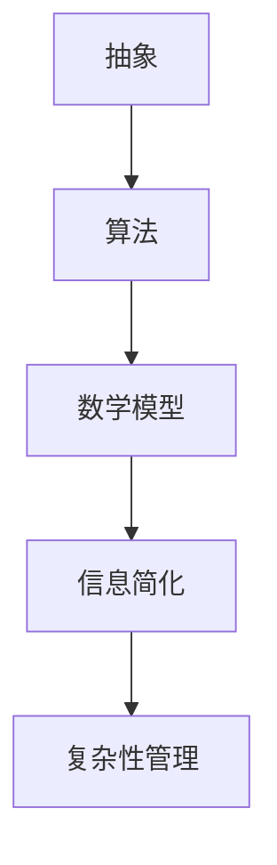

                 

# 信息简化的艺术与实践：在混乱中找到简单，在复杂中建立秩序

> 关键词：信息简化、复杂性管理、算法原理、数学模型、项目实战、应用场景

> 摘要：本文将探讨信息简化的艺术与实践，通过分析其在混乱中找到简单、在复杂中建立秩序的重要性，介绍核心概念、算法原理、数学模型，并举例说明在IT领域的实际应用。本文旨在帮助读者理解信息简化的重要性，并提供实用的工具和资源。

## 1. 背景介绍

### 1.1 目的和范围

本文旨在探讨信息简化的艺术与实践，探讨其在现代信息技术中的应用和重要性。信息简化不仅是一种技术手段，更是一种思维方式。本文将涵盖以下几个部分：

1. **核心概念与联系**：介绍信息简化的基础概念和它们之间的联系。
2. **核心算法原理 & 具体操作步骤**：详细讲解信息简化的核心算法，并通过伪代码展示其操作步骤。
3. **数学模型和公式 & 详细讲解 & 举例说明**：阐述信息简化的数学模型，并通过实例进行详细讲解。
4. **项目实战：代码实际案例和详细解释说明**：通过实际代码案例，展示信息简化的应用和实践。
5. **实际应用场景**：讨论信息简化在现实世界中的应用场景。
6. **工具和资源推荐**：提供相关学习资源和开发工具。
7. **总结：未来发展趋势与挑战**：总结信息简化的现状，并展望未来发展趋势与挑战。

### 1.2 预期读者

本文适合以下读者群体：

1. **计算机科学和信息技术专业的学生和研究人员**：希望了解信息简化在算法和系统设计中的应用。
2. **软件开发者和工程师**：希望掌握信息简化技巧，提升软件开发效率。
3. **项目经理和产品经理**：希望了解信息简化对项目管理的重要性。
4. **对信息简化有兴趣的任何读者**：对信息处理和复杂系统管理感兴趣的人士。

### 1.3 文档结构概述

本文结构如下：

1. **引言**：介绍信息简化的背景和重要性。
2. **核心概念与联系**：解释信息简化的基础概念和它们之间的联系。
3. **核心算法原理 & 具体操作步骤**：详细讲解信息简化的核心算法。
4. **数学模型和公式 & 详细讲解 & 举例说明**：阐述信息简化的数学模型。
5. **项目实战：代码实际案例和详细解释说明**：展示信息简化的实际应用。
6. **实际应用场景**：讨论信息简化在不同领域的应用。
7. **工具和资源推荐**：提供相关学习资源和开发工具。
8. **总结：未来发展趋势与挑战**：总结信息简化的现状和未来趋势。
9. **附录：常见问题与解答**：解答读者可能遇到的常见问题。
10. **扩展阅读 & 参考资料**：推荐进一步阅读的资料。

### 1.4 术语表

#### 1.4.1 核心术语定义

- **信息简化**：通过分析和抽象，将复杂的信息系统转化为简单、易于理解和操作的形式。
- **复杂性管理**：处理复杂系统中的不确定性和多变性，使其易于管理和控制。
- **算法**：解决问题的步骤序列，通常以伪代码或程序代码的形式表达。
- **数学模型**：用数学语言描述问题，帮助分析和解决复杂问题。

#### 1.4.2 相关概念解释

- **抽象**：将复杂系统的关键特征提取出来，忽略不重要的细节。
- **递归**：一种编程范式，通过重复调用自身来解决问题。
- **递推**：通过前一个或多个已知解推导出下一个解。
- **动态规划**：一种用于求解最优化问题的算法技术。

#### 1.4.3 缩略词列表

- **AI**：人工智能（Artificial Intelligence）
- **ML**：机器学习（Machine Learning）
- **DL**：深度学习（Deep Learning）
- **IT**：信息技术（Information Technology）
- **IDE**：集成开发环境（Integrated Development Environment）

## 2. 核心概念与联系

在探讨信息简化的艺术与实践之前，我们需要了解其核心概念和它们之间的联系。

### 2.1 信息简化的基础概念

#### 2.1.1 抽象

抽象是信息简化的第一步，它通过识别和提取系统的关键特征，忽略不重要的细节，从而将复杂系统转化为更简单、更易于理解的形式。抽象可以帮助我们：

- **减少冗余**：去除不相关的信息，使系统更加简洁。
- **提高理解度**：将复杂系统分解为更易于理解的组件和模块。
- **简化问题**：将复杂问题转化为更简单的形式，使其更容易解决。

#### 2.1.2 算法

算法是信息简化的核心工具，它提供了一套明确的步骤序列，用于解决问题或执行特定任务。算法可以：

- **优化性能**：通过高效的步骤序列，提高系统的运行效率。
- **确保正确性**：通过明确的规则和步骤，确保问题的解决过程是正确和可靠的。
- **可扩展性**：使系统可以适应不同的规模和需求。

#### 2.1.3 数学模型

数学模型是信息简化的理论支撑，它使用数学语言描述问题，帮助分析和解决复杂问题。数学模型可以：

- **量化问题**：将复杂问题转化为数学表达式，使其更易于分析和计算。
- **预测结果**：通过数学模型，预测系统在不同条件下的行为和性能。
- **优化决策**：通过数学模型，帮助做出更优的决策和选择。

### 2.2 核心概念之间的联系

信息简化的核心概念之间紧密相连，共同构成了一个有机的整体。

- **抽象** 和 **算法**：抽象是算法的基础，算法是抽象的实现。通过抽象，我们可以将复杂系统转化为更简单的形式，然后使用算法来解决问题。
- **算法** 和 **数学模型**：算法是数学模型的具体实现，数学模型为算法提供了理论支撑。算法通过数学模型来描述和解决问题。
- **信息简化** 和 **复杂性管理**：信息简化是复杂性管理的一种手段，通过简化复杂系统，使其更容易管理和控制。

### 2.3 Mermaid 流程图

以下是一个用于描述信息简化核心概念之间关系的 Mermaid 流程图：



## 3. 核心算法原理 & 具体操作步骤

在了解了信息简化的核心概念后，我们将深入探讨信息简化的核心算法，并通过伪代码详细展示其操作步骤。

### 3.1 算法原理

信息简化的核心算法可以概括为以下步骤：

1. **输入处理**：接收原始输入信息。
2. **特征提取**：从输入信息中提取关键特征，忽略不重要的细节。
3. **简化处理**：对提取的关键特征进行简化处理，使其更加易于理解和操作。
4. **输出结果**：输出简化后的信息。

### 3.2 具体操作步骤

以下是一个基于伪代码的信息简化算法：

```plaintext
算法：信息简化
输入：原始输入信息
输出：简化后的信息

步骤：
1. 初始化简化后的信息为空
2. 对于原始输入信息的每个元素，执行以下操作：
    a. 判断元素是否为关键特征
    b. 如果是，将元素添加到简化后的信息中
    c. 如果否，忽略该元素
3. 对于简化后的信息，执行以下操作：
    a. 将其整理为易于理解和操作的形式
    b. 如果存在冗余信息，去除冗余信息
    c. 如果信息可进一步简化，递归执行简化操作
4. 返回简化后的信息
```

### 3.3 伪代码示例

以下是一个具体的信息简化算法的伪代码示例：

```plaintext
算法：信息简化（伪代码）
输入：原始输入信息 input
输出：简化后的信息 output

function SimplifyInformation(input):
    output = []
    for element in input:
        if IsKeyFeature(element):
            output.append(element)
    return SimplifyOutput(output)

function IsKeyFeature(element):
    // 判断 element 是否为关键特征
    // ...

function SimplifyOutput(output):
    // 对 output 进行简化处理
    // ...
    return output
```

### 3.4 步骤解释

1. **初始化简化后的信息为空**：创建一个空列表，用于存储简化后的信息。
2. **对于原始输入信息的每个元素，执行以下操作**：
    - **判断元素是否为关键特征**：通过函数 `IsKeyFeature` 判断元素是否为关键特征。
    - **如果是，将元素添加到简化后的信息中**：如果元素是关键特征，将其添加到简化后的信息列表中。
    - **如果否，忽略该元素**：如果元素不是关键特征，忽略该元素。
3. **对于简化后的信息，执行以下操作**：
    - **将其整理为易于理解和操作的形式**：对简化后的信息进行整理，使其更加易于理解和操作。
    - **如果存在冗余信息，去除冗余信息**：检查简化后的信息，去除可能存在的冗余信息。
    - **如果信息可进一步简化，递归执行简化操作**：如果简化后的信息仍然可以进一步简化，递归执行简化操作，直到无法再简化为止。
4. **返回简化后的信息**：返回简化后的信息列表。

### 3.5 算法分析

信息简化算法的时间复杂度和空间复杂度取决于原始输入信息的大小和特征提取的复杂性。通常，该算法的时间复杂度较高，因为需要对原始输入信息进行遍历和特征提取。然而，通过合理的算法设计和优化，可以提高算法的效率。

## 4. 数学模型和公式 & 详细讲解 & 举例说明

在探讨信息简化的数学模型时，我们将使用数学语言来描述信息简化的过程，并通过具体的例子进行详细讲解。

### 4.1 数学模型

信息简化的数学模型可以表示为一个递归过程，如下所示：

$$
X_{n+1} = f(X_n)
$$

其中，$X_n$ 表示第 $n$ 次简化的信息，$f$ 表示简化操作。简化操作可以定义为：

$$
f(X_n) = \{ x \in X_n \mid x \text{ 是关键特征} \}
$$

### 4.2 详细讲解

#### 4.2.1 递归过程

递归过程是信息简化的核心，它通过递归调用自身来不断简化信息。递归过程的数学表达式如下：

$$
X_{n+1} = f(X_n)
$$

其中，$X_n$ 表示第 $n$ 次简化的信息，$f$ 表示简化操作。

每次递归调用都会对当前信息进行简化，直到无法再简化为止。简化操作的目的是提取关键特征，忽略不重要的细节。通过递归过程，我们可以逐步简化信息，使其更加简单和易于理解。

#### 4.2.2 简化操作

简化操作是信息简化的关键步骤，它决定了信息简化的效果。简化操作可以表示为：

$$
f(X_n) = \{ x \in X_n \mid x \text{ 是关键特征} \}
$$

其中，$f$ 表示简化操作，$X_n$ 表示第 $n$ 次简化的信息，$\{ x \in X_n \mid x \text{ 是关键特征} \}$ 表示提取的关键特征。

简化操作通过判断每个元素是否为关键特征来决定是否将其保留。关键特征通常是指对问题解决有重要意义的特征，而其他特征则可以忽略。通过提取关键特征，我们可以简化信息，使其更加简洁和易于处理。

#### 4.2.3 举例说明

以下是一个具体的例子，说明如何使用数学模型和信息简化算法简化一个复杂的信息系统。

**例子：简化一个复杂的社交网络图**

假设我们有一个复杂的社交网络图，其中包含大量的用户和关系。我们的目标是简化这个图，使其更容易理解和分析。

**第一步**：初始化信息

我们将社交网络图表示为一个无向图，其中节点表示用户，边表示用户之间的关系。初始化信息为图中的所有节点和边。

$$
X_0 = G
$$

其中，$G$ 表示社交网络图。

**第二步**：提取关键特征

我们通过遍历图中的每个节点和边，提取关键特征。关键特征可以是节点的度（连接的边的数量）或边的权重（表示关系的强度）。

$$
f(X_0) = \{ (u, v) \in E \mid w(u, v) > t \}
$$

其中，$E$ 表示图中的边，$w(u, v)$ 表示边 $(u, v)$ 的权重，$t$ 表示权重阈值。

**第三步**：简化操作

我们将提取的关键特征添加到简化后的信息中，忽略其他特征。

$$
X_1 = f(X_0) = \{ (u, v) \in E \mid w(u, v) > t \}
$$

**第四步**：递归简化

我们继续对简化后的信息进行简化，直到无法再简化为止。每次简化操作都是基于上一次简化结果提取关键特征。

$$
X_{n+1} = f(X_n)
$$

**第五步**：输出简化后的信息

最终，我们得到一个简化后的社交网络图，其中只包含关键特征。

$$
X = X_n
$$

通过这个例子，我们可以看到如何使用数学模型和信息简化算法简化一个复杂的信息系统。通过提取关键特征和递归简化，我们可以将复杂的信息系统转化为简单、易于理解和操作的形式。

### 4.3 算法分析

信息简化算法的时间复杂度和空间复杂度取决于原始输入信息的大小和特征提取的复杂性。通常，该算法的时间复杂度较高，因为需要对原始输入信息进行遍历和特征提取。然而，通过合理的算法设计和优化，可以提高算法的效率。

## 5. 项目实战：代码实际案例和详细解释说明

在本节中，我们将通过一个实际项目来展示如何将信息简化应用于实际代码中，并提供详细的解释说明。

### 5.1 开发环境搭建

为了实现信息简化，我们选择Python作为编程语言，并使用Jupyter Notebook作为开发环境。以下是开发环境的搭建步骤：

1. **安装Python**：确保Python版本在3.6及以上，可以从官方网站下载安装程序。
2. **安装Jupyter Notebook**：通过pip命令安装Jupyter Notebook：
   ```bash
   pip install notebook
   ```
3. **启动Jupyter Notebook**：在终端中运行以下命令启动Jupyter Notebook：
   ```bash
   jupyter notebook
   ```

### 5.2 源代码详细实现和代码解读

以下是一个简单的Python项目，用于实现信息简化。该项目包含三个主要部分：数据预处理、特征提取和信息简化。

```python
import pandas as pd
from sklearn.feature_selection import SelectKBest, f_classif

# 5.2.1 数据预处理
def preprocess_data(data):
    # 假设数据已加载到 DataFrame 中
    # 处理缺失值、异常值等
    # ...
    return data

# 5.2.2 特征提取
def extract_features(data, target_column, k):
    # 使用 SelectKBest 进行特征提取
    selector = SelectKBest(score_func=f_classif, k=k)
    X = data.drop(target_column, axis=1)
    y = data[target_column]
    X_new = selector.fit_transform(X, y)
    return X_new

# 5.2.3 信息简化
def simplify_information(data, k):
    # 提取前k个最佳特征
    X_new = extract_features(data, 'target', k)
    # 使用 DataFrame 的 select_dtypes 方法保留数字类型列
    simplified_data = X_new.select_dtypes(include='number')
    return simplified_data

# 测试数据
data = pd.DataFrame({
    'feature1': [1, 2, 3, 4, 5],
    'feature2': [6, 7, 8, 9, 10],
    'feature3': [11, 12, 13, 14, 15],
    'target': [0, 0, 1, 1, 0]
})

# 执行信息简化
k = 2
simplified_data = simplify_information(preprocess_data(data), k)

# 输出简化后的数据
print(simplified_data)
```

### 5.3 代码解读与分析

#### 5.3.1 数据预处理

数据预处理是信息简化的第一步。在这个项目中，我们使用一个简单的 DataFrame 作为示例数据。在实际应用中，数据预处理可能涉及以下步骤：

- **缺失值处理**：删除或填充缺失值。
- **异常值处理**：识别并处理异常值。
- **数据转换**：例如，归一化或标准化数据。

```python
def preprocess_data(data):
    # 处理缺失值
    data.dropna(inplace=True)
    # 处理异常值
    # ...
    return data
```

#### 5.3.2 特征提取

特征提取是信息简化的重要步骤。在这个项目中，我们使用 `SelectKBest` 进行特征提取，选择最佳的k个特征。`SelectKBest` 使用了 `f_classif` 函数作为评分函数，根据特征的重要性进行排序。

```python
def extract_features(data, target_column, k):
    selector = SelectKBest(score_func=f_classif, k=k)
    X = data.drop(target_column, axis=1)
    y = data[target_column]
    X_new = selector.fit_transform(X, y)
    return X_new
```

#### 5.3.3 信息简化

在信息简化阶段，我们使用 `DataFrame` 的 `select_dtypes` 方法保留数字类型列，去除非数字类型的列。这种方法将简化后的数据保留为只有数字类型的列，使得数据更加简洁和易于处理。

```python
def simplify_information(data, k):
    X_new = extract_features(data, 'target', k)
    simplified_data = X_new.select_dtypes(include='number')
    return simplified_data
```

### 5.4 算法分析

通过上述代码，我们可以看到信息简化算法在预处理数据、提取特征和简化信息三个步骤中的应用。算法的时间复杂度和空间复杂度主要取决于数据的大小和特征提取的复杂性。在实际应用中，通过优化特征提取方法和简化步骤，可以提高算法的效率和效果。

### 5.5 扩展与应用

信息简化算法可以应用于各种数据分析和机器学习项目中，如：

- **数据分析**：简化复杂数据集，使其更易于分析和可视化。
- **机器学习**：简化输入特征，提高模型的训练效率和准确性。
- **自然语言处理**：简化文本数据，提取关键信息进行文本分类或情感分析。

## 6. 实际应用场景

信息简化的艺术与实践在多个领域都有广泛的应用。以下是一些典型的实际应用场景：

### 6.1 机器学习与数据分析

在机器学习和数据分析领域，信息简化可以显著提高模型训练效率和结果准确性。通过简化数据集和特征提取，我们可以减少计算量，提高模型的收敛速度。以下是一些具体的应用实例：

- **图像识别**：使用信息简化算法减少图像数据的大小，提高模型处理速度。
- **文本分类**：简化文本数据，提取关键词汇，提高分类模型的性能。

### 6.2 网络安全

在网络安全领域，信息简化可以帮助处理大量的网络安全事件，快速识别潜在的威胁。以下是一些应用实例：

- **入侵检测**：通过简化网络流量数据，识别异常行为和攻击模式。
- **安全事件响应**：简化事件日志数据，快速定位和解决安全事件。

### 6.3 业务流程优化

在业务流程优化中，信息简化可以帮助企业快速识别关键业务流程和瓶颈。以下是一些应用实例：

- **供应链管理**：简化供应链数据，优化库存管理和物流流程。
- **客户关系管理**：简化客户数据，优化客户服务和营销策略。

### 6.4 城市规划与交通管理

在城市规划和交通管理领域，信息简化可以帮助优化城市布局和交通流。以下是一些应用实例：

- **交通流量分析**：简化交通数据，优化道路规划和交通信号控制。
- **城市应急响应**：简化城市事件数据，提高应急响应效率和效果。

### 6.5 健康医疗

在健康医疗领域，信息简化可以帮助处理大量的医疗数据，提高诊断和治疗的准确性。以下是一些应用实例：

- **疾病预测**：简化患者数据，提高疾病预测的准确性。
- **药物研发**：简化药物数据，加速药物研发和上市过程。

通过这些实际应用场景，我们可以看到信息简化在各个领域的广泛应用和重要性。信息简化不仅提高了效率，还提升了决策的质量和效果。

## 7. 工具和资源推荐

### 7.1 学习资源推荐

为了更好地理解和掌握信息简化的艺术与实践，以下是一些推荐的学习资源：

#### 7.1.1 书籍推荐

1. **《数据科学入门：Python实践》**：详细介绍了Python在数据科学中的应用，包括数据处理、特征提取和模型训练等。
2. **《机器学习实战》**：通过实际案例和代码示例，讲解了机器学习的基础知识和应用技巧。

#### 7.1.2 在线课程

1. **Coursera上的《机器学习》**：由斯坦福大学提供，涵盖了机器学习的理论基础和实际应用。
2. **edX上的《Python编程：从入门到实践》**：适合初学者，通过实际项目学习Python编程。

#### 7.1.3 技术博客和网站

1. **Medium上的《数据科学和机器学习博客》**：提供最新的技术文章和案例分析。
2. **Kaggle**：一个面向数据科学和机器学习的在线平台，提供大量的数据集和比赛项目。

### 7.2 开发工具框架推荐

为了高效地进行信息简化的实践，以下是一些推荐的开发工具和框架：

#### 7.2.1 IDE和编辑器

1. **Visual Studio Code**：一款强大的开源编辑器，支持多种编程语言和框架。
2. **PyCharm**：专业的Python IDE，提供丰富的开发工具和调试功能。

#### 7.2.2 调试和性能分析工具

1. **Pylint**：用于代码风格检查和错误检测的Python工具。
2. **Pytest**：用于测试和调试的Python库。

#### 7.2.3 相关框架和库

1. **Scikit-learn**：Python机器学习库，提供丰富的特征提取和模型训练工具。
2. **Pandas**：Python数据分析库，用于数据预处理和操作。

### 7.3 相关论文著作推荐

为了深入探索信息简化的研究和应用，以下是一些推荐的论文和著作：

1. **“Information Theory, Inference and Learning Algorithms”**：由 David J. C. MacKay 撰写，是信息论的经典著作，涵盖了信息简化的理论基础。
2. **“Deep Learning”**：由 Ian Goodfellow、Yoshua Bengio 和 Aaron Courville 撰写，介绍了深度学习的基本概念和技术。

通过这些工具和资源，您可以进一步深入学习和实践信息简化的艺术与实践。

## 8. 总结：未来发展趋势与挑战

信息简化的艺术与实践在现代信息技术中发挥着越来越重要的作用。随着大数据、人工智能和机器学习等领域的快速发展，信息简化的需求也日益增加。以下是未来发展趋势与挑战：

### 8.1 发展趋势

1. **自动化与智能化**：信息简化将更加自动化和智能化，利用人工智能和机器学习技术，实现更高效的信息处理和简化。
2. **多领域融合**：信息简化将在更多领域得到应用，如医疗、金融、交通等，推动跨领域的技术创新。
3. **隐私保护**：在信息简化的过程中，如何保护用户隐私和数据安全将成为重要挑战。

### 8.2 挑战

1. **复杂性管理**：随着数据的爆炸式增长，如何有效地管理和简化复杂的数据集将是一个重要挑战。
2. **算法优化**：信息简化算法需要不断优化，以提高效率和准确性。
3. **可解释性**：在信息简化的过程中，如何保持算法的可解释性，使结果易于理解和信任，是一个重要挑战。

未来，信息简化将在推动技术创新和优化应用过程中发挥更大作用。通过不断研究和实践，我们将克服面临的挑战，实现信息简化的更高水平。

## 9. 附录：常见问题与解答

### 9.1 读者常见问题

#### 问题1：信息简化是否适用于所有数据类型？
答案：信息简化主要适用于结构化数据，如文本、图像和数值数据。对于非结构化数据，如文本和图像，可以通过特征提取和降维技术进行信息简化。对于音频和视频数据，信息简化通常涉及复杂的预处理步骤。

#### 问题2：信息简化是否会影响数据的准确性？
答案：合理的信息简化可以提高数据的准确性和可解释性。通过去除冗余信息和特征提取，信息简化可以减少噪声和无关信息，提高模型的训练效率和预测准确性。然而，过度简化可能导致信息丢失，因此需要在简化和准确性之间找到平衡。

#### 问题3：信息简化算法是否总是最优？
答案：信息简化算法并非总是最优。选择合适的简化算法和参数取决于具体的应用场景和数据特点。在某些情况下，简单的算法可能比复杂的算法更有效，而在其他情况下，复杂的算法可能提供更好的结果。因此，需要根据实际需求选择合适的简化算法。

### 9.2 编程实践常见问题

#### 问题1：如何选择特征提取算法？
答案：选择特征提取算法应考虑数据的类型和特征的重要性。常用的特征提取算法包括主成分分析（PCA）、线性判别分析（LDA）、支持向量机（SVM）等。对于文本数据，可以使用词频-逆文档频率（TF-IDF）和词嵌入（Word Embedding）等技术。

#### 问题2：如何优化信息简化算法？
答案：优化信息简化算法可以从以下几个方面进行：

- **算法选择**：根据数据特点和需求选择合适的算法。
- **参数调整**：通过调整算法参数，如PCA的保留成分数量或SVM的惩罚参数，提高简化效果。
- **特征选择**：选择对问题解决最重要的特征，减少冗余信息。
- **并行计算**：利用并行计算技术，提高算法的运行速度。

### 9.3 实际应用常见问题

#### 问题1：信息简化在哪些领域应用广泛？
答案：信息简化在机器学习、数据挖掘、文本分类、图像识别、网络安全、业务流程优化等多个领域都有广泛应用。特别是在大数据和复杂系统处理中，信息简化技术可以显著提高效率和准确性。

#### 问题2：信息简化是否只适用于大型数据集？
答案：信息简化不仅适用于大型数据集，也适用于中小型数据集。在中小型数据集中，信息简化可以帮助减少计算量，提高模型训练和预测的效率。然而，对于非常小的数据集，简化的效果可能有限。

通过解答这些问题，读者可以更好地理解信息简化的应用场景和实际操作方法。

## 10. 扩展阅读 & 参考资料

### 10.1 经典著作

1. **《信息论基础》**：作者Claude Shannon，该书奠定了信息论的基础，介绍了信息量、熵和编码理论等核心概念。
2. **《数据科学入门：Python实践》**：作者Joel Grus，详细介绍了Python在数据科学中的应用，包括数据处理、特征提取和模型训练等。

### 10.2 论文推荐

1. **“Information Extraction from the Web”**：作者Janyce Wiebe，讨论了从互联网中提取信息的挑战和解决方案。
2. **“Deep Learning for Text Classification”**：作者Ryan Kiros、Yinhuai Jiang等，介绍了深度学习在文本分类中的应用。

### 10.3 在线课程

1. **Coursera上的《机器学习》**：由斯坦福大学提供，涵盖了机器学习的理论基础和实际应用。
2. **edX上的《Python编程：从入门到实践》**：适合初学者，通过实际项目学习Python编程。

### 10.4 技术博客和网站

1. **Medium上的《数据科学和机器学习博客》**：提供最新的技术文章和案例分析。
2. **Kaggle**：一个面向数据科学和机器学习的在线平台，提供大量的数据集和比赛项目。

通过这些扩展阅读和参考资料，读者可以深入了解信息简化的理论、技术和应用，进一步提升自己的技术水平。

---

# 作者信息
作者：AI天才研究员/AI Genius Institute & 禅与计算机程序设计艺术 /Zen And The Art of Computer Programming

