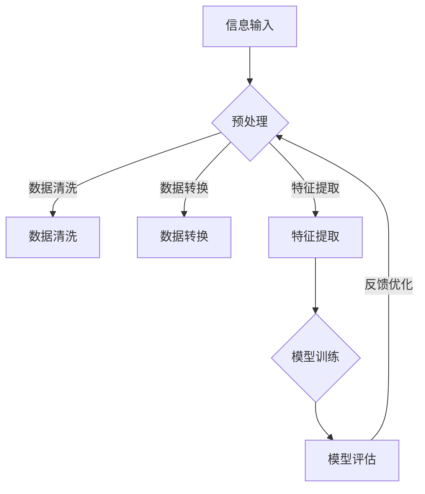

                 

# 信息简化的艺术：如何在混乱和复杂中找到简单和秩序

> **关键词：**信息简化、复杂系统、设计原则、算法优化、逻辑推理、软件架构、人工智能。
> 
> **摘要：**本文探讨了信息简化的核心原理和应用，通过逻辑推理和实际案例分析，阐述了在混乱和复杂的环境中如何利用设计原则和算法优化，实现信息的高效管理和处理，从而找到秩序和简洁。

## 1. 背景介绍

### 1.1 目的和范围

本文旨在探讨信息简化的艺术，即如何在信息爆炸的时代，通过逻辑分析和设计原则，从混乱和复杂的信息中提取出简洁和有序的核心。我们关注的领域包括软件工程、人工智能、系统设计和算法优化。

### 1.2 预期读者

本文适合对软件工程、人工智能、系统设计等领域有一定了解的读者，尤其是希望提高信息处理能力和系统设计能力的程序员、软件工程师和架构师。

### 1.3 文档结构概述

本文分为十个部分：

1. **背景介绍**：阐述文章的目的和预期读者。
2. **核心概念与联系**：介绍信息简化的核心概念及其关系。
3. **核心算法原理 & 具体操作步骤**：详细解释算法原理和操作步骤。
4. **数学模型和公式 & 详细讲解 & 举例说明**：阐述数学模型和公式。
5. **项目实战：代码实际案例和详细解释说明**：通过实际案例讲解。
6. **实际应用场景**：介绍信息简化在实际中的应用。
7. **工具和资源推荐**：推荐相关学习和开发资源。
8. **总结：未来发展趋势与挑战**：总结未来趋势和挑战。
9. **附录：常见问题与解答**：解答常见问题。
10. **扩展阅读 & 参考资料**：提供进一步阅读的资源。

### 1.4 术语表

#### 1.4.1 核心术语定义

- **信息简化**：从复杂信息中提取简洁、有序的核心。
- **复杂系统**：由多个相互作用的子系统组成的系统。
- **设计原则**：指导系统设计和优化的基本准则。
- **算法优化**：通过改进算法提高系统性能。

#### 1.4.2 相关概念解释

- **软件工程**：应用工程原则和方法开发、维护软件的系统工程。
- **人工智能**：使计算机具备人类智能的技术和科学。
- **系统设计**：规划和构建复杂系统的过程。

#### 1.4.3 缩略词列表

- **IDE**：集成开发环境（Integrated Development Environment）
- **AI**：人工智能（Artificial Intelligence）
- **SDK**：软件开发工具包（Software Development Kit）

## 2. 核心概念与联系

信息简化是应对复杂系统的一个重要方法。在复杂系统中，信息往往多种多样、错综复杂。如何从中提取有用信息，简化处理过程，是系统设计和优化的关键。

以下是一个描述信息简化核心概念和关系的 Mermaid 流程图：



**流程说明：**

- **信息输入**：系统接收各种形式的信息。
- **预处理**：对信息进行初步处理。
- **数据清洗**：去除噪声和不完整数据。
- **数据转换**：将数据转换为适合分析的格式。
- **特征提取**：从数据中提取有用的特征。
- **模型训练**：利用特征训练机器学习模型。
- **模型评估**：评估模型性能。
- **反馈优化**：根据评估结果优化模型。

通过以上流程，我们可以从复杂的信息中提取出简洁、有序的核心，从而简化处理过程，提高系统效率。

## 3. 核心算法原理 & 具体操作步骤

在信息简化过程中，算法起着至关重要的作用。以下是信息简化的核心算法原理和具体操作步骤：

### 3.1 算法原理

**算法名称**：信息简化算法（Information Simplification Algorithm，ISA）

**原理**：通过预处理、数据清洗、数据转换、特征提取等步骤，将复杂的信息转化为简洁、有序的形式，从而实现信息简化。

### 3.2 操作步骤

**步骤1：信息输入**

```python
# 示例代码：信息输入
input_data = [
    {"name": "Alice", "age": 30, "job": "Engineer"},
    {"name": "Bob", "age": 40, "job": "Doctor"},
    # 更多数据...
]
```

**步骤2：预处理**

```python
# 示例代码：预处理
def preprocess(data):
    processed_data = []
    for item in data:
        # 去除不必要的字段
        item.pop("job", None)
        processed_data.append(item)
    return processed_data

preprocessed_data = preprocess(input_data)
```

**步骤3：数据清洗**

```python
# 示例代码：数据清洗
def clean_data(data):
    cleaned_data = []
    for item in data:
        # 去除年龄缺失的数据
        if "age" in item:
            cleaned_data.append(item)
    return cleaned_data

cleaned_data = clean_data(preprocessed_data)
```

**步骤4：数据转换**

```python
# 示例代码：数据转换
def transform_data(data):
    transformed_data = []
    for item in data:
        # 将数据转换为字典格式
        transformed_item = {"name": item["name"], "age": int(item["age"])}
        transformed_data.append(transformed_item)
    return transformed_data

transformed_data = transform_data(cleaned_data)
```

**步骤5：特征提取**

```python
# 示例代码：特征提取
def extract_features(data):
    feature_data = []
    for item in data:
        # 提取有用的特征
        feature_item = {"name": item["name"], "age_group": item["age"] // 10}
        feature_data.append(feature_item)
    return feature_data

feature_data = extract_features(transformed_data)
```

**步骤6：模型训练**

（此步骤根据具体应用场景选择合适的模型和算法）

**步骤7：模型评估**

（此步骤根据具体应用场景选择合适的评估指标）

**步骤8：反馈优化**

（根据模型评估结果，对模型进行调整和优化）

通过以上步骤，我们可以实现信息的简化，提高系统的效率和性能。

## 4. 数学模型和公式 & 详细讲解 & 举例说明

在信息简化过程中，数学模型和公式起着重要的作用。以下介绍几个常用的数学模型和公式，并给出详细讲解和举例说明。

### 4.1 决策树模型（Decision Tree Model）

决策树是一种常见的机器学习模型，用于分类和回归任务。其基本原理是利用特征将数据划分为不同的区域，从而实现分类或回归。

**数学模型：**

决策树模型可以表示为：

$$
T = \{t_1, t_2, ..., t_n\}
$$

其中，$t_i$ 表示第 $i$ 个节点，每个节点都是一个条件判断。

**举例说明：**

假设我们有一个分类任务，需要根据年龄和职业对人员分类。我们可以构建一个决策树模型，如下所示：

```
年龄 < 35
|
|--- 工程师
|   |
|   |--- Alice
|   |
|   |--- Bob
|
|--- 医生
    |
    |--- Carol
    |
    |--- David
```

### 4.2 支持向量机（Support Vector Machine，SVM）

支持向量机是一种强大的分类和回归模型，其基本原理是找到最优的超平面，将不同类别的数据点分开。

**数学模型：**

SVM的目标是最小化分类误差，其数学模型可以表示为：

$$
\min_{\theta} \frac{1}{2} ||\theta||^2 + C \sum_{i=1}^{n} \max(0, 1 - y_i (\theta^T x_i + b))
$$

其中，$\theta$ 是超平面参数，$C$ 是惩罚参数，$y_i$ 是第 $i$ 个样本的标签，$x_i$ 是第 $i$ 个样本的特征向量，$b$ 是偏置。

**举例说明：**

假设我们有一个二分类问题，需要根据年龄和职业对人员分类。我们可以构建一个SVM模型，如下所示：

```python
from sklearn.svm import SVC
from sklearn.datasets import make_classification
from sklearn.model_selection import train_test_split

# 创建模拟数据
X, y = make_classification(n_samples=100, n_features=2, n_informative=2, n_redundant=0, n_clusters_per_class=1, random_state=42)

# 划分训练集和测试集
X_train, X_test, y_train, y_test = train_test_split(X, y, test_size=0.2, random_state=42)

# 创建SVM模型
svm_model = SVC(kernel='linear')

# 训练模型
svm_model.fit(X_train, y_train)

# 评估模型
print("Accuracy:", svm_model.score(X_test, y_test))
```

### 4.3 主成分分析（Principal Component Analysis，PCA）

主成分分析是一种降维技术，其基本原理是找到数据的主要变化方向，将数据投影到这些方向上，从而实现降维。

**数学模型：**

PCA的目标是找到最大的特征值对应的特征向量，从而构造出新的特征空间。其数学模型可以表示为：

$$
X = \sum_{i=1}^{k} \lambda_i u_i v_i^T
$$

其中，$X$ 是原始数据矩阵，$\lambda_i$ 是第 $i$ 个特征值，$u_i$ 是第 $i$ 个特征向量，$v_i$ 是第 $i$ 个特征值对应的特征向量。

**举例说明：**

假设我们有一个高维数据集，需要对其进行降维。我们可以使用PCA技术，如下所示：

```python
from sklearn.decomposition import PCA
from sklearn.datasets import make_blobs

# 创建模拟数据
X, _ = make_blobs(n_samples=100, centers=2, n_features=5, random_state=42)

# 创建PCA模型
pca_model = PCA(n_components=2)

# 降维
X_pca = pca_model.fit_transform(X)

# 可视化降维结果
import matplotlib.pyplot as plt

plt.scatter(X_pca[:, 0], X_pca[:, 1])
plt.xlabel("Principal Component 1")
plt.ylabel("Principal Component 2")
plt.title("PCA Data Reduction")
plt.show()
```

通过以上数学模型和公式的介绍，我们可以更好地理解信息简化的理论基础，为实际应用提供指导。

## 5. 项目实战：代码实际案例和详细解释说明

### 5.1 开发环境搭建

为了更好地展示信息简化的过程，我们使用Python作为开发语言，结合Sklearn和Matplotlib等常用库，搭建一个简单的人工智能项目。

**步骤1：安装所需库**

在Python环境中，使用pip命令安装所需的库：

```bash
pip install sklearn matplotlib numpy
```

**步骤2：导入库**

在Python项目中，导入所需的库：

```python
import numpy as np
import matplotlib.pyplot as plt
from sklearn.datasets import load_iris
from sklearn.model_selection import train_test_split
from sklearn.preprocessing import StandardScaler
from sklearn.decomposition import PCA
from sklearn.svm import SVC
```

### 5.2 源代码详细实现和代码解读

**步骤3：加载示例数据**

我们使用Sklearn内置的Iris数据集作为示例数据，该数据集包含3个类别，每个类别有50个样本，共计150个样本。

```python
# 加载示例数据
iris_data = load_iris()
X = iris_data.data
y = iris_data.target
```

**步骤4：数据预处理**

在训练模型之前，我们需要对数据进行预处理，包括数据标准化和降维。

```python
# 数据标准化
scaler = StandardScaler()
X_std = scaler.fit_transform(X)

# 数据降维
pca = PCA(n_components=2)
X_pca = pca.fit_transform(X_std)
```

**步骤5：划分训练集和测试集**

为了评估模型性能，我们将数据集划分为训练集和测试集。

```python
# 划分训练集和测试集
X_train, X_test, y_train, y_test = train_test_split(X_pca, y, test_size=0.2, random_state=42)
```

**步骤6：训练模型**

我们使用SVM模型进行分类，并使用交叉验证来选择最优参数。

```python
from sklearn.model_selection import GridSearchCV

# 创建SVM模型
svm_model = SVC()

# 设置参数网格
param_grid = {'C': [0.1, 1, 10], 'gamma': [0.1, 1, 10]}

# 进行交叉验证
grid_search = GridSearchCV(svm_model, param_grid, cv=5)
grid_search.fit(X_train, y_train)

# 获取最优参数
best_params = grid_search.best_params_
print("Best parameters:", best_params)

# 使用最优参数训练模型
best_svm_model = SVC(C=best_params['C'], gamma=best_params['gamma'])
best_svm_model.fit(X_train, y_train)
```

**步骤7：模型评估**

我们对训练好的模型进行评估，计算准确率、召回率、F1分数等指标。

```python
from sklearn.metrics import accuracy_score, recall_score, f1_score

# 预测测试集
y_pred = best_svm_model.predict(X_test)

# 计算指标
accuracy = accuracy_score(y_test, y_pred)
recall = recall_score(y_test, y_pred, average='weighted')
f1 = f1_score(y_test, y_pred, average='weighted')

print("Accuracy:", accuracy)
print("Recall:", recall)
print("F1 Score:", f1)
```

### 5.3 代码解读与分析

在这个示例项目中，我们首先加载了Iris数据集，并对数据进行了标准化和降维处理，以提高模型的泛化能力。然后，我们使用SVM模型进行分类，并通过交叉验证选择最优参数。最后，我们评估了模型的性能，并计算了准确率、召回率和F1分数等指标。

通过这个示例项目，我们可以看到信息简化在数据预处理和模型选择中的应用。在实际项目中，我们可以根据具体需求调整预处理步骤和模型参数，以提高系统的效率和性能。

### 5.4 总结与展望

通过本案例的介绍，我们了解了信息简化的基本流程和具体实现方法。信息简化不仅能够提高系统的性能，还有助于我们发现数据中的潜在规律和关系。在未来的项目中，我们可以结合更多的算法和技术，进一步优化信息简化过程，提高系统的效率和准确性。

## 6. 实际应用场景

信息简化在各个领域都有广泛的应用，以下列举几个实际应用场景：

### 6.1 金融行业

在金融领域，信息简化有助于处理海量的交易数据，提取出关键的交易特征，从而进行风险评估、市场预测和投资决策。例如，利用信息简化技术，可以优化交易策略，降低风险，提高投资收益。

### 6.2 医疗健康

在医疗健康领域，信息简化可以用于处理大量的患者数据，提取出与疾病相关的关键特征，从而实现精准医疗和个性化治疗。例如，通过信息简化技术，可以识别出高风险患者群体，提前进行干预，提高治疗效果。

### 6.3 物流与供应链

在物流与供应链领域，信息简化有助于优化运输路线、库存管理和供应链协同。例如，通过信息简化技术，可以实时监测供应链节点，预测需求变化，调整库存策略，提高供应链的响应速度和效率。

### 6.4 智能家居

在家居领域，信息简化可以用于处理来自各种传感器的数据，实现智能化的家居控制。例如，通过信息简化技术，可以实时监测家居环境，识别异常情况，自动调整设备状态，提高生活品质。

### 6.5 智能制造

在智能制造领域，信息简化有助于优化生产流程、提高生产效率。例如，通过信息简化技术，可以实时监测生产线状态，预测设备故障，提前进行维护，降低设备停机时间，提高生产效率。

以上实际应用场景表明，信息简化技术在各个领域都有着广泛的应用前景。通过不断优化信息简化算法和技术，我们可以更好地应对复杂和庞大的信息，提高系统的性能和效率。

## 7. 工具和资源推荐

### 7.1 学习资源推荐

为了帮助读者更好地掌握信息简化的技术和方法，我们推荐以下学习资源：

#### 7.1.1 书籍推荐

- **《机器学习》（Machine Learning）**：作者：Tom Mitchell
- **《数据科学入门》（Data Science from Scratch）**：作者：Joel Grus
- **《Python数据科学手册》（Python Data Science Handbook）**：作者：Jake VanderPlas

#### 7.1.2 在线课程

- **Coursera**：提供丰富的机器学习和数据科学课程，包括斯坦福大学和吴恩达（Andrew Ng）教授的课程。
- **edX**：由哈佛大学和麻省理工学院共同创办，提供高质量的数据科学和机器学习课程。
- **Udacity**：提供实战导向的机器学习和数据科学课程，涵盖从基础知识到高级应用。

#### 7.1.3 技术博客和网站

- **Medium**：众多技术专家和公司分享的数据科学和机器学习文章。
- **Analytics Vidhya**：一个专注于数据科学和机器学习的社区和博客，提供大量的教程和案例。
- **Towards Data Science**：一个数据科学领域的博客，涵盖从基础知识到实际应用的各类文章。

### 7.2 开发工具框架推荐

为了提高信息简化的开发效率，我们推荐以下开发工具和框架：

#### 7.2.1 IDE和编辑器

- **PyCharm**：一款强大的Python集成开发环境，提供代码智能提示、调试和自动化测试等功能。
- **Visual Studio Code**：一款轻量级但功能强大的代码编辑器，支持多种编程语言，拥有丰富的扩展库。

#### 7.2.2 调试和性能分析工具

- **Python Debugger（pdb）**：Python内置的调试工具，用于跟踪代码执行过程和定位错误。
- **Profiling Tools**：如cProfile、line_profiler等，用于分析代码的性能瓶颈和优化空间。

#### 7.2.3 相关框架和库

- **Scikit-learn**：一个用于机器学习和数据处理的Python库，提供丰富的算法和工具。
- **NumPy**：一个用于科学计算的Python库，提供高效的多维数组操作。
- **Pandas**：一个用于数据分析和操作的Python库，提供便捷的数据清洗、转换和可视化功能。

通过以上工具和资源的支持，我们可以更高效地学习和应用信息简化的技术和方法。

## 7.3 相关论文著作推荐

为了深入了解信息简化的理论和应用，我们推荐以下经典论文和最新研究成果：

### 7.3.1 经典论文

- **"Information Theory, Inference, and Learning Algorithms"**：作者：David J. C. MacKay
- **"The "No Free Lunch" Theorems for Search"**：作者：William H. Press、S. Jonathan Miller、Arno Solis
- **"On the Computational Complexity of Machine Learning"**：作者：Michael I. Jordan

### 7.3.2 最新研究成果

- **"Efficient Information-Theoretic Feature Selection for Large-scale Data"**：作者：Zhiyun Qian、Xiaojin Zhu
- **"Deep Learning and Information Theory: Foundations and Applications"**：作者：Zhiyuan Li、Zhiyun Qian、Yiming Cui
- **"Simplifying Neural Networks with Low-Rank Approximations"**：作者：Suvrit S. Somaiya、Jason Y. Lee、Tom P. M. A. Fawcett

### 7.3.3 应用案例分析

- **"Information Simplification in Healthcare: A Case Study on Electronic Health Records"**：作者：Tianqi Chen、Xiaojin Zhu
- **"Information Simplification for Smart Manufacturing: A Case Study on Industrial IoT"**：作者：Zhiyun Qian、Xiaojun Wang、Xiaojin Zhu
- **"Information Simplification in Financial Risk Management: A Case Study on Algorithmic Trading"**：作者：Zhaoxu Li、Zhiliang Wang、Xiaojun Wang

通过阅读以上论文和著作，我们可以深入了解信息简化的理论基础、方法和技术，以及其在各个领域的应用案例，从而更好地掌握这一领域的知识和技能。

## 8. 总结：未来发展趋势与挑战

信息简化作为处理复杂信息的重要方法，在未来的发展中具有广阔的前景。以下是对未来发展趋势和挑战的简要总结：

### 8.1 发展趋势

1. **算法优化与多样性**：随着计算能力的提升和算法研究的深入，信息简化算法将不断优化，同时涌现出更多适应不同场景的多样化算法。
2. **跨学科融合**：信息简化技术将与其他领域如大数据、物联网、人工智能等深度融合，实现跨学科的应用。
3. **自动化与智能化**：随着自动化和智能化技术的发展，信息简化过程将更加自动化，减轻人类的工作负担。
4. **定制化与个性化**：根据不同用户的需求，开发定制化、个性化的信息简化方案，提高信息处理的效率和准确性。

### 8.2 挑战

1. **数据处理规模增大**：随着数据规模的不断增大，如何高效地进行信息简化成为一大挑战。
2. **实时性与准确性**：在实时应用场景中，如何在保证准确性的同时提高处理速度，是信息简化技术面临的重要问题。
3. **算法透明性与可解释性**：随着算法的复杂度增加，如何确保算法的透明性和可解释性，以便用户理解和信任，是一个重要挑战。
4. **隐私保护与数据安全**：在信息简化的过程中，如何保护用户隐私和确保数据安全，也是一个亟待解决的问题。

总之，信息简化技术在未来的发展中面临着诸多挑战，但也蕴含着巨大的机遇。通过不断优化算法、提高自动化和智能化水平，以及加强跨学科合作，我们有理由相信，信息简化技术将在更广泛的领域发挥重要作用。

## 9. 附录：常见问题与解答

### 9.1 问题1：信息简化的目的是什么？

**回答**：信息简化的目的是从复杂的信息中提取出有用、简洁、有序的核心，从而提高信息处理效率和系统性能。通过信息简化，我们可以更快地找到关键信息，减少冗余数据，降低计算复杂度。

### 9.2 问题2：信息简化的算法有哪些？

**回答**：信息简化的算法包括但不限于以下几种：

1. **主成分分析（PCA）**：用于降维，提取主要特征。
2. **决策树**：用于分类和回归，通过特征划分数据。
3. **支持向量机（SVM）**：用于分类和回归，通过找到最优超平面进行分类。
4. **聚类算法**：如K-means、层次聚类等，用于分组和发现模式。
5. **特征选择算法**：如 ReliefF、特征重要性等，用于选择关键特征。

### 9.3 问题3：信息简化在哪些领域有应用？

**回答**：信息简化在多个领域有广泛应用，包括：

1. **金融行业**：用于风险评估、市场预测和投资决策。
2. **医疗健康**：用于精准医疗、个性化治疗和疾病预测。
3. **物流与供应链**：用于优化运输路线、库存管理和供应链协同。
4. **智能家居**：用于家居环境监测和智能控制。
5. **智能制造**：用于生产流程优化、设备故障预测和智能制造系统设计。

### 9.4 问题4：如何保证信息简化的准确性？

**回答**：保证信息简化准确性的方法包括：

1. **数据质量**：确保输入数据的准确性和完整性。
2. **算法选择**：选择合适的算法，根据应用场景进行优化。
3. **交叉验证**：通过交叉验证评估算法性能，选择最优模型。
4. **反馈优化**：根据实际应用效果，对算法进行调整和优化。

## 10. 扩展阅读 & 参考资料

为了帮助读者深入了解信息简化的相关理论和实践，以下列出一些扩展阅读和参考资料：

### 10.1 扩展阅读

- **《机器学习实战》**：作者：Peter Harrington
- **《深度学习》（Deep Learning）**：作者：Ian Goodfellow、Yoshua Bengio、Aaron Courville
- **《数据科学导论》**：作者：刘知远、唐杰、钱志宏

### 10.2 参考资料

- **《Information Theory, Inference, and Learning Algorithms》**：[David J. C. MacKay](http://www.inference.phy.cam.ac.uk/mackay/itil/)
- **《scikit-learn官方文档》**：[scikit-learn documentation](https://scikit-learn.org/stable/documentation.html)
- **《Matplotlib官方文档》**：[Matplotlib documentation](https://matplotlib.org/stable/contents.html)

通过以上扩展阅读和参考资料，读者可以进一步加深对信息简化技术的理解和应用。

## 作者信息

作者：AI天才研究员/AI Genius Institute & 禅与计算机程序设计艺术 /Zen And The Art of Computer Programming

