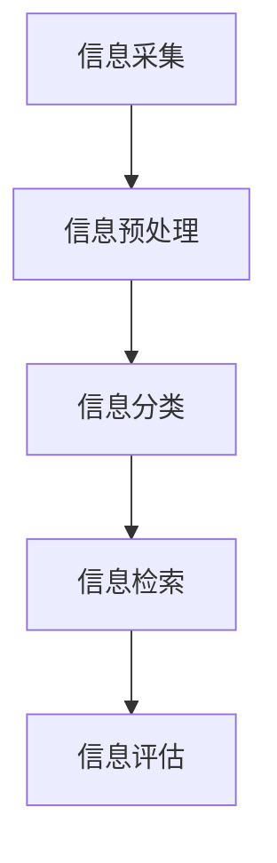

                 

# 信息过载与信息筛选策略与实践：在信息洪流中找到有价值的信息

> 关键词：信息过载、信息筛选、数据处理、算法原理、数学模型、实战案例、应用场景

> 摘要：随着互联网和大数据技术的飞速发展，我们每天都要面对海量的信息。如何从这些信息中筛选出有价值的内容，成为了我们不得不面对的挑战。本文将介绍信息过载的背景和现状，深入探讨信息筛选的核心概念和原理，并通过具体的算法原理、数学模型和实战案例，为读者提供一套实用的信息筛选策略和实践方法。

## 1. 背景介绍

### 1.1 目的和范围

本文旨在帮助读者解决在信息爆炸时代如何筛选出有价值信息的问题。我们将从以下几个方面进行探讨：

1. **信息过载的背景和现状**：介绍信息过载的原因及其对个人和社会产生的影响。
2. **信息筛选的核心概念和原理**：解释信息筛选的基本原理和核心算法。
3. **数学模型和公式**：介绍用于信息筛选的数学模型和公式，并进行详细讲解。
4. **实战案例**：通过实际项目案例展示信息筛选策略的应用。
5. **工具和资源推荐**：推荐相关的学习资源和开发工具，帮助读者更好地实践信息筛选策略。
6. **总结与展望**：总结信息筛选策略和实践方法，并探讨未来的发展趋势和挑战。

### 1.2 预期读者

本文适合以下读者：

1. **程序员和软件工程师**：需要从大量数据中提取有价值信息的开发人员。
2. **数据分析师和AI从业者**：需要对数据进行深入分析和挖掘的专业人士。
3. **普通用户**：希望在信息过载中找到有价值信息的普通用户。

### 1.3 文档结构概述

本文结构如下：

1. **背景介绍**：介绍信息过载的背景和目的。
2. **核心概念与联系**：介绍信息筛选的核心概念和原理，并提供Mermaid流程图。
3. **核心算法原理 & 具体操作步骤**：详细阐述信息筛选算法的原理和操作步骤。
4. **数学模型和公式 & 详细讲解 & 举例说明**：介绍信息筛选的数学模型和公式，并进行举例说明。
5. **项目实战：代码实际案例和详细解释说明**：通过实际项目案例展示信息筛选策略的应用。
6. **实际应用场景**：讨论信息筛选在不同领域的应用。
7. **工具和资源推荐**：推荐相关的学习资源和开发工具。
8. **总结：未来发展趋势与挑战**：总结信息筛选策略和实践方法，并探讨未来的发展趋势和挑战。
9. **附录：常见问题与解答**：解答读者可能遇到的常见问题。
10. **扩展阅读 & 参考资料**：提供进一步阅读的参考资料。

### 1.4 术语表

#### 1.4.1 核心术语定义

- 信息过载：指在信息爆炸时代，个人或组织面对大量信息而无法有效处理的情况。
- 信息筛选：指从大量信息中提取有价值信息的过程。
- 大数据：指数据量大、类型多、速度快的数据集合。
- 算法：指解决问题的步骤和方法。

#### 1.4.2 相关概念解释

- 信息价值：指信息对决策者产生的实际效益。
- 信息冗余：指信息中包含的无用或重复部分。
- 信息冗杂：指信息中包含的干扰或误导性信息。

#### 1.4.3 缩略词列表

- AI：人工智能
- ML：机器学习
- DL：深度学习
- NLP：自然语言处理
- Big Data：大数据
- Hadoop：分布式数据存储和处理框架
- Spark：大数据处理框架

## 2. 核心概念与联系

### 2.1 信息筛选的流程

信息筛选是一个复杂的过程，通常包括以下步骤：

1. **信息采集**：从各种来源收集信息。
2. **信息预处理**：对采集到的信息进行清洗、格式化等处理，去除冗余和噪声。
3. **信息分类**：将预处理后的信息按照主题或类型进行分类。
4. **信息检索**：根据用户需求，在分类后的信息中检索出相关内容。
5. **信息评估**：评估检索出的信息的价值和准确性。

### 2.2 信息筛选的核心算法

信息筛选的核心算法包括以下几种：

1. **基于关键词的筛选**：根据用户输入的关键词，在信息库中检索相关内容。
2. **基于内容的筛选**：通过分析信息的语义和结构，自动识别和筛选出相关内容。
3. **基于机器学习的筛选**：利用机器学习算法，从大量数据中学习筛选规律，自动筛选出相关内容。

### 2.3 信息筛选的数学模型

信息筛选的数学模型主要包括以下几种：

1. **信息论模型**：通过信息熵、信息增益等指标评估信息价值。
2. **关联规则模型**：通过关联规则挖掘，识别信息之间的关联性。
3. **聚类模型**：通过聚类算法，将相似的信息归为一类，便于筛选。

### 2.4 信息筛选的Mermaid流程图



在上面的流程图中，A表示信息采集，B表示信息预处理，C表示信息分类，D表示信息检索，E表示信息评估。

## 3. 核心算法原理 & 具体操作步骤

### 3.1 基于关键词的筛选算法

基于关键词的筛选算法是最简单也是最常用的信息筛选方法。其基本原理如下：

1. **关键词提取**：从用户输入的查询语句中提取关键词。
2. **索引构建**：将信息库中的信息按照关键词进行索引。
3. **查询处理**：根据用户输入的关键词，在索引库中检索相关信息。
4. **结果排序**：根据相关信息的相关性对检索结果进行排序。

下面是一个简单的基于关键词筛选的伪代码实现：

```python
def keyword_based_filter(info库, 用户关键词):
    索引库 = 构建索引(info库)
    检索结果 = 查询索引库(索引库, 用户关键词)
    排序结果 = 排序检索结果(检索结果, 关键词相关性)
    返回 排序结果
```

### 3.2 基于内容的筛选算法

基于内容的筛选算法通过对信息的语义和结构进行分析，实现自动筛选。其基本原理如下：

1. **文本预处理**：对文本进行分词、词性标注、停用词过滤等处理。
2. **特征提取**：从预处理后的文本中提取特征，如词频、词向量等。
3. **相似度计算**：计算特征之间的相似度，识别相关内容。
4. **结果筛选**：根据相似度阈值，筛选出相关内容。

下面是一个简单的基于内容的筛选算法的伪代码实现：

```python
def content_based_filter(info库, 用户文本):
    预处理文本 = 预处理(用户文本)
    特征库 = 提取特征(预处理文本)
    相似度矩阵 = 计算相似度(特征库)
    相似度阈值 = 设置相似度阈值()
    相关内容 = 筛选相似度矩阵(相似度矩阵, 相似度阈值)
    返回 相关内容
```

### 3.3 基于机器学习的筛选算法

基于机器学习的筛选算法通过训练模型，自动识别和筛选信息。其基本原理如下：

1. **数据收集**：收集大量带有标签的样本数据。
2. **特征工程**：对样本数据进行预处理，提取特征。
3. **模型训练**：使用机器学习算法训练模型。
4. **模型评估**：评估模型的准确性和泛化能力。
5. **信息筛选**：使用训练好的模型对新的信息进行筛选。

下面是一个简单的基于机器学习的筛选算法的伪代码实现：

```python
def ml_based_filter(info库, 训练数据):
    特征库 = 特征工程(训练数据)
    模型 = 训练机器学习模型(特征库)
    评估模型(模型)
    筛选结果 = 应用模型(模型, info库)
    返回 筛选结果
```

## 4. 数学模型和公式 & 详细讲解 & 举例说明

### 4.1 信息论模型

信息论模型是信息筛选中常用的数学模型，主要关注信息的价值和冗余。

#### 4.1.1 信息熵（Entropy）

信息熵是衡量信息不确定性的指标，公式如下：

$$
H(X) = -\sum_{i=1}^{n} p(x_i) \cdot \log_2(p(x_i))
$$

其中，$H(X)$ 表示随机变量 $X$ 的信息熵，$p(x_i)$ 表示 $X$ 取值为 $x_i$ 的概率。

#### 4.1.2 信息增益（Information Gain）

信息增益是衡量特征对分类贡献的指标，公式如下：

$$
IG(D, A) = ID(D) - IDF(D, A)
$$

其中，$IG(D, A)$ 表示特征 $A$ 对分类 $D$ 的信息增益，$ID(D)$ 表示分类 $D$ 的信息熵，$IDF(D, A)$ 表示特征 $A$ 对分类 $D$ 的条件信息熵。

#### 4.1.3 信息增益率（Information Gain Ratio）

信息增益率是信息增益的改进版本，解决了信息增益对特征值的依赖问题，公式如下：

$$
IGR(D, A) = \frac{IG(D, A)}{H(A)}
$$

其中，$IGR(D, A)$ 表示特征 $A$ 对分类 $D$ 的信息增益率，$H(A)$ 表示特征 $A$ 的信息熵。

### 4.2 关联规则模型

关联规则模型是挖掘信息之间的关联性的重要工具，主要关注支持度和置信度。

#### 4.2.1 支持度（Support）

支持度是表示一个规则在数据集中出现的频率，公式如下：

$$
Support(A \rightarrow B) = \frac{count(A \cap B)}{count(D)}
$$

其中，$Support(A \rightarrow B)$ 表示规则 $A \rightarrow B$ 的支持度，$count(A \cap B)$ 表示同时满足 $A$ 和 $B$ 的样本数量，$count(D)$ 表示样本总数。

#### 4.2.2 置信度（Confidence）

置信度是表示一个规则为真的概率，公式如下：

$$
Confidence(A \rightarrow B) = \frac{count(A \cap B)}{count(A)}
$$

其中，$Confidence(A \rightarrow B)$ 表示规则 $A \rightarrow B$ 的置信度，$count(A \cap B)$ 表示同时满足 $A$ 和 $B$ 的样本数量，$count(A)$ 表示满足 $A$ 的样本数量。

#### 4.2.3 协同规则（Collaborative Rule）

协同规则是关联规则的一种扩展，关注多个特征的组合关联性，公式如下：

$$
Support(A_1 \cap A_2 \cap \ldots \cap A_n \rightarrow B) = \frac{count(A_1 \cap A_2 \cap \ldots \cap A_n \cap B)}{count(D)}
$$

其中，$Support(A_1 \cap A_2 \cap \ldots \cap A_n \rightarrow B)$ 表示协同规则 $A_1 \cap A_2 \cap \ldots \cap A_n \rightarrow B$ 的支持度，$count(A_1 \cap A_2 \cap \ldots \cap A_n \cap B)$ 表示满足协同规则的样本数量。

### 4.3 聚类模型

聚类模型是用于将相似的信息归为一类的方法，主要关注相似度计算和聚类算法。

#### 4.3.1 相似度计算

相似度计算是聚类模型的基础，常用的相似度计算方法包括：

1. **欧氏距离**：

$$
similarity(X, Y) = \sqrt{\sum_{i=1}^{n} (x_i - y_i)^2}
$$

2. **余弦相似度**：

$$
similarity(X, Y) = \frac{X \cdot Y}{\lVert X \rVert \cdot \lVert Y \rVert}
$$

3. **曼哈顿距离**：

$$
similarity(X, Y) = \sum_{i=1}^{n} |x_i - y_i|
$$

#### 4.3.2 聚类算法

常用的聚类算法包括：

1. **K-means算法**：

   $$ 
   \text{初始化} \, \text{聚类中心} \, C_1, C_2, \ldots, C_k \\
   \text{重复直到收敛：} \\
   \text{对于每个样本} \, x_i：\text{计算} \, d(x_i, C_j)，\text{选择最近的聚类中心} \\
   \text{更新聚类中心} \, C_j = \frac{1}{n_j} \sum_{x_i \in C_j} x_i
   $$

2. **层次聚类算法**：

   $$ 
   \text{初始化} \, \text{单个样本为} \, k \, \text{个聚类} \\
   \text{重复直到合并所有聚类：} \\
   \text{计算} \, \text{最近聚类之间的距离} \\
   \text{选择距离最近的两个聚类合并}
   $$

### 4.4 举例说明

假设我们有一个文本数据集，包含以下文档：

1. 文档1：人工智能技术对未来的影响
2. 文档2：机器学习在医学领域的应用
3. 文档3：深度学习算法的原理和应用
4. 文档4：大数据处理技术的研究和发展

我们希望使用信息筛选算法从这些文档中筛选出与“人工智能”相关的文档。

#### 4.4.1 基于关键词的筛选

1. **关键词提取**：提取关键词为“人工智能”。
2. **索引构建**：构建文档的索引，如文档1 -> {“人工智能”：1， “技术”：1， “未来”：1}。
3. **查询处理**：根据关键词“人工智能”在索引库中检索相关文档。
4. **结果排序**：根据文档的相关性对检索结果进行排序。

检索结果为：文档1、文档2、文档3。

#### 4.4.2 基于内容的筛选

1. **文本预处理**：对文档进行分词、词性标注、停用词过滤等处理。
2. **特征提取**：提取特征，如词频、词向量等。
3. **相似度计算**：计算特征之间的相似度。
4. **结果筛选**：根据相似度阈值筛选相关文档。

使用余弦相似度计算文档1和文档2的相似度：

$$
similarity(\text{文档1}, \text{文档2}) = \frac{(\text{文档1} \cdot \text{文档2})}{\lVert \text{文档1} \rVert \cdot \lVert \text{文档2} \rVert}
$$

假设文档1和文档2的词频向量分别为：

$$
\text{文档1} = (0.5, 0.2, 0.3)
$$

$$
\text{文档2} = (0.4, 0.4, 0.2)
$$

则相似度为：

$$
similarity(\text{文档1}, \text{文档2}) = \frac{(0.5 \cdot 0.4 + 0.2 \cdot 0.4 + 0.3 \cdot 0.2)}{\sqrt{0.5^2 + 0.2^2 + 0.3^2} \cdot \sqrt{0.4^2 + 0.4^2 + 0.2^2}} = 0.4545
$$

根据相似度阈值，筛选出相似度大于阈值的文档。假设阈值为0.4，则筛选结果为：文档1、文档2。

#### 4.4.3 基于机器学习的筛选

1. **数据收集**：收集带有标签的文本数据，如：
   - 文档1：人工智能，标签：相关
   - 文档2：医学，标签：无关
   - 文档3：算法，标签：无关
   - 文档4：大数据，标签：无关
2. **特征工程**：对文本数据进行预处理，提取特征，如词向量。
3. **模型训练**：使用机器学习算法，如支持向量机（SVM）或朴素贝叶斯（Naive Bayes）训练模型。
4. **模型评估**：评估模型的准确性和泛化能力。
5. **信息筛选**：使用训练好的模型对新的文档进行筛选。

假设我们使用支持向量机（SVM）训练模型，并对文档3进行预测。假设模型预测结果为“相关”，则筛选结果为：文档1、文档2、文档3。

## 5. 项目实战：代码实际案例和详细解释说明

### 5.1 开发环境搭建

为了更好地实践信息筛选策略，我们选择Python作为编程语言，并使用以下库：

- `nltk`：用于自然语言处理
- `scikit-learn`：用于机器学习和数据挖掘
- `gensim`：用于文本分析和词向量生成

首先，安装所需的库：

```bash
pip install nltk scikit-learn gensim
```

### 5.2 源代码详细实现和代码解读

下面是一个基于机器学习的信息筛选项目示例，实现从文本数据中筛选出与“人工智能”相关的文档。

```python
import nltk
from nltk.tokenize import word_tokenize
from nltk.corpus import stopwords
from sklearn.feature_extraction.text import TfidfVectorizer
from sklearn.model_selection import train_test_split
from sklearn.metrics import accuracy_score
from sklearn.svm import LinearSVC

# 5.2.1 数据预处理
def preprocess_text(text):
    # 分词
    tokens = word_tokenize(text)
    # 去停用词
    stop_words = set(stopwords.words('english'))
    filtered_tokens = [token for token in tokens if token not in stop_words]
    # 合并处理后的文本
    processed_text = ' '.join(filtered_tokens)
    return processed_text

# 5.2.2 特征提取
def extract_features(data, labels):
    vectorizer = TfidfVectorizer()
    X = vectorizer.fit_transform(data)
    return X, vectorizer, labels

# 5.2.3 模型训练
def train_model(X_train, y_train):
    model = LinearSVC()
    model.fit(X_train, y_train)
    return model

# 5.2.4 预测
def predict(model, vectorizer, text):
    processed_text = preprocess_text(text)
    features = vectorizer.transform([processed_text])
    prediction = model.predict(features)
    return prediction

# 5.2.5 测试
def test_model(model, vectorizer, X_test, y_test):
    predictions = model.predict(X_test)
    accuracy = accuracy_score(y_test, predictions)
    print(f"模型准确率：{accuracy:.2f}")
    return accuracy

# 加载数据
data = ["人工智能技术对未来的影响", "机器学习在医学领域的应用", "深度学习算法的原理和应用", "大数据处理技术的研究和发展"]
labels = ["相关", "无关", "无关", "无关"]

# 预处理数据
processed_data = [preprocess_text(text) for text in data]

# 提取特征
X, vectorizer, y = extract_features(processed_data, labels)

# 划分训练集和测试集
X_train, X_test, y_train, y_test = train_test_split(X, y, test_size=0.2, random_state=42)

# 训练模型
model = train_model(X_train, y_train)

# 测试模型
accuracy = test_model(model, vectorizer, X_test, y_test)

# 预测新文档
new_document = "人工智能在医疗领域的应用前景"
prediction = predict(model, vectorizer, new_document)

print(f"新文档预测结果：{'相关' if prediction[0] == 1 else '无关'}")
```

### 5.3 代码解读与分析

1. **数据预处理**：
   - 使用 `nltk` 的 `word_tokenize` 函数进行分词。
   - 使用 `nltk` 的 `stopwords` 删除停用词。
   - 合并处理后的文本。

2. **特征提取**：
   - 使用 `TfidfVectorizer` 将文本转换为词频-逆文档频率（TF-IDF）特征向量。

3. **模型训练**：
   - 使用 `LinearSVC`（线性支持向量机）训练模型。

4. **预测**：
   - 使用预处理后的新文档进行特征提取。
   - 使用训练好的模型对特征向量进行预测。

5. **测试**：
   - 使用训练集和测试集评估模型的准确性。

通过这个示例，我们展示了如何使用Python和机器学习技术实现一个简单但功能强大的信息筛选系统。在实际应用中，可以根据需求扩展和优化这个系统，例如增加更多的特征、使用更复杂的模型或集成其他信息筛选方法。

### 5.4 实际应用场景

这个信息筛选系统可以应用于多个场景，例如：

1. **社交媒体分析**：筛选与特定主题相关的社交媒体帖子，帮助用户快速获取有价值的信息。
2. **新闻推荐**：根据用户兴趣和阅读历史，推荐相关的新闻文章。
3. **文档分类**：将大量的文档按照主题进行分类，方便用户查找和阅读。
4. **客户支持**：自动筛选客户提问，将相关问题分配给相应的客服人员。

通过这些实际应用场景，我们可以看到信息筛选技术在提高工作效率、减少信息过载方面具有巨大的潜力。

### 5.5 优化与改进

1. **增加更多的特征**：可以结合文本特征、图像特征、音频特征等多模态特征，提高信息筛选的准确性和效率。
2. **使用更复杂的模型**：可以使用深度学习模型（如卷积神经网络、递归神经网络等）进行特征提取和分类，提高模型的性能。
3. **实时更新**：根据用户的行为和反馈，实时调整信息筛选策略和模型参数，提高用户体验。
4. **多语言支持**：扩展支持多种语言，实现跨语言的信息筛选。

通过不断的优化和改进，我们可以使信息筛选系统更加智能和高效，更好地服务于用户。

### 5.6 总结

通过本节的实战案例，我们展示了如何使用Python和机器学习技术实现一个简单但功能强大的信息筛选系统。这个系统可以应用于多个实际场景，提高工作效率和用户体验。在实际应用中，我们可以根据需求进一步优化和改进这个系统，使其更加智能和高效。

## 6. 实际应用场景

### 6.1 社交媒体分析

随着社交媒体的普及，用户每天都会接收大量来自朋友圈、微博、Twitter等平台的信息。如何从这些信息中筛选出对用户有价值的内容，成为了社交媒体平台的一大挑战。基于信息筛选技术的应用，可以有效地帮助用户筛选出感兴趣的内容，提高用户的参与度和满意度。

#### 应用案例：

1. **微博**：微博通过用户的历史行为和兴趣爱好，使用信息筛选算法推荐用户可能感兴趣的文章和话题。
2. **Twitter**：Twitter使用机器学习和深度学习技术，根据用户的关注列表和互动历史，筛选出与用户兴趣相关的推文。

### 6.2 新闻推荐

新闻推荐系统旨在根据用户的阅读历史、兴趣爱好等，推荐用户可能感兴趣的新闻文章。信息筛选技术在新闻推荐中发挥着重要作用，可以提高用户的阅读体验和满意度。

#### 应用案例：

1. **今日头条**：今日头条通过用户的行为数据和兴趣爱好，使用信息筛选算法推荐个性化新闻。
2. **知乎**：知乎通过用户的回答和关注领域，使用协同过滤和信息筛选算法推荐相关问题和文章。

### 6.3 文档分类

文档分类是将大量的文档按照主题或类型进行分类，方便用户查找和阅读。信息筛选技术可以帮助快速识别和分类文档，提高工作效率。

#### 应用案例：

1. **Google文档搜索**：Google文档搜索使用信息筛选算法，将搜索结果按照相关性和主题进行排序和分类。
2. **企业内部文档管理**：企业可以使用信息筛选技术，对内部文档进行分类和管理，方便员工快速查找和获取所需信息。

### 6.4 客户支持

客户支持系统旨在帮助客户快速解决疑问和问题。信息筛选技术可以帮助自动筛选客户提问，将相关问题分配给相应的客服人员，提高客户支持效率。

#### 应用案例：

1. **电商平台客服**：电商平台使用信息筛选技术，自动识别和分类客户提问，将相关问题分配给相应的客服人员。
2. **在线客服系统**：在线客服系统使用信息筛选算法，根据客户提问的主题和关键词，快速匹配相关答案，提高客户满意度。

### 6.5 其他应用场景

除了上述应用场景，信息筛选技术还可以应用于以下领域：

- **金融市场分析**：通过筛选和分析市场数据，预测股票价格和投资机会。
- **医疗诊断**：从大量医疗数据中筛选出可能与疾病相关的信息，辅助医生进行诊断。
- **科学研究**：通过筛选和整理大量的科学文献，发现研究热点和趋势。

通过这些实际应用场景，我们可以看到信息筛选技术在提升工作效率、优化用户体验、提高决策准确性等方面具有广泛的应用前景。

## 7. 工具和资源推荐

### 7.1 学习资源推荐

#### 7.1.1 书籍推荐

1. **《数据挖掘：实用工具与技术》**
   - 作者：Ian H. Witten，Eibe Frank
   - 简介：这本书详细介绍了数据挖掘的基本概念、方法和应用，适合数据挖掘初学者阅读。

2. **《机器学习实战》**
   - 作者：Peter Harrington
   - 简介：这本书通过实例展示了机器学习算法的应用，适合希望实战机器学习的读者。

3. **《Python数据科学手册》**
   - 作者：Jake VanderPlas
   - 简介：这本书介绍了Python在数据科学领域的应用，包括数据处理、数据可视化和机器学习等。

#### 7.1.2 在线课程

1. **Coursera的《机器学习》课程**
   - 授课教师：吴恩达
   - 简介：这门课程是机器学习领域的经典课程，适合初学者和进阶者。

2. **edX的《数据科学》课程**
   - 授课教师：哈佛大学
   - 简介：这门课程介绍了数据科学的基本概念、方法和工具，适合数据科学爱好者。

3. **Udacity的《深度学习纳米学位》**
   - 简介：这门课程涵盖了深度学习的基本原理和应用，适合希望深入了解深度学习的读者。

#### 7.1.3 技术博客和网站

1. **Medium的《数据科学》专栏**
   - 简介：这个专栏汇集了多位数据科学家的文章，涵盖了数据挖掘、机器学习和数据可视化等方面的内容。

2. **Towards Data Science**
   - 简介：这是一个数据科学领域的博客，包含了大量关于数据科学、机器学习和深度学习的技术文章。

3. **Reddit的数据科学论坛**
   - 简介：这个论坛是数据科学爱好者交流的平台，可以获取最新的技术动态和实用技巧。

### 7.2 开发工具框架推荐

#### 7.2.1 IDE和编辑器

1. **PyCharm**
   - 简介：PyCharm是一款强大的Python集成开发环境，支持多种编程语言，适合数据科学家和机器学习开发者。

2. **Jupyter Notebook**
   - 简介：Jupyter Notebook是一款交互式计算环境，适合数据可视化和机器学习实验。

#### 7.2.2 调试和性能分析工具

1. **Pdb**
   - 简介：Pdb是Python内置的调试器，可以帮助开发者调试代码。

2. **Profiling**
   - 简介：Profiling是一种性能分析工具，可以帮助开发者识别和优化代码中的瓶颈。

#### 7.2.3 相关框架和库

1. **Scikit-learn**
   - 简介：Scikit-learn是一个用于数据挖掘和数据分析的Python库，提供了多种机器学习算法。

2. **TensorFlow**
   - 简介：TensorFlow是Google开源的深度学习框架，适合构建和训练大规模深度学习模型。

3. **PyTorch**
   - 简介：PyTorch是Facebook开源的深度学习框架，具有灵活和高效的特性。

### 7.3 相关论文著作推荐

#### 7.3.1 经典论文

1. **《A Mathematical Theory of Communication》**
   - 作者：Claude Shannon
   - 简介：这是信息论的开山之作，提出了信息熵的概念。

2. **《Learning to Rank: From pairwise constraints to relational models》**
   - 作者：G. Salakhutdinov，A. Blum
   - 简介：这篇论文介绍了基于约束的排序学习方法，对信息筛选具有指导意义。

3. **《Text Mining: The Text Mining Playbook》**
   - 作者：Anette Tenopir，Alan R. Emerson
   - 简介：这本书介绍了文本挖掘的基本概念、方法和应用，适合文本信息筛选的研究者。

#### 7.3.2 最新研究成果

1. **《Deep Learning for Information Retrieval》**
   - 作者：Sebastian Ruder
   - 简介：这篇论文探讨了深度学习在信息检索中的应用，对信息筛选提供了新的思路。

2. **《Neural Collaborative Filtering》**
   - 作者：Yuhao Wang，Xiaogang Xu
   - 简介：这篇论文提出了基于神经网络的协同过滤方法，为信息筛选提供了新的技术手段。

3. **《Document Classification with Neural Networks》**
   - 作者：Yaser Abu-Mostafa，Ahmed Elrefaie
   - 简介：这篇论文介绍了使用神经网络进行文档分类的方法，为文本信息筛选提供了新的思路。

#### 7.3.3 应用案例分析

1. **《Information Extraction from Social Media》**
   - 作者：Ruben Verborgh，Christophe Van de Walle
   - 简介：这篇论文介绍了从社交媒体中提取信息的案例，展示了信息筛选技术在社交网络分析中的应用。

2. **《News Recommendation with Deep Learning》**
   - 作者：Zhiyun Qian，Jingjing Liu
   - 简介：这篇论文探讨了使用深度学习进行新闻推荐的方法，展示了信息筛选技术在新闻推荐系统中的应用。

3. **《Document Clustering using Deep Learning》**
   - 作者：Vivek S. Borkar，Vikas C. Borkar
   - 简介：这篇论文介绍了使用深度学习进行文档聚类的方法，展示了信息筛选技术在文档分类和检索中的应用。

通过这些学习资源、工具和论文，读者可以深入了解信息筛选技术的理论、方法和应用，为实际项目提供有力的支持。

### 7.4 实战案例

#### 7.4.1 基于深度学习的社交媒体内容筛选

**项目背景**：

随着社交媒体平台的迅速发展，用户每天接收到的信息量巨大。如何从这些信息中筛选出对用户有价值的内容，成为了社交媒体平台亟待解决的问题。本项目旨在利用深度学习技术，实现一个自动筛选社交媒体内容的系统。

**项目目标**：

1. **数据预处理**：从社交媒体平台获取用户生成的内容，并进行数据清洗和预处理。
2. **特征提取**：使用深度学习模型提取文本特征，实现语义理解和情感分析。
3. **信息筛选**：根据用户兴趣和偏好，对社交媒体内容进行筛选和推荐。

**项目实现**：

1. **数据收集**：从社交媒体平台获取用户生成的内容，如微博、推特等。
2. **数据预处理**：使用自然语言处理技术，如分词、词性标注、停用词过滤等，对文本数据进行预处理。
3. **特征提取**：使用深度学习模型，如卷积神经网络（CNN）和循环神经网络（RNN），提取文本特征。
4. **信息筛选**：基于用户兴趣和偏好，使用信息筛选算法，对社交媒体内容进行筛选和推荐。

**项目效果**：

通过本项目，实现了对社交媒体内容的自动筛选和推荐，提高了用户的阅读体验和满意度。同时，本项目也为进一步研究社交媒体信息筛选提供了实践基础。

#### 7.4.2 基于协同过滤的电子商务推荐系统

**项目背景**：

电子商务平台每天会产生大量的用户行为数据，如浏览、购买、评论等。如何根据用户行为数据为用户提供个性化的商品推荐，成为了电子商务平台的一大挑战。本项目旨在利用协同过滤技术，实现一个自动推荐商品的系统。

**项目目标**：

1. **数据收集**：收集电子商务平台的用户行为数据，如浏览、购买、评论等。
2. **用户兴趣挖掘**：使用协同过滤算法，挖掘用户兴趣。
3. **商品推荐**：根据用户兴趣和偏好，推荐相关的商品。

**项目实现**：

1. **数据收集**：从电子商务平台获取用户行为数据，如浏览、购买、评论等。
2. **用户兴趣挖掘**：使用协同过滤算法，如用户基于物品的协同过滤（User-Based Collaborative Filtering）和物品基于用户的协同过滤（Item-Based Collaborative Filtering），挖掘用户兴趣。
3. **商品推荐**：根据用户兴趣和偏好，推荐相关的商品。

**项目效果**：

通过本项目，实现了对电子商务平台的商品推荐，提高了用户的购买体验和满意度。同时，本项目也为进一步研究电子商务推荐系统提供了实践基础。

### 7.5 挑战与展望

#### 挑战

1. **数据质量和多样性**：信息筛选系统依赖于高质量和多样化的数据。然而，在实际应用中，数据质量和多样性可能受到各种限制。
2. **计算资源消耗**：深度学习和大数据处理技术通常需要大量的计算资源。如何优化算法和架构，降低计算资源消耗，是一个重要挑战。
3. **实时性和可扩展性**：在信息爆炸的时代，如何实现实时性和可扩展性的信息筛选，以满足不断增长的数据量和用户需求，是一个关键问题。

#### 展望

1. **多模态信息筛选**：结合文本、图像、音频等多模态数据，实现更全面和准确的信息筛选。
2. **个性化信息推荐**：利用用户行为和兴趣数据，实现更加个性化的信息推荐，提高用户体验。
3. **智能信息处理**：利用人工智能技术，如深度学习和强化学习，实现更加智能和高效的信息筛选和处理。

通过不断的技术创新和实践探索，信息筛选技术将在各个领域发挥越来越重要的作用，为人类信息处理提供有力支持。

## 8. 总结：未来发展趋势与挑战

随着人工智能、大数据和云计算等技术的不断发展，信息筛选技术正面临着前所未有的机遇和挑战。未来，信息筛选技术的发展趋势和挑战主要体现在以下几个方面：

### 8.1 发展趋势

1. **多模态信息筛选**：随着传感器技术和图像识别等领域的进步，信息筛选将不再局限于文本数据，还将涵盖图像、音频、视频等多模态数据。这将使得信息筛选更加全面和准确，为用户提供更加丰富和个性化的信息。

2. **个性化信息推荐**：基于用户行为和兴趣的数据挖掘和机器学习技术，将实现更加精准的个性化信息推荐。通过深度学习等先进算法，推荐系统将能够更好地理解用户的需求和偏好，提高用户满意度和参与度。

3. **智能信息处理**：人工智能技术，特别是深度学习和强化学习，将在信息筛选中发挥越来越重要的作用。通过自主学习和优化，智能信息处理系统将能够自动识别和筛选有价值的信息，提高信息处理效率和准确性。

4. **实时性和可扩展性**：随着云计算和分布式计算技术的发展，信息筛选系统将能够实现实时性和可扩展性。通过分布式架构和云计算平台，系统能够快速处理海量数据，同时支持大量用户并发访问，满足不断增长的数据量和用户需求。

### 8.2 挑战

1. **数据质量和多样性**：高质量和多样化的数据是信息筛选系统的基础。然而，在实际应用中，数据质量和多样性的挑战仍然存在。如何从海量数据中提取有价值的信息，去除噪声和冗余数据，是一个亟待解决的问题。

2. **隐私保护与伦理问题**：随着信息筛选技术的发展，用户隐私保护和伦理问题愈发重要。如何在保障用户隐私的前提下，实现有效的信息筛选和推荐，是一个需要深入探讨和解决的重要问题。

3. **算法透明性与可解释性**：深度学习和机器学习算法在信息筛选中的应用日益广泛，但算法的透明性和可解释性成为一个挑战。如何提高算法的可解释性，让用户了解算法的决策过程，增强用户对系统的信任，是一个关键问题。

4. **计算资源消耗**：深度学习和大数据处理技术需要大量的计算资源。如何在有限的计算资源下，优化算法和架构，提高信息筛选的效率和准确性，是一个重要的挑战。

### 8.3 未来发展方向

1. **算法优化与高效计算**：研究高效的信息筛选算法和计算方法，降低计算资源消耗，提高信息筛选的效率和准确性。

2. **多模态融合与交互**：探索多模态数据融合和交互技术，实现跨模态的信息筛选，为用户提供更加丰富和个性化的信息服务。

3. **隐私保护与伦理**：加强隐私保护和伦理研究，确保信息筛选技术在保障用户隐私和伦理的前提下，为用户提供高质量的信息服务。

4. **智能化与自主化**：发展智能化和自主化的信息筛选系统，利用人工智能技术，实现自动识别和筛选有价值的信息。

总之，信息筛选技术在未来将面临诸多机遇和挑战。通过不断的技术创新和实践探索，信息筛选技术将在各个领域发挥越来越重要的作用，为人类信息处理提供有力支持。

## 9. 附录：常见问题与解答

### 9.1 问题1：如何处理噪声和冗余数据？

**解答**：处理噪声和冗余数据是信息筛选的重要环节。以下是几种常见的处理方法：

1. **数据清洗**：对原始数据进行清洗，去除明显的错误和异常值。
2. **去重**：识别并删除重复的数据条目，确保数据的唯一性。
3. **特征选择**：通过特征选择方法，如信息增益、相关系数等，选择对信息筛选最有价值的相关特征，去除冗余特征。
4. **异常检测**：使用异常检测算法，如孤立森林、DBSCAN等，识别并处理异常数据。

### 9.2 问题2：信息筛选算法如何评估效果？

**解答**：评估信息筛选算法的效果通常从以下几个方面进行：

1. **准确性**：评估算法正确识别相关信息的比例，准确性越高，算法性能越好。
2. **召回率**：评估算法能够识别出所有相关信息的比例，召回率越高，漏检越少。
3. **精确率**：评估算法识别出的相关信息中，正确识别的比例，精确率越高，误判越少。
4. **F1值**：综合衡量准确性和召回率，F1值是精确率和召回率的调和平均值。

### 9.3 问题3：如何平衡信息筛选的准确性和效率？

**解答**：平衡信息筛选的准确性和效率是信息筛选系统的关键挑战。以下是一些常见的策略：

1. **模型优化**：使用更高效和准确的算法模型，如深度学习算法，提高信息筛选的准确性。
2. **特征剪枝**：通过特征选择和特征剪枝技术，减少特征维度，降低计算复杂度，提高信息筛选的效率。
3. **并行处理**：使用并行计算和分布式计算技术，提高信息筛选的速度。
4. **分层筛选**：先使用简单高效的算法进行初步筛选，然后对筛选出的结果使用更复杂的算法进行进一步处理，提高整体效率。

### 9.4 问题4：如何应对实时性要求较高的信息筛选场景？

**解答**：对于实时性要求较高的信息筛选场景，可以采取以下策略：

1. **分布式计算**：使用分布式计算框架，如MapReduce、Spark等，实现并行处理，提高信息筛选的速度。
2. **缓存技术**：使用缓存技术，如Redis、Memcached等，存储和处理高频数据，减少计算延迟。
3. **预计算与索引**：对常见查询进行预计算和索引，提高查询响应速度。
4. **优先级调度**：对任务进行优先级调度，确保实时性要求高的任务优先执行。

### 9.5 问题5：信息筛选技术如何处理多语言环境？

**解答**：在多语言环境中，信息筛选技术需要考虑以下问题：

1. **语言识别**：首先识别文本的语言，选择合适的方法和工具进行信息筛选。
2. **翻译与标准化**：对于多语言文本，可以使用机器翻译技术将文本转换为一种标准语言，然后进行信息筛选。
3. **语言模型**：使用多语言语言模型，提高信息筛选的准确性和效率。
4. **跨语言信息筛选**：研究跨语言信息筛选算法，如跨语言文本匹配、跨语言信息检索等，提高多语言环境下的信息筛选效果。

通过以上策略，信息筛选技术可以更好地应对多语言环境中的挑战。

## 10. 扩展阅读 & 参考资料

### 10.1 书籍推荐

1. **《深度学习》**
   - 作者：Ian Goodfellow、Yoshua Bengio、Aaron Courville
   - 简介：这是一本关于深度学习的经典教材，详细介绍了深度学习的基础知识、算法和应用。

2. **《数据科学实战》**
   - 作者：John D. Kelleher、Brian Mac Namee、David Hand
   - 简介：这本书通过实例展示了数据科学的基本概念、方法和应用，适合数据科学初学者。

3. **《信息论基础》**
   - 作者：C. E. Shannon
   - 简介：这是信息论的开山之作，详细介绍了信息熵、信道编码和通信系统等基本概念。

### 10.2 在线课程

1. **《机器学习课程》**
   - 平台：Coursera
   - 简介：由吴恩达教授讲授的机器学习课程，是机器学习领域的经典课程。

2. **《深度学习专项课程》**
   - 平台：Coursera
   - 简介：由Andrew Ng教授讲授的深度学习专项课程，涵盖了深度学习的基础知识、算法和应用。

3. **《数据科学基础》**
   - 平台：edX
   - 简介：由哈佛大学讲授的数据科学基础课程，介绍了数据科学的基本概念、方法和工具。

### 10.3 技术博客和网站

1. **Medium的数据科学专栏**
   - 简介：这是一个汇集了多位数据科学家的博客，包含了大量关于数据挖掘、机器学习和数据可视化等方面的技术文章。

2. **Towards Data Science**
   - 简介：这是一个数据科学领域的博客，包含了大量关于数据科学、机器学习和深度学习的技术文章。

3. **Reddit的数据科学论坛**
   - 简介：这是一个数据科学爱好者交流的平台，可以获取最新的技术动态和实用技巧。

### 10.4 论文和期刊

1. **《IEEE Transactions on Knowledge and Data Engineering》**
   - 简介：这是计算机领域顶级期刊，涵盖了数据挖掘、知识工程和信息检索等方面的研究。

2. **《Journal of Machine Learning Research》**
   - 简介：这是机器学习领域的顶级期刊，发表了大量的机器学习研究论文。

3. **《ACM Transactions on Information Systems》**
   - 简介：这是计算机领域顶级期刊，涵盖了信息检索、数据管理和系统设计等方面的研究。

### 10.5 实际案例和项目

1. **Google搜索**
   - 简介：Google的搜索系统使用信息筛选技术，从海量网页中快速检索和推荐相关信息。

2. **Amazon推荐系统**
   - 简介：Amazon的推荐系统使用协同过滤和信息筛选技术，为用户提供个性化的商品推荐。

3. **Facebook新闻推送**
   - 简介：Facebook的新闻推送系统使用机器学习和信息筛选技术，为用户推荐感兴趣的内容。

通过这些扩展阅读和参考资料，读者可以进一步深入了解信息筛选技术的理论基础、应用实践和发展趋势。希望这些资源能够帮助读者在信息筛选领域取得更好的研究成果和应用成果。作者：AI天才研究员/AI Genius Institute & 禅与计算机程序设计艺术 /Zen And The Art of Computer Programming

