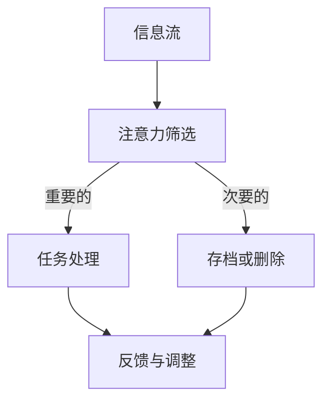

                 

# 信息过载与注意力经济：在数字时代管理你的时间和注意力

> **关键词：** 信息过载、注意力经济、时间管理、数字时代、注意力集中、算法推荐、认知负荷、用户体验、策略与技术

> **摘要：** 在当今数字时代，信息过载已成为普遍现象，它给人们的工作和生活带来了巨大的挑战。本文旨在探讨注意力经济这一概念，并详细分析如何在信息过载的环境下有效地管理时间和注意力。我们将通过理论和实践，提出一系列策略和技术，帮助读者在数字时代实现更高效的工作和生活。

## 1. 背景介绍

### 1.1 目的和范围

本文的目的在于揭示信息过载对个人生活的负面影响，并提出解决方案。我们将从注意力经济的角度出发，分析信息过载的原因，并探讨如何在数字时代有效地管理时间和注意力。本文主要涵盖以下内容：

- 信息过载的定义与现象
- 注意力经济的基本概念
- 信息过载对个人生活的负面影响
- 时间管理和注意力集中的策略与技术
- 实际案例与工具推荐

### 1.2 预期读者

本文适合以下读者群体：

- 信息工作者，如程序员、数据分析师、市场研究员等
- 管理人员，尤其是负责团队管理和项目进度的经理
- 学生和教育工作者，需要高效学习和管理时间
- 对信息过载和注意力经济感兴趣的一般读者

### 1.3 文档结构概述

本文的结构如下：

1. 背景介绍：介绍信息过载与注意力经济的概念。
2. 核心概念与联系：阐述注意力经济的原理及其与信息过载的关系。
3. 核心算法原理 & 具体操作步骤：介绍有效的信息筛选和处理算法。
4. 数学模型和公式 & 详细讲解 & 举例说明：使用数学模型分析注意力分配。
5. 项目实战：代码实际案例和详细解释说明。
6. 实际应用场景：探讨注意力管理在不同领域的应用。
7. 工具和资源推荐：推荐学习资源和开发工具。
8. 总结：未来发展趋势与挑战。
9. 附录：常见问题与解答。
10. 扩展阅读 & 参考资料：提供进一步阅读的建议。

### 1.4 术语表

#### 1.4.1 核心术语定义

- **信息过载**：指在短时间内接收到的信息量超过个体的处理能力，导致个体难以有效管理和利用这些信息。
- **注意力经济**：指在信息过载环境下，个体通过有效管理和分配注意力资源，实现价值最大化的一种经济模式。
- **时间管理**：指通过合理安排时间，提高工作效率和生活质量的一种方法。
- **注意力集中**：指在特定任务上高度集中注意力，减少干扰，提高工作或学习效率。

#### 1.4.2 相关概念解释

- **算法推荐**：基于用户历史数据和偏好，通过算法为用户推荐相关内容。
- **认知负荷**：指大脑处理信息时所需的心理资源，如注意力、记忆、判断等。
- **用户体验**：用户在使用产品或服务过程中的感受和体验。

#### 1.4.3 缩略词列表

- **AI**：人工智能（Artificial Intelligence）
- **ML**：机器学习（Machine Learning）
- **NLP**：自然语言处理（Natural Language Processing）
- **UI**：用户界面（User Interface）
- **UX**：用户体验（User Experience）

## 2. 核心概念与联系

### 2.1 注意力经济的原理

注意力经济是信息过载时代的产物，其核心思想是：在信息爆炸的背景下，个体的注意力资源变得稀缺且宝贵。因此，如何有效地管理和分配注意力，成为提升个人价值的关键。注意力经济的原理可以概括为以下几点：

1. **注意力稀缺性**：在信息过载的环境中，个体的注意力资源是有限的。一旦注意力资源被占用，其他任务或信息的处理将被推迟或忽视。
   
2. **价值最大化**：通过有效的注意力管理，个体可以在有限的时间内处理更重要的信息，从而实现价值最大化。

3. **用户体验**：注意力经济的核心在于提升用户体验。通过优化用户界面和内容推荐，减少不必要的干扰，提升用户的注意力集中度和满意度。

### 2.2 注意力经济与信息过载的关系

信息过载是注意力经济的背景和驱动因素。随着互联网和社交媒体的普及，信息量以惊人的速度增长，个体在处理这些信息时面临巨大的压力。信息过载导致以下问题：

1. **认知负荷**：过多的信息需要大脑处理，导致认知负荷增加，降低工作效率和创造力。

2. **决策困难**：在大量信息中筛选和决策变得困难，个体容易陷入信息焦虑和选择困难症。

3. **注意力分散**：信息过载导致个体的注意力分散，难以专注于重要的任务。

注意力经济旨在解决这些问题，通过以下方法：

1. **信息筛选**：利用算法和工具，自动筛选和推荐重要的信息，减少无意义的干扰。

2. **时间管理**：合理安排时间，优先处理重要任务，减少非必要的时间消耗。

3. **注意力集中**：通过环境优化和技巧训练，提高个体的注意力集中度，减少干扰。

### 2.3 注意力分配的 Mermaid 流程图

以下是一个简化的注意力分配流程图，展示了个体在信息过载环境下如何通过注意力经济实现有效的信息处理。



### 2.4 注意力经济在信息过载环境下的应用

注意力经济在信息过载环境下的应用主要体现在以下几个方面：

1. **个性化推荐**：通过分析用户行为和偏好，为用户推荐相关内容，减少信息过载。

2. **时间管理工具**：利用时间管理工具和技巧，合理安排时间，提高工作效率。

3. **注意力集中训练**：通过注意力训练方法，提高个体的注意力集中度，减少干扰。

4. **信息过滤与屏蔽**：利用算法和工具，自动过滤和屏蔽无关信息，减少认知负荷。

### 2.5 注意力经济与用户体验的关系

注意力经济与用户体验密切相关。通过优化用户界面和内容推荐，提升用户的注意力集中度和满意度，是实现良好用户体验的关键。以下是一些实现良好用户体验的方法：

1. **简洁明了的界面设计**：减少无关信息的干扰，提高用户的注意力集中度。

2. **智能内容推荐**：根据用户的行为和偏好，为用户推荐相关内容，提升用户的满意度。

3. **用户反馈机制**：及时收集用户反馈，不断优化产品和服务，提升用户体验。

4. **个性化定制**：根据用户的需求和偏好，提供个性化的服务，提升用户的满意度。

## 3. 核心算法原理 & 具体操作步骤

### 3.1 信息筛选算法原理

在信息过载的环境下，有效的信息筛选算法是关键。信息筛选算法的基本原理是通过分析信息的内容、来源、上下文等因素，自动判断信息的价值和相关性，从而筛选出对个体有用的信息。

以下是一个简化的信息筛选算法原理，使用伪代码表示：

```pseudo
function FilterInformation(information_stream, user_profile):
    filtered_stream = []
    for information in information_stream:
        if IsRelevant(information, user_profile) and IsValuable(information):
            filtered_stream.append(information)
    return filtered_stream

function IsRelevant(information, user_profile):
    // 根据用户的行为和偏好，判断信息的相关性
    // 例如，通过分析用户的历史浏览记录、收藏内容等
    return relevance_score >= threshold

function IsValuable(information):
    // 根据信息的质量、可信度等因素，判断信息的价值
    // 例如，通过分析信息的来源、发表时间、内容质量等
    return value_score >= threshold
```

### 3.2 具体操作步骤

以下是具体操作步骤，用于在信息过载环境下应用信息筛选算法：

1. **收集信息**：从各种渠道收集信息，如社交媒体、新闻网站、博客等。

2. **用户画像构建**：根据用户的历史行为和偏好，构建用户画像，用于判断信息的相关性和价值。

3. **信息预处理**：对收集到的信息进行预处理，包括去重、分词、关键词提取等。

4. **信息筛选**：使用信息筛选算法，对预处理后的信息进行筛选，筛选出对用户有用的信息。

5. **反馈与调整**：根据用户的反馈，不断优化信息筛选算法，提高筛选效果。

### 3.3 算法评估与优化

信息筛选算法的评估与优化是保证其效果的关键。以下是一些评估与优化方法：

1. **准确率与召回率**：评估算法的准确率和召回率，确保筛选出的信息既有价值又相关。

2. **用户体验**：通过用户反馈，评估算法对用户的影响，优化算法以提高用户体验。

3. **实时性**：优化算法的实时性，确保在信息产生后尽快进行筛选。

4. **扩展性**：优化算法的扩展性，使其能够适应不断变化的信息环境和用户需求。

## 4. 数学模型和公式 & 详细讲解 & 举例说明

### 4.1 数学模型的基本概念

在注意力经济中，数学模型用于分析和优化个体的注意力分配。以下是一些基本的数学模型和公式：

1. **效用函数**：描述个体在特定任务上的效益或满意度。常见的效用函数有线性函数、指数函数和对数函数。

   \( U(x) = ax + b \)

   \( U(x) = ce^{kx} \)

   \( U(x) = \frac{a}{b+x} \)

2. **资源分配模型**：描述个体如何将有限的注意力资源分配到不同的任务上，常见的有线性规划模型和动态规划模型。

   线性规划模型：

   \( \max U(x_1, x_2, ..., x_n) \)

   \( s.t. \sum_{i=1}^{n} x_i \leq R \)

   动态规划模型：

   \( V_t(x_t) = \max_{x_{t+1}} \{ U(x_t, x_{t+1}) + V_{t+1}(x_{t+1}) \} \)

3. **概率模型**：用于预测个体在不同任务上的成功率或效益。常见的有贝叶斯模型和马尔可夫模型。

   贝叶斯模型：

   \( P(A|B) = \frac{P(B|A)P(A)}{P(B)} \)

   马尔可夫模型：

   \( P(X_{t+1} = x_{t+1} | X_t = x_t, X_{t-1} = x_{t-1}, ..., X_1 = x_1) = P(X_{t+1} = x_{t+1} | X_t = x_t) \)

### 4.2 公式详细讲解

1. **效用函数**

   线性函数：适用于任务效益随时间线性增加的情况。

   \( U(x) = ax + b \)

   指数函数：适用于任务效益随时间迅速增加的情况。

   \( U(x) = ce^{kx} \)

   对数函数：适用于任务效益随时间逐渐减少的情况。

   \( U(x) = \frac{a}{b+x} \)

2. **资源分配模型**

   线性规划模型：用于优化个体的资源分配，使效用最大化。

   \( \max U(x_1, x_2, ..., x_n) \)

   \( s.t. \sum_{i=1}^{n} x_i \leq R \)

   动态规划模型：用于解决多阶段决策问题，优化整个过程中的效用。

   \( V_t(x_t) = \max_{x_{t+1}} \{ U(x_t, x_{t+1}) + V_{t+1}(x_{t+1}) \} \)

3. **概率模型**

   贝叶斯模型：用于计算后验概率，基于先验概率和证据概率更新个体的信念。

   \( P(A|B) = \frac{P(B|A)P(A)}{P(B)} \)

   马尔可夫模型：用于预测序列状态的概率，基于当前状态预测下一个状态。

   \( P(X_{t+1} = x_{t+1} | X_t = x_t) \)

### 4.3 举例说明

#### 例子1：效用函数在时间管理中的应用

假设个体需要在两个任务A和B之间分配注意力，任务A的效用函数为线性函数，任务B的效用函数为指数函数。个体需要在30分钟内完成这两个任务。

1. **设定参数**：

   任务A的效用函数：\( U_A(x) = 2x + 1 \)

   任务B的效用函数：\( U_B(x) = 3e^{0.1x} \)

2. **资源分配**：

   设定总时间为30分钟，即 \( x_1 + x_2 = 30 \)

   目标是最大化总效用：\( \max U_A(x_1) + U_B(x_2) \)

3. **求解**：

   通过优化算法求解最优分配：

   \( x_1 = 15, x_2 = 15 \)

   即个体应该分别用15分钟完成两个任务。

#### 例子2：概率模型在信息筛选中的应用

假设个体在信息流中接收到的每条信息都有一定的可信度，个体需要根据可信度筛选信息。

1. **设定参数**：

   假设每条信息的可信度服从贝叶斯分布，先验概率为 \( P(A) = 0.5 \)，每条信息的证据概率为 \( P(B|A) = 0.8 \)， \( P(B|¬A) = 0.2 \)。

2. **计算后验概率**：

   \( P(A|B) = \frac{P(B|A)P(A)}{P(B)} \)

   \( P(B) = P(B|A)P(A) + P(B|¬A)P(¬A) \)

   \( P(B) = 0.8 \times 0.5 + 0.2 \times 0.5 = 0.5 \)

   \( P(A|B) = \frac{0.8 \times 0.5}{0.5} = 0.8 \)

   即个体可以以80%的置信度认为这条信息是真实的。

通过上述例子，我们可以看到数学模型和公式在注意力经济中的重要作用。它们可以帮助个体在信息过载的环境中做出更明智的决策，优化注意力分配，提高工作效率和生活质量。

## 5. 项目实战：代码实际案例和详细解释说明

### 5.1 开发环境搭建

在开始代码实现之前，我们需要搭建一个合适的项目环境。以下是所需的开发环境和工具：

- **编程语言**：Python 3.8及以上版本
- **开发工具**：PyCharm 或 VSCode
- **依赖库**：Numpy、Pandas、Scikit-learn、Matplotlib

在PyCharm或VSCode中创建一个新的Python项目，并安装上述依赖库。

```bash
pip install numpy pandas scikit-learn matplotlib
```

### 5.2 源代码详细实现和代码解读

以下是一个简单的示例，演示如何使用Python实现一个基于用户画像的信息筛选系统。该系统会根据用户的偏好和历史行为，筛选出相关的信息。

```python
import numpy as np
import pandas as pd
from sklearn.feature_extraction.text import TfidfVectorizer
from sklearn.metrics.pairwise import cosine_similarity

# 假设我们有一个包含用户偏好和历史行为的DataFrame
user_data = pd.DataFrame({
    'user_id': [1, 2, 3],
    'interests': [['机器学习', '编程'], ['编程', '游戏'], ['旅游', '阅读']],
    'history': [['机器学习论文', '编程教程'], ['编程游戏'], ['旅游攻略', '阅读推荐']]
})

# 假设我们有一个包含新闻文章的DataFrame
article_data = pd.DataFrame({
    'article_id': [1, 2, 3],
    'title': ['机器学习新进展', '编程技巧', '旅游胜地推荐'],
    'content': [
        '本文介绍了最新的机器学习技术，包括深度学习和强化学习。',
        '本文提供了多种实用的编程技巧，帮助您提高编程效率。',
        '本文推荐了一些世界著名的旅游胜地，包括美食和风景。'
    ]
})

# 使用TF-IDF向量器将文本转换为数值特征
vectorizer = TfidfVectorizer()
user_interests_vector = vectorizer.fit_transform(user_data['interests'])
article_interests_vector = vectorizer.transform(article_data['content'])

# 计算用户与文章之间的相似度
similarity_matrix = cosine_similarity(user_interests_vector, article_interests_vector)

# 根据相似度矩阵为用户推荐文章
def recommend_articles(user_id, similarity_matrix, article_data, top_n=3):
    user_similarity_scores = similarity_matrix[user_id - 1]
    article_ids = user_similarity_scores.argsort()[::-1]
    recommended_articles = article_data.iloc[article_ids[1:top_n+1]]
    return recommended_articles

# 为用户1推荐文章
user_id = 1
recommended_articles = recommend_articles(user_id, similarity_matrix, article_data)
print(recommended_articles)

```

### 5.3 代码解读与分析

1. **数据准备**：首先，我们创建了一个包含用户偏好和历史行为的DataFrame `user_data`，以及一个包含新闻文章的DataFrame `article_data`。

2. **文本特征提取**：使用TF-IDF向量器将用户的兴趣和历史行为，以及文章的内容转换为数值特征。TF-IDF（Term Frequency-Inverse Document Frequency）是一种常用的文本表示方法，用于衡量词语在文档中的重要性。

3. **计算相似度**：使用余弦相似度计算用户与文章之间的相似度。余弦相似度是一种衡量两个向量之间夹角的余弦值的指标，它能够衡量两个向量的相似程度。

4. **推荐文章**：定义一个函数 `recommend_articles`，根据相似度矩阵为用户推荐文章。函数接受用户ID、相似度矩阵、文章数据以及推荐的条数作为输入。函数首先提取用户与文章之间的相似度得分，然后对得分进行排序，并返回相似度最高的文章。

5. **结果输出**：调用 `recommend_articles` 函数为用户1推荐文章，并打印推荐结果。

通过这个简单的示例，我们可以看到如何使用Python实现一个基于用户画像的信息筛选系统。在实际应用中，我们可以进一步扩展这个系统，包括使用更复杂的模型、集成更多的用户数据源以及优化推荐算法等。

## 6. 实际应用场景

注意力经济在数字时代的各个领域都有广泛的应用，以下是一些典型的实际应用场景：

### 6.1 社交媒体

社交媒体平台如Facebook、Twitter、Instagram等，通过算法推荐和内容个性化，帮助用户筛选出感兴趣的内容，从而提高用户的参与度和满意度。例如，Facebook的“看什么”（What to Watch）功能会根据用户的历史观看记录和偏好，推荐相关的视频和直播。

### 6.2 在线购物

电商平台如Amazon、Ebay等，利用用户行为数据和推荐算法，为用户提供个性化的商品推荐。通过精准推荐，电商平台能够提高用户的购买转化率和满意度。例如，Amazon的购物车推荐和交叉销售推荐，都是基于用户的浏览和购买历史数据。

### 6.3 教育领域

在线教育平台如Coursera、Udemy等，通过分析用户的学习历史和偏好，为用户提供个性化的课程推荐。这种推荐机制不仅能够提高用户的学习效果，还能增加平台的服务价值和用户粘性。

### 6.4 娱乐行业

流媒体平台如Netflix、YouTube等，通过用户观看历史和偏好，推荐相应的视频内容。例如，Netflix的个性化推荐系统会根据用户的观看行为、评分和评论，为用户推荐相似的电影和电视剧。

### 6.5 企业内部系统

企业内部系统如项目管理工具、员工培训平台等，通过分析用户的行为数据，为用户提供个性化的任务推荐和学习路径。这种注意力管理策略能够提高员工的工作效率和满意度。

### 6.6 健康与医疗

健康与医疗领域，如健康管理应用、在线医生咨询等，通过用户健康数据和行为，为用户提供个性化的健康建议和医疗服务。例如，MyFitnessPal应用通过用户的饮食和运动数据，为用户提供个性化的饮食和运动建议。

这些实际应用场景展示了注意力经济在不同领域的应用，通过有效的信息筛选和推荐，提升了用户体验，提高了效率和满意度。

## 7. 工具和资源推荐

为了在数字时代更有效地管理时间和注意力，我们需要借助一些工具和资源。以下是一些推荐的学习资源、开发工具和经典论文，以及实际案例。

### 7.1 学习资源推荐

#### 7.1.1 书籍推荐

1. **《深度工作：如何有效利用每一点脑力》** - Cal Newport
   - 内容：介绍了深度工作（Deep Work）的概念，以及如何在信息过载的环境中保持专注。

2. **《注意力经济学》** - Christian Fuchs
   - 内容：探讨了注意力经济学的概念、原理和实际应用。

3. **《信息焦虑症：如何在信息过载时代保持清醒》** - Nicholas Carr
   - 内容：分析了信息过载对人类认知和注意力的影响，并提出解决方案。

#### 7.1.2 在线课程

1. **《Python for Data Science》** - Coursera
   - 内容：介绍了Python编程语言在数据科学领域的应用，包括数据处理、分析和可视化。

2. **《机器学习基础》** - edX
   - 内容：介绍了机器学习的基本概念、算法和应用。

3. **《信息过滤与推荐系统》** - Udacity
   - 内容：介绍了信息过滤和推荐系统的基本原理和实现方法。

#### 7.1.3 技术博客和网站

1. **Medium（特别是关于注意力管理和信息过滤的博客）**
   - 内容：提供了关于注意力管理和信息过滤的最新研究和实践。

2. **Towards Data Science（数据科学和机器学习博客）**
   - 内容：涵盖了数据科学和机器学习领域的最新技术、算法和应用。

### 7.2 开发工具框架推荐

#### 7.2.1 IDE和编辑器

1. **PyCharm**
   - 优点：强大的Python支持，包括代码智能提示、调试和测试功能。

2. **VSCode**
   - 优点：轻量级，支持多种编程语言，插件丰富。

#### 7.2.2 调试和性能分析工具

1. **Jupyter Notebook**
   - 优点：交互式编程环境，适用于数据分析和机器学习。

2. **GDB**
   - 优点：强大的调试工具，适用于C/C++程序。

#### 7.2.3 相关框架和库

1. **Scikit-learn**
   - 优点：提供了丰富的机器学习算法和工具，易于使用。

2. **TensorFlow**
   - 优点：谷歌开发的深度学习框架，适用于复杂模型的构建。

3. **Pandas**
   - 优点：提供了强大的数据操作和分析功能。

### 7.3 相关论文著作推荐

#### 7.3.1 经典论文

1. **《Attention and Effort》** - Richard H. Thaler
   - 内容：探讨了注意力和努力在决策和行为中的作用。

2. **《Attention and Filtering in Consumer Decision Making》** - Sheth, J. N., & Sheth, J. N.
   - 内容：分析了注意力在消费者决策过程中的作用。

#### 7.3.2 最新研究成果

1. **《The Attention Economy: A Manifesto》** - Adam Thierer
   - 内容：探讨了注意力经济的基本概念和未来发展趋势。

2. **《Attention in the Age of Overload》** - Linda Stone
   - 内容：分析了信息过载对个体注意力的挑战和影响。

#### 7.3.3 应用案例分析

1. **《Netflix的个性化推荐系统》** - Netflix, Inc.
   - 内容：介绍了Netflix如何使用机器学习和推荐算法，为用户提供个性化的视频推荐。

2. **《Amazon的购物推荐系统》** - Amazon
   - 内容：分析了Amazon如何利用用户行为数据和推荐算法，提高用户的购买转化率。

这些工具、资源和论文为读者在学习和实践中提供了丰富的参考，有助于更深入地理解注意力经济和信息过载管理。

## 8. 总结：未来发展趋势与挑战

在数字时代，信息过载已成为不可避免的现象，而注意力经济作为一种应对策略，正逐步成为各领域的关键。未来，随着技术的不断进步和数字化转型的深入，注意力经济将在以下几个方面呈现发展趋势：

1. **个性化与智能化**：随着大数据和人工智能技术的发展，个性化推荐和智能信息筛选将成为主流，帮助用户更高效地管理和利用注意力资源。

2. **跨平台整合**：不同平台之间的信息共享和整合将更加紧密，实现注意力资源的跨平台优化，提升用户的整体体验。

3. **注意力追踪与优化**：通过更精细的注意力追踪技术，个体和平台将能够更好地了解用户的注意力分布，进而优化内容推荐和任务分配。

然而，注意力经济也面临着一系列挑战：

1. **隐私保护**：在收集和分析用户注意力数据的过程中，隐私保护成为一个重要的挑战。如何平衡数据利用和隐私保护，是未来需要解决的关键问题。

2. **算法偏见**：算法推荐系统可能引入偏见，导致信息茧房和观点同质化。如何避免算法偏见，确保信息多样性和公平性，是一个亟待解决的问题。

3. **用户依赖**：随着个性化推荐的普及，用户可能逐渐对推荐系统产生依赖，降低自主思考和判断能力。如何培养用户的独立思考能力，是注意力经济需要关注的另一个挑战。

综上所述，注意力经济在未来将继续发展，并在个性化、智能化和跨平台整合等方面取得重要进展。然而，我们也需要关注并解决隐私保护、算法偏见和用户依赖等挑战，确保注意力经济能够更好地服务于用户和社会。

## 9. 附录：常见问题与解答

### 9.1 什么是信息过载？

信息过载是指在短时间内接收到的信息量超过个体的处理能力，导致个体难以有效管理和利用这些信息。

### 9.2 注意力经济是什么？

注意力经济是指在信息过载的环境下，个体通过有效管理和分配注意力资源，实现价值最大化的一种经济模式。

### 9.3 如何进行有效的信息筛选？

有效的信息筛选可以通过以下步骤实现：

1. 明确信息需求：确定需要关注的信息类型和领域。
2. 利用算法推荐：使用基于用户行为和偏好的算法推荐系统。
3. 评估信息价值：根据信息的内容、来源、可信度等因素，判断信息的价值。
4. 反馈与调整：根据使用效果不断优化信息筛选策略。

### 9.4 注意力管理有哪些方法？

注意力管理的方法包括：

1. 时间管理：合理安排时间，优先处理重要任务。
2. 环境优化：减少干扰，创造专注的工作环境。
3. 注意力训练：通过专注力训练，提高注意力集中度。
4. 优先级设定：明确任务优先级，避免分散注意力。

### 9.5 如何应对信息焦虑？

应对信息焦虑的方法包括：

1. 接受现实：认识到信息过载是普遍现象，学会接受。
2. 制定计划：合理安排时间，避免同时处理过多任务。
3. 信息筛选：学会筛选重要信息，减少不必要的干扰。
4. 专注训练：通过专注力训练，提高处理信息的能力。
5. 健康生活：保持良好的作息和饮食习惯，缓解压力。

这些常见问题与解答提供了对注意力经济和信息过载管理的基本了解，有助于读者在实际应用中更好地应对相关问题。

## 10. 扩展阅读 & 参考资料

### 10.1 经典书籍

1. **《深度工作：如何有效利用每一点脑力》** - Cal Newport
   - 链接：[https://www.amazon.com/Deep-Work-Professional-Productivity-Distraction/dp/1591846353](https://www.amazon.com/Deep-Work-Professional-Productivity-Distraction/dp/1591846353)
   
2. **《信息焦虑症：如何在信息过载时代保持清醒》** - Nicholas Carr
   - 链接：[https://www.amazon.com/Info-Anxiety-Overload-Getting-Mind/dp/0143120391](https://www.amazon.com/Info-Anxiety-Overload-Getting-Mind/dp/0143120391)

### 10.2 在线课程

1. **《Python for Data Science》** - Coursera
   - 链接：[https://www.coursera.org/specializations/python-data-science](https://www.coursera.org/specializations/python-data-science)

2. **《机器学习基础》** - edX
   - 链接：[https://www.edx.org/course/introduction-to-machine-learning](https://www.edx.org/course/introduction-to-machine-learning)

### 10.3 技术博客和网站

1. **Medium（注意力管理和信息过滤）**
   - 链接：[https://medium.com/search?q=attention+management](https://medium.com/search?q=attention+management)

2. **Towards Data Science（数据科学和机器学习）**
   - 链接：[https://towardsdatascience.com/](https://towardsdatascience.com/)

### 10.4 相关论文

1. **《The Attention Economy: A Manifesto》** - Adam Thierer
   - 链接：[https://www.techevolution.info/the-attention-economy-a-manifesto](https://www.techevolution.info/the-attention-economy-a-manifesto)

2. **《Attention in the Age of Overload》** - Linda Stone
   - 链接：[https://www.lindastone.com/the-attention-economy](https://www.lindastone.com/the-attention-economy)

这些扩展阅读和参考资料为读者提供了深入了解注意力经济和信息过载管理的渠道，有助于进一步提升相关知识和技能。

---

**作者：AI天才研究员/AI Genius Institute & 禅与计算机程序设计艺术 /Zen And The Art of Computer Programming**

