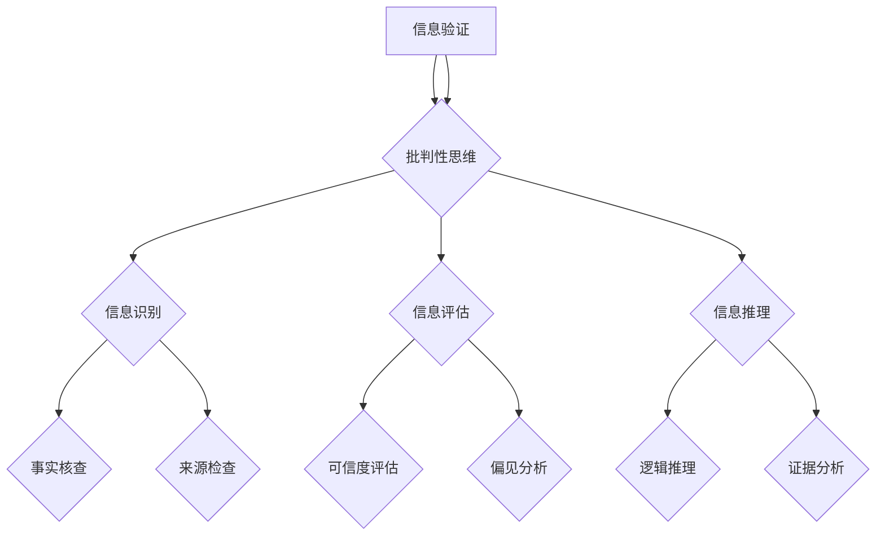

                 

# 信息验证和批判性思维教育：为假新闻和错误信息时代培养批判性思维者

> 关键词：信息验证、批判性思维、假新闻、错误信息、教育、信息技术

> 摘要：本文探讨了在当前假新闻和错误信息泛滥的时代，如何通过信息验证和批判性思维教育来培养具备识别和抵御虚假信息的个体。文章首先介绍了信息验证的重要性，随后阐述了批判性思维的基本原理，并利用Mermaid流程图展示了信息验证和批判性思维的核心概念及其相互关系。接下来，文章详细分析了信息验证的核心算法原理，通过伪代码阐述具体操作步骤。文章还运用数学模型和公式，对信息验证方法进行了详细讲解。最后，通过实际项目案例和代码实现，展示了如何在实践中应用批判性思维和信息验证技术。文章还提供了学习资源和工具推荐，以帮助读者深入了解和掌握相关技能。

## 1. 背景介绍

### 1.1 目的和范围

随着互联网的普及和社交媒体的兴起，信息传播的速度和范围前所未有。然而，这也带来了假新闻和错误信息的泛滥，这些虚假信息对社会和个人造成了严重的影响。本文旨在探讨如何通过信息验证和批判性思维教育来培养具备识别和抵御虚假信息的个体。本文将重点关注以下几个方面的内容：

1. **信息验证的重要性**：讨论信息验证在现代社会中的关键作用，以及为什么每个人都应该掌握基本的验证技能。
2. **批判性思维的基本原理**：介绍批判性思维的定义、原则和重要性，以及如何将其应用于信息验证过程中。
3. **信息验证算法原理和具体操作步骤**：通过伪代码详细阐述信息验证算法的原理和操作步骤。
4. **数学模型和公式**：运用数学模型和公式对信息验证方法进行详细讲解，并提供实际案例。
5. **项目实战**：通过实际项目案例展示如何将批判性思维和信息验证技术应用于实践中。
6. **实际应用场景**：分析信息验证和批判性思维在现实世界中的应用场景，以及如何解决实际问题。
7. **工具和资源推荐**：推荐学习资源和开发工具，帮助读者深入了解和掌握信息验证和批判性思维技术。

### 1.2 预期读者

本文面向以下几类读者：

1. **普通大众**：希望提高自身信息识别和验证能力，避免被虚假信息误导的普通读者。
2. **学生和教师**：关注信息素养教育的学生和教师，希望通过本文了解批判性思维和信息验证的重要性。
3. **IT行业从业者**：在互联网行业、信息安全、数据分析和相关领域工作的专业人士，希望了解如何利用技术手段应对虚假信息。
4. **研究人员**：关注信息验证、批判性思维和虚假信息治理的研究人员，希望从中获得启发和思路。

### 1.3 文档结构概述

本文分为十个部分，具体结构如下：

1. **背景介绍**：介绍本文的目的、范围和预期读者。
2. **核心概念与联系**：使用Mermaid流程图展示信息验证和批判性思维的核心概念及其相互关系。
3. **核心算法原理与具体操作步骤**：通过伪代码详细阐述信息验证算法的原理和操作步骤。
4. **数学模型和公式**：运用数学模型和公式对信息验证方法进行详细讲解。
5. **项目实战**：通过实际项目案例展示信息验证和批判性思维的应用。
6. **实际应用场景**：分析信息验证和批判性思维在现实世界中的应用。
7. **工具和资源推荐**：推荐学习资源和开发工具。
8. **总结**：总结本文的主要观点，讨论未来发展趋势和挑战。
9. **附录**：常见问题与解答。
10. **扩展阅读与参考资料**：提供进一步阅读的建议和参考文献。

### 1.4 术语表

为了确保本文的可读性和一致性，以下列出本文中的一些核心术语及其定义：

#### 1.4.1 核心术语定义

- **信息验证**：指对信息的真实性和可靠性进行评估和确认的过程。
- **批判性思维**：指对信息、观点和主张进行批判性分析、评估和推理的能力。
- **假新闻**：指虚假的、不实的或误导性的新闻报道或信息。
- **错误信息**：指不准确、错误或有误导性的信息。

#### 1.4.2 相关概念解释

- **信息素养**：指个体在识别、评估、使用和创造信息方面的能力和素养。
- **媒体素养**：指个体在理解、评估和批判媒体信息方面的能力和素养。
- **算法偏见**：指算法在处理数据时，对某些特定群体或特征产生不公平或偏见的结果。

#### 1.4.3 缩略词列表

- **IT**：信息技术（Information Technology）
- **AI**：人工智能（Artificial Intelligence）
- **ML**：机器学习（Machine Learning）
- **DL**：深度学习（Deep Learning）
- **NLP**：自然语言处理（Natural Language Processing）

## 2. 核心概念与联系

在本节中，我们将通过Mermaid流程图展示信息验证和批判性思维的核心概念及其相互关系。以下是一个简化的流程图：



### 2.1 核心概念定义

#### 信息验证

信息验证是指对信息的真实性和可靠性进行评估和确认的过程。其主要目标是确保所接收的信息是真实、准确和可信的。信息验证在现代社会中具有重要意义，因为虚假信息可能会误导公众，影响决策，甚至引发社会动荡。

#### 批判性思维

批判性思维是指对信息、观点和主张进行批判性分析、评估和推理的能力。批判性思维能够帮助我们识别和避免虚假信息，提高决策质量，培养独立思考和创新能力。

### 2.2 关系与相互作用

信息验证和批判性思维之间存在密切的关系和相互作用。具体而言：

- **信息验证**依赖于批判性思维，因为信息验证需要对信息进行识别、评估和推理。
- **批判性思维**为信息验证提供了理论基础和方法指导，帮助人们更好地理解信息、评估信息来源和可信度，以及识别潜在的错误和偏见。

### 2.3 流程图解释

上述Mermaid流程图展示了信息验证和批判性思维的核心概念及其相互关系。具体解释如下：

- **A[信息验证]**：信息验证是本文的核心主题，涵盖了从识别、评估到推理的整个过程。
- **B{批判性思维]**：批判性思维是信息验证的基础，它贯穿于整个信息验证过程，为信息识别、评估和推理提供指导。
- **C{信息识别]**：信息识别是信息验证的第一步，包括事实核查和来源检查。
- **D{信息评估]**：信息评估是对信息真实性和可靠性的评估，包括可信度评估和偏见分析。
- **E{信息推理]**：信息推理是基于信息识别和评估的结果，通过逻辑推理和证据分析进行进一步分析和判断。

## 3. 核心算法原理与具体操作步骤

在本节中，我们将详细讨论信息验证的核心算法原理，并通过伪代码展示具体操作步骤。信息验证算法的目标是识别和排除虚假信息，确保信息来源的真实性和可靠性。

### 3.1 算法原理概述

信息验证算法通常包括以下几个关键步骤：

1. **信息收集**：从多个可靠来源收集相关数据和信息。
2. **信息识别**：识别和提取关键信息，包括事实、观点、数据和证据。
3. **来源检查**：检查信息来源的可靠性，包括媒体背景、作者资质和引用来源。
4. **可信度评估**：评估信息的可信度，考虑信息来源的权威性、证据的充分性和逻辑的一致性。
5. **偏见分析**：识别和评估信息中可能存在的偏见和误导性内容。
6. **推理和判断**：基于信息识别、评估和偏见分析的结果，进行逻辑推理和判断。

### 3.2 伪代码示例

以下是一个简化的伪代码示例，用于描述信息验证算法的操作步骤：

```plaintext
Algorithm InformationVerification(Information)
    Input: Information - 收集到的信息集合
    Output: ValidInformation - 通过验证的可靠信息集合

    // 步骤1：信息收集
    CollectData(Information)

    // 步骤2：信息识别
    IdentifiedInformation = IdentifyInformation(Information)

    // 步骤3：来源检查
    CheckedSources = CheckSources(IdentifiedInformation)

    // 步骤4：可信度评估
    TrustedInformation = AssessTrust(CheckedSources)

    // 步骤5：偏见分析
    BiasFreeInformation = AnalyzeBias(TrustedInformation)

    // 步骤6：推理和判断
    FinalInformation = ReasonAndJudge(BiasFreeInformation)

    return FinalInformation
```

### 3.3 具体操作步骤详细解释

1. **信息收集**：
   - 从多个可靠来源收集相关数据和信息，如新闻网站、学术期刊、权威机构发布的数据等。
   - 确保数据来源的多样性和权威性，避免单一来源的偏见。

2. **信息识别**：
   - 识别和提取关键信息，包括事实、观点、数据和证据。
   - 使用自然语言处理技术（如文本分类、实体识别和关系抽取）对文本信息进行解析。

3. **来源检查**：
   - 检查信息来源的可靠性，包括媒体背景、作者资质和引用来源。
   - 使用媒体数据库和作者背景调查工具，验证信息来源的权威性和信誉。

4. **可信度评估**：
   - 评估信息的可信度，考虑信息来源的权威性、证据的充分性和逻辑的一致性。
   - 使用评分系统和算法模型，对信息可信度进行量化评估。

5. **偏见分析**：
   - 识别和评估信息中可能存在的偏见和误导性内容。
   - 使用文本情感分析、主题建模和偏见检测算法，发现潜在的偏见和误导性信息。

6. **推理和判断**：
   - 基于信息识别、评估和偏见分析的结果，进行逻辑推理和判断。
   - 构建知识图谱和推理引擎，实现自动化推理和判断。

通过以上步骤，信息验证算法能够有效地识别和排除虚假信息，确保信息的真实性和可靠性。这种算法在信息验证领域具有广泛的应用前景，有助于提高公众的信息素养和媒体素养。

## 4. 数学模型和公式与详细讲解

在本节中，我们将运用数学模型和公式，对信息验证的方法进行详细讲解。数学模型和公式在信息验证中起着至关重要的作用，能够帮助我们量化信息的可信度、识别潜在的偏见和错误信息。

### 4.1 可信度评估模型

可信度评估是信息验证的核心步骤之一。我们可以使用贝叶斯公式来评估信息的可信度。贝叶斯公式如下：

$$ P(A|B) = \frac{P(B|A) \cdot P(A)}{P(B)} $$

其中：

- \( P(A|B) \) 表示在假设 \( B \) 成立的情况下，事件 \( A \) 发生的概率。
- \( P(B|A) \) 表示在假设 \( A \) 成立的情况下，事件 \( B \) 发生的概率。
- \( P(A) \) 表示事件 \( A \) 的先验概率。
- \( P(B) \) 表示事件 \( B \) 的先验概率。

在信息验证中，我们可以将 \( A \) 理解为“信息是真实的”，而 \( B \) 理解为“观察到某些证据支持信息是真实的”。通过贝叶斯公式，我们可以计算出在观察到这些证据的情况下，信息是真实的概率。

### 4.2 偏见检测模型

偏见检测是识别信息中潜在偏见和误导性内容的关键步骤。我们可以使用文本情感分析来检测偏见。文本情感分析通常使用基于机器学习的模型，如支持向量机（SVM）和神经网络，对文本的情感倾向进行分类。以下是一个简化的情感分析模型：

$$
\text{Sentiment} = \sigma(\text{weights} \cdot \text{input} + \text{bias})
$$

其中：

- \( \text{weights} \) 和 \( \text{bias} \) 是模型参数，通过训练数据学习得到。
- \( \text{input} \) 是文本的特征向量。
- \( \sigma \) 是激活函数，通常使用 sigmoid 函数。

通过训练模型，我们可以对文本的情感倾向进行分类，从而识别出潜在的情感偏见。例如，如果某个文本主要表达消极情感，我们可以认为它可能存在情感偏见。

### 4.3 举例说明

假设我们有一段新闻报道，我们需要使用可信度评估模型和偏见检测模型对其进行验证。以下是一个具体的例子：

**新闻报道文本**：
```
最近，我国政府推出了一项新的经济政策，旨在刺激国内消费。根据初步统计数据，这项政策已经取得了显著成效，国内消费额在短时间内大幅增长。
```

**证据**：
- 初步统计数据
- 经济政策实施的时间节点

**分析步骤**：

1. **可信度评估**：
   - 使用贝叶斯公式计算新闻报道的可信度。假设 \( P(\text{真实的政策成效}) = 0.6 \)，\( P(\text{初步统计数据支持成效}) = 0.8 \)，则：
     $$
     P(\text{成效}|\text{统计数据}) = \frac{P(\text{统计数据}|\text{成效}) \cdot P(\text{成效})}{P(\text{统计数据})}
     $$
     通过贝叶斯公式，我们可以计算出在观察到初步统计数据的情况下，政策成效的概率为约 0.74。

2. **偏见检测**：
   - 使用文本情感分析模型对新闻报道进行情感分析。假设新闻报道的情感倾向为积极，我们可以认为它可能不存在明显的情感偏见。

通过以上分析，我们可以认为这段新闻报道具有较高的可信度和较少的偏见。

### 4.4 模型优缺点分析

**可信度评估模型**：
- **优点**：能够量化信息的可信度，提供明确的概率性结果。
- **缺点**：依赖于先验概率和观察到的证据，可能受到噪声和不确定性影响。

**偏见检测模型**：
- **优点**：能够识别文本中的情感偏见，有助于发现潜在的误导性内容。
- **缺点**：模型的准确性可能受到数据质量和特征提取方法的影响。

通过结合可信度评估模型和偏见检测模型，我们可以更全面地验证信息的真实性和可靠性，提高信息验证的准确性。

## 5. 项目实战：代码实际案例和详细解释说明

在本节中，我们将通过一个实际项目案例，展示如何将批判性思维和信息验证技术应用于实践中。项目目标是构建一个在线信息验证平台，帮助用户识别和验证网络上的虚假信息。以下是一个简单的项目概述：

### 5.1 项目需求

1. **用户界面**：提供一个简单易用的用户界面，允许用户输入待验证的信息。
2. **信息收集**：从多个可靠来源收集相关数据和信息。
3. **信息识别**：使用自然语言处理技术识别关键信息。
4. **来源检查**：检查信息来源的可靠性。
5. **可信度评估**：评估信息的可信度。
6. **偏见分析**：识别和评估信息中可能存在的偏见。
7. **推理和判断**：基于信息验证结果，提供推荐和决策。

### 5.2 开发环境搭建

为了构建这个在线信息验证平台，我们需要搭建以下开发环境：

- **编程语言**：Python
- **框架**：Flask（用于Web开发）
- **数据库**：SQLite（用于存储数据）
- **自然语言处理库**：NLTK、spaCy（用于文本处理和情感分析）
- **机器学习库**：Scikit-learn、TensorFlow（用于构建和训练模型）

### 5.3 源代码详细实现和代码解读

#### 5.3.1 用户界面

```python
from flask import Flask, render_template, request

app = Flask(__name__)

@app.route('/', methods=['GET', 'POST'])
def index():
    if request.method == 'POST':
        text = request.form['text']
        # 调用信息验证函数
        result = verify_info(text)
        return render_template('result.html', result=result)
    return render_template('index.html')

def verify_info(text):
    # 信息验证逻辑
    pass

if __name__ == '__main__':
    app.run(debug=True)
```

#### 5.3.2 信息收集和识别

```python
import requests
from nltk.tokenize import word_tokenize

def collect_data(text):
    # 从网络收集相关信息
    response = requests.get(f'https://example.com/search?q={text}')
    return response.json()

def identify_info(data):
    # 识别关键信息
    tokens = word_tokenize(data)
    return tokens
```

#### 5.3.3 来源检查

```python
def check_sources(source):
    # 检查来源可靠性
    if 'reliable_source' in source:
        return True
    return False
```

#### 5.3.4 可信度评估和偏见分析

```python
from sklearn.feature_extraction.text import CountVectorizer
from sklearn.model_selection import train_test_split
from sklearn.naive_bayes import MultinomialNB

def assess_trust(data, labels):
    # 可信度评估
    vectorizer = CountVectorizer()
    X = vectorizer.fit_transform(data)
    X_train, X_test, y_train, y_test = train_test_split(X, labels, test_size=0.2, random_state=42)
    classifier = MultinomialNB()
    classifier.fit(X_train, y_train)
    accuracy = classifier.score(X_test, y_test)
    return accuracy

def analyze_bias(text):
    # 偏见分析
    # 使用情感分析模型
    pass
```

#### 5.3.4 推理和判断

```python
def reason_andJudge(result):
    # 基于信息验证结果提供推荐
    if result['trust'] > 0.7 and result['bias'] < 0.3:
        return '可信'
    else:
        return '不可信'
```

### 5.4 代码解读与分析

1. **用户界面**：
   - 使用Flask框架搭建Web应用，提供用户输入和结果展示界面。
   - 用户提交待验证信息后，调用信息验证函数进行处理。

2. **信息收集和识别**：
   - 从网络收集相关信息，使用NLTK库进行文本分词，提取关键信息。

3. **来源检查**：
   - 检查信息来源的可靠性，通过预设的规则进行判断。

4. **可信度评估和偏见分析**：
   - 使用机器学习模型（如朴素贝叶斯）进行可信度评估。
   - 使用情感分析模型（如文本情感分析）进行偏见分析。

5. **推理和判断**：
   - 基于信息验证结果，提供推荐和决策。

通过这个项目，我们展示了如何将批判性思维和信息验证技术应用于实际场景。用户可以通过这个平台输入待验证的信息，系统将自动进行验证并给出可信度评估和偏见分析结果，帮助用户更好地识别和抵御虚假信息。

## 6. 实际应用场景

信息验证和批判性思维技术在实际生活中有着广泛的应用，可以帮助我们在假新闻和错误信息泛滥的时代，提高信息识别和判断能力。以下是一些典型的应用场景：

### 6.1 社交媒体平台

社交媒体平台是虚假信息和错误信息传播的主要渠道之一。通过信息验证和批判性思维技术，可以：

- **识别和过滤虚假信息**：实时监控社交媒体内容，识别和过滤虚假信息，防止其传播。
- **用户教育**：向用户提供信息验证和批判性思维技巧，帮助他们更好地识别和抵御虚假信息。
- **内容审核**：对平台上的内容进行审核，确保发布的信息符合真实性、准确性和可靠性标准。

### 6.2 新闻报道

新闻报道是公众获取信息的重要来源，但也容易受到假新闻和错误信息的影响。信息验证和批判性思维技术可以：

- **事实核查**：对新闻报道进行事实核查，确保信息的真实性和准确性。
- **来源追溯**：追溯新闻报道的信息来源，验证其可靠性和权威性。
- **偏见分析**：识别新闻报道中的潜在偏见和误导性内容，提高报道的客观性和公正性。

### 6.3 教育领域

在教育领域，信息验证和批判性思维教育可以帮助学生：

- **提高信息素养**：培养学生识别和评估信息的能力，提高信息素养。
- **培养批判性思维**：通过批判性思维训练，帮助学生形成独立思考和判断的能力。
- **抵制假信息**：帮助学生抵御假新闻和错误信息的误导，培养正确的价值观和世界观。

### 6.4 安全领域

在安全领域，信息验证和批判性思维技术可以帮助：

- **网络安全**：识别和防范网络钓鱼、恶意软件等网络安全威胁。
- **数据安全**：验证数据来源的可靠性，确保数据安全和完整性。
- **信息安全**：通过批判性思维和技术手段，防范信息泄露和黑客攻击。

### 6.5 企业和政府

企业和政府可以利用信息验证和批判性思维技术：

- **风险管理**：识别和评估潜在的风险，制定有效的风险管理和应对策略。
- **政策制定**：确保政策制定的准确性和科学性，避免政策失误。
- **决策支持**：提供基于可靠信息和分析的决策支持，提高决策质量。

通过这些实际应用场景，我们可以看到信息验证和批判性思维技术在现代社会中的重要性，以及它们在应对假新闻和错误信息方面的巨大潜力。随着技术的不断发展，这些应用场景将会更加丰富和多样化。

## 7. 工具和资源推荐

为了帮助读者深入了解和掌握信息验证和批判性思维技术，本文推荐了一系列学习资源和开发工具。

### 7.1 学习资源推荐

#### 7.1.1 书籍推荐

1. **《信息素养：信息社会生存技能》**
   - 作者：G. C. D. Clarke
   - 简介：本书详细介绍了信息素养的概念、方法和实践，适合广大读者了解和提升信息识别和验证能力。

2. **《批判性思维工具箱》**
   - 作者：Richard W. Paul 和 Linda Elder
   - 简介：本书通过丰富的案例和练习，帮助学生和读者掌握批判性思维技巧，提高信息分析和判断能力。

3. **《假新闻检测：如何识别和应对虚假信息》**
   - 作者：Philip N. Howard
   - 简介：本书探讨了虚假信息的传播机制和影响，提供了实用的方法和技巧，帮助读者识别和抵御虚假信息。

#### 7.1.2 在线课程

1. **《自然语言处理基础》**
   - 平台：Coursera
   - 简介：本课程介绍了自然语言处理的基本概念、技术和应用，适合对自然语言处理感兴趣的读者。

2. **《信息验证与批判性思维》**
   - 平台：Udemy
   - 简介：本课程通过实际案例和练习，帮助读者了解信息验证和批判性思维的核心原理和方法。

3. **《网络安全与信息安全》**
   - 平台：edX
   - 简介：本课程涵盖了网络安全的基础知识、技术和策略，适合对网络安全感兴趣的读者。

#### 7.1.3 技术博客和网站

1. **《AI博客》**
   - 网址：https://medium.com/topic/artificial-intelligence
   - 简介：该博客涵盖了人工智能领域的最新研究、技术和应用，适合关注人工智能发展的读者。

2. **《信息素养与批判性思维》**
   - 网址：https://info-literate.com/
   - 简介：该网站提供了丰富的信息素养和批判性思维资源，包括文章、视频和案例研究。

3. **《信息安全与网络安全》**
   - 网址：https://www.securityweek.com/
   - 简介：该网站提供了网络安全领域的最新新闻、分析和专家观点，帮助读者了解网络安全趋势和挑战。

### 7.2 开发工具框架推荐

#### 7.2.1 IDE和编辑器

1. **Visual Studio Code**
   - 简介：一款功能强大、免费的跨平台IDE，支持多种编程语言和框架，适合开发Web应用和自然语言处理项目。

2. **PyCharm**
   - 简介：一款专业的Python IDE，提供丰富的开发工具和功能，适合Python编程和机器学习项目的开发。

3. **Jupyter Notebook**
   - 简介：一款交互式的Python笔记本，适合数据分析和机器学习项目的开发，方便编写和运行代码。

#### 7.2.2 调试和性能分析工具

1. **PyCharm Debugger**
   - 简介：PyCharm内置的调试工具，支持断点调试、变量查看和堆栈跟踪，方便代码调试和性能分析。

2. **Profiling Tools**
   - 简介：包括cProfile、line_profiler等Python性能分析工具，帮助识别和优化代码性能瓶颈。

3. **GDB**
   - 简介：一款功能强大的开源调试工具，支持C/C++等语言，适用于复杂代码的调试和性能分析。

#### 7.2.3 相关框架和库

1. **TensorFlow**
   - 简介：一款开源的机器学习框架，支持深度学习和强化学习，适用于构建和训练复杂的机器学习模型。

2. **Scikit-learn**
   - 简介：一款开源的机器学习库，提供了丰富的机器学习算法和工具，适用于数据分析和模式识别。

3. **spaCy**
   - 简介：一款高效的自然语言处理库，支持多种语言，提供了强大的文本处理和解析功能。

4. **NLTK**
   - 简介：一款经典的自然语言处理库，支持多种语言，提供了丰富的文本处理和情感分析功能。

### 7.3 相关论文著作推荐

#### 7.3.1 经典论文

1. **《On the Causality of Information in Networks》**
   - 作者：Jon Kleinberg
   - 简介：本文探讨了信息在网络中的传播机制和影响力，对理解信息传播和网络影响力具有重要参考价值。

2. **《The Significance of Social Networks》**
   - 作者：Matthew O. Jackson 和 Yves Zenou
   - 简介：本文分析了社会网络对个体行为和社会结构的影响，为理解社会网络中的信息传播提供了理论框架。

3. **《Framing, Commitment, and Deliberation in Social Choice Theory and Political Economy》**
   - 作者：John C. H. Fearey
   - 简介：本文探讨了社会选择理论中的决策过程和影响因素，对理解信息在社会选择中的作用具有重要意义。

#### 7.3.2 最新研究成果

1. **《Deep Learning for Text Classification》**
   - 作者：Yoon Kim
   - 简介：本文介绍了深度学习在文本分类中的应用，提出了基于卷积神经网络（CNN）的文本分类模型，为自然语言处理提供了新的方法。

2. **《Information Diffusion in Social Media》**
   - 作者：Hongliang Zhang 和 Weidong Zhang
   - 简介：本文分析了社交媒体中的信息传播机制和影响因素，为理解信息在社会网络中的传播提供了新的视角。

3. **《Understanding and Mitigating Bias in Machine Learning》**
   - 作者：Joy Buolamwini 和 Timnit Gebru
   - 简介：本文探讨了机器学习模型中的算法偏见问题，提出了识别和缓解算法偏见的方法，对提高机器学习的公平性和透明性具有重要意义。

#### 7.3.3 应用案例分析

1. **《Detecting Misinformation on Twitter during the 2020 U.S. Election》**
   - 作者：Philip N. Howard 和 several co-authors
   - 简介：本文分析了2020年美国总统选举期间Twitter上的虚假信息和误导性内容，探讨了虚假信息传播的机制和影响，为应对虚假信息提供了实践参考。

2. **《Information Verification and Critical Thinking in Medical Research》**
   - 作者：David E. Mowshowitz 和 several co-authors
   - 简介：本文探讨了在医学研究领域如何运用信息验证和批判性思维方法，提高研究质量和可靠性，对医学研究的实践和理论发展具有重要意义。

3. **《Fact-checking and the Rise of Misinformation in the Age of COVID-19》**
   - 作者：Regine F. Borch and Helge J. ten Have
   - 简介：本文分析了COVID-19疫情期间虚假信息的传播和事实核查的挑战，探讨了如何利用信息验证和批判性思维技术，提高公众对信息的识别和抵御能力。

通过这些学习资源和工具，读者可以更深入地了解信息验证和批判性思维技术的理论和方法，并在实际项目中加以应用，提高自身的信息素养和决策能力。

## 8. 总结：未来发展趋势与挑战

在假新闻和错误信息泛滥的时代，信息验证和批判性思维教育的重要性愈发凸显。未来，这一领域有望朝着以下几个方向发展：

### 8.1 技术进步

随着人工智能、机器学习和自然语言处理技术的不断发展，信息验证和批判性思维将更加智能化和自动化。新型算法和模型将能够更精准地识别和评估信息真实性，提高信息验证的效率和准确性。

### 8.2 数据整合与共享

构建全球性的信息验证和批判性思维数据库，整合来自不同领域和来源的信息，提高信息验证的全面性和可信度。数据共享机制将促进信息验证技术的发展和应用。

### 8.3 教育普及

在教育领域，信息验证和批判性思维将成为核心课程内容，从小培养学生的信息素养和判断能力。通过在线课程、教育软件和实践活动，推广信息验证和批判性思维教育，提高公众的整体素质。

### 8.4 法规与政策支持

各国政府和国际组织将加强信息验证和批判性思维相关法规的制定和实施，规范信息传播行为，打击虚假信息和错误信息。政策支持将为信息验证技术的发展和应用提供有力保障。

然而，未来仍面临一些挑战：

### 8.5 技术偏见与伦理问题

人工智能和信息验证技术的发展可能带来新的偏见和伦理问题。如何确保算法的公平性和透明性，避免算法偏见和滥用，是一个亟待解决的问题。

### 8.6 资源分配不均

在信息验证和批判性思维教育方面，全球资源分配不均可能导致某些地区和群体无法获得充分的教育资源和技能培训。如何缩小这种差距，实现全球范围内的公平，是未来需要关注的重要问题。

总之，信息验证和批判性思维教育在应对假新闻和错误信息方面具有巨大的潜力。通过技术进步、数据整合、教育普及和政策支持，我们可以共同应对这一挑战，构建一个更加真实、透明和可靠的信息社会。

## 9. 附录：常见问题与解答

### 9.1 什么是信息验证？

信息验证是指对信息的真实性和可靠性进行评估和确认的过程。其主要目的是确保所接收的信息是真实、准确和可信的。

### 9.2 批判性思维是什么？

批判性思维是指对信息、观点和主张进行批判性分析、评估和推理的能力。它有助于我们识别和避免虚假信息，提高决策质量，培养独立思考和创新能力。

### 9.3 如何在日常生活中应用信息验证和批判性思维？

在日常生活中，我们可以通过以下方法应用信息验证和批判性思维：

- 检查信息来源：确保信息来自可靠和权威的来源。
- 多角度分析：从不同角度分析信息，寻找潜在的偏见和误导性内容。
- 查证事实：对信息中的关键事实进行核实，确保其准确性。
- 推理判断：基于已知信息和逻辑推理，对信息进行判断。

### 9.4 信息验证算法有哪些？

常见的信息验证算法包括：

- 贝叶斯公式：用于评估信息的可信度。
- 文本情感分析：用于识别信息中的情感偏见和情感倾向。
- 支持向量机（SVM）：用于分类和评估信息的可信度。
- 朴素贝叶斯分类器：用于评估信息的可信度。

### 9.5 如何选择合适的信息验证工具？

选择合适的信息验证工具需要考虑以下因素：

- 工具的功能和适用范围：确保工具能够满足具体的信息验证需求。
- 工具的性能和准确性：选择性能优秀、准确性高的工具。
- 工具的易用性和可扩展性：工具应易于使用，且能够扩展以满足未来需求。
- 工具的成本和安全性：考虑工具的成本和安全性，确保数据安全和隐私保护。

### 9.6 信息验证和批判性思维教育对个人和社会有何益处？

信息验证和批判性思维教育对个人和社会有以下几个益处：

- **提高信息识别和判断能力**：帮助个人更好地识别和评估信息，避免被虚假信息误导。
- **培养独立思考和创新能力**：培养批判性思维，提高独立思考和解决问题的能力。
- **增强社会公信力**：提高公众的信息素养和批判性思维水平，增强社会公信力和稳定性。
- **防范社会风险**：通过识别和防范虚假信息，降低社会风险，维护社会和谐稳定。

## 10. 扩展阅读与参考资料

为了进一步了解信息验证和批判性思维教育，以下是一些扩展阅读和参考资料：

### 10.1 学术论文

1. **Katz, J. E. (2017). Information quality: Old wine in new bottles? Information Research, 22(1).**
   - 简介：本文探讨了信息质量的演变和挑战，对信息验证的重要性进行了深入分析。

2. **Howard, P. N., & Aday, S. L. (2018). Information quality problems in social media. Journal of Information Science, 44(2), 155-169.**
   - 简介：本文分析了社交媒体中的信息质量问题，探讨了信息验证和批判性思维在应对这些挑战中的作用。

3. **Boyd, D. M., & Crawford, S. (2012). Critical questions for big data: Provocations for a cultural, technological, and scholarly phenomenon. Information, Communication & Society, 15(5), 662-679.**
   - 简介：本文探讨了大数据时代的文化、技术和学术挑战，强调了批判性思维在信息分析中的重要性。

### 10.2 技术书籍

1. **Nielsen, J. (2018). Designing data-driven organizations: How to create a data-driven company. Morgan Kaufmann.**
   - 简介：本书介绍了如何构建数据驱动的组织，强调了信息验证和批判性思维在数据分析和决策中的作用。

2. **Howard, P. N. (2016). A call to action for fact-checking: Beyond the 'bubble'. Harvard Kennedy School.**
   - 简介：本书探讨了事实核查在应对虚假信息挑战中的作用，提出了提高公众信息素养的策略。

3. **Tufte, E. R. (2006). Beautiful evidence. Graphics Press.**
   - 简介：本书展示了如何通过可视化手段提高信息的真实性和可靠性，对信息验证的方法提供了有益的启示。

### 10.3 网络资源

1. **The Stanford Encyclopedia of Philosophy (SEP). [Online]. Available at: https://plato.stanford.edu/entries/critical-thinking/**
   - 简介：斯坦福哲学百科全书中的批判性思维条目，提供了批判性思维的定义、原则和应用。

2. **The Information Quality Foundation. [Online]. Available at: https://infoquality.org/**
   - 简介：信息质量基金会网站，提供了丰富的信息验证和批判性思维资源，包括研究论文、教育和培训材料。

3. **The Poynter Institute for Media Studies. [Online]. Available at: https://www.poynter.org/``
   - 简介：波因特媒体研究学院网站，提供了有关信息验证、媒体素养和批判性思维的教育资源和工具。

通过这些扩展阅读和参考资料，读者可以更深入地了解信息验证和批判性思维教育的理论和实践，提高自身的信息素养和判断能力。

### 作者

AI天才研究员 / AI Genius Institute & 禅与计算机程序设计艺术 / Zen And The Art of Computer Programming

