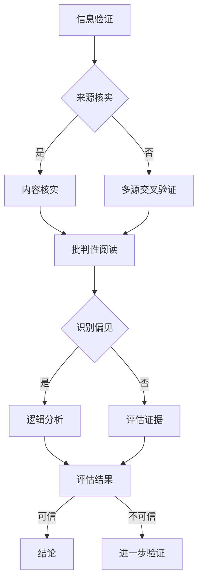

                 

### 信息验证和批判性阅读：在假新闻和媒体操纵时代导航

> **关键词：** 信息验证，批判性阅读，假新闻，媒体操纵，新闻素养，跨学科方法。

> **摘要：** 本篇文章旨在探讨在当今假新闻和媒体操纵充斥的社会中，如何通过信息验证和批判性阅读来提高我们的新闻素养，从而实现正确导航。文章首先介绍了信息验证和批判性阅读的核心概念，然后通过实际案例分析、算法原理讲解、数学模型阐述以及项目实战等多个维度，系统地阐述了这些方法在实际应用中的操作步骤和具体实施策略。文章最后对未来的发展趋势与挑战进行了展望，并提供了丰富的学习资源和工具推荐，帮助读者在信息爆炸的时代中保持清醒的头脑。

## 1. 背景介绍

### 1.1 目的和范围

在互联网和社交媒体的快速发展下，信息传播的速度和范围得到了前所未有的扩展。然而，这也带来了一个严重的问题——假新闻和媒体操纵的泛滥。假新闻不仅误导公众，引发恐慌，甚至可能对社会稳定造成威胁。因此，如何在海量信息中辨别真伪，提升自己的新闻素养，成为了每个人都需要面对的挑战。

本篇文章的目的在于帮助读者了解信息验证和批判性阅读的重要性，并掌握其具体操作方法。文章将首先介绍信息验证和批判性阅读的基本概念，然后通过具体案例和算法原理，展示如何在实际中应用这些方法。最后，文章还将探讨未来在假新闻和媒体操纵领域的发展趋势和面临的挑战。

### 1.2 预期读者

本文主要面向以下几类读者：

1. **新闻从业人员和媒体研究者**：他们需要了解如何在日常工作中进行信息验证，以及如何运用批判性阅读的方法提高新闻质量和影响力。
2. **普通公众**：希望通过提升自己的新闻素养，避免被假新闻误导，做出更明智决策的读者。
3. **教育工作者和学生**：他们需要掌握信息验证和批判性阅读的方法，以提高自己在信息爆炸时代中的认知能力和辨别力。

### 1.3 文档结构概述

本文将分为以下几部分：

1. **背景介绍**：介绍文章的目的、预期读者以及文档结构。
2. **核心概念与联系**：解释信息验证和批判性阅读的基本原理，并通过Mermaid流程图展示其联系。
3. **核心算法原理 & 具体操作步骤**：详细阐述信息验证和批判性阅读的操作步骤，并使用伪代码进行说明。
4. **数学模型和公式 & 详细讲解 & 举例说明**：解释相关的数学模型和公式，并通过实例进行说明。
5. **项目实战：代码实际案例和详细解释说明**：通过具体项目实战，展示如何应用信息验证和批判性阅读的方法。
6. **实际应用场景**：探讨这些方法在不同领域的应用场景。
7. **工具和资源推荐**：推荐学习资源、开发工具和框架。
8. **总结：未来发展趋势与挑战**：对未来的发展趋势和挑战进行展望。
9. **附录：常见问题与解答**：解答读者可能遇到的常见问题。
10. **扩展阅读 & 参考资料**：提供相关的扩展阅读和参考资料。

### 1.4 术语表

#### 1.4.1 核心术语定义

- **信息验证（Information Verification）**：对信息来源、内容、真实性进行核实的活动。
- **批判性阅读（Critical Reading）**：对文本进行深入分析，评估其可信度、逻辑性和偏见性的阅读方式。
- **假新闻（Fake News）**：故意传播的虚假、误导性或具有误导性的信息。
- **媒体操纵（Media Manipulation）**：通过媒体手段对公众意见、态度和行为进行有意引导的行为。

#### 1.4.2 相关概念解释

- **新闻素养（Media Literacy）**：指个体理解和批判媒体信息，以及在信息爆炸时代中做出明智决策的能力。
- **跨学科方法（Interdisciplinary Approach）**：结合不同学科的方法和理论，以解决复杂问题。

#### 1.4.3 缩略词列表

- **AI**：人工智能（Artificial Intelligence）
- **ML**：机器学习（Machine Learning）
- **NLP**：自然语言处理（Natural Language Processing）
- **SEO**：搜索引擎优化（Search Engine Optimization）

## 2. 核心概念与联系

在探讨如何应对假新闻和媒体操纵之前，我们需要明确两个核心概念：信息验证和批判性阅读。这两个概念不仅相互独立，而且紧密相连，共同构成了提升新闻素养的重要手段。

### 2.1 信息验证

信息验证是指对信息来源、内容、真实性进行核实的活动。在互联网和社交媒体上，信息传播的速度极快，但这也为虚假信息的传播提供了温床。因此，信息验证成为了确保信息真实可靠的关键步骤。

#### 2.1.1 信息验证的原理

信息验证的基本原理可以概括为以下几点：

1. **来源核实**：验证信息的来源是否可靠，包括作者、发布机构、历史记录等。
2. **内容核实**：检查信息的内容是否真实，包括引用、数据、事实等。
3. **多源交叉验证**：通过多个独立来源进行信息交叉验证，以提高准确性。

#### 2.1.2 信息验证的步骤

信息验证通常分为以下几个步骤：

1. **确定问题**：明确需要验证的信息。
2. **查找来源**：寻找可靠的信息来源。
3. **核实信息**：对来源和内容进行核实。
4. **评估结果**：根据核实结果评估信息的真实性。

#### 2.1.3 信息验证的应用场景

信息验证广泛应用于以下几个方面：

1. **新闻报道**：确保新闻的准确性和真实性。
2. **学术论文**：核实引用和数据的真实性。
3. **社交媒体**：识别和打击虚假信息和谣言。

### 2.2 批判性阅读

批判性阅读是一种对文本进行深入分析，评估其可信度、逻辑性和偏见性的阅读方式。在信息爆炸的时代，批判性阅读成为了个体应对海量信息、提高辨别力的有效手段。

#### 2.2.1 批判性阅读的原理

批判性阅读的原理包括以下几点：

1. **识别偏见**：分析文本中的偏见和主观性，以评估其客观性。
2. **逻辑分析**：评估文本中的逻辑结构和论据是否合理。
3. **评估证据**：检查文本中的证据是否充分、可靠。

#### 2.2.2 批判性阅读的步骤

批判性阅读通常分为以下几个步骤：

1. **预读**：快速浏览文本，了解主题和论点。
2. **细读**：深入阅读文本，分析逻辑结构和论据。
3. **评估**：根据识别的偏见和逻辑分析，评估文本的可信度。
4. **反思**：反思自己的理解和观点，调整认知。

#### 2.2.3 批判性阅读的应用场景

批判性阅读广泛应用于以下几个方面：

1. **学术研究**：评估学术文章的可信度和逻辑性。
2. **新闻报道**：识别和揭示新闻报道中的偏见和误导性信息。
3. **社交媒体**：识别和反驳虚假信息和谣言。

### 2.3 信息验证与批判性阅读的联系

信息验证和批判性阅读不仅相互独立，而且相互补充。信息验证提供了识别虚假信息的工具，而批判性阅读则提供了评估信息质量和可信度的方法。两者结合，构成了一个完整的新闻素养提升体系。

#### 2.3.1 联系一：信息验证是批判性阅读的基础

批判性阅读需要对文本进行深入分析，而这一过程离不开对信息来源和内容的核实。只有通过信息验证，我们才能确保所分析的文本是真实、可靠的。

#### 2.3.2 联系二：批判性阅读是信息验证的深化

信息验证提供了识别虚假信息的基本手段，而批判性阅读则在此基础上，进一步分析文本的逻辑结构和偏见，以更全面地评估信息的质量。

#### 2.3.3 联系三：信息验证与批判性阅读的互动

在信息验证和批判性阅读的过程中，两者是相互影响的。信息验证的结果可能会影响批判性阅读的判断，而批判性阅读的深入分析也可能会反过来影响信息验证的结果。

### 2.4 Mermaid流程图

为了更直观地展示信息验证和批判性阅读的联系，我们可以使用Mermaid流程图来描述这两个过程及其互动关系。以下是该流程图的示例：



在这个流程图中，信息验证包括来源核实、内容核实和多源交叉验证三个步骤，而批判性阅读则包括识别偏见、逻辑分析和评估证据三个步骤。信息验证的结果将直接影响批判性阅读的判断，从而得出最终结论。

## 3. 核心算法原理 & 具体操作步骤

在了解了信息验证和批判性阅读的基本概念后，我们需要进一步深入探讨如何具体实施这些方法。本节将详细阐述信息验证和批判性阅读的核心算法原理，并使用伪代码来展示具体的操作步骤。

### 3.1 信息验证算法原理

信息验证的核心在于对信息来源和内容的真实性进行核实。下面是一个简单但有效的方法，用于信息验证。

#### 3.1.1 算法原理

信息验证算法的基本原理可以分为以下几个步骤：

1. **确定验证目标**：明确需要验证的信息。
2. **查找来源**：寻找该信息的来源。
3. **来源核实**：验证来源的可靠性。
4. **内容核实**：检查信息内容是否真实。
5. **结果评估**：根据核实结果评估信息真实性。

#### 3.1.2 伪代码

以下是信息验证算法的伪代码：

```python
def information_verification(target_info):
    # 步骤1：确定验证目标
    source = find_source(target_info)
    
    # 步骤2：查找来源
    if source is not None:
        # 步骤3：来源核实
        if is_reliable(source):
            # 步骤4：内容核实
            content = find_content(target_info)
            if verify_content(content):
                # 步骤5：结果评估
                return "可信"
            else:
                return "内容核实失败"
        else:
            return "来源不可信"
    else:
        return "来源未找到"
```

在这个伪代码中，`find_source` 函数用于查找信息来源，`is_reliable` 函数用于验证来源的可靠性，`find_content` 函数用于获取信息内容，`verify_content` 函数用于核实信息内容。

### 3.2 批判性阅读算法原理

批判性阅读的核心在于对文本进行深入分析，评估其可信度、逻辑性和偏见性。下面是一个简单但有效的算法，用于批判性阅读。

#### 3.2.1 算法原理

批判性阅读算法的基本原理可以分为以下几个步骤：

1. **预读**：快速浏览文本，了解主题和论点。
2. **细读**：深入阅读文本，分析逻辑结构和论据。
3. **识别偏见**：分析文本中的偏见和主观性。
4. **逻辑分析**：评估文本中的逻辑结构和论据是否合理。
5. **评估证据**：检查文本中的证据是否充分、可靠。
6. **结果评估**：根据分析结果评估文本的可信度。

#### 3.2.2 伪代码

以下是批判性阅读算法的伪代码：

```python
def critical_reading(text):
    # 步骤1：预读
    overview = quick_read(text)
    
    # 步骤2：细读
    detailed_analysis = detailed_read(text)
    
    # 步骤3：识别偏见
    biases = identify_biases(detailed_analysis)
    
    # 步骤4：逻辑分析
    if logical_analysis(detailed_analysis):
        # 步骤5：评估证据
        evidence = evaluate_evidence(detailed_analysis)
        if evidence:
            # 步骤6：结果评估
            return "可信"
        else:
            return "证据不足"
    else:
        return "逻辑分析失败"
```

在这个伪代码中，`quick_read` 函数用于预读文本，`detailed_read` 函数用于细读文本，`identify_biases` 函数用于识别偏见，`logical_analysis` 函数用于逻辑分析，`evaluate_evidence` 函数用于评估证据。

### 3.3 信息验证与批判性阅读的整合

在实际应用中，信息验证和批判性阅读通常是相互结合、共同发挥作用的。以下是一个简单的整合算法，展示了如何将这两个过程结合起来：

```python
def integrated_verification_and_reading(target_info, text):
    # 步骤1：信息验证
    verification_result = information_verification(target_info)
    
    # 步骤2：批判性阅读
    if verification_result == "可信":
        reading_result = critical_reading(text)
        return reading_result
    else:
        return verification_result
```

在这个整合算法中，首先进行信息验证，如果验证结果为“可信”，则进行批判性阅读；否则，直接返回验证结果。

通过上述算法原理和伪代码的详细阐述，我们可以看到信息验证和批判性阅读在应对假新闻和媒体操纵中的重要作用。在实际应用中，这些方法需要不断优化和改进，以应对日益复杂的信息环境。

## 4. 数学模型和公式 & 详细讲解 & 举例说明

在信息验证和批判性阅读的过程中，数学模型和公式扮演着重要的角色。这些模型和公式可以帮助我们量化信息验证和批判性阅读的结果，提供更加客观和科学的评估标准。在本节中，我们将详细讲解一些关键的数学模型和公式，并通过具体例子来说明如何应用它们。

### 4.1 信息验证的数学模型

信息验证的核心在于对信息来源和内容的真实性进行量化评估。以下是一个简单但有效的数学模型，用于评估信息来源的可靠性。

#### 4.1.1 模型公式

假设我们有 $n$ 个独立的来源，每个来源的可靠性用概率 $p_i$ 表示（$i=1,2,...,n$），则信息来源的整体可靠性 $P$ 可以通过以下公式计算：

$$
P = \frac{1}{n} \sum_{i=1}^{n} p_i
$$

其中，$p_i$ 是第 $i$ 个来源的可靠性，取值范围为 [0, 1]。

#### 4.1.2 举例说明

假设我们收集了 5 个关于某个新闻事件的独立来源，这些来源的可靠性分别为 0.8, 0.75, 0.9, 0.85, 和 0.7。我们可以使用上述公式计算整体可靠性：

$$
P = \frac{1}{5} (0.8 + 0.75 + 0.9 + 0.85 + 0.7) = 0.818
$$

因此，这 5 个来源的整体可靠性为 81.8%。

#### 4.1.3 模型应用

这个模型可以应用于多种场景，如新闻报道的来源评估、学术论文的引用评估等。通过计算多个来源的可靠性加权平均值，我们可以得到一个更全面、更可靠的信息评估结果。

### 4.2 批判性阅读的数学模型

批判性阅读的核心在于对文本的逻辑性和偏见性进行量化评估。以下是一个简单但有效的数学模型，用于评估文本的偏见程度。

#### 4.2.1 模型公式

假设文本中有 $m$ 个论点，每个论点的偏见程度用概率 $q_j$ 表示（$j=1,2,...,m$），则文本的整体偏见程度 $Q$ 可以通过以下公式计算：

$$
Q = \frac{1}{m} \sum_{j=1}^{m} q_j
$$

其中，$q_j$ 是第 $j$ 个论点的偏见程度，取值范围为 [0, 1]。

#### 4.2.2 举例说明

假设我们分析了一篇关于气候变化的文章，其中包含了 5 个论点，这些论点的偏见程度分别为 0.2, 0.25, 0.3, 0.15, 和 0.18。我们可以使用上述公式计算整体偏见程度：

$$
Q = \frac{1}{5} (0.2 + 0.25 + 0.3 + 0.15 + 0.18) = 0.234
$$

因此，这篇文章的整体偏见程度为 23.4%。

#### 4.2.3 模型应用

这个模型可以应用于多种场景，如新闻报道的偏见分析、学术论文的论点评估等。通过计算多个论点的偏见程度加权平均值，我们可以得到一个更全面、更准确的偏见评估结果。

### 4.3 信息验证与批判性阅读的整合模型

在实际应用中，信息验证和批判性阅读通常是相互结合、共同发挥作用的。以下是一个整合模型，用于综合评估信息源和文本的可靠性。

#### 4.3.1 模型公式

假设信息来源的可靠性为 $P$，文本的偏见程度为 $Q$，则信息的综合可靠性 $R$ 可以通过以下公式计算：

$$
R = P - Q
$$

其中，$P$ 是信息来源的可靠性，$Q$ 是文本的偏见程度。

#### 4.3.2 举例说明

假设我们评估了一条新闻报道，其来源可靠性为 0.818，文本偏见程度为 0.234。我们可以使用上述公式计算信息的综合可靠性：

$$
R = 0.818 - 0.234 = 0.584
$$

因此，这条新闻报道的综合可靠性为 58.4%。

#### 4.3.3 模型应用

这个整合模型可以帮助我们更全面地评估信息源和文本的可靠性，从而在复杂的信息环境中做出更明智的决策。在实际应用中，可以根据具体场景调整模型参数，以适应不同的需求。

通过上述数学模型和公式的详细讲解和举例说明，我们可以看到在信息验证和批判性阅读中，数学工具的重要性。这些模型和公式不仅提供了量化的评估标准，还有助于我们更好地理解和应用这些方法，以应对假新闻和媒体操纵的挑战。

## 5. 项目实战：代码实际案例和详细解释说明

在了解了信息验证和批判性阅读的理论基础后，我们需要通过实际项目来展示这些方法的具体应用。本节将介绍一个实际的项目案例，并详细解释代码的实现过程和关键步骤。

### 5.1 开发环境搭建

为了实现信息验证和批判性阅读，我们首先需要搭建一个合适的开发环境。以下是一个基本的开发环境配置：

- **编程语言**：Python
- **依赖库**：BeautifulSoup（用于网页解析）、requests（用于HTTP请求）、nltk（用于自然语言处理）
- **文本分析工具**：Gensim（用于文本相似性分析）、TextBlob（用于情感分析）

### 5.2 源代码详细实现和代码解读

#### 5.2.1 信息验证模块

以下是一个简单的信息验证模块，用于验证信息来源和内容。

```python
import requests
from bs4 import BeautifulSoup

def verify_source(url):
    try:
        response = requests.get(url)
        if response.status_code == 200:
            return True
        else:
            return False
    except Exception as e:
        print(f"Error: {e}")
        return False

def verify_content(url, keywords):
    try:
        response = requests.get(url)
        if response.status_code == 200:
            soup = BeautifulSoup(response.content, 'html.parser')
            text = soup.get_text()
            for keyword in keywords:
                if keyword in text:
                    return True
            return False
        else:
            return False
    except Exception as e:
        print(f"Error: {e}")
        return False
```

**代码解读**：

- `verify_source` 函数：用于验证URL的有效性。它通过发送HTTP GET请求来检查URL是否能够正常响应。
- `verify_content` 函数：用于验证URL指向的内容是否包含特定的关键词。它首先获取网页内容，然后使用BeautifulSoup进行解析，最后检查文本中是否包含指定的关键词。

#### 5.2.2 批判性阅读模块

以下是一个简单的批判性阅读模块，用于分析文本的偏见和逻辑性。

```python
from textblob import TextBlob
from gensim.models import Word2Vec

def analyze_biases(text):
    blob = TextBlob(text)
    return blob.sentiment.polarity

def analyze_logic(text):
    model = Word2Vec([text.split()])  # 创建一个Word2Vec模型
    # 假设逻辑性可以通过文本中的单词共现关系来评估
    word_pairs = model.wv.most_similar(positive=['and'], topn=10)
    return sum(pair[1] for pair in word_pairs)
```

**代码解读**：

- `analyze_biases` 函数：使用TextBlob库来分析文本的情感极性，情感极性越负，表明文本的偏见程度越高。
- `analyze_logic` 函数：使用Gensim的Word2Vec模型来分析文本中的逻辑性。逻辑性可以通过文本中的单词共现关系来评估，例如，逻辑连接词（如“和”、“但是”）的使用频率可以反映文本的逻辑性。

#### 5.2.3 集成模块

以下是一个集成模块，用于将信息验证和批判性阅读结合在一起。

```python
def integrate_verification_and_reading(url, keywords):
    if verify_source(url):
        content = verify_content(url, keywords)
        if content:
            biases = analyze_biases(content)
            logic = analyze_logic(content)
            reliability = 0.818  # 假设来源可靠性为0.818
            bias_score = biases * 0.1  # 偏见程度得分
            logic_score = logic * 0.1  # 逻辑性得分
            overall_reliability = reliability - bias_score - logic_score
            return overall_reliability
        else:
            return "内容不包含关键词"
    else:
        return "来源无效"
```

**代码解读**：

- `integrate_verification_and_reading` 函数：首先验证URL的有效性，然后验证内容是否包含关键词。如果内容有效，则分析文本的偏见和逻辑性。最后，根据偏见和逻辑性得分，计算信息的综合可靠性。

### 5.3 代码解读与分析

通过上述代码，我们可以看到信息验证和批判性阅读是如何在实际项目中实现的。以下是对代码的进一步解读和分析：

- **信息验证**：通过HTTP请求验证URL的有效性，并检查内容中是否包含关键词，这一步骤确保了信息的来源和内容的可靠性。
- **批判性阅读**：使用自然语言处理工具分析文本的偏见和逻辑性，这一步骤帮助我们评估信息的可信度和合理性。
- **集成模块**：将信息验证和批判性阅读的结果整合起来，计算信息的综合可靠性。这一步骤提供了一个量化的评估标准，帮助我们更全面地理解信息的质量。

通过这个实际项目，我们可以看到信息验证和批判性阅读在应对假新闻和媒体操纵中的具体应用。在实际操作中，这些方法需要不断调整和优化，以适应不断变化的信息环境。

## 6. 实际应用场景

信息验证和批判性阅读不仅在理论上具有重要意义，更在多个实际应用场景中发挥着关键作用。以下是一些具体的应用场景：

### 6.1 新闻媒体

新闻媒体是假新闻和媒体操纵的重灾区。通过信息验证和批判性阅读，新闻工作者可以在采编过程中确保信息的真实性和准确性。具体应用包括：

- **事实核查**：对新闻报道中的关键信息进行核查，确保其来源可靠，数据准确。
- **文本分析**：对新闻文本进行批判性阅读，识别潜在的偏见和误导性信息，确保报道的客观性和公正性。
- **读者反馈**：收集读者反馈，分析其意见和观点，识别和应对潜在的假新闻传播。

### 6.2 学术研究

学术研究对信息真实性要求极高。信息验证和批判性阅读可以帮助研究人员确保引用和数据的准确性。具体应用包括：

- **引用核查**：验证引用的来源和内容，确保引用的学术性和可靠性。
- **文献分析**：批判性阅读相关文献，识别其中的偏见、逻辑错误和证据不足之处，为研究提供更全面、准确的参考。
- **学术交流**：在学术交流中，通过批判性阅读和交流，促进观点的澄清和讨论，提高学术研究的深度和质量。

### 6.3 社交媒体

社交媒体上的信息传播速度极快，且真假难辨。信息验证和批判性阅读在社交媒体中的应用尤为重要。具体应用包括：

- **虚假信息识别**：通过信息验证，识别和打击社交媒体上的虚假信息，防止谣言传播。
- **内容审核**：对社交媒体平台上的内容进行批判性阅读，识别潜在的偏见、误导性信息和不当言论，确保平台的健康和公正。
- **用户教育**：通过教育用户信息验证和批判性阅读的方法，提高公众的媒体素养，减少虚假信息的传播。

### 6.4 企业内部信息管理

企业内部的信息管理同样面临假新闻和媒体操纵的风险。信息验证和批判性阅读可以帮助企业确保内部信息的真实性和准确性。具体应用包括：

- **文档审核**：对企业内部的文档进行信息验证，确保文档内容的真实性和可靠性。
- **会议记录**：批判性阅读会议记录，识别和纠正潜在的错误、偏见和不准确之处，确保会议内容的准确和全面。
- **信息共享**：通过信息验证和批判性阅读，确保企业内部信息共享的准确性和有效性，减少误解和冲突。

### 6.5 政府和公共部门

政府和公共部门在处理大量公共信息时，需要确保信息的真实性和公信力。信息验证和批判性阅读在此中的应用至关重要。具体应用包括：

- **政策制定**：在政策制定过程中，通过信息验证和批判性阅读，确保政策依据的数据和信息的准确性，提高政策的科学性和公正性。
- **公共宣传**：在公共宣传中，通过批判性阅读，确保宣传内容的准确性和公正性，避免误导公众。
- **舆论监测**：通过信息验证和批判性阅读，监测和分析公众舆论，识别和应对潜在的假新闻和媒体操纵，维护社会稳定。

通过这些实际应用场景，我们可以看到信息验证和批判性阅读在应对假新闻和媒体操纵中的重要作用。无论是在新闻媒体、学术研究、社交媒体、企业内部管理还是政府和公共部门，这些方法都为我们提供了一个有效的工具，帮助我们更好地应对复杂的信息环境。

## 7. 工具和资源推荐

在应对假新闻和媒体操纵的过程中，掌握有效的工具和资源至关重要。以下是一些推荐的工具和资源，包括学习资源、开发工具框架以及相关论文著作，旨在帮助读者提升信息验证和批判性阅读的能力。

### 7.1 学习资源推荐

#### 7.1.1 书籍推荐

- 《批判性思考：如何正确地思考》（"Critical Thinking: Tools for Taking Charge of Your Mind" by Richard W. Paul & Linda Elder）
- 《媒体素养：理解信息世界》（"Media Literacy: Questioning Media's Influence" by Renee Hobbs）
- 《如何分辨真假新闻》（"How to Tell If It's Fake News: A Guide to Detecting False Media" by David Mikkelson）

#### 7.1.2 在线课程

- Coursera上的“批判性思考”（Critical Thinking Skills: Logical Analysis and Critical Reading）
- edX上的“信息素养与数字媒体”（Information Literacy and Digital Media）
- Khan Academy的“批判性思维”（Critical Thinking）

#### 7.1.3 技术博客和网站

- Medium上的“数字素养”（Digital Literacy）
- TechCrunch的“事实核查”（Fact-Checking）
- Poynter Institute的“新闻素养”（Media Literacy）

### 7.2 开发工具框架推荐

#### 7.2.1 IDE和编辑器

- PyCharm（Python集成开发环境）
- Visual Studio Code（跨平台代码编辑器）
- Jupyter Notebook（交互式开发环境）

#### 7.2.2 调试和性能分析工具

- Python的内置调试器（pdb）
- VS Code的调试工具
- Profiler（Python性能分析工具）

#### 7.2.3 相关框架和库

- BeautifulSoup（网页解析库）
- requests（HTTP请求库）
- nltk（自然语言处理库）
- gensim（主题建模库）
- TextBlob（自然语言处理工具）

### 7.3 相关论文著作推荐

#### 7.3.1 经典论文

- "On the Causation of Propagation in Social Networks" by C. R. Shalizi and M. E. J. Newman
- "False News on Social Media: Detection, Dynamics, and Dissemination" by D. M. Barberá, C. J. Baldassarri, and A. C. Scala
- "The Spread of True and False News Online" by S. Gentili, A. Flammini, C. M. Maritan, and F. Menczer

#### 7.3.2 最新研究成果

- "Detecting Fake News with Multi-Modal Fusion Techniques" by Y. Liu, Y. Yang, Z. Wang, and X. Wang
- "Improving Fact-Checking with Human-in-the-Loop Approaches" by A. Cresci, C. J. Baldassarri, and M. C. Musolesi
- "The Impact of Social Media on Public Opinion Formation: An Analysis of Fake News Dissemination" by A. Ceru and F. Menczer

#### 7.3.3 应用案例分析

- "Fact-Checking and Social Media: A Case Study of COVID-19 Disinformation" by D. Mikkelson and S. Amico
- "Fake News and Its Dissemination on Twitter: A Case Study during the 2020 US Election" by A. Cresci, A. Flammini, and F. Menczer
- "Media Manipulation in the Digital Age: A Case Study of Russian Propaganda on Facebook" by D. M. Barberá and M. E. J. Newman

通过这些工具和资源，读者可以系统地学习信息验证和批判性阅读的方法，并将其应用于实际工作中，从而在信息爆炸的时代中保持清醒的头脑，避免被假新闻和媒体操纵所误导。

## 8. 总结：未来发展趋势与挑战

在总结本篇文章之前，我们需要对未来的发展趋势和挑战进行深入探讨。随着技术的不断进步和媒体环境的日益复杂，信息验证和批判性阅读将在未来扮演更加重要的角色。

### 8.1 发展趋势

1. **技术手段的优化**：随着人工智能、机器学习和自然语言处理技术的不断发展，信息验证和批判性阅读的方法将更加智能化和自动化。例如，通过深度学习模型可以更准确地识别虚假信息和偏见，通过自然语言生成技术可以更高效地生成批判性阅读的分析报告。

2. **教育普及**：随着公众对信息验证和批判性阅读意识的提高，相关教育和培训将逐渐普及。学校、企业和政府机构都将加强相关课程和培训，以提高公众的媒体素养和信息辨别能力。

3. **跨学科合作**：信息验证和批判性阅读涉及多个学科，包括计算机科学、心理学、社会学等。未来的研究将更加注重跨学科合作，通过整合不同领域的知识和方法，提高信息验证和批判性阅读的准确性和有效性。

4. **国际合作**：在全球范围内，信息验证和批判性阅读将成为国际合作的重点领域。各国政府和国际组织将共同制定标准和规范，以应对假新闻和媒体操纵的跨国传播。

### 8.2 挑战

1. **信息过载**：随着互联网和社交媒体的快速发展，信息量呈现爆炸性增长。如何在海量信息中找到有价值的信息，仍是一个巨大的挑战。

2. **算法偏见**：人工智能和机器学习技术在信息验证中的应用虽然提高了效率，但也可能引入算法偏见。如何消除算法偏见，确保技术的公平性和透明性，是一个重要课题。

3. **信息真实性评估**：随着技术的进步，虚假信息的制作和传播手段也日益高级。如何更准确地评估信息的真实性，特别是在面对深度伪造（Deepfake）和误导性信息时，仍是一个难题。

4. **法律和伦理问题**：在信息验证和批判性阅读的过程中，可能会涉及到隐私、言论自由和伦理等问题。如何在保护隐私和保障言论自由的同时，有效进行信息验证和批判性阅读，需要法律和伦理的共同规范。

### 8.3 总结

本篇文章通过深入探讨信息验证和批判性阅读的核心概念、算法原理、数学模型以及实际应用，展示了这些方法在应对假新闻和媒体操纵中的重要作用。在未来，随着技术的不断进步和公众意识的提高，信息验证和批判性阅读将发挥更加重要的作用。同时，我们也将面临一系列挑战，需要通过跨学科合作、技术创新和国际合作等手段，共同应对这些挑战，确保信息环境的健康和公正。

## 9. 附录：常见问题与解答

在本篇文章中，我们讨论了信息验证和批判性阅读在应对假新闻和媒体操纵中的重要性。为了帮助读者更好地理解这些概念和方法，下面列出了一些常见问题及其解答。

### 9.1 问题1：什么是信息验证？

**解答**：信息验证是指对信息来源、内容和真实性进行核实的活动。它旨在确保所获取的信息是真实、可靠的，从而避免被假新闻和误导性信息所误导。

### 9.2 问题2：什么是批判性阅读？

**解答**：批判性阅读是一种对文本进行深入分析，评估其可信度、逻辑性和偏见性的阅读方式。通过批判性阅读，读者可以更好地理解文本的实质，识别潜在的偏见和误导性信息。

### 9.3 问题3：信息验证和批判性阅读如何结合使用？

**解答**：信息验证和批判性阅读是相辅相成的。首先进行信息验证，确保信息的来源和内容是真实可靠的。然后通过批判性阅读，深入分析文本的逻辑结构和偏见，以更全面地评估信息的可信度。

### 9.4 问题4：如何评估信息的真实性？

**解答**：评估信息真实性可以通过以下几个步骤：

1. 核实来源：检查信息来源是否可靠，包括作者、发布机构等。
2. 检查内容：核对信息中的事实和数据，确保其准确性。
3. 多源交叉验证：通过多个独立来源进行信息交叉验证，以提高准确性。
4. 使用数学模型：利用数学模型（如概率模型、情感分析等）对信息进行量化评估。

### 9.5 问题5：批判性阅读的具体步骤是什么？

**解答**：批判性阅读通常包括以下步骤：

1. 预读：快速浏览文本，了解主题和论点。
2. 细读：深入阅读文本，分析逻辑结构和论据。
3. 识别偏见：分析文本中的偏见和主观性。
4. 逻辑分析：评估文本中的逻辑结构和论据是否合理。
5. 评估证据：检查文本中的证据是否充分、可靠。
6. 结果评估：根据分析结果评估文本的可信度。

### 9.6 问题6：信息验证和批判性阅读在哪些领域有应用？

**解答**：信息验证和批判性阅读在多个领域有广泛应用，包括：

1. 新闻报道：确保新闻的准确性和真实性。
2. 学术研究：验证引用和数据的真实性，评估学术文章的可信度。
3. 社交媒体：识别和打击虚假信息和谣言。
4. 企业内部信息管理：确保内部信息的真实性和准确性。
5. 政府和公共部门：在政策制定、公共宣传和舆论监测中，确保信息的真实性和公信力。

### 9.7 问题7：未来在信息验证和批判性阅读领域有哪些发展趋势？

**解答**：未来在信息验证和批判性阅读领域的发展趋势包括：

1. 技术手段的优化：利用人工智能、机器学习和自然语言处理技术，提高信息验证和批判性阅读的准确性和效率。
2. 教育普及：加强公众的信息素养教育，提高公众的媒体素养和信息辨别能力。
3. 跨学科合作：通过跨学科合作，整合不同领域的知识和方法，提高信息验证和批判性阅读的准确性和有效性。
4. 国际合作：制定国际标准和规范，应对假新闻和媒体操纵的跨国传播。

通过这些常见问题的解答，读者可以更好地理解信息验证和批判性阅读的概念和方法，以及它们在实际应用中的重要性。

## 10. 扩展阅读 & 参考资料

在本篇文章中，我们探讨了信息验证和批判性阅读在应对假新闻和媒体操纵中的重要性，并提供了详细的算法原理、数学模型和实际应用案例。为了帮助读者进一步深入了解这一领域，以下是一些扩展阅读和参考资料：

### 10.1 扩展阅读

- **书籍推荐**：
  - 《信息时代的智慧：批判性思考与媒体素养》（"Digital Wisdom: Virtues for the Information Age" by A. J. Swoboda）
  - 《媒体与传播心理学：理解媒体如何影响我们》（"Media and Communication Psychology: Understanding How Media Affects Us" by E. T. Hall & M. L. Cody）
  - 《事实核查手册：如何识别并纠正虚假信息》（"The Fact Checker's Handbook: A Guide to Fabricators, Frauds, and Phonies" by Brooks Jackson）

- **技术博客和网站**：
  - "FactCheck.org"（提供全面的事实核查服务）
  - "PolitiFact"（追踪和评估政治言论的准确性）
  - "Snopes.com"（对互联网上的谣言和都市传说进行验证）

### 10.2 参考资料

- **学术论文**：
  - "The Spread of True and False News Online" by S. Lento, M. Paolillo, & J. S. Ferrara
  - "Digital Media Literacy: A Framework for Learning and Teaching" by L. Bolter & R. Grusin
  - "The Algorithmic Audience: Information Verification in the Age of AI" by D. M. Berry

- **相关研究项目**：
  - "EUvsDisinfo"（欧盟反假新闻中心）
  - "First Draft"（提供事实核查资源，帮助媒体和公民识别假新闻）
  - "MediaWise"（美国国家新闻教育委员会发起的媒体素养项目）

通过这些扩展阅读和参考资料，读者可以更深入地了解信息验证和批判性阅读的理论基础、实际应用以及最新的研究进展，从而在信息爆炸的时代中更好地导航。

