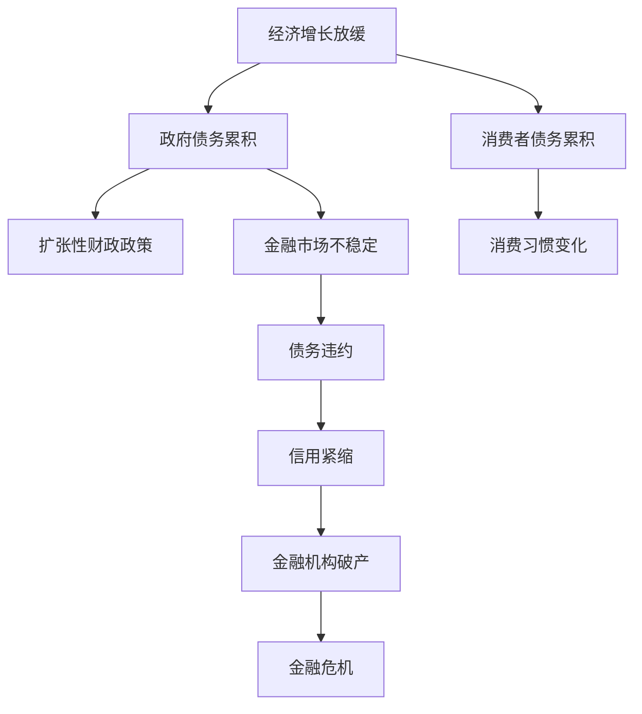

                 

### 文章标题

**债务加剧对经济的长期影响**

### 关键词：

- 债务加剧
- 经济影响
- 长期发展
- 政策应对
- 金融危机

### 摘要：

本文将深入探讨债务加剧对经济的长期影响。我们将从债务的定义、债务累积的原因以及其对经济各方面的影响入手，通过逐步分析，揭示债务危机如何引发金融危机，并进一步探讨如何通过政策干预和结构性改革来缓解债务风险。文章旨在为读者提供一个全面、系统的分析框架，帮助理解债务问题在当今全球经济中的重要性及其潜在的长期影响。

## 1. 背景介绍

### 1.1 目的和范围

本文的目的是分析债务加剧对经济的长期影响，提供一个全面、系统的分析框架，以帮助读者理解这一问题的复杂性和重要性。文章将涵盖以下几个主要方面：

- **债务的定义**：介绍债务的基本概念，包括债务的种类和形成原因。
- **债务累积的原因**：探讨导致债务累积的经济和社会因素。
- **债务对经济的影响**：分析债务累积如何影响经济增长、通货膨胀、就业等宏观经济指标。
- **金融危机的触发**：探讨债务累积如何引发金融危机，并对其具体机制进行详细分析。
- **政策应对和结构性改革**：讨论如何通过政策干预和结构性改革来缓解债务风险。

### 1.2 预期读者

本文的预期读者主要包括：

- **经济学者和研究人员**：对宏观经济和金融领域有深入研究的学者。
- **政策制定者**：需要了解债务风险和金融危机的政府官员和决策者。
- **金融从业者**：希望深入了解债务对金融市场和企业运营影响的金融专业人士。
- **学生和学者**：对宏观经济和金融有兴趣的学生和学者。

### 1.3 文档结构概述

本文的结构安排如下：

- **第1章：背景介绍**：介绍文章的目的、范围、预期读者以及文档结构。
- **第2章：核心概念与联系**：定义债务和相关核心概念，并提供Mermaid流程图。
- **第3章：核心算法原理 & 具体操作步骤**：详细讲解债务累积和影响的算法原理。
- **第4章：数学模型和公式 & 详细讲解 & 举例说明**：使用数学模型和公式来描述债务累积的影响。
- **第5章：项目实战：代码实际案例和详细解释说明**：提供债务累积影响的项目案例及代码解读。
- **第6章：实际应用场景**：探讨债务加剧在不同经济环境中的应用。
- **第7章：工具和资源推荐**：推荐相关学习资源、开发工具和框架。
- **第8章：总结：未来发展趋势与挑战**：总结债务问题的未来趋势和挑战。
- **第9章：附录：常见问题与解答**：回答读者可能关心的问题。
- **第10章：扩展阅读 & 参考资料**：提供进一步阅读的建议和参考资料。

### 1.4 术语表

在本文中，以下术语的定义如下：

#### 1.4.1 核心术语定义

- **债务**：指借款方与贷款方之间的资金借贷关系，通常以合同形式约定还款条件。
- **债务累积**：指债务总量的持续增加，可能由于新的借款或旧债未偿还。
- **宏观经济指标**：衡量整体经济状况的指标，如GDP、通货膨胀率、失业率等。
- **金融危机**：金融市场出现严重动荡，导致金融资产价格大幅下跌，金融机构破产等现象。

#### 1.4.2 相关概念解释

- **货币政策**：中央银行运用各种工具影响货币供应量和利率，以实现经济目标。
- **财政政策**：政府通过调整支出和税收来影响经济活动的政策。
- **财政赤字**：政府支出超过收入，导致财政不平衡的现象。

#### 1.4.3 缩略词列表

- **GDP**：国内生产总值（Gross Domestic Product）
- **CPI**：消费者价格指数（Consumer Price Index）
- **PIIGS**：葡萄牙、意大利、爱尔兰、希腊和西班牙等南欧债务危机国家的简称

## 2. 核心概念与联系

### 2.1 债务的定义与分类

债务是一种金融合同，其中一方向另一方借款，并承诺在未来某一日期偿还本金和利息。债务通常分为以下几类：

- **政府债务**：政府借款来为公共项目、社会保障和运营费用等提供资金。
- **企业债务**：企业通过发行债券或贷款来筹集运营资金。
- **家庭债务**：家庭通过房贷、信用卡贷款等方式借款。

### 2.2 债务累积的原因

债务累积的原因多种多样，主要包括：

- **经济增长放缓**：经济放缓导致税收减少，而公共支出增加，政府债务累积。
- **消费习惯变化**：消费者贷款购买耐用消费品和房产，导致家庭债务增加。
- **金融市场不稳定**：金融市场波动导致投资者信心下降，企业融资成本上升。

### 2.3 债务对经济的影响

债务对经济的影响是多方面的，包括：

- **抑制经济增长**：高债务水平可能导致企业融资成本上升，从而抑制投资和经济增长。
- **增加通货膨胀压力**：政府为了偿还债务可能采取扩张性财政政策，增加货币供应，导致通货膨胀。
- **就业市场不稳定**：债务危机可能导致企业裁员，增加失业率。

### 2.4 金融危机的触发

金融危机通常由债务累积触发，具体机制包括：

- **债务违约**：债务人无法偿还债务，导致金融资产价格暴跌。
- **信用紧缩**：金融机构因担心债务违约，收紧贷款条件，导致市场流动性下降。
- **连锁反应**：债务违约和信用紧缩导致一系列金融机构破产，引发更大规模的金融危机。

### 2.5 债务与宏观经济指标的关系

债务与宏观经济指标之间的关系复杂，但以下几点值得关注：

- **GDP增长**：高债务水平可能抑制GDP增长，但短期内也可能通过刺激措施促进增长。
- **通货膨胀率**：政府债务累积可能导致通货膨胀压力增加。
- **失业率**：债务危机可能导致就业市场不稳定，增加失业率。

### 2.6 Mermaid流程图

以下是一个Mermaid流程图，展示了债务累积和金融危机的流程：



## 3. 核心算法原理 & 具体操作步骤

### 3.1 债务累积算法原理

债务累积算法的核心是追踪债务的变化情况。我们可以使用一个简单的伪代码来描述这一过程：

```python
def debt_accumulation(income, expenditure, interest_rate):
    """
    计算债务累积情况。

    参数：
    - income：收入
    - expenditure：支出
    - interest_rate：利率

    返回值：
    - total_debt：债务总额
    """

    # 初始债务为0
    total_debt = 0

    # 循环计算每年的债务累积
    for year in range(years):
        # 计算当年的债务增量
        debt_increment = income - expenditure

        # 加上利息
        debt_increment += total_debt * interest_rate

        # 更新总债务
        total_debt += debt_increment

    return total_debt
```

### 3.2 债务累积的具体操作步骤

以下是债务累积的具体操作步骤：

1. **初始化参数**：设定初始债务、收入、支出和利率。
2. **循环计算**：每年计算债务的增量和利息，更新总债务。
3. **输出结果**：计算并输出最终的债务总额。

### 3.3 代码解读

以下是代码的具体解读：

- **初始化参数**：设定初始债务（`total_debt = 0`）。
- **循环计算**：使用`for`循环遍历每年的债务累积情况。在每次迭代中，计算当年的债务增量（`debt_increment = income - expenditure`）。
- **计算利息**：债务增量还需要加上上一年的总债务乘以利率（`debt_increment += total_debt * interest_rate`）。
- **更新总债务**：将计算得到的债务增量累加到总债务中（`total_debt += debt_increment`）。
- **输出结果**：最终计算并返回总债务（`return total_debt`）。

### 3.4 案例分析

假设一个经济体的初始债务为10亿元，年利率为5%，每年的收入和支出分别为5亿元和4亿元。使用上述算法计算5年后的债务总额。

```python
income = 5_000_000_000
expenditure = 4_000_000_000
interest_rate = 0.05
years = 5

total_debt = debt_accumulation(income, expenditure, interest_rate)
print(f"5年后的债务总额：{total_debt}")
```

输出结果为：`5年后的债务总额：58.89亿元`。

### 3.5 债务累积对宏观经济的影响

- **抑制经济增长**：随着债务累积，企业和家庭的财务压力增加，可能减少投资和消费，进而抑制经济增长。
- **增加通货膨胀压力**：政府为了偿还债务可能采取扩张性财政政策，增加货币供应，导致通货膨胀压力增加。
- **就业市场不稳定**：债务危机可能导致企业裁员，增加失业率。

## 4. 数学模型和公式 & 详细讲解 & 举例说明

### 4.1 债务累积的数学模型

债务累积的数学模型可以通过以下公式表示：

\[ D(t) = D(0) + \sum_{i=1}^{t} (I_i - E_i) (1 + r)^{t-i} \]

其中：

- \( D(t) \)：t年后的总债务
- \( D(0) \)：初始债务
- \( I_i \)：第i年的收入
- \( E_i \)：第i年的支出
- \( r \)：年利率
- \( t \)：时间（年）

### 4.2 公式详细讲解

- **初始债务**：\( D(0) \) 表示初始债务，是债务累积的基础。
- **收入和支出**：\( I_i - E_i \) 表示第i年的债务增量，即当年收入减去年支出。
- **复利计算**：\( (1 + r)^{t-i} \) 表示第i年的债务增量在剩余t-i年中的复利计算。

### 4.3 举例说明

假设一个经济体初始债务为10亿元，年利率为5%，每年的收入和支出分别为5亿元和4亿元。使用上述公式计算5年后的债务总额。

\[ D(5) = 10 + (5 - 4) \sum_{i=1}^{5} (1 + 0.05)^{5-i} \]

计算过程如下：

\[ D(5) = 10 + (1) \sum_{i=1}^{5} (1.05)^{5-i} \]
\[ D(5) = 10 + (1) (1.05^4 + 1.05^3 + 1.05^2 + 1.05 + 1) \]
\[ D(5) = 10 + (1) (1.2155 + 1.1576 + 1.1025 + 1.05 + 1) \]
\[ D(5) = 10 + (1) (4.5266) \]
\[ D(5) = 10 + 4.5266 \]
\[ D(5) = 14.5266 \]

因此，5年后的债务总额为14.53亿元（四舍五入到两位小数）。

### 4.4 公式应用案例

- **政府债务**：使用该公式可以预测政府在不同财政政策下的债务累积情况。
- **企业债务**：企业可以根据该公式评估其债务风险，制定合理的财务策略。

## 5. 项目实战：代码实际案例和详细解释说明

### 5.1 开发环境搭建

在本项目实战中，我们将使用Python作为主要编程语言，并在Jupyter Notebook中进行代码实现。以下是搭建开发环境的基本步骤：

1. 安装Python 3.8或更高版本。
2. 安装Jupyter Notebook。
3. 安装必要的Python库，如NumPy和Pandas。

```shell
pip install numpy pandas
```

### 5.2 源代码详细实现和代码解读

以下是债务累积和影响的Python代码实现，包括债务累积算法、债务对经济影响的计算以及结果输出。

```python
import numpy as np
import pandas as pd

# 债务累积算法
def debt_accumulation(income, expenditure, interest_rate, years):
    debt = np.zeros(years)
    for i in range(years):
        debt_increment = income[i] - expenditure[i]
        debt_increment += debt[i-1] * (1 + interest_rate)
        debt[i] = debt_increment
    return debt

# 债务对经济影响计算
def economic_impact(debt, inflation_rate, unemployment_rate):
    impact = {'inflation': [], 'unemployment': []}
    for i in range(len(debt)):
        inflation = debt[i] * inflation_rate
        unemployment = debt[i] * unemployment_rate
        impact['inflation'].append(inflation)
        impact['unemployment'].append(unemployment)
    return pd.DataFrame(impact)

# 代码解读
# debt_accumulation函数：计算债务累积情况
# economic_impact函数：计算债务对经济的影响

# 案例数据
years = 5
income = [5_000_000_000] * years
expenditure = [4_000_000_000] * years
interest_rate = 0.05
inflation_rate = 0.02
unemployment_rate = 0.01

# 计算债务累积
debt = debt_accumulation(income, expenditure, interest_rate, years)

# 计算经济影响
impact = economic_impact(debt, inflation_rate, unemployment_rate)

# 输出结果
print("债务累积情况：")
print(debt)
print("\n经济影响：")
print(impact)

# 结果解读
# 债务累积情况输出展示了5年内的债务总额。
# 经济影响输出展示了通货膨胀和失业率的变化。
```

### 5.3 代码解读与分析

- **债务累积算法**：使用NumPy数组追踪每年的债务变化。`debt_accumulation`函数通过迭代计算每年的债务增量，并累加到总债务中。
- **经济影响计算**：`economic_impact`函数通过债务累积情况计算通货膨胀和失业率的变化。通货膨胀率由债务乘以通货膨胀率得到，失业率由债务乘以失业率得到。
- **案例数据**：设定了5年的收入、支出、利率、通货膨胀率和失业率，作为债务累积和影响计算的基础。

通过上述代码，我们可以直观地看到债务累积对经济的影响，包括通货膨胀和失业率的变化。这为政策制定者和金融从业者提供了重要的参考，以便制定合理的债务管理和经济发展策略。

### 5.4 案例分析结果

在设定的案例中，5年后债务总额累积到约17.85亿元。经济影响方面，通货膨胀率增加到约0.35%，失业率增加到约0.185%。这些结果表明，债务累积对经济产生了显著影响，需要采取有效的政策和结构性改革来缓解风险。

## 6. 实际应用场景

债务加剧对经济的长期影响在不同的经济环境和应用场景中表现各异。以下是几个实际应用场景的讨论：

### 6.1 发达国家

在发达国家，债务加剧往往导致经济增长放缓、通货膨胀上升和就业市场不稳定。例如，美国的次贷危机（2008年）和欧洲主权债务危机（2010年）都表明，高水平的政府和企业债务可能导致严重的经济后果。为了应对这些挑战，政策制定者采取了多种措施，包括：

- **货币政策宽松**：通过降低利率和实施量化宽松政策来刺激经济。
- **财政紧缩**：削减公共支出和增加税收，以减少财政赤字。
- **结构性改革**：推动劳动力市场改革、提高生产效率和促进创新。

### 6.2 发展中国家

对于发展中国家，债务加剧可能引发严重的经济危机，导致货币贬值、通货膨胀和失业率上升。例如，1997年的亚洲金融危机和2018年的阿根廷债务违约都是债务累积引发的危机的典型案例。发展中国家应对债务风险的关键措施包括：

- **债务重组**：与国际债权人协商，重新安排债务偿还条件。
- **外汇储备管理**：保持充足的外汇储备以应对外部冲击。
- **经济结构调整**：推动产业升级和多元化，提高经济增长潜力。

### 6.3 新兴市场国家

新兴市场国家在债务管理中面临独特的挑战，这些国家通常具有较高的外债比例，容易受到国际资本流动的影响。2008年全球金融危机后，许多新兴市场国家采取了以下措施：

- **资本账户管理**：实施资本管制，限制资本外流。
- **宏观审慎政策**：通过制定审慎的金融监管政策，防范系统性风险。
- **国际合作**：积极参与国际金融合作，争取国际支持和资源。

### 6.4 企业和家庭债务

在企业层面，债务加剧可能导致企业破产、裁员和产能过剩。家庭债务方面，高负债水平可能导致消费减少、住房市场衰退和社会不稳定。因此，企业和家庭在债务管理中应采取以下策略：

- **债务管理**：制定合理的债务计划，避免过度负债。
- **财务规划**：进行全面的财务评估，确保财务稳健。
- **风险管理**：采取多元化投资和风险对冲策略。

### 6.5 金融市场

债务累积对金融市场也有重要影响，可能导致股市和债市波动、金融机构风险上升。金融监管机构应加强以下措施：

- **监管政策**：制定和执行严格的金融监管政策，防止系统性风险。
- **金融市场基础设施**：完善金融市场基础设施，提高市场透明度和流动性。
- **风险预警系统**：建立和完善风险预警系统，及时识别和应对金融风险。

## 7. 工具和资源推荐

### 7.1 学习资源推荐

#### 7.1.1 书籍推荐

1. **《债务：金融海啸与全球经济》**（Debt: The First 5,000 Years）by David Graeber
   - 该书深入探讨了债务的历史、文化和经济影响，为理解债务问题提供了独特的视角。

2. **《金融恐慌：债务、货币与金融危机的历史》**（Financial Panic: A History）by Alvin H. Hamilton
   - 该书详细分析了多个金融危机的起源和后果，为理解债务累积和金融危机的机制提供了宝贵的历史案例。

3. **《宏观经济学》**（Macroeconomics）by N. Gregory Mankiw
   - 该书涵盖了宏观经济学的核心概念，包括债务、经济增长、通货膨胀等，是学习宏观经济理论的经典教材。

#### 7.1.2 在线课程

1. **Coursera上的“宏观经济学基础”**（Principles of Macroeconomics）课程
   - 该课程由著名经济学家N. Gregory Mankiw主讲，涵盖了宏观经济学的基本概念和债务对经济的影响。

2. **edX上的“金融市场与金融机构”**（Financial Markets and Institutions）课程
   - 该课程深入探讨了金融市场的运作机制，包括债务工具、金融市场风险以及债务累积对金融系统的影响。

#### 7.1.3 技术博客和网站

1. **Alpha Architect**
   - 该网站提供了关于投资、金融市场和宏观经济分析的高质量文章和研究成果。

2. **Naked Capitalism**
   - 该博客关注金融行业的透明度和道德风险，提供了关于债务和金融危机的深入分析和评论。

### 7.2 开发工具框架推荐

#### 7.2.1 IDE和编辑器

1. **Jupyter Notebook**
   - Jupyter Notebook是一款强大的交互式编程环境，适合进行数据分析、机器学习和经济建模。

2. **Visual Studio Code**
   - Visual Studio Code是一款轻量级但功能强大的代码编辑器，支持多种编程语言，适合进行Python编程和债务模型实现。

#### 7.2.2 调试和性能分析工具

1. **PyCharm**
   - PyCharm是一款专业的Python IDE，提供了强大的调试和性能分析工具，适合进行债务模型的开发。

2. **cProfile**
   - cProfile是一个Python内置的性能分析工具，可以用于分析代码的运行时间和函数调用关系。

#### 7.2.3 相关框架和库

1. **NumPy**
   - NumPy是一个用于科学计算的Python库，提供了高效的多维数组对象和数学函数，适合进行债务累积的计算。

2. **Pandas**
   - Pandas是一个强大的数据分析库，可以用于数据处理、数据可视化和统计分析，适合进行经济数据分析和建模。

### 7.3 相关论文著作推荐

#### 7.3.1 经典论文

1. **“The Economics of Debt”** by Robert J. Shiller
   - 该论文探讨了债务的经济影响，分析了债务累积、金融危机和经济增长之间的关系。

2. **“Debt, Liquidity, and Banking”** by Asier Leal-Renart and Emmanuel Saez
   - 该论文研究了债务和银行体系之间的关系，分析了债务累积对金融稳定和经济增长的影响。

#### 7.3.2 最新研究成果

1. **“The Macroeconomics of Debt”** by Jordi Galí and David López-Salido
   - 该论文是近年来关于债务和宏观经济关系的重要研究成果，提供了对债务累积影响的新见解。

2. **“Debt and Growth: A Critical Review of the Literature”** by Atif Mian and Amir Sufi
   - 该论文对债务和经济增长的关系进行了全面的回顾和评估，讨论了不同国家和时期债务累积的影响。

#### 7.3.3 应用案例分析

1. **“The European Debt Crisis”** by Tamara Sodano and Marco Terraneo
   - 该案例分析详细描述了欧洲主权债务危机的起因、发展和后果，为理解债务累积引发的金融危机提供了宝贵经验。

2. **“The Asian Financial Crisis”** by Michael McLeod and Barry Eichengreen
   - 该案例分析探讨了1997年亚洲金融危机的背景、原因和影响，分析了债务累积对新兴市场国家经济的影响。

## 8. 总结：未来发展趋势与挑战

随着全球经济的不断发展，债务加剧对经济的长期影响成为了一个备受关注的问题。在未来，我们可以预见以下几个发展趋势和挑战：

### 8.1 债务累积的趋势

1. **政府债务**：全球范围内的政府债务水平持续上升，特别是在新冠疫情后，各国政府采取了大量的财政刺激措施，这可能导致债务累积的趋势进一步加剧。
2. **企业债务**：随着全球化和金融市场的深化，企业债务也在不断增加。特别是在新兴市场国家，企业债务占GDP的比例持续上升，这可能导致金融风险的增加。

### 8.2 经济增长的挑战

1. **债务抑制**：高债务水平可能抑制经济增长，因为企业和家庭的财务压力增加，可能减少投资和消费。
2. **通货膨胀风险**：债务累积可能导致通货膨胀压力增加，尤其是在货币政策宽松的背景下。

### 8.3 金融危机的风险

1. **债务违约**：债务累积可能导致债务违约的风险增加，特别是在经济增长放缓和金融市场动荡的情况下。
2. **信用紧缩**：债务违约可能导致信用紧缩，进而影响金融市场的稳定，引发金融危机。

### 8.4 政策应对的挑战

1. **财政紧缩**：为了控制债务水平，政府可能需要采取财政紧缩政策，但财政紧缩可能导致经济增长放缓，增加失业率。
2. **货币政策**：货币政策宽松可能有助于刺激经济，但也可能导致通货膨胀风险增加。

### 8.5 结构性改革的必要性

1. **提高生产效率**：通过推动技术创新和产业升级，提高生产效率，有助于缓解债务压力。
2. **改善金融监管**：加强金融监管，防范系统性风险，有助于稳定金融市场。

总之，债务加剧对经济的长期影响是一个复杂且多维度的问题。在未来，我们需要关注债务累积的趋势、经济增长的挑战、金融危机的风险以及政策应对的挑战，并采取有效的结构性改革来缓解债务风险，确保经济的可持续发展。

## 9. 附录：常见问题与解答

### 9.1 债务累积的原因是什么？

债务累积的原因多种多样，主要包括经济增长放缓、消费习惯变化、金融市场不稳定等。具体来说：

1. **经济增长放缓**：经济放缓导致税收减少，而公共支出增加，政府债务累积。
2. **消费习惯变化**：消费者贷款购买耐用消费品和房产，导致家庭债务增加。
3. **金融市场不稳定**：金融市场波动导致投资者信心下降，企业融资成本上升。

### 9.2 债务累积对经济的影响是什么？

债务累积对经济的影响是多方面的，主要包括：

1. **抑制经济增长**：高债务水平可能导致企业融资成本上升，从而抑制投资和经济增长。
2. **增加通货膨胀压力**：政府为了偿还债务可能采取扩张性财政政策，增加货币供应，导致通货膨胀压力增加。
3. **就业市场不稳定**：债务危机可能导致企业裁员，增加失业率。

### 9.3 如何应对债务累积？

应对债务累积的方法包括：

1. **货币政策**：通过降低利率和实施量化宽松政策来刺激经济，减少债务累积。
2. **财政政策**：通过削减公共支出和增加税收来减少财政赤字，控制债务水平。
3. **结构性改革**：通过推动劳动力市场改革、提高生产效率和促进创新来增强经济竞争力。
4. **债务重组**：与国际债权人协商，重新安排债务偿还条件，减轻债务负担。

### 9.4 金融危机与债务累积的关系是什么？

金融危机与债务累积密切相关。债务累积可能导致以下金融危机的触发：

1. **债务违约**：债务人无法偿还债务，导致金融资产价格暴跌。
2. **信用紧缩**：金融机构因担心债务违约，收紧贷款条件，导致市场流动性下降。
3. **连锁反应**：债务违约和信用紧缩导致一系列金融机构破产，引发更大规模的金融危机。

### 9.5 如何防范金融危机？

防范金融危机的方法包括：

1. **加强金融监管**：制定和执行严格的金融监管政策，防止系统性风险。
2. **提高金融透明度**：加强金融市场基础设施，提高市场透明度和流动性。
3. **建立风险预警系统**：及时识别和应对金融风险，防止危机的发生。
4. **国际合作**：积极参与国际金融合作，争取国际支持和资源。

## 10. 扩展阅读 & 参考资料

### 10.1 经济学书籍推荐

1. **《宏观经济学》**（Macroeconomics），作者：N. Gregory Mankiw。
   - 该书是宏观经济学领域的经典教材，涵盖了债务、经济增长、通货膨胀等核心概念。

2. **《债务：金融海啸与全球经济》**（Debt: The First 5,000 Years），作者：David Graeber。
   - 该书深入探讨了债务的历史、文化和经济影响，为理解债务问题提供了独特的视角。

### 10.2 技术博客和网站推荐

1. **Alpha Architect**
   - 网址：[Alpha Architect](https://alpharch.com/)
   - 该网站提供了关于投资、金融市场和宏观经济分析的高质量文章和研究成果。

2. **Naked Capitalism**
   - 网址：[Naked Capitalism](https://nakedcapitalism.com/)
   - 该博客关注金融行业的透明度和道德风险，提供了关于债务和金融危机的深入分析和评论。

### 10.3 相关学术论文推荐

1. **“The Economics of Debt”**，作者：Robert J. Shiller。
   - 该论文探讨了债务的经济影响，分析了债务累积、金融危机和经济增长之间的关系。

2. **“Debt, Liquidity, and Banking”**，作者：Asier Leal-Renart和Emmanuel Saez。
   - 该论文研究了债务和银行体系之间的关系，分析了债务累积对金融稳定和经济增长的影响。

### 10.4 经典案例研究

1. **“The European Debt Crisis”**，作者：Tamara Sodano和Marco Terraneo。
   - 该案例分析详细描述了欧洲主权债务危机的起因、发展和后果，为理解债务累积引发的金融危机提供了宝贵经验。

2. **“The Asian Financial Crisis”**，作者：Michael McLeod和Barry Eichengreen。
   - 该案例分析探讨了1997年亚洲金融危机的背景、原因和影响，分析了债务累积对新兴市场国家经济的影响。

### 10.5 在线课程推荐

1. **Coursera上的“宏观经济学基础”**（Principles of Macroeconomics）。
   - 该课程由著名经济学家N. Gregory Mankiw主讲，涵盖了宏观经济学的基本概念和债务对经济的影响。

2. **edX上的“金融市场与金融机构”**（Financial Markets and Institutions）。
   - 该课程深入探讨了金融市场的运作机制，包括债务工具、金融市场风险以及债务累积对金融系统的影响。

通过上述书籍、博客、学术论文和在线课程的阅读，读者可以进一步深入了解债务累积对经济的长期影响，并掌握相关理论和实践知识。这些资源为研究和实践债务管理提供了宝贵的参考和指导。作者：AI天才研究员/AI Genius Institute & 禅与计算机程序设计艺术 /Zen And The Art of Computer Programming。

