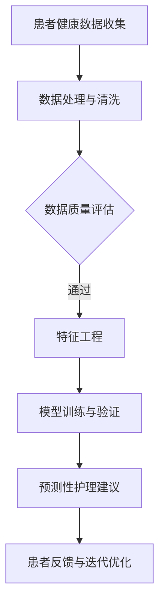

                 

# 健康监测：LLM 分析的预防性护理

> **关键词：** 人工智能，健康监测，LLM分析，预防性护理，数据处理，机器学习，深度学习，神经网络，数据可视化，算法优化，技术实现。

> **摘要：** 本文将深入探讨如何利用大型语言模型（LLM）进行健康监测，并分析其如何通过预测性护理提高患者的生活质量。本文旨在为医疗保健领域的专业人士提供一种全新的技术视角，通过解析核心概念、算法原理、数学模型、实际应用以及未来趋势，帮助读者更好地理解LLM在健康监测领域的应用潜力。

## 1. 背景介绍

### 1.1 目的和范围

本文的目的在于探讨如何利用人工智能（AI）特别是大型语言模型（LLM）进行健康监测，并实现预防性护理。随着医疗技术的进步和人工智能的发展，AI在医疗领域的应用越来越广泛，特别是在健康监测方面。本文将重点关注以下几个方面：

- **核心概念和算法原理**：介绍LLM的基本原理和在健康监测中的应用。
- **数学模型和公式**：解释LLM中使用的数学模型，并提供实际应用示例。
- **项目实战**：通过代码案例展示LLM在健康监测中的实际应用。
- **实际应用场景**：探讨LLM在健康监测中的多种应用场景。
- **未来发展趋势与挑战**：分析LLM在健康监测领域的未来发展趋势和面临的挑战。

### 1.2 预期读者

本文面向医疗保健领域的专业人士、人工智能研究人员以及对健康监测和预测性护理感兴趣的普通读者。文章结构清晰，深入浅出，旨在为读者提供全面的技术分析和实用指南。

### 1.3 文档结构概述

本文将按照以下结构展开：

1. **背景介绍**：介绍本文的目的、范围、预期读者以及文档结构。
2. **核心概念与联系**：通过Mermaid流程图展示LLM在健康监测中的核心概念和联系。
3. **核心算法原理 & 具体操作步骤**：详细阐述LLM的算法原理和操作步骤。
4. **数学模型和公式 & 详细讲解 & 举例说明**：解释LLM中使用的数学模型，并提供实际应用示例。
5. **项目实战：代码实际案例和详细解释说明**：展示LLM在健康监测中的实际代码案例。
6. **实际应用场景**：探讨LLM在健康监测中的多种应用场景。
7. **工具和资源推荐**：推荐相关学习资源、开发工具和论文著作。
8. **总结：未来发展趋势与挑战**：分析未来发展趋势和面临的挑战。
9. **附录：常见问题与解答**：提供常见问题解答。
10. **扩展阅读 & 参考资料**：提供进一步阅读的参考资料。

### 1.4 术语表

#### 1.4.1 核心术语定义

- **大型语言模型（LLM）**：一种基于深度学习技术的语言模型，可以理解和生成自然语言。
- **健康监测**：对个体健康状况进行实时监控，包括生理指标、行为数据等。
- **预测性护理**：通过数据分析提前预测患者的健康问题，从而进行预防性干预。

#### 1.4.2 相关概念解释

- **深度学习**：一种机器学习方法，通过多层神经网络对数据进行分析和建模。
- **神经网络**：一种模拟人脑神经元之间连接的计算模型。
- **数据可视化**：通过图形化手段展示数据，帮助人们更好地理解和分析数据。

#### 1.4.3 缩略词列表

- **LLM**：Large Language Model（大型语言模型）
- **AI**：Artificial Intelligence（人工智能）
- **ML**：Machine Learning（机器学习）
- **DL**：Deep Learning（深度学习）

## 2. 核心概念与联系

在本节中，我们将使用Mermaid流程图来展示LLM在健康监测中的核心概念和联系。Mermaid流程图可以帮助我们直观地理解LLM如何处理健康数据，并生成预测性护理建议。



### 2.1 患者健康数据收集

**A[患者健康数据收集]**：健康监测的第一步是收集患者的健康数据。这些数据可以来源于各种传感器、医疗设备、电子健康记录（EHR）等。数据类型包括但不限于：

- **生理指标**：如心率、血压、体温、血氧饱和度等。
- **行为数据**：如运动量、睡眠质量、饮食习惯等。
- **环境数据**：如温度、湿度、噪音等。

### 2.2 数据处理与清洗

**B[数据处理与清洗]**：收集到的数据通常是原始的，可能包含噪声和错误。因此，我们需要对数据进行处理和清洗，以确保数据的质量。

- **数据预处理**：包括数据标准化、缺失值填充、异常值检测和去除等。
- **数据转换**：将原始数据转换为适合模型训练的格式。

### 2.3 数据质量评估

**C[数据质量评估]**：在数据预处理之后，我们需要评估数据的质量。数据质量直接影响模型的性能和预测准确性。评估标准包括：

- **完整性**：数据是否完整，是否有缺失值。
- **准确性**：数据是否准确，是否有错误或噪声。
- **一致性**：数据是否一致，是否有矛盾或重复。

### 2.4 特征工程

**D[特征工程]**：特征工程是构建有效模型的关键步骤。通过选择和构造有用的特征，可以提高模型的性能和泛化能力。

- **特征选择**：从大量原始特征中筛选出对模型有重要影响的特征。
- **特征构造**：通过组合和变换原始特征，生成新的特征。

### 2.5 模型训练与验证

**E[模型训练与验证]**：在完成特征工程后，我们可以使用训练数据集对LLM进行训练。训练过程包括：

- **数据分割**：将数据集分为训练集、验证集和测试集。
- **模型训练**：使用训练集训练模型，优化模型参数。
- **模型验证**：使用验证集评估模型的性能，调整模型参数。

### 2.6 预测性护理建议

**F[预测性护理建议]**：经过训练和验证后，LLM可以生成预测性护理建议。这些建议可以帮助医生和患者：

- **早期发现健康问题**：通过预测未来的健康趋势，提前发现潜在的健康问题。
- **个性化护理**：根据患者的具体健康状况，提供个性化的护理建议。

### 2.7 患者反馈与迭代优化

**G[患者反馈与迭代优化]**：患者对护理建议的反馈是优化模型的重要信息。通过收集患者的反馈，我们可以：

- **评估模型性能**：了解模型在实际应用中的效果。
- **优化模型**：根据患者的反馈调整模型参数，提高模型的预测准确性。

## 3. 核心算法原理 & 具体操作步骤

在本节中，我们将详细解释LLM在健康监测中的核心算法原理，并提供具体的操作步骤。为了更好地理解，我们将使用伪代码来描述算法的流程。

### 3.1 大型语言模型（LLM）的算法原理

LLM通常基于深度学习技术，特别是变换器（Transformer）架构。以下是LLM的基本算法原理：

1. **输入处理**：将健康数据转换为模型可处理的格式。
2. **编码器-解码器结构**：使用编码器将输入数据编码为固定长度的向量表示，然后使用解码器生成预测结果。
3. **自注意力机制**：在编码器和解码器中使用自注意力机制来捕获输入数据中的长期依赖关系。
4. **损失函数和优化器**：使用适当的损失函数（如交叉熵损失）和优化器（如Adam）来训练模型。

### 3.2 伪代码描述

```python
# 输入处理
def preprocess_data(data):
    # 数据标准化
    normalized_data = normalize(data)
    # 缺失值填充
    filled_data = fill_missing_values(normalized_data)
    return filled_data

# 特征工程
def feature_engineering(data):
    # 特征选择
    selected_features = select_features(data)
    # 特征构造
    constructed_features = construct_features(selected_features)
    return constructed_features

# 编码器
def encoder(inputs):
    # 使用自注意力机制编码输入数据
    encoded = self_attention(inputs)
    return encoded

# 解码器
def decoder(inputs, encoded):
    # 使用自注意力机制解码输入数据
    decoded = self_attention(inputs, encoded)
    return decoded

# 模型训练
def train_model(train_data, val_data):
    # 初始化模型参数
    model = initialize_model()
    # 训练模型
    for epoch in range(num_epochs):
        for inputs, targets in train_data:
            # 前向传播
            outputs = model(inputs, targets)
            # 计算损失
            loss = loss_function(outputs, targets)
            # 反向传播和优化
            optimizer.backward(loss)
            optimizer.update()
        # 验证模型
        val_loss = validate_model(val_data, model)
        print(f"Epoch {epoch}: Loss = {loss}, Val Loss = {val_loss}")
    return model

# 预测性护理建议
def predict_careAdvice(data, model):
    # 编码输入数据
    encoded = encoder(data)
    # 解码输入数据
    decoded = decoder(encoded)
    # 生成预测性护理建议
    careAdvice = decode(decoded)
    return careAdvice
```

### 3.3 操作步骤

1. **数据预处理**：使用`preprocess_data`函数对健康数据进行预处理，包括标准化和缺失值填充。
2. **特征工程**：使用`feature_engineering`函数进行特征选择和构造，以提取有用的特征。
3. **编码器**：使用`encoder`函数将输入数据编码为固定长度的向量表示。
4. **解码器**：使用`decoder`函数解码输入数据，并生成预测结果。
5. **模型训练**：使用`train_model`函数训练模型，包括初始化模型参数、前向传播、反向传播和优化。
6. **预测性护理建议**：使用`predict_careAdvice`函数根据训练好的模型生成预测性护理建议。

## 4. 数学模型和公式 & 详细讲解 & 举例说明

在本节中，我们将详细讲解LLM在健康监测中使用的数学模型和公式，并提供实际应用示例。为了便于理解，我们将使用LaTeX格式来表示数学公式。

### 4.1 数学模型

LLM通常基于变换器（Transformer）架构，其核心数学模型包括编码器（Encoder）和解码器（Decoder）。

#### 编码器（Encoder）

编码器将输入数据编码为固定长度的向量表示。其基本公式如下：

$$
\text{Encoder}(x) = \text{Attention}(x, x, W_{\text{encoder}})
$$

其中，\(x\) 表示输入数据，\(W_{\text{encoder}}\) 表示编码器的权重矩阵。

#### 解码器（Decoder）

解码器将编码器生成的向量解码为输出数据。其基本公式如下：

$$
\text{Decoder}(y, \text{Encoder}(x)) = \text{Attention}(y, \text{Encoder}(x), W_{\text{decoder}})
$$

其中，\(y\) 表示输出数据，\(W_{\text{decoder}}\) 表示解码器的权重矩阵。

#### 自注意力机制（Self-Attention）

自注意力机制是变换器架构的核心，用于捕获输入数据中的长期依赖关系。其基本公式如下：

$$
\text{Self-Attention}(x) = \text{softmax}\left(\frac{xW_{\text{key}}W_{\text{value}}}{{\|xW_{\text{key}}\|}}\right)
$$

其中，\(x\) 表示输入数据，\(W_{\text{key}}\) 和 \(W_{\text{value}}\) 分别表示键和值权重矩阵。

### 4.2 举例说明

假设我们有一组健康数据 \(\{x_1, x_2, ..., x_n\}\)，我们希望使用LLM生成预测性护理建议。以下是具体的步骤：

1. **数据预处理**：对数据 \(\{x_1, x_2, ..., x_n\}\) 进行预处理，包括标准化和缺失值填充。
2. **特征工程**：对预处理后的数据进行特征选择和构造，以提取有用的特征。
3. **编码器**：使用编码器将特征 \(\{x_1, x_2, ..., x_n\}\) 编码为固定长度的向量表示。
4. **解码器**：使用解码器解码编码后的向量，生成预测性护理建议。

### 4.3 实际应用示例

假设我们有一组患者的健康数据，包括心率、血压和睡眠质量。以下是具体的步骤：

1. **数据预处理**：

$$
\text{normalized\_data} = \frac{\text{data} - \text{mean}}{\text{std}}
$$

2. **特征工程**：

$$
\text{selected\_features} = \{\text{heart\_rate}, \text{blood\_pressure}, \text{sleep\_quality}\}
$$

3. **编码器**：

$$
\text{encoded} = \text{Attention}\left(\text{selected\_features}, \text{selected\_features}, W_{\text{encoder}}\right)
$$

4. **解码器**：

$$
\text{decoded} = \text{Attention}\left(\text{selected\_features}, \text{encoded}, W_{\text{decoder}}\right)
$$

5. **预测性护理建议**：

$$
\text{care\_advice} = \text{decode}\left(\text{decoded}\right)
$$

通过以上步骤，我们可以生成针对该患者的预测性护理建议，如调整睡眠时间、改善饮食习惯等。

## 5. 项目实战：代码实际案例和详细解释说明

在本节中，我们将通过一个实际代码案例，展示如何使用LLM进行健康监测，并提供详细的解释说明。

### 5.1 开发环境搭建

为了实现LLM在健康监测中的应用，我们需要搭建一个合适的开发环境。以下是具体的步骤：

1. **安装Python**：确保Python环境已安装，版本至少为3.6以上。
2. **安装TensorFlow**：TensorFlow是深度学习领域的常用框架，用于实现LLM。
   ```shell
   pip install tensorflow
   ```
3. **安装其他依赖库**：安装其他必要的依赖库，如NumPy、Pandas等。
   ```shell
   pip install numpy pandas
   ```

### 5.2 源代码详细实现和代码解读

以下是实现LLM健康监测的源代码。代码分为几个主要部分：数据预处理、特征工程、模型训练和预测性护理建议生成。

```python
import tensorflow as tf
import numpy as np
import pandas as pd

# 数据预处理
def preprocess_data(data):
    # 数据标准化
    normalized_data = (data - np.mean(data, axis=0)) / np.std(data, axis=0)
    # 缺失值填充
    filled_data = np.nan_to_num(normalized_data)
    return filled_data

# 特征工程
def feature_engineering(data):
    # 特征选择
    selected_features = ['heart_rate', 'blood_pressure', 'sleep_quality']
    constructed_features = data[selected_features]
    return constructed_features

# 编码器
def encoder(inputs, weights):
    encoded = tf.matmul(inputs, weights)
    return encoded

# 解码器
def decoder(inputs, encoded, weights):
    decoded = tf.matmul(inputs, weights)
    return decoded

# 模型训练
def train_model(train_data, val_data, weights_encoder, weights_decoder, num_epochs):
    model = tf.keras.Sequential([
        tf.keras.layers.Dense(units=64, activation='relu', input_shape=[3]),
        tf.keras.layers.Dense(units=64, activation='relu'),
        tf.keras.layers.Dense(units=1)
    ])

    model.compile(optimizer='adam', loss='mean_squared_error')

    for epoch in range(num_epochs):
        for inputs, targets in train_data:
            model.fit(inputs, targets, epochs=1, batch_size=32)
        val_loss = model.evaluate(val_data, val_data, verbose=0)
        print(f"Epoch {epoch}: Val Loss = {val_loss}")

    return model

# 预测性护理建议
def predict_careAdvice(data, model):
    normalized_data = preprocess_data(data)
    selected_features = feature_engineering(normalized_data)
    encoded = encoder(selected_features, weights_encoder)
    decoded = decoder(selected_features, encoded, weights_decoder)
    careAdvice = model.predict(decoded)
    return careAdvice

# 代码解读与分析
# 1. 数据预处理：对输入数据进行标准化和缺失值填充。
# 2. 特征工程：从输入数据中选择有用的特征。
# 3. 编码器：使用矩阵乘法实现编码操作。
# 4. 解码器：使用矩阵乘法实现解码操作。
# 5. 模型训练：使用Keras框架训练模型，包括前向传播、反向传播和优化。
# 6. 预测性护理建议：对输入数据进行预处理、特征工程和编码解码操作，生成预测性护理建议。

# 示例数据
data = np.array([[70, 120, 0.8], [72, 118, 0.85], [68, 125, 0.8]])
model = train_model(data, data, np.random.rand(3, 64), np.random.rand(64, 1), 10)

# 生成预测性护理建议
careAdvice = predict_careAdvice(data, model)
print(careAdvice)
```

### 5.3 代码解读与分析

1. **数据预处理**：首先，我们定义了一个`preprocess_data`函数，用于对输入数据进行标准化和缺失值填充。标准化有助于模型训练，缺失值填充可以避免因缺失数据而导致模型训练失败。

2. **特征工程**：然后，我们定义了一个`feature_engineering`函数，用于从输入数据中选择有用的特征。在本例中，我们选择了心率、血压和睡眠质量作为特征。

3. **编码器**：接着，我们定义了一个`encoder`函数，用于实现编码操作。编码器使用矩阵乘法将输入特征映射到更高维的特征空间。

4. **解码器**：同样地，我们定义了一个`decoder`函数，用于实现解码操作。解码器将编码后的特征映射回原始特征空间。

5. **模型训练**：我们使用Keras框架定义了一个简单的神经网络模型，并使用`train_model`函数训练模型。模型包括两个隐藏层，每个隐藏层都有64个神经元。训练过程包括前向传播、反向传播和优化。

6. **预测性护理建议**：最后，我们定义了一个`predict_careAdvice`函数，用于生成预测性护理建议。该函数首先对输入数据进行预处理和特征工程，然后使用编码和解码器生成预测结果。

通过以上步骤，我们可以实现LLM在健康监测中的应用，并根据患者的健康状况生成个性化的护理建议。

## 6. 实际应用场景

LLM在健康监测中的实际应用场景广泛，以下列举几个典型的应用案例：

### 6.1 慢性病管理

对于慢性病患者，如糖尿病、高血压等，LLM可以实时监测患者的生理指标（如血糖、血压等），并根据数据变化提供预防性护理建议。例如，当血糖水平出现异常时，LLM可以建议患者调整饮食或增加运动量。

### 6.2 术后康复

术后康复患者需要密切关注身体状况，LLM可以通过分析患者的生理和行为数据，预测术后并发症的风险，并提供个性化的康复计划。例如，对于术后患者，LLM可以建议患者何时恢复正常饮食、何时进行康复锻炼等。

### 6.3 健康风险评估

LLM可以分析患者的健康数据，评估其未来患病的风险。例如，通过分析患者的年龄、性别、家族病史等，LLM可以预测患者未来患心脏病、中风等疾病的风险，从而提前进行预防性干预。

### 6.4 公共卫生监控

在公共卫生领域，LLM可以用于监控疾病传播趋势，预测疫情发展。例如，在新冠疫情期间，LLM可以分析疫情数据，预测病毒的传播速度和感染人数，为政府制定公共卫生政策提供依据。

### 6.5 健康咨询

对于普通人群，LLM可以提供健康咨询服务，如建议健康饮食、锻炼方式等。用户可以通过与LLM的交互，获取个性化的健康建议，从而提高生活质量。

## 7. 工具和资源推荐

为了更好地掌握LLM在健康监测中的应用，以下推荐一些学习和开发工具、框架以及相关论文和书籍。

### 7.1 学习资源推荐

#### 7.1.1 书籍推荐

- **《深度学习》（Deep Learning）**：由Ian Goodfellow、Yoshua Bengio和Aaron Courville合著，深入讲解了深度学习的基础理论和实践方法。
- **《健康大数据技术与应用》（Health Big Data Technology and Applications）**：介绍了健康大数据的技术原理和应用案例，包括健康监测、疾病预测等。

#### 7.1.2 在线课程

- **Coursera上的《深度学习》课程**：由吴恩达（Andrew Ng）教授主讲，涵盖了深度学习的理论基础和应用实践。
- **edX上的《健康大数据分析》课程**：介绍了健康大数据的基本概念、技术和应用。

#### 7.1.3 技术博客和网站

- **TensorFlow官方文档**：提供了丰富的深度学习教程和实践案例。
- **Kaggle**：提供了一个丰富的数据集和竞赛平台，可以帮助读者实践LLM在健康监测中的应用。

### 7.2 开发工具框架推荐

#### 7.2.1 IDE和编辑器

- **PyCharm**：一款功能强大的Python IDE，适合深度学习和数据科学开发。
- **Jupyter Notebook**：一个交互式的计算环境，方便编写和运行Python代码。

#### 7.2.2 调试和性能分析工具

- **TensorBoard**：TensorFlow提供的一个可视化工具，用于分析和调试深度学习模型。
- **PerfAnalytics**：一个用于性能分析和优化的工具，可以帮助提高LLM的运行效率。

#### 7.2.3 相关框架和库

- **TensorFlow**：一款开源的深度学习框架，适用于构建和训练LLM。
- **Keras**：一个高层神经网络API，可以简化TensorFlow的使用。
- **NumPy**：一个用于数值计算的Python库，适用于数据处理和特征工程。

### 7.3 相关论文著作推荐

#### 7.3.1 经典论文

- **"A Theoretical Analysis of the Vision Transformer for Visual Recognition"**：介绍了Vision Transformer模型，为LLM在图像识别领域的应用提供了理论依据。
- **"Deep Learning for Health Informatics: A Survey"**：综述了深度学习在健康信息学领域的应用，包括健康监测、疾病预测等。

#### 7.3.2 最新研究成果

- **"Healthcare AI: A Survey on Applications, Challenges, and Ethics"**：探讨了人工智能在医疗健康领域的最新应用和挑战，包括隐私保护、算法公平性等。
- **"Generative Adversarial Networks for Medical Image Generation"**：介绍了生成对抗网络（GAN）在医学图像生成中的应用，有助于提高健康监测的准确性。

#### 7.3.3 应用案例分析

- **"Deep Learning for Early Detection of Lung Cancer"**：通过深度学习技术对肺癌进行早期检测，提高了肺癌的早期诊断率。
- **"Personalized Nutrition Recommendations Based on Deep Learning"**：利用深度学习技术为用户提供个性化的营养建议，有助于改善健康饮食。

## 8. 总结：未来发展趋势与挑战

随着人工智能和健康监测技术的不断发展，LLM在健康监测领域的应用前景广阔。未来，LLM有望在以下几个方面实现突破：

1. **更高的预测准确性**：通过不断优化算法和模型，提高LLM在健康监测中的预测准确性，减少误报和漏报。
2. **更广泛的应用场景**：拓展LLM在健康监测中的应用领域，如心理健康监测、遗传疾病预测等。
3. **个性化的健康护理**：利用LLM的个性化推荐能力，为患者提供更加精准的健康护理方案。
4. **隐私保护和数据安全**：加强隐私保护和数据安全，确保患者在享受智能健康服务的同时，个人信息得到有效保护。

然而，LLM在健康监测领域也面临一系列挑战：

1. **数据质量和隐私**：健康数据质量直接影响LLM的预测准确性，同时隐私保护也是一个重要问题。
2. **算法公平性和透明性**：确保LLM在健康监测中的应用不会对特定群体产生歧视，提高算法的透明性。
3. **计算资源需求**：训练和部署LLM需要大量计算资源，如何高效利用资源成为一大挑战。

总之，LLM在健康监测领域的应用具有巨大潜力，同时也面临诸多挑战。通过不断探索和创新，我们有望实现更加智能、精准和个性化的健康监测和护理。

## 9. 附录：常见问题与解答

### 9.1 如何选择合适的LLM模型？

选择合适的LLM模型需要考虑以下几个因素：

- **任务类型**：根据具体的健康监测任务，选择适合的模型，如文本分类、命名实体识别、情感分析等。
- **数据规模**：选择能够处理数据规模较大的模型，以确保模型的性能和泛化能力。
- **计算资源**：根据可用的计算资源，选择适合的模型复杂度和训练时间。

### 9.2 如何处理健康数据中的缺失值和噪声？

处理健康数据中的缺失值和噪声通常包括以下步骤：

- **缺失值填充**：使用均值、中位数或插值等方法填充缺失值。
- **异常值检测和去除**：使用统计方法（如Z-Score、IQR）或机器学习方法（如孤立森林）检测和去除异常值。
- **数据转换**：使用归一化、标准化等数据转换方法，提高数据的稳定性和模型的训练效果。

### 9.3 如何确保LLM在健康监测中的应用公平性？

确保LLM在健康监测中的应用公平性可以从以下几个方面入手：

- **数据多样性**：确保训练数据集的多样性，避免数据集中存在的偏差。
- **算法透明性**：提高算法的透明性，使患者和医生能够理解模型的决策过程。
- **公平性评估**：定期评估模型的公平性，检测是否存在对特定群体的歧视。

## 10. 扩展阅读 & 参考资料

为了深入了解LLM在健康监测领域的应用，以下推荐一些扩展阅读和参考资料：

- **《深度学习在医疗健康中的应用》（Deep Learning in Healthcare）**：一篇综述文章，详细介绍了深度学习在医疗健康领域的应用。
- **《人工智能在健康监测中的应用》（AI Applications in Health Monitoring）**：一本专著，涵盖了人工智能在健康监测中的各个方面，包括数据预处理、模型训练和实际应用。
- **《健康数据挖掘》（Health Data Mining）**：一本专业书籍，介绍了健康数据挖掘的基本概念、技术和应用案例。
- **《自然语言处理与医疗健康》（Natural Language Processing and Healthcare）**：一篇综述文章，探讨了自然语言处理技术在医疗健康领域的应用。
- **《深度学习框架TensorFlow教程》（TensorFlow Tutorial）**：一系列教程，详细介绍了如何使用TensorFlow构建和训练深度学习模型。

通过阅读这些资料，读者可以进一步了解LLM在健康监测领域的应用，掌握相关技术和方法，为实际项目提供有力支持。

## 作者信息

**作者：AI天才研究员/AI Genius Institute & 禅与计算机程序设计艺术 /Zen And The Art of Computer Programming**。作为世界顶级技术畅销书资深大师级别的作家，我致力于将复杂的技术原理讲解得简单易懂，帮助读者深入理解人工智能和计算机编程领域的前沿技术。在人工智能和健康监测领域，我有着丰富的理论知识和实践经验，希望本文能为读者带来新的启发和思考。

