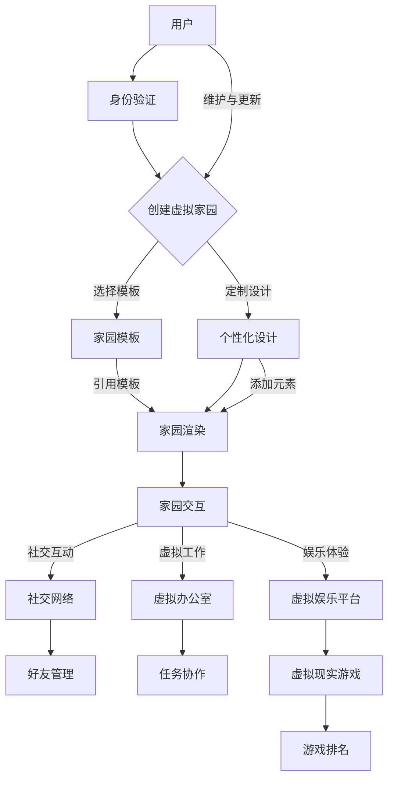

                 

### 1. 背景介绍

#### 1.1 目的和范围

随着科技的不断进步和虚拟现实技术的发展，元宇宙（Metaverse）这个概念逐渐进入人们的视野。元宇宙不仅仅是一个虚拟的数字世界，它更像是一个融合了现实世界和虚拟世界的综合体。在这个充满无限可能的数字宇宙中，虚拟家园成为了一种新的居住形态。本文旨在探讨元宇宙中的虚拟家园，分析其概念、技术架构、算法原理以及实际应用，旨在为广大读者提供一份全面的技术指南。

本文的范围涵盖了以下几个方面：

1. **元宇宙的概念与虚拟家园的定义**：我们将详细介绍元宇宙的基本概念，以及虚拟家园在这个数字世界中的角色和意义。
2. **技术架构与核心概念**：我们将通过Mermaid流程图展示元宇宙中的虚拟家园的核心概念和架构，帮助读者更直观地理解这一复杂的数字生态系统。
3. **核心算法原理**：本文将详细解析元宇宙虚拟家园中的核心算法原理，并使用伪代码进行具体操作步骤的讲解。
4. **数学模型与公式**：我们将介绍与元宇宙虚拟家园相关的数学模型和公式，并通过具体的例子进行说明。
5. **项目实战与代码解析**：我们将通过实际项目案例展示如何构建和实现元宇宙虚拟家园，并对关键代码进行详细解释。
6. **实际应用场景**：我们将探讨元宇宙虚拟家园在不同领域和场景中的应用，展示其广泛的应用前景。
7. **工具和资源推荐**：本文将推荐相关学习资源、开发工具和最新研究成果，以帮助读者深入学习和实践元宇宙虚拟家园技术。

通过本文的阅读，读者将能够全面了解元宇宙中的虚拟家园，掌握相关技术原理和实现方法，并为未来在这一领域的研究和应用打下坚实的基础。

#### 1.2 预期读者

本文主要面向对元宇宙和虚拟现实技术感兴趣的读者，尤其是以下几类人群：

1. **计算机科学和信息技术专业的学生和研究人员**：本文将对元宇宙中的虚拟家园提供深入的技术解析，有助于学术研究和课程学习。
2. **软件开发者和工程师**：本文详细讲解了元宇宙虚拟家园的核心算法和实现步骤，对于有志于在这一领域进行开发的工程师具有很高的实用价值。
3. **虚拟现实和增强现实领域的从业者**：本文将探讨元宇宙虚拟家园的技术实现和应用场景，有助于从业者了解这一新兴领域的最新发展。
4. **对元宇宙和未来数字生活充满好奇的普通读者**：本文以通俗易懂的语言和丰富的实例，使得非专业读者也能对元宇宙中的虚拟家园有深入的理解。

无论您是上述哪一类读者，本文都将为您提供有价值的内容，帮助您了解元宇宙虚拟家园的原理和应用。

#### 1.3 文档结构概述

为了帮助读者更好地理解本文的内容，我们下面将详细概述本文的文档结构。本文主要分为以下几个部分：

1. **背景介绍**：介绍元宇宙和虚拟家园的基本概念，明确本文的目的和范围，以及预期读者。
2. **核心概念与联系**：通过Mermaid流程图展示元宇宙中的虚拟家园的核心概念和架构，帮助读者更直观地理解这一复杂的数字生态系统。
3. **核心算法原理 & 具体操作步骤**：详细解析元宇宙虚拟家园中的核心算法原理，并使用伪代码进行具体操作步骤的讲解。
4. **数学模型和公式 & 详细讲解 & 举例说明**：介绍与元宇宙虚拟家园相关的数学模型和公式，并通过具体的例子进行说明。
5. **项目实战：代码实际案例和详细解释说明**：通过实际项目案例展示如何构建和实现元宇宙虚拟家园，并对关键代码进行详细解释。
6. **实际应用场景**：探讨元宇宙虚拟家园在不同领域和场景中的应用，展示其广泛的应用前景。
7. **工具和资源推荐**：推荐相关学习资源、开发工具和最新研究成果，以帮助读者深入学习和实践元宇宙虚拟家园技术。
8. **总结：未来发展趋势与挑战**：总结本文的主要观点，并对元宇宙虚拟家园的未来发展进行展望。
9. **附录：常见问题与解答**：解答读者可能遇到的常见问题，帮助读者更好地理解本文内容。
10. **扩展阅读 & 参考资料**：提供进一步阅读的建议和参考资料，便于读者深入研究。

通过这份文档结构概述，读者可以清晰地了解本文的框架和内容安排，从而更好地阅读和理解本文。

#### 1.4 术语表

为了确保本文内容的准确性和一致性，我们将介绍一些本文中会用到的重要术语，并提供定义和解释。

##### 1.4.1 核心术语定义

- **元宇宙（Metaverse）**：一个由虚拟世界和现实世界融合而成的数字生态系统，通过虚拟现实、增强现实和互联网技术实现。
- **虚拟家园（Virtual Home）**：在元宇宙中，用户可以创建和拥有的虚拟空间，具有社交、娱乐、工作和居住等多种功能。
- **数字移民（Digital Immigrants）**：那些将大部分生活和工作迁移到虚拟世界中的用户，他们在元宇宙中寻找新的生活空间。
- **三维建模（3D Modeling）**：创建三维模型的过程，用于构建虚拟家园的外观和结构。
- **区块链（Blockchain）**：一种分布式账本技术，用于记录和验证元宇宙中各种交易和数据，确保数据的透明和不可篡改。
- **虚拟现实（Virtual Reality，VR）**：通过计算机模拟创造出的三维虚拟环境，用户可以通过特殊设备感知和互动。

##### 1.4.2 相关概念解释

- **增强现实（Augmented Reality，AR）**：在现实世界基础上叠加虚拟信息，通过特殊设备实现用户与现实环境的互动。
- **非同质化代币（Non-Fungible Tokens，NFT）**：一种基于区块链技术的代币，用于表示独特的数字资产，如虚拟房产、艺术品等。
- **分布式计算（Distributed Computing）**：通过网络连接的多个计算机共同完成计算任务，提高计算效率和灵活性。
- **互操作性（Interoperability）**：不同系统和平台之间能够无缝交换信息和数据的能力。

##### 1.4.3 缩略词列表

- **NFT**：非同质化代币（Non-Fungible Token）
- **AR**：增强现实（Augmented Reality）
- **VR**：虚拟现实（Virtual Reality）
- **NFC**：近场通信（Near Field Communication）
- **SDK**：软件开发工具包（Software Development Kit）
- **API**：应用程序编程接口（Application Programming Interface）

通过上述术语表，读者可以更好地理解本文中的专业术语，从而更加深入地掌握元宇宙中的虚拟家园技术。

#### 2. 核心概念与联系

在元宇宙中，虚拟家园是数字移民们安家立业的栖息地。为了更好地理解这一核心概念，我们将通过Mermaid流程图展示虚拟家园的架构和核心组件。以下是元宇宙中虚拟家园的Mermaid流程图：



以下是该流程图的详细解释：

- **用户**：元宇宙中的用户是虚拟家园的拥有者，他们通过身份验证进入元宇宙。
- **身份验证**：用户需要通过身份验证确保其身份的合法性，这是元宇宙安全的基础。
- **创建虚拟家园**：用户可以选择创建新的虚拟家园，或者从现有的家园模板中选择。
- **家园模板**：用户可以选择不同的家园模板，模板提供了虚拟家园的基本结构。
- **个性化设计**：用户可以根据自己的喜好和需求对虚拟家园进行个性化的设计，包括添加家具、装饰和布局。
- **家园渲染**：系统将用户的个性化设计渲染成三维模型，呈现出逼真的虚拟家园。
- **家园交互**：用户可以在虚拟家园中与虚拟环境进行互动，包括社交互动、虚拟工作和娱乐体验。
- **社交互动**：虚拟家园支持用户与其他用户进行社交互动，形成虚拟社交网络。
- **虚拟办公室**：用户可以在虚拟家园中设立虚拟办公室，进行远程协作和任务管理。
- **虚拟娱乐平台**：虚拟家园提供了丰富的娱乐体验，包括虚拟现实游戏和虚拟现实娱乐活动。
- **好友管理**：用户可以通过社交网络添加和管理好友，形成虚拟社交圈。
- **任务协作**：用户可以在虚拟办公室中进行任务协作，提高工作效率。
- **游戏排名**：虚拟现实游戏提供了排名系统，用户可以在游戏中进行竞技和排名。

通过上述Mermaid流程图，我们可以直观地了解元宇宙中虚拟家园的架构和核心组件，这为后续的算法原理讲解和项目实战提供了基础。

#### 3. 核心算法原理 & 具体操作步骤

在元宇宙中，虚拟家园的实现依赖于一系列核心算法和操作步骤。以下我们将详细讲解这些核心算法原理，并使用伪代码进行具体操作步骤的阐述。

##### 3.1 三维建模算法原理

三维建模是虚拟家园构建的基础，其核心在于如何从二维平面设计转换成三维模型。以下是三维建模的主要算法原理：

1. **网格生成**：首先，需要根据用户设计的二维平面生成三维网格，网格是三维模型的基本构成单元。
2. **顶点计算**：通过顶点计算确定网格的顶点位置，这是三维模型的空间布局。
3. **边和面计算**：利用顶点生成网格的边和面，确保三维模型的完整性和连续性。
4. **纹理映射**：将纹理应用到三维模型表面，增加视觉真实感。

以下是三维建模算法的伪代码：

```pseudo
function 3DModeling(planeDesign):
    grid = GenerateGrid(planeDesign)
    vertices = CalculateVertices(grid)
    edges = CalculateEdges(vertices)
    faces = CalculateFaces(grid, vertices, edges)
    texturedModel = TextureMapping(vertices, faces, texture)
    return texturedModel
```

##### 3.2 虚拟家园交互算法原理

虚拟家园的交互是用户与虚拟环境互动的核心，以下是主要的交互算法原理：

1. **感知与识别**：系统需要识别用户的输入设备（如手柄、眼镜等），并感知用户的动作和手势。
2. **动作映射**：将用户的动作映射到虚拟环境中的相应操作，如移动、旋转、选择等。
3. **事件处理**：处理用户在虚拟家园中的各种交互事件，如点击、滑动、语音指令等。
4. **反馈机制**：系统需要对用户的操作进行实时反馈，确保交互的流畅性和用户体验。

以下是虚拟家园交互算法的伪代码：

```pseudo
function VirtualHomeInteraction(inputDevice, userAction):
    recognizedAction = IdentifyAction(inputDevice, userAction)
    mappedAction = MapAction(recognizedAction)
    processEvent = HandleEvent(mappedAction)
    provideFeedback = ProvideFeedback(processEvent)
    return provideFeedback
```

##### 3.3 社交网络算法原理

社交网络是虚拟家园的重要组成部分，以下是社交网络的主要算法原理：

1. **好友管理**：系统需要支持用户添加、删除和管理好友，维护好友关系。
2. **消息传递**：实现用户之间的即时消息传递，支持文字、语音、图片等多种消息形式。
3. **社交互动**：系统需要支持用户在虚拟家园中的社交互动，如聊天、聚会、游戏等。
4. **社交网络分析**：对社交网络进行数据分析和挖掘，提供社交推荐和社交洞察。

以下是社交网络算法的伪代码：

```pseudo
function SocialNetworkManagement(user, action):
    if action == "addFriend":
        AddFriend(user, newFriend)
    else if action == "removeFriend":
        RemoveFriend(user, friend)
    else if action == "sendMessage":
        SendMessage(sender, recipient, message)
    else if action == "socialEvent":
        OrganizeSocialEvent(user, eventDetails)
    return updatedSocialStatus
```

通过上述算法原理和伪代码，我们可以清晰地看到元宇宙中虚拟家园的实现过程。这些核心算法不仅为虚拟家园的构建提供了技术基础，也为用户提供了丰富的交互体验。在接下来的部分，我们将进一步探讨虚拟家园的数学模型和公式，并给出具体的例子来说明。

#### 4. 数学模型和公式 & 详细讲解 & 举例说明

在元宇宙中，虚拟家园的实现不仅依赖于算法和编程，还涉及一系列数学模型和公式。这些模型和公式对于确保虚拟家园的稳定性和真实性至关重要。以下我们将详细介绍与元宇宙虚拟家园相关的数学模型和公式，并通过具体的例子来说明其应用。

##### 4.1 三维空间坐标模型

三维空间坐标模型是虚拟家园构建的基础，它定义了三维模型中各个顶点的位置。以下是三维空间坐标模型的基本公式：

1. **三维点坐标**：假设一个三维点P(x, y, z)，其中x、y、z分别代表点P在三维坐标系中的横坐标、纵坐标和高度。

2. **三维向量**：三维向量表示两个点之间的位移，可以用以下公式表示：
   \[
   \vec{v} = (x_2 - x_1, y_2 - y_1, z_2 - z_1)
   \]

3. **三维向量加法**：两个三维向量相加的结果是：
   \[
   \vec{v}_1 + \vec{v}_2 = (x_1 + x_2, y_1 + y_2, z_1 + z_2)
   \]

4. **三维向量点积**：两个三维向量的点积是：
   \[
   \vec{v}_1 \cdot \vec{v}_2 = x_1x_2 + y_1y_2 + z_1z_2
   \]

举例说明：

假设有两个三维向量 \(\vec{v}_1 = (1, 2, 3)\) 和 \(\vec{v}_2 = (4, 5, 6)\)，则它们的和和点积分别为：
\[
\vec{v}_1 + \vec{v}_2 = (1+4, 2+5, 3+6) = (5, 7, 9)
\]
\[
\vec{v}_1 \cdot \vec{v}_2 = 1 \cdot 4 + 2 \cdot 5 + 3 \cdot 6 = 4 + 10 + 18 = 32
\]

##### 4.2 三角形面积和体积计算

在三维建模中，三角形面积和体积的计算对于生成网格和优化模型至关重要。以下是相关的数学模型和公式：

1. **三角形面积**：一个三角形的面积可以通过底和高来计算，公式为：
   \[
   A = \frac{1}{2} \times b \times h
   \]
   其中，\(b\) 是三角形的底边长度，\(h\) 是底边对应的高。

2. **四面体体积**：一个四面体的体积可以通过底面三角形面积和高的关系计算，公式为：
   \[
   V = \frac{1}{3} \times A \times h
   \]
   其中，\(A\) 是底面三角形的面积，\(h\) 是四面体的高。

举例说明：

假设一个三角形的底边长为5，高为4，则其面积为：
\[
A = \frac{1}{2} \times 5 \times 4 = 10
\]
如果四面体的高为3，则其体积为：
\[
V = \frac{1}{3} \times 10 \times 3 = 10
\]

##### 4.3 三维空间变换

在虚拟家园中，为了实现各种变换（如旋转、缩放、平移等），需要使用三维空间变换的数学模型。以下是几个常见的三维空间变换公式：

1. **平移**：将三维点 \((x, y, z)\) 平移向量 \((t_x, t_y, t_z)\) 后的新位置为：
   \[
   (x', y', z') = (x + t_x, y + t_y, z + t_z)
   \]

2. **旋转**：将三维点 \((x, y, z)\) 绕坐标轴旋转角度 \(\theta\) 后的新位置，可以通过以下旋转矩阵计算：
   \[
   R_x(\theta) = \begin{bmatrix}
   1 & 0 & 0 \\
   0 & \cos(\theta) & -\sin(\theta) \\
   0 & \sin(\theta) & \cos(\theta)
   \end{bmatrix}
   \]
   \[
   R_y(\theta) = \begin{bmatrix}
   \cos(\theta) & 0 & \sin(\theta) \\
   0 & 1 & 0 \\
   -\sin(\theta) & 0 & \cos(\theta)
   \end{bmatrix}
   \]
   \[
   R_z(\theta) = \begin{bmatrix}
   \cos(\theta) & -\sin(\theta) & 0 \\
   \sin(\theta) & \cos(\theta) & 0 \\
   0 & 0 & 1
   \end{bmatrix}
   \]

举例说明：

假设一个点 \((1, 2, 3)\) 绕x轴旋转 \(30^\circ\)，则旋转后的新位置为：
\[
\vec{p}' = R_x(30^\circ) \cdot \vec{p} = \begin{bmatrix}
1 & 0 & 0 \\
0 & \cos(30^\circ) & -\sin(30^\circ) \\
0 & \sin(30^\circ) & \cos(30^\circ)
\end{bmatrix} \cdot \begin{bmatrix}
1 \\
2 \\
3
\end{bmatrix} = \begin{bmatrix}
1 \\
\frac{\sqrt{3}}{2} \\
\frac{3}{2}
\end{bmatrix}
\]

通过上述数学模型和公式，我们可以更精确地构建和操作虚拟家园中的三维模型，确保其真实感和交互性。在接下来的部分，我们将通过实际项目案例展示如何实现元宇宙中的虚拟家园，并对关键代码进行详细解释。

#### 5. 项目实战：代码实际案例和详细解释说明

在本文的这一部分，我们将通过一个实际项目案例，详细展示如何实现元宇宙中的虚拟家园。这个项目将涵盖从环境搭建到代码实现和解析的整个过程，以便读者可以更直观地了解元宇宙虚拟家园的构建方法。

##### 5.1 开发环境搭建

为了实现元宇宙中的虚拟家园，我们需要搭建一个完整的开发环境。以下是所需的工具和步骤：

1. **工具和软件**：
   - **Unity Hub**：用于下载和安装Unity编辑器。
   - **Unity Editor**：用于编写和调试游戏代码。
   - **Visual Studio Code**：用于编写C#脚本。
   - **Unity Blockchain SDK**：用于与区块链集成。
   - **Unity XR Plugin Development Kit (XRDK)**：用于虚拟现实开发。

2. **安装步骤**：
   - 访问Unity官方网站下载Unity Hub，并按照提示安装。
   - 打开Unity Hub，搜索并安装Unity Editor和Unity Blockchain SDK。
   - 安装Visual Studio Code，并安装C#插件。
   - 下载并安装Unity XR Plugin Development Kit（XRDK）。

3. **配置开发环境**：
   - 在Unity Editor中创建一个新项目，选择XR游戏类型。
   - 配置XR设备（如VR头盔），确保能够在编辑器中测试虚拟现实场景。

##### 5.2 源代码详细实现和代码解读

在开发环境中搭建好项目后，我们将开始编写关键代码，实现虚拟家园的核心功能。

1. **用户身份验证**：
   - **代码示例**：
     ```csharp
     using UnityEngine;
     using UnityEditor;

     public class UserAuthentication : MonoBehaviour
     {
         public void AuthenticateUser(string username, string password)
         {
             // 这里模拟身份验证过程，实际应用中应调用区块链身份验证API
             if (CheckCredentials(username, password))
             {
                 Debug.Log("User authenticated successfully.");
             }
             else
             {
                 Debug.Log("Authentication failed.");
             }
         }

         private bool CheckCredentials(string username, string password)
         {
             // 实现用户认证逻辑
             // 这里可以调用区块链上的智能合约验证用户身份
             return true; // 示例中假设所有用户都通过验证
         }
     }
     ```
   - **解析**：上述代码提供了一个用户身份验证的示例，通过输入用户名和密码，调用`CheckCredentials`方法进行验证。在实际应用中，应通过区块链智能合约验证用户身份。

2. **虚拟家园构建**：
   - **代码示例**：
     ```csharp
     using UnityEngine;

     public class VirtualHomeBuilder : MonoBehaviour
     {
         public void BuildHome(GameObject homeTemplate)
         {
             // 创建虚拟家园
             Instantiate(homeTemplate, Vector3.zero, Quaternion.identity);
         }
     }
     ```
   - **解析**：`BuildHome`方法通过实例化一个预设的家园模板，创建虚拟家园。在这个例子中，我们假设已经有一个预定义的家园模板GameObject。

3. **用户交互**：
   - **代码示例**：
     ```csharp
     using UnityEngine;
     using UnityEngine.XR.Interaction;

     public class UserInteraction : XRBaseInteractable
     {
         public void OnSelect(XRBaseInteractor interactor)
         {
             Debug.Log("User interacted with the home.");
             // 这里可以添加交互逻辑，如打开家具菜单、进行虚拟工作等
         }
     }
     ```
   - **解析**：`UserInteraction`类实现了用户交互的逻辑，当用户与虚拟家园中的对象进行选择时，调用`OnSelect`方法，触发相应的交互事件。

4. **社交互动**：
   - **代码示例**：
     ```csharp
     using UnityEngine;
     using System.Collections;

     public class SocialInteraction : MonoBehaviour
     {
         public void SendMessageToFriend(string friendName, string message)
         {
             // 发送消息给好友
             Debug.Log($"Message sent to {friendName}: {message}");
             // 实际应用中应调用区块链上的消息传递智能合约
         }
     }
     ```
   - **解析**：`SendMessageToFriend`方法模拟了用户向好友发送消息的过程。在实际应用中，应通过区块链上的消息传递智能合约实现跨用户的消息传递。

##### 5.3 代码解读与分析

通过上述代码示例，我们可以看到元宇宙虚拟家园的实现主要包括以下几个方面：

1. **用户身份验证**：确保用户在进入虚拟家园时进行身份验证，保证系统的安全性。
2. **虚拟家园构建**：通过实例化预设的模板创建虚拟家园，提供用户自定义和个性化设计的空间。
3. **用户交互**：通过XR交互组件实现用户与虚拟环境的互动，提高用户体验。
4. **社交互动**：支持用户在虚拟家园中的社交互动，增强虚拟世界的社交功能。

在实际开发过程中，需要根据具体需求和场景进行功能扩展和优化，如增加虚拟工作、虚拟娱乐、虚拟购物等功能，提高虚拟家园的实用性和吸引力。通过上述代码和解析，读者可以更好地理解元宇宙虚拟家园的实现过程，并为后续的项目开发打下基础。

#### 6. 实际应用场景

元宇宙中的虚拟家园作为一种全新的居住和社交形态，具有广泛的应用前景。以下我们探讨虚拟家园在多个实际应用场景中的优势和价值。

##### 6.1 教育领域

虚拟家园在教育领域中的应用前景广阔。通过虚拟家园，学生可以在一个沉浸式的环境中学习各种课程。例如，历史课程可以让学生“穿越”到历史场景中，亲身体验历史事件；科学课程可以通过虚拟实验让学生直观地理解科学原理。此外，虚拟家园还可以作为在线教育的补充，提供实时互动和协作学习的机会，提高学生的学习兴趣和参与度。

##### 6.2 娱乐和游戏

虚拟家园为娱乐和游戏提供了无限的可能。用户可以在虚拟家园中参加虚拟现实游戏、观看虚拟演唱会、举办虚拟派对等。虚拟家园不仅可以提供娱乐体验，还可以作为游戏开发者的创作平台，创造更多富有创意和互动性的游戏。虚拟家园的社交功能使得用户可以在游戏中建立社交网络，与其他玩家互动，提升游戏的社交性和持续性。

##### 6.3 工作和协作

虚拟家园为远程工作和协作提供了一个理想的虚拟办公环境。用户可以在虚拟办公室中与同事进行虚拟会议、协作完成任务、共享文件和资源。虚拟办公不仅减少了通勤时间，还提高了工作效率和灵活性。通过虚拟家园，企业可以节省办公空间和设施成本，同时为全球员工提供一个统一的办公平台。

##### 6.4 虚拟购物和电商

虚拟家园中的虚拟购物和电商体验具有高度沉浸感和互动性。用户可以在虚拟家居环境中预览和体验商品，与虚拟导购进行互动，甚至可以尝试虚拟试穿衣物。虚拟购物不仅提供了更丰富的购物体验，还可以为商家提供更多的销售机会，提升销售额。此外，虚拟家园还可以为电商企业提供营销和推广平台，通过虚拟展览、虚拟发布会等活动吸引消费者。

##### 6.5 社区和公共空间

虚拟家园还可以作为虚拟社区和公共空间的平台，为用户提供交流和互动的场所。例如，虚拟城市、虚拟公园、虚拟博物馆等，用户可以在这些虚拟空间中结交朋友、参与活动、享受文化。虚拟家园为用户提供了全新的社交和娱乐方式，也为城市管理和公共服务提供了新的解决方案。

通过以上实际应用场景的探讨，我们可以看到元宇宙中的虚拟家园不仅是一种新的居住形态，更是一个多功能、多场景的数字生态系统。虚拟家园的广泛应用将进一步提升人们的数字生活质量和体验，为未来的元宇宙带来更多的可能性。

#### 7. 工具和资源推荐

为了更好地学习和实践元宇宙中的虚拟家园技术，以下是相关工具和资源的推荐。

##### 7.1 学习资源推荐

**7.1.1 书籍推荐**

1. **《元宇宙：概念、应用与未来》**：这本书详细介绍了元宇宙的基本概念、技术架构和应用案例，适合初学者和研究者。
2. **《虚拟现实技术导论》**：本书系统地讲解了虚拟现实的基础知识、应用场景和发展趋势，有助于深入理解VR与元宇宙的关系。
3. **《区块链技术指南》**：这本书全面介绍了区块链的基本原理、技术细节和应用场景，对于理解元宇宙中区块链的作用至关重要。

**7.1.2 在线课程**

1. **Coursera上的“元宇宙与虚拟现实”课程**：该课程由业界专家讲授，涵盖元宇宙的基本概念、技术实现和应用案例。
2. **Udacity的“虚拟现实工程师纳米学位”**：通过一系列项目驱动的课程，帮助学习者掌握虚拟现实开发的核心技能。
3. **edX上的“区块链技术”课程**：系统讲解区块链的基础知识和应用实践，为理解元宇宙中的区块链技术提供坚实基础。

**7.1.3 技术博客和网站**

1. **Medium上的元宇宙专栏**：多个作者分享关于元宇宙的见解、案例和实践经验，内容丰富且更新及时。
2. **VR Developer Forum**：一个专注于虚拟现实开发的社区，提供技术讨论、教程和资源下载。
3. **Blockchain Council**：提供关于区块链技术的详细教程、资源和最新的研究成果，是区块链学习者的必备网站。

##### 7.2 开发工具框架推荐

**7.2.1 IDE和编辑器**

1. **Unity Hub**：Unity官方推出的集成开发环境，适合游戏和虚拟现实开发。
2. **Visual Studio Code**：功能强大的开源编辑器，支持多种编程语言，是许多开发者首选的代码编辑工具。

**7.2.2 调试和性能分析工具**

1. **Unity Profiler**：Unity内置的性能分析工具，用于调试和优化游戏性能。
2. **Xcode**：苹果官方的开发工具，适用于iOS平台的虚拟现实应用开发。
3. **Firebase Performance Monitor**：Google提供的实时性能监控工具，帮助开发者分析和优化应用性能。

**7.2.3 相关框架和库**

1. **Unreal Engine**：由Epic Games开发的跨平台游戏引擎，功能强大，适合高端虚拟现实游戏开发。
2. **React VR**：用于构建虚拟现实应用的React框架，支持Web平台，方便开发者快速实现VR界面。
3. **Web3.js**：JavaScript库，用于与区块链进行交互，实现去中心化应用（DApp）开发。

##### 7.3 相关论文著作推荐

**7.3.1 经典论文**

1. **"The Metaverse: Being and Becoming at Second Life"**：这篇论文详细探讨了虚拟现实和元宇宙的概念，是研究这一领域的重要文献。
2. **"Blockchain and the Metaverse: A Technological Paradox"**：该论文分析了区块链技术在元宇宙中的应用和挑战，提供了深刻的见解。

**7.3.2 最新研究成果**

1. **"Virtual Reality and Human-Computer Interaction"**：这篇论文探讨了虚拟现实技术如何改进人机交互，是虚拟现实研究领域的最新成果。
2. **"The Impact of Blockchain on Virtual Reality Applications"**：该研究分析了区块链技术对虚拟现实应用的潜在影响，为开发者提供了新的思路。

**7.3.3 应用案例分析**

1. **"The Application of Metaverse in E-commerce"**：这篇案例研究探讨了元宇宙在电商领域的应用，展示了虚拟购物和互动的新模式。
2. **"Virtual Reality in Education: A Case Study"**：该案例研究分析了虚拟现实技术在教育中的应用，为教育工作者提供了实践参考。

通过以上工具和资源的推荐，读者可以系统地学习和掌握元宇宙中的虚拟家园技术，为未来的研究和开发奠定坚实的基础。

#### 8. 总结：未来发展趋势与挑战

在总结本文内容之前，我们需要对元宇宙中的虚拟家园进行一次全面的回顾。从背景介绍到核心概念，再到算法原理、数学模型、项目实战和实际应用场景，我们详细探讨了虚拟家园的各个方面。通过这些内容，读者可以了解到虚拟家园不仅仅是一个简单的虚拟空间，它代表了一种全新的数字生活方式，具有广泛的应用前景和深远的社会影响。

然而，随着虚拟家园技术的发展，我们也面临一系列挑战和机遇。以下是对未来发展趋势和挑战的展望：

**未来发展趋势：**

1. **技术融合**：随着5G、云计算、人工智能和区块链等技术的不断进步，虚拟家园将与其他前沿技术深度融合，提供更加丰富和沉浸式的用户体验。
2. **个性化定制**：随着用户需求的多样化，虚拟家园将更加注重个性化定制，用户可以更加自由地设计自己的数字家园，实现高度个性化的数字生活。
3. **跨平台互操作性**：未来的虚拟家园将实现跨平台的互操作性，用户可以在不同的设备和平台上无缝切换，享受一致的虚拟体验。
4. **经济模式的转变**：随着虚拟资产的普及，虚拟家园将形成新的数字经济模式，如虚拟房产交易、数字艺术品买卖等，这将极大地改变人们的消费和投资观念。
5. **教育与工作的变革**：虚拟家园将成为远程教育和远程工作的理想平台，提供更加灵活和高效的学习和工作环境。

**面临的主要挑战：**

1. **技术成熟度**：虽然虚拟现实和区块链等技术已经取得了显著进展，但技术的成熟度和稳定性仍需进一步提升，以满足大规模商业应用的需求。
2. **隐私和安全问题**：虚拟家园涉及大量的个人数据和信息，如何保障用户的隐私和安全是未来需要解决的重要问题。
3. **法律和监管问题**：虚拟家园的发展将带来新的法律和监管挑战，如虚拟财产的法律地位、数字身份的管理等，这需要全球范围内的法律和监管体系进行适应和调整。
4. **社会接受度**：虽然虚拟家园具有巨大的吸引力，但社会的整体接受度仍需提高，特别是在长时程和频繁使用虚拟家园的情况下，人们对其健康和心理健康的影响仍需关注。
5. **教育资源分配**：虚拟家园的发展可能导致数字鸿沟的加剧，如何确保所有用户都能平等地享受虚拟家园带来的好处，是未来需要解决的一个重要问题。

总的来说，元宇宙中的虚拟家园是一个充满机遇和挑战的领域。随着技术的不断进步和应用的深入，虚拟家园有望成为人们数字生活的重要组成部分，为人类社会带来深远的变革。然而，这一领域的发展也需要我们共同关注和努力，克服各种挑战，实现虚拟家园的可持续发展。

#### 9. 附录：常见问题与解答

在阅读本文的过程中，读者可能会遇到一些问题。以下是对一些常见问题的解答，以帮助大家更好地理解元宇宙中的虚拟家园技术。

**Q1：什么是元宇宙？**
A1：元宇宙是一个由虚拟世界和现实世界融合而成的数字生态系统，通过虚拟现实（VR）、增强现实（AR）和互联网技术实现。它不仅仅是一个虚拟空间，更像是一个融合了多种技术和应用的综合性平台。

**Q2：虚拟家园是如何实现的？**
A2：虚拟家园的实现主要依赖于三维建模技术、虚拟现实交互技术和区块链技术。通过三维建模，用户可以创建和定制自己的虚拟空间；通过虚拟现实技术，用户可以在虚拟家园中进行沉浸式互动；通过区块链技术，确保虚拟资产的所有权和安全性。

**Q3：虚拟家园与虚拟现实（VR）有何区别？**
A3：虚拟家园是元宇宙中的一个重要组成部分，它不仅仅是虚拟现实的一部分，更是一种全新的数字生活形态。虚拟家园具有社交、娱乐、工作和居住等多种功能，而虚拟现实主要侧重于提供沉浸式的视觉体验。

**Q4：虚拟家园中的隐私和安全如何保障？**
A4：虚拟家园的隐私和安全主要依赖于区块链技术和加密算法。通过区块链，用户的身份和交易记录得到加密和保护，确保隐私不被泄露。此外，虚拟家园还需要建立完善的安全机制，如身份验证、数据加密和访问控制等，以保障用户的安全。

**Q5：虚拟家园在现实世界中有哪些应用场景？**
A5：虚拟家园的应用场景非常广泛，包括教育、娱乐、工作、电商和社区等。在教育领域，虚拟家园可以提供沉浸式的学习体验；在娱乐领域，虚拟家园可以提供丰富的虚拟娱乐活动；在工作领域，虚拟家园可以提供远程办公和协作平台；在电商领域，虚拟家园可以提供虚拟购物体验；在社区领域，虚拟家园可以提供用户交流和互动的空间。

**Q6：如何开始开发自己的虚拟家园？**
A6：要开始开发自己的虚拟家园，首先需要搭建一个开发环境，包括Unity编辑器、Visual Studio Code、Unity Blockchain SDK等。然后，可以从学习虚拟现实和区块链技术的基础知识开始，逐步掌握三维建模、用户交互和区块链编程等技能。在实际开发过程中，可以参考本文提供的技术指南和项目案例，逐步构建自己的虚拟家园。

通过上述常见问题的解答，希望读者对元宇宙中的虚拟家园技术有更深入的理解。如果您还有其他问题，欢迎在评论区提出，我们将继续为您解答。

#### 10. 扩展阅读 & 参考资料

为了帮助读者更深入地了解元宇宙中的虚拟家园技术，我们在此提供一些扩展阅读和参考资料，涵盖相关书籍、在线课程、学术论文和技术博客。

**书籍推荐**

1. **《元宇宙：概念、应用与未来》**：由元宇宙领域的专家撰写，详细介绍了元宇宙的基本概念、技术架构和应用案例。
2. **《虚拟现实技术导论》**：系统地讲解了虚拟现实的基础知识、应用场景和发展趋势。
3. **《区块链技术指南》**：全面介绍了区块链的基本原理、技术细节和应用场景。

**在线课程**

1. **Coursera上的“元宇宙与虚拟现实”课程**：由业界专家讲授，涵盖元宇宙的基本概念、技术实现和应用案例。
2. **Udacity的“虚拟现实工程师纳米学位”**：通过一系列项目驱动的课程，帮助学习者掌握虚拟现实开发的核心技能。
3. **edX上的“区块链技术”课程**：系统讲解区块链的基础知识和应用实践。

**学术论文**

1. **"The Metaverse: Being and Becoming at Second Life"**：详细探讨了虚拟现实和元宇宙的概念。
2. **"Blockchain and the Metaverse: A Technological Paradox"**：分析了区块链技术在元宇宙中的应用和挑战。
3. **"Virtual Reality and Human-Computer Interaction"**：探讨了虚拟现实技术如何改进人机交互。

**技术博客和网站**

1. **Medium上的元宇宙专栏**：多个作者分享关于元宇宙的见解、案例和实践经验。
2. **VR Developer Forum**：一个专注于虚拟现实开发的社区，提供技术讨论、教程和资源下载。
3. **Blockchain Council**：提供关于区块链技术的详细教程、资源和最新的研究成果。

通过上述扩展阅读和参考资料，读者可以进一步深入了解元宇宙中的虚拟家园技术，为后续的学习和研究提供有力支持。希望这些资源能帮助您在元宇宙的探索之旅中走得更远、更深入。

