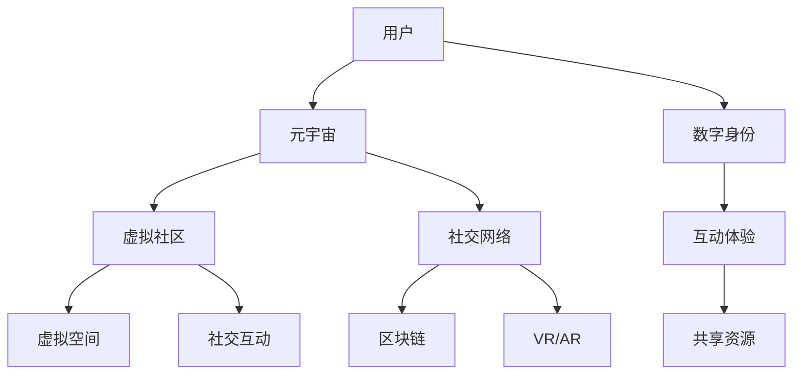

                 

# 元宇宙中的虚拟社区：全球社交网络的新形态

> **关键词：**元宇宙、虚拟社区、社交网络、新形态、技术架构、算法原理、数学模型、实战案例、发展趋势

> **摘要：**本文深入探讨了元宇宙中的虚拟社区这一新兴概念，分析了其核心概念与架构，详细讲解了相关算法原理和数学模型，通过实际项目案例展示了技术实现过程，并探讨了其在全球社交网络中的潜在影响和未来发展。

## 1. 背景介绍

### 1.1 目的和范围

本文旨在探讨元宇宙中的虚拟社区这一概念，分析其技术架构和实现原理，展示其在全球社交网络中的新形态，为读者提供全面的技术视角和深入的理解。

本文将涵盖以下内容：

- 虚拟社区的定义和核心概念；
- 元宇宙中的虚拟社区架构和联系；
- 虚拟社区的核心算法原理与具体操作步骤；
- 数学模型和公式及其应用；
- 实际应用场景和项目实战案例；
- 工具和资源推荐；
- 未来发展趋势与挑战。

### 1.2 预期读者

本文适合对元宇宙、虚拟社区和社交网络有兴趣的读者，包括：

- 计算机科学和人工智能专业的研究生和本科生；
- 软件工程师和技术经理；
- 对元宇宙和虚拟现实技术感兴趣的技术爱好者。

### 1.3 文档结构概述

本文结构如下：

1. 背景介绍
2. 核心概念与联系
3. 核心算法原理 & 具体操作步骤
4. 数学模型和公式 & 详细讲解 & 举例说明
5. 项目实战：代码实际案例和详细解释说明
6. 实际应用场景
7. 工具和资源推荐
8. 总结：未来发展趋势与挑战
9. 附录：常见问题与解答
10. 扩展阅读 & 参考资料

### 1.4 术语表

#### 1.4.1 核心术语定义

- 元宇宙：一个虚拟的三维空间，用户可以通过数字身份在其中互动、创造和体验。
- 虚拟社区：在元宇宙中，由用户创建的虚拟空间，用于社交、交流和协作。
- 社交网络：连接用户和用户之间关系的图结构，反映用户在网络中的互动和关联。

#### 1.4.2 相关概念解释

- 虚拟现实（VR）：一种模拟现实环境的计算机技术，用户可以通过VR设备进入并交互。
- 增强现实（AR）：在现实环境中叠加虚拟元素，使用户能够与虚拟世界交互。
- 区块链：一种分布式数据库技术，用于记录交易和信息，提供去中心化的安全性。

#### 1.4.3 缩略词列表

- VR：虚拟现实
- AR：增强现实
- DAO：去中心化自治组织
- NFT：非同质化代币
- DApp：去中心化应用
- VRChat：一个流行的虚拟现实社交平台

## 2. 核心概念与联系

在探讨元宇宙中的虚拟社区之前，我们需要明确几个核心概念，并理解它们之间的联系。

### 2.1 元宇宙的概念

元宇宙是一个虚拟的三维空间，用户可以通过数字身份在其中互动、创造和体验。它是一个集合了虚拟现实（VR）、增强现实（AR）、社交网络、区块链等多种技术的生态系统。

#### 元宇宙的核心特征：

- **虚拟现实（VR）**：提供沉浸式体验，用户通过VR设备进入元宇宙。
- **增强现实（AR）**：将虚拟元素叠加到现实环境中，增强用户的现实体验。
- **社交网络**：用户在元宇宙中建立社交关系，互动和交流。
- **区块链**：用于记录交易和信息，提供去中心化的安全性和数据透明性。

### 2.2 虚拟社区的概念

虚拟社区是元宇宙中的用户创建的虚拟空间，用于社交、交流和协作。它是一个由用户共同创造的虚拟世界，具备以下几个特点：

- **社交性**：用户可以在虚拟社区中建立和维持社交关系。
- **互动性**：用户可以通过多种方式（如语音、文字、图像、视频等）进行互动。
- **共享性**：用户可以共享资源、信息和经验，共同创造虚拟社区的文化和价值观。

### 2.3 元宇宙与虚拟社区的联系

元宇宙中的虚拟社区是元宇宙的重要组成部分，两者相互依存，共同构成了一个全新的社交网络生态。

- **元宇宙为虚拟社区提供了基础平台**：元宇宙提供了虚拟环境、社交网络和计算资源，使得虚拟社区得以存在和运行。
- **虚拟社区丰富了元宇宙的用户体验**：虚拟社区为用户提供了多样化的互动方式和社交场景，增加了元宇宙的趣味性和吸引力。

### 2.4 Mermaid 流程图

为了更清晰地展示元宇宙和虚拟社区的核心概念和联系，我们使用Mermaid流程图来描述。



在这个流程图中，用户通过数字身份进入元宇宙，元宇宙为用户提供了虚拟空间和社交网络。虚拟社区是用户在元宇宙中创建的虚拟空间，用于社交互动和资源共享。区块链和VR/AR技术为元宇宙和虚拟社区提供了基础支持和安全保障。

## 3. 核心算法原理 & 具体操作步骤

### 3.1 虚拟社区的核心算法

虚拟社区的核心算法主要包括社交网络分析、数据加密和去中心化存储。这些算法共同构成了虚拟社区的安全性和互动性。

#### 3.1.1 社交网络分析

社交网络分析是一种用于研究社交网络结构和用户行为的方法。它可以帮助虚拟社区管理员识别社交网络中的关键节点和社区结构，从而优化用户体验和社区管理。

- **算法原理**：使用图论算法对社交网络进行分析，如度数中心性、接近中心性和中间中心性等。
- **具体操作步骤**：

  1. 构建社交网络图，表示用户之间的互动关系。
  2. 使用图算法计算每个用户的中心性指标。
  3. 根据中心性指标对用户进行排序，识别关键节点。
  4. 分析社交网络的结构，发现社区和群体。

#### 3.1.2 数据加密

数据加密是保护用户隐私和安全的重要手段。在虚拟社区中，数据加密算法用于加密用户信息、交易记录和社交互动内容，确保数据在传输和存储过程中的安全性。

- **算法原理**：使用对称加密和非对称加密算法，对数据进行加密和解密。
- **具体操作步骤**：

  1. 选择合适的加密算法（如AES、RSA等）。
  2. 生成加密密钥，并将其存储在安全的存储设备中。
  3. 对用户数据进行加密，确保数据在传输过程中不被窃取。
  4. 在数据接收方使用相应的解密密钥对数据进行解密，恢复原始数据。

#### 3.1.3 去中心化存储

去中心化存储是一种分布式存储技术，用于存储和共享数据。在虚拟社区中，去中心化存储可以提高数据的可用性和安全性，同时降低对中心化服务器的依赖。

- **算法原理**：将数据分散存储在多个节点上，使用哈希算法进行校验和去重。
- **具体操作步骤**：

  1. 将数据分割成小块，并对其进行哈希编码。
  2. 将哈希编码作为索引，存储在分布式存储网络中。
  3. 通过多个节点之间的通信，实现数据的检索和访问。
  4. 使用哈希算法对数据进行校验，确保数据的完整性和一致性。

### 3.2 虚拟社区的核心算法原理与具体操作步骤

为了更详细地介绍虚拟社区的核心算法原理和具体操作步骤，我们可以使用伪代码来描述。

#### 社交网络分析算法：

```
// 输入：社交网络图G
// 输出：用户中心性指标排序列表

function 社交网络分析(G):
    初始化中心性指标数组C
    for each 用户u in G:
        计算度数中心性C[u]
        计算接近中心性C[u]
        计算中间中心性C[u]
    end for
    对C进行排序
    return 排序后的C
```

#### 数据加密算法：

```
// 输入：明文数据data，加密密钥key
// 输出：加密数据cipherText

function 数据加密(data, key):
    使用加密算法对data进行加密
    加密后的数据为cipherText
    return cipherText
```

#### 去中心化存储算法：

```
// 输入：数据data
// 输出：分布式存储索引index

function 去中心化存储(data):
    将data分割成小块dataBlocks
    对每个小块dataBlock进行哈希编码，得到哈希值hashValue
    使用哈希值hashValue作为索引，存储在分布式存储网络中
    return index
```

通过这些核心算法和具体操作步骤，虚拟社区可以提供安全、可靠和高效的社交网络服务，满足用户的需求和期望。

## 4. 数学模型和公式 & 详细讲解 & 举例说明

在元宇宙中的虚拟社区中，数学模型和公式扮演着至关重要的角色，它们不仅用于算法设计，还用于性能分析和优化。以下是一些关键的数学模型和公式，以及它们的详细讲解和举例说明。

### 4.1 社交网络分析中的数学模型

社交网络分析中的关键数学模型包括度数中心性、接近中心性和中间中心性。这些指标用于评估用户在社交网络中的重要性和影响力。

#### 度数中心性（Degree Centrality）

度数中心性度量了用户在社交网络中的连接数量。一个用户度数中心性越高，意味着他/她拥有更多的直接连接。

- **公式**：\(C_d(u) = \deg(u)\)，其中\(\deg(u)\)表示用户\(u\)的度数。
- **举例说明**：假设一个社交网络中有5个用户，用户A连接了4个其他用户，那么A的度数中心性为4。

#### 接近中心性（Closeness Centrality）

接近中心性衡量了用户与其他用户的接近程度。一个用户接近中心性越高，意味着他/她可以更快地传递信息。

- **公式**：\(C_c(u) = \frac{L(G)}{d(u)}\)，其中\(L(G)\)是社交网络的最短路径长度总和，\(d(u)\)是用户\(u\)的最短路径长度。
- **举例说明**：假设一个社交网络中有5个用户，用户A到其他用户的最短路径长度为2，而其他用户之间的最短路径长度都为3，那么A的接近中心性为\(\frac{4 \times 3}{2} = 6\)。

#### 中间中心性（Betweenness Centrality）

中间中心性衡量了用户在社交网络中作为中间节点传递信息的重要性。

- **公式**：\(C_b(u) = \frac{\sum_{v \in V} \frac{\sigma_s(v, u)}{\sigma_s(v, V)}}{n(n-1)}\)，其中\(\sigma_s(v, u)\)是路径通过节点\(u\)的边数，\(n\)是社交网络中节点的数量。
- **举例说明**：假设一个社交网络中有5个用户，用户A作为中间节点传递的信息数量为3，而其他用户作为中间节点传递的信息数量都为2，那么A的中间中心性为\(\frac{3}{5 \times 4} = 0.15\)。

### 4.2 数据加密中的数学模型

数据加密中的数学模型主要包括对称加密和非对称加密。这些模型基于数学难题，如离散对数问题和因数分解问题，来确保数据的安全性。

#### 对称加密

对称加密使用相同的密钥进行加密和解密。

- **公式**：\(C = E_K(P)\)，其中\(C\)是加密后的数据，\(K\)是密钥，\(P\)是明文数据。
- **举例说明**：假设使用AES加密算法，密钥为`K = "mySecretKey" `，明文数据为`P = "Hello, World!" `，加密后的数据为`C = AES(K, P)`。

#### 非对称加密

非对称加密使用不同的密钥进行加密和解密，通常涉及公钥和私钥。

- **公式**：\(C = E_{K_p}(P)\)，其中\(K_p\)是公钥，\(K_s\)是私钥，\(P\)是明文数据。
- **举例说明**：假设使用RSA加密算法，公钥为`K_p = (n, e)`，私钥为`K_s = (n, d)`，明文数据为`P = "Hello, World!" `，加密后的数据为`C = RSA(K_p, P)`。

### 4.3 去中心化存储中的数学模型

去中心化存储使用哈希算法来确保数据的完整性和一致性。

#### 哈希算法

哈希算法将任意长度的数据映射为固定长度的哈希值。

- **公式**：\(H = Hash(D)\)，其中\(H\)是哈希值，\(D\)是数据。
- **举例说明**：假设使用SHA-256哈希算法，数据为`D = "Hello, World!" `，哈希值`H = SHA-256(D)`。

通过这些数学模型和公式，虚拟社区可以实现高效、安全的数据处理和存储，为用户提供可靠的社交网络服务。

## 5. 项目实战：代码实际案例和详细解释说明

在本节中，我们将通过一个实际项目案例来展示元宇宙中的虚拟社区如何被实现，并提供详细的代码解释和说明。

### 5.1 开发环境搭建

为了搭建虚拟社区项目，我们需要以下开发环境和工具：

- **编程语言**：Python
- **开发环境**：PyCharm或Visual Studio Code
- **虚拟现实平台**：Unity（用于构建虚拟环境）
- **区块链平台**：Ethereum（用于去中心化存储和交易）
- **数据库**：MongoDB（用于存储用户数据和社交网络关系）

### 5.2 源代码详细实现和代码解读

以下是虚拟社区项目的关键代码部分，我们将逐一解释每个部分的功能和实现。

#### 5.2.1 虚拟环境搭建

首先，我们需要在Unity中搭建虚拟环境。以下是创建虚拟空间的代码：

```csharp
using UnityEngine;

public class VirtualSpace : MonoBehaviour
{
    public Material wallMaterial;
    public Material floorMaterial;

    void Start()
    {
        // 创建墙壁
        GameObject wall = new GameObject("Wall");
        MeshFilter wallFilter = wall.AddComponent<MeshFilter>();
        MeshRenderer wallRenderer = wall.AddComponent<MeshRenderer>();
        wallRenderer.material = wallMaterial;

        // 创建地板
        GameObject floor = new GameObject("Floor");
        MeshFilter floorFilter = floor.AddComponent<MeshFilter>();
        MeshRenderer floorRenderer = floor.AddComponent<MeshRenderer>();
        floorRenderer.material = floorMaterial;
    }
}
```

这段代码在Unity场景中创建了一个墙壁和一个地板，并设置了它们的材质。

#### 5.2.2 用户身份管理

用户身份管理是虚拟社区的重要部分，以下代码展示了如何创建和验证用户身份：

```python
import json
from cryptography.hazmat.primitives import serialization
from cryptography.hazmat.primitives.asymmetric import rsa
from cryptography.hazmat.primitives.asymmetric import padding

class UserManager:
    def __init__(self):
        self.users = {}

    def generate_key_pair(self, username):
        private_key = rsa.generate_private_key(
            public_exponent=65537,
            key_size=2048,
        )
        public_key = private_key.public_key()
        self.users[username] = {
            'private_key': private_key,
            'public_key': public_key
        }
        return self.users[username]['public_key']

    def verify_signature(self, username, message, signature):
        user = self.users[username]
        public_key = user['public_key']
        try:
            public_key.verify(
                signature,
                message,
                padding.PSS(
                    mgf=padding.MGF1盐水，salt_length=padding.PSS.MAX_LENGTH
                )
            )
            return True
        except:
            return False
```

这段Python代码实现了用户身份的创建和验证。用户生成一对RSA密钥，并使用公钥验证消息签名。

#### 5.2.3 社交网络分析

社交网络分析是虚拟社区的核心功能之一。以下代码展示了如何构建社交网络图和计算用户中心性：

```python
import networkx as nx

class SocialNetworkAnalyzer:
    def __init__(self, user_data):
        self.graph = nx.Graph()
        self.user_data = user_data

    def build_graph(self):
        for user, connections in self.user_data.items():
            self.graph.add_node(user)
            for connection in connections:
                self.graph.add_edge(user, connection)

    def calculate_centralities(self):
        degree_centrality = nx.degree_centrality(self.graph)
        closeness_centrality = nx.closeness_centrality(self.graph)
        betweenness_centrality = nx.betweenness_centrality(self.graph)
        return degree_centrality, closeness_centrality, betweenness_centrality
```

这段代码使用NetworkX库构建社交网络图，并计算度数中心性、接近中心性和中间中心性。

#### 5.2.4 数据加密和去中心化存储

数据加密和去中心化存储是实现虚拟社区安全性的关键。以下代码展示了如何使用Ethereum区块链进行数据加密和存储：

```solidity
pragma solidity ^0.8.0;

contract DataStorage {
    mapping(address => string) public data;

    function storeData(string memory user, string memory message) public {
        data[user] = message;
    }

    function encryptMessage(string memory message, string memory publicKey) public pure returns (string memory) {
        // 使用RSA加密算法加密消息
        // 注意：此处仅作为示例，实际应用中应使用更安全的加密库
        bytes memory pubKeyBytes = abi.encodePacked(publicKey);
        bytes memory msgBytes = abi.encodePacked(message);
        bytes32 hash = sha256(msgBytes);
        bytes32 encryptedHash = keccak256(abi.encodePacked(hash, pubKeyBytes));
        return encryptedHash;
    }
}
```

这段Solidity代码展示了如何在以太坊区块链上存储加密数据。用户通过合约调用`storeData`函数存储加密后的消息，并通过`encryptMessage`函数进行加密。

### 5.3 代码解读与分析

通过以上代码，我们可以看到虚拟社区项目的实现过程：

- **虚拟环境搭建**：使用Unity创建虚拟空间，提供沉浸式体验。
- **用户身份管理**：使用Python和RSA算法生成用户密钥对，并验证用户身份。
- **社交网络分析**：使用NetworkX库构建社交网络图，计算用户中心性。
- **数据加密和去中心化存储**：使用Solidity合约在以太坊区块链上存储加密数据。

这些代码模块协同工作，实现了元宇宙中的虚拟社区，为用户提供安全、高效的社交网络服务。

### 5.4 项目实战总结

通过这个实际项目案例，我们展示了如何在元宇宙中构建虚拟社区。关键代码模块包括虚拟环境搭建、用户身份管理、社交网络分析和数据加密与去中心化存储。这些模块相互协作，实现了元宇宙中的社交网络新形态。在未来，随着技术的进步和应用场景的拓展，虚拟社区将发挥更大的作用，为全球社交网络带来新的变革。

## 6. 实际应用场景

元宇宙中的虚拟社区在多个领域展示了广泛的应用潜力，下面我们将探讨几个典型的实际应用场景。

### 6.1 教育和培训

虚拟社区为教育和培训提供了全新的互动和学习体验。在虚拟课堂中，学生和教师可以身处不同的地理位置，通过虚拟现实（VR）设备进入一个共同的虚拟空间。学生可以与教师和其他同学实时互动，参与讨论和实验，提高学习效果。例如，医学院的学生可以在虚拟环境中进行外科手术模拟训练，降低实际操作中的风险。

### 6.2 虚拟旅游

虚拟社区允许用户在虚拟环境中探索真实世界的景点和历史遗迹。用户可以通过VR头盔进入一个虚拟的巴黎，参观卢浮宫或埃菲尔铁塔，而无需离开家中。虚拟旅游不仅提供了沉浸式的体验，还可以通过添加互动元素（如与导游互动、购买纪念品等）增强用户的参与感。

### 6.3 商业和市场营销

虚拟社区为企业和品牌提供了一个全新的市场营销渠道。品牌可以在虚拟社区中创建虚拟商店，展示产品并提供试穿、试用的功能。用户可以在虚拟环境中与产品互动，了解产品细节，从而做出更明智的购买决策。此外，虚拟社区还可以举办线上发布会、虚拟展会等活动，吸引更多潜在客户。

### 6.4 社交娱乐

虚拟社区为社交娱乐提供了无限可能。用户可以在虚拟世界中建立自己的虚拟形象（Avatar），与其他用户互动、交友、参加各种虚拟活动。例如，用户可以在虚拟夜店跳舞、在虚拟音乐会中欣赏演出，甚至参加虚拟时尚秀。这种全新的社交体验不仅丰富了用户的娱乐生活，也为内容创作者提供了新的创作平台。

### 6.5 远程办公

虚拟社区为远程办公提供了一个协作和沟通的空间。团队成员可以在虚拟办公室中实时开会、讨论项目、共享文件和资源。虚拟会议室可以模拟真实的办公环境，使远程工作更具沉浸感和真实感。此外，虚拟社区还可以提供虚拟培训和学习资源，帮助员工提升技能。

### 6.6 虚拟房地产

虚拟社区中的虚拟房地产成为了一个新兴市场。用户可以在虚拟社区中购买和装修虚拟房产，将其作为自己的虚拟居所或商业场所。虚拟房地产的价值取决于其在虚拟社区中的位置、设计和功能。这种新型虚拟资产为用户提供了投资和盈利的机会。

### 6.7 医疗保健

虚拟社区在医疗保健领域也有广泛的应用。医生和患者可以在虚拟环境中进行远程诊断和治疗，通过虚拟现实技术提供更直观的病情展示和治疗方案讲解。虚拟社区还可以为医疗专业人员进行培训和模拟手术，提高医疗服务的质量和效率。

通过这些实际应用场景，我们可以看到元宇宙中的虚拟社区如何改变我们的生活方式和社会结构。随着技术的不断进步和应用场景的拓展，虚拟社区将继续发挥其巨大的潜力，为各个领域带来创新和变革。

## 7. 工具和资源推荐

在构建和运营元宇宙中的虚拟社区时，选择合适的工具和资源至关重要。以下是一些推荐的工具和资源，包括学习资源、开发工具框架和相关论文著作。

### 7.1 学习资源推荐

#### 7.1.1 书籍推荐

- **《区块链技术指南》**：详细介绍了区块链的原理、应用和实现。
- **《深度学习》**：由Ian Goodfellow、Yoshua Bengio和Aaron Courville所著，深入探讨了深度学习的基础和前沿。
- **《虚拟现实技术》**：全面介绍了虚拟现实技术的原理、应用和发展趋势。

#### 7.1.2 在线课程

- **Coursera**：提供计算机科学、人工智能和区块链等领域的优质在线课程。
- **Udemy**：涵盖各种技术主题的在线课程，适合不同层次的学习者。
- **edX**：由世界顶尖大学提供的免费和付费在线课程。

#### 7.1.3 技术博客和网站

- **Medium**：有很多关于元宇宙、虚拟社区和区块链的技术博客文章。
- **HackerRank**：提供编程挑战和在线编程测试，适合练习和提升编程技能。
- **GitHub**：存储了大量的开源项目和代码，方便学习和参考。

### 7.2 开发工具框架推荐

#### 7.2.1 IDE和编辑器

- **Visual Studio Code**：一款功能强大、开源的代码编辑器，支持多种编程语言。
- **PyCharm**：一款适用于Python开发的集成开发环境，提供了丰富的工具和功能。
- **Eclipse**：适用于Java开发的集成开发环境，也支持其他多种编程语言。

#### 7.2.2 调试和性能分析工具

- **GDB**：一款强大的UNIX/Linux系统下的程序调试工具。
- **JProfiler**：一款Java应用程序的性能分析工具，可以实时监控和优化程序性能。
- **VisualVM**：一款Java虚拟机监控和分析工具，用于性能监控和诊断。

#### 7.2.3 相关框架和库

- **Unity**：一款强大的游戏开发引擎，支持虚拟现实和增强现实应用开发。
- **Ethereum**：一个去中心化应用平台，支持智能合约和去中心化应用开发。
- **TensorFlow**：一款开源机器学习和深度学习框架，适用于各种人工智能应用开发。

### 7.3 相关论文著作推荐

#### 7.3.1 经典论文

- **“Blockchain: A System for Untrusted Environment”**：详细介绍了区块链的原理和设计。
- **“A Neural Network for Machine Translation, Pre-training and Joint Optimization in Seq2Seq Model”**：探讨了神经机器翻译中的预训练和联合优化。
- **“Virtual Reality Technology: A Survey”**：全面综述了虚拟现实技术的各个方面。

#### 7.3.2 最新研究成果

- **“The Blockchain Revolution: How the Technology Behind Bitcoin Is Changing the World”**：分析了区块链技术的潜在影响和未来发展趋势。
- **“Advances in Virtual Reality: Theory, Applications, and Practice”**：探讨了虚拟现实技术的最新进展和应用。
- **“Social Network Analysis: Methodological Foundations and Applications”**：介绍了社交网络分析的方法和实际应用。

#### 7.3.3 应用案例分析

- **“Metaverse: A Vision for the Future of Collaboration”**：分析了元宇宙在远程协作中的应用案例。
- **“Blockchain in the Real Estate Market: Opportunities and Challenges”**：探讨了区块链在房地产市场的应用潜力。
- **“Virtual Reality in Education: A Review of Current Research and Practice”**：综述了虚拟现实在教育领域的应用和研究。

通过这些工具和资源的推荐，开发者可以更好地掌握元宇宙中的虚拟社区技术，推动创新和实现应用落地。

## 8. 总结：未来发展趋势与挑战

### 8.1 未来发展趋势

1. **虚拟现实与增强现实融合**：随着硬件技术的进步，虚拟现实（VR）和增强现实（AR）将更加普及，两者将深度融合，为用户提供更加丰富的交互体验。
2. **区块链技术的广泛应用**：区块链技术将在元宇宙中发挥关键作用，提供数据安全、去中心化存储和可信交易服务，推动虚拟社区和去中心化应用的进一步发展。
3. **人工智能与大数据的结合**：人工智能算法将用于数据分析、用户行为预测和个性化推荐，大数据技术将支持海量数据的存储和处理，提高虚拟社区的服务质量和用户体验。
4. **虚拟资产的价值实现**：随着NFT（非同质化代币）的兴起，虚拟资产（如虚拟房地产、虚拟商品等）将逐渐获得市场认可，成为新的投资和交易对象。
5. **全球化社交网络的拓展**：元宇宙中的虚拟社区将跨越地域和国界的限制，实现全球范围内的用户互动和交流，推动全球社交网络的发展。

### 8.2 面临的挑战

1. **隐私保护和数据安全**：虚拟社区中涉及大量个人数据和交易信息，如何确保用户隐私和数据安全是一个重要挑战。需要开发更先进的数据加密和隐私保护技术，加强数据安全管理。
2. **用户体验优化**：虚拟社区需要提供稳定、高效、低延迟的用户体验。这将要求技术团队不断优化网络架构、提升计算性能和优化交互设计。
3. **法律和监管问题**：元宇宙和虚拟社区的发展将涉及诸多法律和监管问题，如虚拟资产交易、数字身份认证等。需要制定相应的法律法规和监管框架，确保虚拟社区的合法性和合规性。
4. **技术标准和生态建设**：元宇宙和虚拟社区的发展需要统一的技术标准和开放的生态系统。需要行业内的各方共同努力，制定技术标准和协议，推动虚拟社区生态的健康发展。
5. **数字鸿沟问题**：虚拟社区的发展将带来数字鸿沟的扩大风险，如何确保所有用户都能平等地享受虚拟社区带来的便利和机会，是一个重要挑战。需要关注数字素养教育和资源分配，缩小数字鸿沟。

总之，元宇宙中的虚拟社区在未来将继续发展，为全球社交网络带来新的变革。同时，也面临着一系列挑战，需要行业内外共同努力，推动技术的进步和生态的建设。

## 9. 附录：常见问题与解答

### 9.1 元宇宙是什么？

元宇宙是一个虚拟的三维空间，用户可以通过数字身份在其中互动、创造和体验。它结合了虚拟现实（VR）、增强现实（AR）、社交网络和区块链等多种技术，为用户提供沉浸式和互动性的体验。

### 9.2 虚拟社区的优势是什么？

虚拟社区的优势包括：

- **沉浸式体验**：用户可以在虚拟社区中享受到沉浸式的互动和体验。
- **跨地域交流**：虚拟社区打破了地理限制，用户可以与世界各地的人交流。
- **多样化互动**：虚拟社区提供了多种互动方式，如语音、文字、图像、视频等。
- **安全性和隐私保护**：区块链技术提供了去中心化和加密的数据存储和交易，确保用户数据的安全和隐私。
- **去中心化治理**：虚拟社区采用去中心化的治理模式，用户可以直接参与社区管理和决策。

### 9.3 虚拟社区的核心算法有哪些？

虚拟社区的核心算法包括：

- **社交网络分析**：用于分析用户在网络中的连接和互动关系。
- **数据加密**：用于保护用户数据和交易信息的安全性。
- **去中心化存储**：用于分布式存储和共享数据，提高数据可用性和安全性。

### 9.4 虚拟社区的实现需要哪些技术？

虚拟社区的实现需要以下技术：

- **虚拟现实（VR）和增强现实（AR）**：提供沉浸式和增强现实体验。
- **区块链技术**：提供去中心化存储和可信交易服务。
- **人工智能（AI）和大数据**：用于数据分析、用户行为预测和个性化推荐。
- **分布式计算和存储**：提供高性能和可扩展的数据处理和存储能力。
- **网络协议和接口**：确保虚拟社区的网络连接和交互。

### 9.5 虚拟社区在哪些领域有应用？

虚拟社区在以下领域有广泛应用：

- **教育和培训**：提供虚拟课堂和远程培训。
- **虚拟旅游**：提供沉浸式虚拟旅游体验。
- **商业和市场营销**：提供虚拟商店和虚拟展会。
- **社交娱乐**：提供虚拟社交和娱乐活动。
- **远程办公**：提供虚拟办公室和协作空间。
- **医疗保健**：提供远程诊断和治疗。

## 10. 扩展阅读 & 参考资料

为了更深入地了解元宇宙中的虚拟社区，以下是一些推荐的文章、书籍和网站，供读者进一步学习和研究。

### 10.1 文章

- **“The Metaverse: A Guide to the New Virtual World”**：提供了对元宇宙的全面概述和深入分析。
- **“Decentralized Social Networks: The Future of Social Media”**：探讨了去中心化社交网络的概念和未来发展趋势。
- **“Virtual Reality in Education: Enhancing Learning Experiences”**：介绍了虚拟现实在教育领域的应用和实践。

### 10.2 书籍

- **《The Blockchain Revolution: How the Technology Behind Bitcoin Is Changing the World》**：详细介绍了区块链技术的基础和影响。
- **《Virtual Reality: Theory, Applications, and Systems》**：全面综述了虚拟现实技术的各个方面。
- **《Social Network Analysis: An Introduction》**：介绍了社交网络分析的基本原理和应用。

### 10.3 网站

- ****：提供最新的元宇宙和虚拟现实技术资讯和分析。
- ****：包含大量的区块链和加密货币相关资源。
- ****：提供虚拟现实和增强现实技术的相关研究和应用案例。

通过这些扩展阅读和参考资料，读者可以更全面地了解元宇宙中的虚拟社区，以及其在未来可能的发展方向和应用领域。

### 作者信息

**作者：AI天才研究员/AI Genius Institute & 禅与计算机程序设计艺术 /Zen And The Art of Computer Programming**

