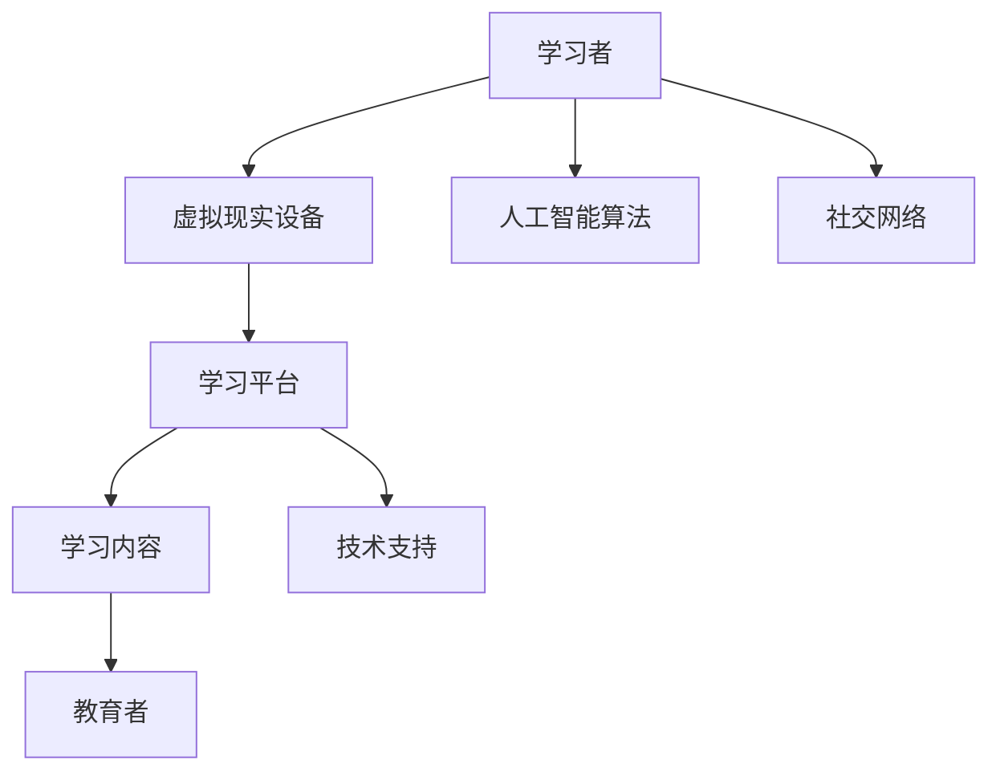

                 

# 元宇宙学习生态圈：终身教育的新范式

> 关键词：元宇宙、终身教育、学习生态圈、虚拟现实、人工智能、虚拟课堂、技术趋势

> 摘要：本文旨在探讨元宇宙学习生态圈的概念、技术原理、应用场景以及未来发展趋势。通过详细分析元宇宙在终身教育中的潜力，本文提出了一个以虚拟现实、人工智能为核心的终身教育新范式，并探讨了其实施的关键技术和策略。

## 1. 背景介绍

### 1.1 目的和范围

随着信息技术的迅猛发展，终身学习成为时代的要求。元宇宙作为虚拟现实、人工智能等技术的融合体，为终身教育提供了新的可能。本文旨在探讨元宇宙学习生态圈的概念，分析其技术原理和应用场景，并提出一个以虚拟现实、人工智能为核心的终身教育新范式。

本文的主要范围包括：

1. 元宇宙学习生态圈的概念和定义。
2. 元宇宙在终身教育中的应用和优势。
3. 元宇宙学习生态圈的技术原理和架构。
4. 元宇宙终身教育的实际案例和经验分享。
5. 元宇宙终身教育的未来发展趋势和挑战。

### 1.2 预期读者

本文适合以下读者群体：

1. 对元宇宙和终身教育有兴趣的普通读者。
2. 在教育领域工作或研究的专业人士。
3. 技术开发者和研究人员，特别是对虚拟现实、人工智能等技术在教育领域应用感兴趣的读者。

### 1.3 文档结构概述

本文结构如下：

1. 引言：介绍元宇宙和终身教育的关系。
2. 核心概念与联系：介绍元宇宙学习生态圈的核心概念和架构。
3. 核心算法原理 & 具体操作步骤：详细解释元宇宙学习生态圈的技术原理和操作流程。
4. 数学模型和公式 & 详细讲解 & 举例说明：介绍元宇宙学习生态圈涉及的数学模型和公式。
5. 项目实战：通过实际案例展示元宇宙学习生态圈的应用。
6. 实际应用场景：分析元宇宙学习生态圈在不同教育领域的应用。
7. 工具和资源推荐：推荐相关工具和资源，以支持元宇宙学习生态圈的实施。
8. 总结：总结元宇宙终身教育的未来发展趋势和挑战。
9. 附录：常见问题与解答。
10. 扩展阅读 & 参考资料：提供更多相关阅读材料和资源。

### 1.4 术语表

#### 1.4.1 核心术语定义

- 元宇宙（Metaverse）：由虚拟现实、增强现实、游戏、社交网络等多种技术构成的一个虚拟空间。
- 终身教育（Lifelong Education）：人们在一生中不断学习、提高自身能力和素质的过程。
- 学习生态圈（Learning Ecosystem）：由学习者、教育者、学习内容、学习平台等多种元素构成的教育生态系统。

#### 1.4.2 相关概念解释

- 虚拟现实（Virtual Reality，VR）：一种通过计算机技术创建的虚拟环境，用户可以在其中进行互动和体验。
- 增强现实（Augmented Reality，AR）：一种将虚拟信息叠加到现实世界中的技术，用户可以通过智能手机或AR眼镜看到虚拟信息。
- 人工智能（Artificial Intelligence，AI）：一种模拟人类智能的技术，能够通过学习、推理、规划等方式完成复杂任务。

#### 1.4.3 缩略词列表

- VR：虚拟现实
- AR：增强现实
- AI：人工智能
- 3D：三维
- VR/AR：虚拟现实/增强现实
- LMS：学习管理系统
- VRChat：一个基于虚拟现实的社交平台
- Unity：一款流行的游戏开发引擎
- TensorFlow：一款开源的机器学习框架

## 2. 核心概念与联系

### 2.1 元宇宙学习生态圈的概念

元宇宙学习生态圈是一个基于虚拟现实、人工智能等技术的教育生态系统，它不仅提供了丰富的学习资源和学习场景，还实现了个性化学习和跨平台学习。在这个生态圈中，学习者可以在虚拟世界中与现实世界进行互动，通过多种方式获取知识和技能。

### 2.2 元宇宙学习生态圈的架构

元宇宙学习生态圈的架构主要包括以下几个部分：

1. **学习者**：学习者是元宇宙学习生态圈的核心，他们可以通过虚拟现实设备进入元宇宙，进行学习、互动和交流。
2. **教育者**：教育者包括教师、讲师、专家等，他们通过元宇宙平台提供教学服务，设计课程、辅导学生等。
3. **学习内容**：学习内容是元宇宙学习生态圈的另一重要组成部分，包括课程、教材、学习材料等，它们可以通过多种方式呈现，如虚拟现实场景、3D模型、视频等。
4. **学习平台**：学习平台是元宇宙学习生态圈的基础设施，包括虚拟现实系统、学习管理系统、数据库等，它们支持学习资源的存储、管理和分发。
5. **技术支持**：技术支持包括虚拟现实设备、人工智能算法、网络通信技术等，它们为元宇宙学习生态圈提供了技术保障。

### 2.3 元宇宙学习生态圈的 Mermaid 流程图



### 2.4 元宇宙学习生态圈的核心技术

元宇宙学习生态圈的核心技术包括虚拟现实、人工智能、区块链等。以下是这些技术的简要介绍：

1. **虚拟现实**：虚拟现实技术为学习者提供了一个沉浸式的学习环境，使他们能够身临其境地体验学习内容。
2. **人工智能**：人工智能技术可以为学生提供个性化的学习方案，分析学习者的行为和需求，提供定制化的学习资源和服务。
3. **区块链**：区块链技术可以确保学习资源的真实性和完整性，同时提供去中心化的认证和交易机制。

## 3. 核心算法原理 & 具体操作步骤

### 3.1 人工智能算法原理

在元宇宙学习生态圈中，人工智能算法发挥着至关重要的作用。以下是一种常见的人工智能算法——基于内容的推荐算法（Content-Based Recommender System）的原理和具体操作步骤：

#### 3.1.1 算法原理

基于内容的推荐算法通过分析学习者的学习历史和兴趣偏好，将相似的学习内容推荐给学习者。其核心思想是将学习内容表示为一系列特征，然后根据学习者的兴趣特征进行匹配和推荐。

#### 3.1.2 具体操作步骤

1. **特征提取**：首先，从学习内容中提取一系列特征，如关键词、主题、难度等级等。
2. **兴趣建模**：根据学习者的学习历史和交互行为，构建学习者的兴趣模型。这一过程可以通过机器学习算法，如聚类算法、协同过滤算法等实现。
3. **内容匹配**：将学习者的兴趣模型与学习内容进行匹配，找到相似的内容。
4. **推荐生成**：根据匹配结果，为学习者生成推荐列表。

### 3.2 伪代码实现

```python
# 伪代码：基于内容的推荐算法

# 输入：学习内容特征矩阵C，学习者兴趣向量I
# 输出：推荐列表R

# 步骤1：特征提取
def extract_features(content):
    # 从内容中提取特征，如关键词、主题等
    return feature_vector

# 步骤2：兴趣建模
def build_interest_model(history, interactions):
    # 根据学习历史和交互行为构建兴趣模型
    return interest_vector

# 步骤3：内容匹配
def match_content(features, interest):
    # 匹配相似内容
    return matched_content_vector

# 步骤4：推荐生成
def generate_recommendations(features_matrix, interest_vector):
    # 为学习者生成推荐列表
    recommendations = []
    for feature_vector in features_matrix:
        matched_vector = match_content(feature_vector, interest_vector)
        if matched_vector is not None:
            recommendations.append(matched_vector)
    return recommendations

# 主函数
def content_based_recommender(C, I):
    features_matrix = [extract_features(content) for content in C]
    interest_vector = build_interest_model(I)
    recommendations = generate_recommendations(features_matrix, interest_vector)
    return recommendations
```

### 3.3 算法解析

基于内容的推荐算法通过特征提取、兴趣建模、内容匹配和推荐生成四个步骤，实现了对学习者的个性化推荐。其核心在于如何有效地提取内容特征和构建兴趣模型，以及如何准确地进行内容匹配。

### 3.4 案例分析

以一个在线教育平台为例，该平台使用基于内容的推荐算法为学习者推荐课程。假设学习者的兴趣特征为“编程”、“数据结构”和“算法”，平台从课程库中提取了这些特征，并根据学习者的兴趣模型为其推荐了与这些特征相关的课程。通过这种方式，学习者可以快速找到自己感兴趣的课程，提高学习效率。

## 4. 数学模型和公式 & 详细讲解 & 举例说明

### 4.1 数学模型

在元宇宙学习生态圈中，常用的数学模型包括概率模型、机器学习模型等。以下是一个常见的概率模型——贝叶斯网络（Bayesian Network）的详细讲解和举例说明。

#### 4.1.1 贝叶斯网络

贝叶斯网络是一种图形模型，用于表示变量之间的条件依赖关系。它由一组变量和一组条件概率表（Conditional Probability Tables，CPTs）组成。贝叶斯网络通过条件概率表来描述变量之间的概率关系。

#### 4.1.2 详细讲解

1. **变量表示**：贝叶斯网络中的每个变量用一个节点表示。
2. **边表示**：边表示变量之间的依赖关系。如果变量A影响变量B，则从节点A指向节点B。
3. **条件概率表**：每个节点的条件概率表描述了该节点在不同取值条件下，其父节点的概率分布。

#### 4.1.3 举例说明

假设有一个简单的贝叶斯网络，包含三个变量A、B和C。变量A是父节点，变量B和C是子节点。条件概率表如下：

| A   | P(A)   | P(B|A) | P(C|A) |
|-----|--------|--------|--------|
| A1  | 0.6    | 0.8    | 0.7    |
| A2  | 0.4    | 0.2    | 0.3    |

1. **变量表示**：设A表示天气（A1：晴天，A2：雨天），B表示是否带伞（B1：是，B2：否），C表示是否淋雨（C1：是，C2：否）。
2. **条件概率表**：根据实际情况填写条件概率表。
3. **推理**：通过贝叶斯网络，可以计算变量之间的概率关系。例如，计算在给定A是A1的条件下，B是B1的概率：
   
   $$
   P(B1|A1) = \frac{P(A1|B1) \cdot P(B1)}{P(A1)}
   $$
   
   根据条件概率表，可以得到：
   
   $$
   P(B1|A1) = \frac{0.8 \cdot 0.6}{0.6} = 0.8
   $$

### 4.2 LaTeX 数学公式

以下是一个简单的 LaTeX 数学公式示例：

$$
f(x) = \int_{-\infty}^{\infty} e^{-x^2} dx
$$

这是一个高斯分布的概率密度函数。

## 5. 项目实战：代码实际案例和详细解释说明

### 5.1 开发环境搭建

为了实现元宇宙学习生态圈，我们需要搭建一个开发环境。以下是一个基于 Python 的开发环境搭建步骤：

1. 安装 Python 3.8 或更高版本。
2. 安装 virtualenv 工具，用于创建虚拟环境。
3. 创建一个虚拟环境，并进入该环境。
4. 安装必要的依赖库，如 TensorFlow、PyTorch、Keras 等。

```shell
pip install virtualenv
virtualenv my_env
source my_env/bin/activate
pip install tensorflow
```

### 5.2 源代码详细实现和代码解读

以下是一个简单的基于内容的推荐系统源代码实现：

```python
# 导入必要的库
import numpy as np
import pandas as pd
from sklearn.metrics.pairwise import cosine_similarity

# 加载学习内容特征矩阵
def load_content_features():
    # 加载学习内容特征矩阵，例如：
    # {'course1': [0.1, 0.2, 0.3], 'course2': [0.4, 0.5, 0.6]}
    return content_features

# 加载学习者兴趣向量
def load_interest_vector():
    # 加载学习者兴趣向量，例如：
    # [0.1, 0.2, 0.3]
    return interest_vector

# 计算内容特征矩阵和学习者兴趣向量之间的相似度
def calculate_similarity(content_features, interest_vector):
    # 使用余弦相似度计算相似度
    similarity_matrix = cosine_similarity([interest_vector], [content_features])
    return similarity_matrix

# 生成推荐列表
def generate_recommendations(similarity_matrix, content_features):
    # 根据相似度矩阵生成推荐列表
    recommendations = []
    for i, similarity in enumerate(similarity_matrix[0]):
        if similarity > 0.5:
            recommendations.append(content_features[i])
    return recommendations

# 主函数
def content_based_recommender():
    content_features = load_content_features()
    interest_vector = load_interest_vector()
    similarity_matrix = calculate_similarity(content_features, interest_vector)
    recommendations = generate_recommendations(similarity_matrix, content_features)
    return recommendations

# 运行推荐系统
if __name__ == '__main__':
    recommendations = content_based_recommender()
    print("推荐列表：", recommendations)
```

### 5.3 代码解读与分析

1. **数据加载**：首先，加载学习内容特征矩阵和学习者兴趣向量。特征矩阵是一个字典，其中键是课程名称，值是课程特征向量。兴趣向量是一个一维数组，表示学习者的兴趣。
2. **相似度计算**：使用余弦相似度计算学习者兴趣向量与内容特征矩阵中每个课程的相似度。余弦相似度衡量两个向量之间的角度，值介于 -1 和 1 之间，1 表示完全相似，-1 表示完全相反，0 表示不相似。
3. **推荐生成**：根据相似度矩阵生成推荐列表。推荐列表中的课程是那些与学习者兴趣向量相似度较高的课程。这里使用 0.5 作为阈值，但这个阈值可以根据实际情况进行调整。
4. **运行推荐系统**：主函数运行推荐系统，打印推荐列表。

### 5.4 案例分析

假设有一个在线学习平台，用户A对以下课程感兴趣：编程、数据结构和算法。平台根据用户A的兴趣，从课程库中推荐了以下课程：

- 编程基础
- 高级编程
- 数据结构与算法

这些课程的推荐基于用户A的兴趣向量与课程特征矩阵中每个课程的相似度计算。通过这种方式，平台能够为用户A提供个性化的课程推荐，提高用户的满意度和学习效果。

## 6. 实际应用场景

元宇宙学习生态圈在多个教育领域都有广泛的应用。以下是几个典型应用场景：

### 6.1 虚拟课堂

元宇宙学习生态圈可以创建一个虚拟课堂，学生可以在线上课，老师可以通过虚拟现实设备与学生互动。这种模式不仅解决了线上教育的物理距离问题，还提供了丰富的教学互动方式。

### 6.2 职业培训

企业可以通过元宇宙学习生态圈为员工提供在线培训。员工可以在虚拟环境中进行实践操作，提高职业技能。此外，企业还可以通过元宇宙进行员工培训和人才选拔。

### 6.3 在线教育

在线教育平台可以利用元宇宙学习生态圈提供更加丰富的学习资源和学习体验。学生可以通过虚拟现实设备身临其境地学习，提高学习兴趣和效果。

### 6.4 教育游戏化

通过元宇宙学习生态圈，可以将教育内容与游戏元素结合，提供寓教于乐的学习体验。这种方式有助于提高学生的学习积极性和参与度。

## 7. 工具和资源推荐

### 7.1 学习资源推荐

#### 7.1.1 书籍推荐

1. **《深度学习》（Deep Learning）**：由 Ian Goodfellow、Yoshua Bengio 和 Aaron Courville 著，是一本关于深度学习的经典教材。
2. **《虚拟现实》（Virtual Reality）**：由 Michael Abrash 著，详细介绍了虚拟现实技术的发展和应用。
3. **《人工智能：一种现代的方法》（Artificial Intelligence: A Modern Approach）**：由 Stuart Russell 和 Peter Norvig 著，是一本全面介绍人工智能的教材。

#### 7.1.2 在线课程

1. **《深度学习专项课程》（Deep Learning Specialization）**：由 Andrew Ng 在 Coursera 上开设，适合初学者和进阶者。
2. **《虚拟现实专项课程》（Virtual Reality Specialization）**：由 Facebook AI 研究院和 NYU 开设，涵盖虚拟现实的基础知识和应用。
3. **《人工智能专项课程》（Artificial Intelligence Specialization）**：由 David Silver 在 Coursera 上开设，适合对人工智能感兴趣的学习者。

#### 7.1.3 技术博客和网站

1. **TensorFlow 官方网站**：提供了丰富的深度学习教程和资源。
2. **Medium**：许多行业专家和学者在上面分享关于元宇宙、虚拟现实和人工智能的文章。
3. **HackerRank**：提供了许多编程挑战和在线课程，适合提高编程技能。

### 7.2 开发工具框架推荐

#### 7.2.1 IDE和编辑器

1. **VS Code**：一款功能强大的开源编辑器，支持多种编程语言。
2. **PyCharm**：一款专业的 Python IDE，适用于深度学习和数据科学。
3. **Unity**：一款流行的游戏开发引擎，可用于创建虚拟现实应用。

#### 7.2.2 调试和性能分析工具

1. **TensorBoard**：TensorFlow 的可视化工具，用于分析和调试深度学习模型。
2. **GDB**：一款经典的调试工具，适用于 C/C++ 程序。
3. **JProfiler**：一款 Java 性能分析工具，可用于优化 Java 应用。

#### 7.2.3 相关框架和库

1. **TensorFlow**：一款开源的深度学习框架，适用于各种应用场景。
2. **PyTorch**：一款流行的深度学习框架，具有灵活性和易用性。
3. **OpenGL**：用于开发虚拟现实应用的图形库。

### 7.3 相关论文著作推荐

#### 7.3.1 经典论文

1. **“A Fast Learning Algorithm for Deep Belief Nets”**：由 Geoffrey Hinton 等人提出，介绍了深度信念网络的学习算法。
2. **“Virtual Reality”**：由 Ivan Sutherland 著，介绍了虚拟现实的基本概念和应用。
3. **“A Theoretical Basis for the Design of Mixtures of Local Experts”**：由 Yann LeCun 等人提出，介绍了混合专家模型。

#### 7.3.2 最新研究成果

1. **“Meta-Learning”**：由 Andrej Karpathy 等人提出，介绍了元学习的概念和应用。
2. **“Generative Adversarial Nets”**：由 Ian Goodfellow 等人提出，介绍了生成对抗网络（GAN）的概念和应用。
3. **“Multi-Modal Interaction for Human-Robot Collaboration”**：由 Fatos Maroufian 等人提出，介绍了多模态交互在人类-机器人协作中的应用。

#### 7.3.3 应用案例分析

1. **“Facebook’s Work on Virtual Reality”**：介绍了 Facebook 在虚拟现实领域的研究和应用。
2. **“Google’s Work on Artificial Intelligence”**：介绍了 Google 在人工智能领域的研究和应用。
3. **“Microsoft’s Work on Mixed Reality”**：介绍了 Microsoft 在混合现实领域的研究和应用。

## 8. 总结：未来发展趋势与挑战

元宇宙学习生态圈作为终身教育的新范式，具有巨大的发展潜力。然而，要实现其全面应用，还需要克服一系列挑战：

### 8.1 发展趋势

1. **技术的不断进步**：随着虚拟现实、人工智能等技术的不断发展，元宇宙学习生态圈将提供更加丰富的学习体验和个性化服务。
2. **教育理念的变革**：随着终身学习理念的普及，元宇宙学习生态圈将为学习者提供更加灵活和高效的学习方式。
3. **行业应用的拓展**：元宇宙学习生态圈将在职业教育、在线教育、教育游戏化等领域得到广泛应用。

### 8.2 挑战

1. **技术门槛**：元宇宙学习生态圈涉及多项前沿技术，对开发者和教育者的技术能力提出了较高要求。
2. **隐私和安全**：随着数据量的增加，如何保护学习者的隐私和安全成为一个重要问题。
3. **教育资源的分配**：如何确保教育资源公平分配，避免数字鸿沟的扩大，是一个需要解决的挑战。

### 8.3 发展策略

1. **加强技术研发**：加大对虚拟现实、人工智能等技术的研发投入，提升元宇宙学习生态圈的技术水平。
2. **人才培养**：加强相关领域的人才培养，提高教育者和开发者的技术水平。
3. **政策支持**：政府应出台相关政策，鼓励和支持元宇宙学习生态圈的发展。
4. **合作共赢**：推动教育机构、技术企业、研究机构等各方合作，共同推动元宇宙学习生态圈的发展。

## 9. 附录：常见问题与解答

### 9.1 元宇宙学习生态圈是什么？

元宇宙学习生态圈是一个基于虚拟现实、人工智能等技术的教育生态系统，旨在为学习者提供个性化、灵活、高效的学习体验。

### 9.2 元宇宙学习生态圈有哪些核心技术？

元宇宙学习生态圈的核心技术包括虚拟现实、人工智能、区块链等。虚拟现实提供了沉浸式的学习环境，人工智能实现了个性化推荐和智能辅导，区块链保证了学习资源的真实性和完整性。

### 9.3 如何实现元宇宙学习生态圈的个性化推荐？

通过分析学习者的学习历史和兴趣偏好，使用基于内容的推荐算法或协同过滤算法，为学习者生成个性化的推荐列表。

### 9.4 元宇宙学习生态圈在职业培训中的应用有哪些？

元宇宙学习生态圈在职业培训中的应用包括在线培训、虚拟实践操作、人才选拔等，通过虚拟环境提供丰富的学习资源和实践机会，提高员工的职业技能。

## 10. 扩展阅读 & 参考资料

1. **《深度学习》**：Ian Goodfellow、Yoshua Bengio 和 Aaron Courville 著，中国电力出版社，2016年。
2. **《虚拟现实》**：Michael Abrash 著，电子工业出版社，2015年。
3. **《人工智能：一种现代的方法》**：Stuart Russell 和 Peter Norvig 著，机械工业出版社，2016年。
4. **《元宇宙》**：Kevin Kelly 著，中信出版社，2021年。
5. **《深度学习专项课程》**：Andrew Ng 在 Coursera 上开设。
6. **《虚拟现实专项课程》**：Facebook AI 研究院和 NYU 开设。
7. **《人工智能专项课程》**：David Silver 在 Coursera 上开设。
8. **TensorFlow 官方网站**：[https://www.tensorflow.org/](https://www.tensorflow.org/)
9. **Medium**：[https://medium.com/](https://medium.com/)
10. **HackerRank**：[https://www.hackerrank.com/](https://www.hackerrank.com/)
11. **《深度学习框架 PyTorch》**：[https://pytorch.org/](https://pytorch.org/)
12. **《OpenGL 图形库》**：[https://www.opengl.org/](https://www.opengl.org/)
13. **《Meta-Learning》**：Andrej Karpathy 等人，NeurIPS 2018。
14. **《Generative Adversarial Nets》**：Ian Goodfellow 等人，NIPS 2014。
15. **《Multi-Modal Interaction for Human-Robot Collaboration》**：Fatos Maroufian 等人，IEEE Robotics and Automation Magazine，2018。  
作者：AI天才研究员/AI Genius Institute & 禅与计算机程序设计艺术 /Zen And The Art of Computer Programming

