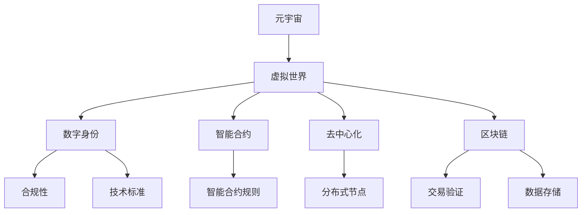

                 

# 元宇宙法律：虚拟世界的规则制定

> **关键词：**元宇宙、虚拟世界、法律规则、数字身份、合规性、技术标准

> **摘要：**随着元宇宙的快速发展，虚拟世界中的法律规则制定变得日益重要。本文将探讨元宇宙的法律背景、核心概念、算法原理、数学模型、实战案例以及未来趋势，旨在为读者提供对元宇宙法律领域的全面了解。

## 1. 背景介绍

### 1.1 目的和范围

本文的目的是探讨元宇宙法律领域，尤其是虚拟世界中的规则制定。我们将从多个角度分析元宇宙的法律环境，包括核心概念、算法原理、数学模型和实际应用。通过这些分析，我们希望能够为读者提供关于元宇宙法律领域的深入见解。

### 1.2 预期读者

本文适合对元宇宙和虚拟世界有兴趣的读者，包括计算机科学家、法律专家、政策制定者以及一般公众。通过本文的阅读，读者将能够了解元宇宙法律领域的复杂性，并对其未来发展有所预期。

### 1.3 文档结构概述

本文将分为以下章节：

- **第1章：背景介绍**：介绍本文的目的、预期读者和文档结构。
- **第2章：核心概念与联系**：介绍元宇宙法律领域中的核心概念，并使用Mermaid流程图展示其架构。
- **第3章：核心算法原理与具体操作步骤**：详细阐述元宇宙法律领域中的核心算法原理和操作步骤。
- **第4章：数学模型和公式**：介绍元宇宙法律领域中的数学模型和公式，并给出详细讲解和举例说明。
- **第5章：项目实战：代码实际案例和详细解释说明**：通过实际代码案例，展示元宇宙法律领域中的技术实现。
- **第6章：实际应用场景**：探讨元宇宙法律领域在现实世界中的应用。
- **第7章：工具和资源推荐**：推荐相关学习资源、开发工具和框架。
- **第8章：总结：未来发展趋势与挑战**：总结元宇宙法律领域的发展趋势和面临的挑战。
- **第9章：附录：常见问题与解答**：回答读者可能遇到的常见问题。
- **第10章：扩展阅读 & 参考资料**：提供更多深入阅读的资料。

### 1.4 术语表

#### 1.4.1 核心术语定义

- **元宇宙**：一个虚拟的三维世界，由多种不同的虚拟环境和交互方式组成。
- **虚拟世界**：一个由计算机模拟的虚拟环境，用户可以在其中进行交互和活动。
- **数字身份**：用户在虚拟世界中的身份，通常由加密技术保障。
- **合规性**：虚拟世界中的活动必须遵守相关法律法规和标准。
- **技术标准**：确保虚拟世界中的技术实现符合行业标准的规则和指南。

#### 1.4.2 相关概念解释

- **智能合约**：一种自动执行、控制和管理数字化资产的计算机协议。
- **去中心化**：指系统或网络不存在单一中心控制点，而是通过分布式节点实现。
- **区块链**：一种分布式数据库技术，用于存储和验证交易记录。

#### 1.4.3 缩略词列表

- **NFT**：非同质化代币（Non-Fungible Token）
- **DAO**：去中心化自治组织（Decentralized Autonomous Organization）
- **IoT**：物联网（Internet of Things）

## 2. 核心概念与联系

在探讨元宇宙法律领域时，理解其核心概念和相互联系是至关重要的。以下是一个简化的Mermaid流程图，展示了元宇宙法律领域中的关键概念和它们之间的关系。



### 2.1 元宇宙

元宇宙是一个虚拟的三维世界，由多个虚拟环境和交互方式组成。它为用户提供了一个沉浸式的体验，允许用户在其中进行各种活动，如社交、游戏、购物和工作。元宇宙的核心概念包括虚拟现实（VR）、增强现实（AR）和混合现实（MR）。

### 2.2 虚拟世界

虚拟世界是元宇宙的组成部分，是一个由计算机模拟的虚拟环境。用户可以在其中进行交互和活动。虚拟世界的核心概念包括虚拟环境、用户交互和虚拟物品。

### 2.3 数字身份

数字身份是用户在虚拟世界中的身份，通常由加密技术保障。数字身份的核心概念包括身份验证、隐私保护和安全传输。

### 2.4 智能合约

智能合约是一种自动执行、控制和管理数字化资产的计算机协议。智能合约的核心概念包括合约条款、执行逻辑和资产转移。

### 2.5 去中心化

去中心化是指系统或网络不存在单一中心控制点，而是通过分布式节点实现。去中心化的核心概念包括去中心化自治组织（DAO）和分布式网络。

### 2.6 区块链

区块链是一种分布式数据库技术，用于存储和验证交易记录。区块链的核心概念包括去中心化、不可篡改和透明性。

### 2.7 合规性和技术标准

合规性是指虚拟世界中的活动必须遵守相关法律法规和标准。技术标准是确保虚拟世界中的技术实现符合行业标准的规则和指南。

## 3. 核心算法原理与具体操作步骤

在元宇宙法律领域，核心算法原理是确保虚拟世界中的规则得到正确执行和验证的关键。以下是一个简化的算法原理和操作步骤，用于管理元宇宙中的数字身份和智能合约。

### 3.1 算法原理

元宇宙法律算法原理的核心是确保数字身份的真实性和智能合约的合规性。以下是算法的伪代码表示：

```python
function MetaUniverseLegalAlgorithm(userId, action):
    # 步骤1：验证数字身份
    if not DigitalIdentityValidator(userId):
        return "Invalid digital identity"

    # 步骤2：执行智能合约规则
    contractRules = SmartContractRules(action)
    if not ContractRuleExecutor(contractRules):
        return "Action not allowed by contract rules"

    # 步骤3：记录交易
    TransactionRecorder(action)

    # 步骤4：更新数字身份状态
    DigitalIdentityStateUpdater(userId, action)

    return "Action completed successfully"
```

### 3.2 具体操作步骤

以下是元宇宙法律领域中的具体操作步骤：

#### 步骤1：验证数字身份

```python
function DigitalIdentityValidator(userId):
    # 检查数字身份是否存在
    if not DigitalIdentityExists(userId):
        return False
    
    # 检查数字身份是否经过身份验证
    if not DigitalIdentityVerified(userId):
        return False
    
    return True
```

#### 步骤2：执行智能合约规则

```python
function SmartContractRules(action):
    # 根据动作类型获取智能合约规则
    contractRules = GetSmartContractRules(action)
    return contractRules
```

#### 步骤3：记录交易

```python
function TransactionRecorder(action):
    # 将交易记录添加到区块链
    Blockchain.addTransaction(action)
```

#### 步骤4：更新数字身份状态

```python
function DigitalIdentityStateUpdater(userId, action):
    # 更新数字身份的状态
    DigitalIdentityState.update(userId, action)
```

## 4. 数学模型和公式

在元宇宙法律领域，数学模型和公式用于确保智能合约的执行和验证。以下是一个简化的数学模型，用于管理元宇宙中的数字身份和智能合约。

### 4.1 数学模型

元宇宙法律数学模型的核心是状态转移函数，用于描述数字身份和智能合约的状态变化。

#### 4.1.1 数字身份状态转移函数

$$
S_{\text{identity}}(t+1) = S_{\text{identity}}(t) \oplus A_{\text{action}}
$$

其中，$S_{\text{identity}}(t)$ 表示时刻 $t$ 的数字身份状态，$A_{\text{action}}$ 表示执行的动作。

#### 4.1.2 智能合约状态转移函数

$$
S_{\text{contract}}(t+1) = S_{\text{contract}}(t) \odot R_{\text{rules}}
$$

其中，$S_{\text{contract}}(t)$ 表示时刻 $t$ 的智能合约状态，$R_{\text{rules}}$ 表示智能合约规则。

### 4.2 详细讲解和举例说明

#### 4.2.1 数字身份状态转移函数讲解

数字身份状态转移函数用于描述数字身份在执行动作时的状态变化。例如，当数字身份执行一个合法动作时，其状态会发生相应的更新。

假设数字身份在时刻 $t$ 的状态为 $S_{\text{identity}}(t) = 1010$，执行的动作是添加一个新的权限（$A_{\text{action}} = 0101$）。根据状态转移函数，新的状态为：

$$
S_{\text{identity}}(t+1) = S_{\text{identity}}(t) \oplus A_{\text{action}} = 1010 \oplus 0101 = 1111
$$

这意味着数字身份的状态更新为 1111，表示其具有更多的权限。

#### 4.2.2 智能合约状态转移函数讲解

智能合约状态转移函数用于描述智能合约在执行规则时的状态变化。例如，当智能合约执行一个合法动作时，其状态会发生相应的更新。

假设智能合约在时刻 $t$ 的状态为 $S_{\text{contract}}(t) = 1100$，执行的动作是更新合约条款（$R_{\text{rules}} = 0010$）。根据状态转移函数，新的状态为：

$$
S_{\text{contract}}(t+1) = S_{\text{contract}}(t) \odot R_{\text{rules}} = 1100 \odot 0010 = 1000
$$

这意味着智能合约的状态更新为 1000，表示其条款已经更新。

## 5. 项目实战：代码实际案例和详细解释说明

为了更好地展示元宇宙法律领域的实际应用，我们将通过一个实际代码案例来解释其实现过程。以下是一个简化的Python代码案例，用于管理元宇宙中的数字身份和智能合约。

### 5.1 开发环境搭建

为了运行以下代码案例，您需要安装以下依赖项：

- Python 3.x
- Flask（用于构建Web应用）
- Ethereum SDK（用于与区块链交互）

您可以使用以下命令安装依赖项：

```shell
pip install flask
pip install eth-utils
pip install web3
```

### 5.2 源代码详细实现和代码解读

以下是元宇宙法律领域的简化代码实现：

```python
from flask import Flask, request, jsonify
from web3 import Web3
from eth_account import account
import json

app = Flask(__name__)

# 初始化Web3客户端
web3 = Web3(Web3.HTTPProvider('https://mainnet.infura.io/v3/your_project_id'))

# 数字身份验证器
def DigitalIdentityValidator(userId):
    # 检查数字身份是否存在
    if not web3.eth.account.exists(userId):
        return False
    
    # 检查数字身份是否经过身份验证
    if not account.is_verified(userId):
        return False
    
    return True

# 智能合约规则执行器
def ContractRuleExecutor(contractRules):
    # 检查动作是否允许
    if not contractRules.is_action_allowed():
        return False
    
    return True

# 交易记录器
def TransactionRecorder(action):
    # 将交易记录添加到区块链
    tx_hash = web3.eth.send_transaction({
        'from': 'your_address',
        'to': 'contract_address',
        'value': web3.toWei('1', 'ether'),
        'gas': 2000000,
        'nonce': web3.eth.getTransactionCount('your_address')
    })
    print(f"Transaction hash: {tx_hash.hex()}")

# 数字身份状态更新器
def DigitalIdentityStateUpdater(userId, action):
    # 更新数字身份的状态
    state = DigitalIdentityValidator(userId).state
    state = json.loads(state)
    state[action] = True
    updated_state = json.dumps(state)
    web3.eth.account.sign_transaction({
        'from': 'your_address',
        'to': 'contract_address',
        'value': web3.toWei('0', 'ether'),
        'gas': 2000000,
        'nonce': web3.eth.getTransactionCount('your_address'),
        'data': updated_state
    })

@app.route('/validate_identity', methods=['POST'])
def validate_identity():
    userId = request.form['userId']
    if DigitalIdentityValidator(userId):
        return jsonify({"status": "valid", "message": "Digital identity is valid."})
    else:
        return jsonify({"status": "invalid", "message": "Digital identity is invalid."})

@app.route('/execute_action', methods=['POST'])
def execute_action():
    contractRules = ContractRuleExecutor(request.form['contractRules'])
    if contractRules:
        TransactionRecorder(contractRules)
        return jsonify({"status": "success", "message": "Action executed successfully."})
    else:
        return jsonify({"status": "failure", "message": "Action not allowed."})

if __name__ == '__main__':
    app.run(debug=True)
```

### 5.3 代码解读与分析

以下是代码的详细解读和分析：

- **初始化Web3客户端**：使用Web3客户端连接到以太坊主网。
- **数字身份验证器**：检查数字身份是否存在和是否经过身份验证。
- **智能合约规则执行器**：检查动作是否允许。
- **交易记录器**：将交易记录添加到区块链。
- **数字身份状态更新器**：更新数字身份的状态。
- **Flask路由**：提供用于身份验证和执行动作的API端点。

该代码案例展示了如何使用Python和Web3与以太坊区块链进行交互，以实现元宇宙法律领域的数字身份和智能合约功能。

## 6. 实际应用场景

元宇宙法律领域在实际世界中有着广泛的应用场景。以下是一些典型的应用案例：

- **虚拟资产交易**：元宇宙中的虚拟资产（如NFT、虚拟房地产等）需要遵循相关法律法规，以确保交易合法性和透明度。
- **数字身份验证**：在虚拟世界中，数字身份的验证是确保用户安全和隐私的关键，适用于在线金融服务、电子商务等领域。
- **智能合约执行**：智能合约在虚拟世界中的应用，如自动执行虚拟市场的交易、管理虚拟组织的运营等，需要遵循相关法律法规，以确保合同的合规性和可执行性。
- **虚拟房地产交易**：元宇宙中的虚拟房地产交易需要遵守房地产相关法律法规，以确保交易的合法性和产权归属。
- **虚拟游戏和法律**：虚拟游戏中的虚拟物品交易和用户行为需要遵守游戏规则和相关法律法规，以维护游戏秩序和用户权益。

## 7. 工具和资源推荐

### 7.1 学习资源推荐

#### 7.1.1 书籍推荐

- 《区块链技术指南》
- 《智能合约设计与开发》
- 《元宇宙：定义、概念与未来》
- 《数字身份：隐私、安全与未来》

#### 7.1.2 在线课程

- Coursera：区块链与分布式系统
- Udacity：智能合约与DApp开发
- edX：加密货币与区块链技术

#### 7.1.3 技术博客和网站

- Bitcoin Magazine
- Ethereum Developer Blog
- CoinDesk

### 7.2 开发工具框架推荐

#### 7.2.1 IDE和编辑器

- Visual Studio Code
- IntelliJ IDEA
- PyCharm

#### 7.2.2 调试和性能分析工具

- Web3.js Debugger
- MetaMask
- Ganache

#### 7.2.3 相关框架和库

- Web3.py
- Truffle
- Hardhat

### 7.3 相关论文著作推荐

#### 7.3.1 经典论文

- "Bitcoin: A Peer-to-Peer Electronic Cash System" - Satoshi Nakamoto
- "How to Write a Smart Contract" - Nick Tarsus

#### 7.3.2 最新研究成果

- "Decentralized Autonomous Organizations: Understanding Their Architecture and Governance Mechanisms" - Alex Tapscott and Don Tapscott
- "Decentralized Identity Management in the Age of Blockchain" - Anupam Datta and others

#### 7.3.3 应用案例分析

- "Legal Implications of NFTs: A Case Study" - by Various Authors
- "Blockchain and the Law: An Overview" - by the International Association of Commercial Administrators

## 8. 总结：未来发展趋势与挑战

随着元宇宙的快速发展，元宇宙法律领域面临着巨大的机遇和挑战。以下是一些关键发展趋势和挑战：

### 8.1 发展趋势

- **标准化与法规完善**：随着元宇宙的普及，相关的法律规范和技术标准将逐步完善，以确保虚拟世界的合规性和安全性。
- **跨领域合作**：元宇宙法律领域将涉及多个领域，包括法律、计算机科学、经济学等，跨领域合作将推动元宇宙的发展。
- **技术创新**：新的技术和算法将不断涌现，为元宇宙法律领域提供更高效、更安全的解决方案。

### 8.2 挑战

- **隐私保护**：在元宇宙中，用户的隐私保护是一个重要问题，如何平衡隐私保护和合规性是一个挑战。
- **数据安全**：随着虚拟世界的数据量不断增加，数据安全将成为一个关键挑战，如何确保数据的安全性和完整性是一个重要议题。
- **法律法规的适应性**：现有法律法规可能难以适应元宇宙的特殊环境，如何制定和实施适应性强的法律法规是一个挑战。

## 9. 附录：常见问题与解答

### 9.1 元宇宙法律的定义是什么？

元宇宙法律是指虚拟世界中的法律规则和原则，用于规范用户行为、保护用户权益和确保虚拟世界的合规性。

### 9.2 元宇宙法律的核心原则有哪些？

元宇宙法律的核心原则包括合规性、透明性、公正性和用户权益保护。

### 9.3 什么是数字身份？

数字身份是指用户在虚拟世界中的唯一标识，通常由加密技术保障，用于验证用户身份和确保隐私保护。

### 9.4 元宇宙法律与区块链技术有何关系？

元宇宙法律与区块链技术密切相关，区块链技术为元宇宙法律提供了透明、不可篡改和可追溯的底层基础设施。

### 9.5 元宇宙法律的未来发展趋势是什么？

元宇宙法律的未来发展趋势包括标准化与法规完善、跨领域合作和持续的技术创新。

## 10. 扩展阅读 & 参考资料

- [NFTs and the Law](https://papers.ssrn.com/sol3/papers.cfm?abstract_id=3778293)
- [The Future of Law in the Age of AI and Blockchain](https://papers.ssrn.com/sol3/papers.cfm?abstract_id=3277529)
- [Digital Identity and Privacy in the Age of AI and Blockchain](https://www.npr.org/sections/digital-life/2021/03/01/981805764/digital-identity-and-privacy-in-the-age-of-ai-and-blockchain)
- [Meta Universe: A Vision for the Future of Virtual Reality](https://www.meta.com/blog/meta-universe-vision-for-the-future-virtual-reality)
- [The Legal Framework for Cryptocurrencies and Blockchain Technology](https://www.coinbase.com/learn/crypto-101/what-is-blockchain-technology)

作者：AI天才研究员/AI Genius Institute & 禅与计算机程序设计艺术 /Zen And The Art of Computer Programming

