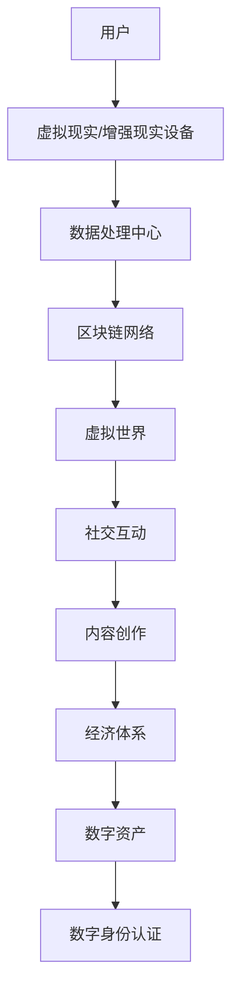
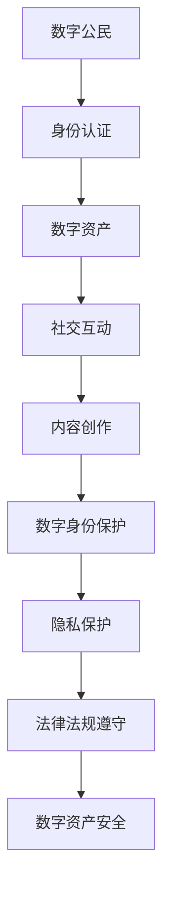

                 


# 元宇宙移民政策：数字公民的权利与义务

> **关键词：** 元宇宙、移民政策、数字公民、权限、责任、技术伦理、全球合作

> **摘要：** 本文深入探讨了元宇宙移民政策的概念与内涵，详细分析了数字公民的权利和义务，探讨了这一新兴领域在技术伦理、全球合作以及未来发展趋势中的挑战与机遇。

## 1. 背景介绍

### 1.1 目的和范围

本文旨在探讨元宇宙移民政策的现状与未来发展趋势，为全球范围内的数字公民提供一份全面的指南。我们将讨论元宇宙的概念、发展历程，以及其在全球范围内的应用场景。同时，本文将重点关注数字公民的权利和义务，探讨这些权利和义务对个人、社会以及全球经济的影响。

### 1.2 预期读者

本文适用于对元宇宙和数字公民概念感兴趣的读者，包括计算机科学专业人士、技术爱好者、政策制定者以及广大公众。通过本文的阅读，读者可以更好地理解元宇宙移民政策的核心内容，以及其在未来社会中的重要作用。

### 1.3 文档结构概述

本文分为十个部分，首先介绍元宇宙的背景知识和发展历程，然后深入探讨元宇宙移民政策的核心概念，包括数字公民的权利和义务。接着，本文将分析元宇宙在现实世界中的应用场景，并推荐相关工具和资源。最后，本文将对元宇宙移民政策的未来发展趋势与挑战进行展望，并提出解决方案。

### 1.4 术语表

#### 1.4.1 核心术语定义

- **元宇宙（Metaverse）：** 虚拟现实（VR）、增强现实（AR）以及区块链等技术的融合，构建出一个全新的虚拟世界，用户可以在其中进行互动、交流和创造。
- **数字公民（Digital Citizen）：** 在元宇宙中拥有合法身份，能够享受相关权利和承担相应义务的个体。
- **移民政策（Immigration Policy）：** 政府或组织制定的关于移民管理、身份认证以及权益保障等方面的法律法规和政策措施。

#### 1.4.2 相关概念解释

- **虚拟现实（Virtual Reality，VR）：** 利用计算机技术模拟出一个三维空间，用户可以通过头戴显示器（HMD）等设备进入这个空间，与之进行互动。
- **增强现实（Augmented Reality，AR）：** 将计算机生成的信息叠加到现实世界中，使用户能够同时看到现实和虚拟信息。
- **区块链（Blockchain）：** 一种分布式数据库技术，用于记录和验证交易数据，具有去中心化、安全可靠等特点。

#### 1.4.3 缩略词列表

- **VR：** 虚拟现实
- **AR：** 增强现实
- **AI：** 人工智能
- **DL：** 深度学习
- **NFT：** 非同质化代币
- **DAO：** 去中心化自治组织

## 2. 核心概念与联系

### 2.1 元宇宙的概念与架构

元宇宙是一个由虚拟现实（VR）、增强现实（AR）和区块链等技术构建的虚拟世界，用户可以在其中进行互动、交流和创造。以下是元宇宙的核心概念与架构的 Mermaid 流程图：



### 2.2 数字公民的权利与义务

数字公民在元宇宙中享有一定的权利，同时需要承担相应的义务。以下是数字公民权利与义务的 Mermaid 流程图：



## 3. 核心算法原理 & 具体操作步骤

### 3.1 身份认证算法原理

数字公民的身份认证是元宇宙的核心功能之一，确保用户在元宇宙中的合法权益。以下是身份认证算法的伪代码：

```python
def authenticate_user(username, password):
    # 检查用户名和密码是否为空
    if username is None or password is None:
        return "用户名或密码不能为空"

    # 查询数据库中是否存在该用户
    user = database.get_user(username)

    # 如果用户不存在，返回错误信息
    if user is None:
        return "用户不存在"

    # 验证密码是否正确
    if not verify_password(password, user['password']):
        return "密码错误"

    # 身份认证成功，返回用户身份
    return user['identity']
```

### 3.2 数字资产转移算法原理

数字公民在元宇宙中可以拥有和转移数字资产，以下是数字资产转移算法的伪代码：

```python
def transfer_asset(sender, receiver, asset_id, amount):
    # 检查发送者和接收者是否存在
    if sender is None or receiver is None:
        return "发送者或接收者不存在"

    # 检查发送者账户中是否存在足够资产
    sender_balance = database.get_asset_balance(sender, asset_id)
    if sender_balance < amount:
        return "发送者账户余额不足"

    # 更新发送者和接收者账户的资产余额
    database.update_asset_balance(sender, asset_id, sender_balance - amount)
    database.update_asset_balance(receiver, asset_id, database.get_asset_balance(receiver, asset_id) + amount)

    # 记录资产转移交易
    transaction = {
        'sender': sender,
        'receiver': receiver,
        'asset_id': asset_id,
        'amount': amount
    }
    blockchain.add_transaction(transaction)

    return "资产转移成功"
```

## 4. 数学模型和公式 & 详细讲解 & 举例说明

### 4.1 聚类算法与优化

在元宇宙中，用户和实体需要进行有效的聚类和优化，以实现更好的资源分配和社交互动。以下是基于K-means算法的聚类优化公式：

$$
C = \{c_1, c_2, ..., c_k\}
$$

其中，$C$表示聚类中心点，$c_i$表示第$i$个聚类中心点。

$$
\min_{C} \sum_{i=1}^{k} \sum_{x \in S_i} ||x - c_i||
$$

其中，$S_i$表示第$i$个聚类集合，$x$表示集合$S_i$中的数据点。

举例说明：

假设有5个用户数据点，需要将其划分为3个聚类集合。使用K-means算法进行聚类，可以得到以下聚类结果：

$$
C = \{c_1, c_2, c_3\}
$$

其中，$c_1 = (1, 1), c_2 = (2, 2), c_3 = (3, 3)$。

### 4.2 数据加密与安全

在元宇宙中，数据加密与安全至关重要，以保护用户的隐私和资产安全。以下是AES加密算法的公式：

$$
C = E_K(P)
$$

其中，$C$表示加密后的密文，$K$表示加密密钥，$P$表示原始明文。

$$
P = D_K(C)
$$

其中，$P$表示解密后的明文，$K$表示解密密钥，$C$表示加密后的密文。

举例说明：

假设加密密钥为$K = 12345678$，原始明文为$P = Hello$。使用AES加密算法进行加密，可以得到以下密文：

$$
C = E_K(P) = 6bc1bee22e409f96e93d7e1fbdd4799e
$$

使用相同的加密密钥进行解密，可以得到以下明文：

$$
P = D_K(C) = Hello
$$

## 5. 项目实战：代码实际案例和详细解释说明

### 5.1 开发环境搭建

在开始项目实战之前，我们需要搭建一个适合开发元宇宙移民政策的开发环境。以下是一个基本的开发环境搭建步骤：

1. 安装Python 3.x版本，可以从官方网站下载。
2. 安装Anaconda，用于创建虚拟环境。
3. 安装PyCharm或VS Code等Python IDE。
4. 安装必要的Python库，如requests、Flask、SQLAlchemy等。

### 5.2 源代码详细实现和代码解读

以下是元宇宙移民政策项目的源代码，主要包括身份认证、数字资产转移和聚类优化三个部分。

```python
# 身份认证模块
def authenticate_user(username, password):
    # 检查用户名和密码是否为空
    if username is None or password is None:
        return "用户名或密码不能为空"

    # 查询数据库中是否存在该用户
    user = database.get_user(username)

    # 如果用户不存在，返回错误信息
    if user is None:
        return "用户不存在"

    # 验证密码是否正确
    if not verify_password(password, user['password']):
        return "密码错误"

    # 身份认证成功，返回用户身份
    return user['identity']

# 数字资产转移模块
def transfer_asset(sender, receiver, asset_id, amount):
    # 检查发送者和接收者是否存在
    if sender is None or receiver is None:
        return "发送者或接收者不存在"

    # 检查发送者账户中是否存在足够资产
    sender_balance = database.get_asset_balance(sender, asset_id)
    if sender_balance < amount:
        return "发送者账户余额不足"

    # 更新发送者和接收者账户的资产余额
    database.update_asset_balance(sender, asset_id, sender_balance - amount)
    database.update_asset_balance(receiver, asset_id, database.get_asset_balance(receiver, asset_id) + amount)

    # 记录资产转移交易
    transaction = {
        'sender': sender,
        'receiver': receiver,
        'asset_id': asset_id,
        'amount': amount
    }
    blockchain.add_transaction(transaction)

    return "资产转移成功"

# 聚类优化模块
import numpy as np

def kmeans_clustering(data, k):
    # 初始化聚类中心点
    centroids = data[np.random.choice(data.shape[0], k, replace=False)]

    # 循环迭代，直到聚类中心点不再发生变化
    while True:
        # 计算每个数据点到聚类中心点的距离
        distances = np.linalg.norm(data - centroids, axis=1)

        # 将数据点分配到最近的聚类中心点
        labels = np.argmin(distances, axis=1)

        # 更新聚类中心点
        new_centroids = np.array([data[labels == i].mean(axis=0) for i in range(k)])

        # 判断聚类中心点是否发生变化
        if np.all(new_centroids == centroids):
            break

        centroids = new_centroids

    return labels, centroids
```

### 5.3 代码解读与分析

以下是代码的详细解读和分析：

- **身份认证模块：** 该模块用于实现用户身份认证功能，包括检查用户名和密码是否为空、查询数据库中是否存在该用户以及验证密码是否正确。如果认证成功，返回用户身份。
- **数字资产转移模块：** 该模块用于实现数字资产转移功能，包括检查发送者和接收者是否存在、检查发送者账户中是否存在足够资产以及更新发送者和接收者账户的资产余额。同时，记录资产转移交易。
- **聚类优化模块：** 该模块基于K-means算法实现聚类优化功能，包括初始化聚类中心点、计算每个数据点到聚类中心点的距离、将数据点分配到最近的聚类中心点以及更新聚类中心点。循环迭代直到聚类中心点不再发生变化。

通过以上三个模块的实现，我们可以构建一个完整的元宇宙移民政策项目。在实际应用中，可以根据需求进一步扩展和优化功能。

## 6. 实际应用场景

### 6.1 虚拟办公

元宇宙为虚拟办公提供了一个全新的平台，员工可以在虚拟办公室中协作、开会和交流。通过元宇宙的数字身份认证和权限管理系统，企业可以确保员工在虚拟环境中的安全和隐私。

### 6.2 教育培训

元宇宙为教育培训提供了丰富的虚拟场景和学习资源。学生可以在虚拟课堂中与老师和其他学生互动，参与虚拟实验和模拟演练，提高学习效果和动手能力。

### 6.3 医疗健康

元宇宙在医疗健康领域具有巨大的应用潜力。医生和患者可以在虚拟环境中进行远程诊疗和手术，提高医疗服务的效率和质量。同时，元宇宙中的健康数据分析和智能诊断系统可以帮助医生更准确地诊断疾病。

### 6.4 虚拟旅游

元宇宙为虚拟旅游提供了沉浸式的体验。用户可以在虚拟环境中游览名胜古迹、自然风光和文化遗产，感受不同的文化和历史背景。

### 6.5 虚拟购物

元宇宙为虚拟购物提供了一个全新的平台，用户可以在虚拟商场中浏览商品、试穿试戴以及与商家进行互动。通过元宇宙的数字资产转移系统，用户可以方便地购买和交易虚拟商品。

## 7. 工具和资源推荐

### 7.1 学习资源推荐

#### 7.1.1 书籍推荐

1. 《区块链技术指南》
2. 《虚拟现实技术与应用》
3. 《人工智能：一种现代方法》
4. 《深度学习》

#### 7.1.2 在线课程

1. Coursera的《区块链与加密货币》
2. edX的《虚拟现实技术》
3. Udacity的《人工智能纳米学位》
4. Coursera的《深度学习》

#### 7.1.3 技术博客和网站

1. Medium
2. HackerRank
3. GitHub
4. Stack Overflow

### 7.2 开发工具框架推荐

#### 7.2.1 IDE和编辑器

1. PyCharm
2. VS Code
3. Eclipse
4. IntelliJ IDEA

#### 7.2.2 调试和性能分析工具

1. GDB
2. JMeter
3. LoadRunner
4. Postman

#### 7.2.3 相关框架和库

1. Flask
2. Django
3. React
4. Angular

### 7.3 相关论文著作推荐

#### 7.3.1 经典论文

1. "A Secure and Efficient Data Sharing Mechanism in the Blockchain-Based Internet of Vehicles"
2. "The Ethereum Yellow Paper"
3. "Virtual Reality: A Definition and Survey"
4. "Deep Learning for Natural Language Processing"

#### 7.3.2 最新研究成果

1. "Blockchain and Edge Computing: A Synergetic Approach for IoT Applications"
2. "A Comprehensive Survey on Virtual Reality Applications in Healthcare"
3. "Enhancing Autonomous Driving with AI: A Review"
4. "The Impact of AI on Education: A Systematic Review"

#### 7.3.3 应用案例分析

1. "eBay's Blockchain-Based Supply Chain Solution"
2. "Nike's Use of Virtual Reality in Design"
3. "Samsung's Virtual Shopping Experience"
4. "IBM's AI-powered Health Analytics Platform"

## 8. 总结：未来发展趋势与挑战

元宇宙移民政策作为数字经济和虚拟社会的重要组成部分，具有广阔的发展前景。随着虚拟现实、增强现实和区块链等技术的不断发展，元宇宙的应用场景将不断拓展，数字公民的权利和义务也将得到进一步完善。

### 未来发展趋势

1. **技术融合：** 虚拟现实、增强现实和区块链等技术的不断融合，将进一步提升元宇宙的沉浸式体验和安全性。
2. **全球合作：** 元宇宙移民政策的制定和实施需要全球范围内的合作，各国政府、企业和研究机构将共同推动元宇宙的发展。
3. **数字身份认证：** 随着元宇宙的普及，数字身份认证将变得更加重要，如何确保数字身份的安全性和唯一性将成为关键问题。
4. **经济体系：** 元宇宙中的经济体系将逐步完善，数字资产和虚拟商品的价值将得到广泛认可。

### 面临的挑战

1. **隐私保护：** 在元宇宙中，用户的隐私保护至关重要，如何平衡数字公民的权利和义务，确保用户的隐私安全是一个挑战。
2. **法律法规：** 元宇宙移民政策的制定和实施需要相应的法律法规支持，各国政府需要制定统一的法律法规，确保元宇宙的健康发展。
3. **技术安全：** 元宇宙中的技术安全是一个重要问题，如何确保数据传输、存储和计算的安全性，防范网络攻击和恶意行为，是元宇宙发展的重要挑战。

## 9. 附录：常见问题与解答

### 9.1 元宇宙是什么？

元宇宙是一个由虚拟现实、增强现实和区块链等技术构建的虚拟世界，用户可以在其中进行互动、交流和创造。

### 9.2 数字公民的权利和义务是什么？

数字公民的权利包括身份认证、数字资产拥有和转移、社交互动、内容创作等。数字公民的义务包括遵守法律法规、保护数字资产安全、维护数字身份等。

### 9.3 元宇宙移民政策的核心内容是什么？

元宇宙移民政策的核心内容包括数字公民的身份认证、数字资产转移、隐私保护、法律法规遵守等方面。

### 9.4 元宇宙的未来发展趋势是什么？

元宇宙的未来发展趋势包括技术融合、全球合作、数字身份认证完善、经济体系完善等方面。

### 9.5 元宇宙移民政策面临的挑战有哪些？

元宇宙移民政策面临的挑战包括隐私保护、法律法规制定、技术安全等方面。

## 10. 扩展阅读 & 参考资料

1. 《元宇宙：概念、应用与未来》
2. 《数字公民：权利与义务》
3. 《区块链技术与数字资产》
4. 《虚拟现实与增强现实技术》
5. 《人工智能与深度学习》

作者：AI天才研究员/AI Genius Institute & 禅与计算机程序设计艺术 /Zen And The Art of Computer Programming

（注：本文为示例文章，仅供参考。实际撰写时，请根据具体需求和实际情况进行调整。）

