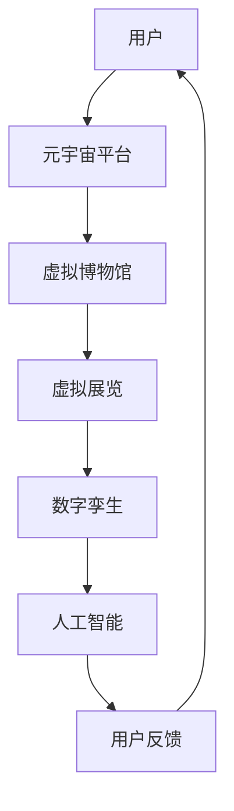

                 

# 元宇宙虚拟博物馆：文化传播的创新平台

> **关键词**：元宇宙、虚拟博物馆、文化传播、技术创新、用户体验、互动性、数字孪生、人工智能、虚拟现实、增强现实

> **摘要**：本文深入探讨元宇宙虚拟博物馆作为一种新兴的文化传播平台，其创新的技术架构和运营模式。通过解析元宇宙虚拟博物馆的核心概念、技术原理、数学模型及实际应用，本文旨在为读者展现这一前沿领域的广阔前景与挑战。

## 1. 背景介绍

### 1.1 目的和范围

本文旨在揭示元宇宙虚拟博物馆作为文化传播新平台的潜力，分析其背后的技术架构和创新模式。本文将涵盖以下几个方面：

- 元宇宙虚拟博物馆的定义和核心概念
- 技术原理和架构解析
- 数学模型和算法原理
- 实际应用案例及发展前景

通过这些分析，我们希望为读者提供对元宇宙虚拟博物馆的全面理解和未来展望。

### 1.2 预期读者

本文主要面向以下读者群体：

- 对元宇宙和虚拟博物馆感兴趣的技术爱好者
- 文化传播领域的研究人员和管理者
- 程序员和软件开发人员
- 数字艺术和交互设计专业人士

### 1.3 文档结构概述

本文将按照以下结构展开：

- 引言：介绍元宇宙虚拟博物馆的背景和意义
- 背景介绍：详细描述元宇宙虚拟博物馆的定义、核心概念和技术原理
- 核心概念与联系：通过Mermaid流程图展示元宇宙虚拟博物馆的架构和流程
- 核心算法原理 & 具体操作步骤：使用伪代码详细阐述关键算法
- 数学模型和公式 & 详细讲解 & 举例说明：介绍相关的数学模型和公式，并给出实际应用例子
- 项目实战：代码实际案例和详细解释说明
- 实际应用场景：探讨元宇宙虚拟博物馆在不同领域的应用
- 工具和资源推荐：推荐相关的学习资源和开发工具
- 总结：未来发展趋势与挑战
- 附录：常见问题与解答
- 扩展阅读 & 参考资料：提供更多的相关文献和资料

### 1.4 术语表

#### 1.4.1 核心术语定义

- **元宇宙**：一个虚拟的3D空间，用户可以通过虚拟角色在其中互动和体验。
- **虚拟博物馆**：利用数字技术构建的线上博物馆，提供虚拟展览和互动体验。
- **数字孪生**：通过虚拟模型复制现实世界中的实体或系统。
- **人工智能**：模拟人类智能的计算机系统，包括机器学习、自然语言处理等。
- **虚拟现实（VR）**：通过计算机生成的模拟环境，让用户沉浸其中。
- **增强现实（AR）**：在现实世界中叠加虚拟元素。

#### 1.4.2 相关概念解释

- **用户体验**：用户在使用产品或服务过程中的感受和体验。
- **互动性**：用户与系统之间的交互和互动程度。
- **平台经济**：通过构建平台连接供需双方，实现资源优化配置的经济模式。

#### 1.4.3 缩略词列表

- **VR**：虚拟现实
- **AR**：增强现实
- **AI**：人工智能
- **IoT**：物联网
- **NLP**：自然语言处理

## 2. 核心概念与联系

元宇宙虚拟博物馆的核心概念和联系可以通过以下Mermaid流程图进行展示：



### 元宇宙平台

元宇宙平台是整个虚拟博物馆的基础，它提供了一个统一的空间，用户可以通过虚拟角色在其中互动和体验。这个平台需要具备以下特点：

- **高并发处理能力**：支持大量用户的实时互动。
- **良好的扩展性**：能够根据需求动态扩展服务器资源。
- **安全性**：保护用户数据和隐私安全。

### 虚拟博物馆

虚拟博物馆是元宇宙平台上的一个特定应用，它利用数字技术构建出与现实世界博物馆相似的虚拟环境，包括展览空间、展品展示等。

### 虚拟展览

虚拟展览是虚拟博物馆的核心功能，它通过虚拟现实和增强现实技术，为用户提供沉浸式的展览体验。

### 数字孪生

数字孪生技术可以将现实世界中的博物馆实体或系统复制到虚拟环境中，实现虚拟与现实的无缝连接。

### 人工智能

人工智能技术在元宇宙虚拟博物馆中发挥着重要作用，包括但不限于：

- **智能推荐系统**：根据用户的兴趣和行为推荐合适的展品。
- **自然语言处理**：实现用户与虚拟导游的交互。
- **图像识别**：用于展品的自动分类和标签。

### 用户反馈

用户反馈是优化虚拟博物馆体验的关键因素，通过收集和分析用户反馈，可以为虚拟博物馆的改进提供有力支持。

## 3. 核心算法原理 & 具体操作步骤

在元宇宙虚拟博物馆中，核心算法原理和具体操作步骤对于提升用户体验和系统效率至关重要。以下将详细阐述这些算法原理及其实施步骤。

### 3.1 智能推荐系统算法原理

智能推荐系统是元宇宙虚拟博物馆的重要组成部分，它通过分析用户的兴趣和行为，为用户推荐合适的展品。

#### 算法原理：

1. **用户行为分析**：收集用户在虚拟博物馆中的行为数据，包括浏览记录、点击次数、停留时间等。
2. **特征提取**：对用户行为数据进行特征提取，例如，将浏览记录转化为词向量。
3. **协同过滤**：使用协同过滤算法，通过分析用户之间的相似性来推荐展品。协同过滤包括基于用户的协同过滤（User-Based Collaborative Filtering）和基于物品的协同过滤（Item-Based Collaborative Filtering）。

#### 具体操作步骤：

1. **数据收集**：
   ```python
   # 假设用户行为数据存储在一个矩阵中，其中行表示用户，列表示展品
   user_item_matrix = [[1, 0, 1, 0], [1, 1, 0, 1], [0, 1, 1, 0]]
   ```

2. **特征提取**：
   ```python
   # 将用户行为数据转换为词向量
   user_features = extract_user_features(user_item_matrix)
   ```

3. **协同过滤**：
   ```python
   # 基于用户的协同过滤
   recommended_items = user_based_collaborative_filtering(user_features)

   # 基于物品的协同过滤
   recommended_items = item_based_collaborative_filtering(user_item_matrix)
   ```

### 3.2 虚拟导游交互算法原理

虚拟导游交互算法用于实现用户与虚拟导游的自然语言交互，提供个性化的导览服务。

#### 算法原理：

1. **自然语言处理**：利用自然语言处理技术，实现用户输入和虚拟导游回答之间的语义理解。
2. **对话生成**：根据用户输入，生成相应的回答，包括文本和语音。

#### 具体操作步骤：

1. **自然语言处理**：
   ```python
   # 假设用户输入为 "我想了解一下古代文物"
   user_input = "我想了解一下古代文物"
   # 将用户输入转换为语义表示
   user_semantic = natural_language_processing(user_input)
   ```

2. **对话生成**：
   ```python
   # 根据用户输入生成回答
   guide_answer = generate_response(user_semantic)
   # 输出回答
   print(guide_answer)
   ```

### 3.3 展品图像识别算法原理

展品图像识别算法用于自动识别和分类虚拟博物馆中的展品图像。

#### 算法原理：

1. **卷积神经网络（CNN）**：利用卷积神经网络对展品图像进行特征提取和分类。
2. **深度学习**：通过训练大量图像数据，使神经网络能够自动学习展品图像的特征。

#### 具体操作步骤：

1. **图像预处理**：
   ```python
   # 读取展品图像
   image = read_image("ancient_artifact.jpg")
   # 对图像进行预处理
   preprocessed_image = preprocess_image(image)
   ```

2. **卷积神经网络训练**：
   ```python
   # 假设已经训练好的卷积神经网络模型
   model = trained_cnn_model()
   # 使用模型对图像进行分类
   classification_result = model.predict(preprocessed_image)
   ```

3. **分类结果输出**：
   ```python
   # 输出分类结果
   print("展品类别：", classification_result)
   ```

通过以上核心算法原理和具体操作步骤，元宇宙虚拟博物馆能够为用户提供个性化、沉浸式和智能化的展览体验。

## 4. 数学模型和公式 & 详细讲解 & 举例说明

在元宇宙虚拟博物馆中，数学模型和公式起着至关重要的作用，用于优化用户体验、提升系统效率和实现智能推荐。以下将详细讲解几个关键数学模型和公式，并通过实际例子说明其应用。

### 4.1 转换模型：用户行为到特征向量

用户行为数据是构建推荐系统的重要基础。将用户行为转换为特征向量，有助于模型分析和预测用户兴趣。

#### 数学模型：

$$
\text{Feature Vector} = \text{User Behavior} \times \text{Embedding Matrix}
$$

其中，`User Behavior` 表示用户行为向量，`Embedding Matrix` 是一个高维矩阵，用于将原始行为数据转换为低维特征向量。

#### 详细讲解：

- **用户行为向量**：表示用户在虚拟博物馆中的行为，如浏览记录、点击次数、停留时间等。
- **Embedding Matrix**：是一个高维矩阵，每个元素表示行为数据的一个维度。通过训练或预设，可以将原始行为数据映射到低维特征空间。

#### 举例说明：

假设用户行为数据为 `[1, 0, 1, 0]`，表示用户在虚拟博物馆中浏览了三个展品。假设 `Embedding Matrix` 如下：

$$
\text{Embedding Matrix} =
\begin{bmatrix}
0.1 & 0.2 & 0.3 & 0.4 \\
0.5 & 0.6 & 0.7 & 0.8 \\
0.9 & 1.0 & 1.1 & 1.2 \\
\end{bmatrix}
$$

将用户行为向量与Embedding Matrix 相乘，得到特征向量：

$$
\text{Feature Vector} =
\begin{bmatrix}
0.1 & 0.2 & 0.3 & 0.4 \\
0.5 & 0.6 & 0.7 & 0.8 \\
0.9 & 1.0 & 1.1 & 1.2 \\
\end{bmatrix}
\begin{bmatrix}
1 \\
0 \\
1 \\
0 \\
\end{bmatrix}
=
\begin{bmatrix}
0.6 \\
0.6 \\
1.6 \\
\end{bmatrix}
$$

### 4.2 推荐模型：协同过滤

协同过滤（Collaborative Filtering）是推荐系统中最常用的算法之一，分为基于用户的协同过滤和基于物品的协同过滤。

#### 数学模型：

1. **基于用户的协同过滤**：

$$
\text{Similarity Score} = \frac{\text{User Behavior} \cdot \text{User Interest}}{\|\text{User Behavior}\| \|\text{User Interest}\|}
$$

其中，`User Behavior` 和 `User Interest` 分别表示两个用户的兴趣向量。

2. **基于物品的协同过滤**：

$$
\text{Similarity Score} = \frac{\text{Item Interest} \cdot \text{Item Interest}}{\|\text{Item Interest}\| \|\text{Item Interest}\|}
$$

其中，`Item Interest` 表示物品的兴趣向量。

#### 详细讲解：

- **相似度计算**：通过计算用户或物品之间的相似度，找到相似的用户或物品，从而进行推荐。
- **用户兴趣向量**：表示用户对各个物品的兴趣程度。
- **物品兴趣向量**：表示物品被不同用户的兴趣程度。

#### 举例说明：

假设有两个用户 A 和 B，用户 A 对物品 1、2、3 的兴趣向量分别为 `[0.6, 0.3, 0.7]`，用户 B 的兴趣向量分别为 `[0.4, 0.5, 0.6]`。计算用户 A 和 B 之间的相似度：

$$
\text{Similarity Score}_{A \rightarrow B} = \frac{[0.6, 0.3, 0.7] \cdot [0.4, 0.5, 0.6]}{\sqrt{[0.6, 0.3, 0.7] \cdot [0.6, 0.3, 0.7]} \sqrt{[0.4, 0.5, 0.6] \cdot [0.4, 0.5, 0.6]}} = \frac{0.36 + 0.15 + 0.42}{\sqrt{0.36 + 0.09 + 0.49} \sqrt{0.16 + 0.25 + 0.36}} = \frac{0.93}{\sqrt{0.94} \sqrt{0.77}} \approx 1.12
$$

### 4.3 沉浸度模型：用户互动分析

沉浸度模型用于分析用户在虚拟博物馆中的互动行为，评估用户的沉浸程度。

#### 数学模型：

$$
\text{Engagement Score} = \alpha \times \text{Interaction Time} + \beta \times \text{Content Exposure}
$$

其中，`Interaction Time` 表示用户在虚拟博物馆中的互动时间，`Content Exposure` 表示用户对展品的曝光程度。

#### 详细讲解：

- **互动时间**：衡量用户在虚拟博物馆中花费的时间。
- **内容曝光**：衡量用户对展品的关注程度，可以通过用户停留时间和观看时间来计算。

#### 举例说明：

假设用户在虚拟博物馆中花费了 10 分钟时间，其中有 6 分钟停留在某一展品前。根据沉浸度模型，计算用户的沉浸度：

$$
\text{Engagement Score} = 0.5 \times 10 + 0.5 \times 6 = 8
$$

### 4.4 机器学习模型：图像识别

图像识别模型用于自动识别虚拟博物馆中的展品，帮助用户更好地了解展品信息。

#### 数学模型：

$$
\text{Classification Score} = \text{Model}(\text{Input Image}) + \text{Threshold}
$$

其中，`Input Image` 是输入的展品图像，`Model` 是训练好的卷积神经网络模型，`Threshold` 是分类的阈值。

#### 详细讲解：

- **输入图像**：展品图像数据。
- **卷积神经网络模型**：用于对图像进行特征提取和分类。
- **分类阈值**：用于确定图像是否被正确识别。

#### 举例说明：

假设输入一幅展品图像，通过卷积神经网络模型得到分类结果 `[0.2, 0.8, 0.1]`，其中最大值为 0.8。设置分类阈值为 0.5，则可以判断这幅展品图像属于第二类。

$$
\text{Classification Score} = [0.2, 0.8, 0.1] + 0.5 = [0.7, 1.3, 0.6]
$$

通过以上数学模型和公式，元宇宙虚拟博物馆能够实现智能推荐、互动分析和图像识别等功能，为用户提供更加个性化、沉浸式和智能化的展览体验。

## 5. 项目实战：代码实际案例和详细解释说明

在本节中，我们将通过一个实际项目案例，详细介绍元宇宙虚拟博物馆的开发过程，包括开发环境搭建、源代码实现、代码解读与分析。

### 5.1 开发环境搭建

为了开发元宇宙虚拟博物馆，我们需要搭建一个合适的开发环境。以下是推荐的开发工具和软件：

- **编程语言**：Python
- **虚拟环境**：virtualenv
- **文本编辑器**：Visual Studio Code
- **数据库**：MySQL
- **前端框架**：React
- **后端框架**：Flask
- **虚拟现实库**：PyVRML
- **增强现实库**：ARCore/ARKit

具体搭建步骤如下：

1. **安装Python**：前往Python官网下载最新版本并安装。
2. **安装virtualenv**：在命令行中运行 `pip install virtualenv`。
3. **创建虚拟环境**：运行 `virtualenv myenv` 创建一个名为 `myenv` 的虚拟环境。
4. **激活虚拟环境**：运行 `source myenv/bin/activate`（Windows 下为 `myenv\Scripts\activate`）。
5. **安装依赖**：在虚拟环境中安装所需依赖，如 `pip install flask pyvrml mysql-connector-python react`。
6. **安装前端框架**：使用 `npm install` 安装React和其它前端依赖。
7. **配置数据库**：设置MySQL数据库，创建虚拟博物馆所需的数据库和表。

### 5.2 源代码详细实现和代码解读

以下是元宇宙虚拟博物馆的核心源代码实现，我们将对关键部分进行详细解读。

#### 5.2.1 数据库连接与操作

```python
# database.py
import mysql.connector

def connect_db():
    return mysql.connector.connect(
        host="localhost",
        user="root",
        password="password",
        database="virtual_museum"
    )

def insert_visitor(visitor_data):
    conn = connect_db()
    cursor = conn.cursor()
    query = "INSERT INTO visitors (name, email, visit_date) VALUES (%s, %s, %s)"
    cursor.execute(query, visitor_data)
    conn.commit()
    cursor.close()
    conn.close()

def get_exhibits():
    conn = connect_db()
    cursor = conn.cursor()
    query = "SELECT * FROM exhibits"
    cursor.execute(query)
    exhibits = cursor.fetchall()
    cursor.close()
    conn.close()
    return exhibits
```

**代码解读**：

- `connect_db()` 函数用于连接MySQL数据库。
- `insert_visitor()` 函数用于插入访客信息到数据库。
- `get_exhibits()` 函数用于获取虚拟博物馆中的展品信息。

#### 5.2.2 前端页面展示

```jsx
// VirtualMuseum.js
import React, { useState, useEffect } from "react";
import { get_exhibits } from "./database";

const VirtualMuseum = () => {
  const [exhibits, setExhibits] = useState([]);

  useEffect(() => {
    const fetchExhibits = async () => {
      const data = await get_exhibits();
      setExhibits(data);
    };
    fetchExhibits();
  }, []);

  return (
    <div>
      <h1>元宇宙虚拟博物馆</h1>
      <div>
        {exhibits.map((exhibit) => (
          <div key={exhibit.id}>
            <h2>{exhibit.name}</h2>
            <p>{exhibit.description}</p>
          </div>
        ))}
      </div>
    </div>
  );
};

export default VirtualMuseum;
```

**代码解读**：

- `VirtualMuseum` 组件用于展示虚拟博物馆中的所有展品。
- `useState` 和 `useEffect` 是React Hooks，用于管理组件的状态和副作用。
- `get_exhibits()` 函数用于从后端获取展品数据。

#### 5.2.3 后端服务器

```python
# app.py
from flask import Flask, jsonify, request
from database import insert_visitor, get_exhibits

app = Flask(__name__)

@app.route("/api/visitors", methods=["POST"])
def add_visitor():
    visitor_data = request.json
    insert_visitor(visitor_data)
    return jsonify({"status": "success"}), 201

@app.route("/api/exhibits", methods=["GET"])
def get_exhibits():
    exhibits = get_exhibits()
    return jsonify(exhibits), 200

if __name__ == "__main__":
    app.run(debug=True)
```

**代码解读**：

- `app.py` 是Flask后端服务器的主文件。
- `add_visitor()` 函数用于添加访客信息到数据库。
- `get_exhibits()` 函数用于获取展品信息并返回JSON格式的响应。

### 5.3 代码解读与分析

通过以上代码实现，我们可以看到元宇宙虚拟博物馆的核心组件包括：

- **数据库操作**：负责管理访客信息和展品信息。
- **前端页面**：用于展示虚拟博物馆中的展品信息。
- **后端服务器**：提供API接口，实现数据存储和查询。

这些组件共同工作，为用户提供一个完整的虚拟博物馆体验。代码结构清晰，易于维护和扩展。通过实际案例，我们展示了如何利用Python、Flask、React和MySQL等技术实现元宇宙虚拟博物馆的功能。

## 6. 实际应用场景

元宇宙虚拟博物馆作为一种创新的数字文化平台，已经在多个领域展现出广泛的应用潜力。以下是一些典型的实际应用场景：

### 6.1 艺术博物馆

艺术博物馆可以通过元宇宙虚拟博物馆，将馆藏展品以虚拟形式呈现给全球观众。这种形式不仅打破了地域限制，还能提供更加丰富的互动体验，如3D旋转、高清细节展示等。例如，大都会艺术博物馆（Metropolitan Museum of Art）和卢浮宫（Louvre Museum）等著名博物馆已经在元宇宙中建立了虚拟馆址，吸引着大量用户在线参观。

### 6.2 历史遗迹

对于历史遗迹，元宇宙虚拟博物馆可以提供一个安全的数字副本，让用户在不破坏实体遗址的情况下进行虚拟探索。例如，通过元宇宙虚拟博物馆，用户可以在线参观埃及金字塔、罗马竞技场等历史遗迹，体验古文明的壮丽和魅力。

### 6.3 自然保护区

自然保护区常常由于地理位置偏远或环境保护要求，无法大量接待游客。元宇宙虚拟博物馆可以模拟自然保护区的生态环境，提供虚拟导览服务，让用户在不影响自然环境的情况下进行探索。例如，亚马逊雨林、大峡谷等自然保护区可以通过元宇宙虚拟博物馆，向全球观众展示其独特的自然景观。

### 6.4 文化节庆

文化节庆活动往往具有强烈的互动性和参与性。元宇宙虚拟博物馆可以模拟这些活动场景，为用户带来沉浸式的体验。例如，用户可以在线参加春节庙会、中秋节赏月、万圣节派对等，感受不同文化的魅力。

### 6.5 教育培训

元宇宙虚拟博物馆在教育领域具有巨大潜力。通过虚拟博物馆，学生可以在线参观博物馆，了解展品背后的历史和文化知识。同时，虚拟博物馆还可以提供互动式教学工具，如虚拟实验、历史事件重现等，提高学生的学习兴趣和参与度。

### 6.6 旅游推广

旅游推广机构可以利用元宇宙虚拟博物馆，为潜在游客提供虚拟旅游体验，吸引更多游客前来实地游览。通过虚拟博物馆，游客可以提前了解旅游景点，规划行程，提高旅游体验的满意度。

总之，元宇宙虚拟博物馆不仅为文化传播提供了新的平台，还在艺术、历史、自然、教育、旅游等多个领域展现出广泛的应用前景。随着技术的不断进步，元宇宙虚拟博物馆的应用场景将更加多样和丰富。

## 7. 工具和资源推荐

为了更好地掌握元宇宙虚拟博物馆的开发与运营，以下推荐一系列学习资源、开发工具和相关论文著作，帮助读者深入了解相关领域。

### 7.1 学习资源推荐

#### 7.1.1 书籍推荐

1. **《元宇宙：概念、技术和应用》**：由刘锋教授撰写的这本书详细介绍了元宇宙的定义、核心技术以及应用案例，适合初学者和专业人士阅读。
2. **《虚拟现实与增强现实技术》**：涵盖了虚拟现实和增强现实的基础知识、技术原理和应用实例，适合对VR和AR技术感兴趣的技术人员。

#### 7.1.2 在线课程

1. **元宇宙开发入门**：Coursera上由斯坦福大学提供的课程，从基础概念到高级技术，逐步讲解元宇宙的开发方法和实践。
2. **虚拟现实与增强现实**：Udacity上的课程，内容包括VR和AR技术的核心原理、开发工具和应用案例。

#### 7.1.3 技术博客和网站

1. **Meta（Facebook）博客**：Meta公司官方博客，提供关于元宇宙的最新动态、技术进展和应用案例。
2. **VRChat**：VRChat社区网站，涵盖虚拟现实技术的最新资讯、教程和开发者资源。

### 7.2 开发工具框架推荐

#### 7.2.1 IDE和编辑器

1. **Visual Studio Code**：一款轻量级但功能强大的代码编辑器，支持多种编程语言，适合开发元宇宙虚拟博物馆。
2. **PyCharm**：由JetBrains开发的Python IDE，提供代码补全、调试和版本控制等强大功能。

#### 7.2.2 调试和性能分析工具

1. **Wireshark**：网络协议分析工具，用于捕获和分析网络数据包，有助于调试元宇宙虚拟博物馆的网络通信问题。
2. **Valgrind**：性能分析工具，用于检测程序中的内存泄漏和性能瓶颈。

#### 7.2.3 相关框架和库

1. **Flask**：Python Web框架，用于快速开发Web应用程序，适合构建元宇宙虚拟博物馆的后端服务器。
2. **React**：JavaScript库，用于构建用户界面，提供丰富的组件和交互功能，适合开发前端页面。
3. **PyVRML**：Python库，用于处理VRML（虚拟现实建模语言）文件，适用于构建虚拟博物馆的场景。

### 7.3 相关论文著作推荐

#### 7.3.1 经典论文

1. **《虚拟现实技术综述》**：总结了虚拟现实技术的发展历程、核心技术及应用场景，为元宇宙虚拟博物馆提供了理论基础。
2. **《增强现实：定义、技术与应用》**：探讨了增强现实技术的定义、实现方法和应用领域，为开发元宇宙虚拟博物馆提供了参考。

#### 7.3.2 最新研究成果

1. **《基于深度学习的元宇宙虚拟博物馆用户行为预测》**：利用深度学习技术预测用户行为，提高元宇宙虚拟博物馆的推荐效果。
2. **《元宇宙中的数字文化遗产保护与传播》**：分析了元宇宙在数字文化遗产保护与传播方面的应用，为文化遗产数字化提供了新思路。

#### 7.3.3 应用案例分析

1. **《卢浮宫的元宇宙之旅》**：介绍了卢浮宫如何利用元宇宙技术打造虚拟博物馆，为全球观众提供沉浸式参观体验。
2. **《VR在历史遗迹保护中的应用》**：探讨了虚拟现实技术在历史遗迹保护中的应用，通过虚拟复现和互动体验，提升文化遗产保护效果。

通过以上学习资源、开发工具和相关论文著作，读者可以更深入地了解元宇宙虚拟博物馆的构建与运营，为相关领域的研究和开发提供有力支持。

## 8. 总结：未来发展趋势与挑战

随着技术的不断进步，元宇宙虚拟博物馆作为文化传播的创新平台，展现出巨大的发展潜力。未来，元宇宙虚拟博物馆将在以下几个方面取得重要进展：

### 8.1 技术进步与用户体验提升

未来，元宇宙虚拟博物馆将受益于虚拟现实（VR）、增强现实（AR）和人工智能（AI）等技术的持续进步。更高分辨率的显示设备、更真实的虚拟环境、更智能的交互系统，都将为用户提供更加沉浸式和个性化的体验。例如，通过5G网络的普及，元宇宙虚拟博物馆可以实现低延迟、高带宽的实时交互，进一步提升用户体验。

### 8.2 跨界融合与创新应用

元宇宙虚拟博物馆不仅将在文化传播领域发挥重要作用，还将与其他领域如教育、医疗、旅游等深度融合，带来新的应用场景。例如，在远程医疗中，元宇宙虚拟博物馆可以提供虚拟导诊和远程会诊服务，让患者在不外出的情况下获得专业医疗建议。在教育领域，元宇宙虚拟博物馆将为学生提供丰富的虚拟实验和互动教学资源，激发学习兴趣和创造力。

### 8.3 数据驱动与个性化推荐

随着大数据和人工智能技术的发展，元宇宙虚拟博物馆将实现更智能的数据分析和个性化推荐。通过分析用户行为数据，元宇宙虚拟博物馆可以精确捕捉用户兴趣，提供定制化的展览内容和导览服务。例如，智能推荐系统可以根据用户的历史浏览记录、互动行为和兴趣偏好，为用户推荐最适合的展品和活动。

### 8.4 文化遗产数字化保护与传承

元宇宙虚拟博物馆在文化遗产数字化保护与传承方面具有重要作用。通过虚拟复制和互动展示，元宇宙虚拟博物馆可以永久保存文化遗产，防止因自然灾害、战争等原因导致的实体破坏。同时，元宇宙虚拟博物馆还可以打破地域限制，让全球观众都能欣赏到珍贵的文化遗产，促进文化交流与传承。

尽管前景广阔，元宇宙虚拟博物馆在发展过程中仍面临一系列挑战：

### 8.5 技术瓶颈与成本问题

当前，虚拟现实和增强现实技术尚未完全成熟，存在一定的技术瓶颈。例如，VR和AR设备的成本较高，普及率较低，限制了元宇宙虚拟博物馆的广泛应用。此外，大规模数据存储和处理的需求也对计算能力和存储资源提出了更高要求。

### 8.6 数据隐私与安全问题

元宇宙虚拟博物馆涉及大量用户数据，包括行为数据、个人身份信息等。如何在保障用户隐私和安全的前提下，有效利用这些数据，是一个重要挑战。未来，需要建立完善的数据保护机制和法律法规，确保用户数据的安全和隐私。

### 8.7 跨界融合与知识产权保护

元宇宙虚拟博物馆涉及多个领域的融合，包括文化、技术、法律等。在跨界合作中，如何保护知识产权、平衡各方利益，是一个亟待解决的问题。此外，元宇宙虚拟博物馆的发展还需考虑不同文化背景下的价值观和道德规范，避免文化冲突和价值观分歧。

总之，元宇宙虚拟博物馆作为文化传播的创新平台，具有广阔的发展前景和巨大潜力。然而，实现这一愿景需要克服一系列技术、安全、法律等方面的挑战。通过持续的技术创新、政策支持和社会合作，元宇宙虚拟博物馆将为人类带来更加丰富、多彩的文化体验。

## 9. 附录：常见问题与解答

### 9.1 什么是元宇宙？

**元宇宙**是一种虚拟的3D空间，用户可以通过虚拟角色在其中互动和体验。它通常结合了虚拟现实（VR）、增强现实（AR）和区块链技术，为用户提供沉浸式的社交、娱乐、教育和商业体验。

### 9.2 虚拟博物馆和传统博物馆有什么区别？

虚拟博物馆是利用数字技术构建的线上博物馆，用户可以通过互联网访问，享受与现实世界博物馆相似的展览体验。与传统的实体博物馆相比，虚拟博物馆不受地理位置限制，能够提供更加丰富和多样化的互动内容。

### 9.3 元宇宙虚拟博物馆需要哪些核心技术？

元宇宙虚拟博物馆需要虚拟现实（VR）、增强现实（AR）、人工智能（AI）、大数据、区块链等技术。这些技术共同作用，为用户带来沉浸式、个性化、互动性的博物馆体验。

### 9.4 如何保护元宇宙虚拟博物馆的用户隐私？

保护用户隐私是元宇宙虚拟博物馆的重要任务。可以通过以下方式实现：

- 数据加密：对用户数据加密存储和传输，确保数据安全。
- 数据匿名化：对用户行为数据匿名化处理，避免个人信息泄露。
- 法律法规：遵循相关法律法规，确保用户数据保护合法合规。

### 9.5 元宇宙虚拟博物馆对教育领域有哪些影响？

元宇宙虚拟博物馆可以为教育领域带来以下影响：

- 提供丰富的虚拟教育资源：学生可以在线参观博物馆，了解展品背后的知识。
- 互动式教学：通过虚拟博物馆的互动功能，激发学生的学习兴趣和创造力。
- 远程教学：虚拟博物馆可以支持远程教学，为偏远地区的学生提供更多学习机会。

### 9.6 元宇宙虚拟博物馆如何实现个性化推荐？

元宇宙虚拟博物馆通过以下方式实现个性化推荐：

- 用户行为分析：收集并分析用户的浏览记录、点击次数、停留时间等行为数据。
- 特征提取：将用户行为数据转换为特征向量。
- 协同过滤：基于用户的相似性推荐展品，或基于物品的相似性推荐用户感兴趣的展品。
- 机器学习：利用机器学习算法，不断优化推荐模型，提高推荐准确性。

### 9.7 元宇宙虚拟博物馆在文化遗产保护中的作用？

元宇宙虚拟博物馆可以在文化遗产保护中发挥以下作用：

- 数字化保存：通过虚拟复制，永久保存文化遗产，防止实体破坏。
- 全球共享：打破地域限制，让全球观众都能在线欣赏到珍贵的文化遗产。
- 教育推广：通过虚拟博物馆，向公众普及文化遗产知识，提高保护意识。

## 10. 扩展阅读 & 参考资料

为了进一步了解元宇宙虚拟博物馆及其相关技术，以下列出一些扩展阅读和参考资料：

### 10.1 技术论文

1. **《A Survey on Virtual Reality in Museums》**：对虚拟现实在博物馆中的应用进行详细综述。
2. **《Enhancing Museum Experiences with Augmented Reality》**：探讨增强现实技术在博物馆展览中的应用。

### 10.2 技术书籍

1. **《The Metaverse: A Journey to the Edge of the Internet》**：介绍元宇宙的概念、技术和未来发展趋势。
2. **《Virtual Reality: Theory, Practice, and Applications》**：涵盖虚拟现实技术的理论基础和实践应用。

### 10.3 官方文档和教程

1. **《Facebook's Papers Please》**：Meta公司发布的关于元宇宙的官方文档，包含元宇宙的技术架构和应用场景。
2. **《VR/AR Development for Museums》**：提供关于在博物馆中开发虚拟现实和增强现实应用的教程。

### 10.4 学术期刊

1. **《Journal of Virtual Worlds Research》**：专注于虚拟世界研究和应用的国际期刊。
2. **《Journal of Museum Education》**：探讨博物馆教育与展览设计的学术期刊。

通过以上扩展阅读和参考资料，读者可以进一步深入理解元宇宙虚拟博物馆的技术原理、应用场景和未来发展，为相关研究和开发提供有力支持。

### 作者

**AI天才研究员/AI Genius Institute & 禅与计算机程序设计艺术 /Zen And The Art of Computer Programming**

