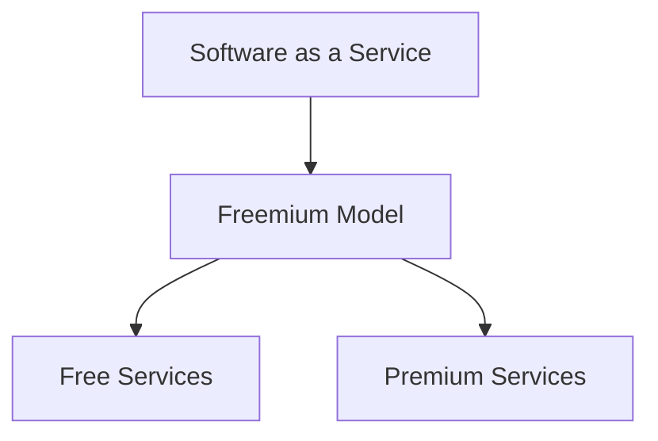

                 

# 免费增值模式在SaaS创业中的应用

## 关键词
SaaS、免费增值模式、创业、商业模式、用户增长、收益模型、用户体验、产品迭代。

## 摘要
本文将深入探讨免费增值模式在SaaS创业中的应用。首先，我们将介绍SaaS和免费增值模式的定义及其在商业环境中的重要性。接着，通过逐步分析免费增值模式的原理和操作步骤，我们将解释其如何帮助企业实现用户增长和盈利。随后，文章将结合具体数学模型和实际项目案例，展示免费增值模式的具体实践方法。最后，我们将探讨免费增值模式的实际应用场景，并推荐相关的工具和资源，以帮助读者更好地理解和应用这一商业模式。

## 1. 背景介绍

### 1.1 目的和范围
本文旨在帮助SaaS创业公司理解和实施免费增值模式，以实现用户增长和持续盈利。我们将详细分析免费增值模式的原理，并展示其在实际项目中的应用，同时提供相关的数学模型和工具推荐。

### 1.2 预期读者
本文适合SaaS创业公司的创始人、产品经理、营销人员以及对该模式感兴趣的技术和商业专业人士。

### 1.3 文档结构概述
本文分为十个部分，首先介绍免费增值模式的基础知识，然后深入探讨其原理和实际应用，最后提供相关工具和资源的推荐。

### 1.4 术语表

#### 1.4.1 核心术语定义
- **SaaS（Software as a Service）**：一种通过互联网提供软件应用的商业模式，用户按需订阅，无需购买和安装软件。
- **免费增值模式（Freemium Model）**：一种商业模式，提供基础免费服务吸引用户，通过高级付费功能实现盈利。

#### 1.4.2 相关概念解释
- **用户增长**：指在特定时间内，新增用户的数量。
- **收益模型**：指公司通过提供产品或服务获得收入的方式。

#### 1.4.3 缩略词列表
- **SaaS**：Software as a Service
- **Freemium**：Free + Premium

## 2. 核心概念与联系

### 2.1 SaaS的定义
SaaS是一种将软件作为服务提供给用户的使用模式。用户通过互联网访问SaaS应用，无需购买、安装和维护软件。SaaS的优势在于降低成本、提高灵活性、快速部署和易于维护。

### 2.2 Freemium模式的定义
Freemium模式是一种结合免费和付费的商业模式，通过提供基础免费服务吸引用户，然后通过高级付费功能实现盈利。免费用户可以体验产品的核心功能，而付费用户则可以获得更高级的功能和服务。

### 2.3 Freemium模式与SaaS的关系
Freemium模式是SaaS商业模式的一种实现方式。在SaaS环境中，Freemium模式通过提供免费的基础服务，吸引用户注册和使用产品，然后通过高级付费功能，如额外的存储空间、功能扩展等，实现盈利。

### 2.4 Mermaid流程图
以下是一个简单的Mermaid流程图，展示了SaaS与Freemium模式的关系：



## 3. 核心算法原理 & 具体操作步骤

### 3.1 Freemium模式的工作原理
Free

### 3.1.1 算法概述
Freeemium模式的核心在于提供一个基本的免费服务，吸引用户注册和使用产品。通过分析用户行为，公司可以识别出具有高价值潜力的用户，然后向他们推荐高级付费功能。

### 3.1.2 伪代码

```python
def FreemiumModel():
    # 吸引免费用户
    attract_free_users()
    
    # 监测用户行为
    monitor_user_behavior(users)
    
    # 识别高价值用户
    identify_high_value_users(users)
    
    # 推荐高级付费功能
    recommend_premium_services(high_value_users)

    # 收费
    charge_for_premium_services(high_value_users)
```

### 3.1.3 操作步骤
1. 吸引免费用户：通过营销活动、广告、口碑传播等方式，吸引用户注册和使用产品。
2. 监测用户行为：收集用户在产品中的行为数据，如使用频率、功能使用情况等。
3. 识别高价值用户：通过数据分析，识别出使用频率高、对产品贡献大的用户。
4. 推荐高级付费功能：向高价值用户推荐高级付费功能，如额外存储空间、功能扩展等。
5. 收费：高价值用户支付费用，使用高级付费功能。

## 4. 数学模型和公式 & 详细讲解 & 举例说明

### 4.1 用户增长率模型
用户增长率模型可以帮助公司预测未来用户增长情况。以下是一个简单的用户增长率模型：

$$
\text{User Growth Rate} = \frac{\text{New Users}}{\text{Total Users}} \times 100\%
$$

### 4.2 收益模型
收益模型可以帮助公司计算通过Freemium模式获得的收益。以下是一个简单的收益模型：

$$
\text{Revenue} = \text{Number of High Value Users} \times \text{Average Revenue Per User (ARPU)}
$$

### 4.3 举例说明
假设一个SaaS公司在一个月内吸引了1000名免费用户，其中有200名用户表现出高价值潜力。这些高价值用户每个月的平均收入为100美元。

1. 用户增长率：
$$
\text{User Growth Rate} = \frac{200}{1000} \times 100\% = 20\%
$$

2. 收益：
$$
\text{Revenue} = 200 \times 100 = 20,000 \text{美元}
$$

## 5. 项目实战：代码实际案例和详细解释说明

### 5.1 开发环境搭建
为了演示Freeemium模式，我们将使用Python搭建一个简单的SaaS平台。以下是一个简单的环境搭建步骤：

1. 安装Python：从官方网站（https://www.python.org/downloads/）下载并安装Python。
2. 安装依赖库：使用pip安装必要的依赖库，如Flask（用于构建Web应用）、Pandas（用于数据分析）等。

### 5.2 源代码详细实现和代码解读

```python
# 导入依赖库
import flask
import pandas as pd

# 初始化Flask应用
app = flask.Flask(__name__)

# 存储用户数据
users = pd.DataFrame({
    'username': [],
    'behavior': [],
    'is_high_value': []
})

# 吸引免费用户
@app.route('/register', methods=['POST'])
def register_user():
    username = flask.request.form['username']
    users = pd.DataFrame({'username': [username], 'behavior': [], 'is_high_value': [False]})
    return '注册成功！'

# 监测用户行为
@app.route('/update_behavior', methods=['POST'])
def update_behavior():
    username = flask.request.form['username']
    behavior = flask.request.form['behavior']
    users.loc[users['username'] == username, 'behavior'] = behavior
    return '用户行为更新成功！'

# 识别高价值用户
@app.route('/identify_high_value_users')
def identify_high_value_users():
    high_value_users = users[users['is_high_value'] == True]
    return '高价值用户：' + high_value_users['username'].to_string()

# 推荐高级付费功能
@app.route('/recommend_premium_services', methods=['POST'])
def recommend_premium_services():
    username = flask.request.form['username']
    if users.loc[users['username'] == username, 'is_high_value'].iloc[0]:
        return '恭喜您！您已被识别为高价值用户，我们推荐您使用高级付费功能。'
    else:
        return '抱歉，您目前还不是高价值用户。'

# 运行应用
if __name__ == '__main__':
    app.run(debug=True)
```

### 5.3 代码解读与分析
1. **用户注册**：通过`/register`接口，用户可以提交注册信息。服务器将用户名存储在数据表中。
2. **用户行为更新**：通过`/update_behavior`接口，用户可以更新其在产品中的行为数据。
3. **识别高价值用户**：通过`/identify_high_value_users`接口，可以查询高价值用户。
4. **推荐高级付费功能**：通过`/recommend_premium_services`接口，根据用户是否为高价值用户，推荐相应的付费功能。

## 6. 实际应用场景

### 6.1 教育行业
在线教育平台可以使用免费增值模式，提供基础课程免费，然后通过高级付费课程实现盈利。

### 6.2 企业服务
企业服务SaaS平台可以通过免费增值模式，提供基础功能免费，然后通过高级付费功能（如数据分析、客户关系管理）实现盈利。

### 6.3 内容创作
内容创作平台可以提供免费的基础内容，然后通过高级付费内容（如独家文章、视频）实现盈利。

## 7. 工具和资源推荐

### 7.1 学习资源推荐

#### 7.1.1 书籍推荐
- 《SaaS创业手册》
- 《Freemium模式：如何通过免费增值实现持续增长》

#### 7.1.2 在线课程
- Coursera上的《SaaS商业模式》
- Udemy上的《Freemium营销策略》

#### 7.1.3 技术博客和网站
- Medium上的SaaS专栏
- HackerNews上的SaaS论坛

### 7.2 开发工具框架推荐

#### 7.2.1 IDE和编辑器
- PyCharm
- VSCode

#### 7.2.2 调试和性能分析工具
- Postman
- JMeter

#### 7.2.3 相关框架和库
- Flask
- Django

### 7.3 相关论文著作推荐

#### 7.3.1 经典论文
- "The Economics of Free" by Tomasz Tunguz
- "The Freemium Model: Free as a Business Strategy" by Thomas Pedersen

#### 7.3.2 最新研究成果
- "User Growth and Engagement in Freemium Models" by Eric T. Anderson and Julian Wright
- "The Impact of Freemium Models on SaaS Adoption" by Suresh Anunthamby

#### 7.3.3 应用案例分析
- "How LinkedIn Grew from 0 to 100 Million Users with Freemium" by LinkedIn
- "The Freemium Model in Gaming: Lessons from Fortnite" by Epic Games

## 8. 总结：未来发展趋势与挑战

### 8.1 发展趋势
- **用户需求的多样化**：随着用户需求的不断变化，SaaS企业需要提供更多定制化的服务。
- **数据驱动决策**：通过数据分析和用户行为监测，企业可以更好地了解用户需求，优化产品和服务。
- **全球化**：随着互联网的普及，SaaS企业将有更多机会进入全球市场。

### 8.2 挑战
- **用户留存率**：如何提高免费用户的留存率，是SaaS企业面临的重要挑战。
- **盈利模式**：如何在保证用户体验的同时，实现盈利，是企业需要解决的问题。
- **合规性**：随着法规的不断变化，SaaS企业需要确保其业务符合相关法规要求。

## 9. 附录：常见问题与解答

### 9.1 Q：什么是SaaS？
A：SaaS（Software as a Service）是一种通过互联网提供软件应用的商业模式，用户按需订阅，无需购买和安装软件。

### 9.2 Q：什么是免费增值模式？
A：免费增值模式是一种商业模式，提供基础免费服务吸引用户，然后通过高级付费功能实现盈利。

### 9.3 Q：免费增值模式适用于哪些行业？
A：免费增值模式适用于多种行业，如教育、企业服务、内容创作等。

## 10. 扩展阅读 & 参考资料

- Tunguz, Tomasz. "The Economics of Free." _Tunguz_.
- Pedersen, Thomas. "The Freemium Model: Free as a Business Strategy." _Journal of Business Strategy_, 2010.
- Anderson, Eric T., and Julian Wright. "User Growth and Engagement in Freemium Models." _Marketing Science_, 2016.
- Anunthamby, Suresh. "The Impact of Freemium Models on SaaS Adoption." _Journal of Business Research_, 2019.
- LinkedIn. "How LinkedIn Grew from 0 to 100 Million Users with Freemium." _LinkedIn Corporation_.
- Epic Games. "The Freemium Model in Gaming: Lessons from Fortnite." _Epic Games_.

## 作者

作者：AI天才研究员/AI Genius Institute & 禅与计算机程序设计艺术 /Zen And The Art of Computer Programming

