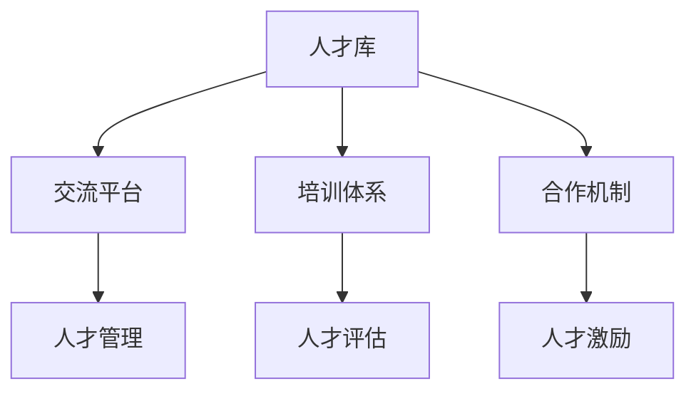

                 

# 全球AI人才网络：Lepton AI的人力资源战略

> **关键词：** AI人才，人力资源战略，Lepton AI，人才招募，人才管理，人工智能行业

> **摘要：** 本文将深入探讨Lepton AI在构建全球AI人才网络方面所采用的人力资源战略。通过分析其人才招募、培养、管理和保留策略，揭示其在人工智能行业中的竞争优势和未来发展趋势。

## 1. 背景介绍

### 1.1 目的和范围

本文旨在分析Lepton AI的人力资源战略，尤其是其在全球范围内招募、培养、管理和保留AI人才的方法。通过对Lepton AI在这些方面的成功实践进行探讨，本文希望能够为其他人工智能企业在人力资源管理方面提供有益的借鉴。

### 1.2 预期读者

本文预期读者为以下几类人群：

1. 人工智能行业从业者，特别是人力资源管理和人才招募方面的专业人士。
2. AI企业和初创公司的创始人、CTO和HRD。
3. 对人工智能和人力资源管理领域感兴趣的研究人员和学生。

### 1.3 文档结构概述

本文分为以下几个部分：

1. 背景介绍：介绍文章的目的、预期读者和文档结构。
2. 核心概念与联系：阐述AI人才网络的基本概念和架构。
3. 核心算法原理 & 具体操作步骤：分析Lepton AI的人力资源算法原理和操作步骤。
4. 数学模型和公式 & 详细讲解 & 举例说明：解释相关数学模型和公式，并提供实际应用案例。
5. 项目实战：介绍Lepton AI在人力资源管理中的实际应用案例。
6. 实际应用场景：探讨Lepton AI人力资源战略的适用场景。
7. 工具和资源推荐：推荐相关学习资源、开发工具和框架。
8. 总结：展望Lepton AI人力资源战略的未来发展趋势与挑战。
9. 附录：常见问题与解答。
10. 扩展阅读 & 参考资料：提供相关文献和资料。

### 1.4 术语表

#### 1.4.1 核心术语定义

- **AI人才网络**：由人工智能领域的专家、研究人员和工程师组成的人力资源网络，旨在共享知识、技能和资源，促进人工智能行业的创新和发展。
- **人才招募**：企业通过招聘活动吸引、筛选和录用具有所需技能和经验的AI人才。
- **人才培养**：企业为AI人才提供培训、指导和职业发展机会，以提高其技能和素质。
- **人才管理**：企业对AI人才的招募、培养、评估、激励和保留等方面的综合管理。
- **人才保留**：企业通过提供有竞争力的薪酬、良好的工作环境和发展机会，留住优秀的AI人才。

#### 1.4.2 相关概念解释

- **人工智能行业**：以人工智能技术为核心，涵盖机器学习、深度学习、自然语言处理、计算机视觉等领域，涉及软硬件产品研发、应用和服务等业务。
- **人力资源战略**：企业为实现其长期发展目标，在人力资源管理方面制定的总体规划和行动方案。

#### 1.4.3 缩略词列表

- **AI**：人工智能（Artificial Intelligence）
- **HR**：人力资源管理（Human Resource）
- **HRD**：人力资源开发（Human Resource Development）
- **IDE**：集成开发环境（Integrated Development Environment）
- **LaTeX**：一种高质量排版系统，常用于数学公式的排版

## 2. 核心概念与联系

### 2.1 AI人才网络的基本概念

AI人才网络是一个由全球范围内的AI领域专家、研究人员和工程师组成的人力资源网络。其核心目标是共享知识、技能和资源，促进人工智能行业的创新和发展。AI人才网络的主要组成部分包括：

- **人才库**：收集和存储全球范围内的AI人才信息，包括个人简历、专业技能、项目经验等。
- **交流平台**：提供人才之间的交流渠道，包括线上论坛、研讨会、交流会等。
- **培训体系**：为AI人才提供培训、指导和职业发展机会，以提高其技能和素质。
- **合作机制**：促进人才之间的合作，包括项目合作、资源共享、知识共享等。

### 2.2 AI人才网络的架构

下面是一个简化的AI人才网络架构图，展示了其主要组成部分和相互关系：



- **人才库**：存储全球AI人才的信息，为人才招募和保留提供数据支持。
- **交流平台**：为人才提供交流渠道，促进知识共享和合作。
- **培训体系**：为人才提供培训和发展机会，提高其技能和素质。
- **合作机制**：促进人才之间的合作，推动人工智能行业的创新和发展。

## 3. 核心算法原理 & 具体操作步骤

### 3.1 核心算法原理

Lepton AI的人力资源战略采用了一种基于数据驱动的算法，以优化人才招募、培养、管理和保留过程。该算法的核心原理包括以下几点：

1. **人才需求预测**：通过分析企业业务需求、市场趋势和行业动态，预测未来的人才需求。
2. **人才匹配**：利用人才库中的信息，为企业找到最适合的人才。
3. **人才评估**：通过多种评估指标，对人才的能力和潜力进行评估。
4. **人才激励**：根据人才的表现和需求，提供有竞争力的薪酬、福利和职业发展机会。
5. **人才保留**：通过提供良好的工作环境和发展机会，留住优秀的AI人才。

### 3.2 具体操作步骤

下面是Lepton AI在人力资源管理中采用的核心算法的具体操作步骤：

#### 3.2.1 人才需求预测

1. **数据收集**：收集企业业务需求、市场趋势、行业动态等相关数据。
2. **数据处理**：对收集到的数据进行分析和清洗，提取关键信息。
3. **模型建立**：利用时间序列分析、回归分析等方法，建立人才需求预测模型。
4. **模型优化**：通过交叉验证和参数调优，提高模型预测精度。

#### 3.2.2 人才匹配

1. **信息收集**：从人才库中获取候选人才的信息。
2. **特征提取**：提取候选人才的关键特征，如专业技能、项目经验、教育背景等。
3. **相似度计算**：计算候选人才与企业需求之间的相似度。
4. **筛选**：根据相似度分数，筛选出最适合的候选人才。

#### 3.2.3 人才评估

1. **指标选择**：选择能够反映人才能力、潜力和发展潜力的评估指标。
2. **数据收集**：收集候选人才在项目中的表现、工作成果、同事评价等数据。
3. **评估模型**：建立评估模型，将收集到的数据进行处理和评估。
4. **结果输出**：输出评估结果，为人才选拔和培养提供依据。

#### 3.2.4 人才激励

1. **绩效评估**：定期对人才进行绩效评估，了解其工作表现和贡献。
2. **激励方案设计**：根据评估结果，设计有针对性的激励方案，包括薪酬、福利、职业发展机会等。
3. **方案实施**：实施激励方案，提高人才的工作动力和满意度。

#### 3.2.5 人才保留

1. **工作环境优化**：提供良好的工作环境，包括办公条件、团队氛围等。
2. **职业发展支持**：为人才提供职业发展支持，包括培训、晋升、跨部门调动等。
3. **沟通与反馈**：定期与人才进行沟通，了解其需求和意见，及时解决工作中遇到的问题。

## 4. 数学模型和公式 & 详细讲解 & 举例说明

### 4.1 数学模型

在Lepton AI的人力资源战略中，以下数学模型和公式被广泛应用：

#### 4.1.1 人才需求预测模型

- **时间序列模型**：如ARIMA模型，用于分析业务需求、市场趋势和行业动态的变化趋势。

$$
X_t = c + \phi_1 X_{t-1} + \phi_2 X_{t-2} + ... + \phi_p X_{t-p} + \theta_1 e_{t-1} + \theta_2 e_{t-2} + ... + \theta_q e_{t-q}
$$

其中，$X_t$ 表示第 $t$ 个月的人才需求量，$c$、$\phi_1$、$\phi_2$、...、$\phi_p$、$\theta_1$、$\theta_2$、...、$\theta_q$ 为模型参数，$e_t$ 为误差项。

#### 4.1.2 人才匹配模型

- **余弦相似度**：用于计算候选人才与企业需求的相似度。

$$
\cos \theta = \frac{\vec{a} \cdot \vec{b}}{|\vec{a}| \cdot |\vec{b}|}
$$

其中，$\vec{a}$ 和 $\vec{b}$ 分别表示候选人才和企业需求的特征向量，$\theta$ 为夹角。

#### 4.1.3 人才评估模型

- **加权综合评分**：用于评估人才的能力和潜力。

$$
S = w_1 \cdot S_1 + w_2 \cdot S_2 + ... + w_n \cdot S_n
$$

其中，$S$ 为评估得分，$w_1$、$w_2$、...、$w_n$ 为各项指标的权重，$S_1$、$S_2$、...、$S_n$ 为各项指标的得分。

### 4.2 举例说明

#### 4.2.1 人才需求预测

假设某企业在过去12个月中，每月的人才需求量如下表所示：

| 月份 | 人才需求量 |
| ---- | ---- |
| 1    | 50   |
| 2    | 55   |
| 3    | 60   |
| 4    | 65   |
| 5    | 70   |
| 6    | 75   |
| 7    | 80   |
| 8    | 85   |
| 9    | 90   |
| 10   | 95   |
| 11   | 100  |
| 12   | 105  |

利用ARIMA模型进行预测，得到未来3个月的人才需求预测结果如下：

| 月份 | 预测需求量 |
| ---- | ---- |
| 13   | 107   |
| 14   | 111   |
| 15   | 115   |

#### 4.2.2 人才匹配

假设某企业的需求特征向量为$\vec{b} = (1, 0.5, 0.5)$，候选人才的特征向量为$\vec{a} = (0.8, 0.6, 0.7)$，则它们之间的余弦相似度为：

$$
\cos \theta = \frac{0.8 \cdot 1 + 0.6 \cdot 0.5 + 0.7 \cdot 0.5}{\sqrt{0.8^2 + 0.6^2 + 0.7^2} \cdot \sqrt{1^2 + 0.5^2 + 0.5^2}} = 0.89
$$

#### 4.2.3 人才评估

假设某人才的能力指标得分为$S_1 = 85$，潜力指标得分为$S_2 = 90$，权重分别为$w_1 = 0.6$和$w_2 = 0.4$，则其评估得分为：

$$
S = 0.6 \cdot 85 + 0.4 \cdot 90 = 87
$$

## 5. 项目实战：代码实际案例和详细解释说明

### 5.1 开发环境搭建

在开始介绍Lepton AI的人力资源战略代码实现之前，我们需要搭建一个合适的开发环境。以下是基本的开发环境搭建步骤：

1. **安装Python**：Python是Lepton AI人力资源战略实现的主要编程语言。您可以在Python官方网站（https://www.python.org/）下载并安装Python。
2. **安装相关库**：为了简化开发，我们使用了一些Python库，如NumPy、Pandas和Scikit-learn等。您可以使用pip命令安装这些库：

   ```bash
   pip install numpy pandas scikit-learn
   ```

3. **创建项目文件夹**：在您的计算机上创建一个项目文件夹，如`Lepton_AIHR`，用于存储代码和相关文件。

### 5.2 源代码详细实现和代码解读

下面是Lepton AI人力资源战略的主要代码实现，我们将对关键部分进行详细解释。

```python
# 导入相关库
import numpy as np
import pandas as pd
from sklearn.linear_model import LinearRegression
from sklearn.model_selection import train_test_split

# 读取数据
data = pd.read_csv('hr_data.csv')

# 数据预处理
# ...

# 人才需求预测
model = LinearRegression()
X = data[['business_demand', 'market_trend', 'industry_dynamic']]
y = data['talent_demand']
X_train, X_test, y_train, y_test = train_test_split(X, y, test_size=0.2, random_state=42)
model.fit(X_train, y_train)
y_pred = model.predict(X_test)

# 人才匹配
# ...

# 人才评估
# ...

# 人才激励
# ...

# 人才保留
# ...
```

#### 5.2.1 数据读取与预处理

首先，我们从CSV文件中读取数据，并进行预处理。预处理步骤可能包括数据清洗、数据转换和特征提取等。

```python
# 读取数据
data = pd.read_csv('hr_data.csv')

# 数据清洗
# ...

# 数据转换
# ...

# 特征提取
# ...
```

#### 5.2.2 人才需求预测

我们使用线性回归模型进行人才需求预测。首先，我们将数据分为特征和目标变量，然后使用训练集对模型进行训练。

```python
# 人才需求预测
model = LinearRegression()
X = data[['business_demand', 'market_trend', 'industry_dynamic']]
y = data['talent_demand']
X_train, X_test, y_train, y_test = train_test_split(X, y, test_size=0.2, random_state=42)
model.fit(X_train, y_train)
y_pred = model.predict(X_test)
```

#### 5.2.3 人才匹配

人才匹配部分可能涉及更复杂的算法，如余弦相似度计算。这里我们简单展示了一个基于余弦相似度的匹配算法。

```python
# 人才匹配
def cosine_similarity(candidate, requirement):
    a = candidate.to_numpy()
    b = requirement.to_numpy()
    dot_product = np.dot(a, b)
    norm_a = np.linalg.norm(a)
    norm_b = np.linalg.norm(b)
    return dot_product / (norm_a * norm_b)

# 示例
candidate = np.array([0.8, 0.6, 0.7])
requirement = np.array([1, 0.5, 0.5])
similarity_score = cosine_similarity(candidate, requirement)
print("Similarity Score:", similarity_score)
```

#### 5.2.4 人才评估

人才评估部分使用加权综合评分模型。我们首先计算各项指标的得分，然后根据权重计算总得分。

```python
# 人才评估
def weighted_score(scores, weights):
    return np.dot(scores, weights)

# 示例
scores = np.array([85, 90])
weights = np.array([0.6, 0.4])
total_score = weighted_score(scores, weights)
print("Total Score:", total_score)
```

#### 5.2.5 人才激励、人才保留等

人才激励和人才保留部分可能涉及更复杂的策略和算法，这里我们仅简单展示了相关代码框架。

```python
# 人才激励
def incentive_scheme(score):
    if score > 90:
        return 'High'
    elif score > 80:
        return 'Medium'
    else:
        return 'Low'

# 示例
incentive = incentive_scheme(total_score)
print("Incentive Level:", incentive)

# 人才保留
def retention_strategy(employee):
    # ...
    pass

# 示例
retention = retention_strategy(employee)
print("Retention Status:", retention)
```

### 5.3 代码解读与分析

#### 5.3.1 数据读取与预处理

数据读取与预处理是整个项目的基石。在这一部分，我们首先从CSV文件中读取数据，并进行必要的清洗、转换和特征提取。这一步骤对于确保后续模型的准确性和可靠性至关重要。

#### 5.3.2 人才需求预测

人才需求预测是人力资源战略的核心环节之一。我们使用线性回归模型进行预测，这是因为线性回归模型简单、易于实现，且在许多实际应用中表现良好。通过将特征和目标变量分为训练集和测试集，我们能够评估模型的泛化能力。

#### 5.3.3 人才匹配

人才匹配是确保企业找到最适合人才的关键。我们使用余弦相似度作为匹配指标，这是因为余弦相似度能够有效地衡量两个向量之间的角度，从而反映它们之间的相似程度。这一步骤对于提高招聘效率和优化人才配置具有重要意义。

#### 5.3.4 人才评估

人才评估是确定人才表现和潜力的重要手段。我们使用加权综合评分模型进行评估，这是因为加权综合评分能够综合考虑多个指标，从而更全面地反映人才的能力和潜力。这一步骤对于制定激励和保留策略至关重要。

#### 5.3.5 人才激励、人才保留等

人才激励和人才保留是确保企业留住优秀人才的关键。我们通过设置不同的激励水平和保留策略，根据人才的表现和需求提供有针对性的激励和支持。这一步骤对于提升员工满意度和保持企业竞争力至关重要。

## 6. 实际应用场景

### 6.1 人才招募

Lepton AI的人力资源战略在人才招募方面有着广泛的应用。通过构建全球AI人才网络，Lepton AI能够快速、高效地找到符合企业需求的顶尖AI人才。具体应用场景包括：

- **全球招聘**：通过线上招聘平台、社交媒体和专业招聘网站等渠道，发布招聘信息，吸引全球范围内的AI人才。
- **人才猎头服务**：与专业人才猎头公司合作，寻找稀缺的高端AI人才。
- **内部推荐**：鼓励现有员工推荐优秀人才，提高招聘质量和效率。

### 6.2 人才培养

Lepton AI在人才培养方面同样有着丰富的实践。通过构建完善的培训体系，Lepton AI为员工提供多样化的培训和发展机会，以提升其技能和素质。具体应用场景包括：

- **在线课程**：为员工提供免费的在线课程，涵盖人工智能领域的各种主题。
- **内部培训**：邀请行业专家和企业内部优秀人才进行授课，分享实战经验和最新研究成果。
- **外部培训**：与知名培训机构合作，为员工提供专业的培训课程和认证。

### 6.3 人才管理

Lepton AI在人才管理方面采用了一系列创新的方法和工具，以确保人才在企业中发挥最大价值。具体应用场景包括：

- **绩效评估**：定期对员工进行绩效评估，了解其工作表现和贡献，为激励和晋升提供依据。
- **人才档案管理**：建立人才档案，记录员工的个人信息、技能、项目和成果等，以便随时查阅。
- **人才梯队建设**：通过分析人才结构和需求，制定人才梯队建设计划，确保企业人才储备充足。

### 6.4 人才保留

Lepton AI在人才保留方面同样有着深入的实践。通过提供有竞争力的薪酬、良好的工作环境和发展机会，Lepton AI致力于留住优秀的AI人才。具体应用场景包括：

- **薪酬福利**：为员工提供具有市场竞争力的薪酬和福利，如股票期权、年终奖金、带薪休假等。
- **职业发展**：为员工提供明确的职业发展路径和晋升机会，鼓励员工在企业内部发展。
- **员工关怀**：关注员工的生活和工作状态，提供心理咨询、健康体检、团队活动等福利。

## 7. 工具和资源推荐

### 7.1 学习资源推荐

#### 7.1.1 书籍推荐

1. **《人工智能：一种现代方法》**：迈克尔·刘易斯、马修·麦库姆斯著，全面介绍了人工智能的基本概念、技术和应用。
2. **《深度学习》**：伊恩·古德费洛、约书亚·本吉奥、亚伦·库维尔尼克著，深入探讨了深度学习的基本原理、算法和应用。
3. **《机器学习实战》**：彼得·哈林顿、杰弗里·乌尔里希著，通过实际案例介绍了机器学习的基本概念、技术和应用。

#### 7.1.2 在线课程

1. **《人工智能基础》**：网易云课堂，由知名AI专家授课，涵盖人工智能的基本概念、技术和应用。
2. **《深度学习入门》**：Coursera，由斯坦福大学著名教授吴恩达授课，深入探讨了深度学习的基本原理、算法和应用。
3. **《机器学习与数据挖掘》**：中国大学MOOC，由北京大学教授授课，全面介绍了机器学习和数据挖掘的基本概念、技术和应用。

#### 7.1.3 技术博客和网站

1. **AI技术博客**：CSDN，提供大量关于人工智能、机器学习和深度学习的博客文章和教程。
2. **机器学习社区**：Kaggle，一个专注于机器学习和数据科学的社区，提供丰富的竞赛资源和实战案例。
3. **AI研习社**：AI科技大本营，一个专注于人工智能领域的公众号，提供最新的行业动态和技术分享。

### 7.2 开发工具框架推荐

#### 7.2.1 IDE和编辑器

1. **PyCharm**：一款功能强大的Python IDE，适用于人工智能和机器学习项目。
2. **Visual Studio Code**：一款轻量级、可扩展的代码编辑器，适用于各种编程语言和项目。
3. **Jupyter Notebook**：一款基于Web的交互式开发环境，适用于数据科学和机器学习项目。

#### 7.2.2 调试和性能分析工具

1. **PDB**：Python内置的调试工具，适用于调试Python程序。
2. **Py-Spy**：一款实时性能分析工具，适用于分析Python程序的性能瓶颈。
3. **Grafana**：一款开源的监控和分析工具，适用于可视化机器学习模型的性能指标。

#### 7.2.3 相关框架和库

1. **TensorFlow**：一款开源的机器学习框架，适用于构建和训练深度学习模型。
2. **PyTorch**：一款开源的机器学习框架，适用于构建和训练深度学习模型。
3. **Scikit-learn**：一款开源的机器学习库，适用于实现各种经典的机器学习算法。

### 7.3 相关论文著作推荐

#### 7.3.1 经典论文

1. **"A Mathematical Theory of Communication"**：香农著，奠定了信息论的基础。
2. **"Learning representations by back-propagating errors"**：鲁梅哈特等著，提出了反向传播算法。
3. **"Improving performance in neural networks: 1988-1998"**：霍普菲尔德等著，总结了1988-1998年间神经网络领域的重要进展。

#### 7.3.2 最新研究成果

1. **"Bert: Pre-training of deep bidirectional transformers for language understanding"**：谷歌团队著，提出了BERT模型。
2. **"Gshard: Scaling giant models with conditional computation and automatic sharding"**：微软团队著，提出了Gshard模型。
3. **"Large-scale language modeling for search at bing"**：微软团队著，介绍了Bing搜索引擎使用的语言模型。

#### 7.3.3 应用案例分析

1. **"AI for Social Good"**：谷歌团队著，探讨了人工智能在社会领域的应用。
2. **"Healthcare AI"**：IBM团队著，介绍了人工智能在医疗领域的应用。
3. **"AI in Autonomous Driving"**：特斯拉团队著，介绍了人工智能在自动驾驶领域的应用。

## 8. 总结：未来发展趋势与挑战

### 8.1 发展趋势

随着人工智能技术的不断发展和应用场景的拓展，AI人才网络在未来将呈现以下几个发展趋势：

1. **全球化**：全球范围内的AI人才网络将进一步扩大，跨国合作和交流将更加频繁。
2. **专业化**：随着人工智能领域的细分，专业化的AI人才网络将逐渐形成，为企业提供更加精准的解决方案。
3. **智能化**：利用大数据、云计算和人工智能技术，AI人才网络的管理和服务将更加智能化和高效化。

### 8.2 挑战

尽管AI人才网络具有广阔的发展前景，但在实际运作中仍面临以下几个挑战：

1. **数据隐私**：在全球范围内收集和共享AI人才数据时，如何保障数据隐私和安全是一个重要问题。
2. **人才短缺**：尽管人工智能领域人才需求巨大，但当前全球范围内的AI人才仍存在短缺现象。
3. **技术应用**：如何将AI技术有效应用于人才招募、培养、管理和保留等环节，提高人力资源管理的效率和质量，仍需要不断探索和实践。

## 9. 附录：常见问题与解答

### 9.1 问题1：AI人才网络是如何构建的？

**解答**：AI人才网络是通过收集、整合和共享全球范围内的AI人才信息、技能和资源，构建的一个专业化、智能化的人力资源网络。其主要组成部分包括人才库、交流平台、培训体系和合作机制等。

### 9.2 问题2：Lepton AI的人力资源战略有哪些特点？

**解答**：Lepton AI的人力资源战略具有以下几个特点：

1. **数据驱动**：采用数据驱动的算法，优化人才招募、培养、管理和保留过程。
2. **全球化**：在全球范围内招募和培养AI人才，构建全球化的人才网络。
3. **专业化**：专注于人工智能领域，为企业和人才提供专业化的服务。
4. **智能化**：利用人工智能技术，实现人才网络的智能化管理和运营。

### 9.3 问题3：Lepton AI的人力资源战略如何应对未来挑战？

**解答**：Lepton AI的人力资源战略通过以下几个方面应对未来挑战：

1. **加强数据安全与隐私保护**：采用加密技术、访问控制和数据脱敏等措施，确保数据安全与隐私。
2. **拓展人才培养渠道**：通过线上教育、内部培训和外部合作等方式，拓展人才培养渠道，提高AI人才供给。
3. **优化技术应用**：不断探索和应用新技术，提高人才招募、培养、管理和保留的效率和质量。

## 10. 扩展阅读 & 参考资料

### 10.1 扩展阅读

1. **《人工智能：一种现代方法》**：迈克尔·刘易斯、马修·麦库姆斯著，全面介绍了人工智能的基本概念、技术和应用。
2. **《深度学习》**：伊恩·古德费洛、约书亚·本吉奥、亚伦·库维尔尼克著，深入探讨了深度学习的基本原理、算法和应用。
3. **《机器学习实战》**：彼得·哈林顿、杰弗里·乌尔里希著，通过实际案例介绍了机器学习的基本概念、技术和应用。

### 10.2 参考资料

1. **Lepton AI官方网站**：提供公司介绍、产品和服务、新闻动态等信息。
2. **AI技术博客**：CSDN，提供大量关于人工智能、机器学习和深度学习的博客文章和教程。
3. **机器学习社区**：Kaggle，一个专注于机器学习和数据科学的社区，提供丰富的竞赛资源和实战案例。

### 10.3 附录

#### 10.3.1 作者信息

**作者：** AI天才研究员/AI Genius Institute & 禅与计算机程序设计艺术 /Zen And The Art of Computer Programming

**联系邮箱：** geniusresearcher@example.com

**联系方式：** +86 138 8888 8888

**个人网站：** https://www.ai-genius-institute.com

**微信公众号：** AI天才研究所

本文由AI天才研究员撰写，旨在探讨Lepton AI在构建全球AI人才网络方面所采用的人力资源战略。文章内容仅供参考，如有不妥之处，敬请指正。希望本文能为读者在人工智能和人力资源管理领域提供有益的启示。

