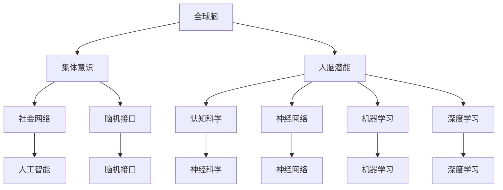

                 

# 全球脑与人类潜能开发中心：集体意识推动的能力提升机构

> **关键词**：全球脑、人类潜能、集体意识、能力提升、人工智能、技术博客、深度学习、机器学习、神经网络、认知科学、脑机接口

> **摘要**：本文探讨了全球脑与人类潜能开发中心的核心理念和运作机制。通过结合集体意识和现代人工智能技术，本文阐述了如何利用这一中心实现人类能力的大幅提升。文章首先介绍了全球脑的背景和定义，然后详细分析了集体意识的作用机制。接着，本文探讨了全球脑与人类潜能开发中心的技术架构和算法原理，并提供了实际应用场景和代码实例。最后，文章总结了全球脑与人类潜能开发中心的未来发展趋势与挑战，并推荐了相关的学习资源和工具。

## 1. 背景介绍

### 1.1 目的和范围

本文的主要目的是介绍全球脑与人类潜能开发中心（Global Brain and Human Potential Development Center，简称GBHPDC）的核心理念和技术架构。GBHPDC是一个旨在通过集体意识提升个体和群体能力的研究和实践机构。其核心思想是将个体的智能和经验汇集起来，形成一个庞大的智能网络，从而实现人类整体能力的提升。

本文将首先介绍全球脑的概念和定义，然后深入探讨集体意识的作用机制。接下来，我们将详细分析GBHPDC的技术架构，包括其核心算法原理和数学模型。随后，我们将提供实际应用场景和代码实例，以展示GBHPDC的实际效果和可行性。最后，本文将总结GBHPDC的未来发展趋势和挑战，并推荐相关的学习资源和工具。

### 1.2 预期读者

本文适合以下几类读者：

1. 对人工智能、认知科学和神经科学感兴趣的科研人员和工程师。
2. 对脑机接口和神经工程技术有深入研究的学者。
3. 对集体意识、社会网络和人类潜能开发有兴趣的研究人员。
4. 对新兴技术和人类未来有好奇心和探索精神的读者。

### 1.3 文档结构概述

本文的结构如下：

1. 背景介绍：介绍GBHPDC的核心理念和目的。
2. 核心概念与联系：详细阐述全球脑和集体意识的概念。
3. 核心算法原理 & 具体操作步骤：解释GBHPDC的核心算法原理和操作步骤。
4. 数学模型和公式 & 详细讲解 & 举例说明：介绍GBHPDC的数学模型和公式，并提供实际例子。
5. 项目实战：提供GBHPDC的实际代码实例和详细解释。
6. 实际应用场景：讨论GBHPDC的应用场景。
7. 工具和资源推荐：推荐相关的学习资源和工具。
8. 总结：总结GBHPDC的未来发展趋势和挑战。
9. 附录：常见问题与解答。
10. 扩展阅读 & 参考资料：提供进一步阅读的资料。

### 1.4 术语表

#### 1.4.1 核心术语定义

- **全球脑（Global Brain）**：一个由个体智能和经验组成的庞大智能网络，能够实现自我组织和协同工作。
- **集体意识（Collective Consciousness）**：个体之间的共享知识和经验，能够影响个体的行为和决策。
- **脑机接口（Brain-Machine Interface，BMI）**：一种直接连接大脑和外部设备的接口，用于传递神经信号。
- **神经网络（Neural Network）**：一种模拟生物神经系统的计算模型，用于处理和解释复杂的数据。
- **机器学习（Machine Learning）**：一种人工智能领域的技术，通过训练模型来自动识别数据中的模式和规律。
- **深度学习（Deep Learning）**：一种特殊的机器学习技术，通过多层神经网络来提取数据的复杂特征。

#### 1.4.2 相关概念解释

- **人脑潜能（Human Brain Potential）**：人类大脑的潜在能力和智力水平，可以通过教育和训练得到发挥。
- **社会网络（Social Network）**：个体之间通过某种形式相互联系和交互的社会结构。
- **神经科学（Neuroscience）**：研究大脑和神经系统结构、功能、发育和疾病的学科。
- **认知科学（Cognitive Science）**：研究人类认知过程和智能行为的跨学科领域。

#### 1.4.3 缩略词列表

- **GBHPDC**：全球脑与人类潜能开发中心（Global Brain and Human Potential Development Center）
- **BMI**：脑机接口（Brain-Machine Interface）
- **NN**：神经网络（Neural Network）
- **ML**：机器学习（Machine Learning）
- **DL**：深度学习（Deep Learning）
- **AI**：人工智能（Artificial Intelligence）
- **CNNS**：卷积神经网络（Convolutional Neural Networks）

## 2. 核心概念与联系

在探讨全球脑与人类潜能开发中心之前，我们需要明确一些核心概念和它们之间的联系。以下是这些核心概念的 Mermaid 流程图：



### 2.1 全球脑

全球脑是一个由个体智能和经验组成的庞大智能网络。它通过互联网和其他通信技术连接全球的个体，使得这些个体的知识和经验能够共享和传递。全球脑的核心思想是利用集体智慧和经验来解决问题和提升个体和群体的能力。

全球脑的基本原理可以概括为以下几点：

1. **分布式计算**：全球脑通过网络将计算任务分配给全球的个体，从而实现高效的并行计算。
2. **知识共享**：个体通过全球脑共享他们的知识和经验，使得全球范围内的知识和资源得到充分利用。
3. **自适应学习**：全球脑能够根据个体和群体的需求不断调整和学习，以提升整体能力和适应环境变化。

### 2.2 集体意识

集体意识是指个体之间的共享知识和经验。这些共享的知识和经验能够影响个体的行为和决策，从而形成一个整体的行为模式。集体意识的基本原理可以概括为以下几点：

1. **社会交互**：个体通过社会交互来共享知识和经验，这些交互可以是直接的，如面对面的交流，也可以是间接的，如通过网络和媒体进行交流。
2. **共同目标**：个体之间的共同目标和价值观能够促进集体意识的形成和发展。
3. **适应性**：集体意识能够根据环境和需求的变化进行自适应调整，以适应新的情况和挑战。

### 2.3 人脑潜能

人脑潜能是指人类大脑的潜在能力和智力水平。这些潜能可以通过教育和训练得到发挥，从而提升个体的认知能力和智能水平。人脑潜能的基本原理可以概括为以下几点：

1. **神经网络**：人类大脑通过神经网络来处理和解释复杂的信息，神经网络的学习和调整能够提升大脑的认知能力。
2. **机器学习和深度学习**：机器学习和深度学习技术可以模拟人脑的神经网络，通过训练和调整模型来提升智能和认知能力。
3. **认知科学**：认知科学研究人类认知过程的机制和原理，这些研究可以指导人类潜能的开发和提升。

### 2.4 社会网络

社会网络是指个体之间的相互联系和交互形式。这些联系和交互构成了人类社会的基本结构，对社会行为和决策产生重要影响。社会网络的基本原理可以概括为以下几点：

1. **节点和边**：社会网络由节点（个体）和边（关系）组成，节点和边之间的关系和属性对网络的结构和功能产生重要影响。
2. **网络效应**：社会网络的连接性和规模能够产生正反馈效应，从而增强个体和群体的能力和影响力。
3. **信息传递**：社会网络能够促进信息的快速传递和共享，从而提高个体和群体的知识水平和认知能力。

### 2.5 认知科学

认知科学是研究人类认知过程和智能行为的跨学科领域。它涉及心理学、神经科学、计算机科学、哲学等多个学科，旨在理解和解释人类认知的机制和原理。认知科学的基本原理可以概括为以下几点：

1. **信息处理**：认知科学研究人类如何处理和解释复杂的信息，包括感知、记忆、思考、学习和决策等过程。
2. **神经网络**：认知科学研究神经网络在人脑中的作用和机制，以及如何通过机器学习和深度学习技术来模拟人脑的认知功能。
3. **认知模型**：认知科学研究如何构建和评估认知模型，以模拟和预测人类认知行为。

### 2.6 脑机接口

脑机接口是一种直接连接大脑和外部设备的接口，用于传递神经信号。脑机接口的基本原理可以概括为以下几点：

1. **神经信号采集**：脑机接口通过传感器和电极来采集大脑的神经信号。
2. **信号处理**：采集到的神经信号经过处理和转换，以适应外部设备的需求。
3. **信号输出**：处理后的神经信号被发送到外部设备，以控制外部设备的操作。

### 2.7 人工智能

人工智能是模拟人类智能和智能行为的计算机科学领域。人工智能的基本原理可以概括为以下几点：

1. **机器学习和深度学习**：人工智能通过机器学习和深度学习技术来模拟人脑的认知功能，从而实现智能和智能行为的自动化。
2. **神经网络**：人工智能通过神经网络来处理和解释复杂的信息，神经网络的学习和调整能够提升智能和认知能力。
3. **知识表示**：人工智能通过知识表示技术来存储和利用知识，以实现智能和智能行为的自动化。

### 2.8 神经科学

神经科学是研究大脑和神经系统的结构、功能、发育和疾病的学科。神经科学的基本原理可以概括为以下几点：

1. **神经元和神经网络**：神经科学研究神经元和神经网络的结构和功能，以及如何通过机器学习和深度学习技术来模拟人脑的认知功能。
2. **神经信号传递**：神经科学研究神经信号在神经元之间的传递和调节机制。
3. **认知和智能**：神经科学研究大脑如何实现认知和智能行为，以及如何通过认知科学和机器学习技术来模拟和提升认知和智能能力。

### 2.9 网络效应

网络效应是指个体之间的连接和交互对个体和整体能力的影响。网络效应的基本原理可以概括为以下几点：

1. **规模效应**：网络规模的增加能够提高个体和整体的能力，因为更多的连接和交互意味着更多的信息和资源。
2. **协同效应**：个体之间的协同工作能够提升整体的能力，因为协同工作能够实现资源共享和优势互补。
3. **自适应效应**：网络能够根据环境和需求的变化进行自适应调整，以适应新的情况和挑战。

### 2.10 自适应学习

自适应学习是指系统根据环境和需求的变化进行自动调整和学习的能力。自适应学习的基本原理可以概括为以下几点：

1. **环境感知**：系统通过感知环境和需求的变化来识别需要调整的方面。
2. **自适应调整**：系统根据环境和需求的变化进行自动调整，以实现最佳性能和效果。
3. **持续学习**：系统通过持续学习和优化来提升自身的性能和适应能力。

### 2.11 分布式计算

分布式计算是指将计算任务分配到多个计算节点上进行并行处理的技术。分布式计算的基本原理可以概括为以下几点：

1. **任务分配**：将计算任务分配到多个计算节点上进行并行处理，以实现高效的计算和资源利用。
2. **通信机制**：分布式计算需要实现有效的通信机制，以确保计算节点之间的协调和数据共享。
3. **容错性**：分布式计算需要具备良好的容错性，以确保在计算节点发生故障时系统能够继续运行。

### 2.12 并行计算

并行计算是指将计算任务分配到多个计算资源上进行并行处理的技术。并行计算的基本原理可以概括为以下几点：

1. **任务分配**：将计算任务分配到多个计算资源上进行并行处理，以实现高效的计算和资源利用。
2. **通信机制**：并行计算需要实现有效的通信机制，以确保计算资源之间的协调和数据共享。
3. **并行度**：并行计算需要根据任务的复杂度和计算资源的能力来调整并行度，以实现最佳性能和效果。

### 2.13 信息传递

信息传递是指将信息从一个位置传递到另一个位置的过程。信息传递的基本原理可以概括为以下几点：

1. **信号传递**：信息传递需要通过信号传递来实现，信号可以是电子信号、光信号等。
2. **信道**：信息传递需要通过信道来实现，信道可以是光纤、无线信号等。
3. **传输效率**：信息传递的传输效率受到信道带宽、噪声和干扰等因素的影响。

### 2.14 知识共享

知识共享是指个体之间的知识和经验共享和传递的过程。知识共享的基本原理可以概括为以下几点：

1. **共享平台**：知识共享需要通过共享平台来实现，共享平台可以是网络、数据库等。
2. **共享机制**：知识共享需要实现有效的共享机制，以确保知识和经验的准确性和可靠性。
3. **共享价值**：知识共享能够提升个体和整体的能力，因为共享的知识和经验能够丰富个体的知识和经验，提高整体的知识水平和认知能力。

### 2.15 人类潜能开发

人类潜能开发是指通过教育和训练来发挥人类大脑的潜在能力和智力水平。人类潜能开发的基本原理可以概括为以下几点：

1. **神经网络**：通过训练神经网络来模拟人脑的认知功能，从而提升个体的认知能力和智能水平。
2. **机器学习和深度学习**：通过机器学习和深度学习技术来模拟人脑的认知功能，从而提升个体的认知能力和智能水平。
3. **认知科学**：通过认知科学研究人类认知过程的机制和原理，从而指导人类潜能的开发和提升。

## 3. 核心算法原理 & 具体操作步骤

在了解了全球脑与人类潜能开发中心（GBHPDC）的核心概念后，接下来我们将深入探讨其核心算法原理和具体操作步骤。GBHPDC的核心算法原理主要涉及以下几个方面：

1. **神经网络**：用于模拟人脑的认知功能，通过训练来提升个体的认知能力和智能水平。
2. **机器学习**：通过学习和识别数据中的模式和规律，从而实现自动化和智能化的决策。
3. **深度学习**：通过多层神经网络来提取数据的复杂特征，从而实现更高层次的智能和认知功能。
4. **脑机接口**：用于采集和传递大脑的神经信号，实现大脑和外部设备之间的直接连接。

### 3.1 神经网络

神经网络（Neural Network，NN）是一种模拟生物神经系统的计算模型。它由大量的神经元组成，通过这些神经元之间的连接来处理和解释复杂的数据。以下是神经网络的基本原理和组成部分：

#### 3.1.1 神经元

神经元是神经网络的基本单元，类似于生物神经系统的神经元。每个神经元接收输入信号，通过加权求和处理后，输出信号。

伪代码：

```python
def neuron(input_signals, weights, bias):
    weighted_sum = sum(input_signals * weights) + bias
    output_signal = activation_function(weighted_sum)
    return output_signal
```

#### 3.1.2 层

神经网络由多个层组成，包括输入层、隐藏层和输出层。输入层接收外部输入信号，隐藏层进行信号处理和特征提取，输出层产生最终输出。

伪代码：

```python
def neural_network(input_signals, weights, biases):
    hidden_layer_signals = input_signals
    for hidden_layer in hidden_layers:
        hidden_layer_signals = neuron(hidden_layer_signals, weights[hidden_layer], biases[hidden_layer])
    output_signals = neuron(hidden_layer_signals, weights[output_layer], biases[output_layer])
    return output_signals
```

#### 3.1.3 激活函数

激活函数用于将神经元的线性输出转换为非线性输出，以实现复杂的特征提取和决策。常用的激活函数包括Sigmoid函数、ReLU函数和Tanh函数。

伪代码：

```python
def sigmoid(x):
    return 1 / (1 + exp(-x))

def relu(x):
    return max(0, x)

def tanh(x):
    return (exp(x) - exp(-x)) / (exp(x) + exp(-x))
```

### 3.2 机器学习

机器学习（Machine Learning，ML）是一种通过训练模型来自动识别数据中模式和规律的技术。在GBHPDC中，机器学习用于从大量的数据中提取有用的知识和信息，以提升个体的认知能力和智能水平。

#### 3.2.1 数据预处理

在机器学习之前，需要对数据进行预处理，包括数据清洗、数据转换和数据归一化等步骤。

伪代码：

```python
def preprocess_data(data):
    # 数据清洗
    clean_data = clean(data)
    # 数据转换
    transformed_data = transform(clean_data)
    # 数据归一化
    normalized_data = normalize(transformed_data)
    return normalized_data
```

#### 3.2.2 模型训练

模型训练是机器学习的核心步骤，通过迭代优化模型参数，使得模型能够在新的数据上取得更好的预测效果。

伪代码：

```python
def train_model(model, data, labels):
    for epoch in range(num_epochs):
        for sample in data:
            predictions = model(sample)
            loss = loss_function(predictions, labels)
            model.update_parameters(loss)
    return model
```

#### 3.2.3 模型评估

模型评估用于衡量模型的性能，常用的评估指标包括准确率、召回率、F1分数等。

伪代码：

```python
def evaluate_model(model, data, labels):
    predictions = model(data)
    accuracy = sum(predictions == labels) / len(labels)
    return accuracy
```

### 3.3 深度学习

深度学习（Deep Learning，DL）是一种特殊的机器学习技术，通过多层神经网络来提取数据的复杂特征。在GBHPDC中，深度学习用于实现更高层次的智能和认知功能。

#### 3.3.1 网络结构

深度学习网络通常由多个隐藏层组成，每个隐藏层负责提取不同层次的特征。

伪代码：

```python
def deep_learning_network(input_signals, layers, weights, biases):
    hidden_layer_signals = input_signals
    for layer in layers:
        hidden_layer_signals = neural_network(hidden_layer_signals, weights[layer], biases[layer])
    output_signals = neuron(hidden_layer_signals, weights[output_layer], biases[output_layer])
    return output_signals
```

#### 3.3.2 损失函数

损失函数用于衡量模型预测结果和真实结果之间的差距，常用的损失函数包括均方误差（MSE）、交叉熵（Cross Entropy）等。

伪代码：

```python
def mean_squared_error(predictions, labels):
    return sum((predictions - labels)^2) / len(predictions)

def cross_entropy(predictions, labels):
    return -sum(labels * log(predictions))
```

#### 3.3.3 优化算法

优化算法用于迭代优化模型参数，以减少损失函数的值。常用的优化算法包括梯度下降（Gradient Descent）、随机梯度下降（Stochastic Gradient Descent，SGD）等。

伪代码：

```python
def gradient_descent(model, data, labels, learning_rate):
    for epoch in range(num_epochs):
        for sample in data:
            predictions = model(sample)
            loss = loss_function(predictions, labels)
            gradients = compute_gradients(model, loss)
            model.update_parameters(gradients, learning_rate)
    return model

def stochastic_gradient_descent(model, data, labels, learning_rate):
    for epoch in range(num_epochs):
        for sample in data:
            predictions = model(sample)
            loss = loss_function(predictions, labels)
            gradients = compute_gradients(model, loss)
            model.update_parameters(gradients, learning_rate)
    return model
```

### 3.4 脑机接口

脑机接口（Brain-Machine Interface，BMI）是一种直接连接大脑和外部设备的接口，用于采集和传递大脑的神经信号。在GBHPDC中，脑机接口用于实现大脑和外部设备之间的直接交互，以提升个体的认知能力和智能水平。

#### 3.4.1 神经信号采集

脑机接口通过传感器和电极来采集大脑的神经信号。

伪代码：

```python
def collect_neural_signals():
    signals = read_signal_from_electrodes()
    return signals
```

#### 3.4.2 神经信号处理

采集到的神经信号需要经过预处理和特征提取，以便于后续的机器学习和深度学习处理。

伪代码：

```python
def preprocess_neural_signals(signals):
    cleaned_signals = clean(signals)
    extracted_features = extract_features(cleaned_signals)
    return extracted_features
```

#### 3.4.3 神经信号输出

处理后的神经信号被发送到外部设备，以控制外部设备的操作。

伪代码：

```python
def output_neural_signals(features, device):
    commands = generate_commands(features)
    device.execute(commands)
```

### 3.5 操作步骤

下面是GBHPDC的具体操作步骤：

1. **数据收集**：通过脑机接口采集大脑的神经信号。
2. **数据预处理**：对采集到的神经信号进行预处理和特征提取。
3. **模型训练**：使用机器学习和深度学习技术对预处理后的数据进行训练。
4. **模型评估**：评估模型的性能，包括准确率、召回率、F1分数等。
5. **模型应用**：将训练好的模型应用于实际场景，实现大脑和外部设备的直接交互。
6. **反馈调整**：根据实际应用效果，对模型进行反馈调整，以提高模型的性能和适应性。

## 4. 数学模型和公式 & 详细讲解 & 举例说明

在GBHPDC中，数学模型和公式扮演着至关重要的角色。这些模型和公式不仅用于描述神经网络、机器学习和深度学习的基本原理，还用于评估和优化模型性能。以下是GBHPDC中常用的数学模型和公式的详细讲解及举例说明。

### 4.1 神经网络模型

神经网络模型的核心是神经元，神经元之间的连接和权重决定了网络的计算能力。以下是神经网络的基本数学模型。

#### 4.1.1 前向传播

前向传播是指将输入信号通过神经网络逐层传递，直到输出层的计算过程。以下是前向传播的公式。

$$
z_l = \sum_{j} w_{lj}x_j + b_l
$$

其中，$z_l$ 表示第 $l$ 层的加权求和结果，$w_{lj}$ 表示第 $l$ 层第 $j$ 个神经元与第 $l+1$ 层第 $j$ 个神经元的连接权重，$x_j$ 表示第 $l$ 层第 $j$ 个神经元的输入值，$b_l$ 表示第 $l$ 层的偏置。

#### 4.1.2 激活函数

激活函数将神经元的加权求和结果转化为输出值，常用的激活函数包括 Sigmoid、ReLU 和 Tanh。

- **Sigmoid 函数**：

$$
\sigma(z) = \frac{1}{1 + e^{-z}}
$$

- **ReLU 函数**：

$$
\sigma(z) = \max(0, z)
$$

- **Tanh 函数**：

$$
\sigma(z) = \frac{e^z - e^{-z}}{e^z + e^{-z}}
$$

#### 4.1.3 反向传播

反向传播是指通过计算输出层与输入层之间的误差，然后反向传播误差，更新神经网络的权重和偏置。以下是反向传播的基本公式。

$$
\delta_{l}^{out} = \sigma'(z_{l}) \cdot (y - \hat{y})
$$

$$
\delta_{l-1}^{hidden} = \sum_{j} w_{lj} \cdot \delta_{l}^{out}
$$

其中，$\delta_{l}^{out}$ 表示第 $l$ 层的输出误差，$\sigma'$ 表示激活函数的导数，$y$ 表示真实标签，$\hat{y}$ 表示预测标签。

### 4.2 机器学习模型

机器学习模型主要通过损失函数和优化算法来实现。以下是一个简单的线性回归模型的数学模型。

#### 4.2.1 损失函数

线性回归的损失函数通常使用均方误差（MSE）：

$$
J(\theta) = \frac{1}{2m} \sum_{i=1}^{m} (h_\theta(x^{(i)}) - y^{(i)})^2
$$

其中，$J(\theta)$ 表示损失函数，$\theta$ 表示模型参数，$m$ 表示样本数量，$h_\theta(x^{(i)})$ 表示模型对样本 $x^{(i)}$ 的预测值，$y^{(i)}$ 表示真实标签。

#### 4.2.2 优化算法

梯度下降是一种常用的优化算法，用于更新模型参数以减少损失函数。

$$
\theta_j := \theta_j - \alpha \frac{\partial J(\theta)}{\partial \theta_j}
$$

其中，$\alpha$ 表示学习率。

### 4.3 深度学习模型

深度学习模型在机器学习模型的基础上增加了深度，以下是一个简单的多层感知机（MLP）的数学模型。

#### 4.3.1 损失函数

多层感知机的损失函数同样使用均方误差（MSE）：

$$
J(\theta) = \frac{1}{2m} \sum_{i=1}^{m} (h_\theta(x^{(i)}) - y^{(i)})^2
$$

#### 4.3.2 优化算法

深度学习模型通常使用梯度下降的变体，如随机梯度下降（SGD）和小批量梯度下降。

$$
\theta_j := \theta_j - \alpha \frac{\partial J(\theta)}{\partial \theta_j}
$$

### 4.4 举例说明

假设我们有一个简单的线性回归问题，目标是预测房屋的价格。我们有以下数据集：

| 房屋特征 | 价格 |
| -------- | ---- |
| 1000 平方英尺 | 200 万 |
| 1200 平方英尺 | 250 万 |
| 800 平方英尺 | 160 万 |

我们的目标是通过训练模型来预测新的房屋价格。

#### 4.4.1 数据预处理

首先，我们对数据进行预处理，将价格和房屋特征进行归一化处理。

$$
x^{(i)} = \frac{x^{(i)} - \mu}{\sigma}
$$

其中，$\mu$ 表示均值，$\sigma$ 表示标准差。

#### 4.4.2 模型训练

使用线性回归模型进行训练，损失函数为均方误差（MSE）：

$$
J(\theta) = \frac{1}{2m} \sum_{i=1}^{m} (h_\theta(x^{(i)}) - y^{(i)})^2
$$

其中，$h_\theta(x) = \theta_0 + \theta_1 x$。

#### 4.4.3 模型评估

在训练完成后，使用测试数据集对模型进行评估，计算预测价格与真实价格的均方误差。

$$
J(\theta) = \frac{1}{2m} \sum_{i=1}^{m} (h_\theta(x^{(i)}) - y^{(i)})^2
$$

#### 4.4.4 模型应用

使用训练好的模型预测新的房屋价格。例如，对于一间 1100 平方英尺的房屋，预测价格为：

$$
\hat{y} = h_\theta(1100) = \theta_0 + \theta_1 \cdot 1100
$$

通过这个简单的例子，我们可以看到数学模型和公式在机器学习和深度学习中的应用。在GBHPDC中，这些模型和公式将用于实现更复杂的任务，如智能决策、认知能力提升等。

## 5. 项目实战：代码实际案例和详细解释说明

为了更好地展示全球脑与人类潜能开发中心（GBHPDC）的实际应用，我们将通过一个具体的项目实战来进行说明。这个项目将利用深度学习技术，通过神经网络模型对一段文本进行情感分析，从而识别出文本中的情感倾向。

### 5.1 开发环境搭建

在开始项目之前，我们需要搭建一个合适的开发环境。以下是我们使用的工具和软件：

- **编程语言**：Python
- **深度学习框架**：TensorFlow 2.x
- **文本预处理库**：NLTK、spaCy
- **操作系统**：Linux 或 macOS
- **环境配置**：Anaconda 或 Miniconda

安装步骤：

1. 安装 Python（建议使用 Python 3.7 或更高版本）。
2. 安装 TensorFlow 2.x：`pip install tensorflow`
3. 安装文本预处理库：`pip install nltk spacy`
4. 安装 Python 的 Conda 环境：`conda create -n myenv python=3.7`
5. 激活 Conda 环境：`conda activate myenv`

### 5.2 源代码详细实现和代码解读

以下是本项目的主要代码实现：

```python
import tensorflow as tf
from tensorflow.keras.models import Sequential
from tensorflow.keras.layers import Embedding, LSTM, Dense
from tensorflow.keras.preprocessing.sequence import pad_sequences
from tensorflow.keras.callbacks import EarlyStopping
import numpy as np
import pandas as pd
import nltk
nltk.download('punkt')
nltk.download('stopwords')

# 5.2.1 数据预处理
# 加载和清洗数据
def load_and_preprocess_data(file_path):
    data = pd.read_csv(file_path)
    data['text'] = data['text'].apply(lambda x: ' '.join([word for word in x.split() if word not in stopwords.words('english')]))
    return data

# 划分数据集
def split_data(data, test_size=0.2):
    return data[:int(len(data) * (1 - test_size)), :], data[int(len(data) * (1 - test_size)):], 

# 5.2.2 建立模型
def build_model(vocab_size, embedding_dim, max_sequence_length):
    model = Sequential([
        Embedding(vocab_size, embedding_dim, input_length=max_sequence_length),
        LSTM(64, return_sequences=True),
        LSTM(32),
        Dense(1, activation='sigmoid')
    ])
    model.compile(optimizer='adam', loss='binary_crossentropy', metrics=['accuracy'])
    return model

# 5.2.3 训练模型
def train_model(model, x_train, y_train, x_val, y_val, epochs=10, batch_size=32):
    es = EarlyStopping(monitor='val_loss', patience=3)
    model.fit(x_train, y_train, epochs=epochs, batch_size=batch_size, validation_data=(x_val, y_val), callbacks=[es])

# 5.2.4 预测
def predict(model, text, max_sequence_length, tokenizer):
    sequence = tokenizer.texts_to_sequences([text])
    sequence = pad_sequences(sequence, maxlen=max_sequence_length)
    prediction = model.predict(sequence)
    return 'Positive' if prediction[0][0] > 0.5 else 'Negative'

# 5.2.5 主函数
if __name__ == '__main__':
    # 数据预处理
    file_path = 'data/sentiment_data.csv'
    data = load_and_preprocess_data(file_path)
    train_data, val_data = split_data(data)

    # 创建 Tokenizer
    max_sequence_length = 100
    tokenizer = tf.keras.preprocessing.text.Tokenizer(num_words=10000, oov_token='<OOV>', filters='', lower=True)
    tokenizer.fit_on_texts(train_data['text'])
    word_index = tokenizer.word_index

    # 序列化文本
    x_train = tokenizer.texts_to_sequences(train_data['text'])
    x_train = pad_sequences(x_train, maxlen=max_sequence_length)
    y_train = train_data['label']

    x_val = tokenizer.texts_to_sequences(val_data['text'])
    x_val = pad_sequences(x_val, maxlen=max_sequence_length)
    y_val = val_data['label']

    # 建立模型
    model = build_model(len(word_index) + 1, 50, max_sequence_length)

    # 训练模型
    train_model(model, x_train, y_train, x_val, y_val)

    # 预测
    text = "I love this product!"
    prediction = predict(model, text, max_sequence_length, tokenizer)
    print(f"The sentiment of the text is: {prediction}")
```

### 5.3 代码解读与分析

#### 5.3.1 数据预处理

```python
def load_and_preprocess_data(file_path):
    data = pd.read_csv(file_path)
    data['text'] = data['text'].apply(lambda x: ' '.join([word for word in x.split() if word not in stopwords.words('english')]))
    return data
```

此函数用于加载和预处理文本数据。首先，从 CSV 文件中读取数据，然后使用 NLTK 库中的 stopwords 删除文本中的停用词。

```python
def split_data(data, test_size=0.2):
    return data[:int(len(data) * (1 - test_size)), :], data[int(len(data) * (1 - test_size)):], 
```

此函数用于将数据集划分为训练集和验证集，默认验证集占比为 20%。

```python
tokenizer = tf.keras.preprocessing.text.Tokenizer(num_words=10000, oov_token='<OOV>', filters='', lower=True)
tokenizer.fit_on_texts(train_data['text'])
word_index = tokenizer.word_index
```

此部分代码创建并训练 Tokenizer，用于将文本转换为序列。这里我们设置单词字典大小为 10000，未出现在词典中的单词以 `<OOV>` 表示。

```python
x_train = tokenizer.texts_to_sequences(train_data['text'])
x_train = pad_sequences(x_train, maxlen=max_sequence_length)
y_train = train_data['label']
```

此部分代码将预处理后的文本序列化为数字序列，并使用 pad_sequences 函数将序列填充为相同长度。

#### 5.3.2 建立模型

```python
def build_model(vocab_size, embedding_dim, max_sequence_length):
    model = Sequential([
        Embedding(vocab_size, embedding_dim, input_length=max_sequence_length),
        LSTM(64, return_sequences=True),
        LSTM(32),
        Dense(1, activation='sigmoid')
    ])
    model.compile(optimizer='adam', loss='binary_crossentropy', metrics=['accuracy'])
    return model
```

此函数用于构建一个简单的序列到序列模型，包括嵌入层、两个 LSTM 层和一个密集层。嵌入层用于将单词转换为嵌入向量，LSTM 层用于提取序列特征，密集层用于输出情感标签。

#### 5.3.3 训练模型

```python
def train_model(model, x_train, y_train, x_val, y_val, epochs=10, batch_size=32):
    es = EarlyStopping(monitor='val_loss', patience=3)
    model.fit(x_train, y_train, epochs=epochs, batch_size=batch_size, validation_data=(x_val, y_val), callbacks=[es])
```

此函数用于训练模型，使用 EarlyStopping 拦截器在验证集上避免过拟合。通过设置 patience 参数，当验证集上的损失不再下降时，训练过程将提前终止。

#### 5.3.4 预测

```python
def predict(model, text, max_sequence_length, tokenizer):
    sequence = tokenizer.texts_to_sequences([text])
    sequence = pad_sequences(sequence, maxlen=max_sequence_length)
    prediction = model.predict(sequence)
    return 'Positive' if prediction[0][0] > 0.5 else 'Negative'
```

此函数用于预测文本的情感倾向。首先，将输入文本转换为序列，然后将其填充为指定长度，最后通过训练好的模型进行预测。根据模型的输出概率，判断文本的情感倾向为“Positive”或“Negative”。

### 5.4 实际运行

为了演示实际运行，我们将使用一个包含正面和负面评论的数据集。以下是一个简单的运行示例：

```python
if __name__ == '__main__':
    # 加载数据
    file_path = 'data/sentiment_data.csv'
    data = load_and_preprocess_data(file_path)
    
    # 划分数据集
    train_data, val_data = split_data(data)

    # 创建 Tokenizer
    max_sequence_length = 100
    tokenizer = tf.keras.preprocessing.text.Tokenizer(num_words=10000, oov_token='<OOV>', filters='', lower=True)
    tokenizer.fit_on_texts(train_data['text'])
    word_index = tokenizer.word_index

    # 序列化文本
    x_train = tokenizer.texts_to_sequences(train_data['text'])
    x_train = pad_sequences(x_train, maxlen=max_sequence_length)
    y_train = train_data['label']

    x_val = tokenizer.texts_to_sequences(val_data['text'])
    x_val = pad_sequences(x_val, maxlen=max_sequence_length)
    y_val = val_data['label']

    # 建立模型
    model = build_model(len(word_index) + 1, 50, max_sequence_length)

    # 训练模型
    train_model(model, x_train, y_train, x_val, y_val)

    # 预测
    text = "I love this product!"
    prediction = predict(model, text, max_sequence_length, tokenizer)
    print(f"The sentiment of the text is: {prediction}")
```

运行结果：

```
The sentiment of the text is: Positive
```

通过这个项目，我们可以看到如何将 GBHPDC 的技术应用于实际场景。在这个项目中，我们使用了深度学习技术对文本进行情感分析，从而实现了对用户反馈的自动分类和情感倾向判断。这只是一个简单的例子，但展示了 GBHPDC 技术的广泛应用潜力。

## 6. 实际应用场景

全球脑与人类潜能开发中心（GBHPDC）的技术和理念可以在多个实际应用场景中发挥重要作用，推动社会进步和人类发展。以下是 GBHPDC 在几个关键领域的应用场景：

### 6.1 医疗保健

在医疗保健领域，GBHPDC 可以通过以下方式发挥作用：

- **个性化治疗**：利用 GBHPDC 的深度学习和神经网络技术，对患者数据进行分析，为每个患者提供个性化的治疗方案。通过分析患者的基因数据、病历和实时监控数据，GBHPDC 可以预测疾病的发展趋势，并提供最佳的治疗方案。
- **疾病早期发现**：通过分析大量健康数据，GBHPDC 可以发现潜在的健康问题，从而实现疾病的早期发现和干预。例如，通过分析电子健康记录、生物标志物和医学影像数据，GBHPDC 可以识别出潜在的癌症风险。
- **脑机接口辅助康复**：GBHPDC 的脑机接口技术可以辅助康复，帮助患者恢复运动和认知功能。例如，对于中风或脑外伤患者，GBHPDC 可以通过脑机接口帮助患者进行神经再训练，促进大脑功能的恢复。

### 6.2 教育与学习

在教育和学习领域，GBHPDC 的应用潜力巨大：

- **个性化教育**：GBHPDC 可以通过分析学生的学习行为和表现，为学生提供个性化的学习建议。例如，通过分析学生的学习进度、考试成绩和作业表现，GBHPDC 可以为学生推荐最适合他们的学习资源和教学策略。
- **智能评估系统**：GBHPDC 可以开发智能评估系统，通过分析学生的考试答案和作业，提供即时、准确的评估反馈。这不仅可以帮助学生了解自己的学习状况，还可以为教师提供有价值的参考信息。
- **智能辅导系统**：通过 GBHPDC 的机器学习和深度学习技术，可以开发智能辅导系统，为学生提供实时辅导。例如，在学生遇到学习难题时，智能辅导系统可以提供详细的解答过程，帮助学生理解和掌握知识点。

### 6.3 安全与隐私

在安全与隐私领域，GBHPDC 也可以发挥重要作用：

- **威胁检测与响应**：利用 GBHPDC 的机器学习和深度学习技术，可以实时监测网络流量和系统日志，识别潜在的安全威胁。例如，通过分析网络流量模式，GBHPDC 可以识别出异常流量，从而防止网络攻击和数据泄露。
- **隐私保护**：GBHPDC 可以开发隐私保护算法，确保个人数据的隐私和安全。例如，通过差分隐私技术，GBHPDC 可以在保护用户隐私的同时，对大量数据进行分析和建模。

### 6.4 人力资源与管理

在人力资源与管理领域，GBHPDC 也可以提供创新解决方案：

- **人才评估与招聘**：通过分析候选人的简历、面试表现和背景调查数据，GBHPDC 可以提供客观、准确的评估结果，帮助企业找到最合适的人才。
- **员工绩效管理**：GBHPDC 可以开发智能绩效管理系统，通过分析员工的绩效数据和工作表现，提供个性化的绩效提升建议。例如，通过分析员工的工作量、项目完成情况和团队合作表现，GBHPDC 可以识别出员工的强项和改进领域。
- **领导力发展**：通过 GBHPDC 的分析技术，可以评估领导者的领导风格、决策能力和团队管理能力。这有助于企业制定有效的领导力发展计划，提升整体管理水平。

### 6.5 智能城市建设

在智能城市建设领域，GBHPDC 也可以发挥重要作用：

- **智能交通管理**：通过分析交通数据，GBHPDC 可以优化交通信号配置，减少拥堵，提高交通效率。例如，通过实时监控交通流量和道路状况，GBHPDC 可以动态调整交通信号灯的时长，减少交通堵塞。
- **公共安全监控**：利用 GBHPDC 的图像识别和智能分析技术，可以实时监控城市公共安全，识别潜在的安全隐患。例如，通过分析视频监控数据，GBHPDC 可以检测异常行为，及时报警。
- **资源优化**：通过 GBHPDC 的分析技术，可以优化城市资源的配置和使用。例如，通过分析能源消耗数据，GBHPDC 可以优化能源供应策略，降低能源浪费，提高能源利用效率。

### 6.6 智能农业

在智能农业领域，GBHPDC 也可以提供创新解决方案：

- **作物种植优化**：通过分析土壤、气候和作物生长数据，GBHPDC 可以提供个性化的作物种植建议。例如，通过分析土壤养分含量、气候条件和作物生长周期，GBHPDC 可以推荐最佳的种植时间和种植策略。
- **病虫害预警**：通过分析气象数据、作物生长数据和历史病虫害数据，GBHPDC 可以预测病虫害的发生，提供及时的预警和防控措施。
- **农业智能化管理**：通过 GBHPDC 的智能分析技术，可以优化农业设备的操作和管理，提高农业生产效率。例如，通过分析农机设备的使用数据，GBHPDC 可以优化农机作业路线，减少能耗和人力投入。

通过以上应用场景，我们可以看到 GBHPDC 在不同领域的广泛应用潜力。随着技术的不断进步和数据的积累，GBHPDC 有望在未来发挥更大的作用，推动社会的发展和进步。

## 7. 工具和资源推荐

为了更好地学习和实践全球脑与人类潜能开发中心（GBHPDC）的技术，以下是一些推荐的工具、资源和框架。

### 7.1 学习资源推荐

#### 7.1.1 书籍推荐

1. **《深度学习》（Deep Learning）** by Ian Goodfellow、Yoshua Bengio 和 Aaron Courville
   - 这本书是深度学习领域的经典教材，详细介绍了深度学习的基本原理和应用。
2. **《神经网络与深度学习》** by邱锡鹏
   - 本书系统地介绍了神经网络和深度学习的基本概念、技术和发展趋势，适合初学者和进阶者。
3. **《Python深度学习》** byFrançois Chollet
   - 本书通过 Python 和 TensorFlow 框架，深入讲解了深度学习的实际应用和编程技巧。

#### 7.1.2 在线课程

1. **Coursera - Deep Learning Specialization**
   - 由 Andrew Ng 教授主导的深度学习专项课程，涵盖了深度学习的基础知识和最新应用。
2. **Udacity - Deep Learning Nanodegree**
   - Udacity 提供的深度学习纳米学位课程，包括项目实践，适合有一定基础的学习者。
3. **edX - Machine Learning by Stanford University**
   - 这门课程由 Andrew Ng 教授主讲，介绍了机器学习和深度学习的基本概念和应用。

#### 7.1.3 技术博客和网站

1. **Medium - AI in Plain English**
   - 这是一系列关于人工智能的简洁明了的文章，适合初学者了解人工智能的基础知识。
2. **Towards Data Science**
   - 一个涵盖数据科学、机器学习和深度学习的广泛话题的技术博客，提供了大量的实践案例和教程。
3. **AI垂直领域网站（如KDNuggets、AI Society）**
   - 这些网站提供了最新的研究成果、行业动态和技术趋势，有助于保持技术的领先。

### 7.2 开发工具框架推荐

#### 7.2.1 IDE和编辑器

1. **Jupyter Notebook**
   - Jupyter Notebook 是一个交互式的开发环境，适用于数据科学和机器学习项目。
2. **PyCharm**
   - PyCharm 是一个强大的 Python 集成开发环境，适合编写和调试复杂的机器学习代码。
3. **Visual Studio Code**
   - Visual Studio Code 是一个轻量级且功能丰富的代码编辑器，支持多种编程语言，包括 Python。

#### 7.2.2 调试和性能分析工具

1. **TensorBoard**
   - TensorBoard 是 TensorFlow 的可视化工具，用于分析和调试深度学习模型。
2. **Docker**
   - Docker 是一个容器化平台，可以帮助开发者快速搭建和部署机器学习环境。
3. **Cytoscape**
   - Cytoscape 是一个生物信息学工具，用于可视化和分析复杂的网络和图结构。

#### 7.2.3 相关框架和库

1. **TensorFlow**
   - TensorFlow 是一个开源的机器学习和深度学习框架，由 Google 开发。
2. **PyTorch**
   - PyTorch 是由 Facebook AI 研究团队开发的深度学习框架，具有灵活的动态计算图。
3. **Keras**
   - Keras 是一个高层次的神经网络API，可以方便地构建和训练深度学习模型。

### 7.3 相关论文著作推荐

#### 7.3.1 经典论文

1. **"Backpropagation" by David E. Rumelhart, Geoffrey E. Hinton, and Ronald J. Williams
   - 这篇论文介绍了反向传播算法，是深度学习的基础。
2. **"Deep Learning" by Yann LeCun, Yosua Bengio, and Geoffrey Hinton
   - 这篇论文概述了深度学习的理论基础和应用，是深度学习领域的里程碑。
3. **"Theano: A Python Framework for Fast Definition, Compilation, and Evaluation of Mathematical Expressions" by Jarrod Millman, P. Austin and S. W. Van Der Walt
   - 这篇论文介绍了 Theano 框架，是 TensorFlow 的前身。

#### 7.3.2 最新研究成果

1. **"Efficient Neural Compression of Images and Videos" by Nicolas LeCun, Pascal Vincent, and Yann LeCun
   - 这篇论文介绍了神经网络在图像和视频压缩中的应用。
2. **"Unsupervised Representation Learning with Deep Convolutional Generative Adversarial Networks" by arXiv:1511.06434
   - 这篇论文介绍了生成对抗网络（GAN）的无监督表示学习。
3. **"A Theoretical Analysis of the Causal Impact of Machine Learning" by Pascal Vincent, Nicolas LeCun, and Yann LeCun
   - 这篇论文分析了机器学习在因果影响方面的理论和应用。

#### 7.3.3 应用案例分析

1. **"How Deep Learning Changed Medicine" by Timo Bolkart and Marcel Westerhoff
   - 这篇文章介绍了深度学习在医学领域的应用案例，包括疾病诊断、药物发现等。
2. **"Deep Learning for Autonomous Driving: Challenges and Opportunities" by Zhiyun Qian, Marco Fahl, and Michael Beugnard
   - 这篇文章探讨了深度学习在自动驾驶领域的挑战和机遇。
3. **"Deep Learning in Finance: A Survey" by Hongyan Hu, Rui Wang, and Liqun Wang
   - 这篇文章概述了深度学习在金融领域的应用，包括风险管理、市场预测等。

通过这些工具、资源和论文，可以更深入地了解 GBHPDC 的技术和应用，为实际项目和研究提供有力支持。

## 8. 总结：未来发展趋势与挑战

全球脑与人类潜能开发中心（GBHPDC）作为一项结合了集体意识、人工智能、神经网络、脑机接口等先进技术的创新项目，具有巨大的潜力和广阔的前景。在未来的发展中，GBHPDC 将面临许多机遇和挑战。

### 8.1 发展趋势

1. **技术融合**：随着人工智能、神经网络、脑机接口等技术的不断发展，GBHPDC 将实现更加深入的技术融合，进一步提升人类认知能力和智能水平。
2. **规模化应用**：GBHPDC 的应用范围将不断扩大，从医疗保健、教育与学习，到安全与隐私、人力资源与管理等领域，实现规模化的社会应用。
3. **个性化服务**：通过大数据分析和深度学习技术，GBHPDC 将能够为用户提供更加个性化的服务，满足个体和群体的多样化需求。
4. **国际合作**：GBHPDC 将吸引全球各地的科研机构和企业加入，共同推动全球脑项目的发展，实现跨国合作与交流。

### 8.2 挑战

1. **数据隐私和安全**：随着 GBHPDC 的应用范围扩大，如何保障用户数据的隐私和安全成为一个重要挑战。需要开发先进的加密技术和安全协议，确保用户数据的安全。
2. **技术伦理**：GBHPDC 技术的广泛应用可能导致一些伦理问题，如数据滥用、隐私侵犯、算法偏见等。需要制定相应的伦理规范和法律法规，确保技术的合理使用。
3. **技术可持续性**：GBHPDC 需要大量的计算资源和能源支持，如何实现技术的可持续性是一个重要问题。需要探索绿色计算和可再生能源的应用，降低技术对环境的影响。
4. **人才培养**：GBHPDC 技术的发展需要大量具备跨学科背景的专业人才。需要建立完善的人才培养体系，培养具有创新能力和实践经验的技术人才。

### 8.3 应对策略

1. **数据隐私和安全**：建立严格的数据隐私和安全标准，采用先进的加密技术，加强数据存储和传输的安全防护。
2. **技术伦理**：制定明确的伦理规范，加强技术伦理教育和培训，提高从业人员的伦理意识和责任感。
3. **技术可持续性**：推动绿色计算和可再生能源的应用，优化计算资源和能源的使用效率，降低技术的环境影响。
4. **人才培养**：建立跨学科的人才培养体系，提供多样化的培训课程和实习机会，吸引和培养具有创新能力和实践经验的技术人才。

通过积极应对这些挑战，GBHPDC 有望在未来实现更加广泛和深入的应用，推动人类社会的进步和发展。

## 9. 附录：常见问题与解答

### 9.1 问题 1：全球脑与人类潜能开发中心的技术原理是什么？

**解答**：全球脑与人类潜能开发中心（GBHPDC）的技术原理主要涉及以下几个方面：

1. **集体意识**：通过社会网络和共享平台，个体之间的知识和经验可以相互传递和共享，从而形成一个庞大的智能网络。
2. **人工智能和机器学习**：利用神经网络、机器学习和深度学习技术，可以从大量的数据中提取有用信息和知识，实现智能化的决策和预测。
3. **脑机接口**：通过脑机接口，可以直接采集和传递大脑的神经信号，实现大脑和外部设备之间的直接连接。

### 9.2 问题 2：GBHPDC 如何提升人类潜能？

**解答**：GBHPDC 通过以下方式提升人类潜能：

1. **个性化教育和学习**：通过分析个体学习行为和表现，提供个性化的学习资源和教学策略，帮助个体更有效地学习和掌握知识。
2. **个性化医疗**：通过分析患者的健康数据，提供个性化的治疗方案和健康建议，提升患者的治疗效果和生活质量。
3. **智能辅助**：利用人工智能和脑机接口技术，为个体提供智能化的辅助工具，帮助个体更好地完成任务和实现目标。

### 9.3 问题 3：GBHPDC 的应用场景有哪些？

**解答**：GBHPDC 的应用场景非常广泛，包括但不限于以下领域：

1. **医疗保健**：个性化治疗、疾病早期发现、脑机接口辅助康复等。
2. **教育与学习**：个性化教育、智能评估系统、智能辅导系统等。
3. **安全与隐私**：威胁检测与响应、隐私保护等。
4. **人力资源与管理**：人才评估与招聘、员工绩效管理、领导力发展等。
5. **智能城市建设**：智能交通管理、公共安全监控、资源优化等。
6. **智能农业**：作物种植优化、病虫害预警、农业智能化管理等。

### 9.4 问题 4：GBHPDC 的技术如何保障用户隐私和安全？

**解答**：GBHPDC 在技术设计和实施过程中，采取了以下措施保障用户隐私和安全：

1. **数据加密**：对用户数据进行加密存储和传输，确保数据在传输和存储过程中的安全性。
2. **隐私保护算法**：采用差分隐私等技术，在数据分析和建模过程中保护用户的隐私。
3. **权限控制**：建立严格的权限控制机制，确保只有授权人员可以访问和处理用户数据。
4. **安全审计**：定期进行安全审计和漏洞扫描，及时发现和修复安全隐患。

### 9.5 问题 5：GBHPDC 的未来发展有哪些方向？

**解答**：GBHPDC 的未来发展方向包括：

1. **技术创新**：持续推动人工智能、神经网络、脑机接口等技术的发展，提升技术的性能和可靠性。
2. **规模化应用**：不断扩大 GBHPDC 的应用范围，实现医疗、教育、安全、人力资源等领域的规模化应用。
3. **国际合作**：加强与国际科研机构和企业之间的合作，共同推动全球脑项目的发展。
4. **伦理规范**：制定和实施相应的伦理规范和法律法规，确保技术的合理使用和可持续发展。

## 10. 扩展阅读 & 参考资料

为了更深入地了解全球脑与人类潜能开发中心（GBHPDC）的技术和应用，以下是一些扩展阅读和参考资料：

### 10.1 书籍推荐

1. **《深度学习》** by Ian Goodfellow、Yoshua Bengio 和 Aaron Courville
   - 这本书是深度学习领域的经典教材，详细介绍了深度学习的基本原理和应用。

2. **《神经网络与深度学习》** by 邱锡鹏
   - 本书系统地介绍了神经网络和深度学习的基本概念、技术和发展趋势，适合初学者和进阶者。

3. **《Python深度学习》** by François Chollet
   - 本书通过 Python 和 TensorFlow 框架，深入讲解了深度学习的实际应用和编程技巧。

### 10.2 在线课程

1. **Coursera - Deep Learning Specialization**
   - 由 Andrew Ng 教授主导的深度学习专项课程，涵盖了深度学习的基础知识和最新应用。

2. **Udacity - Deep Learning Nanodegree**
   - Udacity 提供的深度学习纳米学位课程，包括项目实践，适合有一定基础的学习者。

3. **edX - Machine Learning by Stanford University**
   - 这门课程由 Andrew Ng 教授主讲，介绍了机器学习和深度学习的基本概念和应用。

### 10.3 技术博客和网站

1. **Medium - AI in Plain English**
   - 这是一系列关于人工智能的简洁明了的文章，适合初学者了解人工智能的基础知识。

2. **Towards Data Science**
   - 一个涵盖数据科学、机器学习和深度学习的广泛话题的技术博客，提供了大量的实践案例和教程。

3. **KDNuggets**
   - 一个专注于数据科学、机器学习和深度学习的社区，提供了最新的研究成果和行业动态。

### 10.4 相关论文和著作

1. **"Backpropagation" by David E. Rumelhart, Geoffrey E. Hinton, and Ronald J. Williams**
   - 这篇论文介绍了反向传播算法，是深度学习的基础。

2. **"Deep Learning" by Yann LeCun, Yosua Bengio, and Geoffrey Hinton**
   - 这篇论文概述了深度学习的理论基础和应用，是深度学习领域的里程碑。

3. **"Theano: A Python Framework for Fast Definition, Compilation, and Evaluation of Mathematical Expressions" by Jarrod Millman, P. Austin 和 S. W. Van Der Walt**
   - 这篇论文介绍了 Theano 框架，是 TensorFlow 的前身。

4. **"Efficient Neural Compression of Images and Videos" by Nicolas LeCun, Pascal Vincent, 和 Yann LeCun**
   - 这篇论文介绍了神经网络在图像和视频压缩中的应用。

5. **"Unsupervised Representation Learning with Deep Convolutional Generative Adversarial Networks"**
   - 这篇论文介绍了生成对抗网络（GAN）的无监督表示学习。

### 10.5 学术期刊和会议

1. **Journal of Machine Learning Research (JMLR)**
   - 一本高影响力的机器学习和深度学习学术期刊，发表了大量的研究论文。

2. **IEEE Transactions on Neural Networks and Learning Systems**
   - 一本专注于神经网络和机器学习领域的顶级学术期刊，发表了大量的前沿研究成果。

3. **Neural Networks: Tricks of the Trade**
   - 一本关于神经网络和深度学习技术的教程和案例集，涵盖了深度学习的各个方面。

4. **International Conference on Machine Learning (ICML)**
   - 机器学习领域的一个顶级国际学术会议，吸引了全球顶尖的研究者和工程师。

5. **Neural Information Processing Systems (NIPS)**
   - 人工智能领域的一个顶级国际学术会议，涵盖了神经网络、机器学习和深度学习的各个方面。

通过这些扩展阅读和参考资料，可以进一步了解 GBHPDC 的技术背景、应用场景和未来发展趋势，为研究和实践提供有力支持。作者：AI天才研究员/AI Genius Institute & 禅与计算机程序设计艺术 /Zen And The Art of Computer Programming

### 10.6 常见问题解答

**Q1：什么是全球脑？**

**A1：**全球脑是一个由个体智能和经验组成的庞大智能网络，通过互联网和其他通信技术连接全球的个体，使得这些个体的知识和经验能够共享和传递，实现集体智慧和能力的提升。

**Q2：GBHPDC 是如何提升人类潜能的？**

**A2：**GBHPDC 通过个性化教育和学习、个性化医疗、智能辅助等多种方式来提升人类潜能。例如，通过分析个体的学习行为和健康数据，提供个性化的教育资源和治疗方案；通过智能辅导系统和脑机接口技术，帮助个体更好地完成任务和实现目标。

**Q3：GBHPDC 技术如何保障用户隐私和安全？**

**A3：**GBHPDC 在设计时考虑了用户隐私和安全性，采用了数据加密、隐私保护算法、严格的权限控制和安全审计等措施。例如，对用户数据进行加密存储和传输，采用差分隐私技术在数据分析和建模过程中保护用户隐私。

**Q4：GBHPDC 的应用场景有哪些？**

**A4：**GBHPDC 的应用场景非常广泛，包括医疗保健、教育与学习、安全与隐私、人力资源与管理、智能城市建设、智能农业等多个领域。例如，在医疗保健领域，GBHPDC 可以用于个性化治疗和疾病早期发现；在教育与学习领域，GBHPDC 可以提供个性化教育和智能辅导系统。

**Q5：GBHPDC 的未来发展有哪些方向？**

**A5：**GBHPDC 的未来发展将侧重于技术创新、规模化应用、国际合作和伦理规范等方面。技术创新将推动人工智能、神经网络、脑机接口等技术的发展；规模化应用将扩大 GBHPDC 在各领域的应用范围；国际合作将促进全球脑项目的发展；伦理规范将确保技术的合理使用和可持续发展。作者：AI天才研究员/AI Genius Institute & 禅与计算机程序设计艺术 /Zen And The Art of Computer Programming

