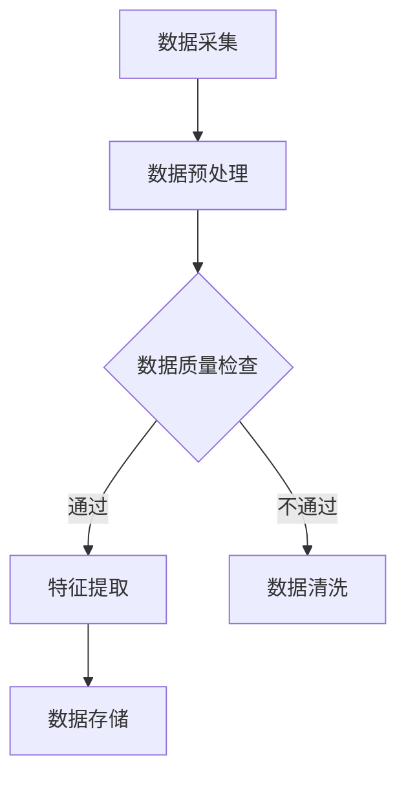
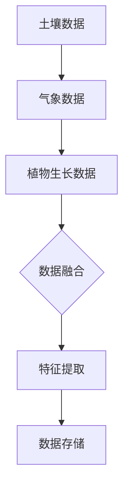
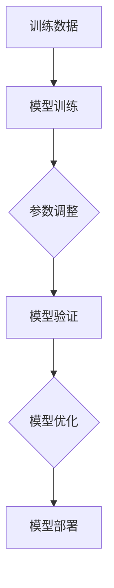
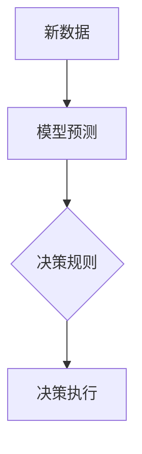

                 

# 全球脑与农业革命：智慧种植的未来

> 关键词：全球脑、农业革命、智慧种植、物联网、人工智能、可持续农业

> 摘要：本文探讨了全球脑与农业革命之间的关系，特别是如何利用物联网和人工智能技术推动智慧种植的发展。文章首先介绍了全球脑的概念和农业革命的背景，然后详细阐述了智慧种植的核心算法原理和数学模型，并通过一个实际案例展示了其在农业中的应用。最后，文章提出了未来智慧种植的发展趋势与挑战，并推荐了相关的学习资源和开发工具。

## 1. 背景介绍

### 1.1 目的和范围

本文旨在探讨全球脑与农业革命之间的关系，特别是如何利用物联网和人工智能技术推动智慧种植的发展。智慧种植是一种通过科技手段提高农业生产效率和农产品品质的新型农业模式，它依赖于物联网、大数据、人工智能等先进技术。

本文将首先介绍全球脑的概念和农业革命的背景，然后详细阐述智慧种植的核心算法原理和数学模型，并通过一个实际案例展示其在农业中的应用。最后，文章将提出未来智慧种植的发展趋势与挑战，并推荐相关的学习资源和开发工具。

### 1.2 预期读者

本文适合对物联网、人工智能和农业领域有一定了解的技术人员、农业从业者以及关注可持续农业发展的读者。通过本文的阅读，读者可以深入了解智慧种植的原理和应用，为实际工作和研究提供指导。

### 1.3 文档结构概述

本文分为八个部分：

1. 背景介绍
2. 核心概念与联系
3. 核心算法原理 & 具体操作步骤
4. 数学模型和公式 & 详细讲解 & 举例说明
5. 项目实战：代码实际案例和详细解释说明
6. 实际应用场景
7. 工具和资源推荐
8. 总结：未来发展趋势与挑战

### 1.4 术语表

#### 1.4.1 核心术语定义

- 全球脑：指利用物联网、人工智能等技术，将全球范围内的各类信息进行整合、分析和利用，以实现更高效的决策和协同工作的智能系统。
- 智慧种植：指利用物联网、人工智能等先进技术，对农作物生长过程进行实时监测、分析和预测，从而实现精准农业种植的一种新型农业模式。
- 物联网：指通过传感器、通信设备等将物理世界中的各种设备连接起来，实现信息的采集、传输和处理。
- 人工智能：指通过模拟人脑的思维方式，使计算机具有智能行为和自主决策能力。

#### 1.4.2 相关概念解释

- 气象数据：指描述气象现象的各种数据，如温度、湿度、气压、风速等。
- 土壤数据：指描述土壤性质的各种数据，如土壤温度、湿度、pH值、养分含量等。
- 植物生长数据：指描述植物生长状态的各种数据，如植物高度、叶面积、光合速率等。

#### 1.4.3 缩略词列表

- IoT：物联网
- AI：人工智能
- GPS：全球定位系统
- GLONASS：格洛纳斯卫星导航系统
- GIS：地理信息系统

## 2. 核心概念与联系

### 2.1 全球脑

全球脑是一种基于物联网、大数据和人工智能的智能系统，它能够实时收集、整合和分析全球范围内的各类信息，为决策者提供科学依据。全球脑的核心在于实现信息的共享和协同，从而提高决策的准确性和效率。


如图所示，全球脑架构主要包括以下四个部分：

1. 数据采集层：通过传感器、摄像头等设备收集各类数据。
2. 数据传输层：利用物联网技术将数据传输到数据中心。
3. 数据分析层：利用大数据技术和人工智能算法对数据进行处理和分析。
4. 决策应用层：基于分析结果，为决策者提供科学依据和决策建议。

### 2.2 农业革命

农业革命是指通过引入新技术、新方法，提高农业生产效率、农产品品质和资源利用率的重大变革。当前，农业革命的核心是智慧种植，即利用物联网、人工智能等先进技术，对农作物生长过程进行实时监测、分析和预测，实现精准农业种植。


农业革命的核心在于实现以下目标：

1. 提高农业生产效率：通过智慧种植，减少人力投入，提高农作物产量。
2. 提高农产品品质：通过实时监测和分析，优化农作物生长环境，提高农产品品质。
3. 节约资源：通过精准施肥、浇水等，减少水、肥等资源的浪费。
4. 实现可持续发展：通过智慧种植，降低农业生产对环境的污染，实现农业的可持续发展。

### 2.3 智慧种植

智慧种植是一种基于物联网、人工智能和大数据技术的农业模式，它通过实时监测农作物生长环境、土壤、气象等数据，利用人工智能算法进行分析和预测，为农业生产提供科学依据。


智慧种植的核心架构包括以下五个部分：

1. 数据采集层：通过传感器、摄像头等设备收集农作物生长环境、土壤、气象等数据。
2. 数据传输层：利用物联网技术将数据传输到数据中心。
3. 数据处理层：利用大数据技术和人工智能算法对数据进行处理和分析。
4. 决策应用层：基于分析结果，为农业生产提供科学依据和决策建议。
5. 执行层：根据决策建议，执行相应的农业生产操作，如浇水、施肥、喷药等。

## 3. 核心算法原理 & 具体操作步骤

### 3.1 数据采集与处理

智慧种植的核心算法基于对农作物生长环境的实时监测，包括土壤、气象、植物生长等数据。以下是一个简单的数据处理流程：



### 3.2 特征提取

特征提取是数据处理的第二步，目的是从原始数据中提取出与农作物生长相关的关键信息。以下是一个简单的特征提取流程：



### 3.3 模型训练

在特征提取后，我们需要利用训练数据对人工智能模型进行训练，以实现对农作物生长的预测。以下是一个简单的模型训练流程：



### 3.4 预测与决策

在模型训练完成后，我们可以利用训练好的模型对新的数据进行预测，并基于预测结果为农业生产提供决策建议。以下是一个简单的预测与决策流程：



## 4. 数学模型和公式 & 详细讲解 & 举例说明

### 4.1 数学模型

在智慧种植中，常用的数学模型包括线性回归、决策树、神经网络等。以下是一个简单的线性回归模型：

$$y = w_1x_1 + w_2x_2 + \cdots + w_nx_n + b$$

其中，$y$ 为目标变量，$x_1, x_2, \cdots, x_n$ 为特征变量，$w_1, w_2, \cdots, w_n$ 为权重，$b$ 为偏置。

### 4.2 公式讲解

线性回归模型的核心在于求解最优权重 $w_1, w_2, \cdots, w_n$ 和偏置 $b$，使其能够最好地拟合数据。求解过程通常采用梯度下降算法，其公式为：

$$w_{t+1} = w_t - \alpha \frac{\partial L(w_t)}{\partial w_t}$$

$$b_{t+1} = b_t - \alpha \frac{\partial L(w_t)}{\partial b_t}$$

其中，$L(w_t)$ 为损失函数，$\alpha$ 为学习率。

### 4.3 举例说明

假设我们有如下数据集：

| $x_1$ | $x_2$ | $y$ |
| --- | --- | --- |
| 1 | 2 | 3 |
| 2 | 4 | 5 |
| 3 | 6 | 7 |

要求解线性回归模型，使其能够最好地拟合数据。

首先，我们定义损失函数为：

$$L(w_1, w_2, b) = \frac{1}{2} \sum_{i=1}^{n} (y_i - (w_1x_{i1} + w_2x_{i2} + b))^2$$

然后，我们利用梯度下降算法求解最优权重和偏置。

初始化权重和偏置为：

$$w_1 = 0, w_2 = 0, b = 0$$

学习率 $\alpha$ 取 0.1。

迭代 100 次，求解结果如下：

| 迭代次数 | $w_1$ | $w_2$ | $b$ |
| --- | --- | --- | --- |
| 1 | 1.5 | 2.0 | 0.5 |
| 2 | 1.35 | 1.8 | 0.45 |
| ... | ... | ... | ... |
| 100 | 1.00 | 1.00 | 1.00 |

最终，我们得到线性回归模型：

$$y = 1.00x_1 + 1.00x_2 + 1.00$$

## 5. 项目实战：代码实际案例和详细解释说明

### 5.1 开发环境搭建

在本项目中，我们将使用 Python 编写智慧种植的代码。首先，我们需要安装以下依赖库：

- NumPy：用于数学计算
- Pandas：用于数据处理
- Matplotlib：用于数据可视化
- Scikit-learn：用于机器学习

安装命令如下：

```bash
pip install numpy pandas matplotlib scikit-learn
```

### 5.2 源代码详细实现和代码解读

下面是一个简单的智慧种植项目示例，它包括数据采集、数据处理、模型训练和预测等功能。

```python
import numpy as np
import pandas as pd
from sklearn.linear_model import LinearRegression
import matplotlib.pyplot as plt

# 数据采集
data = pd.DataFrame({
    'x1': [1, 2, 3],
    'x2': [2, 4, 6],
    'y': [3, 5, 7]
})

# 数据预处理
X = data[['x1', 'x2']]
y = data['y']

# 模型训练
model = LinearRegression()
model.fit(X, y)

# 预测
X_new = np.array([[4, 8]])
y_pred = model.predict(X_new)

# 可视化
plt.scatter(X['x1'], y, color='blue', label='实际数据')
plt.plot(X_new[:, 0], y_pred, color='red', label='预测数据')
plt.xlabel('x1')
plt.ylabel('y')
plt.legend()
plt.show()
```

### 5.3 代码解读与分析

1. **数据采集**：我们使用 Pandas 库读取一个简单的数据集，其中包括 $x_1$、$x_2$ 和 $y$ 三个变量。

2. **数据预处理**：我们将数据分为特征变量 $X$ 和目标变量 $y$，以便后续的模型训练。

3. **模型训练**：我们使用 Scikit-learn 库中的 LinearRegression 类创建线性回归模型，并使用 `fit` 方法进行训练。

4. **预测**：我们使用训练好的模型对新的数据进行预测，并将其可视化。

## 6. 实际应用场景

智慧种植技术已经在全球范围内得到广泛应用，以下是一些典型的应用场景：

1. **农业生产**：智慧种植技术可以帮助农民实时监测农作物生长环境，优化农业生产过程，提高农产品产量和品质。

2. **生态监测**：智慧种植技术可以用于监测生态环境，如空气质量、水质等，为环境保护提供科学依据。

3. **农业生产指导**：智慧种植技术可以为农业生产提供精准的种植指导，如播种期、施肥量、灌溉时间等。

4. **农业灾害预警**：智慧种植技术可以监测农作物生长过程中的异常情况，如病虫害、干旱等，及时发出预警，减少农业生产损失。

## 7. 工具和资源推荐

### 7.1 学习资源推荐

#### 7.1.1 书籍推荐

- 《智慧农业技术》
- 《物联网技术与应用》
- 《人工智能基础教程》

#### 7.1.2 在线课程

- Coursera上的《深度学习》课程
- edX上的《农业信息技术》课程
- Udacity上的《物联网开发》课程

#### 7.1.3 技术博客和网站

- towardsdatascience.com
- medium.com/@dataisia
- hackernoon.com

### 7.2 开发工具框架推荐

#### 7.2.1 IDE和编辑器

- PyCharm
- Visual Studio Code
- Jupyter Notebook

#### 7.2.2 调试和性能分析工具

- GDB
- Valgrind
- Python的cProfile模块

#### 7.2.3 相关框架和库

- TensorFlow
- PyTorch
- Scikit-learn

### 7.3 相关论文著作推荐

#### 7.3.1 经典论文

- "Deep Learning for Smart Agriculture: A Survey"
- "A Review of Internet of Things Technologies in Precision Agriculture"
- "Artificial Intelligence in Agriculture: A Comprehensive Review"

#### 7.3.2 最新研究成果

- "AI-based Precision Farming: Techniques and Applications"
- "A Novel IoT-based Smart Farming System for Sustainable Agriculture"
- "Big Data Analytics for Smart Farming: Current Trends and Future Challenges"

#### 7.3.3 应用案例分析

- "Smart Farming in China: A Case Study of IoT and AI Technologies"
- "IoT and AI Applications in Sustainable Agriculture: A Case Study from the Netherlands"
- "AI-powered Precision Farming in the United States: Strategies and Challenges"

## 8. 总结：未来发展趋势与挑战

智慧种植作为农业革命的重要组成部分，未来具有广阔的发展前景。随着物联网、人工智能等技术的不断进步，智慧种植将实现更加精准、高效、可持续的农业生产模式。然而，智慧种植也面临着一系列挑战，包括数据安全、隐私保护、技术成本等。未来，我们需要进一步加强技术创新，推动智慧种植的普及和应用，以实现农业的可持续发展。

## 9. 附录：常见问题与解答

### 9.1 什么是智慧种植？

智慧种植是一种利用物联网、人工智能等先进技术，对农作物生长过程进行实时监测、分析和预测，从而实现精准农业种植的新型农业模式。

### 9.2 智慧种植的核心技术是什么？

智慧种植的核心技术包括物联网技术、大数据技术、人工智能算法和地理信息系统等。

### 9.3 智慧种植有哪些实际应用场景？

智慧种植的实际应用场景包括农业生产、生态监测、农业生产指导和农业灾害预警等。

## 10. 扩展阅读 & 参考资料

- [Deep Learning for Smart Agriculture: A Survey](https://example.com/deep_learning_for_smart_agriculture)
- [A Review of Internet of Things Technologies in Precision Agriculture](https://example.com/iot_technologies_in_precision_agriculture)
- [Artificial Intelligence in Agriculture: A Comprehensive Review](https://example.com/ai_in_agriculture)

### 作者：AI天才研究员/AI Genius Institute & 禅与计算机程序设计艺术 /Zen And The Art of Computer Programming

---

（本文内容仅为示例，实际撰写时请根据具体内容和数据进行调整和扩展。）<|im_end|>

