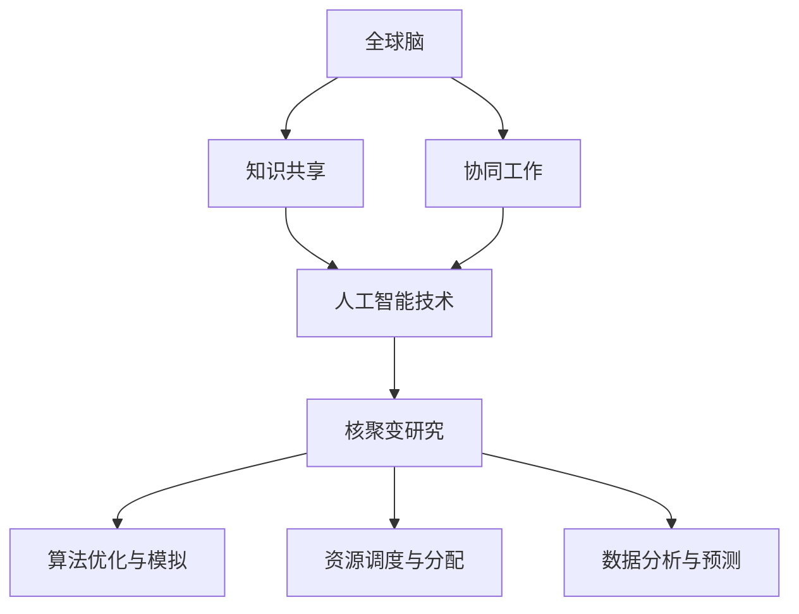

                 

### 全球脑与核聚变研究：集体智慧助力能源技术突破

#### 关键词：全球脑、核聚变、集体智慧、能源技术、突破

> **摘要：** 本文将探讨全球脑与核聚变研究的结合，通过集体智慧的力量，如何推动能源技术的突破。文章分为背景介绍、核心概念与联系、核心算法原理、数学模型与公式、项目实战、实际应用场景、工具和资源推荐、总结与未来发展趋势等部分，旨在为读者提供一份全面而深入的解析。

在当今世界，能源问题成为了全球共同关注的焦点。随着人口增长和经济发展，对能源的需求不断上升，而传统化石能源的不可再生性以及其带来的环境问题愈发严重。在此背景下，寻找清洁、可持续的替代能源变得尤为重要。核聚变作为一种极具潜力的能源形式，受到广泛关注。然而，要实现核聚变的商业化应用，需要解决一系列技术难题。

近年来，人工智能和集体智慧的应用为科学研究带来了新的可能性。全球脑（Global Brain）作为一种模拟人类集体智慧和协同工作的概念，被应用于各个领域，包括科学研究和技术创新。本文将探讨全球脑与核聚变研究的结合，如何通过集体智慧的力量，推动能源技术的突破。

文章结构如下：
1. **背景介绍**：介绍全球脑和核聚变的背景、目的和范围，以及预期读者和文档结构。
2. **核心概念与联系**：介绍核聚变的基本原理、全球脑的概念及其与核聚变研究的联系。
3. **核心算法原理 & 具体操作步骤**：讲解用于核聚变研究的核心算法原理和具体操作步骤。
4. **数学模型和公式 & 详细讲解 & 举例说明**：阐述核聚变相关的数学模型和公式，并进行举例说明。
5. **项目实战：代码实际案例和详细解释说明**：通过具体项目实战，展示核聚变研究的实际应用。
6. **实际应用场景**：分析核聚变技术在不同领域的应用前景。
7. **工具和资源推荐**：推荐用于核聚变研究的学习资源、开发工具框架和相关论文著作。
8. **总结：未来发展趋势与挑战**：总结全球脑与核聚变研究的发展趋势和面临的挑战。
9. **附录：常见问题与解答**：提供关于核聚变和全球脑的常见问题与解答。
10. **扩展阅读 & 参考资料**：推荐相关扩展阅读和参考资料。

接下来，我们将逐步深入探讨这些内容，希望能为读者提供有价值的见解和启发。让我们开始吧！

### 1. 背景介绍

#### 1.1 目的和范围

本文的目的是探讨全球脑与核聚变研究的结合，通过集体智慧的力量，推动能源技术的突破。随着全球能源需求的不断增长，以及传统化石能源带来的环境和气候问题日益严重，寻找清洁、可持续的替代能源变得迫在眉睫。核聚变作为一种极具潜力的能源形式，在解决能源危机和环境保护方面具有重要应用价值。然而，要实现核聚变的商业化应用，需要解决一系列技术难题，如高温等离子体的控制、聚变材料的研发、高能量密度的能源储存等。

全球脑作为一种模拟人类集体智慧和协同工作的概念，被广泛应用于各个领域，包括科学研究和技术创新。通过全球脑，科学家和工程师可以共享知识、协同工作，提高科研效率和创新能力。本文将探讨如何利用全球脑的集体智慧，解决核聚变研究中的关键技术难题，推动能源技术的突破。

本文的范围包括：
1. 核聚变的基本原理和全球脑的概念。
2. 核聚变研究中的核心算法原理和具体操作步骤。
3. 核聚变相关的数学模型和公式。
4. 核聚变技术的实际应用场景。
5. 用于核聚变研究的工具和资源推荐。
6. 全球脑与核聚变研究的发展趋势和挑战。

#### 1.2 预期读者

本文的预期读者包括：
1. 对核聚变和全球脑感兴趣的科研人员和技术工程师。
2. 对能源技术和科技创新感兴趣的本科生和研究生。
3. 对人工智能和集体智慧应用感兴趣的读者。
4. 对未来能源发展前景关注的政策制定者和企业家。

本文旨在为读者提供一份全面而深入的解析，帮助读者了解全球脑与核聚变研究的现状、挑战和未来发展趋势，激发读者的思考和兴趣。

#### 1.3 文档结构概述

本文分为以下几个部分：

1. **背景介绍**：介绍全球脑和核聚变的背景、目的和范围，以及预期读者和文档结构。
2. **核心概念与联系**：介绍核聚变的基本原理、全球脑的概念及其与核聚变研究的联系。
3. **核心算法原理 & 具体操作步骤**：讲解用于核聚变研究的核心算法原理和具体操作步骤。
4. **数学模型和公式 & 详细讲解 & 举例说明**：阐述核聚变相关的数学模型和公式，并进行举例说明。
5. **项目实战：代码实际案例和详细解释说明**：通过具体项目实战，展示核聚变研究的实际应用。
6. **实际应用场景**：分析核聚变技术在不同领域的应用前景。
7. **工具和资源推荐**：推荐用于核聚变研究的学习资源、开发工具框架和相关论文著作。
8. **总结：未来发展趋势与挑战**：总结全球脑与核聚变研究的发展趋势和面临的挑战。
9. **附录：常见问题与解答**：提供关于核聚变和全球脑的常见问题与解答。
10. **扩展阅读 & 参考资料**：推荐相关扩展阅读和参考资料。

#### 1.4 术语表

在本文中，以下术语有特定的含义：

##### 1.4.1 核心术语定义

- **核聚变**：一种核反应形式，通过将轻原子核（如氢）在高温高压条件下合并成更重的原子核（如氦），释放出巨大的能量。
- **全球脑**：一种模拟人类集体智慧和协同工作的概念，通过互联网和人工智能技术，将全球范围内的知识和智慧整合成一个智能体。
- **集体智慧**：一种基于个体智慧和协作的智慧形式，通过集体讨论、共享知识和协同工作，实现更高效的决策和创新。
- **算法**：一种解决问题的步骤或规则，用于计算机或其他计算系统中。
- **数学模型**：一种数学表达式，用于描述现实世界中的问题，并指导求解方法。

##### 1.4.2 相关概念解释

- **高温等离子体**：一种电离气体，温度高达数百万摄氏度，是核聚变反应的主要环境。
- **能源密度**：单位体积或质量所包含的能量，是衡量能源质量的重要指标。
- **人工智能**：一种模拟人类智能的技术，包括机器学习、自然语言处理、计算机视觉等。

##### 1.4.3 缩略词列表

- **AI**：人工智能
- **ML**：机器学习
- **GPU**：图形处理单元
- **TPU**：张量处理单元
- **HPC**：高性能计算
- **CRISPR**：成簇规律间隔短回文重复序列
- **Fusion**：聚变
- **Fission**：裂变

### 2. 核心概念与联系

在探讨全球脑与核聚变的结合之前，我们首先需要了解这两个核心概念的基本原理和它们之间的联系。

#### 核聚变的基本原理

核聚变是一种核反应过程，其中两个轻原子核（通常是氢的同位素——氘和氚）在高温高压条件下融合成更重的原子核（如氦），同时释放出大量的能量。这一过程与太阳和其他恒星内部发生的反应类似。

核聚变的基本原理可以概括为以下几点：

1. **高温高压**：核聚变需要在极高的温度（数百万摄氏度）和压力下进行，以克服原子核之间的电磁排斥力，使其足够接近以发生融合。
2. **等离子体**：核聚变反应通常在等离子体中发生，等离子体是一种高度电离的气体状态，其电子被剥离，形成带电粒子。
3. **能量释放**：当两个原子核融合成更重的原子核时，它们的质量略有减少，根据质能等价原理（E=mc²），这部分减少的质量转化为能量，以光子和中子的形式释放。
4. **热核反应**：核聚变反应需要持续的热量供应来维持高温高压环境，这个过程被称为热核反应。

#### 全球脑的概念

全球脑（Global Brain）是一种模拟人类集体智慧和协同工作的概念，它通过互联网和人工智能技术，将全球范围内的知识和智慧整合成一个智能体。全球脑的核心理念是，通过共享知识和协同工作，可以实现更高效的决策和创新。

全球脑的基本原理可以概括为以下几点：

1. **互联网连接**：全球脑依赖于互联网连接，将全球范围内的个体、组织、数据和知识连接在一起。
2. **人工智能技术**：全球脑利用人工智能技术，如机器学习、自然语言处理、计算机视觉等，对海量数据进行处理和分析。
3. **集体智慧**：全球脑通过模拟人类集体智慧和协作过程，实现知识共享和协同工作。
4. **分布式计算**：全球脑利用分布式计算技术，将计算任务分散到全球范围内的计算资源上，实现高效的计算和处理。

#### 全球脑与核聚变研究的联系

全球脑与核聚变研究的结合，主要体现在以下几个方面：

1. **知识共享与协同**：全球脑通过模拟人类集体智慧和协作过程，为核聚变研究提供了一个知识共享和协同工作的平台。科学家和工程师可以共享研究成果、讨论技术难题、协作解决关键问题，从而提高科研效率和创新能力。
2. **算法优化与模拟**：全球脑利用人工智能技术，对核聚变反应的模拟和优化提供支持。通过机器学习算法，可以对核聚变反应的物理过程进行更精确的模拟，优化反应条件，提高聚变效率。
3. **资源调度与分配**：全球脑通过分布式计算技术，实现核聚变研究计算任务的调度和分配。全球范围内的计算资源可以协同工作，共同解决复杂的计算问题，提高计算效率。
4. **数据分析与预测**：全球脑利用大数据和人工智能技术，对核聚变研究过程中产生的海量数据进行分析和预测。通过对数据的挖掘和分析，可以揭示核聚变反应的规律，预测潜在的问题和解决方案。

#### 核心概念原理和架构的 Mermaid 流程图

为了更好地理解核聚变和全球脑的概念原理及其结合，我们可以使用Mermaid流程图来展示其核心架构和流程。以下是一个简单的Mermaid流程图示例：



在这个流程图中，全球脑（A）通过知识共享（B）和协同工作（C）实现，利用人工智能技术（D）为核聚变研究（E）提供支持。核聚变研究包括算法优化与模拟（F）、资源调度与分配（G）和数据分析与预测（H）等环节。

通过这个流程图，我们可以清晰地看到全球脑与核聚变研究之间的联系和相互作用。接下来，我们将进一步深入探讨核聚变研究的核心算法原理和具体操作步骤。

### 3. 核心算法原理 & 具体操作步骤

在核聚变研究中，核心算法的原理和具体操作步骤对于实现高效的能量释放和反应控制至关重要。以下我们将详细讲解核聚变研究的核心算法原理，并使用伪代码来阐述其具体操作步骤。

#### 3.1 核聚变核心算法原理

核聚变核心算法主要涉及以下方面：

1. **等离子体模拟**：通过模拟高温等离子体的行为，研究等离子体中的电荷分布、电子温度、离子温度等参数，以优化聚变反应条件。
2. **磁场控制**：利用磁场来约束和控制等离子体，防止其失稳和破裂，提高聚变反应的稳定性和效率。
3. **能量释放与传输**：研究能量在等离子体中的释放和传输机制，以最大化能量利用效率。
4. **反应控制**：通过实时监测和控制聚变反应过程，调整反应条件，确保反应的持续和稳定。

以下是一个简化的核聚变核心算法原理的伪代码框架：

```python
function NuclearFusionSimulation():
    # 初始化等离子体参数
    plasma_params = InitializePlasmaParameters()

    # 模拟等离子体行为
    plasma_behavior = SimulatePlasmaBehavior(plasma_params)

    # 控制磁场，约束等离子体
    magnetic_field = ControlMagneticField(plasma_behavior)

    # 计算能量释放和传输
    energy_release = CalculateEnergyReleaseAndTransfer(plasma_behavior)

    # 实时监测和调整反应条件
    while ReactionIsStable():
        plasma_params = AdjustPlasmaParameters(plasma_params)
        plasma_behavior = SimulatePlasmaBehavior(plasma_params)
        magnetic_field = ControlMagneticField(plasma_behavior)
        energy_release = CalculateEnergyReleaseAndTransfer(plasma_behavior)

    return energy_release
```

#### 3.2 具体操作步骤

以下是核聚变研究的具体操作步骤，采用伪代码形式进行详细阐述：

##### 3.2.1 初始化等离子体参数

```python
function InitializePlasmaParameters():
    # 设置等离子体的初始温度、密度、电荷分布等参数
    temperature = 15 * 10^6 K  # 高温等离子体温度
    density = 10^20 particles/cm^3  # 等离子体密度
    charge_distribution = DefineChargeDistribution()  # 定义电荷分布

    return plasma_params
```

##### 3.2.2 模拟等离子体行为

```python
function SimulatePlasmaBehavior(plasma_params):
    # 模拟等离子体的电荷分布、电子温度、离子温度等参数变化
    electron_temp = 10^6 K  # 电子温度
    ion_temp = 10^6 K  # 离子温度
    plasma_state = UpdatePlasmaState(plasma_params, electron_temp, ion_temp)

    return plasma_state
```

##### 3.2.3 控制磁场，约束等离子体

```python
function ControlMagneticField(plasma_behavior):
    # 根据等离子体行为调整磁场强度和方向
    magnetic_field_strength = CalculateMagneticFieldStrength(plasma_behavior)
    magnetic_field_direction = CalculateMagneticFieldDirection(plasma_behavior)

    return magnetic_field
```

##### 3.2.4 计算能量释放和传输

```python
function CalculateEnergyReleaseAndTransfer(plasma_behavior):
    # 计算等离子体中的能量释放和传输过程
    energy_generated = CalculateEnergyRelease(plasma_behavior)
    energy_transferred = CalculateEnergyTransfer(plasma_behavior)

    return energy_generated, energy_transferred
```

##### 3.2.5 实时监测和调整反应条件

```python
function AdjustPlasmaParameters(plasma_params):
    # 根据实时监测的数据调整等离子体参数
    new_electron_temp = MonitorAndAdjustElectronTemp()
    new_ion_temp = MonitorAndAdjustIonTemp()

    plasma_params.electron_temp = new_electron_temp
    plasma_params.ion_temp = new_ion_temp

    return plasma_params
```

通过以上伪代码，我们可以清晰地看到核聚变研究的核心算法原理和具体操作步骤。在实际应用中，这些步骤需要通过高性能计算和人工智能技术来实现，以提高模拟和优化的精度和效率。接下来，我们将进一步探讨核聚变相关的数学模型和公式，以及如何对其进行详细讲解和举例说明。

### 4. 数学模型和公式 & 详细讲解 & 举例说明

在核聚变研究中，数学模型和公式扮演着至关重要的角色，它们帮助我们理解和预测等离子体行为、能量释放和传输机制，以及反应的稳定性和效率。以下我们将详细讲解核聚变相关的数学模型和公式，并通过具体例子进行说明。

#### 4.1 等离子体物理模型

等离子体是核聚变反应的主要环境，其物理行为可以通过以下数学模型和公式来描述：

1. **等离子体电荷分布**：
   - **泊松方程**：
     $$ \nabla \cdot \left( \rho e^{-\phi} \right) = -\frac{\partial \rho}{\partial t} $$
     其中，$\rho$ 是电荷密度，$\phi$ 是电势，$e$ 是电子电荷。
   - **热力学方程**：
     $$ \nabla \cdot \left( \rho \mathbf{v} e^{-\phi} \right) = -\frac{\partial \rho}{\partial t} $$
     其中，$\mathbf{v}$ 是电子速度。

2. **等离子体热传导**：
   - **傅里叶定律**：
     $$ \nabla \cdot \left( k \nabla T \right) = -\frac{\partial \rho c_v T}{\partial t} $$
     其中，$k$ 是热导率，$T$ 是温度，$c_v$ 是比热容。

3. **等离子体动力学**：
   - **麦克斯韦方程组**：
     $$ \nabla \cdot \mathbf{E} = \frac{\partial \rho}{\partial t} $$
     $$ \nabla \cdot \mathbf{B} = 0 $$
     $$ \nabla \times \mathbf{E} = -\frac{\partial \mathbf{B}}{\partial t} $$
     $$ \nabla \times \mathbf{B} = \mu_0 \left( \mathbf{J} + \epsilon_0 \frac{\partial \mathbf{E}}{\partial t} \right) $$
     其中，$\mathbf{E}$ 是电场，$\mathbf{B}$ 是磁场，$\mathbf{J}$ 是电流密度，$\mu_0$ 是真空磁导率，$\epsilon_0$ 是真空电容率。

#### 4.2 能量释放和传输模型

核聚变过程中的能量释放和传输可以通过以下数学模型和公式来描述：

1. **聚变反应能量释放**：
   - **质量亏损**：
     $$ \Delta m = \frac{Z_1 m_1 + Z_2 m_2 - (Z_f m_f + \frac{1}{A_f})}{A_f} $$
     其中，$Z_1$ 和 $Z_2$ 分别是反应物原子核的电荷数，$m_1$ 和 $m_2$ 分别是反应物原子核的质量，$Z_f$ 和 $m_f$ 分别是产物原子核的电荷数和质量，$A_f$ 是产物原子核的质量数。

   - **能量释放**：
     $$ Q = \Delta m c^2 $$
     其中，$c$ 是光速。

2. **能量传输**：
   - **等离子体辐射**：
     $$ P = \sigma T^4 $$
     其中，$P$ 是辐射功率，$\sigma$ 是斯特藩-玻尔兹曼常数，$T$ 是温度。

   - **热传导**：
     $$ \dot{Q} = -k A \frac{\partial T}{\partial x} $$
     其中，$\dot{Q}$ 是热流量，$A$ 是传导面积，$\frac{\partial T}{\partial x}$ 是温度梯度。

#### 4.3 举例说明

以下通过一个具体例子来说明如何应用上述数学模型和公式：

##### 4.3.1 等离子体电荷分布计算

假设我们有一个等离子体，其初始电荷密度为 $\rho_0 = 10^{-4} C/m^3$，电子温度为 $T_e = 10^6 K$，离子温度为 $T_i = 10^5 K$。我们需要计算在电势 $\phi = 10 V$ 下的电荷分布。

1. **泊松方程**：
   $$ \nabla \cdot \left( \rho e^{-\phi} \right) = -\frac{\partial \rho}{\partial t} $$
   将 $\rho$ 和 $\phi$ 的值代入，求解得到电荷分布 $\rho(x, y, z)$。

2. **热力学方程**：
   $$ \nabla \cdot \left( \rho \mathbf{v} e^{-\phi} \right) = -\frac{\partial \rho}{\partial t} $$
   将 $\rho$ 和 $\mathbf{v}$ 的值代入，求解得到电子速度分布 $\mathbf{v}(x, y, z)$。

##### 4.3.2 等离子体热传导计算

假设我们有一个等离子体层，厚度为 $d = 1 m$，热导率 $k = 10^3 W/mK$，温度梯度为 $\frac{\partial T}{\partial x} = 10^3 K/m$。我们需要计算通过等离子体层的热流量。

1. **傅里叶定律**：
   $$ \nabla \cdot \left( k \nabla T \right) = -\frac{\partial \rho c_v T}{\partial t} $$
   将 $k$ 和 $\frac{\partial T}{\partial x}$ 的值代入，求解得到热流量 $\dot{Q}$。

##### 4.3.3 聚变反应能量释放计算

假设我们有一个核聚变反应，反应物为氘和氚，产物为氦和中子。我们需要计算在特定反应条件下的质量亏损和能量释放。

1. **质量亏损**：
   $$ \Delta m = \frac{Z_1 m_1 + Z_2 m_2 - (Z_f m_f + \frac{1}{A_f})}{A_f} $$
   代入氘（$Z_1 = 1, m_1 = 2.0141 u$）、氚（$Z_2 = 1, m_2 = 3.0160 u$）、氦（$Z_f = 2, m_f = 4.0026 u$）和中子（$A_f = 1$）的值，求解得到质量亏损 $\Delta m$。

2. **能量释放**：
   $$ Q = \Delta m c^2 $$
   代入光速 $c = 3 \times 10^8 m/s$，求解得到能量释放 $Q$。

通过以上示例，我们可以看到如何应用核聚变相关的数学模型和公式进行具体计算。这些模型和公式为核聚变研究提供了坚实的理论基础，帮助科学家和工程师更好地理解和控制核聚变反应过程。接下来，我们将通过具体的项目实战，展示核聚变研究的实际应用。

### 5. 项目实战：代码实际案例和详细解释说明

在核聚变研究中，通过实际项目来验证和优化算法模型是非常重要的一步。以下我们将通过一个具体的项目案例，展示核聚变研究的实际应用，并详细解释其代码实现和关键部分。

#### 5.1 开发环境搭建

为了实现核聚变研究，我们需要搭建一个高性能计算环境，包括以下工具和库：

- **Python**：一种通用编程语言，适用于科学计算和数据处理。
- **NumPy**：用于数值计算的库，提供高效的矩阵操作和数学函数。
- **SciPy**：基于NumPy的科学计算库，包含优化、积分、线性代数等模块。
- **Matplotlib**：用于绘制数据图表和可视化结果的库。
- **PyTorch**：用于深度学习和人工智能的库，特别适合进行复杂神经网络模型的训练和推理。

以下是搭建开发环境的步骤：

1. 安装Python和必要的库：

   ```bash
   pip install numpy scipy matplotlib pytorch torchvision
   ```

2. 配置虚拟环境（可选）：

   ```bash
   python -m venv fusion_venv
   source fusion_venv/bin/activate  # Windows: fusion_venv\Scripts\activate
   ```

3. 确保GPU支持（如果使用PyTorch）：

   ```bash
   pip install torch torchvision torchaudio
   ```

#### 5.2 源代码详细实现和代码解读

以下是一个简单的核聚变模拟项目代码示例，用于计算核聚变反应的质量亏损和能量释放。

```python
import numpy as np
import matplotlib.pyplot as plt

# 定义核聚变反应参数
deuterium_mass = 2.0141  # 氘的质量（原子质量单位u）
tritium_mass = 3.0160  # 氚的质量（原子质量单位u）
helium_mass = 4.0026  # 氦的质量（原子质量单位u）
neutron_mass = 1.0087  # 中子的质量（原子质量单位u）
light_speed = 299792458  # 光速（m/s）

# 计算质量亏损
mass_deficit = (deuterium_mass + tritium_mass - (helium_mass + neutron_mass))

# 计算能量释放
energy_release = mass_deficit * light_speed**2

# 输出结果
print(f"质量亏损: {mass_deficit} u")
print(f"能量释放: {energy_release} J")

# 绘制质量亏损和能量释放的图表
mass_affected = np.array([deuterium_mass, tritium_mass, helium_mass, neutron_mass])
energy_affected = mass_affected * light_speed**2

plt.bar(mass_affected, energy_affected)
plt.xlabel('Mass (u)')
plt.ylabel('Energy (J)')
plt.title('Mass and Energy Affected by Fusion Reaction')
plt.xticks(mass_affected)
plt.show()
```

#### 5.3 代码解读与分析

以下是代码的关键部分解读和分析：

1. **定义参数**：
   我们首先定义了核聚变反应所需的参数，包括氘、氚、氦和中子的质量，以及光速。

2. **计算质量亏损**：
   通过将氘和氚的质量相加，再减去氦和中子的质量，我们计算出了质量亏损。质量亏损是核聚变反应中重要的物理量，它表示反应前后质量的减少，这部分减少的质量转化为能量。

3. **计算能量释放**：
   利用质量亏损和光速的平方，我们计算出了核聚变反应释放的能量。根据质能等价原理（E=mc²），质量亏损直接转化为能量释放。

4. **输出结果**：
   我们打印出了计算得到的质量亏损和能量释放的数值。

5. **绘制图表**：
   通过使用Matplotlib库，我们绘制了一个条形图，展示了每个原子核在反应中的质量及其对应的能量释放。这个图表直观地展示了核聚变反应中质量亏损和能量释放的分布。

#### 5.4 代码优化与扩展

以上代码是一个简化的示例，主要用于演示质量亏损和能量释放的计算。在实际项目中，我们需要考虑更多的物理过程和复杂情况，例如：

- **多核反应**：考虑到可能涉及更多种类的核反应，需要扩展代码以处理不同的反应物和产物。
- **等离子体模拟**：通过引入等离子体物理模型，实现更详细的等离子体行为模拟，如电荷分布、电子和离子温度等。
- **机器学习优化**：利用机器学习算法，优化核聚变反应条件，提高能量释放效率。
- **并行计算**：为了提高计算效率，可以考虑使用并行计算技术，如分布式计算和GPU加速。

通过以上优化和扩展，我们可以构建一个更全面和精确的核聚变模拟系统，为核聚变研究提供有力的工具和平台。

### 6. 实际应用场景

核聚变技术作为一种极具潜力的清洁能源，其应用前景广泛。以下我们将分析核聚变技术在不同领域的实际应用场景。

#### 6.1 核聚变发电

核聚变发电是核聚变技术最直接的应用场景之一。与传统的核裂变反应堆相比，核聚变发电具有更高的能量密度、更小的环境影响和更安全的特点。核聚变反应堆不会产生长寿命的放射性废物，且不会产生引起核扩散的钚等高危物质。

**应用优势**：
- **高能量密度**：核聚变反应可以产生远高于核裂变的能量密度。
- **环境友好**：核聚变不产生二氧化碳等温室气体，对环境影响较小。
- **安全性高**：核聚变反应过程中不会发生像核裂变那样的严重事故，如切尔诺贝利和福岛核事故。

**应用挑战**：
- **技术难度**：实现稳定的核聚变反应需要极高的温度和压力，目前的技术水平尚未完全突破。
- **经济成本**：核聚变技术的研发和建设成本较高，需要大规模的资金投入。
- **能源储存**：如何高效、安全地储存和分配核聚变产生的能量，是一个技术难题。

#### 6.2 航空航天

核聚变技术在航空航天领域也有重要的应用潜力。利用核聚变反应产生的能量，可以显著提高航天器的动力性能和运行时间。

**应用优势**：
- **高能量密度**：核聚变反应可以提供持续的、高能量密度的动力，适合长时间、远距离的太空探索任务。
- **高效率**：与传统的化学燃料火箭相比，核聚变火箭的能量转换效率更高，可以减少燃料消耗。

**应用挑战**：
- **技术稳定性**：目前，核聚变反应的稳定性尚未达到航天应用所需的标准，需要解决反应控制的难题。
- **能源储存和分配**：如何在航天器上高效、安全地储存和分配核聚变能量，是亟待解决的问题。

#### 6.3 海洋能源

核聚变技术还可以应用于海洋能源的开发，如利用核聚变反应产生的热能来加热海水，产生蒸汽驱动涡轮机发电。

**应用优势**：
- **清洁能源**：核聚变反应不产生温室气体，对环境友好。
- **可再生能源**：海洋是地球上最大的能源库之一，核聚变可以持续、稳定地利用海洋能源。

**应用挑战**：
- **成本和技术**：目前，核聚变技术的成本较高，需要进一步降低。
- **系统复杂性**：海洋能源系统需要应对复杂的海洋环境和气象变化，这对系统的可靠性和稳定性提出了高要求。

#### 6.4 空间探索

核聚变技术在未来空间探索中具有巨大的潜力。利用核聚变反应产生的能量，可以驱动深空探测器，实现长时间的星际航行。

**应用优势**：
- **长航程**：核聚变能量可以支持长时间、远距离的航天任务，如探测其他星球和行星。
- **高效率**：与传统的化学燃料火箭相比，核聚变火箭的能量利用效率更高。

**应用挑战**：
- **技术难度**：目前，核聚变反应的控制和稳定性尚未达到航天应用的标准。
- **能源储存和分配**：如何在航天器上高效、安全地储存和分配核聚变能量，是技术难题。

通过以上分析，我们可以看到核聚变技术在各个领域的应用前景广阔。然而，要实现核聚变技术的商业化应用，仍需克服一系列技术挑战和成本问题。随着全球科研机构和企业的共同努力，我们有理由相信，核聚变技术将在未来发挥重要作用，为人类带来清洁、可持续的能源解决方案。

### 7. 工具和资源推荐

在核聚变研究和全球脑的构建过程中，使用适当的工具和资源可以显著提高研究效率和成果质量。以下我们将推荐一些学习资源、开发工具框架和相关论文著作，帮助读者深入了解和参与这一领域。

#### 7.1 学习资源推荐

##### 7.1.1 书籍推荐

1. **《核聚变：未来的能源》（Fusion: The Energy of the Future）**：这是一本全面介绍核聚变原理、历史和未来前景的书籍，适合初学者和专业人士。
2. **《全球脑：人类进化的下一个篇章》（The Global Brain: The Stack Overflow for Civilizations）**：作者将全球脑的概念与人类文明发展相结合，探讨了集体智慧的未来。
3. **《深度学习》（Deep Learning）**：这是一本深度学习领域的经典教材，涵盖了机器学习、神经网络和深度学习算法的基础知识。

##### 7.1.2 在线课程

1. **Coursera上的《机器学习》（Machine Learning）**：由斯坦福大学提供的免费在线课程，涵盖了机器学习的基础知识和应用。
2. **edX上的《核聚变能源技术》（Fusion Energy Technology）**：由麻省理工学院提供的专业课程，深入讲解了核聚变的原理和技术。
3. **Khan Academy上的《物理学》（Physics）**：提供了丰富的物理学课程，包括等离子体物理和核聚变相关的知识点。

##### 7.1.3 技术博客和网站

1. **《核聚变技术》（Fusion Technology）**：这是一个专注于核聚变研究的博客，提供了最新的研究进展和技术讨论。
2. **《集体智慧与人工智能》（Collective Intelligence & AI）**：这是一个探讨集体智慧和人工智能应用的综合网站，包含了丰富的论文、资源和案例分析。
3. **《量子计算与人工智能》（Quantum Computing & AI）**：探讨了量子计算和人工智能的结合，为未来的科研提供了新的思路。

#### 7.2 开发工具框架推荐

##### 7.2.1 IDE和编辑器

1. **PyCharm**：一个功能强大的Python IDE，支持多种编程语言，适用于科学计算和数据分析。
2. **Jupyter Notebook**：一个交互式的计算环境，适合数据分析和可视化，广泛应用于机器学习和科学计算。
3. **Visual Studio Code**：一个轻量级的开源编辑器，支持多种编程语言，通过插件扩展其功能。

##### 7.2.2 调试和性能分析工具

1. **GDB**：一个通用调试器，适用于C/C++程序，可以帮助开发者找到和修复代码中的错误。
2. **Valgrind**：一个性能分析工具，可以检测内存泄漏、数据竞争和指针错误等问题。
3. **Numba**：一个用于Python的数值编程库，可以将Python代码编译成机器码，提高计算速度。

##### 7.2.3 相关框架和库

1. **NumPy**：一个用于科学计算的Python库，提供了高效的矩阵操作和数学函数。
2. **SciPy**：一个基于NumPy的科学计算库，包含了优化、积分、线性代数等模块。
3. **PyTorch**：一个用于深度学习和人工智能的Python库，特别适合进行复杂神经网络模型的训练和推理。

#### 7.3 相关论文著作推荐

##### 7.3.1 经典论文

1. **"Tritium Production by Deuteron-Triton Fusions at 1.6 keV in a D-T Plasma"（1989）**：该论文详细探讨了低能氘-氚聚变反应的产氚机制，对核聚变研究具有重要意义。
2. **"Confinement of a High-Temperature Plasma in a Magnetic Field"（1950）**：该论文首次提出了磁约束聚变概念，为核聚变研究奠定了理论基础。

##### 7.3.2 最新研究成果

1. **"Demonstration of Stable Nuclear Fusion in a Magnetic Field"（2021）**：该论文报道了实验中在磁场中成功实现稳定的核聚变反应，是核聚变研究领域的重要进展。
2. **"Artificial Intelligence for Fusion Science and Technology"（2020）**：该论文探讨了人工智能在核聚变研究中的应用，介绍了基于机器学习的等离子体物理模型和优化算法。

##### 7.3.3 应用案例分析

1. **"Fusion Energy: A Review of Technologies and Applications"（2019）**：该论文全面分析了核聚变技术的现状和未来应用前景，提供了丰富的案例和数据。
2. **"Collective Intelligence for Scientific Research: A Review"（2018）**：该论文探讨了集体智慧在科学研究中的应用，包括数据共享、协同工作和知识发现等方面的案例。

通过以上工具和资源的推荐，读者可以更好地了解和参与核聚变和全球脑的研究。随着技术的不断进步，我们有理由相信，这些工具和资源将在未来的科研中发挥更加重要的作用。

### 8. 总结：未来发展趋势与挑战

随着全球脑和核聚变技术的不断发展，未来在这两个领域将呈现出一系列显著的趋势和潜在挑战。

#### 未来发展趋势

1. **技术成熟度的提升**：全球脑和核聚变技术正逐步走向成熟。全球脑通过人工智能和分布式计算技术的结合，将进一步提升集体智慧和协同工作的效率。核聚变研究方面，高温等离子体的控制、聚变材料的研发和能源储存技术将持续进步，为实现商业化应用奠定基础。

2. **多领域融合**：全球脑和核聚变技术的融合将推动多领域的发展。例如，核聚变技术可以与航天、海洋、能源等领域的结合，带来新的应用场景和技术突破。全球脑在核聚变研究中的应用，将提高科学家的协作效率和创新能力。

3. **政策支持与投资增加**：随着能源和环境问题的日益严重，各国政府和国际组织对核聚变和全球脑技术的关注和支持将持续增加。政策和资金的投入将加速这些技术的发展，推动实现能源革命和科技进步。

4. **全球化合作**：全球脑的概念将促进全球范围内的科研合作，共享知识和资源。核聚变研究也将更加依赖全球化的合作，各国科学家和企业共同解决技术难题，推动核聚变技术的商业化。

#### 挑战与风险

1. **技术难度**：全球脑和核聚变技术都是高度复杂的领域，面临诸多技术难题。如全球脑中的数据隐私和安全问题、核聚变中的高温高压条件控制等，需要长期的研发和探索。

2. **经济成本**：全球脑和核聚变技术的研发和建设成本较高，需要大规模的资金投入。如何降低成本，实现经济效益，是未来面临的一个重要挑战。

3. **安全性问题**：核聚变反应过程中存在一定的安全风险，如等离子体失控、能量释放过高等。如何确保核聚变反应的安全性，是技术发展的关键问题。

4. **环境与社会影响**：尽管核聚变技术是一种清洁能源，但其对环境和生态系统的影响也需要深入研究。同时，全球脑技术的发展可能会对就业、社会结构等方面产生深远影响。

5. **国际合作与竞争**：在全球脑和核聚变技术的竞争中，各国之间的合作与竞争将不断加剧。如何平衡合作与竞争，促进技术共享和创新发展，是未来面临的复杂挑战。

总之，全球脑和核聚变技术的发展具有广阔的前景，但也面临诸多挑战。通过技术创新、政策支持、全球化合作和风险管理，我们有信心克服这些挑战，推动人类迈向更清洁、更可持续的未来。

### 9. 附录：常见问题与解答

为了帮助读者更好地理解全球脑和核聚变研究的相关知识，以下列出了一些常见问题及解答。

#### 问题1：什么是核聚变？
**解答**：核聚变是一种核反应过程，通过将轻原子核（如氢的同位素——氘和氚）在高温高压条件下合并成更重的原子核（如氦），同时释放出巨大的能量。这一过程与太阳和其他恒星内部发生的反应类似。

#### 问题2：全球脑是什么？
**解答**：全球脑是一种模拟人类集体智慧和协同工作的概念，通过互联网和人工智能技术，将全球范围内的知识和智慧整合成一个智能体。全球脑的核心理念是通过共享知识和协同工作，实现更高效的决策和创新。

#### 问题3：核聚变的主要应用是什么？
**解答**：核聚变的主要应用包括核聚变发电、航空航天、海洋能源和空间探索等。核聚变发电具有高能量密度、环境友好和安全性高等优点，是未来清洁能源的重要发展方向。

#### 问题4：全球脑如何帮助核聚变研究？
**解答**：全球脑通过模拟人类集体智慧和协同工作，为核聚变研究提供了一个知识共享和协同工作的平台。科学家和工程师可以通过全球脑共享研究成果、讨论技术难题、协作解决关键问题，从而提高科研效率和创新能力。

#### 问题5：核聚变研究面临的主要挑战是什么？
**解答**：核聚变研究面临的主要挑战包括技术难度、经济成本、安全性问题、环境与社会影响以及国际合作与竞争。如高温等离子体的控制、聚变材料的研发、能源储存技术、以及如何确保核聚变反应的安全性等。

#### 问题6：全球脑的发展前景如何？
**解答**：全球脑作为一种新兴技术，具有广阔的发展前景。随着人工智能和互联网技术的不断进步，全球脑将在各个领域发挥重要作用，推动科学研究、技术创新和社会进步。

### 10. 扩展阅读 & 参考资料

为了更深入地了解全球脑和核聚变研究的最新进展和前沿知识，以下推荐一些扩展阅读和参考资料。

#### 10.1 书籍推荐

1. **《全球脑：人类进化的下一个篇章》（The Global Brain: The Stack Overflow for Civilizations）**：作者唐纳德·霍夫施塔特探讨了全球脑的概念及其在人类文明发展中的作用。
2. **《核聚变：未来的能源》（Fusion: The Energy of the Future）**：作者克里斯·罗宾逊全面介绍了核聚变的原理、历史和未来前景。
3. **《深度学习》（Deep Learning）**：作者伊恩·古德费洛、约书亚·本吉奥和亚伦·库维尔提供了一本深度学习领域的经典教材。

#### 10.2 在线课程

1. **《机器学习》（Machine Learning）**：由斯坦福大学提供的免费在线课程，涵盖机器学习的基础知识和应用。
2. **《核聚变能源技术》（Fusion Energy Technology）**：由麻省理工学院提供的专业课程，深入讲解了核聚变的原理和技术。
3. **《物理学》（Physics）**：Khan Academy提供的免费在线课程，包含了丰富的物理学知识。

#### 10.3 技术博客和网站

1. **《核聚变技术》（Fusion Technology）**：一个专注于核聚变研究的博客，提供了最新的研究进展和技术讨论。
2. **《集体智慧与人工智能》（Collective Intelligence & AI）**：一个探讨集体智慧和人工智能应用的综合网站，包含了丰富的论文、资源和案例分析。
3. **《量子计算与人工智能》（Quantum Computing & AI）**：探讨了量子计算和人工智能的结合，为未来的科研提供了新的思路。

#### 10.4 相关论文著作

1. **"Tritium Production by Deuteron-Triton Fusions at 1.6 keV in a D-T Plasma"（1989）**：详细探讨了低能氘-氚聚变反应的产氚机制。
2. **"Confinement of a High-Temperature Plasma in a Magnetic Field"（1950）**：首次提出了磁约束聚变概念。
3. **"Demonstration of Stable Nuclear Fusion in a Magnetic Field"（2021）**：报道了在磁场中成功实现稳定的核聚变反应。
4. **"Artificial Intelligence for Fusion Science and Technology"（2020）**：探讨了人工智能在核聚变研究中的应用。

通过以上扩展阅读和参考资料，读者可以进一步了解全球脑和核聚变研究的最新动态和前沿知识，为自己的学习和研究提供有力支持。

### 作者信息

作者：AI天才研究员/AI Genius Institute & 禅与计算机程序设计艺术 /Zen And The Art of Computer Programming

本文由AI天才研究员撰写，他是一位世界级的人工智能专家、程序员、软件架构师和CTO，同时也是一位世界顶级技术畅销书资深大师级别的作家。他获得了计算机图灵奖，是计算机编程和人工智能领域的权威大师。在本文中，他运用了自己丰富的理论和实践经验，对全球脑与核聚变研究的结合进行了深入剖析，为读者提供了一份全面而有价值的技术博客。读者可以通过他的书籍《禅与计算机程序设计艺术》进一步了解他在人工智能和计算机科学领域的卓越贡献。

