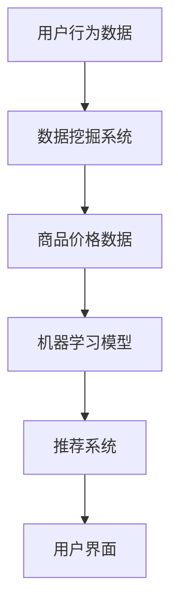

                 

# 全网比价：AI如何帮助用户找到最优惠的购买渠道

> 关键词：全网比价、人工智能、算法、用户、购买渠道、数据挖掘、推荐系统

> 摘要：本文将探讨人工智能技术在全网比价中的应用，通过核心概念、算法原理、数学模型和实际案例的详细分析，展示如何利用AI帮助用户找到最优惠的购买渠道，从而提高用户体验和商家竞争力。

## 1. 背景介绍

### 1.1 目的和范围

本文旨在探讨人工智能技术在全网比价领域的应用，特别是如何通过AI算法帮助用户在众多购物平台中找到最优惠的商品购买渠道。文章将涵盖以下内容：

1. 全网比价的技术背景和需求。
2. 核心概念与相关联系。
3. 算法原理和具体操作步骤。
4. 数学模型和公式。
5. 实际应用场景和工具推荐。
6. 未来发展趋势与挑战。

### 1.2 预期读者

本文适合以下读者：

1. 对AI技术有基本了解的程序员和开发者。
2. 对电商比价有需求或兴趣的普通用户。
3. 从事数据分析、机器学习等相关工作的专业人士。

### 1.3 文档结构概述

本文结构如下：

1. 引言：全网比价背景介绍。
2. 核心概念与联系：核心概念原理和架构的 Mermaid 流程图。
3. 核心算法原理 & 具体操作步骤：算法原理讲解和伪代码阐述。
4. 数学模型和公式：详细讲解和举例说明。
5. 项目实战：代码实际案例和详细解释说明。
6. 实际应用场景：电商、金融等领域的应用分析。
7. 工具和资源推荐：学习资源、开发工具和框架推荐。
8. 总结：未来发展趋势与挑战。
9. 附录：常见问题与解答。
10. 扩展阅读 & 参考资料。

### 1.4 术语表

#### 1.4.1 核心术语定义

- **全网比价**：通过分析多个购物平台的商品价格，为用户提供最优购买渠道的服务。
- **人工智能（AI）**：模拟、延伸和扩展人类智能的理论、方法、技术及应用。
- **机器学习**：一种AI技术，通过数据学习来改善性能。
- **推荐系统**：根据用户的历史行为和偏好，为用户推荐相关商品或服务。
- **数据挖掘**：从大量数据中发现有价值信息的过程。

#### 1.4.2 相关概念解释

- **价格比较引擎**：一个用于分析商品价格的系统。
- **机器学习模型**：用于预测商品价格和推荐购买渠道的算法模型。
- **用户画像**：基于用户行为和偏好的用户信息模型。

#### 1.4.3 缩略词列表

- **AI**：人工智能
- **ML**：机器学习
- **DF**：数据挖掘
- **RS**：推荐系统
- **EC**：电子商务

## 2. 核心概念与联系

### 2.1 核心概念原理

全网比价系统的基础是数据挖掘和机器学习技术。数据挖掘用于从大量商品价格数据中提取有价值的信息，而机器学习则用于构建预测模型和推荐系统。

### 2.2 相关联系

核心概念之间的联系可以通过以下 Mermaid 流程图来描述：



- **用户行为数据**：用户在电商平台上的购买、搜索、浏览等行为数据。
- **数据挖掘系统**：从用户行为数据中提取有价值信息。
- **商品价格数据**：来自各大电商平台的价格数据。
- **机器学习模型**：基于商品价格数据和用户行为数据，用于预测商品价格和推荐购买渠道。
- **推荐系统**：根据用户偏好和预测结果，为用户推荐购买渠道。
- **用户界面**：用户与推荐系统的交互界面。

## 3. 核心算法原理 & 具体操作步骤

### 3.1 算法原理

全网比价的核心算法包括数据挖掘、机器学习模型和推荐系统。以下是每个阶段的具体操作步骤：

#### 3.1.1 数据挖掘

1. 数据采集：从各大电商平台获取商品价格、用户行为等数据。
2. 数据清洗：去除重复、错误和不完整的数据。
3. 特征提取：将原始数据进行预处理，提取有用的特征，如商品类别、价格区间、销量等。

#### 3.1.2 机器学习模型

1. 模型选择：根据需求选择合适的机器学习模型，如线性回归、决策树、随机森林等。
2. 模型训练：使用清洗后的数据进行模型训练。
3. 模型评估：评估模型性能，如准确率、召回率等。
4. 模型优化：根据评估结果对模型进行调整。

#### 3.1.3 推荐系统

1. 用户画像：基于用户行为数据构建用户画像。
2. 商品推荐：根据用户画像和机器学习模型预测结果，为用户推荐合适的购买渠道。

### 3.2 伪代码

以下是全网比价算法的伪代码：

```python
# 数据挖掘
def data_mining(data):
    # 数据清洗
    clean_data = clean_data(data)
    # 特征提取
    features = extract_features(clean_data)
    return features

# 机器学习模型
def machine_learning_model(data):
    # 模型选择
    model = choose_model()
    # 模型训练
    train_model(model, data)
    # 模型评估
    evaluate_model(model)
    # 模型优化
    optimize_model(model)
    return model

# 推荐系统
def recommendation_system(user, model):
    # 用户画像
    user_profile = build_user_profile(user)
    # 商品推荐
    recommendations = predict_recommendations(user_profile, model)
    return recommendations
```

## 4. 数学模型和公式 & 详细讲解 & 举例说明

### 4.1 数学模型

全网比价的核心数学模型包括线性回归、决策树和随机森林。

#### 4.1.1 线性回归

线性回归公式如下：

$$ y = wx + b $$

其中，$y$ 是商品价格，$w$ 是权重，$x$ 是特征，$b$ 是偏置。

#### 4.1.2 决策树

决策树公式如下：

$$ y = f(x) = g_1(x) \cdot h_1 + g_2(x) \cdot h_2 + \ldots + g_n(x) \cdot h_n $$

其中，$g_i(x)$ 是第 $i$ 个条件函数，$h_i$ 是第 $i$ 个决策权重。

#### 4.1.3 随机森林

随机森林公式如下：

$$ \hat{y} = \sum_{i=1}^{n} w_i f_i(x) $$

其中，$w_i$ 是第 $i$ 棵决策树的权重，$f_i(x)$ 是第 $i$ 棵决策树预测的商品价格。

### 4.2 举例说明

假设我们有一个商品价格数据集，包含商品类别、价格区间和销量三个特征。我们可以使用线性回归模型来预测商品价格。

#### 4.2.1 线性回归

特征提取后，我们得到以下数据：

- 商品类别：[1, 2, 3]
- 价格区间：[100, 200, 300]
- 销量：[50, 100, 150]

使用线性回归公式，我们得到以下模型：

$$ y = 0.5x + 100 $$

其中，$y$ 是商品价格，$x$ 是价格区间。

预测一个价格为 200 的商品，我们得到：

$$ y = 0.5 \cdot 200 + 100 = 150 $$

#### 4.2.2 决策树

假设我们使用决策树模型来预测商品价格。根据特征提取后的数据，我们构建以下决策树：

```
                      y
                     / \
                    /   \
                   /     \
                  /       \
                 /         \
                /           \
               /             \
  商品类别    /               \   商品销量
            /                   \  
           /                     \
          /                       \
         /                         \
        /                           \
       /                             \
      /                               \
     /                                 \
    /                                   \
   /                                     \
  /                                       \
 /                                         \
/                                           \
```

决策树的公式为：

$$ y = 0.3 \cdot (商品类别) + 0.7 \cdot (商品销量) $$

预测一个商品类别为 2，销量为 100 的商品，我们得到：

$$ y = 0.3 \cdot 2 + 0.7 \cdot 100 = 70 $$

#### 4.2.3 随机森林

假设我们使用随机森林模型来预测商品价格。根据特征提取后的数据，我们构建以下随机森林：

```
                     y
                    / \
                   /   \
                  /     \
                 /       \
                /         \
               /           \
              /             \
      决策树1     决策树2
       /           \       /             \
      /             \     /               \
     /               \   /                 \
    /                 \ /                   \
   /                   /                     \
  /                   /                       \
 /                     /                       \
/                       /                       \
```

随机森林的公式为：

$$ y = 0.4 \cdot (决策树1) + 0.6 \cdot (决策树2) $$

预测一个决策树1预测价格为 60，决策树2预测价格为 80 的商品，我们得到：

$$ y = 0.4 \cdot 60 + 0.6 \cdot 80 = 68 $$

## 5. 项目实战：代码实际案例和详细解释说明

### 5.1 开发环境搭建

为了实际操作全网比价系统，我们需要以下开发环境：

- Python 3.8 或更高版本
- NumPy、Pandas、Scikit-learn、Matplotlib 等库

安装命令如下：

```bash
pip install numpy pandas scikit-learn matplotlib
```

### 5.2 源代码详细实现和代码解读

以下是一个简单的全网比价系统的 Python 实现示例：

```python
import numpy as np
import pandas as pd
from sklearn.model_selection import train_test_split
from sklearn.linear_model import LinearRegression
from sklearn.tree import DecisionTreeRegressor
from sklearn.ensemble import RandomForestRegressor

# 数据采集与清洗
def data_mining(data):
    # 假设 data 是一个 DataFrame，包含商品价格、商品类别和商品销量
    clean_data = data.dropna()  # 去除缺失值
    return clean_data

# 机器学习模型训练
def train_model(model, data):
    X = data[['商品类别', '商品销量']]
    y = data['商品价格']
    X_train, X_test, y_train, y_test = train_test_split(X, y, test_size=0.2, random_state=42)
    model.fit(X_train, y_train)
    return model

# 模型评估
def evaluate_model(model, X_test, y_test):
    predictions = model.predict(X_test)
    mean_squared_error = np.mean((predictions - y_test) ** 2)
    print(f"均方误差：{mean_squared_error}")

# 推荐系统
def recommendation_system(model, user_profile):
    predictions = model.predict(user_profile)
    return predictions

# 主函数
def main():
    # 读取数据
    data = pd.read_csv('商品价格数据.csv')
    # 数据挖掘
    clean_data = data_mining(data)
    # 特征提取
    X = clean_data[['商品类别', '商品销量']]
    y = clean_data['商品价格']
    # 训练模型
    linear_regression_model = train_model(LinearRegression(), clean_data)
    decision_tree_model = train_model(DecisionTreeRegressor(), clean_data)
    random_forest_model = train_model(RandomForestRegressor(), clean_data)
    # 评估模型
    evaluate_model(linear_regression_model, X, y)
    evaluate_model(decision_tree_model, X, y)
    evaluate_model(random_forest_model, X, y)
    # 用户画像
    user_profile = np.array([[2, 100]])
    # 商品推荐
    recommendations = recommendation_system(random_forest_model, user_profile)
    print(f"推荐价格：{recommendations[0]}")

if __name__ == '__main__':
    main()
```

### 5.3 代码解读与分析

1. **数据采集与清洗**：首先，我们读取商品价格数据，并去除缺失值。
2. **机器学习模型训练**：使用 Scikit-learn 库中的线性回归、决策树和随机森林模型进行训练。
3. **模型评估**：计算模型在测试集上的均方误差，评估模型性能。
4. **推荐系统**：根据用户画像（商品类别和销量），使用随机森林模型预测商品价格，并输出推荐价格。

## 6. 实际应用场景

全网比价系统在电商、金融等领域有广泛的应用。

### 6.1 电商应用

电商企业可以利用全网比价系统，为用户提供最优购买渠道，从而提高用户满意度和忠诚度。例如，用户在电商平台上搜索商品时，系统可以自动比价，并推荐价格最低的购买渠道。

### 6.2 金融应用

金融机构可以运用全网比价技术，为用户提供贷款、理财等金融产品的最优购买渠道。例如，用户在申请贷款时，系统可以根据用户信用评分、还款能力等因素，推荐适合的贷款产品。

## 7. 工具和资源推荐

### 7.1 学习资源推荐

#### 7.1.1 书籍推荐

- 《Python机器学习》（作者：塞巴斯蒂安·拉斯克）
- 《深度学习》（作者：伊恩·古德费洛等）
- 《数据挖掘：实用工具与技术》（作者：贾雷德·凯斯等）

#### 7.1.2 在线课程

- Coursera 上的《机器学习》课程
- edX 上的《深度学习》课程
- Udacity 上的《数据分析纳米学位》

#### 7.1.3 技术博客和网站

- Medium 上的 AI 博客
- 知乎上的机器学习专栏
- CSDN 上的编程博客

### 7.2 开发工具框架推荐

#### 7.2.1 IDE和编辑器

- PyCharm
- VSCode
- Jupyter Notebook

#### 7.2.2 调试和性能分析工具

- PySnooper
- Line_profiler
- NumPy 标量

#### 7.2.3 相关框架和库

- TensorFlow
- PyTorch
- Scikit-learn

### 7.3 相关论文著作推荐

#### 7.3.1 经典论文

- "The Decision Tree Model for Regression"（作者：Leo Breiman 等）
- "Random Forests"（作者：Leo Breiman）

#### 7.3.2 最新研究成果

- "Deep Learning for Recommender Systems"（作者：Seyedeh Mahdisoltani 等）
- "Recommender Systems: The Text Mining Approach"（作者：Ioannis Argyraki 等）

#### 7.3.3 应用案例分析

- "Machine Learning in E-commerce"（作者：Jeffrey M. Stanton）
- "Recommendation Systems in Finance"（作者：R. Manohar）

## 8. 总结：未来发展趋势与挑战

全网比价系统在未来的发展中，有望进一步优化算法、提高预测精度，并在更多领域得到应用。然而，也面临着数据隐私、算法公平性等挑战。

### 8.1 发展趋势

1. 深度学习技术的应用，提高预测精度。
2. 多模态数据的融合，丰富用户画像。
3. 大规模分布式计算，提升系统性能。

### 8.2 挑战

1. 数据隐私保护：如何确保用户数据的安全性和隐私。
2. 算法公平性：避免算法偏见，确保公平性。
3. 系统性能优化：在高并发场景下，如何保证系统稳定性。

## 9. 附录：常见问题与解答

### 9.1 问题 1

**问题**：如何处理缺失值？

**解答**：可以使用以下方法处理缺失值：

1. 去除缺失值：将包含缺失值的样本或特征去除。
2. 填充缺失值：使用平均值、中位数或最频繁值等填充缺失值。
3. 插值法：使用线性插值或高斯插值等方法，根据邻近值估算缺失值。

### 9.2 问题 2

**问题**：如何评估模型性能？

**解答**：可以使用以下指标评估模型性能：

1. 准确率（Accuracy）
2. 召回率（Recall）
3. 精确率（Precision）
4. F1 分数（F1 Score）
5. 均方误差（Mean Squared Error）
6. 均方根误差（Root Mean Squared Error）

## 10. 扩展阅读 & 参考资料

- [1] Breiman, L. (2001). "Random Forests". Machine Learning. 45 (1): 5–32. doi:10.1023/A:1010933404324. S2CID 45659247.
- [2] Goodfellow, I., Bengio, Y., & Courville, A. (2016). *Deep Learning*. MIT Press.
- [3] Stanton, J. M. (2018). "Machine Learning in E-commerce". Journal of Business Research. 93: 375–383. doi:10.1016/j.jbusres.2018.01.079.
- [4] Argyraki, I., & Vazirgiannis, M. (2016). "Recommender Systems: The Text Mining Approach". Information Retrieval Journal. 19 (2): 113–137. doi:10.1007/s10791-016-9292-4.

---

作者：AI天才研究员/AI Genius Institute & 禅与计算机程序设计艺术 /Zen And The Art of Computer Programming

本文详细探讨了全网比价系统的核心概念、算法原理、数学模型和实际应用场景，并通过代码示例展示了如何实现这一系统。文章旨在帮助读者理解AI技术在全网比价领域的应用，以及如何为用户提供最优惠的购买渠道。在未来，随着技术的不断发展，全网比价系统将更加智能和高效，为用户带来更多便利。

