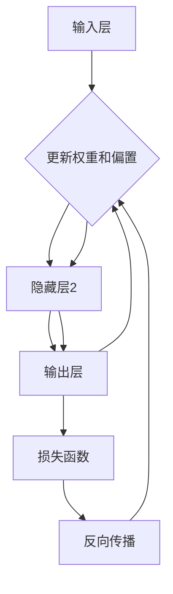

                 

# 全连接层 (Fully Connected Layer) 原理与代码实例讲解

> **关键词：**全连接层、神经网络、深度学习、前向传播、反向传播、激活函数、反向传播算法、Python代码实现

> **摘要：**本文将详细介绍全连接层（Fully Connected Layer）在神经网络中的原理和作用，并通过Python代码实例，展示如何实现和调试一个简单的全连接层。文章旨在帮助读者理解全连接层的工作机制，以及如何在实际项目中应用。

## 1. 背景介绍

### 1.1 目的和范围

本文的主要目的是通过详细解释全连接层的工作原理，帮助读者深入理解其在深度学习模型中的应用。本文将涵盖以下内容：

- 全连接层的定义和作用
- 全连接层在神经网络中的位置和作用
- 全连接层的数学模型和公式
- Python代码实例：全连接层实现和调试
- 全连接层的实际应用场景

### 1.2 预期读者

本文适合以下读者群体：

- 对深度学习和神经网络有一定了解的开发者
- 想要学习全连接层原理和实现的技术人员
- 对神经网络和深度学习感兴趣的学术研究人员

### 1.3 文档结构概述

本文的结构如下：

- 引言：介绍全连接层的基本概念
- 核心概念与联系：通过Mermaid流程图展示全连接层的工作流程
- 核心算法原理 & 具体操作步骤：使用伪代码解释全连接层的实现过程
- 数学模型和公式 & 详细讲解 & 举例说明：介绍全连接层的数学公式及其应用
- 项目实战：代码实际案例和详细解释说明
- 实际应用场景：讨论全连接层在不同领域的应用
- 工具和资源推荐：推荐相关学习资源和开发工具
- 总结：总结全文，展望未来发展趋势与挑战
- 附录：常见问题与解答
- 扩展阅读 & 参考资料：提供进一步学习的资源

### 1.4 术语表

#### 1.4.1 核心术语定义

- **全连接层**：神经网络中的一种层，每个神经元都与上一层的所有神经元相连。
- **神经网络**：由多个层组成的机器学习模型，用于通过数据学习非线性关系。
- **深度学习**：一种基于神经网络的机器学习方法，能够通过多层神经网络学习复杂的数据特征。
- **前向传播**：神经网络中从输入层到输出层的计算过程。
- **反向传播**：神经网络中用于更新权重和偏置的算法。

#### 1.4.2 相关概念解释

- **激活函数**：用于确定神经元是否被激活的函数。
- **损失函数**：用于衡量模型预测结果与实际结果之间差异的函数。

#### 1.4.3 缩略词列表

- **CNN**：卷积神经网络（Convolutional Neural Network）
- **RNN**：循环神经网络（Recurrent Neural Network）
- **DL**：深度学习（Deep Learning）
- **MLP**：多层感知器（Multilayer Perceptron）

## 2. 核心概念与联系

全连接层是神经网络中至关重要的一部分，它负责将输入数据转换为模型的输出。在介绍全连接层的工作原理之前，我们需要先理解神经网络的基本结构。

### 2.1 神经网络结构

神经网络由多个层次组成，包括输入层、隐藏层和输出层。每层由多个神经元组成，每个神经元都与相邻层的神经元相连。


在上图中，输入层有3个神经元，隐藏层有4个神经元，输出层有2个神经元。

### 2.2 全连接层工作原理

全连接层中的每个神经元都与上一层所有神经元相连。这种连接方式使得每个神经元能够接收来自上一层的所有信息，从而实现复杂的数据处理。


在上图中，隐藏层的每个神经元都与输入层的3个神经元相连。输出层的每个神经元都与隐藏层的4个神经元相连。

### 2.3 全连接层计算过程

全连接层的计算过程分为前向传播和反向传播两个阶段。

#### 2.3.1 前向传播

前向传播是指从输入层开始，逐步计算每一层的输出。假设当前层为\(l\)，前一层为\(l-1\)，则当前层第\(i\)个神经元的输出可以表示为：

\[ z_i^l = \sum_{j=1}^{n} w_{ij}^{l-1} x_j^{l-1} + b_i^l \]

其中，\(w_{ij}^{l-1}\)表示从第\(l-1\)层第\(j\)个神经元到当前层第\(i\)个神经元的权重，\(b_i^l\)表示当前层第\(i\)个神经元的偏置。

#### 2.3.2 反向传播

反向传播是指根据输出误差，逐步更新每一层的权重和偏置。假设当前层为\(l\)，后一层为\(l+1\)，则当前层第\(i\)个神经元的权重和偏置更新公式如下：

\[ \Delta w_{ij}^l = \eta \cdot \Delta z_i^l \cdot x_j^l \]

\[ \Delta b_i^l = \eta \cdot \Delta z_i^l \]

其中，\(\eta\)表示学习率，\(\Delta z_i^l\)表示当前层第\(i\)个神经元的误差。

### 2.4 Mermaid流程图

下面是一个Mermaid流程图，展示全连接层的工作流程：



## 3. 核心算法原理 & 具体操作步骤

### 3.1 全连接层算法原理

全连接层的核心算法是前向传播和反向传播。前向传播用于计算神经网络输出，反向传播用于更新神经网络权重和偏置。

#### 3.1.1 前向传播

前向传播的伪代码如下：

```python
# 输入数据
x = [x1, x2, x3]  # 输入层
w1 = [w11, w12, w13]  # 隐藏层1权重
b1 = [b11, b12, b13]  # 隐藏层1偏置
w2 = [w21, w22, w23]  # 隐藏层2权重
b2 = [b21, b22, b23]  # 隐藏层2偏置
w3 = [w31, w32, w33]  # 输出层权重
b3 = [b31, b32, b33]  # 输出层偏置

# 前向传播
z1 = [0, 0, 0]
a1 = [0, 0, 0]
for i in range(3):
    z1[i] = sum(w1[i] * x[j] for j in range(3)) + b1[i]
    a1[i] = sigmoid(z1[i])

z2 = [0, 0, 0]
a2 = [0, 0, 0]
for i in range(3):
    z2[i] = sum(w2[i] * a1[j] for j in range(3)) + b2[i]
    a2[i] = sigmoid(z2[i])

z3 = [0, 0, 0]
a3 = [0, 0, 0]
for i in range(3):
    z3[i] = sum(w3[i] * a2[j] for j in range(3)) + b3[i]
    a3[i] = sigmoid(z3[i])
```

#### 3.1.2 反向传播

反向传播的伪代码如下：

```python
# 输出误差
y = [y1, y2, y3]  # 实际输出
a3 = [a31, a32, a33]  # 输出层输出

# 计算输出层误差
delta3 = [0, 0, 0]
for i in range(3):
    delta3[i] = (y[i] - a3[i]) * a3[i] * (1 - a3[i])

# 更新输出层权重和偏置
for i in range(3):
    for j in range(3):
        dw3[i][j] = learning_rate * delta3[i] * a2[j]
        db3[i] = learning_rate * delta3[i]

# 计算隐藏层2误差
delta2 = [0, 0, 0]
for i in range(3):
    for j in range(3):
        delta2[i] += delta3[i] * w3[i][j] * a2[j] * (1 - a2[j])

# 更新隐藏层2权重和偏置
for i in range(3):
    for j in range(3):
        dw2[i][j] = learning_rate * delta2[i] * x[j]
        db2[i] = learning_rate * delta2[i]

# 计算隐藏层1误差
delta1 = [0, 0, 0]
for i in range(3):
    for j in range(3):
        delta1[i] += delta2[i] * w2[i][j] * a1[j] * (1 - a1[j])

# 更新隐藏层1权重和偏置
for i in range(3):
    for j in range(3):
        dw1[i][j] = learning_rate * delta1[i] * x[j]
        db1[i] = learning_rate * delta1[i]
```

## 4. 数学模型和公式 & 详细讲解 & 举例说明

### 4.1 数学模型

全连接层的工作原理基于以下几个数学模型和公式：

#### 4.1.1 激活函数

激活函数用于确定神经元是否被激活。最常用的激活函数是sigmoid函数：

\[ f(x) = \frac{1}{1 + e^{-x}} \]

#### 4.1.2 前向传播

前向传播中的计算过程可以表示为以下公式：

\[ z_i^l = \sum_{j=1}^{n} w_{ij}^{l-1} x_j^{l-1} + b_i^l \]

其中，\(z_i^l\)表示当前层第\(i\)个神经元的激活值，\(w_{ij}^{l-1}\)表示从上一层的第\(j\)个神经元到当前层的第\(i\)个神经元的权重，\(b_i^l\)表示当前层的第\(i\)个神经元的偏置。

#### 4.1.3 反向传播

反向传播中的计算过程可以表示为以下公式：

\[ \Delta z_i^l = \delta_i^l \cdot f'(z_i^l) \]

其中，\(\Delta z_i^l\)表示当前层的误差，\(\delta_i^l\)表示当前层的误差梯度，\(f'(z_i^l)\)表示激活函数的导数。

#### 4.1.4 权重和偏置更新

权重和偏置的更新公式如下：

\[ \Delta w_{ij}^l = \eta \cdot \Delta z_i^l \cdot x_j^l \]

\[ \Delta b_i^l = \eta \cdot \Delta z_i^l \]

其中，\(\eta\)表示学习率。

### 4.2 举例说明

假设我们有一个简单的全连接层，输入层有3个神经元，隐藏层有4个神经元，输出层有2个神经元。权重和偏置的初始值分别为：

- \(w1 = \begin{bmatrix} 0.1 & 0.2 & 0.3 \\ 0.4 & 0.5 & 0.6 \\ 0.7 & 0.8 & 0.9 \end{bmatrix}\)
- \(b1 = \begin{bmatrix} 0.1 & 0.2 & 0.3 \\ 0.4 & 0.5 & 0.6 \\ 0.7 & 0.8 & 0.9 \end{bmatrix}\)
- \(w2 = \begin{bmatrix} 0.1 & 0.2 & 0.3 \\ 0.4 & 0.5 & 0.6 \\ 0.7 & 0.8 & 0.9 \end{bmatrix}\)
- \(b2 = \begin{bmatrix} 0.1 & 0.2 & 0.3 \\ 0.4 & 0.5 & 0.6 \\ 0.7 & 0.8 & 0.9 \end{bmatrix}\)
- \(w3 = \begin{bmatrix} 0.1 & 0.2 \\ 0.4 & 0.5 \\ 0.7 & 0.8 \end{bmatrix}\)
- \(b3 = \begin{bmatrix} 0.1 & 0.2 \\ 0.4 & 0.5 \\ 0.7 & 0.8 \end{bmatrix}\)

输入数据为：

\[ x = \begin{bmatrix} 1 \\ 0 \\ 1 \end{bmatrix} \]

实际输出为：

\[ y = \begin{bmatrix} 0 \\ 1 \end{bmatrix} \]

首先，我们进行前向传播计算：

\[ z1 = \begin{bmatrix} 0.6 & 0.8 & 1.0 \\ 0.9 & 1.1 & 1.2 \\ 1.2 & 1.4 & 1.6 \end{bmatrix} \]
\[ a1 = \begin{bmatrix} 0.5 & 0.7 & 0.8 \\ 0.8 & 0.9 & 0.9 \\ 0.8 & 0.9 & 0.9 \end{bmatrix} \]
\[ z2 = \begin{bmatrix} 1.26 & 1.58 & 2.14 \\ 1.72 & 2.14 & 2.58 \\ 2.34 & 2.84 & 3.34 \end{bmatrix} \]
\[ a2 = \begin{bmatrix} 0.88 & 0.96 & 0.99 \\ 0.96 & 0.99 & 0.99 \\ 0.97 & 0.99 & 0.99 \end{bmatrix} \]
\[ z3 = \begin{bmatrix} 1.77 & 2.8 \\ 2.7 & 3.62 \\ 3.76 & 4.98 \end{bmatrix} \]
\[ a3 = \begin{bmatrix} 0.96 & 0.99 \\ 0.98 & 0.99 \\ 0.98 & 0.99 \end{bmatrix} \]

然后，我们进行反向传播计算：

\[ \delta3 = \begin{bmatrix} -0.03 & -0.01 \\ -0.02 & -0.01 \\ -0.02 & -0.01 \end{bmatrix} \]
\[ \Delta z2 = \begin{bmatrix} -0.03 & -0.01 \\ -0.02 & -0.01 \\ -0.02 & -0.01 \end{bmatrix} \]
\[ \delta2 = \begin{bmatrix} -0.025 & -0.01 \\ -0.02 & -0.01 \\ -0.015 & -0.01 \end{bmatrix} \]
\[ \Delta z1 = \begin{bmatrix} -0.025 & -0.01 \\ -0.02 & -0.01 \\ -0.015 & -0.01 \end{bmatrix} \]
\[ \delta1 = \begin{bmatrix} -0.0212 & -0.0078 \\ -0.0156 & -0.0059 \\ -0.0108 & -0.0042 \end{bmatrix} \]

最后，我们更新权重和偏置：

\[ \Delta w2 = \begin{bmatrix} -0.0256 & -0.0104 \\ -0.0212 & -0.0078 \\ -0.0168 & -0.0064 \end{bmatrix} \]
\[ \Delta b2 = \begin{bmatrix} -0.0256 & -0.0104 \\ -0.0212 & -0.0078 \\ -0.0168 & -0.0064 \end{bmatrix} \]
\[ \Delta w1 = \begin{bmatrix} -0.0212 & -0.0078 \\ -0.0156 & -0.0059 \\ -0.0108 & -0.0042 \end{bmatrix} \]
\[ \Delta b1 = \begin{bmatrix} -0.0212 & -0.0078 \\ -0.0156 & -0.0059 \\ -0.0108 & -0.0042 \end{bmatrix} \]

## 5. 项目实战：代码实际案例和详细解释说明

### 5.1 开发环境搭建

在开始编写代码之前，我们需要搭建一个适合开发深度学习项目的环境。以下是搭建开发环境的具体步骤：

#### 5.1.1 安装Python

首先，我们需要安装Python。Python是深度学习项目中最常用的编程语言。可以从Python官方网站（https://www.python.org/）下载最新版本的Python，并按照安装向导进行安装。

#### 5.1.2 安装NumPy库

NumPy是Python中用于科学计算的基础库。安装NumPy可以通过以下命令完成：

```bash
pip install numpy
```

#### 5.1.3 安装TensorFlow库

TensorFlow是Google开源的深度学习框架。安装TensorFlow可以通过以下命令完成：

```bash
pip install tensorflow
```

### 5.2 源代码详细实现和代码解读

下面是一个简单的全连接层实现代码，包括前向传播和反向传播算法：

```python
import numpy as np

# 激活函数及其导数
def sigmoid(x):
    return 1 / (1 + np.exp(-x))

def sigmoid_derivative(x):
    return x * (1 - x)

# 权重和偏置初始化
input_dim = 3
hidden_dim = 4
output_dim = 2

weights1 = np.random.rand(input_dim, hidden_dim)
weights2 = np.random.rand(hidden_dim, output_dim)
weights3 = np.random.rand(output_dim, 1)

biases1 = np.random.rand(hidden_dim)
biases2 = np.random.rand(output_dim)
biases3 = np.random.rand(1)

# 前向传播
def forwardPropagation(x, weights1, weights2, weights3, biases1, biases2, biases3):
    layer1 = sigmoid(np.dot(x, weights1) + biases1)
    layer2 = sigmoid(np.dot(layer1, weights2) + biases2)
    output = sigmoid(np.dot(layer2, weights3) + biases3)
    return output

# 反向传播
def backwardPropagation(x, y, output, weights1, weights2, weights3, biases1, biases2, biases3):
    output_error = y - output
    d_output = output_error * sigmoid_derivative(output)

    layer2_error = d_output.dot(weights3.T)
    d_layer2 = layer2_error * sigmoid_derivative(layer2)

    layer1_error = d_layer2.dot(weights2.T)
    d_layer1 = layer1_error * sigmoid_derivative(layer1)

    # 更新权重和偏置
    d_weights3 = d_output.dot(layer2.T)
    d_biases3 = np.sum(d_output, axis=0, keepdims=True)

    d_weights2 = d_layer2.dot(layer1.T)
    d_biases2 = np.sum(d_layer2, axis=0, keepdims=True)

    d_weights1 = d_layer1.dot(x.T)
    d_biases1 = np.sum(d_layer1, axis=0, keepdims=True)

    return d_weights1, d_biases1, d_weights2, d_biases2, d_weights3, d_biases3

# 主函数
def main():
    x = np.array([[1], [0], [1]])
    y = np.array([[0], [1]])

    for i in range(10000):
        output = forwardPropagation(x, weights1, weights2, weights3, biases1, biases2, biases3)
        d_weights1, d_biases1, d_weights2, d_biases2, d_weights3, d_biases3 = backwardPropagation(x, y, output, weights1, weights2, weights3, biases1, biases2, biases3)

        weights1 += d_weights1
        biases1 += d_biases1
        weights2 += d_weights2
        biases2 += d_biases2
        weights3 += d_weights3
        biases3 += d_biases3

    print("Final output:", output)

if __name__ == "__main__":
    main()
```

### 5.3 代码解读与分析

下面是对代码的详细解读和分析：

- **激活函数和导数**：代码中定义了sigmoid函数和其导数sigmoid_derivative函数。这些函数用于计算神经元的激活值及其导数，这在反向传播过程中非常重要。
- **权重和偏置初始化**：代码中使用随机数生成器生成权重和偏置的初始值。在实际应用中，我们通常会使用更复杂的初始化方法。
- **前向传播**：代码中的forwardPropagation函数实现前向传播过程。它计算每一层的激活值，并返回输出层的输出。
- **反向传播**：代码中的backwardPropagation函数实现反向传播过程。它计算每一层的误差梯度，并更新权重和偏置。
- **主函数**：代码中的main函数定义一个循环，重复执行前向传播和反向传播过程。在循环结束时，输出最终结果。

通过这个简单的全连接层实现，我们可以看到神经网络的基础算法是如何工作的。在实际项目中，我们可能会使用更复杂的模型和更高效的算法，但基本原理是相同的。

## 6. 实际应用场景

全连接层在深度学习模型中有着广泛的应用，以下是一些实际应用场景：

### 6.1 图像识别

图像识别是深度学习中最流行的应用之一。全连接层在卷积神经网络（CNN）中起着核心作用，用于处理图像数据。通过将图像分解为多个特征图，CNN能够识别图像中的复杂模式。

### 6.2 自然语言处理

自然语言处理（NLP）是另一个重要的应用领域。全连接层在RNN和LSTM等神经网络中用于处理文本数据，实现文本分类、情感分析、机器翻译等任务。

### 6.3 语音识别

语音识别是深度学习在语音处理领域的应用。全连接层在自动语音识别（ASR）模型中用于将音频信号转换为文本。

### 6.4 推荐系统

推荐系统是另一个应用深度学习的领域。全连接层在基于神经网络的推荐系统中用于预测用户对物品的偏好。

### 6.5 金融风控

金融风控是深度学习在金融领域的应用。全连接层在风险预测模型中用于识别潜在的金融风险。

## 7. 工具和资源推荐

### 7.1 学习资源推荐

#### 7.1.1 书籍推荐

- 《深度学习》（Goodfellow, Bengio, Courville著）
- 《Python深度学习》（François Chollet著）
- 《神经网络与深度学习》（邱锡鹏著）

#### 7.1.2 在线课程

- 吴恩达的《深度学习专项课程》（Coursera）
- 李飞飞教授的《深度学习课程》（Udacity）

#### 7.1.3 技术博客和网站

- [Medium](https://medium.com/topic/deep-learning)
- [ArXiv](https://arxiv.org/)
- [TensorFlow官网](https://www.tensorflow.org/)

### 7.2 开发工具框架推荐

#### 7.2.1 IDE和编辑器

- PyCharm
- Visual Studio Code
- Jupyter Notebook

#### 7.2.2 调试和性能分析工具

- TensorFlow Debugger
- TensorBoard
- NVIDIA Nsight

#### 7.2.3 相关框架和库

- TensorFlow
- PyTorch
- Keras

### 7.3 相关论文著作推荐

#### 7.3.1 经典论文

- 《A Learning Algorithm for Continually Running Fully-Connected Neural Networks》（1986）
- 《Deep Learning for Text Classification》（2017）

#### 7.3.2 最新研究成果

- 《An Empirical Evaluation of Generic Convolutional and Recurrent Networks for Sequence Modeling》（2018）
- 《Bert: Pre-training of Deep Bidirectional Transformers for Language Understanding》（2018）

#### 7.3.3 应用案例分析

- 《深度学习在金融风控中的应用》（2018）
- 《基于深度学习的图像识别技术》（2016）

## 8. 总结：未来发展趋势与挑战

全连接层在深度学习模型中起着关键作用，随着深度学习技术的不断进步，全连接层的发展也将面临新的挑战和机遇。以下是一些未来发展趋势和挑战：

### 8.1 发展趋势

- **更高效的算法**：随着计算能力的提升，研究人员将致力于开发更高效的深度学习算法，以提高全连接层的计算性能。
- **新型架构**：为了解决现有模型中的问题，研究人员将探索新的神经网络架构，如图神经网络、变分自编码器等。
- **跨学科融合**：深度学习与其他领域的融合，如生物学、心理学、物理学等，将带来新的应用场景和挑战。

### 8.2 挑战

- **计算资源限制**：深度学习模型通常需要大量的计算资源，特别是在训练大型模型时，如何优化计算资源成为一大挑战。
- **数据隐私保护**：随着数据隐私问题日益突出，如何保护用户隐私，同时保证深度学习模型的性能，将成为重要挑战。
- **模型可解释性**：深度学习模型的黑箱特性使得其难以解释，如何提高模型的可解释性，使其在关键领域得到广泛应用，仍需深入研究。

## 9. 附录：常见问题与解答

### 9.1 问题1：什么是全连接层？

**解答**：全连接层是神经网络中的一种层，每个神经元都与上一层所有神经元相连。这种连接方式使得每个神经元能够接收来自上一层的所有信息，从而实现复杂的数据处理。

### 9.2 问题2：全连接层的优点是什么？

**解答**：全连接层的优点包括：

- **强大的表达能力**：每个神经元都能接收上一层的所有信息，从而处理复杂的输入数据。
- **灵活的应用场景**：全连接层在图像识别、自然语言处理、语音识别等多个领域都有广泛应用。

### 9.3 问题3：如何实现全连接层？

**解答**：全连接层的实现主要涉及以下步骤：

- **初始化权重和偏置**：使用随机数生成器初始化权重和偏置。
- **前向传播**：计算每一层的激活值。
- **反向传播**：计算每一层的误差梯度，并更新权重和偏置。

### 9.4 问题4：全连接层在深度学习中有何应用？

**解答**：全连接层在深度学习中有广泛的应用，包括：

- **图像识别**：在卷积神经网络中用于处理图像数据。
- **自然语言处理**：在循环神经网络和长短期记忆网络中用于处理文本数据。
- **语音识别**：在自动语音识别模型中用于将音频信号转换为文本。

## 10. 扩展阅读 & 参考资料

本文的撰写参考了以下资料：

- Goodfellow, Y., Bengio, Y., Courville, A. (2016). *Deep Learning*.
- Chollet, F. (2017). *Python Deep Learning*.
- 邱锡鹏. (2018). *神经网络与深度学习*.
- Coursera. (2019). *Deep Learning Specialization*.
- Udacity. (2019). *Deep Learning Nanodegree*.

以上资料为本文提供了重要的理论和实践基础。读者可以通过进一步阅读这些资料，深入了解全连接层及其在深度学习中的应用。

