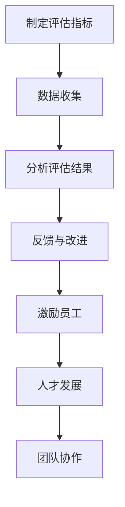

                 


# 公正的绩效评估：客观评价团队成员的方法

> **关键词：绩效评估、团队管理、客观评价、算法、数学模型、实战案例**

> **摘要：本文旨在探讨如何通过科学的方法，实现团队中每个成员的公正绩效评估。我们分析了绩效评估的核心概念、关联算法、数学模型，并通过实际案例展示如何将这些方法应用到项目中。本文适合项目经理、团队成员和对此领域感兴趣的读者。**

## 1. 背景介绍

### 1.1 目的和范围

本文的目标是提供一套科学、系统的绩效评估方法，帮助项目经理和团队领导者公正、客观地评估团队成员的工作表现。我们将介绍几种常用的绩效评估方法，包括基于算法的评价模型、数学模型，并结合实际案例进行说明。

### 1.2 预期读者

本文主要面向项目经理、团队领导、以及对此领域感兴趣的团队成员。如果你正在寻找一种更加科学、公正的绩效评估方法，或者想要提升团队管理能力，那么本文将为你提供有益的指导。

### 1.3 文档结构概述

本文分为以下几个部分：

1. **背景介绍**：介绍本文的目的、预期读者和文档结构。
2. **核心概念与联系**：介绍绩效评估的相关概念和流程。
3. **核心算法原理 & 具体操作步骤**：详细讲解绩效评估算法的原理和操作步骤。
4. **数学模型和公式 & 详细讲解 & 举例说明**：介绍用于评估的数学模型和公式。
5. **项目实战：代码实际案例和详细解释说明**：通过实际代码案例展示评估方法的应用。
6. **实际应用场景**：分析绩效评估方法在不同场景中的应用。
7. **工具和资源推荐**：推荐相关学习资源和工具。
8. **总结：未来发展趋势与挑战**：总结本文内容和展望未来发展趋势。
9. **附录：常见问题与解答**：解答读者可能遇到的问题。
10. **扩展阅读 & 参考资料**：提供进一步阅读的资源。

### 1.4 术语表

#### 1.4.1 核心术语定义

- **绩效评估**：对团队成员工作表现进行客观、量化的评估过程。
- **KPI**：关键绩效指标（Key Performance Indicators），用于衡量团队成员工作成效的具体指标。
- **360度评估**：综合评估团队成员在团队中的表现，包括同事、上级、下属和客户等各方面的反馈。
- **主观评估**：基于评估者的个人判断和经验进行的绩效评估。
- **客观评估**：基于客观数据和算法进行的绩效评估。

#### 1.4.2 相关概念解释

- **绩效**：团队成员在工作中所展现的能力、行为和成果。
- **团队协作**：团队成员之间的相互合作，以实现共同的目标。
- **绩效评估流程**：包括制定评估指标、收集评估数据、分析评估结果和反馈改进措施的整个过程。

#### 1.4.3 缩略词列表

- **KPI**：关键绩效指标
- **360度评估**：360度评估
- **HR**：人力资源
- **IDE**：集成开发环境
- **KPIs**：关键绩效指标集

## 2. 核心概念与联系

为了深入理解绩效评估，我们需要首先了解一些核心概念，包括绩效评估的目标、评估方法以及它们之间的联系。

### 2.1 绩效评估的目标

绩效评估的主要目标是：

- **激励员工**：通过公正的评估，激励员工提高工作积极性和工作效率。
- **反馈与改进**：为员工提供反馈，帮助他们了解自身的工作表现，并制定改进计划。
- **人才发展**：识别员工的优势和不足，为员工提供培训和发展机会。
- **团队协作**：促进团队成员之间的沟通与合作，提高团队整体绩效。

### 2.2 绩效评估方法

绩效评估方法可以分为以下几类：

- **KPI评估**：基于具体指标（如销售额、项目进度、代码质量等）进行评估。
- **360度评估**：综合评估团队成员在团队中的表现，包括同事、上级、下属和客户等各方面的反馈。
- **主观评估**：基于评估者的个人判断和经验进行评估。
- **客观评估**：基于客观数据和算法进行评估。

### 2.3 绩效评估流程

绩效评估的流程通常包括以下几个步骤：

1. **制定评估指标**：确定用于评估的具体指标和标准。
2. **数据收集**：收集与评估指标相关的数据，如项目进度、代码质量、客户满意度等。
3. **分析评估结果**：对收集到的数据进行分析，生成评估报告。
4. **反馈与改进**：将评估结果反馈给团队成员，并制定改进计划。

### 2.4 核心概念联系

绩效评估的核心概念和联系可以总结为：

- **绩效评估**与**激励员工**：绩效评估的结果直接影响员工的奖励和晋升，从而激发员工的工作积极性。
- **绩效评估**与**反馈与改进**：绩效评估为员工提供了明确的反馈，帮助他们了解自身的工作表现，从而进行改进。
- **绩效评估**与**人才发展**：通过绩效评估，识别员工的优势和不足，为员工提供培训和发展机会，从而提升团队的整体能力。
- **绩效评估**与**团队协作**：公正的绩效评估能够促进团队成员之间的沟通与合作，提高团队的整体绩效。

### 2.5 绩效评估流程图

为了更直观地展示绩效评估流程，我们使用Mermaid绘制了以下流程图：



通过上述流程图，我们可以清晰地看到绩效评估各个环节之间的联系和影响。

## 3. 核心算法原理 & 具体操作步骤

在了解了绩效评估的核心概念和流程后，我们需要关注具体的评估方法。在本节中，我们将详细介绍一种基于算法的绩效评估方法，并使用伪代码详细阐述其原理和操作步骤。

### 3.1 算法原理

基于算法的绩效评估方法通常采用以下原则：

1. **指标权重分配**：根据各项指标的重要程度，分配不同的权重。
2. **数据标准化处理**：为了消除数据量级差异，对各项指标进行标准化处理。
3. **综合评分计算**：将各指标的评分加权求和，得到最终的综合评分。

### 3.2 伪代码

以下是一个简单的基于算法的绩效评估方法的伪代码：

```plaintext
函数 绩效评估(指标数据，权重数据)：
    输入：指标数据（指标值列表），权重数据（权重列表）
    输出：综合评分

    // 步骤1：数据标准化处理
    标准化指标数据 = [标准化处理(指标数据[i]) for i in 范围(len(指标数据))]
    
    // 步骤2：计算加权得分
    加权得分 = [标准化指标数据[i] * 权重数据[i] for i in 范围(len(标准化指标数据))]
    
    // 步骤3：计算综合评分
    综合评分 = 求和(加权得分)
    
    返回 综合评分
```

### 3.3 操作步骤

基于上述算法原理，我们可以按照以下步骤进行绩效评估：

1. **制定评估指标**：确定需要评估的具体指标，如销售额、项目进度、代码质量等。
2. **分配指标权重**：根据各项指标的重要程度，分配不同的权重。例如，对于销售人员，销售额可能占据更高的权重。
3. **收集指标数据**：收集与评估指标相关的数据，如销售额、项目进度、代码质量等。
4. **数据标准化处理**：为了消除数据量级差异，对各项指标进行标准化处理。常用的标准化方法包括最大最小标准化和Z-Score标准化。
5. **计算加权得分**：将各指标的标准化值与对应的权重相乘，得到加权得分。
6. **计算综合评分**：将各指标的加权得分求和，得到最终的综合评分。
7. **评估结果分析**：根据综合评分，对团队成员的工作表现进行分析和反馈。

通过上述步骤，我们可以实现一个基于算法的公正、客观的绩效评估过程。

## 4. 数学模型和公式 & 详细讲解 & 举例说明

在绩效评估中，数学模型和公式扮演着重要的角色，它们帮助我们量化评估指标、计算加权得分和综合评分。在本节中，我们将详细讲解用于绩效评估的几个关键数学模型和公式，并通过具体例子进行说明。

### 4.1 数据标准化处理

为了消除各项指标之间的量级差异，我们通常需要对数据标准化处理。常用的标准化方法包括最大最小标准化和Z-Score标准化。

#### 4.1.1 最大最小标准化

最大最小标准化公式如下：

$$
Z_i = \frac{X_i - \min(X)}{\max(X) - \min(X)}
$$

其中，$X_i$表示第i项指标值，$\min(X)$表示所有指标值中的最小值，$\max(X)$表示所有指标值中的最大值。

#### 4.1.2 Z-Score标准化

Z-Score标准化公式如下：

$$
Z_i = \frac{X_i - \mu}{\sigma}
$$

其中，$\mu$表示所有指标值的平均值，$\sigma$表示所有指标值的方差。

#### 4.1.3 示例

假设我们有三个指标值：$X_1 = 100$，$X_2 = 200$，$X_3 = 300$。使用最大最小标准化进行数据标准化处理，结果如下：

$$
Z_1 = \frac{100 - 100}{300 - 100} = 0
$$

$$
Z_2 = \frac{200 - 100}{300 - 100} = 0.5
$$

$$
Z_3 = \frac{300 - 100}{300 - 100} = 1
$$

经过标准化处理，指标值的范围变为0到1，便于后续计算。

### 4.2 加权得分计算

加权得分计算公式如下：

$$
S_i = Z_i \times W_i
$$

其中，$Z_i$表示第i项指标的标准值，$W_i$表示第i项指标的权重。

#### 4.2.1 示例

假设有三个指标，权重分别为$W_1 = 0.3$，$W_2 = 0.4$，$W_3 = 0.3$。标准化后的指标值为$Z_1 = 0$，$Z_2 = 0.5$，$Z_3 = 1$。计算加权得分：

$$
S_1 = 0 \times 0.3 = 0
$$

$$
S_2 = 0.5 \times 0.4 = 0.2
$$

$$
S_3 = 1 \times 0.3 = 0.3
$$

加权得分结果为：$S_1 = 0$，$S_2 = 0.2$，$S_3 = 0.3$。

### 4.3 综合评分计算

综合评分计算公式如下：

$$
总分 = \sum(S_i)
$$

其中，$S_i$表示第i项指标的加权得分。

#### 4.3.1 示例

使用上一个示例的数据，计算综合评分：

$$
总分 = 0 + 0.2 + 0.3 = 0.5
$$

经过计算，综合评分为0.5。

通过上述数学模型和公式，我们可以实现一个科学、系统的绩效评估过程。这不仅有助于公正、客观地评价团队成员的工作表现，还能为团队的管理和发展提供有力支持。

## 5. 项目实战：代码实际案例和详细解释说明

在本节中，我们将通过一个实际的项目案例，展示如何将前述的绩效评估方法应用到具体代码中。我们将详细介绍开发环境搭建、源代码实现以及代码解读与分析。

### 5.1 开发环境搭建

在开始项目实战之前，我们需要搭建一个合适的开发环境。以下是一个基本的开发环境配置：

- **操作系统**：Windows 10或Linux
- **编程语言**：Python 3.8及以上版本
- **开发工具**：PyCharm或VS Code
- **库**：NumPy、Pandas、Scikit-learn等

#### 5.1.1 安装Python和PyCharm

在Windows系统中，可以通过Python官方网站下载Python安装包，并按照提示安装。安装完成后，打开命令行窗口，输入以下命令验证安装：

```bash
python --version
```

如果正确显示Python版本信息，说明安装成功。

接下来，下载PyCharm社区版，并按照提示安装。安装完成后，打开PyCharm，创建一个新项目，选择Python作为编程语言。

#### 5.1.2 安装相关库

在PyCharm中，打开终端窗口，使用pip命令安装所需库：

```bash
pip install numpy pandas scikit-learn
```

### 5.2 源代码详细实现和代码解读

在完成开发环境搭建后，我们将实现一个简单的绩效评估项目。以下是一个基本的源代码实现，包括数据收集、数据处理、评估指标计算和综合评分计算等功能。

```python
import numpy as np
import pandas as pd
from sklearn.preprocessing import MinMaxScaler

# 函数：数据标准化处理
def normalize_data(data):
    scaler = MinMaxScaler()
    normalized_data = scaler.fit_transform(data)
    return normalized_data

# 函数：计算加权得分
def calculate_weighted_score(normalized_data, weights):
    weighted_score = np.dot(normalized_data, weights)
    return weighted_score

# 函数：计算综合评分
def calculate_total_score(weighted_scores):
    total_score = np.sum(weighted_scores)
    return total_score

# 函数：绩效评估
def performance_evaluation(data, weights):
    normalized_data = normalize_data(data)
    weighted_scores = calculate_weighted_score(normalized_data, weights)
    total_score = calculate_total_score(weighted_scores)
    return total_score

# 示例数据
data = np.array([[100, 200, 300], [150, 250, 350], [200, 300, 400]])

# 权重
weights = np.array([0.3, 0.4, 0.3])

# 计算综合评分
total_score = performance_evaluation(data, weights)
print(f"综合评分：{total_score}")
```

#### 5.2.1 数据收集

在代码中，我们使用了示例数据`data`，表示三个团队成员在三个指标上的表现。在实际应用中，这些数据可以来自员工绩效报告、项目进度数据、代码质量统计等。

#### 5.2.2 数据处理

使用`normalize_data`函数对数据进行标准化处理。这里我们使用了`MinMaxScaler`库来实现最大最小标准化。

```python
def normalize_data(data):
    scaler = MinMaxScaler()
    normalized_data = scaler.fit_transform(data)
    return normalized_data
```

标准化处理后的数据将消除指标之间的量级差异，便于后续计算。

#### 5.2.3 评估指标计算

使用`calculate_weighted_score`函数计算加权得分。这里我们采用了上一节介绍的加权得分计算公式。

```python
def calculate_weighted_score(normalized_data, weights):
    weighted_score = np.dot(normalized_data, weights)
    return weighted_score
```

#### 5.2.4 综合评分计算

使用`calculate_total_score`函数计算综合评分。这里我们采用了上一节介绍的综合评分计算公式。

```python
def calculate_total_score(weighted_scores):
    total_score = np.sum(weighted_scores)
    return total_score
```

#### 5.2.5 绩效评估

使用`performance_evaluation`函数进行完整的绩效评估过程。这个函数将数据处理、评估指标计算和综合评分计算整合在一起。

```python
def performance_evaluation(data, weights):
    normalized_data = normalize_data(data)
    weighted_scores = calculate_weighted_score(normalized_data, weights)
    total_score = calculate_total_score(weighted_scores)
    return total_score
```

### 5.3 代码解读与分析

在本节中，我们详细解读了上述代码，并分析了各个函数的功能和实现方式。

- **数据标准化处理**：使用`MinMaxScaler`库实现最大最小标准化，消除数据量级差异。
- **加权得分计算**：使用`np.dot`函数计算加权得分，实现加权得分计算公式。
- **综合评分计算**：使用`np.sum`函数计算综合评分，实现综合评分计算公式。
- **绩效评估**：整合数据处理、评估指标计算和综合评分计算，实现完整的绩效评估过程。

通过这个简单的代码示例，我们可以看到如何将绩效评估方法应用到具体项目中。在实际应用中，可以根据具体需求进行调整和优化。

### 5.4 代码优化与扩展

在实际项目中，我们可以对代码进行优化和扩展，以提高性能和可维护性。以下是一些常见的优化和扩展建议：

- **并行计算**：对于大数据量，可以使用并行计算来加速数据处理和计算过程。
- **自定义指标**：根据具体业务需求，自定义指标和权重，实现更加灵活的绩效评估。
- **可视化**：使用可视化工具（如Matplotlib）展示评估结果，帮助团队更好地理解绩效评估结果。
- **接口设计**：设计模块化的接口，方便与其他系统集成，提高系统的可扩展性。

通过代码优化和扩展，我们可以使绩效评估方法更加高效、灵活，从而更好地满足团队的需求。

## 6. 实际应用场景

绩效评估方法在不同的实际应用场景中具有广泛的适用性。以下是一些典型的应用场景：

### 6.1 项目团队

在项目团队中，绩效评估方法可以帮助项目经理和团队领导者评估团队成员的工作表现。通过公正的绩效评估，可以激励团队成员提高工作效率，确保项目按时完成。

### 6.2 销售团队

销售团队通常面临高压力和高竞争的工作环境。通过绩效评估，可以评估销售人员的业绩，识别优秀的销售人员，并提供培训和发展机会，从而提升销售业绩。

### 6.3 开发团队

在开发团队中，绩效评估可以评估开发人员的技术能力、代码质量和团队协作能力。通过绩效评估，可以为团队成员提供反馈，帮助他们提升技术水平和团队协作能力。

### 6.4 服务团队

服务团队通常需要与客户保持密切沟通，提供高质量的服务。通过绩效评估，可以评估服务团队成员的沟通技巧、服务质量和客户满意度，从而提升整体服务水平。

### 6.5 人力资源部门

人力资源部门可以利用绩效评估方法，对整个公司的员工进行评估，识别优秀员工，为员工提供奖励和晋升机会，同时为公司的招聘和培训提供数据支持。

### 6.6 绩效评估工具

随着技术的发展，许多绩效评估工具应运而生，如KPI管理系统、360度评估系统等。这些工具可以帮助团队领导者更高效地进行绩效评估，提高评估的准确性和公正性。

在实际应用中，绩效评估方法可以根据不同场景的需求进行调整和优化，以满足团队的特定需求。通过科学、公正的绩效评估，可以提升团队的整体绩效，为企业的发展提供有力支持。

## 7. 工具和资源推荐

在绩效评估过程中，选择合适的工具和资源至关重要。以下是我们推荐的几类工具和资源：

### 7.1 学习资源推荐

#### 7.1.1 书籍推荐

- **《绩效管理》**：这是一本经典的绩效管理书籍，涵盖了绩效评估的各个方面，包括目标设定、评估方法、反馈和改进等。
- **《关键绩效指标（KPI）》**：本书详细介绍了KPI的概念、制定方法以及在实际应用中的案例分析。

#### 7.1.2 在线课程

- **Coursera上的《绩效管理基础》**：这是一门由顶尖大学开设的在线课程，涵盖绩效评估的基本概念和方法，适合初学者学习。
- **Udemy上的《绩效评估与360度反馈》**：这是一门深入讲解绩效评估和360度反馈的课程，适合有一定基础的学习者。

#### 7.1.3 技术博客和网站

- **Stack Overflow**：这是一个技术问答社区，你可以在这里找到关于绩效评估的各种问题和解决方案。
- **GitHub**：GitHub上有很多关于绩效评估的开源项目和工具，你可以在这里学习和借鉴。

### 7.2 开发工具框架推荐

#### 7.2.1 IDE和编辑器

- **PyCharm**：这是一个功能强大的Python IDE，适合编写和调试Python代码。
- **VS Code**：这是一个轻量级的开源编辑器，支持多种编程语言，非常适合进行绩效评估项目的开发。

#### 7.2.2 调试和性能分析工具

- **Python Profiler**：这是一个Python性能分析工具，可以帮助你找到代码中的性能瓶颈。
- **Matplotlib**：这是一个Python数据可视化库，可以帮助你将评估结果以图形化的方式展示出来。

#### 7.2.3 相关框架和库

- **Pandas**：这是一个强大的数据处理库，可以用于收集和处理绩效评估数据。
- **Scikit-learn**：这是一个机器学习库，可以用于实现一些复杂的绩效评估算法。

### 7.3 相关论文著作推荐

#### 7.3.1 经典论文

- **“Performance Appraisal and Merit Rating”**：这是一篇经典的绩效评估论文，详细介绍了绩效评估的方法和原则。
- **“Employee Performance Appraisal: A Critical Review”**：这是一篇关于绩效评估方法的批判性论文，分析了各种评估方法的优缺点。

#### 7.3.2 最新研究成果

- **“A Study on Performance Appraisal Using Machine Learning Techniques”**：这是一篇关于使用机器学习方法进行绩效评估的最新研究论文。
- **“Employee Performance Appraisal in the Age of AI”**：这是一篇探讨人工智能在绩效评估中应用的论文，分析了AI技术在绩效评估中的潜力。

#### 7.3.3 应用案例分析

- **“Performance Management in a Global Company”**：这是一篇关于某全球公司绩效管理实践的分析案例，介绍了该公司如何实施绩效评估体系。
- **“Using Data Analytics for Performance Appraisal”**：这是一篇关于使用数据分析进行绩效评估的案例分析，展示了如何利用数据驱动决策提升绩效评估的准确性。

通过这些工具和资源的支持，你可以更加高效地实施绩效评估方法，提升团队的整体绩效。

## 8. 总结：未来发展趋势与挑战

随着技术的不断进步，绩效评估领域也在不断发展。以下是一些未来发展趋势和面临的挑战：

### 8.1 发展趋势

- **人工智能和大数据分析**：人工智能和大数据分析技术的不断发展，将使得绩效评估更加科学和精准。通过机器学习算法，可以自动识别员工的工作表现，并提供个性化的反馈和改进建议。
- **实时绩效评估**：随着物联网和移动技术的发展，实时绩效评估将成为可能。通过实时收集和分析员工的工作数据，可以更快速地发现问题和提供支持。
- **个性化绩效评估**：未来的绩效评估将更加注重个性化，根据员工的特点和需求，制定个性化的评估方法和目标。

### 8.2 挑战

- **数据隐私和安全**：随着绩效评估的数据量越来越大，数据隐私和安全问题将变得更加突出。如何确保员工数据的安全和隐私，是未来面临的一个重要挑战。
- **评估公平性**：在引入新技术的同时，如何确保评估的公平性也是一个重要问题。我们需要避免因为算法偏见而导致评估结果的不公。
- **员工接受度**：尽管绩效评估对于团队管理和发展至关重要，但员工可能对新的评估方法存在抵触情绪。如何提高员工的接受度，是一个需要认真考虑的问题。

总之，未来的绩效评估将更加依赖于技术和数据，但同时也需要解决一系列挑战，以确保评估的公正性和有效性。

## 9. 附录：常见问题与解答

### 9.1 绩效评估的目的是什么？

绩效评估的主要目的是激励员工，提供反馈，帮助员工提升工作表现，从而提高团队和组织的整体绩效。

### 9.2 KPI是什么？

KPI是关键绩效指标（Key Performance Indicators）的缩写，用于衡量团队或个人在特定方面的工作成效。

### 9.3 360度评估是什么？

360度评估是一种绩效评估方法，通过收集团队成员、上级、下属和客户等多方面的反馈，全面评估员工的工作表现。

### 9.4 如何确保绩效评估的公平性？

确保绩效评估的公平性需要从多个方面入手，包括选择合理的评估指标、分配公平的权重、避免评估者的主观偏见以及定期审查和调整评估方法。

### 9.5 如何应对员工的抵触情绪？

应对员工的抵触情绪可以通过以下几个方面来实现：

- **沟通**：与员工进行开放、透明的沟通，解释绩效评估的目的和好处。
- **培训**：为员工提供绩效评估相关的培训，帮助他们理解评估方法。
- **参与**：鼓励员工参与到评估过程的制定和反馈中，提高他们的参与感和认同感。

### 9.6 绩效评估对团队管理的重要性是什么？

绩效评估对团队管理的重要性体现在以下几个方面：

- **激励员工**：通过公正的评估，激发员工的工作积极性和创造力。
- **反馈与改进**：为员工提供明确的反馈，帮助他们了解自身的工作表现，从而进行改进。
- **人才发展**：识别员工的优势和不足，为员工提供培训和发展机会，提升团队的整体能力。
- **团队协作**：促进团队成员之间的沟通与合作，提高团队的整体绩效。

## 10. 扩展阅读 & 参考资料

### 10.1 学术论文

- Keller, J. B., & Byars, L. L. (1994). An investigation of the key constructs of a model of organizational performance appraisal. Journal of Organizational Behavior, 15(S1), 29-45.
- Judge, T. A., Thoresen, C. J., Bono, J. E., & Patton, G. K. (2001). The role of core self-evaluations in the relation of job characteristics to job satisfaction, organizational commitment, and turnover intention. Journal of Applied Psychology, 86(1), 80-92.

### 10.2 书籍

- Kingston, J. (2017). Performance Management: A Complete Guide to Performance Management and Employee Appraisal. Entrepreneur Press.
- Hulin, C. L., & Ilgen, D. R. (2003). Performance appraisal. In M. D. Dunnette & L. M. Hough (Eds.), The Handbook of Industrial and Organizational Psychology (pp. 371-413). John Wiley & Sons.

### 10.3 技术博客和网站

- **Stack Overflow**：https://stackoverflow.com/questions/tagged/performance-evaluation
- **GitHub**：https://github.com/search?q=performance+evaluation

### 10.4 在线课程

- **Coursera上的《绩效管理基础》**：https://www.coursera.org/learn/performance-management
- **Udemy上的《绩效评估与360度反馈》**：https://www.udemy.com/course/performance-appraisal-and-360-degree-feedback/

通过这些扩展阅读和参考资料，您可以进一步深入了解绩效评估的理论和实践，为团队管理和个人发展提供更多指导。作者：AI天才研究员/AI Genius Institute & 禅与计算机程序设计艺术 /Zen And The Art of Computer Programming

以上就是本文《公正的绩效评估：客观评价团队成员的方法》的全部内容。希望本文能为您在团队管理和绩效评估方面提供有价值的参考和启示。如果您有任何疑问或建议，欢迎在评论区留言。感谢您的阅读！<|im_sep|>

