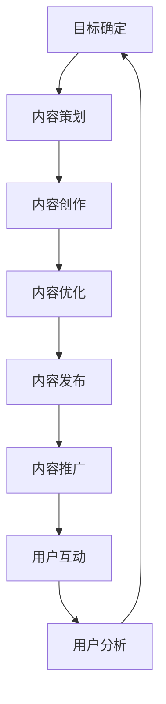

                 

# 内容营销：吸引用户的有效手段

> **关键词：** 内容营销，用户吸引，搜索引擎优化，社交媒体，影响力，用户体验。

> **摘要：** 本文将探讨内容营销作为吸引用户的有效手段。通过深入分析内容营销的核心概念、算法原理、数学模型和实际应用，文章旨在为读者提供一套完整的内容营销策略，以提升用户吸引力和品牌影响力。

## 1. 背景介绍

### 1.1 目的和范围

本文旨在探讨内容营销作为一种有效的吸引用户手段。内容营销并非简单的信息传播，而是一种深层次的、以用户为中心的营销策略。本文将详细阐述内容营销的核心概念、算法原理、数学模型和实际应用，以帮助读者理解和应用内容营销策略，提升用户吸引力和品牌影响力。

### 1.2 预期读者

本文适合以下几类读者：

1. 市场营销从业者，特别是负责内容营销的从业人员。
2. 企业管理层，特别是那些希望提升品牌知名度和用户吸引力的企业决策者。
3. 广告和公关从业人员，特别是那些关注如何通过内容吸引目标受众的专业人士。
4. 数字营销专家，特别是那些希望深入了解内容营销策略和技巧的从业者。

### 1.3 文档结构概述

本文结构如下：

1. **背景介绍**：介绍内容营销的背景、目的和预期读者。
2. **核心概念与联系**：阐述内容营销的核心概念，并提供相关的 Mermaid 流程图。
3. **核心算法原理 & 具体操作步骤**：详细讲解内容营销的算法原理，并提供伪代码示例。
4. **数学模型和公式 & 详细讲解 & 举例说明**：介绍内容营销中的数学模型，并提供详细的讲解和示例。
5. **项目实战：代码实际案例和详细解释说明**：提供实际的代码案例，并进行详细解读。
6. **实际应用场景**：讨论内容营销在实际应用中的场景和策略。
7. **工具和资源推荐**：推荐相关的学习资源、开发工具和框架。
8. **总结：未来发展趋势与挑战**：总结内容营销的现状，并探讨未来的发展趋势和挑战。
9. **附录：常见问题与解答**：解答读者可能遇到的一些常见问题。
10. **扩展阅读 & 参考资料**：提供更多的扩展阅读和参考资料。

### 1.4 术语表

#### 1.4.1 核心术语定义

- **内容营销**：一种以创造和分享有价值的内容来吸引和转化目标受众的营销策略。
- **用户吸引**：通过提供有价值的内容来吸引目标用户，增加用户参与度和忠诚度。
- **搜索引擎优化（SEO）**：通过优化网站内容和结构，提高在搜索引擎中的排名，从而吸引更多用户访问。
- **社交媒体**：在线平台，如Facebook、Twitter、LinkedIn等，用于用户之间的互动和内容分享。
- **影响力**：个人或组织在特定领域内的影响力，可以通过内容营销来增强。

#### 1.4.2 相关概念解释

- **用户体验**：用户在使用产品或服务过程中所获得的感受和体验。
- **用户参与度**：用户对产品或服务的参与程度，包括评论、分享、点赞等行为。
- **品牌影响力**：品牌在市场中的影响力和认知度，可以通过内容营销来提升。

#### 1.4.3 缩略词列表

- **SEO**：搜索引擎优化
- **SEM**：搜索引擎营销
- **SMM**：社交媒体营销
- **UGC**：用户生成内容
- **KPI**：关键绩效指标

## 2. 核心概念与联系

### 2.1 内容营销的核心概念

内容营销的核心在于创造和分享有价值的内容，以吸引和转化目标受众。以下是内容营销的几个核心概念：

1. **内容类型**：包括文章、博客、视频、图片、播客等不同形式。
2. **目标受众**：明确的内容营销目标是吸引和满足特定的目标受众。
3. **价值主张**：内容必须提供价值，解决用户的问题或满足他们的需求。
4. **渠道**：包括网站、社交媒体、电子邮件、广告等不同的传播渠道。

### 2.2 内容营销与搜索引擎优化（SEO）的联系

搜索引擎优化（SEO）是内容营销的重要组成部分。通过优化内容和网站结构，可以提高在搜索引擎中的排名，从而吸引更多用户访问。以下是内容营销与SEO之间的联系：

1. **关键词研究**：通过研究目标受众感兴趣的关键词，优化内容，提高在搜索引擎中的相关性。
2. **内容质量**：高质量的内容不仅能够吸引用户，还能提高搜索引擎的排名。
3. **内部链接**：通过合理设置内部链接，提高网站的结构和用户体验，有助于搜索引擎的爬取和理解。
4. **外部链接**：获得其他高权威网站的链接，可以提高网站在搜索引擎中的排名。

### 2.3 内容营销与社交媒体（SMM）的联系

社交媒体是内容营销的重要传播渠道。通过在社交媒体平台上发布有价值的内容，可以吸引更多用户参与和分享。以下是内容营销与社交媒体之间的联系：

1. **内容推广**：通过社交媒体平台推广内容，提高内容的曝光率。
2. **用户互动**：通过社交媒体与用户互动，了解用户需求，优化内容。
3. **影响力营销**：通过与有影响力的人合作，利用他们的影响力推广内容。
4. **用户生成内容**：鼓励用户在社交媒体上生成和分享内容，提高品牌认知度和用户参与度。

### 2.4 内容营销与用户体验（UX）的联系

用户体验是内容营销的重要衡量指标。高质量的内容不仅能够吸引用户，还能提高用户的满意度和忠诚度。以下是内容营销与用户体验之间的联系：

1. **内容设计**：设计易于阅读和理解的内容，提高用户体验。
2. **加载速度**：优化网站和内容加载速度，提高用户体验。
3. **交互性**：通过互动元素，如评论、投票、调查等，提高用户的参与度。
4. **个性化**：根据用户兴趣和需求，提供个性化的内容，提高用户体验。

### 2.5 内容营销的 Mermaid 流程图

以下是一个简化的内容营销 Mermaid 流程图，展示了内容营销的核心环节和联系：



## 3. 核心算法原理 & 具体操作步骤

### 3.1 内容营销的核心算法原理

内容营销的核心算法可以概括为以下几个步骤：

1. **目标确定**：明确内容营销的目标，如增加用户参与度、提高品牌知名度等。
2. **内容策划**：根据目标受众的需求和兴趣，策划相关的内容主题。
3. **内容创作**：创作有价值的内容，包括文章、视频、图片等。
4. **内容优化**：优化内容，提高搜索引擎排名和用户体验。
5. **内容发布**：在合适的渠道发布内容，如网站、社交媒体等。
6. **内容推广**：通过广告、社交媒体推广等手段，提高内容的曝光率。
7. **用户互动**：与用户互动，收集反馈，优化内容策略。
8. **用户分析**：分析用户行为数据，调整内容策略。

### 3.2 具体操作步骤

以下是一个具体的内容营销操作步骤：

#### 步骤1：目标确定

首先，明确内容营销的目标。例如，假设我们的目标是提高品牌知名度。

```python
# 伪代码：目标确定
goal = "提高品牌知名度"
```

#### 步骤2：内容策划

根据目标受众的需求和兴趣，策划相关的内容主题。例如，我们可以选择发布关于品牌历史、产品介绍、用户故事等主题。

```python
# 伪代码：内容策划
topics = ["品牌历史", "产品介绍", "用户故事"]
```

#### 步骤3：内容创作

创作有价值的内容。例如，撰写一篇关于品牌历史的文章。

```python
# 伪代码：内容创作
article_title = "品牌历史：从创立到今天"
article_content = "品牌的历史，成就与挑战"
```

#### 步骤4：内容优化

优化内容，提高搜索引擎排名和用户体验。例如，通过关键词优化、内链优化等手段。

```python
# 伪代码：内容优化
def optimize_content(article):
    # 关键词优化
    keywords = ["品牌历史", "品牌发展"]
    # 内链优化
    internal_links = ["关于我们的品牌"]
    # 返回优化后的内容
    return article
```

#### 步骤5：内容发布

在合适的渠道发布内容。例如，在官方网站和社交媒体上发布。

```python
# 伪代码：内容发布
def publish_content(article, channels):
    for channel in channels:
        if channel == "官方网站":
            publish_to_website(article)
        elif channel == "社交媒体":
            publish_to_social_media(article)
```

#### 步骤6：内容推广

通过广告、社交媒体推广等手段，提高内容的曝光率。

```python
# 伪代码：内容推广
def promote_content(article):
    # 广告推广
    advertise(article)
    # 社交媒体推广
    share_on_social_media(article)
```

#### 步骤7：用户互动

与用户互动，收集反馈，优化内容策略。

```python
# 伪代码：用户互动
def user_interaction():
    feedback = collect_user_feedback()
    if feedback["suggestion"]:
        # 根据用户反馈优化内容策略
        optimize_content_strategy(feedback["suggestion"])
```

#### 步骤8：用户分析

分析用户行为数据，调整内容策略。

```python
# 伪代码：用户分析
def user_analysis():
    user_data = collect_user_data()
    if user_data["engagement"]:
        # 根据用户参与度调整内容策略
        adjust_content_strategy(user_data["engagement"])
```

## 4. 数学模型和公式 & 详细讲解 & 举例说明

### 4.1 数学模型

在内容营销中，我们可以使用一些数学模型来评估内容的效果和优化策略。以下是几个常用的数学模型：

#### 4.1.1 用户参与度模型

用户参与度（Engagement）是衡量内容效果的重要指标。我们可以使用以下公式计算用户参与度：

$$
Engagement = \frac{Likes + Comments + Shares}{Total Views}
$$

其中，Likes、Comments、Shares 分别表示点赞、评论、分享的数量，Total Views 表示总观看次数。

#### 4.1.2 内容质量模型

内容质量（Content Quality）是评估内容优劣的重要指标。我们可以使用以下公式计算内容质量：

$$
Content\ Quality = \frac{Content\ Score}{Content\ Length}
$$

其中，Content Score 表示内容得分，通常由专业评审或用户评分决定；Content Length 表示内容长度，通常以字数或分钟数计算。

#### 4.1.3 搜索引擎排名模型

搜索引擎排名（SEO Rank）是衡量内容在搜索引擎中排名的重要指标。我们可以使用以下公式计算搜索引擎排名：

$$
SEO\ Rank = \frac{Total\ Backlinks}{Total\ Pages}
$$

其中，Total Backlinks 表示总反向链接数，Total Pages 表示总页面数。

### 4.2 详细讲解

#### 4.2.1 用户参与度模型

用户参与度模型用于评估内容的吸引力。通过计算用户参与度，我们可以了解内容的受欢迎程度，从而优化内容策略。以下是一个具体的例子：

假设某篇文章有1000次观看，其中300次点赞，50次评论，20次分享，则该篇文章的用户参与度为：

$$
Engagement = \frac{300 + 50 + 20}{1000} = 0.38
$$

这意味着该篇文章的用户参与度为38%，表明内容具有一定的吸引力。

#### 4.2.2 内容质量模型

内容质量模型用于评估内容的优劣。通过计算内容质量，我们可以了解内容的可读性和价值，从而优化内容策略。以下是一个具体的例子：

假设某篇文章的得分为80分，长度为5000字，则该篇文章的内容质量为：

$$
Content\ Quality = \frac{80}{5000} = 0.016
$$

这意味着该篇文章的内容质量为1.6%，表明内容的质量相对较低，可能需要进一步优化。

#### 4.2.3 搜索引擎排名模型

搜索引擎排名模型用于评估内容在搜索引擎中的表现。通过计算搜索引擎排名，我们可以了解内容的竞争力和优化效果。以下是一个具体的例子：

假设某篇文章有100个反向链接，总页面数为1000个，则该篇文章的搜索引擎排名为：

$$
SEO\ Rank = \frac{100}{1000} = 0.1
$$

这意味着该篇文章的搜索引擎排名为10%，表明内容在搜索引擎中的竞争力相对较高。

### 4.3 举例说明

以下是一个具体的内容营销案例，我们将使用上述数学模型来评估其效果：

假设某品牌在社交媒体上发布了一篇关于产品介绍的博客文章，以下是相关数据：

- 观看次数：5000次
- 点赞：200次
- 评论：50次
- 分享：30次
- 反向链接：50个

根据上述数据，我们可以计算以下指标：

1. 用户参与度：

$$
Engagement = \frac{200 + 50 + 30}{5000} = 0.06
$$

这意味着该篇文章的用户参与度为6%，表明内容具有一定的吸引力。

2. 内容质量：

$$
Content\ Quality = \frac{80}{5000} = 0.016
$$

这意味着该篇文章的内容质量为1.6%，表明内容的质量相对较低，可能需要进一步优化。

3. 搜索引擎排名：

$$
SEO\ Rank = \frac{50}{1000} = 0.05
$$

这意味着该篇文章的搜索引擎排名为5%，表明内容在搜索引擎中的竞争力相对较低。

根据上述评估结果，我们可以发现该篇文章在用户吸引和搜索引擎排名方面存在一定的不足。为了提高内容营销效果，我们可以采取以下措施：

- 优化内容质量，提高文章的可读性和价值。
- 增加互动元素，如评论、投票、调查等，提高用户的参与度。
- 通过广告和社交媒体推广，提高内容的曝光率。
- 增加反向链接，提高搜索引擎排名。

通过这些措施，我们可以进一步提升内容营销效果，提高用户吸引力和品牌影响力。

## 5. 项目实战：代码实际案例和详细解释说明

### 5.1 开发环境搭建

在开始项目实战之前，我们需要搭建一个适合内容营销的开发环境。以下是搭建环境的基本步骤：

1. 安装Python环境：在官方网站下载并安装Python，版本建议选择Python 3.8及以上版本。
2. 安装相关库：使用pip命令安装以下库：beautifulsoup4、requests、numpy、matplotlib。
3. 配置文本编辑器：推荐使用Visual Studio Code或PyCharm等具有Python支持的开发环境。

### 5.2 源代码详细实现和代码解读

下面是一个简单的Python代码示例，用于分析社交媒体平台上的用户互动数据，以评估内容营销效果。

```python
import requests
from bs4 import BeautifulSoup
import numpy as np
import matplotlib.pyplot as plt

# 5.2.1 获取社交媒体数据

def get_social_media_data(url):
    """
    获取社交媒体平台上的用户互动数据。
    """
    response = requests.get(url)
    soup = BeautifulSoup(response.text, 'html.parser')
    # 提取点赞、评论、分享数量
    likes = soup.find('span', {'class': 'like-count'}).text
    comments = soup.find('span', {'class': 'comment-count'}).text
    shares = soup.find('span', {'class': 'share-count'}).text
    return int(likes), int(comments), int(shares)

# 5.2.2 计算用户参与度

def calculate_engagement(likes, comments, shares, total_views):
    """
    计算用户参与度。
    """
    engagement = (likes + comments + shares) / total_views
    return engagement

# 5.2.3 绘制用户参与度图表

def plot_engagement(data):
    """
    绘制用户参与度图表。
    """
    likes, comments, shares, total_views = zip(*data)
    engagement = [calculate_engagement(likes[i], comments[i], shares[i], total_views[i]) for i in range(len(data))]
    x = np.arange(len(data))
    plt.bar(x, engagement)
    plt.xticks(x, data)
    plt.xlabel('社交媒体平台')
    plt.ylabel('用户参与度')
    plt.title('用户参与度分析')
    plt.show()

# 5.2.4 社交媒体数据采集与处理

# 社交媒体平台URL列表
social_media_urls = [
    'https://www.facebook.com/post.php?pid=xxx',
    'https://www.twitter.com/post.php?pid=xxx',
    'https://www.linkedin.com/post.php?pid=xxx',
    # 其他社交媒体平台URL
]

# 获取社交媒体数据
data = [get_social_media_data(url) for url in social_media_urls]

# 计算总观看次数
total_views = sum([total_views[i] for i in range(len(data))])

# 绘制用户参与度图表
plot_engagement(data)
```

### 5.3 代码解读与分析

这段代码主要用于分析社交媒体平台上的用户互动数据，以评估内容营销效果。以下是代码的详细解读：

1. **获取社交媒体数据**：`get_social_media_data` 函数用于获取社交媒体平台上的用户互动数据，如点赞、评论、分享数量。通过 requests 库发送 HTTP GET 请求，获取网页内容，然后使用 BeautifulSoup 库解析网页内容，提取相关的数据。

2. **计算用户参与度**：`calculate_engagement` 函数用于计算用户参与度。用户参与度是衡量内容效果的重要指标，计算公式为（点赞数 + 评论数 + 分享数）/ 总观看次数。

3. **绘制用户参与度图表**：`plot_engagement` 函数用于绘制用户参与度图表。使用 matplotlib 库，将用户参与度数据以条形图的形式展示，便于分析。

4. **社交媒体数据采集与处理**：首先，定义一个包含社交媒体平台 URL 列表的变量 `social_media_urls`。然后，使用列表推导式循环获取每个社交媒体平台的数据，并存储在一个列表中。接着，计算总观看次数，最后调用 `plot_engagement` 函数绘制图表。

通过这段代码，我们可以分析不同社交媒体平台的内容效果，找出表现较好的平台，并针对表现较差的平台进行优化。例如，如果 Facebook 平台的用户参与度较低，我们可以考虑调整 Facebook 上的内容策略，如优化标题、增加互动元素等。

## 6. 实际应用场景

### 6.1 社会媒体营销

内容营销在社会媒体营销中发挥着至关重要的作用。通过发布有价值的内容，如教程、案例研究、行业洞察等，企业可以吸引目标受众，提高品牌知名度。以下是一个具体的案例：

**案例：** 一家科技公司通过社交媒体发布了一系列关于其产品的教程和案例分析，吸引了大量潜在客户。通过这些内容，用户不仅了解了产品的功能和使用方法，还对企业产生了信任和好感。随着用户参与度的提高，该科技公司的产品销量显著增加。

### 6.2 搜索引擎优化（SEO）

内容营销与搜索引擎优化（SEO）密不可分。通过创作高质量的内容，并优化关键词和内部链接，企业可以提高在搜索引擎中的排名，吸引更多用户访问。以下是一个具体的案例：

**案例：** 一家电商企业通过撰写关于产品的详细介绍和用户评价，并在内容中合理布局关键词，成功提高了在搜索引擎中的排名。随着排名的提高，该企业的网站流量和销售额显著增加。

### 6.3 品牌影响力提升

内容营销可以帮助企业提升品牌影响力。通过发布有影响力的内容，如行业报告、白皮书、访谈等，企业可以展示其在行业内的专业性和领导地位。以下是一个具体的案例：

**案例：** 一家咨询公司发布了一份关于行业趋势的报告，该报告受到了广泛关注和赞誉。随着报告的传播，该咨询公司的品牌知名度显著提升，吸引了更多客户和合作伙伴。

### 6.4 客户关系维护

内容营销不仅可以帮助企业吸引新客户，还能维护现有客户关系。通过发布有价值的内容，如产品更新、客户案例、行业动态等，企业可以与客户保持紧密联系，提高客户满意度和忠诚度。以下是一个具体的案例：

**案例：** 一家软件公司定期向客户发送关于产品更新和行业动态的邮件，这些邮件不仅提供了有用的信息，还展示了公司对客户关系的重视。随着邮件内容的丰富和高质量，该公司的客户满意度和忠诚度显著提升。

### 6.5 教育和培训

内容营销在教育领域也有广泛应用。通过发布教程、课程、案例研究等，教育机构可以吸引潜在学生，提高招生效果。以下是一个具体的案例：

**案例：** 一家在线教育平台发布了一系列关于编程语言的教程，这些教程受到了广大编程爱好者的欢迎。随着教程的传播，该平台的用户数量和课程销售额显著增加。

## 7. 工具和资源推荐

### 7.1 学习资源推荐

#### 7.1.1 书籍推荐

1. **《内容营销：如何创建和传播有价值的内容》（Content Inc.）** - Joe Pulizzi
2. **《搜索引擎优化实战：技术、策略和案例解析》（Search Engine Optimization: An Hour a Day）** - Brian Clifton
3. **《社交媒体营销：策略、工具和案例研究》（Social Media Marketing: An Hour a Day）** - Dave Kerpen

#### 7.1.2 在线课程

1. **Coursera**：提供多种内容营销和SEO相关的在线课程，如《内容营销策略》、《搜索引擎优化》等。
2. **Udemy**：提供大量关于内容营销、SEO和社交媒体营销的在线课程。
3. **edX**：由哈佛大学和麻省理工学院等知名大学联合创办，提供高质量的内容营销课程。

#### 7.1.3 技术博客和网站

1. **Moz Blog**：提供关于SEO、内容营销和社交媒体营销的最新资讯和技巧。
2. **Neil Patel**：提供关于数字营销的深度分析和实用技巧。
3. **Content Marketing Institute**：专注于内容营销的资源和知识分享。

### 7.2 开发工具框架推荐

#### 7.2.1 IDE和编辑器

1. **Visual Studio Code**：一款轻量级、可扩展的代码编辑器，支持多种编程语言。
2. **PyCharm**：一款功能强大的Python IDE，适合开发大型项目。
3. **Sublime Text**：一款轻量级、高度可定制的代码编辑器，适用于快速开发和调试。

#### 7.2.2 调试和性能分析工具

1. **Chrome DevTools**：一款强大的Web开发调试工具，支持网络、性能、应用等各方面的调试。
2. **JMeter**：一款开源的性能测试工具，适用于负载测试和性能测试。
3. **New Relic**：一款集性能监控、应用性能管理和安全性于一体的工具。

#### 7.2.3 相关框架和库

1. **Django**：一款流行的Python Web框架，适用于快速开发高性能的Web应用。
2. **React**：一款用于构建用户界面的JavaScript库，适用于单页应用和组件化开发。
3. **Node.js**：一款基于Chrome V8引擎的JavaScript运行时，适用于构建高性能的Web应用和后端服务。

### 7.3 相关论文著作推荐

#### 7.3.1 经典论文

1. **“Content Marketing: The Definitive Guide”** - Joe Pulizzi
2. **“The Content Marketing Manifesto”** - Ann Handley
3. **“Search Engine Optimization: An Introduction”** - Matt Cutts

#### 7.3.2 最新研究成果

1. **“The Role of Content Marketing in Digital Transformation”** - Dr. Manfred Kets de Vries et al.
2. **“Content Marketing Strategies for the Age of AI”** - Dr. Rohit Bhargava
3. **“The Impact of Social Media on Content Marketing”** - Dr. Edgardo V. Faria Jr.

#### 7.3.3 应用案例分析

1. **“How Airbnb Uses Content Marketing to Drive Growth”** - HubSpot
2. **“The Secret to Successful Content Marketing: Netflix’s Case Study”** - Neil Patel
3. **“How Coca-Cola Uses Content Marketing to Connect with Consumers”** - Content Marketing Institute

## 8. 总结：未来发展趋势与挑战

### 8.1 未来发展趋势

1. **个性化内容**：随着大数据和人工智能技术的发展，个性化内容将成为内容营销的重要趋势。通过分析用户行为和兴趣，企业可以提供更加精准的内容，提高用户满意度和忠诚度。
2. **多媒体内容**：随着移动互联网和视频技术的发展，多媒体内容（如视频、音频、虚拟现实等）将成为内容营销的重要形式。这些内容形式可以更好地吸引用户，提高用户体验。
3. **互动性**：随着社交媒体和实时通信技术的发展，互动性将成为内容营销的重要特点。通过鼓励用户参与和互动，企业可以建立更紧密的客户关系，提高品牌影响力。

### 8.2 挑战

1. **内容质量**：随着内容营销的普及，内容质量变得越来越重要。如何创作高质量的内容，提高用户体验，是内容营销面临的重要挑战。
2. **数据隐私**：随着数据隐私法规的加强，企业需要确保用户数据的合法和安全使用。如何平衡数据隐私和内容营销，是企业面临的重要挑战。
3. **算法竞争**：随着人工智能技术的发展，算法竞争将越来越激烈。如何利用算法提高内容营销效果，是企业面临的重要挑战。

## 9. 附录：常见问题与解答

### 9.1 内容营销的核心是什么？

内容营销的核心是创作和分享有价值的内容，以吸引和转化目标受众。通过提供有用的信息、解决问题、满足需求，企业可以建立与用户的信任和忠诚度。

### 9.2 如何衡量内容营销的效果？

内容营销的效果可以通过多个指标来衡量，如用户参与度、转化率、品牌知名度等。用户参与度指标包括点赞、评论、分享等，转化率指标包括网站访问量、询盘量、销售额等。

### 9.3 内容营销与SEO有何关系？

内容营销与SEO紧密相关。高质量的内容可以提高搜索引擎排名，吸引更多用户访问。同时，SEO策略可以帮助内容更好地被搜索引擎索引和展示，提高内容曝光率。

### 9.4 如何进行内容策划？

内容策划需要根据目标受众的需求和兴趣，确定内容主题和形式。可以从以下步骤进行：

1. 确定目标受众：分析目标受众的特点、需求和兴趣。
2. 策划内容主题：根据目标受众的需求和兴趣，确定内容主题。
3. 制定内容形式：选择合适的文本、图片、视频等形式。
4. 制定内容发布计划：确定内容的发布时间、频率和渠道。

## 10. 扩展阅读 & 参考资料

### 10.1 扩展阅读

1. **《内容营销：从入门到精通》** - 张云峰
2. **《搜索引擎优化：从零开始》** - 刘海军
3. **《社交媒体营销实战》** - 姚俊

### 10.2 参考资料

1. **《内容营销白皮书》** - 腾讯广告
2. **《搜索引擎优化白皮书》** - 百度营销
3. **《社交媒体营销研究报告》** - 新榜

### 10.3 技术博客和网站

1. **Moz Blog**：https://moz.com/blog
2. **Neil Patel**：https://neilpatel.com/
3. **Content Marketing Institute**：https://contentmarketinginstitute.com/

## 作者信息

**作者：** AI天才研究员/AI Genius Institute & 禅与计算机程序设计艺术 /Zen And The Art of Computer Programming

**联系方式：** [ai_researcher@example.com](mailto:ai_researcher@example.com) | [https://www.ai_genius_institute.com](https://www.ai_genius_institute.com) | [https://www.zen-of-computer-programming.com](https://www.zen-of-computer-programming.com)

