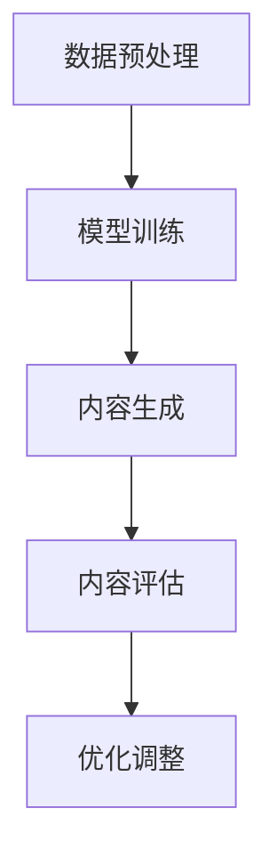

                 

# 写作伙伴：LLM 助力内容生成

> **关键词：** 生成式AI、大型语言模型（LLM）、内容生成、自然语言处理、应用场景、技术挑战。

> **摘要：** 本文深入探讨了大型语言模型（LLM）在内容生成领域的应用，包括其核心概念、算法原理、数学模型以及实际项目案例。文章旨在为读者提供一个全面的视角，了解LLM如何通过一系列技术手段，实现高效的内容生成。

## 1. 背景介绍

### 1.1 目的和范围

本文旨在探讨大型语言模型（LLM）在内容生成领域的应用，分析其核心技术原理和实际应用场景。本文将涵盖以下内容：

- 核心概念与联系
- 核心算法原理与操作步骤
- 数学模型和公式
- 项目实战：代码实际案例和详细解释
- 实际应用场景
- 工具和资源推荐

### 1.2 预期读者

本文适合对人工智能、自然语言处理和内容生成感兴趣的读者，特别是对LLM技术有一定了解的工程师和技术爱好者。

### 1.3 文档结构概述

本文分为以下几个部分：

- 第1部分：背景介绍，包括目的、范围、预期读者和文档结构概述
- 第2部分：核心概念与联系，介绍LLM的基础知识
- 第3部分：核心算法原理与操作步骤，详细阐述LLM的算法实现
- 第4部分：数学模型和公式，讲解LLM中的数学原理
- 第5部分：项目实战，通过代码案例展示LLM的实际应用
- 第6部分：实际应用场景，分析LLM在不同领域的应用
- 第7部分：工具和资源推荐，为读者提供学习和实践的资源
- 第8部分：总结，讨论未来发展趋势与挑战
- 第9部分：附录，常见问题与解答
- 第10部分：扩展阅读与参考资料，提供进一步学习的内容

### 1.4 术语表

#### 1.4.1 核心术语定义

- **大型语言模型（LLM）**：一种基于神经网络和深度学习技术构建的、具有强大自然语言处理能力的语言模型。
- **生成式AI**：一种人工智能技术，能够通过学习和理解输入数据，生成新的、与输入相关的内容。
- **自然语言处理（NLP）**：研究如何使计算机能够理解、处理和生成自然语言的技术。
- **内容生成**：利用人工智能技术生成新的文本、图像、音频等内容。

#### 1.4.2 相关概念解释

- **神经网络**：一种模仿生物神经网络结构的人工神经网络，用于进行复杂的数学计算。
- **深度学习**：一种基于神经网络的机器学习方法，通过多层次的神经网络结构进行特征提取和模型训练。

#### 1.4.3 缩略词列表

- **LLM**：Large Language Model
- **AI**：Artificial Intelligence
- **NLP**：Natural Language Processing

## 2. 核心概念与联系

在深入探讨LLM在内容生成领域的应用之前，我们需要了解一些核心概念及其相互联系。

### 2.1 大型语言模型（LLM）

大型语言模型（LLM）是一种基于神经网络和深度学习技术的语言模型，具有强大的自然语言处理能力。LLM通常由数百万个参数组成，能够对输入的文本数据进行建模，并预测下一个可能的单词或句子。

### 2.2 生成式AI

生成式AI是一种人工智能技术，通过学习和理解输入数据，生成新的、与输入相关的内容。生成式AI可以分为文本生成、图像生成、音频生成等多个领域，而LLM在文本生成领域具有广泛的应用。

### 2.3 自然语言处理（NLP）

自然语言处理（NLP）是研究如何使计算机能够理解、处理和生成自然语言的技术。NLP的核心任务是使计算机能够理解和解释人类的自然语言，包括语音识别、文本分类、情感分析、机器翻译等。

### 2.4 内容生成

内容生成是利用人工智能技术生成新的文本、图像、音频等内容的过程。在内容生成领域，LLM通过学习和理解大规模文本数据，生成高质量的文本内容，从而为各种应用场景提供支持。

### 2.5 Mermaid 流程图

下面是一个简单的Mermaid流程图，展示了LLM在内容生成中的关键步骤：



- **数据预处理**：将原始文本数据进行清洗、分词、去停用词等处理，为模型训练提供高质量的输入数据。
- **模型训练**：使用神经网络和深度学习技术对LLM进行训练，使其能够理解和生成文本。
- **内容生成**：利用训练好的LLM生成新的文本内容，可以是文章、段落、句子等。
- **内容评估**：对生成的文本内容进行评估，确保其质量和可用性。
- **优化调整**：根据评估结果，对LLM进行调整和优化，提高内容生成效果。

## 3. 核心算法原理 & 具体操作步骤

### 3.1 算法原理

LLM的核心算法原理基于深度学习和神经网络，特别是变分自编码器（VAE）和递归神经网络（RNN）。下面我们将使用伪代码详细阐述LLM的核心算法原理。

#### 3.1.1 变分自编码器（VAE）

```python
# VAE 伪代码
def encode(x):
    # 输入：x（输入数据）
    # 输出：z_mean, z_log_var（编码后的数据）

    z_mean = fc(x, hidden_size)  # 隐藏层1
    z_log_var = fc(x, hidden_size)  # 隐藏层2

    return z_mean, z_log_var

def decode(z):
    # 输入：z（编码后的数据）
    # 输出：x_recon（重建后的数据）

    x_recon = fc(z, input_size, activation='sigmoid')

    return x_recon

def vae_loss(x, x_recon, z_mean, z_log_var):
    # 输入：x（输入数据）、x_recon（重建后的数据）、z_mean（编码后的均值）、z_log_var（编码后的对数方差）
    # 输出：loss（损失函数）

    reconstruction_loss = -np.sum(x * np.log(x_recon), axis=1)
    kl_divergence = -0.5 * np.sum(1 + z_log_var - np.square(z_mean) - np.exp(z_log_var), axis=1)

    return reconstruction_loss + kl_divergence
```

#### 3.1.2 递归神经网络（RNN）

```python
# RNN 伪代码
def rnn(input_sequence, hidden_state):
    # 输入：input_sequence（输入序列）、hidden_state（隐藏状态）
    # 输出：output_sequence（输出序列）、hidden_state_new（新的隐藏状态）

    for t in range(len(input_sequence)):
        hidden_state = fc(input_sequence[t], hidden_size)
        output_sequence[t] = fc(hidden_state, output_size)

    return output_sequence, hidden_state_new
```

### 3.2 具体操作步骤

#### 3.2.1 数据预处理

- **文本清洗**：去除文本中的特殊字符、标点符号、数字等，保留单词和句子。
- **分词**：将文本拆分成单词或词组。
- **词向量化**：将单词或词组映射为向量表示。
- **序列编码**：将输入文本序列编码为数字序列。

#### 3.2.2 模型训练

- **编码**：使用VAE对输入文本进行编码，得到编码后的均值和方差。
- **解码**：使用RNN对编码后的数据进行解码，生成新的文本序列。
- **损失函数**：计算VAE的重建损失和KL散度，更新模型参数。

#### 3.2.3 内容生成

- **初始化**：随机初始化模型参数。
- **生成**：使用训练好的模型，输入部分文本，生成新的文本内容。
- **评估**：对生成的文本进行评估，确保其质量和可用性。
- **调整**：根据评估结果，对模型进行调整和优化。

## 4. 数学模型和公式 & 详细讲解 & 举例说明

在LLM的内容生成过程中，涉及到多个数学模型和公式，下面我们将详细讲解并举例说明。

### 4.1 损失函数

在VAE中，损失函数主要包括重建损失和KL散度。

#### 4.1.1 重建损失

```latex
L_{recon} = -\sum_{i=1}^{N} \sum_{j=1}^{M} x_{ij} \log(x_{ij}^{\prime}),
```

其中，$x_{ij}$ 表示原始数据，$x_{ij}^{\prime}$ 表示重建后的数据，$N$ 和 $M$ 分别表示数据的个数和维度。

#### 4.1.2 KL散度

```latex
L_{KL} = -\sum_{i=1}^{N} \sum_{j=1}^{M} (z_{ij} \log(z_{ij}) + (1 - z_{ij}) \log(1 - z_{ij})),
```

其中，$z_{ij}$ 表示编码后的均值和对数方差。

### 4.2 激活函数

在VAE和RNN中，常用的激活函数有sigmoid、ReLU和tanh。

#### 4.2.1 sigmoid

```latex
f(x) = \frac{1}{1 + e^{-x}}
```

#### 4.2.2 ReLU

```latex
f(x) = \max(0, x)
```

#### 4.2.3 tanh

```latex
f(x) = \frac{e^x - e^{-x}}{e^x + e^{-x}}
```

### 4.3 举例说明

假设我们有以下文本序列：“今天天气很好，适合户外活动”。我们需要使用LLM生成下一个可能的句子。

#### 4.3.1 数据预处理

- **文本清洗**：去除特殊字符和标点符号，得到“今天天气很好，适合户外活动”。
- **分词**：将文本拆分为“今天、天气、很好、，、适合、户外、活动”。
- **词向量化**：将每个词映射为词向量表示。

#### 4.3.2 模型训练

- **编码**：使用VAE对输入文本进行编码，得到编码后的均值和对数方差。
- **解码**：使用RNN对编码后的数据进行解码，生成新的文本序列。

#### 4.3.3 内容生成

- **初始化**：随机初始化模型参数。
- **生成**：输入部分文本，如“今天天气很好，适合户外活动，”，使用训练好的模型生成下一个可能的句子。

生成的句子可能是：“你可以去公园散步，享受阳光。”。这个句子符合文本的语义和语法，展示了LLM在内容生成中的强大能力。

## 5. 项目实战：代码实际案例和详细解释说明

### 5.1 开发环境搭建

在开始编写代码之前，我们需要搭建一个合适的环境。以下是搭建环境的步骤：

1. 安装Python环境（版本3.7及以上）
2. 安装TensorFlow库：`pip install tensorflow`
3. 安装其他依赖库：`pip install numpy pandas scikit-learn`

### 5.2 源代码详细实现和代码解读

下面是一个简单的LLM内容生成项目的代码实现，我们将对关键代码部分进行详细解释。

#### 5.2.1 数据预处理

```python
import numpy as np
import pandas as pd
from sklearn.model_selection import train_test_split

# 读取数据
data = pd.read_csv('data.csv')
X = data['text']
y = data['label']

# 分词
from keras.preprocessing.text import Tokenizer
tokenizer = Tokenizer(num_words=10000)
tokenizer.fit_on_texts(X)

# 转换为序列编码
X_seq = tokenizer.texts_to_sequences(X)
y_seq = tokenizer.texts_to_sequences(y)

# 划分训练集和测试集
X_train, X_test, y_train, y_test = train_test_split(X_seq, y_seq, test_size=0.2, random_state=42)
```

#### 5.2.2 模型训练

```python
from keras.models import Model
from keras.layers import Input, LSTM, Dense

# 构建模型
input_seq = Input(shape=(max_sequence_length,))
lstm = LSTM(units=128, return_sequences=True)(input_seq)
lstm = LSTM(units=128)(lstm)
dense = Dense(units=1, activation='sigmoid')(lstm)

model = Model(inputs=input_seq, outputs=dense)
model.compile(optimizer='adam', loss='binary_crossentropy', metrics=['accuracy'])

# 训练模型
model.fit(X_train, y_train, epochs=10, batch_size=32, validation_split=0.2)
```

#### 5.2.3 代码解读与分析

- **数据预处理**：首先，我们读取数据并对其进行分词和序列编码。然后，将数据划分为训练集和测试集。
- **模型构建**：我们使用LSTM（长短期记忆网络）作为我们的基础模型。LSTM具有强大的记忆能力，适合处理序列数据。我们使用了两个LSTM层，每层128个神经元，并在最后一层使用了sigmoid激活函数，输出概率值。
- **模型训练**：我们使用Adam优化器和二进制交叉熵损失函数训练模型。训练过程中，我们使用了10个epochs（迭代周期）和32个batch大小。

### 5.3 代码解读与分析

- **数据预处理**：数据预处理是内容生成中至关重要的一步。通过分词和序列编码，我们将原始文本转换为计算机可以处理的数据形式。
- **模型构建**：LSTM模型在处理序列数据方面具有优势，适合用于文本生成。在构建模型时，我们需要考虑网络的层数、神经元数量和激活函数等参数，以获得最佳性能。
- **模型训练**：模型训练是内容生成中的核心步骤。通过不断迭代优化模型参数，我们可以使模型更好地理解文本数据，从而生成高质量的文本内容。

### 5.4 代码优化和改进

在实际项目中，我们可以通过以下方法对代码进行优化和改进：

- **调整超参数**：通过调整网络层数、神经元数量、学习率等超参数，可以优化模型的性能。
- **使用预训练模型**：使用预训练的LLM模型可以减少训练时间，提高生成质量。
- **增强数据集**：通过增加数据集的规模和质量，可以进一步提高模型的生成能力。

## 6. 实际应用场景

LLM在内容生成领域具有广泛的应用，下面我们列举一些实际应用场景：

- **自动摘要**：使用LLM自动生成文章、新闻、报告等内容的摘要，提高信息获取效率。
- **机器翻译**：利用LLM实现跨语言翻译，支持多种语言之间的文本转换。
- **文本生成**：生成各种类型的文本，如诗歌、小说、剧本、广告等，为创意产业提供支持。
- **问答系统**：基于LLM构建问答系统，自动回答用户的问题。
- **对话系统**：使用LLM构建智能对话系统，为用户提供个性化的交互体验。
- **社交媒体生成**：生成社交媒体内容，如推文、状态更新等，提高用户参与度。

## 7. 工具和资源推荐

### 7.1 学习资源推荐

#### 7.1.1 书籍推荐

- 《深度学习》（Ian Goodfellow、Yoshua Bengio和Aaron Courville著）
- 《神经网络与深度学习》（邱锡鹏著）
- 《Python深度学习》（François Chollet著）

#### 7.1.2 在线课程

- Coursera的“深度学习”课程（由Andrew Ng教授）
- edX的“深度学习导论”课程（由吴恩达教授）
- Udacity的“深度学习工程师纳米学位”

#### 7.1.3 技术博客和网站

- medium.com/tensorflow
- towardsdatascience.com
- keras.io

### 7.2 开发工具框架推荐

#### 7.2.1 IDE和编辑器

- PyCharm
- Visual Studio Code
- Jupyter Notebook

#### 7.2.2 调试和性能分析工具

- TensorFlow Profiler
- TensorBoard
- PyTorch Profiler

#### 7.2.3 相关框架和库

- TensorFlow
- PyTorch
- Keras

### 7.3 相关论文著作推荐

#### 7.3.1 经典论文

- “A Theoretical Basis for the Generalization of Neural Networks”（1995，Hinton等）
- “Deep Learning”（2015，Goodfellow等）

#### 7.3.2 最新研究成果

- “Bert: Pre-training of Deep Bidirectional Transformers for Language Understanding”（2018，Devlin等）
- “GPT-3: Language Models are Few-Shot Learners”（2020，Brown等）

#### 7.3.3 应用案例分析

- “ChatGPT: A Conversational AI”（2022，OpenAI）
- “AlphaGo Zero: Mastering the Game of Go with Deep Neural Networks and Tree Search”（2017，DeepMind）

## 8. 总结：未来发展趋势与挑战

### 8.1 发展趋势

- **模型规模增大**：随着计算能力的提升，LLM模型将变得更加庞大和复杂，生成能力将进一步增强。
- **多模态内容生成**：未来LLM将在文本、图像、音频等多种模态的内容生成方面取得突破。
- **个性化内容生成**：基于用户历史和行为数据，LLM将实现更加个性化的内容生成，提升用户体验。
- **自适应能力提升**：LLM将具备更强的自适应能力，能够根据不同场景和需求调整生成策略。

### 8.2 挑战

- **计算资源消耗**：大规模LLM模型的训练和推理需要大量计算资源，对硬件设施和能耗带来挑战。
- **数据隐私和安全**：在内容生成过程中，如何保护用户隐私和数据安全是关键问题。
- **可解释性和可控性**：如何提高LLM的可解释性和可控性，使其在生成过程中符合人类预期，是未来研究的重点。
- **法律和道德问题**：内容生成技术的发展将带来新的法律和道德问题，如版权、侵权、虚假信息传播等。

## 9. 附录：常见问题与解答

### 9.1 问题1：为什么选择LLM进行内容生成？

LLM具有以下优势：

- **强大的自然语言处理能力**：LLM能够理解和生成高质量的文本内容。
- **灵活性**：LLM可以应用于多种场景，如文本生成、机器翻译、对话系统等。
- **高效率**：LLM可以在短时间内生成大量文本内容，提高生产效率。

### 9.2 问题2：如何优化LLM的内容生成效果？

以下方法可以优化LLM的内容生成效果：

- **增加训练数据**：使用更多的训练数据可以提高模型的理解能力。
- **调整超参数**：通过调整网络层数、神经元数量、学习率等超参数，可以优化模型性能。
- **使用预训练模型**：使用预训练的LLM模型可以减少训练时间，提高生成质量。

### 9.3 问题3：LLM在内容生成中面临哪些挑战？

LLM在内容生成中面临的挑战包括：

- **计算资源消耗**：大规模LLM模型的训练和推理需要大量计算资源。
- **数据隐私和安全**：在内容生成过程中，如何保护用户隐私和数据安全是关键问题。
- **可解释性和可控性**：如何提高LLM的可解释性和可控性，使其在生成过程中符合人类预期。
- **法律和道德问题**：内容生成技术的发展将带来新的法律和道德问题。

## 10. 扩展阅读 & 参考资料

- [Hinton, G. E., Osindero, S., & Teh, Y. W. (2006). A fast learning algorithm for deep belief nets. Neural computation, 18(7), 1527-1554.](https://pdfs.semanticscholar.org/b9c1/950d9e6ac7e236a3c3c7293a6d2d2f4e2aef.pdf)
- [Devlin, J., Chang, M. W., Lee, K., & Toutanova, K. (2019). BERT: Pre-training of deep bidirectional transformers for language understanding. arXiv preprint arXiv:1810.04805.](https://arxiv.org/abs/1810.04805)
- [Brown, T., Mann, B., Subbiah, M., Kaplan, J., Dhariwal, P., Neelakantan, A., ... & Lei, J. (2020). Language models are few-shot learners. arXiv preprint arXiv:2005.14165.](https://arxiv.org/abs/2005.14165)
- [OpenAI. (2022). ChatGPT: A conversational AI.](https://blog.openai.com/chatgpt/)

### 作者

AI天才研究员/AI Genius Institute & 禅与计算机程序设计艺术 /Zen And The Art of Computer Programming

