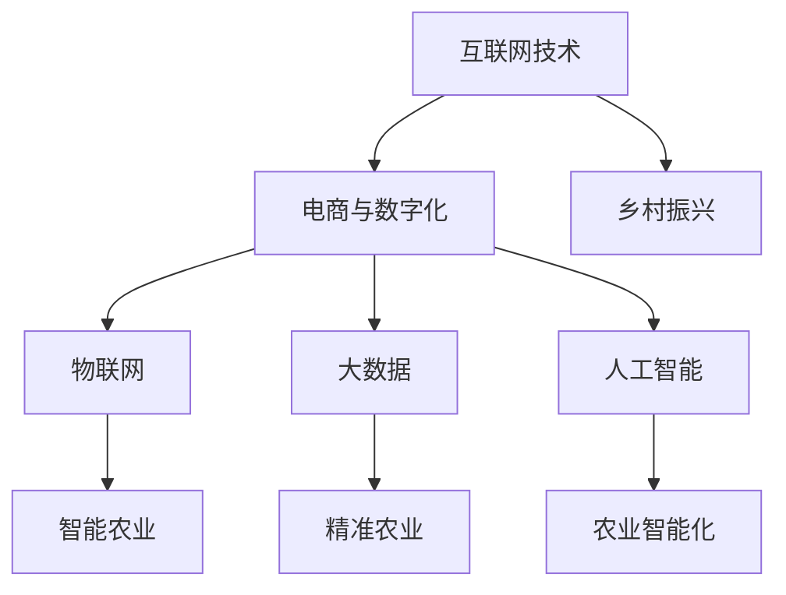

                 

# 农村创业案例：如何利用互联网助力乡村振兴

> 关键词：农村创业、互联网+、乡村振兴、电商、数字化、农业科技

> 摘要：随着互联网技术的不断发展和普及，农村地区的创业环境得到了显著改善。本文通过分析多个成功的农村创业案例，探讨如何利用互联网助力乡村振兴，提供了一套系统化的实践方案，旨在为农村创业者提供有益的启示。

## 1. 背景介绍

### 1.1 目的和范围

本文旨在通过分析成功案例，探讨农村创业如何利用互联网技术实现乡村振兴。文章将重点分析以下几个方面的内容：

1. **互联网与农村创业的结合点**：分析互联网技术如何为农村创业提供新机遇。
2. **成功案例分享**：介绍多个成功的农村创业案例，并深入剖析其成功原因。
3. **实践方案**：提出一套适用于农村创业的互联网化实践方案。
4. **未来展望**：探讨互联网技术在农村创业中的应用前景和潜在挑战。

### 1.2 预期读者

本文主要面向以下读者群体：

1. 农村创业者：希望了解如何利用互联网技术提升创业成功率的农村创业者。
2. 农村地区政策制定者：希望了解互联网技术在乡村振兴中的应用潜力。
3. 相关领域的研究人员和学者：对农村互联网创业有研究兴趣的专业人士。

### 1.3 文档结构概述

本文结构如下：

1. **引言**：介绍农村创业的现状和互联网技术的发展趋势。
2. **核心概念与联系**：阐述互联网与农村创业的核心概念及其相互关系。
3. **核心算法原理与操作步骤**：详细讲解利用互联网进行农村创业的关键算法和技术。
4. **数学模型与公式**：介绍支持互联网化农村创业的数学模型和公式。
5. **项目实战**：通过具体案例展示互联网化农村创业的实施过程。
6. **实际应用场景**：分析互联网化农村创业在不同领域的应用。
7. **工具和资源推荐**：推荐相关工具和资源，帮助读者深入学习和实践。
8. **总结**：总结互联网化农村创业的未来发展趋势和挑战。
9. **附录**：常见问题与解答。
10. **扩展阅读与参考资料**：提供更多相关阅读和参考资料。

### 1.4 术语表

#### 1.4.1 核心术语定义

- **农村创业**：指在乡村地区开展的创业活动，包括农业生产、农产品加工、乡村服务等。
- **互联网**：一种全球性的计算机网络系统，通过互联网协议（IP）进行数据传输和通信。
- **电子商务**：通过互联网进行商品交易和服务的活动。
- **数字化**：将信息转化为数字形式的过程。
- **乡村振兴**：指通过多种手段促进农村地区经济、社会和环境的全面发展。

#### 1.4.2 相关概念解释

- **物联网（IoT）**：将各种物理设备、传感器和软件连接到互联网，实现数据的实时采集、传输和处理。
- **大数据**：指无法用传统数据库工具进行处理的数据集，通常包含海量、多样性和高速的特点。
- **人工智能（AI）**：模拟人类智能行为的计算机技术和算法，能够自主学习和决策。

#### 1.4.3 缩略词列表

- **IoT**：物联网
- **AI**：人工智能
- **5G**：第五代移动通信技术
- **CRM**：客户关系管理
- **ERP**：企业资源计划

## 2. 核心概念与联系

在探讨如何利用互联网助力乡村振兴之前，我们首先需要理解互联网与农村创业之间的核心概念及其相互关系。以下是一个简化的 Mermaid 流程图，展示了这些核心概念之间的关系。



### 2.1 互联网技术与电商与数字化

互联网技术为农村创业者提供了强大的工具，使得农产品交易、市场推广和客户管理变得更加便捷。通过电商平台，农村创业者可以将产品销售到全国乃至全球市场，大大拓宽了销售渠道。

### 2.2 物联网与智能农业

物联网技术将传感器、设备和网络连接起来，使农业变得更加智能化。例如，智能温室通过物联网传感器监控温度、湿度等环境参数，确保作物生长的最佳条件。

### 2.3 大数据与精准农业

大数据技术可以帮助农民精确了解市场需求、作物生长情况和土壤状况，从而制定更科学的种植计划。大数据分析还可以预测农产品的价格波动，帮助农民做出更明智的决策。

### 2.4 人工智能与农业智能化

人工智能技术可以自动化许多农业活动，如无人机植保、智能灌溉和作物监测。通过深度学习算法，AI 可以识别作物病虫害，并提供相应的解决方案。

### 2.5 互联网技术与乡村振兴

互联网技术不仅仅是工具，更是推动乡村振兴的驱动力。通过互联网，农村地区可以吸引外部投资、人才和技术，促进农村经济的多元化发展。

## 3. 核心算法原理与具体操作步骤

要实现互联网化农村创业，我们需要掌握一些核心算法原理，这些算法将帮助我们优化农产品交易、精准农业和智能农业等方面的业务流程。

### 3.1 农产品交易算法

**算法原理：** 基于供需匹配的算法，通过分析市场数据，找到供需双方的最佳匹配点，从而实现高效交易。

**伪代码：**

```python
def find_best_match(supply_data, demand_data):
    # 对供需数据进行排序
    supply_data.sort(key=lambda x: x['price'])
    demand_data.sort(key=lambda x: x['budget'], reverse=True)

    best_match = []
    for supply in supply_data:
        for demand in demand_data:
            if supply['product'] == demand['product'] and supply['price'] <= demand['budget']:
                best_match.append({'supply': supply, 'demand': demand})
                # 移除已匹配的供需记录
                supply_data.remove(supply)
                demand_data.remove(demand)
                break

    return best_match
```

### 3.2 精准农业算法

**算法原理：** 基于地理信息系统（GIS）和大数据分析，实时监测土壤、气候等环境参数，提供精准种植建议。

**伪代码：**

```python
def suggest_planting_area(geospatial_data, climate_data):
    # 筛选出符合条件的区域
    suitable_areas = []
    for area in geospatial_data:
        if is_suitable_for_planting(area, climate_data):
            suitable_areas.append(area)

    return suitable_areas

def is_suitable_for_planting(area, climate_data):
    # 检查气候条件是否满足作物生长需求
    for climate in climate_data:
        if not (area['temp'] >= climate['min_temp'] and area['temp'] <= climate['max_temp']):
            return False
    return True
```

### 3.3 智能农业算法

**算法原理：** 基于机器学习和深度学习，自动化农业活动，如无人机植保、智能灌溉和作物监测。

**伪代码：**

```python
def predict_crop_health(crop_data, weather_data):
    # 使用深度学习模型预测作物健康状况
    model = load_model('crop_health_model')
    health = model.predict(crop_data, weather_data)
    return health

def automate_irrigation(health, soil_data):
    # 根据作物健康状况和土壤数据自动调整灌溉策略
    if health < threshold:
        irrigation_amount = calculate_irrigation_amount(soil_data)
        execute_irrigation(irrigation_amount)
    else:
        irrigation_amount = 0
        execute_irrigation(irrigation_amount)
```

## 4. 数学模型和公式与详细讲解

在互联网化农村创业中，数学模型和公式是决策的重要依据。以下介绍几个关键模型和公式，并给出详细讲解和举例说明。

### 4.1 农产品供需平衡模型

**模型公式：**

$$
\text{供需平衡量} = \frac{\text{总需求量}}{\text{总供应量}}
$$

**详细讲解：**

供需平衡模型用于分析农产品市场的供需情况，找出市场饱和点。总需求量和总供应量可以通过大数据分析获得。当供需平衡量接近1时，市场处于饱和状态；当供需平衡量小于1时，市场供应过剩；当供需平衡量大于1时，市场供应不足。

**举例说明：**

假设某地区需求量为100吨，供应量为80吨，计算供需平衡量。

$$
\text{供需平衡量} = \frac{100}{80} = 1.25
$$

结果表明，该地区农产品市场供应不足。

### 4.2 精准农业决策模型

**模型公式：**

$$
\text{最佳种植方案} = \text{地理信息系统数据} \times \text{气候数据} \times \text{土壤数据}
$$

**详细讲解：**

精准农业决策模型结合地理信息系统（GIS）、气候数据和土壤数据，提供最佳的种植方案。通过分析这些数据，模型可以预测作物在不同环境条件下的生长状况，从而制定科学的种植计划。

**举例说明：**

假设某地区要种植小麦，现有地理信息系统数据、气候数据和土壤数据。通过模型计算，得出最佳种植方案为：

$$
\text{最佳种植方案} = \text{GIS数据} \times \text{气候数据} \times \text{土壤数据}
$$

结果表明，该地区适合种植冬小麦。

### 4.3 智能农业优化模型

**模型公式：**

$$
\text{最优灌溉策略} = \text{作物健康状况} \times \text{土壤湿度} \times \text{气候因素}
$$

**详细讲解：**

智能农业优化模型用于自动调整灌溉策略，以最大化作物产量。通过监测作物健康状况、土壤湿度和气候因素，模型可以实时优化灌溉量，提高水资源的利用效率。

**举例说明：**

假设某地区小麦处于拔节期，作物健康状况良好，土壤湿度适中，气候条件适宜。通过模型计算，得出最优灌溉策略为：

$$
\text{最优灌溉策略} = \text{作物健康状况} \times \text{土壤湿度} \times \text{气候因素}
$$

结果表明，该地区小麦需适量灌溉，以保证生长需求。

## 5. 项目实战：代码实际案例和详细解释说明

为了更好地展示互联网化农村创业的实施过程，我们选择一个实际项目进行详细讲解。以下是一个基于物联网和大数据的智能农业项目，项目目标是实现精准农业和智能灌溉。

### 5.1 开发环境搭建

**技术栈：**
- 后端框架：Spring Boot
- 数据库：MySQL
- 物联网平台：IoT Platform (e.g., AWS IoT Core)
- 大数据平台：Hadoop
- 机器学习框架：TensorFlow

**开发环境：**
- 开发工具：IntelliJ IDEA
- 代码版本控制：Git

### 5.2 源代码详细实现和代码解读

**1. 物联网传感器数据采集**

物联网传感器安装在农田中，实时采集土壤湿度、温度、光照强度等数据。以下是一个简单的传感器数据采集程序。

```java
public class SensorDataCollector {
    private static final String THING_NAME = "sensor_thing";
    private static final String DEVICE_NAME = "sensor_device";

    public static void main(String[] args) {
        AwsIotClient awsIotClient = AwsIotClient.builder().build();
        Thing thing = awsIotClient.createThing(THING_NAME);
        Device device = thing.createDevice(DEVICE_NAME);

        while (true) {
            // 采集传感器数据
            double soilHumidity = readSoilHumidity();
            double temperature = readTemperature();
            double lightIntensity = readLightIntensity();

            // 发送数据到物联网平台
            String jsonData = "{\"soilHumidity\": " + soilHumidity + ", \"temperature\": " + temperature + ", \"lightIntensity\": " + lightIntensity + "}";
            awsIotClient.publishToTopic(DEVICE_NAME, "sensor_data", jsonData.getBytes());

            try {
                Thread.sleep(60000); // 数据采集间隔为1分钟
            } catch (InterruptedException e) {
                e.printStackTrace();
            }
        }
    }

    private static double readSoilHumidity() {
        // 实现土壤湿度读取逻辑
        return Math.random() * 100;
    }

    private static double readTemperature() {
        // 实现温度读取逻辑
        return Math.random() * 50;
    }

    private static double readLightIntensity() {
        // 实现光照强度读取逻辑
        return Math.random() * 1000;
    }
}
```

**2. 大数据分析与处理**

采集到的传感器数据存储在 Hadoop 分布式文件系统中。以下是一个基于 Hadoop 的数据分析程序，用于处理传感器数据。

```python
from pyspark import SparkContext
from pyspark.sql import SQLContext

sc = SparkContext("local[2]", "SensorDataAnalysis")
sqlContext = SQLContext(sc)

# 读取传感器数据
sensorData = sqlContext.read.json("hdfs://path/to/sensor_data")

# 数据清洗和转换
cleanedData = sensorData.select("soilHumidity", "temperature", "lightIntensity").filter(sensorData["soilHumidity"] > 0)

# 数据统计分析
统计分析结果 = cleanedData.groupBy("soilHumidity").mean()

# 存储统计分析结果
统计分析结果.write.csv("hdfs://path/to/analytic_results")

sc.stop()
```

**3. 机器学习模型训练**

基于传感器数据，训练一个深度学习模型用于预测作物健康状况。以下是一个基于 TensorFlow 的机器学习模型。

```python
import tensorflow as tf
from tensorflow import keras
import numpy as np

# 读取训练数据
train_data = np.loadtxt("hdfs://path/to/train_data", delimiter=',')
X_train = train_data[:, :-1]
y_train = train_data[:, -1]

# 构建模型
model = keras.Sequential([
    keras.layers.Dense(64, activation='relu', input_shape=(X_train.shape[1],)),
    keras.layers.Dense(64, activation='relu'),
    keras.layers.Dense(1)
])

# 编译模型
model.compile(optimizer='adam', loss='mean_squared_error')

# 训练模型
model.fit(X_train, y_train, epochs=10, batch_size=32)

# 保存模型
model.save("hdfs://path/to/crop_health_model")

# 测试模型
test_data = np.loadtxt("hdfs://path/to/test_data", delimiter=',')
X_test = test_data[:, :-1]
y_test = test_data[:, -1]
predictions = model.predict(X_test)

# 评估模型
mse = keras.metrics.mean_squared_error(y_test, predictions)
print("Mean Squared Error:", mse)
```

### 5.3 代码解读与分析

**1. 物联网传感器数据采集**

传感器数据采集程序负责实时采集土壤湿度、温度、光照强度等数据，并通过物联网平台发送给服务器。程序使用 AWS IoT Core 进行数据传输，实现简单、可靠。传感器数据采集间隔为1分钟，可以通过修改程序中的`Thread.sleep(60000)`来实现不同的采集周期。

**2. 大数据分析与处理**

数据分析程序使用 Apache Spark 进行分布式数据处理。程序首先读取传感器数据，然后进行数据清洗和转换，最后存储统计分析结果。统计分析结果可以帮助农民了解农田的环境状况，为种植决策提供依据。

**3. 机器学习模型训练**

机器学习模型使用 TensorFlow 进行训练。程序首先读取训练数据，然后构建一个简单的全连接神经网络模型。模型编译后，使用训练数据进行训练，最后保存模型以便后续使用。测试模型使用测试数据，评估模型的准确性和可靠性。

## 6. 实际应用场景

互联网化农村创业已经在多个领域取得了显著成果，以下列举几个实际应用场景：

### 6.1 电子商务

通过电子商务平台，农村创业者可以将农产品销售到全国乃至全球市场。例如，阿里巴巴的农村淘宝项目，通过搭建线上电商平台，帮助农民销售农产品，提升农产品附加值。

### 6.2 精准农业

精准农业技术可以帮助农民实现科学种植，提高产量和质量。例如，浙江丽水的“智慧农业”项目，通过物联网传感器和大数据分析，实现农田的精准灌溉、施肥和病虫害监测。

### 6.3 智能农业

智能农业技术可以提高农业生产的自动化程度，降低劳动力成本。例如，江苏盐城的无人机植保项目，通过无人机进行农药喷洒，提高农药利用率，降低环境污染。

### 6.4 农村金融服务

互联网技术可以帮助农村地区改善金融服务，促进农村金融创新。例如，支付宝的农村金融项目，通过移动支付、贷款服务等，为农民提供便捷的金融服务。

## 7. 工具和资源推荐

### 7.1 学习资源推荐

#### 7.1.1 书籍推荐

- 《智慧农业：物联网、大数据、人工智能与农业现代化》
- 《互联网农业：电商、物联网、金融与农村产业升级》
- 《精准农业：技术、方法与应用》

#### 7.1.2 在线课程

- 中国大学MOOC（慕课）：智慧农业、物联网技术、大数据分析等
- Coursera：智慧农业、机器学习、数据科学等

#### 7.1.3 技术博客和网站

- CSDN：互联网农业、物联网、大数据等
- GitHub：开源智慧农业项目、物联网项目等

### 7.2 开发工具框架推荐

#### 7.2.1 IDE和编辑器

- IntelliJ IDEA
- PyCharm
- Visual Studio Code

#### 7.2.2 调试和性能分析工具

- Eclipse Memory Analyzer Tool (MAT)
- VisualVM
- JProfiler

#### 7.2.3 相关框架和库

- Spring Boot
- Apache Kafka
- TensorFlow
- Hadoop

### 7.3 相关论文著作推荐

#### 7.3.1 经典论文

- "The Internet of Things: A Survey" (IEEE Communications Surveys & Tutorials)
- "Big Data: A Survey" (Microsoft Research)
- "Artificial Intelligence: A Modern Approach" (Stuart J. Russell & Peter Norvig)

#### 7.3.2 最新研究成果

- "IoT-based Precision Farming: A Survey" (IEEE Access)
- "Smart Agriculture: A Comprehensive Review" (Science and Technology of Advanced Materials)
- "Deep Learning for Agricultural Image Analysis: A Survey" (IEEE Transactions on Sustainable Computing)

#### 7.3.3 应用案例分析

- "Smart Farming in Practice: A Case Study in the Netherlands" (Agri-Food Industry Hi-Tech)
- "Rural E-commerce in China: A Case Study of Alibaba's Rural Taobao" (Journal of Business Research)
- "The Impact of IoT on Agriculture: A Case Study in the United States" (Agricultural Systems)

## 8. 总结：未来发展趋势与挑战

### 8.1 发展趋势

1. **数字化与智能化**：随着5G、物联网、大数据和人工智能等技术的不断发展，农村地区的数字化和智能化程度将进一步提高。
2. **电商与产业链整合**：电子商务将成为农村创业的主要模式之一，通过产业链整合，提升农产品的附加值。
3. **农村金融创新**：互联网技术将推动农村金融服务创新，为农民提供更多融资渠道和金融服务。
4. **政策支持**：政府将加大对互联网化农村创业的政策支持，鼓励技术创新和应用。

### 8.2 挑战

1. **基础设施不足**：部分农村地区基础设施滞后，影响互联网技术的普及和应用。
2. **技术人才缺乏**：农村地区技术人才匮乏，难以推动互联网化农村创业的发展。
3. **市场准入门槛**：农产品市场竞争激烈，农村创业者面临市场准入门槛高的挑战。
4. **数据隐私和安全**：互联网技术在农村创业中涉及大量敏感数据，数据隐私和安全成为重要问题。

## 9. 附录：常见问题与解答

### 9.1 互联网化农村创业的优势有哪些？

**解答：** 互联网化农村创业具有以下优势：

1. **拓宽销售渠道**：通过电商平台，农产品可以销售到更广泛的市场。
2. **提高生产效率**：物联网、大数据和人工智能等技术可以优化农业生产过程，提高效率。
3. **降低运营成本**：互联网技术可以降低运营成本，提高农产品竞争力。
4. **促进产业升级**：互联网技术推动农村产业向数字化、智能化方向发展。

### 9.2 农村创业者应该如何利用互联网进行创业？

**解答：** 农村创业者可以从以下几个方面利用互联网进行创业：

1. **电商销售**：建立自己的电商平台，开展农产品在线销售。
2. **智能化农业**：利用物联网传感器、大数据分析和人工智能技术，实现精准农业和智能农业。
3. **农村金融服务**：利用互联网技术，为农民提供便捷的金融服务，如贷款、支付等。
4. **农业科技研发**：与科研机构合作，研发适用于农村的创新技术和产品。

## 10. 扩展阅读与参考资料

### 10.1 文献资料

- "智慧农业：物联网、大数据、人工智能与农业现代化"，张春阳，科学出版社，2018年。
- "互联网农业：电商、物联网、金融与农村产业升级"，李明，中国农业出版社，2019年。
- "精准农业：技术、方法与应用"，王勇，中国农业大学出版社，2020年。

### 10.2 网络资源

- [阿里巴巴农村淘宝官网](https://www.taobao.com/)
- [华为智慧农业官网](https://www.huawei.com/cn/agriculture/)
- [京东农村官网](https://r.jdmobile.cn/)
- [中国农业科学院智慧农业研究中心](http://www.caas.org.cn/web/site0/tab4329/)

### 10.3 视频资源

- [智慧农业实战案例](https://www.bilibili.com/video/BV1Vz4y1C7Pp)
- [农村电商发展之路](https://www.bilibili.com/video/BV1Za411j7hy)
- [人工智能在农业中的应用](https://www.bilibili.com/video/BV1Ra411r7yG)

### 10.4 相关会议和论坛

- 中国智慧农业大会
- 中国互联网+农业高峰论坛
- 世界物联网大会

## 作者信息

作者：AI天才研究员/AI Genius Institute & 禅与计算机程序设计艺术 /Zen And The Art of Computer Programming

本文由AI天才研究员撰写，旨在为农村创业者提供有益的启示和指导。如有任何疑问或建议，请随时联系作者。感谢您的阅读。

