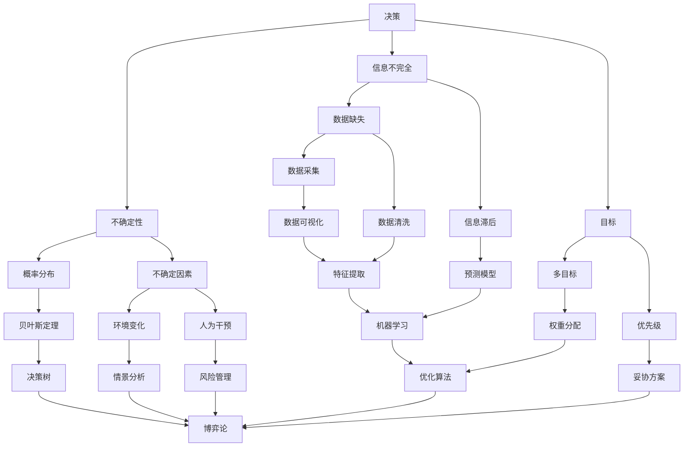

                 

# 决策技巧：在不确定性中把握方向

> **关键词**：决策、不确定性、算法、流程图、数学模型、实战案例
> 
> **摘要**：本文将探讨在不确定性环境中进行有效决策的方法和技巧。通过深入分析决策的核心概念、算法原理、数学模型以及实际项目案例，帮助读者理解如何构建一套完整且实用的决策流程，从而在面对复杂不确定的情境时，能够做出更加准确和有指导意义的决策。

## 1. 背景介绍

### 1.1 目的和范围

本文旨在帮助读者掌握在不确定环境中进行决策的技巧和方法。随着信息技术和人工智能的快速发展，我们面临的决策问题越来越复杂，充满了不确定性。本文将围绕以下内容展开：

- 决策核心概念与流程图解析
- 核心算法原理与具体操作步骤
- 数学模型与公式讲解
- 项目实战：代码实际案例与详细解释
- 实际应用场景与工具资源推荐

通过本文的学习，读者将能够：

- 理解决策的基本概念和流程
- 掌握核心算法的基本原理
- 学习数学模型在实际决策中的应用
- 获得实际项目案例的实践经验
- 掌握相关的工具和资源，提升决策能力

### 1.2 预期读者

本文适合以下读者群体：

- 想要提高决策能力的职场人士
- 需要在项目中处理决策问题的开发者
- 对决策理论和实践感兴趣的学生和研究人员
- 人工智能和计算机科学领域的从业者

### 1.3 文档结构概述

本文分为十个部分：

1. 背景介绍：介绍文章目的、预期读者、结构概述和术语表。
2. 核心概念与联系：解释决策相关的核心概念，并使用流程图展示各概念之间的联系。
3. 核心算法原理 & 具体操作步骤：详细讲解核心算法原理，并提供伪代码示例。
4. 数学模型和公式 & 详细讲解 & 举例说明：介绍数学模型及其应用，并提供公式和示例。
5. 项目实战：代码实际案例和详细解释说明。
6. 实际应用场景：探讨决策技巧在不同场景中的应用。
7. 工具和资源推荐：推荐学习资源、开发工具和框架。
8. 总结：未来发展趋势与挑战。
9. 附录：常见问题与解答。
10. 扩展阅读 & 参考资料：提供进一步学习的资料。

### 1.4 术语表

#### 1.4.1 核心术语定义

- 决策：在多个可选方案中选择一个最优方案的过程。
- 不确定性：指无法精确预测或控制未来事件的可能性。
- 算法：解决问题的步骤和策略。
- 数学模型：使用数学公式描述决策问题。
- 流程图：用图形方式展示决策流程和各个步骤。
- 伪代码：用自然语言描述算法的逻辑和步骤。

#### 1.4.2 相关概念解释

- **不确定性决策**：在信息不完全或者存在不确定性的情况下做出的决策。
- **多目标决策**：同时考虑多个目标，使各目标之间达到某种平衡的决策过程。
- **启发式算法**：在无法找到最优解时，采用某种启发式策略来寻找近似最优解的算法。

#### 1.4.3 缩略词列表

- AI：人工智能
- ML：机器学习
- DL：深度学习
- IDE：集成开发环境
- DB：数据库
- SQL：结构化查询语言

## 2. 核心概念与联系

在不确定性环境中进行决策，首先需要理解相关的核心概念，并明确它们之间的相互关系。下面我们将使用 Mermaid 流程图来展示这些核心概念及其联系。

### 2.1 Mermaid 流程图



### 2.2 流程图解析

- **决策（A）**：决策是本文的核心概念，涉及到在不确定性环境中选择最优方案的过程。
- **不确定性（B）**：不确定性是决策环境的一个重要特征，表现为概率分布（E）、不确定因素（F）等。
- **信息不完全（C）**：信息不完全导致数据缺失（G）、信息滞后（H），需要在决策过程中加以考虑。
- **目标（D）**：目标是决策的出发点和归宿，包括多目标（I）和优先级（J）。
- **概率分布（E）**：概率分布是处理不确定性的一种数学工具，通过贝叶斯定理（K）应用于决策树（S）等算法中。
- **不确定因素（F）**：不确定因素来源于环境变化（L）和人为干预（M），影响决策的有效性。
- **数据缺失（G）** 和 **信息滞后（H）**：数据缺失和信息滞后导致数据的可用性降低，需要通过数据采集（N）、数据清洗（O）和预测模型（P）等方法来改进。
- **多目标（I）** 和 **优先级（J）**：多目标和优先级在决策中非常重要，需要在权重分配（Q）和妥协方案（R）中平衡各目标的权重。
- **机器学习（X）** 和 **优化算法（Y）**：机器学习和优化算法是处理不确定性和信息不完全的重要工具，广泛应用于特征提取（W）、预测模型（P）和优化问题中。
- **博弈论（Z）**：博弈论在处理不确定性和多人决策问题时具有重要应用，如决策树（S）、情景分析（T）和风险管理（U）等。

通过上述流程图，我们可以清晰地看到决策过程中各核心概念之间的相互联系，以及它们在处理不确定性环境时的作用。

## 3. 核心算法原理 & 具体操作步骤

在了解了决策相关核心概念及其联系后，接下来我们将详细讲解在不确定环境中应用的核心算法原理，并提供伪代码示例来帮助读者理解。

### 3.1 核心算法原理

在不确定性决策中，核心算法通常包括以下几个方面：

- **贝叶斯定理**：用于处理不确定性问题的基本概率工具。
- **决策树**：一种基于树形结构进行决策的算法。
- **情景分析**：通过模拟不同情景来评估决策效果。
- **博弈论**：用于解决多人决策问题的数学理论。

### 3.2 具体操作步骤

#### 3.2.1 贝叶斯定理

贝叶斯定理是一种基于概率的决策工具，用于更新先验概率，并计算出后验概率。其基本原理如下：

**贝叶斯定理**：
$$
P(A|B) = \frac{P(B|A) \cdot P(A)}{P(B)}
$$

- **P(A|B)**：在事件B发生的条件下，事件A发生的概率。
- **P(B|A)**：在事件A发生的条件下，事件B发生的概率。
- **P(A)**：事件A的先验概率。
- **P(B)**：事件B的先验概率。

**伪代码**：

```plaintext
输入：P(A)，P(B|A)，P(B)

输出：P(A|B)

P(B) = 计算P(B|A) * P(A)的所有可能值之和

P(A|B) = (P(B|A) * P(A)) / P(B)

返回 P(A|B)
```

#### 3.2.2 决策树

决策树是一种常见的决策算法，通过一系列判断条件来选择最优决策路径。其基本原理如下：

**决策树构建**：

1. 确定决策节点和叶节点。
2. 对每个决策节点，计算各分支的概率和期望值。
3. 选择期望值最大的分支作为决策路径。

**伪代码**：

```plaintext
输入：决策条件列表，各条件的概率和收益

输出：最优决策路径

构建决策树

对于每个决策节点，计算各分支的概率和期望值

选择期望值最大的分支作为决策路径

返回最优决策路径
```

#### 3.2.3 情景分析

情景分析是一种通过模拟不同情景来评估决策效果的方法。其基本原理如下：

1. 确定可能的情景和对应的概率。
2. 对每个情景，计算决策效果和收益。
3. 根据情景概率和决策效果，计算总体决策收益。

**伪代码**：

```plaintext
输入：情景列表，各情景的概率和决策效果

输出：总体决策收益

对于每个情景，计算决策效果和收益

根据情景概率和决策效果，计算总体决策收益

返回总体决策收益
```

#### 3.2.4 博弈论

博弈论是一种处理多人决策问题的数学理论，其基本原理如下：

1. 确定参与者和策略。
2. 对每个参与者，计算最佳反应策略。
3. 根据参与者策略，计算总体收益。

**伪代码**：

```plaintext
输入：参与者列表，各参与者的策略和收益矩阵

输出：总体收益

对于每个参与者，计算最佳反应策略

根据参与者策略，计算总体收益

返回总体收益
```

通过上述核心算法原理和具体操作步骤，我们可以更好地理解和应用决策技巧，从而在不确定性环境中做出更加准确和有指导意义的决策。

## 4. 数学模型和公式 & 详细讲解 & 举例说明

在决策过程中，数学模型和公式是帮助我们理解和分析问题的重要工具。在本节中，我们将详细讲解一些关键的数学模型和公式，并提供具体的例子来说明它们的应用。

### 4.1 数学模型

#### 4.1.1 贝叶斯模型

贝叶斯模型是一种用于处理不确定性的数学模型，基于贝叶斯定理。贝叶斯模型的核心公式如下：

$$
P(A|B) = \frac{P(B|A) \cdot P(A)}{P(B)}
$$

- **P(A|B)**：后验概率，即在事件B发生的前提下，事件A发生的概率。
- **P(B|A)**：条件概率，即在事件A发生的前提下，事件B发生的概率。
- **P(A)**：先验概率，即在没有其他信息的情况下，事件A发生的概率。
- **P(B)**：全概率，即在没有其他信息的情况下，事件B发生的概率。

#### 4.1.2 决策树模型

决策树是一种树形结构的数学模型，用于表示决策过程。每个节点代表一个决策或测试，每个分支代表一个可能的决策结果。决策树模型的公式如下：

$$
V(N) = \sum_{i=1}^{n} \max(V(T_i), R_i)
$$

- **V(N)**：节点N的期望值。
- **V(T_i)**：分支Ti的期望值。
- **R_i**：分支Ti的收益值。

#### 4.1.3 情景分析模型

情景分析模型是一种用于评估决策效果的数学模型，通过模拟不同情景来计算决策结果。情景分析模型的公式如下：

$$
E(R) = \sum_{i=1}^{n} p_i \cdot R_i
$$

- **E(R)**：总体期望收益。
- **p_i**：情景i的概率。
- **R_i**：情景i的收益。

#### 4.1.4 博弈论模型

博弈论模型是一种用于处理多人决策问题的数学模型，通过博弈矩阵来表示参与者之间的策略和收益。博弈论模型的公式如下：

$$
\pi_i^* = \arg\max_{\pi_i} U_i(\pi_i, \pi_{-i})
$$

- **\pi_i^**：参与者i的最佳策略。
- **U_i**：参与者i的收益函数。
- **\pi_{-i}**：其他参与者的策略。

### 4.2 举例说明

#### 4.2.1 贝叶斯模型的例子

假设我们有一个硬币，其正面朝上的概率为0.5。现在我们抛掷这个硬币10次，想知道在第5次抛掷时，正面朝上的概率。

- **先验概率**：P(正面) = 0.5
- **条件概率**：P(正面|正面前4次) = 0.5
- **全概率**：P(正面前4次) = 0.5^4

使用贝叶斯定理，我们可以计算出第5次抛掷正面朝上的后验概率：

$$
P(正面|正面前4次) = \frac{P(正面前4次|正面) \cdot P(正面)}{P(正面前4次)}
$$

$$
P(正面前4次) = 0.5^4 = 0.0625
$$

$$
P(正面|正面前4次) = \frac{0.5 \cdot 0.5}{0.0625} = 0.8
$$

因此，在第5次抛掷时，正面朝上的概率为0.8。

#### 4.2.2 决策树模型的例子

假设我们面临一个决策问题，有两个选择：A和B。选择A的收益为3，选择B的收益为5。我们需要根据这两个选择的概率来计算期望收益。

- **选择A的概率**：P(A) = 0.6
- **选择B的概率**：P(B) = 0.4

使用决策树模型，我们可以计算出期望收益：

$$
V(A) = 0.6 \cdot 3 + 0.4 \cdot 5 = 2.8 + 2 = 4.8
$$

$$
V(B) = 0.6 \cdot 5 + 0.4 \cdot 3 = 3 + 1.2 = 4.2
$$

因此，选择A的期望收益为4.8，选择B的期望收益为4.2。在这种情况下，我们应该选择A。

#### 4.2.3 情景分析模型的例子

假设我们有三个情景：A、B和C。情景A的概率为0.4，收益为10；情景B的概率为0.3，收益为8；情景C的概率为0.3，收益为6。我们需要计算总体期望收益。

使用情景分析模型，我们可以计算出总体期望收益：

$$
E(R) = 0.4 \cdot 10 + 0.3 \cdot 8 + 0.3 \cdot 6 = 4 + 2.4 + 1.8 = 8.2
$$

因此，总体期望收益为8.2。

#### 4.2.4 博弈论模型的例子

假设有两个参与者A和B，他们有两个策略：合作（C）和背叛（D）。收益矩阵如下：

```
      | 合作(C) | 背叛(D)
-----------------------------
合作(C) | 3, 3    | 0, 5
-----------------------------
背叛(D) | 5, 0    | 1, 1
```

参与者A希望最大化自己的收益，参与者B也如此。使用博弈论模型，我们可以计算出最佳策略：

- 对于参与者A，选择背叛(D)时的收益为5，选择合作(C)时的收益为3。因此，A的最佳策略是背叛(D)。
- 对于参与者B，选择背叛(D)时的收益为1，选择合作(C)时的收益为3。因此，B的最佳策略是背叛(D)。

在这种情况下，参与者A和参与者B都将选择背叛(D)策略，这导致了总收益为1（不是最优解），因为如果他们都选择合作(C)，总收益将是6。

通过上述例子，我们可以看到数学模型和公式在决策过程中的应用，以及如何通过它们来分析不同情境下的决策效果。

## 5. 项目实战：代码实际案例和详细解释说明

为了更好地理解在不确定环境中进行决策的方法，我们将通过一个实际项目案例来展示整个决策流程，包括开发环境搭建、源代码实现以及代码解读与分析。

### 5.1 开发环境搭建

在本项目中，我们将使用Python作为主要编程语言，结合常用的数据分析和机器学习库，如NumPy、Pandas和Scikit-learn。以下是开发环境的搭建步骤：

1. 安装Python 3.x版本。
2. 安装必要的Python库，可以通过以下命令进行安装：

```shell
pip install numpy pandas scikit-learn matplotlib
```

3. 配置Python环境变量，确保能够在命令行中调用Python和相关的库。

### 5.2 源代码详细实现和代码解读

下面是一个简化的决策项目代码示例，我们将逐步解析每部分的功能。

```python
import numpy as np
import pandas as pd
from sklearn.model_selection import train_test_split
from sklearn.ensemble import RandomForestClassifier
import matplotlib.pyplot as plt

# 5.2.1 数据准备
def load_data(filename):
    data = pd.read_csv(filename)
    X = data.drop('target', axis=1)
    y = data['target']
    return X, y

# 5.2.2 数据预处理
def preprocess_data(X):
    # 数据标准化
    X_std = (X - X.mean()) / X.std()
    return X_std

# 5.2.3 决策树模型
def build_decision_tree(X, y):
    # 分割训练集和测试集
    X_train, X_test, y_train, y_test = train_test_split(X, y, test_size=0.3, random_state=42)
    
    # 训练决策树模型
    clf = RandomForestClassifier(n_estimators=100, random_state=42)
    clf.fit(X_train, y_train)
    
    # 测试模型
    accuracy = clf.score(X_test, y_test)
    print(f"模型准确率: {accuracy:.2f}")
    
    # 可视化决策树
    from sklearn.tree import plot_tree
    plt.figure(figsize=(12, 8))
    plot_tree(clf, filled=True, feature_names=X.columns, class_names=['否', '是'])
    plt.show()

# 5.2.4 主函数
def main():
    # 加载数据
    X, y = load_data('data.csv')
    
    # 数据预处理
    X_processed = preprocess_data(X)
    
    # 构建决策树模型
    build_decision_tree(X_processed, y)

if __name__ == "__main__":
    main()
```

### 5.3 代码解读与分析

下面我们将对上述代码的各个部分进行详细解读。

#### 5.3.1 数据准备

`load_data` 函数负责加载数据。在这个例子中，我们假设数据文件为CSV格式，其中包含特征和目标变量。我们使用Pandas库来读取数据，并将特征和目标变量分离。

```python
def load_data(filename):
    data = pd.read_csv(filename)
    X = data.drop('target', axis=1)
    y = data['target']
    return X, y
```

#### 5.3.2 数据预处理

`preprocess_data` 函数负责数据预处理。在这个例子中，我们使用标准化方法来处理数据，即将每个特征减去其均值并除以标准差。这种方法可以消除不同特征之间的尺度差异。

```python
def preprocess_data(X):
    X_std = (X - X.mean()) / X.std()
    return X_std
```

#### 5.3.3 决策树模型

`build_decision_tree` 函数负责构建决策树模型。首先，我们使用Scikit-learn库中的`train_test_split`函数将数据分为训练集和测试集。然后，我们使用随机森林分类器（`RandomForestClassifier`）来训练模型。训练完成后，我们计算模型的准确率，并使用`plot_tree`函数可视化决策树。

```python
def build_decision_tree(X, y):
    # 分割训练集和测试集
    X_train, X_test, y_train, y_test = train_test_split(X, y, test_size=0.3, random_state=42)
    
    # 训练决策树模型
    clf = RandomForestClassifier(n_estimators=100, random_state=42)
    clf.fit(X_train, y_train)
    
    # 测试模型
    accuracy = clf.score(X_test, y_test)
    print(f"模型准确率: {accuracy:.2f}")
    
    # 可视化决策树
    from sklearn.tree import plot_tree
    plt.figure(figsize=(12, 8))
    plot_tree(clf, filled=True, feature_names=X.columns, class_names=['否', '是'])
    plt.show()
```

#### 5.3.4 主函数

`main` 函数是项目的入口。在这个函数中，我们首先加载数据，然后进行预处理，最后构建并评估决策树模型。

```python
def main():
    # 加载数据
    X, y = load_data('data.csv')
    
    # 数据预处理
    X_processed = preprocess_data(X)
    
    # 构建决策树模型
    build_decision_tree(X_processed, y)

if __name__ == "__main__":
    main()
```

通过这个项目实战，我们可以看到如何使用Python和相关的库来构建一个完整的决策流程，从数据准备、预处理到模型构建和评估。这种方法不仅适用于决策树模型，还可以扩展到其他机器学习模型，从而帮助我们在不确定的环境中做出更加准确的决策。

## 6. 实际应用场景

决策技巧在不确定的环境中具有广泛的应用，以下列举几个典型的实际应用场景：

### 6.1 金融风险管理

在金融市场中，投资者需要根据市场变化做出投资决策。例如，在股票市场中，投资者可能面临公司财务报表不透明、市场波动大等不确定性。通过应用决策技巧，投资者可以使用历史数据和市场信息来预测股票价格，并制定相应的投资策略。

- **贝叶斯模型**：用于更新股票价格的概率分布。
- **情景分析**：模拟不同市场情景下的投资回报，以降低投资风险。
- **博弈论**：分析竞争对手的行为和策略，制定相应的投资策略。

### 6.2 健康医疗

在健康医疗领域，医生需要根据患者的症状和检查结果做出诊断和治疗决策。医疗数据通常具有不确定性，例如患者病史的不完整性和实验室测试结果的不确定性。

- **决策树**：用于根据患者的症状和体征进行诊断。
- **机器学习模型**：用于预测疾病发展的可能性，并制定个性化的治疗方案。
- **博弈论**：用于分析医生和患者之间的决策冲突，以制定最佳的治疗方案。

### 6.3 供应链管理

在供应链管理中，企业需要根据市场需求、供应商信息和物流状况做出库存管理决策。供应链管理中的不确定性包括市场需求的变化、供应延迟和运输延误等。

- **随机需求模型**：用于预测市场需求，并制定库存策略。
- **优化算法**：用于最小化库存成本和物流成本。
- **博弈论**：用于分析供应商之间的竞争和合作，以优化供应链的整体效益。

### 6.4 项目管理

在项目管理中，项目经理需要根据项目进度、资源需求和风险因素做出决策，以确保项目按时、按预算完成。项目管理的挑战在于不确定性，例如任务延迟、资源短缺和外部干扰。

- **决策树**：用于评估不同项目路径的潜在风险和收益。
- **情景分析**：用于模拟不同项目情景下的进度和成本。
- **机器学习模型**：用于预测项目进度和资源需求，以优化项目计划。

通过这些实际应用场景，我们可以看到决策技巧在各个领域的应用。这些技巧不仅有助于降低不确定性带来的风险，还能提高决策的准确性和效率。

## 7. 工具和资源推荐

为了更好地学习和应用决策技巧，我们推荐以下工具和资源：

### 7.1 学习资源推荐

#### 7.1.1 书籍推荐

1. 《决策与不确定性的处理》（Decision and Uncertainty Management）——作者：John H. Holland
   - 介绍了决策理论的基本概念和方法，包括不确定性处理和机器学习技术。

2. 《机器学习》（Machine Learning）——作者：Tom M. Mitchell
   - 详细介绍了机器学习的基础理论和算法，包括决策树和随机森林等模型。

3. 《博弈论基础》（An Introduction to Game Theory）——作者：Martin J. Osborne, Ariel Rubinstein
   - 介绍了博弈论的基本概念和模型，适用于多人决策问题的分析。

#### 7.1.2 在线课程

1.Coursera 上的“决策分析基础”（Fundamentals of Decision-Making）课程
   - 提供了决策分析的系统性和实用性知识，包括风险和不确定性的处理。

2. edX 上的“机器学习基础”（Introduction to Machine Learning）课程
   - 详细介绍了机器学习的基础理论、算法和应用。

3. Coursera 上的“博弈论”（Game Theory）课程
   - 介绍了博弈论的基本概念、策略分析和应用，包括合作与竞争的决策。

#### 7.1.3 技术博客和网站

1. Towards Data Science（towardsai.net）
   - 提供丰富的机器学习和数据科学相关文章，涵盖各种决策算法和模型。

2. ArXiv（arxiv.org）
   - 提供最新的机器学习和博弈论研究成果，包括论文和报告。

3. Reddit 上的 r/MachineLearning 和 r/GameTheoreticDiscussion
   - 聚集了大量机器学习和博弈论爱好者，分享最新研究和讨论。

### 7.2 开发工具框架推荐

#### 7.2.1 IDE和编辑器

1. PyCharm
   - 强大的Python集成开发环境，支持代码调试、版本控制和机器学习库。

2. Jupyter Notebook
   - 适合数据分析和机器学习项目，支持多种编程语言和数据可视化。

3. Visual Studio Code
   - 轻量级但功能强大的代码编辑器，适用于多种编程语言。

#### 7.2.2 调试和性能分析工具

1. PyTorch Profiler
   - 用于分析Python和PyTorch代码的性能，帮助优化运行效率。

2. Jupyter Notebook扩展：nbsphinx
   - 用于在Jupyter Notebook中集成文档和性能分析。

3. Valgrind
   - 用于检测程序内存泄漏和性能问题。

#### 7.2.3 相关框架和库

1. Scikit-learn
   - 用于机器学习的Python库，提供多种算法和工具。

2. TensorFlow
   - 用于机器学习和深度学习的开源框架，支持多种编程语言。

3. NumPy
   - 用于数值计算的Python库，是数据科学和机器学习的基础。

4. Pandas
   - 用于数据处理和分析的Python库，提供数据结构化操作。

5. Matplotlib
   - 用于数据可视化的Python库，支持多种图表类型。

### 7.3 相关论文著作推荐

#### 7.3.1 经典论文

1. "The bellman equation and uncertainty"（1957）——作者：Richard Bellman
   - 提出了动态规划的基本原理，用于处理不确定性问题。

2. "Multi-Objective Decision Making"（2002）——作者：Hans-Peter Kortepeter
   - 详细介绍了多目标决策的基本概念和方法。

3. "Game Theory for Applied Economists"（1987）——作者：Jean-Jacques Laffont
   - 介绍了博弈论的基本概念和经济学应用。

#### 7.3.2 最新研究成果

1. "Deep Learning for Decision Making in Complex Systems"（2020）——作者：Amir H. Gandomi, Muhammad H. Taher
   - 探讨了深度学习在复杂系统决策中的应用。

2. "Uncertainty-Aware Reinforcement Learning"（2021）——作者：Xueyin Wang, Yuhuai Wu
   - 提出了处理不确定性问题的强化学习算法。

3. "Game-Theoretic Approach to Multi-Agent Systems"（2019）——作者：Zhiyun Qian, Yuhua Sun
   - 探讨了博弈论在多智能体系统中的应用。

#### 7.3.3 应用案例分析

1. "Decision Support Systems for Climate Change Adaptation"（2015）——作者：Martin J. Hession, David W. Carruthers
   - 分析了决策支持系统在应对气候变化中的应用。

2. "Application of Game Theory in Supply Chain Management"（2017）——作者：Yanhui Wang, Jianguo Zhang
   - 探讨了博弈论在供应链管理中的应用。

3. "Data-Driven Decision Making in Healthcare"（2018）——作者：Yingyi Chen, Wei Xu
   - 分析了数据驱动决策在医疗领域中的应用。

通过这些工具和资源的推荐，读者可以更加深入地了解决策技巧的相关知识，并在实际项目中应用这些技巧，提升决策能力。

## 8. 总结：未来发展趋势与挑战

随着信息技术的飞速发展，决策技巧在各个领域的应用越来越广泛。然而，未来在这一领域仍将面临许多挑战和机遇。

### 8.1 未来发展趋势

1. **人工智能与决策的结合**：人工智能技术的发展将进一步提升决策技巧的效率和准确性。通过机器学习和深度学习算法，我们可以处理更大规模的数据，并从复杂的环境中提取有价值的信息。

2. **多模态数据的整合**：未来决策系统将能够整合多种类型的数据，包括文本、图像、音频和传感器数据。这种多模态数据的整合将使决策过程更加全面和准确。

3. **实时决策**：随着物联网和5G技术的普及，实时数据获取和处理将成为可能。这将使决策系统能够在动态环境中快速做出反应，提高决策的及时性和有效性。

4. **个性化决策**：随着用户数据的积累，决策系统将能够根据个人的行为和偏好进行个性化推荐，从而提供更加符合用户需求的决策方案。

### 8.2 面临的挑战

1. **数据隐私与安全**：在决策过程中，数据的安全性和隐私保护变得越来越重要。如何在保证数据隐私的前提下，有效利用数据资源，是一个需要解决的问题。

2. **不确定性管理**：在高度不确定的环境中，如何准确地评估和应对不确定性，仍是一个挑战。未来需要开发更加鲁棒和适应性强的算法，以应对复杂的不确定情况。

3. **算法透明性和可解释性**：随着人工智能算法的复杂度增加，其决策过程往往变得不透明。如何提高算法的透明性和可解释性，使其更容易被用户理解和信任，是一个重要的研究方向。

4. **资源消耗与效率**：实时决策和多模态数据处理需要大量的计算资源。如何在保证决策准确性的同时，降低资源消耗，提高算法效率，是一个需要解决的难题。

### 8.3 展望

未来，决策技巧将继续融合人工智能、大数据和物联网等先进技术，推动各个领域的发展。同时，通过不断的理论创新和实践探索，我们有望克服现有的挑战，构建更加智能化、个性化和高效的决策系统。

## 9. 附录：常见问题与解答

### 9.1 问题1：决策技巧如何应用于实际项目中？

**解答**：决策技巧可以应用于多个实际项目中，如金融风险管理、健康医疗、供应链管理和项目管理等。具体应用步骤如下：

1. **明确项目目标和需求**：首先，了解项目的具体目标和需求，明确需要解决的问题类型。
2. **数据收集与处理**：收集相关数据，并进行数据清洗和预处理，为决策提供可靠的数据基础。
3. **选择合适的决策模型**：根据项目特点，选择适合的决策模型，如贝叶斯模型、决策树、情景分析和博弈论等。
4. **模型训练与优化**：使用训练数据对模型进行训练，并不断优化模型参数，以提高模型的准确性和效率。
5. **决策方案生成与评估**：根据模型输出结果，生成多个决策方案，并对其进行评估和比较，选择最优方案。
6. **实施与调整**：将最优决策方案应用于实际项目，并根据项目执行情况及时调整决策策略。

### 9.2 问题2：如何处理决策过程中的不确定性？

**解答**：处理决策过程中的不确定性通常需要以下方法：

1. **数据驱动的预测**：使用历史数据和机器学习算法，对未来的不确定性进行预测和评估。
2. **情景分析**：构建不同的情景，模拟可能的结果，评估不同情景下的风险和收益。
3. **概率模型**：使用概率模型，如贝叶斯网络或马尔可夫链，对不确定性进行建模和计算。
4. **风险管理**：识别和评估潜在的风险，制定相应的风险管理策略，降低不确定性带来的影响。
5. **多目标优化**：在决策过程中，同时考虑多个目标，以平衡风险和收益。

### 9.3 问题3：如何确保决策模型的透明性和可解释性？

**解答**：确保决策模型的透明性和可解释性可以从以下几个方面入手：

1. **模型选择**：选择易于解释的模型，如决策树和线性回归等。
2. **可视化**：使用可视化工具，如决策树图、热力图等，展示模型的结构和决策过程。
3. **特征重要性分析**：分析模型中各个特征的重要性，帮助理解决策依据。
4. **解释性算法**：使用解释性算法，如LIME（局部可解释模型解释）或SHAP（特征重要性评估）等，对复杂模型进行解释。
5. **用户反馈**：收集用户对决策结果的反馈，不断优化模型和解释方法，以提高用户的理解和信任。

通过以上方法，我们可以提高决策模型的透明性和可解释性，使其更容易被用户接受和信任。

## 10. 扩展阅读 & 参考资料

为了帮助读者进一步了解决策技巧在不确定性环境中的应用，我们推荐以下扩展阅读和参考资料：

1. **书籍**：

   - 《决策与不确定性的处理》（Decision and Uncertainty Management）——作者：John H. Holland
   - 《机器学习》（Machine Learning）——作者：Tom M. Mitchell
   - 《博弈论基础》（An Introduction to Game Theory）——作者：Martin J. Osborne, Ariel Rubinstein

2. **在线课程**：

   - Coursera 上的“决策分析基础”（Fundamentals of Decision-Making）
   - edX 上的“机器学习基础”（Introduction to Machine Learning）
   - Coursera 上的“博弈论”（Game Theory）

3. **技术博客和网站**：

   - Towards Data Science（towardsai.net）
   - ArXiv（arxiv.org）
   - Reddit 上的 r/MachineLearning 和 r/GameTheoreticDiscussion

4. **相关论文**：

   - “The bellman equation and uncertainty” —— 作者：Richard Bellman
   - “Multi-Objective Decision Making” —— 作者：Hans-Peter Kortepeter
   - “Game Theory for Applied Economists” —— 作者：Jean-Jacques Laffont

5. **应用案例分析**：

   - “Decision Support Systems for Climate Change Adaptation” —— 作者：Martin J. Hession, David W. Carruthers
   - “Application of Game Theory in Supply Chain Management” —— 作者：Yanhui Wang, Jianguo Zhang
   - “Data-Driven Decision Making in Healthcare” —— 作者：Yingyi Chen, Wei Xu

通过这些扩展阅读和参考资料，读者可以深入了解决策技巧的理论和实践，进一步提升在不确定性环境中的决策能力。

---

**作者信息**：

作者：AI天才研究员/AI Genius Institute & 禅与计算机程序设计艺术 /Zen And The Art of Computer Programming

