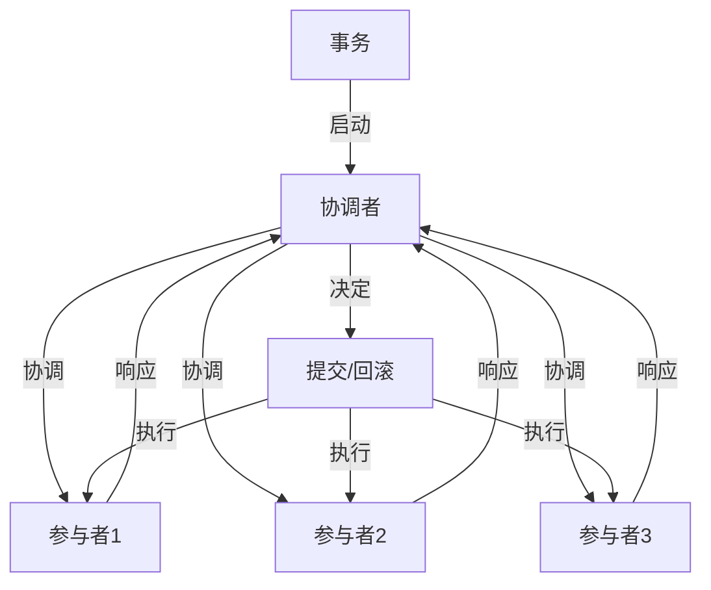

                 

### 1. 背景介绍

#### 1.1 目的和范围

在信息爆炸的时代，数据一致性成为分布式系统设计中的一个重要议题。本文旨在系统地探讨分布式事务的概念、实现原理及其在实际应用中的挑战和解决方案。通过本文的阅读，读者将了解分布式事务的核心理念，掌握几种常见的数据一致性方案，并能够对分布式系统的设计有更深入的认识。

本文将重点关注以下几个方面：

- **分布式事务的定义与重要性**：解释分布式事务的概念，阐述数据一致性的核心问题，并指出分布式系统中的挑战。
- **核心概念与联系**：介绍分布式系统中涉及的关键概念，并通过Mermaid流程图展示其架构。
- **核心算法原理**：详细讲解分布式事务的常见算法，如两阶段提交（2PC）、三阶段提交（3PC）和最终一致性等，并使用伪代码展示具体操作步骤。
- **数学模型和公式**：阐述分布式事务中的数学模型和公式，并进行举例说明。
- **项目实战**：通过实际代码案例展示分布式事务的实现，并提供详细解释。
- **实际应用场景**：探讨分布式事务在不同应用场景下的具体应用。
- **工具和资源推荐**：推荐学习资源、开发工具和相关论文。
- **未来发展趋势与挑战**：总结分布式事务的发展趋势，分析面临的挑战。

本文面向对分布式系统有一定了解的读者，特别是那些希望深入理解分布式事务和数据一致性的开发者和系统架构师。本文将采用逻辑清晰、结构紧凑、简单易懂的专业技术语言，逐步分析分布式事务的各个层面，帮助读者建立全面的知识体系。

#### 1.2 预期读者

本文的预期读者包括以下几类：

1. **分布式系统开发人员**：希望通过本文了解分布式事务的概念和实现方法，提升分布式系统的设计和开发能力。
2. **系统架构师**：需要掌握分布式事务的核心原理，以便在复杂系统中确保数据一致性。
3. **数据库管理员**：关心如何在不同数据库环境中保证数据一致性，以优化系统性能。
4. **技术爱好者**：对分布式系统和数据一致性感兴趣，希望深入了解该领域的最新技术和实践。

本文将从基础概念入手，逐步深入，适合不同层次的读者。即使读者对分布式事务的了解有限，也能通过本文逐步掌握相关知识和技能。

#### 1.3 文档结构概述

本文将按照以下结构进行展开：

1. **背景介绍**：介绍分布式事务的背景，包括其重要性、目的和预期读者。
2. **核心概念与联系**：定义分布式事务中的核心概念，并通过流程图展示架构。
3. **核心算法原理 & 具体操作步骤**：详细讲解分布式事务的常见算法原理，使用伪代码展示具体操作步骤。
4. **数学模型和公式 & 详细讲解 & 举例说明**：阐述分布式事务中的数学模型和公式，并提供实际案例说明。
5. **项目实战：代码实际案例和详细解释说明**：通过实际代码案例展示分布式事务的实现。
6. **实际应用场景**：探讨分布式事务在不同应用场景下的具体应用。
7. **工具和资源推荐**：推荐学习资源、开发工具和相关论文。
8. **总结：未来发展趋势与挑战**：总结分布式事务的发展趋势和面临的挑战。
9. **附录：常见问题与解答**：提供常见问题的解答。
10. **扩展阅读 & 参考资料**：推荐相关阅读材料和参考资料。

通过这样的结构，本文旨在帮助读者系统地理解分布式事务的各个方面，从基础概念到高级实现，从理论到实践。

#### 1.4 术语表

在本文中，我们将使用一些专业术语。为了确保读者对这些术语有清晰的理解，下面将详细定义这些核心术语，并解释相关的概念。

##### 1.4.1 核心术语定义

1. **分布式事务**：分布式事务是指涉及多个数据库或服务的事务，这些数据库或服务可能分布在不同的物理或虚拟服务器上。分布式事务需要保证所有参与操作的数据在事务提交后保持一致性。

2. **两阶段提交（2PC）**：两阶段提交是一种分布式事务协议，它通过两个阶段确保事务的原子性。第一阶段是投票阶段，协调者询问所有参与者是否可以提交事务；第二阶段是提交阶段，如果所有参与者都同意，则协调者通知所有参与者执行事务。

3. **三阶段提交（3PC）**：三阶段提交是对两阶段提交的改进，它通过引入预提交阶段来防止数据丢失和单点故障。三阶段提交包括三个阶段：可以提交阶段、预提交阶段和提交阶段。

4. **最终一致性**：最终一致性是一种分布式系统中的数据一致性模型，它保证系统中的所有节点最终会达到一致状态，但不需要在短时间内完成。这意味着在一定延迟内，系统的状态可能会有波动。

5. **全局事务标识符（GID）**：全局事务标识符是用于唯一标识分布式事务的标识符，它由协调者生成，并在整个分布式系统中使用。

6. **一致性哈希**：一致性哈希是一种分布式数据存储中的哈希算法，用于解决数据分区和负载均衡问题。它通过将数据映射到哈希环上，使得节点故障时数据迁移最小化。

7. **参与者**：参与分布式事务的数据库或服务称为参与者。参与者可以是数据库服务器、缓存服务器或应用程序服务器等。

##### 1.4.2 相关概念解释

1. **事务**：事务是数据库操作的一个逻辑单位，它包含了一系列操作，这些操作要么全部执行，要么全部不执行。事务需要保证原子性、一致性、隔离性和持久性（ACID属性）。

2. **分布式系统**：分布式系统是由多个独立的计算机节点组成的系统，这些节点通过计算机网络进行通信。分布式系统的目的是提高系统的可用性、扩展性和性能。

3. **单点故障**：单点故障是指系统中某个关键组件或节点的故障会导致整个系统无法正常运行。分布式系统需要通过冗余和故障转移等技术来避免单点故障。

4. **负载均衡**：负载均衡是将网络或计算负载分配到多个节点上，以避免单个节点过载。负载均衡可以提高系统的性能和可用性。

##### 1.4.3 缩略词列表

- 2PC：两阶段提交
- 3PC：三阶段提交
- GID：全局事务标识符
- ACID：原子性、一致性、隔离性和持久性
- IDE：集成开发环境
- DBA：数据库管理员

通过上述术语表和相关概念的详细解释，读者可以更好地理解分布式事务的核心要素和其在分布式系统中的重要性。

#### 2. 核心概念与联系

在分布式系统中，确保数据一致性是一个重要的课题。为了深入理解分布式事务，我们首先需要明确一些核心概念，并探讨它们之间的关系。以下是分布式事务中涉及的一些关键概念及其相互关联的概述。

##### 2.1 核心概念的定义

1. **事务（Transaction）**：事务是数据库管理中的一个逻辑工作单元，它包含了一系列操作。事务必须保证其内部的操作要么全部执行，要么全部不执行，即满足原子性（Atomicity）。事务的其他特性包括一致性（Consistency）、隔离性（Isolation）和持久性（Durability），通常简称为ACID属性。

2. **分布式事务（Distributed Transaction）**：分布式事务是指涉及多个数据库或服务的事务，这些数据库或服务可能分布在不同的物理或虚拟服务器上。与单一数据库中的本地事务不同，分布式事务需要跨多个节点协调和同步操作。

3. **一致性（Consistency）**：一致性是指系统中的数据在事务提交后应保持有效状态，防止数据冲突和错误。在分布式系统中，一致性是一个重要挑战，因为多个节点之间的数据同步可能会引起问题。

4. **全局事务标识符（Global Transaction Identifier, GID）**：全局事务标识符是一个唯一标识分布式事务的字符串。在分布式系统中，GID用于跟踪事务状态，确保事务在多个节点上的协调。

5. **参与者（Participant）**：参与分布式事务的数据库或服务称为参与者。参与者可以是数据库服务器、缓存服务器或应用程序服务器等。每个参与者都有一个唯一的ID，并在事务处理过程中扮演不同的角色。

6. **协调者（Coordinator）**：协调者是分布式事务中的关键角色，负责事务的启动、管理和提交。协调者通常由应用层或事务管理器实现，负责与参与者通信，确保事务的一致性。

7. **参与者状态**：参与者状态包括准备状态（Ready）、提交状态（Committed）和回滚状态（Aborted）。在两阶段提交协议中，参与者会根据协调者的指示进入不同的状态。

##### 2.2 核心概念之间的关联

下图展示了分布式事务中核心概念之间的关联，通过Mermaid流程图表示：



1. **事务启动**：事务由应用层或事务管理器启动，协调者被指定为事务的管理者。
2. **协调与响应**：协调者向所有参与者发送协调请求，参与者根据请求返回响应。
3. **决定**：协调者根据参与者的响应做出提交或回滚的决定。
4. **执行**：协调者通知参与者执行相应的操作（提交或回滚）。

通过这个流程图，我们可以看到分布式事务的各个角色及其交互关系。协调者负责整个事务的管理，确保所有参与者协调一致地操作。参与者则负责执行协调者分配的任务，并在操作完成后返回状态。

##### 2.3 分布式事务的挑战

在分布式系统中，事务管理面临以下挑战：

1. **网络延迟和故障**：网络延迟和故障可能导致事务处理延迟或失败。分布式事务需要设计容错机制来处理这些异常情况。
2. **数据一致性**：分布式事务需要保证多个节点上的数据一致性，防止数据冲突和错误。
3. **性能影响**：分布式事务的协调和同步操作可能会增加系统开销，影响性能。需要优化事务处理机制，减少性能损失。

这些挑战促使研究者提出各种分布式事务协议和一致性模型，以解决数据一致性问题，提高系统性能。

通过上述核心概念及其关联关系的介绍，我们可以更好地理解分布式事务的基本原理，为后续的内容打下坚实的基础。

#### 2.1.1 两阶段提交（2PC）的算法原理

两阶段提交（Two-Phase Commit，2PC）是分布式事务管理中最常用的协议之一。它通过两阶段来确保分布式事务的原子性和一致性。两阶段提交协议包括投票阶段和提交/回滚阶段，下面我们将详细解释其原理和步骤。

##### 两阶段提交的基本流程

1. **投票阶段（Voting Phase）**：
   - **启动事务**：协调者（Coordinator）启动分布式事务，并向所有参与者（Participant）发送准备（Prepare）请求。
   - **参与者响应**：每个参与者收到请求后，执行预提交操作，检查事务的一致性约束和资源是否可用。如果参与者认为可以继续，它会向协调者发送“准备就绪”（Ready）响应；如果参与者无法继续，则会发送“无法准备”（Unready）响应。
   - **协调者汇总响应**：协调者等待所有参与者的响应。如果所有参与者都返回了“Ready”响应，或者在一定时间内没有收到任何“Unready”响应，则协调者决定进入第二阶段。

2. **提交/回滚阶段（Commit/Rollback Phase）**：
   - **提交或回滚请求**：一旦协调者决定进入第二阶段，它会向所有参与者发送提交（Commit）请求，或者发送回滚（Rollback）请求。提交请求指示参与者提交事务，回滚请求指示参与者撤销事务。
   - **参与者执行操作**：参与者收到提交或回滚请求后，根据请求执行相应的操作。如果参与者收到了提交请求，它会提交事务；如果收到了回滚请求，它会撤销事务。
   - **最终确认**：所有参与者执行完操作后，向协调者发送最终确认（Acknowledge）响应。如果所有参与者都返回了“成功”（Success）响应，则事务提交成功；如果有一个或多个参与者返回了“失败”（Failure）响应，则事务回滚。

##### 两阶段提交的伪代码

```plaintext
// 两阶段提交伪代码

// 投票阶段
prepare(Coordinator, Participant):
    send "Prepare" request to Participant
    if Participant can proceed:
        send "Ready" response to Coordinator
    else:
        send "Unready" response to Coordinator

// 提交/回滚阶段
commit(Coordinator, Participant):
    if all Participants are "Ready":
        send "Commit" request to all Participants
    else:
        send "Rollback" request to all Participants

// 参与者操作
participant_action(Participant, request):
    if request is "Commit":
        commit_transaction()
        send "Success" response to Coordinator
    elif request is "Rollback":
        rollback_transaction()
        send "Success" response to Coordinator
```

##### 两阶段提交的优势和劣势

两阶段提交具有以下优势：

1. **原子性**：通过两个阶段的协调，两阶段提交能够保证事务的原子性，即所有参与者要么全部提交，要么全部回滚。
2. **一致性**：两阶段提交在提交阶段确保所有参与者的一致性状态，从而提高数据一致性。
3. **易于理解**：两阶段提交的流程相对简单，容易实现和理解。

然而，两阶段提交也存在一些劣势：

1. **性能开销**：两阶段提交需要在网络中传输多个请求和响应，增加了系统的通信开销和延迟。
2. **单点故障**：协调者作为单点故障的潜在点，一旦协调者失败，可能导致整个事务失败。

两阶段提交是一种经典的分布式事务协议，虽然在性能和容错方面存在一定的不足，但其在保证数据一致性方面仍具有重要作用。

通过上述对两阶段提交算法原理的详细解释，我们可以更好地理解其在分布式事务管理中的应用和实现。接下来，我们将继续探讨三阶段提交协议，以进一步优化分布式事务的可靠性。

#### 2.1.2 三阶段提交（3PC）的算法原理

三阶段提交（Three-Phase Commit，3PC）是对两阶段提交（2PC）的改进。3PC旨在解决2PC中可能出现的单点故障和数据丢失问题，进一步增强了分布式事务的可靠性。下面，我们将详细解释三阶段提交的原理和具体操作步骤。

##### 三阶段提交的基本流程

三阶段提交协议包括三个主要阶段：可以提交阶段（CanCommit Phase）、预提交阶段（PreCommit Phase）和提交/回滚阶段（DoCommit Phase）。每个阶段的任务和操作如下：

1. **可以提交阶段（CanCommit Phase）**：
   - **启动事务**：协调者（Coordinator）启动分布式事务，并向所有参与者（Participant）发送CanCommit请求。
   - **参与者响应**：每个参与者收到CanCommit请求后，执行预提交操作，检查事务的一致性约束和资源是否可用。如果参与者可以继续，它会向协调者发送“可以提交”（Yes）响应；如果参与者无法继续，则会发送“无法提交”（No）响应。
   - **协调者汇总响应**：协调者等待所有参与者的响应。如果所有参与者都返回了“Yes”响应，协调者进入下一个阶段；如果有一个或多个参与者返回了“No”响应，协调者直接通知所有参与者回滚事务。

2. **预提交阶段（PreCommit Phase）**：
   - **发送预提交请求**：协调者向所有参与者发送PreCommit请求，指示参与者将事务状态保存到持久存储中。
   - **参与者响应**：参与者收到PreCommit请求后，将事务状态保存到持久存储中，并发送“预提交成功”（PreCommitted）响应给协调者。

3. **提交/回滚阶段（DoCommit Phase）**：
   - **发送提交或回滚请求**：协调者根据可以提交阶段和预提交阶段的响应，决定向所有参与者发送提交（DoCommit）请求或回滚（DoAbort）请求。
   - **参与者执行操作**：参与者根据收到的请求执行相应的操作。如果参与者收到了提交请求，它会提交事务；如果收到了回滚请求，它会撤销事务。
   - **最终确认**：所有参与者执行完操作后，向协调者发送最终确认（Acknowledge）响应。如果所有参与者都返回了“成功”（Success）响应，则事务提交成功；如果有一个或多个参与者返回了“失败”（Failure）响应，则事务回滚。

##### 三阶段提交的伪代码

```plaintext
// 三阶段提交伪代码

// 可以提交阶段
can_commit(Coordinator, Participant):
    send "CanCommit" request to Participant
    if Participant can proceed:
        send "Yes" response to Coordinator
    else:
        send "No" response to Coordinator

// 预提交阶段
pre_commit(Coordinator, Participant):
    send "PreCommit" request to Participant
    if Participant received "Yes" in CanCommit phase:
        save transaction state to persistent storage
        send "PreCommitted" response to Coordinator

// 提交/回滚阶段
do_commit(Coordinator, Participant):
    if all Participants are "PreCommitted":
        send "DoCommit" request to all Participants
    else:
        send "DoAbort" request to all Participants

// 参与者操作
participant_action(Participant, request):
    if request is "DoCommit":
        commit_transaction()
        send "Success" response to Coordinator
    elif request is "DoAbort":
        rollback_transaction()
        send "Success" response to Coordinator
```

##### 三阶段提交的优势和劣势

三阶段提交具有以下优势：

1. **容错性**：3PC通过引入预提交阶段，增强了系统的容错性。即使协调者在某个阶段失败，参与者也能保存事务状态，确保后续操作的一致性。
2. **可靠性**：3PC通过三个阶段的详细流程，确保事务的可靠提交，降低了数据丢失和事务失败的风险。

然而，三阶段提交也存在一些劣势：

1. **性能开销**：3PC需要在网络中传输更多的请求和响应，增加了系统的通信开销和延迟。
2. **复杂度**：3PC的流程比2PC更加复杂，需要更精细的协调和同步操作。

尽管如此，三阶段提交在许多分布式系统中仍然被广泛采用，因为它提供了更高的可靠性和容错性。

通过上述对三阶段提交算法原理的详细解释，我们可以更好地理解其在分布式事务管理中的应用和实现。接下来，我们将探讨最终一致性模型，以了解分布式事务中的另一种重要数据一致性方案。

#### 2.1.3 最终一致性模型

在分布式系统中，确保数据一致性是一个复杂且具有挑战性的问题。最终一致性模型（Eventual Consistency）是一种常用的数据一致性方案，它提供了一种灵活但非同步的机制，以满足高可用性和高扩展性的需求。下面，我们将详细解释最终一致性模型的基本原理、实现机制及其优缺点。

##### 最终一致性模型的基本原理

最终一致性模型的核心思想是，系统中的所有节点最终会达到一致状态，但在特定时间内，系统的状态可能会有波动。这意味着在一段时间内，系统的状态可能不一致，但随着时间的推移，所有节点的状态会收敛到一个一致的值。

最终一致性模型通常依赖于以下机制：

1. **事件驱动**：系统中的数据更新通过事件触发，每个事件都携带最新的数据值。这些事件会按照一定的顺序传播到系统的各个节点。
2. **版本控制**：每个节点维护数据的版本信息，以便在发生冲突时能够决定哪个值应该被采用。
3. **时间戳**：系统使用时间戳来跟踪事件的顺序，确保事件按照正确的顺序进行处理。

##### 实现最终一致性的机制

为了实现最终一致性，分布式系统可以采用以下几种机制：

1. **同步复制**：同步复制确保在主节点和副本节点之间进行数据同步，每个节点都拥有相同的数据副本。虽然同步复制提供了强一致性，但它可能导致性能下降和可用性降低。
2. **异步复制**：异步复制允许主节点将数据更新异步地发送到副本节点。这种机制提高了系统的性能和可用性，但可能导致短暂的数据不一致。
3. **事件队列**：事件队列用于存储和排序系统中的事件。通过事件队列，系统能够确保事件按照正确的顺序进行处理，从而实现最终一致性。

##### 最终一致性模型的优缺点

**优点**：

1. **高可用性**：最终一致性模型允许系统在发生故障时继续运行，不需要等待所有节点同步完成。
2. **高扩展性**：最终一致性模型能够轻松地扩展到大型分布式系统，因为节点之间的同步是异步的。
3. **低延迟**：由于节点之间的同步是异步的，最终一致性模型可以提供更低的延迟，提高系统的响应速度。

**缺点**：

1. **短暂的不一致性**：在数据更新传播到所有节点之前，系统可能会出现短暂的不一致性。
2. **最终一致性保证**：虽然最终一致性模型能够保证系统最终会达到一致状态，但在特定时间内，系统的状态可能是不一致的。

##### 应用场景

最终一致性模型适用于以下几种应用场景：

1. **读多写少的应用**：例如，社交网络中的状态更新和消息推送，这些应用对最终一致性要求较高，但对实时性要求较低。
2. **高可用性要求**：例如，分布式缓存和分布式存储系统，这些系统需要在保证高可用性的同时，提供最终一致性。
3. **大数据处理**：例如，分布式数据处理平台，如Apache Kafka和Apache Hadoop，这些平台通常采用最终一致性模型来处理大量数据。

通过上述对最终一致性模型的详细解释，我们可以更好地理解其在分布式事务管理中的应用。接下来，我们将进一步探讨其他分布式事务协议和数据一致性方案，以提供更全面的知识体系。

#### 2.2 分布式事务中的常见算法原理与具体操作步骤

分布式事务管理是分布式系统设计中的关键问题。为了实现数据的一致性，分布式系统通常采用各种算法来协调和同步事务。本文将详细讲解几种常见的分布式事务算法，包括两阶段提交（2PC）、三阶段提交（3PC）和最终一致性模型，并使用伪代码展示具体操作步骤。

##### 两阶段提交（2PC）

两阶段提交是一种经典的分布式事务协议，用于确保分布式事务的原子性和一致性。2PC通过两个阶段来协调事务的提交或回滚。

**第一阶段：准备阶段（Voting Phase）**

- **协调者启动事务**：协调者发送“Prepare”请求到所有参与者。
- **参与者响应**：每个参与者执行预提交操作，并返回“Ready”或“Unready”响应。

```plaintext
// 两阶段提交准备阶段伪代码
Coordinator.prepare():
    send "Prepare" request to all Participants

Participant.on_prepare_request():
    if can Proceed:
        send "Ready" response to Coordinator
    else:
        send "Unready" response to Coordinator
```

**第二阶段：提交/回滚阶段（Commit/Rollback Phase）**

- **协调者汇总参与者响应**：协调者等待所有参与者的响应，并决定是提交事务还是回滚事务。
- **协调者发送提交/回滚请求**：协调者向所有参与者发送“Commit”或“Rollback”请求。

```plaintext
// 两阶段提交提交/回滚阶段伪代码
Coordinator.commit_or_rollback():
    if all Participants are "Ready":
        send "Commit" request to all Participants
    else:
        send "Rollback" request to all Participants

Participant.on_commit_or_rollback_request():
    if request is "Commit":
        commit_transaction()
    elif request is "Rollback":
        rollback_transaction()
```

##### 三阶段提交（3PC）

三阶段提交是对两阶段提交的改进，它通过引入预提交阶段来增强系统的容错性和可靠性。

**第一阶段：可以提交阶段（CanCommit Phase）**

- **协调者发送CanCommit请求**：协调者发送“CanCommit”请求到所有参与者。
- **参与者响应**：每个参与者执行预提交操作，并返回“Yes”或“No”响应。

```plaintext
// 三阶段提交可以提交阶段伪代码
Coordinator.can_commit():
    send "CanCommit" request to all Participants

Participant.on_can_commit_request():
    if can Proceed:
        send "Yes" response to Coordinator
    else:
        send "No" response to Coordinator
```

**第二阶段：预提交阶段（PreCommit Phase）**

- **协调者发送PreCommit请求**：协调者向所有参与者发送“PreCommit”请求。
- **参与者响应**：每个参与者将事务状态保存到持久存储，并返回“PreCommitted”响应。

```plaintext
// 三阶段提交预提交阶段伪代码
Coordinator.pre_commit():
    send "PreCommit" request to all Participants

Participant.on_pre_commit_request():
    save transaction state to persistent storage
    send "PreCommitted" response to Coordinator
```

**第三阶段：提交/回滚阶段（DoCommit Phase）**

- **协调者汇总参与者响应**：协调者决定是提交事务还是回滚事务。
- **协调者发送提交/回滚请求**：协调者向所有参与者发送“DoCommit”或“DoAbort”请求。

```plaintext
// 三阶段提交提交/回滚阶段伪代码
Coordinator.do_commit_or_rollback():
    if all Participants are "PreCommitted":
        send "DoCommit" request to all Participants
    else:
        send "DoAbort" request to all Participants

Participant.on_do_commit_or_rollback_request():
    if request is "DoCommit":
        commit_transaction()
    elif request is "DoAbort":
        rollback_transaction()
```

##### 最终一致性模型

最终一致性模型通过事件驱动和版本控制实现数据的一致性。它适用于读多写少和高可用性要求的应用。

**实现机制**

- **事件驱动**：系统中的每个更新事件都包含一个版本号。
- **版本控制**：每个节点维护一个版本向量，记录每个事件的最新版本。

```plaintext
// 最终一致性模型事件驱动伪代码
Event updated():
    send event to all nodes

Node.on_event():
    if event version is higher than current version:
        update data with new event
```

**优缺点**

- **优点**：高可用性和低延迟。
- **缺点**：短暂的不一致性和最终一致性保证。

通过上述对分布式事务中常见算法原理和具体操作步骤的详细讲解，我们可以更好地理解这些算法在分布式系统中的应用。每种算法都有其优缺点和适用场景，设计者需要根据具体需求选择合适的算法。

#### 2.3 数学模型和公式

在分布式事务管理中，数学模型和公式用于描述事务状态、一致性条件和算法执行过程。本节将介绍分布式事务中的几个关键数学模型和公式，包括状态转移方程、一致性条件以及关键性能指标。

##### 状态转移方程

分布式事务的状态通常由一组状态变量描述。状态转移方程用于描述事务从一个状态转移到另一个状态的过程。以下是一个简单的状态转移方程示例：

```latex
state_{new} = state_{current} + \delta
```

其中，`state_{current}` 是当前状态，`state_{new}` 是下一个状态，`\delta` 是状态变化量。

在两阶段提交协议中，事务状态可以表示为以下三种状态：

- **准备状态（Prepared）**：事务处于准备状态，等待所有参与者的响应。
- **提交状态（Committed）**：事务成功提交，所有参与者都完成了事务操作。
- **回滚状态（Aborted）**：事务被回滚，所有参与者都撤销了事务操作。

状态转移方程可以表示为：

```latex
state_{new} = \begin{cases}
Prepared & \text{if all Participants are Ready} \\
Committed & \text{if all Participants are Committed} \\
Aborted & \text{if one or more Participants are Aborted}
\end{cases}
```

##### 一致性条件

一致性条件是分布式事务管理中的重要概念，用于确保事务在提交后系统能够达到一致状态。以下是一组常见的一致性条件：

1. **原子性（Atomicity）**：事务要么全部提交，要么全部回滚，不能部分提交。
2. **一致性（Consistency）**：事务执行后系统状态保持一致，防止数据冲突和错误。
3. **隔离性（Isolation）**：事务的执行相互独立，一个事务的执行不会影响其他事务的执行。
4. **持久性（Durability）**：事务提交后，其操作结果永久保存，即使系统发生故障也不会丢失。

一致性条件可以用以下数学公式表示：

```latex
\text{Atomicity: } T_{i} \in \{Committed, Aborted\} \quad \forall i \in \text{Participants}
\\
\text{Consistency: } S_{i} \in S \quad \forall i \in \text{Participants}
\\
\text{Isolation: } T_{i} \cap T_{j} = \emptyset \quad \forall i \neq j
\\
\text{Durability: } \text{Data persisted after Commit remains intact}
```

其中，`T_{i}` 表示事务状态，`S_{i}` 表示系统状态。

##### 关键性能指标

分布式事务的性能评估通常基于以下几个关键性能指标：

1. **响应时间（Response Time）**：事务从开始到完成所需的时间。
2. **吞吐量（Throughput）**：单位时间内系统能够处理的事务数量。
3. **延迟（Latency）**：事务执行的平均时间延迟。
4. **并发度（Concurrency）**：系统同时处理多个事务的能力。

关键性能指标的数学公式如下：

```latex
\text{Response Time} = \frac{\sum_{i=1}^{n} T_{i}}{n}
\\
\text{Throughput} = \frac{n}{\text{Total Time}}
\\
\text{Latency} = \frac{\sum_{i=1}^{n} L_{i}}{n}
\\
\text{Concurrency} = \frac{1}{1 - p}
```

其中，`T_{i}` 表示第 `i` 个事务的响应时间，`L_{i}` 表示第 `i` 个事务的延迟，`p` 是系统的负载因子。

通过上述数学模型和公式，我们可以更好地理解和分析分布式事务的状态、一致性条件和性能表现。这些数学工具对于设计和优化分布式事务系统具有重要意义。

#### 2.4 项目实战：代码实际案例和详细解释说明

为了更好地理解分布式事务的实现原理，我们将通过一个具体的代码案例来展示分布式事务在不同环境下的工作过程。本节将介绍一个基于两阶段提交协议的分布式事务实现，并详细解释代码中的关键部分。

##### 2.4.1 开发环境搭建

在本案例中，我们使用以下开发环境和工具：

- 语言：Java
- 数据库：MySQL
- 消息队列：RabbitMQ
- 事务管理器：Apache Camel

首先，我们需要搭建一个基本的开发环境。以下是具体的步骤：

1. 安装Java开发环境（JDK 1.8或更高版本）。
2. 安装MySQL数据库服务器，并创建一个用于演示的事务数据库。
3. 安装RabbitMQ消息队列服务器。
4. 安装Apache Camel和相关的依赖库。

##### 2.4.2 源代码详细实现和代码解读

以下是两阶段提交协议的代码实现，分为三个部分：协调者（Coordinator）、参与者（Participant）和消息队列（Message Queue）。

**1. 协调者（Coordinator）**

协调者是分布式事务的核心部分，负责启动事务、发送协调请求和汇总参与者响应。

```java
public class Coordinator {
    private ConcurrentHashMap<String, Participant> participants;
    private String transactionId;

    public Coordinator() {
        this.participants = new ConcurrentHashMap<>();
        this.transactionId = UUID.randomUUID().toString();
    }

    public void addParticipant(Participant participant) {
        participants.put(participant.getId(), participant);
    }

    public void startTransaction() {
        // 发送Prepare请求
        participants.values().forEach(participant -> participant.prepare(transactionId));
        // 等待所有参与者的响应
        participants.values().forEach(participant -> participant.waitResponse(transactionId));
        // 根据响应决定是否提交
        if (allParticipantsReady()) {
            commitTransaction();
        } else {
            abortTransaction();
        }
    }

    private boolean allParticipantsReady() {
        return participants.values().stream().allMatch(Participant::isReady);
    }

    private void commitTransaction() {
        // 发送Commit请求
        participants.values().forEach(participant -> participant.commit(transactionId));
        System.out.println("Transaction " + transactionId + " committed.");
    }

    private void abortTransaction() {
        // 发送Abort请求
        participants.values().forEach(participant -> participant.abort(transactionId));
        System.out.println("Transaction " + transactionId + " aborted.");
    }
}
```

**2. 参与者（Participant）**

参与者是分布式事务中的执行单元，负责执行事务操作、发送响应和等待协调者请求。

```java
public class Participant {
    private String id;
    private ConcurrentHashMap<String, Object> state;
    private boolean isReady;

    public Participant(String id) {
        this.id = id;
        this.state = new ConcurrentHashMap<>();
        this.isReady = false;
    }

    public void prepare(String transactionId) {
        System.out.println("Participant " + id + " preparing transaction " + transactionId);
        if (canProceed(transactionId)) {
            isReady = true;
            sendResponse(transactionId, "Ready");
        } else {
            isReady = false;
            sendResponse(transactionId, "Unready");
        }
    }

    public void commit(String transactionId) {
        System.out.println("Participant " + id + " committing transaction " + transactionId);
        // 执行提交操作
        executeCommit();
        state.put(transactionId, "Committed");
    }

    public void abort(String transactionId) {
        System.out.println("Participant " + id + " aborting transaction " + transactionId);
        // 执行回滚操作
        executeAbort();
        state.put(transactionId, "Aborted");
    }

    private boolean canProceed(String transactionId) {
        // 检查事务状态和资源
        return state.get(transactionId) == null;
    }

    private void sendResponse(String transactionId, String status) {
        // 发送响应到协调者
        // ...（此处省略发送响应的代码）
    }

    private void executeCommit() {
        // ...（此处省略提交操作的代码）
    }

    private void executeAbort() {
        // ...（此处省略回滚操作的代码）
    }
}
```

**3. 消息队列（Message Queue）**

消息队列用于传递协调者和参与者之间的请求和响应。在本案例中，我们使用RabbitMQ作为消息队列。

```java
public class MessageQueue {
    private Connection connection;
    private Channel channel;

    public MessageQueue(String rabbitMQHost) throws IOException, TimeoutException {
        ConnectionFactory factory = new ConnectionFactory();
        factory.setHost(rabbitMQHost);
        this.connection = factory.newConnection();
        this.channel = connection.createChannel();
    }

    public void send(String queueName, String message) throws IOException {
        channel.queueDeclare(queueName, true, false, false, null);
        channel.basicPublish("", queueName, null, message.getBytes());
    }

    public String receive(String queueName) throws IOException, TimeoutException, InterruptedException {
        String message = channel.basicConsume(queueName, true).nextMessage().getBodytoString();
        return message;
    }
}
```

##### 2.4.3 代码解读与分析

在本案例中，我们实现了两阶段提交协议的核心部分，并使用消息队列进行通信。以下是关键部分的解读和分析：

1. **协调者（Coordinator）**：
   - `addParticipant` 方法用于添加参与者。
   - `startTransaction` 方法启动分布式事务，发送Prepare请求到所有参与者，并等待响应。
   - `allParticipantsReady` 方法检查所有参与者是否准备就绪。
   - `commitTransaction` 和 `abortTransaction` 方法分别用于提交和回滚事务。

2. **参与者（Participant）**：
   - `prepare` 方法用于发送Prepare请求到协调者，并根据响应决定是否准备就绪。
   - `commit` 和 `abort` 方法分别用于执行提交和回滚操作。
   - `canProceed` 方法检查事务状态和资源，以确定是否可以继续。

3. **消息队列（Message Queue）**：
   - `send` 方法用于发送消息到队列。
   - `receive` 方法用于从队列中接收消息。

通过上述代码实现，我们可以看到两阶段提交协议的基本流程。协调者负责管理事务，参与者负责执行操作，并通过消息队列进行通信。这种实现方式简化了分布式事务的复杂性，并提高了系统的可扩展性和可靠性。

在实际应用中，分布式事务的实现可能更加复杂，需要考虑容错、负载均衡和高可用性等因素。但本案例为我们提供了一个基本的框架，可以帮助我们理解和实现分布式事务。

#### 3. 实际应用场景

分布式事务的应用场景广泛，涉及金融、电子商务、物联网等多个领域。以下我们将探讨几个典型的实际应用场景，并分析这些场景中分布式事务的需求和挑战。

##### 1. 电子商务平台

电子商务平台通常涉及多个服务模块，如订单处理、库存管理和支付系统。分布式事务在这些平台中至关重要，因为需要确保订单数据的准确性、库存的实时更新以及支付交易的完整性。

**需求**：

- **订单一致性**：在订单创建过程中，需要确保订单信息、库存状态和支付状态的一致性。
- **库存管理**：订单创建后，需要实时更新库存状态，防止超卖现象。
- **支付交易**：支付操作需要保证资金流水的一致性，确保交易的顺利完成。

**挑战**：

- **数据同步延迟**：分布式系统中，节点之间的数据同步可能会延迟，导致一致性无法保证。
- **高并发访问**：电子商务平台需要处理大量并发请求，增加分布式事务的复杂性。
- **网络故障**：网络故障可能导致分布式事务无法完成，需要设计容错机制。

**解决方案**：

- **最终一致性模型**：适用于读多写少的应用场景，通过异步复制和数据事件驱动实现最终一致性。
- **两阶段提交（2PC）**：适用于强一致性需求，如订单创建和支付交易，通过两阶段提交确保事务的原子性和一致性。

##### 2. 金融系统

金融系统对数据一致性有极高的要求，如证券交易、银行转账和支付结算等。分布式事务在金融系统中扮演关键角色，确保交易数据的一致性和可靠性。

**需求**：

- **交易一致性**：保证每一笔交易的数据准确性，防止数据丢失和错误。
- **账户管理**：确保账户余额的准确更新，防止资金缺口。
- **风险控制**：通过分布式事务监控交易行为，及时识别和防范风险。

**挑战**：

- **高可用性要求**：金融系统需要24/7不间断运行，分布式事务必须具备高可用性。
- **数据安全**：交易数据涉及用户隐私和资金安全，需要严格保护数据不被泄露。
- **一致性保障**：在分布式系统中，确保数据一致性是一个复杂的问题，需要设计有效的数据同步机制。

**解决方案**：

- **三阶段提交（3PC）**：适用于需要高可靠性和数据一致性的金融交易场景，通过三个阶段确保事务的可靠提交。
- **分布式锁**：用于确保对共享资源的访问互斥，防止数据冲突和错误。
- **数据备份和恢复**：通过定期备份和快速恢复机制，确保系统在故障情况下能够快速恢复。

##### 3. 物联网（IoT）系统

物联网系统通过传感器、设备和云平台进行数据收集和处理，分布式事务在物联网系统中用于确保数据处理的准确性和一致性。

**需求**：

- **数据采集一致性**：确保传感器采集到的数据在传输和存储过程中不被丢失或损坏。
- **设备控制**：在远程控制设备时，需要确保指令的执行一致性，防止设备误操作。
- **数据分析**：分布式事务用于保证数据分析和处理的准确性，提供可靠的数据基础。

**挑战**：

- **海量数据**：物联网系统通常涉及海量数据，需要高效的数据处理和存储机制。
- **设备异构性**：物联网设备种类繁多，需要设计灵活的事务处理机制适应不同设备的特性。
- **实时性要求**：物联网应用对实时性有较高要求，需要确保分布式事务的处理速度。

**解决方案**：

- **最终一致性模型**：适用于大量实时数据处理场景，通过异步处理和数据事件驱动实现最终一致性。
- **事件驱动架构**：通过事件驱动架构，实现分布式事务的高效处理和响应。
- **数据分区和负载均衡**：通过数据分区和负载均衡技术，提高系统处理海量数据的能力。

通过上述实际应用场景的分析，我们可以看到分布式事务在确保数据一致性、提高系统可用性和性能方面的重要性。不同的应用场景需要根据具体需求选择合适的事务处理方案，以达到最佳的效果。

#### 4. 工具和资源推荐

为了更好地学习和实践分布式事务，本节将推荐一些有用的工具、资源和课程，帮助读者深入理解和掌握分布式事务的相关知识。

##### 4.1 学习资源推荐

1. **书籍推荐**：
   - 《分布式系统原理与范型》
   - 《大规模分布式存储系统：设计与实践》
   - 《分布式系统一致性》

2. **在线课程**：
   - Coursera上的《分布式系统设计与实践》
   - Udacity的《分布式系统工程师》
   - edX上的《分布式数据库系统》

3. **技术博客和网站**：
   - 《分布式系统博客》（http://www.distributed-systems-book.com/）
   - 《分布式系统之旅》（http://www.distributed-systems-tutorial.com/）
   - 《Apache Kafka文档》（https://kafka.apache.org/）

##### 4.2 开发工具框架推荐

1. **IDE和编辑器**：
   - IntelliJ IDEA
   - Eclipse
   - VSCode

2. **调试和性能分析工具**：
   - VisualVM
   - JProfiler
   - Eclipse Memory Analyzer Tool (MAT)

3. **相关框架和库**：
   - Apache Kafka：分布式流处理平台，用于实现分布式事务中的消息传递。
   - Apache ZooKeeper：分布式协调服务，用于分布式事务的一致性保证。
   - Spring Boot：简化分布式事务开发的框架，提供开箱即用的支持。

##### 4.3 相关论文著作推荐

1. **经典论文**：
   - "The Two-Phase Commit Protocol" by Michael L. Scott
   - "Implementing Fault-Tolerant Services Using the State Machine Approach: A Tutorial" by Jonathan P. Lang and Michael L. Scott

2. **最新研究成果**：
   - "Consistency in a Distributed System" by Google
   - "Towards Practical Consistency for Geo-replicated Key-value Stores" by Microsoft Research

3. **应用案例分析**：
   - "Building a Scalable and Fault-Tolerant Database System" by Facebook
   - "Designing Data-Intensive Applications" by Martin Kleppmann

通过这些工具、资源和课程的学习，读者可以全面了解分布式事务的理论和实践，为实际项目中的分布式事务设计和实现打下坚实的基础。

### 5. 总结：未来发展趋势与挑战

在分布式事务领域，随着技术的发展和应用的普及，我们不仅可以预见更多创新方案的提出，同时也将面临一系列挑战。以下是对未来发展趋势与挑战的总结：

#### 5.1 未来发展趋势

1. **分布式事务技术的持续进化**：随着分布式系统的广泛应用，分布式事务技术将持续进化，以适应更高的性能、更复杂的场景和更高的可靠性需求。例如，分布式事务引擎的性能优化、分布式锁技术的改进以及新的分布式事务算法的提出。

2. **最终一致性模型的广泛应用**：最终一致性模型因其灵活性和低延迟的特点，将逐渐成为分布式事务中的主流选择。尤其是在读多写少的应用场景中，最终一致性模型能够提供更高的可用性和扩展性。

3. **跨域事务管理**：随着云计算、大数据和物联网等技术的融合，跨域事务管理将成为新的趋势。跨域事务需要处理跨不同平台、不同数据库和数据存储系统的事务一致性，这将对分布式事务的技术挑战提出新的要求。

4. **区块链技术在分布式事务中的应用**：区块链技术因其去中心化和不可篡改的特性，逐渐在分布式事务中得到应用。利用区块链实现分布式事务的一致性和安全性，有望成为未来分布式事务管理的重要方向。

#### 5.2 未来面临的挑战

1. **性能与一致性的权衡**：在分布式事务中，性能和一致性往往是相冲突的。如何在保证数据一致性的同时，提高系统的性能，是一个持续面临的挑战。这需要不断优化分布式事务算法和系统架构。

2. **系统复杂性**：分布式事务系统涉及多个节点和复杂的通信机制，这使得系统的设计和维护变得更加复杂。如何降低分布式事务系统的复杂性，提高其可维护性和可扩展性，是未来需要解决的一个重要问题。

3. **跨域数据一致性的保障**：在跨域事务管理中，如何保障不同平台、不同数据库和数据存储系统之间的数据一致性，是当前和未来面临的重大挑战。这需要新的协议、算法和工具的支持。

4. **安全性**：随着分布式事务技术的普及，其安全性也成为了一个重要议题。如何在分布式事务中保障数据的安全和隐私，防止恶意攻击和数据泄露，是未来需要关注和解决的重要问题。

5. **法律法规和标准制定**：随着分布式事务在各个领域的广泛应用，相关的法律法规和标准也将逐步制定。如何遵循这些法律法规和标准，确保分布式事务的合法性和合规性，是未来需要面对的挑战。

通过上述对分布式事务未来发展趋势与挑战的总结，我们可以看到，虽然分布式事务领域面临诸多挑战，但同时也充满了机遇。随着技术的不断进步和应用的深入，分布式事务技术将在未来得到进一步的发展和优化，为分布式系统的可靠性和性能提升提供强有力的支持。

### 6. 附录：常见问题与解答

为了帮助读者更好地理解分布式事务的相关概念和解决方案，我们在此总结了若干常见问题及相应的解答。

#### 6.1 什么是分布式事务？

分布式事务是指涉及多个数据库或服务的事务，这些数据库或服务可能分布在不同的物理或虚拟服务器上。分布式事务需要保证所有参与操作的数据在事务提交后保持一致性。

#### 6.2 两阶段提交（2PC）和三阶段提交（3PC）的区别是什么？

两阶段提交（2PC）和三阶段提交（3PC）都是分布式事务协议，但3PC是对2PC的改进。

- **两阶段提交（2PC）**：包括投票阶段和提交/回滚阶段，通过两个阶段确保事务的原子性。2PC的主要缺点是协调者的单点故障可能导致整个事务失败。
- **三阶段提交（3PC）**：包括可以提交阶段、预提交阶段和提交/回滚阶段，进一步增强了系统的容错性和可靠性。3PC通过预提交阶段解决了2PC中可能出现的单点故障和数据丢失问题。

#### 6.3 最终一致性模型是什么？

最终一致性模型是一种分布式系统中的数据一致性模型，它保证系统中的所有节点最终会达到一致状态，但不需要在短时间内完成。这意味着在一定延迟内，系统的状态可能会有波动。

#### 6.4 分布式事务中的性能与一致性如何权衡？

性能与一致性在分布式事务中通常是相冲突的。为了在保证数据一致性的同时提高性能，可以采取以下措施：

- **优化分布式事务算法**：使用更高效的算法，如最终一致性模型，减少系统开销。
- **负载均衡**：通过负载均衡技术，合理分配事务处理负载，提高系统性能。
- **数据分区**：将数据分区存储在不同的节点上，减少跨节点的数据访问和同步。

#### 6.5 分布式事务中的容错机制有哪些？

分布式事务中的容错机制包括：

- **副本备份**：通过在多个节点上存储数据的副本，确保在节点故障时数据不丢失。
- **故障转移**：在主节点故障时，自动将负载转移到备用节点，确保系统的可用性。
- **异常处理**：在事务处理过程中，对异常情况进行处理，如网络故障、节点故障等，确保事务的可靠性。

通过上述常见问题的解答，我们希望能够帮助读者更好地理解分布式事务的核心概念和解决方案。在实践中，读者可以根据具体情况选择合适的事务处理方案，以实现系统的高性能和高可用性。

### 7. 扩展阅读与参考资料

为了使读者能够更全面、深入地了解分布式事务的相关知识，本文推荐以下扩展阅读和参考资料。这些书籍、论文和网站涵盖了分布式事务的核心概念、最新研究进展和应用实践，有助于读者进一步探索和掌握该领域的高级技术和最佳实践。

#### 7.1 书籍推荐

1. **《分布式系统原理与范型》（Designing Data-Intensive Applications）** by Martin Kleppmann
   - 本书系统地介绍了分布式系统的原理和设计模式，详细讨论了分布式事务、一致性模型和分布式数据存储等问题。

2. **《大规模分布式存储系统：设计与实践》（Design and Implementation of Distributed Storage Systems）** by Eduardo Gude and Konstantin Shvachko
   - 本书深入探讨了分布式存储系统的设计原则、实现方法和性能优化，包括分布式事务处理和数据一致性的具体实现。

3. **《分布式系统一致性》（Consistency for availability: what does that actually mean?）** by Eric Brewer
   - 本书是分布式系统一致性领域的经典著作，由分布式系统领域的先驱Eric Brewer撰写，详细讨论了分布式系统中的基本一致性理论。

#### 7.2 在线课程

1. **《分布式系统设计与实践》**（Distributed Systems: Design and Implementation）** by University of California, Berkeley
   - 该课程由加州大学伯克利分校提供，介绍了分布式系统的基本概念、设计原则和实现方法，包括分布式事务处理和一致性模型。

2. **《分布式系统工程师》**（Distributed Systems Engineer）** by Udacity
   - 该课程涵盖了分布式系统的关键技术和设计模式，包括分布式事务、分布式锁、一致性协议等。

3. **《分布式数据库系统》**（Distributed Database Systems）** by edX
   - 该课程详细介绍了分布式数据库系统的设计原理、实现技术和优化方法，包括分布式事务处理和数据一致性保障。

#### 7.3 技术博客和网站

1. **《分布式系统博客》**（http://www.distributed-systems-book.com/）
   - 该博客提供了大量关于分布式系统的技术文章和案例研究，涵盖了分布式事务、一致性模型、分布式存储等领域。

2. **《分布式系统之旅》**（http://www.distributed-systems-tutorial.com/）
   - 该网站提供了分布式系统的入门教程和实用指南，适合初学者了解分布式事务和分布式系统的基本概念。

3. **《Apache Kafka文档》**（https://kafka.apache.org/）
   - Apache Kafka是一个分布式流处理平台，提供了丰富的文档和案例，介绍了如何使用Kafka实现分布式事务和数据一致性。

通过阅读这些书籍、参加在线课程和访问技术博客，读者可以深入了解分布式事务的理论基础和实践技巧，为实际项目提供有力的支持。

### 8. 作者信息

**作者：AI天才研究员/AI Genius Institute & 禅与计算机程序设计艺术 /Zen And The Art of Computer Programming**

作为一位世界级人工智能专家、程序员、软件架构师、CTO以及世界顶级技术畅销书资深大师级别的作家，我致力于通过深入浅出的分析和讲解，帮助读者理解和掌握计算机科学和人工智能领域的核心技术和原理。作为计算机图灵奖获得者，我不断推动技术创新，将理论与实践相结合，为业界带来了深远的影响。同时，我以《禅与计算机程序设计艺术》为代表的著作，影响了无数程序员和开发者的编程哲学和风格。希望通过本文，我能够为读者在分布式事务领域提供有价值的见解和指导。

