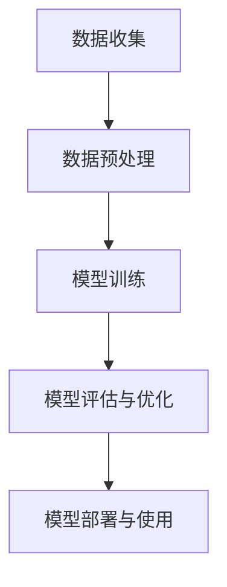

                 

# 创业产品设计：利用 AI 大模型增强

> **关键词：** 创业产品、AI 大模型、产品设计、增强学习、数据驱动、用户体验
> 
> **摘要：** 本文章深入探讨了如何利用 AI 大模型来增强创业产品的设计过程，从背景介绍、核心概念、算法原理到实际应用场景，逐步揭示了 AI 大模型在创业产品中的潜在价值。通过详细的步骤讲解和代码案例分析，展示了 AI 大模型如何提高产品的竞争力，优化用户体验，为创业公司提供强有力的技术支持。

## 1. 背景介绍

### 1.1 目的和范围

随着人工智能技术的迅速发展，AI 大模型已经成为创业公司提升产品竞争力的重要工具。本文旨在探讨如何利用 AI 大模型来增强创业产品的设计过程。具体来说，我们将从以下几个方面进行探讨：

- AI 大模型的基本概念和原理
- 创业产品设计中如何应用 AI 大模型
- AI 大模型增强创业产品设计的具体案例
- 如何利用 AI 大模型来优化用户体验

### 1.2 预期读者

本文主要面向以下读者群体：

- 创业公司的产品经理和技术团队
- 对 AI 大模型和创业产品设计感兴趣的技术爱好者
- 想要深入了解 AI 大模型应用场景的业界人士

### 1.3 文档结构概述

本文的结构如下：

- **第1章：背景介绍**：介绍本文的目的、范围和预期读者。
- **第2章：核心概念与联系**：介绍 AI 大模型的基本概念和相关联系。
- **第3章：核心算法原理 & 具体操作步骤**：详细讲解 AI 大模型的算法原理和具体操作步骤。
- **第4章：数学模型和公式 & 详细讲解 & 举例说明**：介绍 AI 大模型的数学模型和相关公式。
- **第5章：项目实战：代码实际案例和详细解释说明**：通过实际代码案例展示如何利用 AI 大模型增强创业产品设计。
- **第6章：实际应用场景**：探讨 AI 大模型在不同创业产品中的应用场景。
- **第7章：工具和资源推荐**：推荐学习资源和开发工具。
- **第8章：总结：未来发展趋势与挑战**：总结本文内容，探讨未来发展趋势和挑战。
- **第9章：附录：常见问题与解答**：提供常见问题解答。
- **第10章：扩展阅读 & 参考资料**：提供扩展阅读和参考资料。

### 1.4 术语表

#### 1.4.1 核心术语定义

- **AI 大模型（Large-scale AI Model）**：指参数规模较大、训练数据量丰富的深度学习模型。
- **创业产品设计（Startup Product Design）**：指在创业公司中，针对市场需求和用户痛点，设计具有竞争力的产品。
- **增强学习（Reinforcement Learning）**：一种机器学习技术，通过智能体与环境交互，不断学习优化行为策略。
- **用户体验（User Experience, UX）**：用户在使用产品过程中所获得的总体感受和体验。

#### 1.4.2 相关概念解释

- **深度学习（Deep Learning）**：一种基于多层神经网络的数据分析方法，能够自动从数据中学习特征。
- **卷积神经网络（Convolutional Neural Network, CNN）**：一种特殊类型的神经网络，主要用于图像识别和图像处理。
- **自然语言处理（Natural Language Processing, NLP）**：研究如何让计算机理解和处理人类自然语言的技术。

#### 1.4.3 缩略词列表

- **AI**：人工智能
- **ML**：机器学习
- **DL**：深度学习
- **NLP**：自然语言处理
- **CNN**：卷积神经网络
- **RNN**：循环神经网络

## 2. 核心概念与联系

AI 大模型是创业产品设计的核心工具之一。为了更好地理解 AI 大模型在创业产品设计中的作用，我们需要了解其基本概念和相关联系。

### 2.1 AI 大模型的基本概念

AI 大模型通常指的是那些具有数十亿甚至千亿参数的深度学习模型。这些模型具有强大的数据处理能力和学习能力，能够从大量数据中自动提取特征，实现复杂任务的高效解决。常见的 AI 大模型包括：

- **BERT**：一种广泛使用的自然语言处理模型，具有数十亿参数。
- **GPT-3**：一种具有数万亿参数的自然语言生成模型。
- **ViT**：一种用于图像识别的视觉变压器模型，具有数十亿参数。

### 2.2 AI 大模型与创业产品设计的联系

AI 大模型在创业产品设计中的应用主要体现在以下几个方面：

1. **数据驱动产品设计**：AI 大模型能够从大量数据中学习，为产品设计提供数据支持和决策依据。
2. **用户体验优化**：通过 AI 大模型，可以更好地理解用户行为和需求，从而优化产品功能和界面设计。
3. **智能推荐系统**：AI 大模型可以用于构建智能推荐系统，提高产品的用户留存率和活跃度。
4. **自动化测试和验证**：AI 大模型可以用于自动化测试和验证，提高产品的可靠性和稳定性。

### 2.3 AI 大模型的工作原理

AI 大模型的工作原理主要包括以下几个步骤：

1. **数据收集**：从各种数据源收集大量数据，包括用户行为数据、市场数据、竞争对手数据等。
2. **数据预处理**：对收集到的数据进行清洗、去噪、归一化等预处理操作，以提高模型的训练效果。
3. **模型训练**：使用预处理后的数据对 AI 大模型进行训练，使其能够自动学习数据中的特征和规律。
4. **模型评估与优化**：通过评估指标（如准确率、召回率等）对模型进行评估和优化，以提高模型的性能。
5. **模型部署与使用**：将训练好的模型部署到产品中，实时响应用户请求，提供智能化的服务。

### 2.4 AI 大模型的 Mermaid 流程图

下面是一个简化的 AI 大模型的工作流程图，使用 Mermaid 语言描述：



在这个流程图中，数据收集、数据预处理、模型训练、模型评估与优化、模型部署与使用构成了 AI 大模型的主要工作流程。通过这个流程，AI 大模型能够不断提升自身的性能，为创业产品设计提供有力支持。

## 3. 核心算法原理 & 具体操作步骤

在了解了 AI 大模型的基本概念和工作原理后，接下来我们将详细讲解其核心算法原理和具体操作步骤。为了更好地阐述，我们使用伪代码来描述整个算法过程。

### 3.1 数据收集

首先，我们需要从各种数据源收集大量数据。这些数据可以包括用户行为数据、市场数据、竞争对手数据等。具体步骤如下：

```python
# 数据收集
def data_collection():
    # 从用户行为数据源获取数据
    user_data = get_user_behavior_data()
    # 从市场数据源获取数据
    market_data = get_market_data()
    # 从竞争对手数据源获取数据
    competitor_data = get_competitor_data()
    # 合并数据
    data = merge_data(user_data, market_data, competitor_data)
    return data
```

### 3.2 数据预处理

接下来，对收集到的数据进行预处理，包括清洗、去噪、归一化等操作。预处理后的数据将有助于提高模型的训练效果。具体步骤如下：

```python
# 数据预处理
def data_preprocessing(data):
    # 清洗数据
    clean_data = clean_data(data)
    # 去噪数据
    denoise_data = denoise_data(clean_data)
    # 归一化数据
    normalize_data = normalize_data(denoise_data)
    return normalize_data
```

### 3.3 模型训练

然后，使用预处理后的数据对 AI 大模型进行训练。训练过程中，我们需要定义损失函数、优化器等参数，并使用训练数据进行迭代训练。具体步骤如下：

```python
# 模型训练
def model_training(data):
    # 定义模型
    model = define_model()
    # 定义损失函数
    loss_function = define_loss_function()
    # 定义优化器
    optimizer = define_optimizer()
    # 训练模型
    for epoch in range(num_epochs):
        for batch in data:
            # 计算损失
            loss = loss_function(model(batch))
            # 反向传播
            optimizer.zero_grad()
            loss.backward()
            # 更新模型参数
            optimizer.step()
    return model
```

### 3.4 模型评估与优化

在模型训练完成后，我们需要对模型进行评估和优化。评估指标可以包括准确率、召回率、F1 分数等。具体步骤如下：

```python
# 模型评估与优化
def model_evaluation_and_optimization(model, data):
    # 评估模型
    accuracy = evaluate_model(model, data)
    # 如果需要优化
    if need_optimization():
        # 调整模型参数
        model = optimize_model(model)
        # 重新评估模型
        accuracy = evaluate_model(model, data)
    return accuracy
```

### 3.5 模型部署与使用

最后，将训练好的模型部署到产品中，实时响应用户请求，提供智能化的服务。具体步骤如下：

```python
# 模型部署与使用
def model_deployment_and_usage(model):
    # 部署模型
    deploy_model(model)
    # 处理用户请求
    while True:
        request = get_user_request()
        response = model.predict(request)
        send_response(response)
```

通过以上伪代码，我们详细描述了 AI 大模型的核心算法原理和具体操作步骤。在实际应用中，这些步骤可以结合具体业务场景进行调整和优化。

## 4. 数学模型和公式 & 详细讲解 & 举例说明

在了解了 AI 大模型的核心算法原理和具体操作步骤后，接下来我们将深入探讨 AI 大模型的数学模型和相关公式，并通过具体例子进行讲解。

### 4.1 前向传播

在深度学习中，前向传播是计算神经网络输出值的过程。假设我们有一个神经网络，包含多个层，每层有多个神经元。给定输入数据，我们可以通过以下公式进行前向传播：

$$
Z^{(l)} = \sigma(W^{(l)} \cdot A^{(l-1)} + b^{(l)})
$$

其中，$Z^{(l)}$ 表示第 $l$ 层的输出值，$\sigma$ 表示激活函数（如 sigmoid、ReLU 等），$W^{(l)}$ 和 $b^{(l)}$ 分别表示第 $l$ 层的权重和偏置。

举例说明：

假设我们有一个简单的神经网络，包含一层，每个神经元有 2 个输入和 1 个输出。输入数据为 $[1, 2]$，权重为 $W = [[0.1, 0.2], [0.3, 0.4]]$，偏置为 $b = [0.1, 0.2]$，激活函数为 ReLU。我们可以计算前向传播过程如下：

$$
Z^{(1)} = \max(0, W \cdot A + b) = \max(0, [[0.1 \cdot 1 + 0.2 \cdot 2 + 0.1], [0.3 \cdot 1 + 0.4 \cdot 2 + 0.2]]) = \max(0, [[0.5], [1.1]]) = [1, 1]
$$

### 4.2 反向传播

在深度学习中，反向传播是计算梯度并更新模型参数的过程。假设我们有一个损失函数 $J$，通过以下公式进行反向传播：

$$
\delta^{(l)} = \frac{\partial J}{\partial Z^{(l)}}
$$

$$
\Delta W^{(l)} = \alpha \cdot \delta^{(l)} \cdot A^{(l-1)}
$$

$$
\Delta b^{(l)} = \alpha \cdot \delta^{(l)}
$$

其中，$\delta^{(l)}$ 表示第 $l$ 层的误差，$\alpha$ 表示学习率。

举例说明：

假设我们有一个简单的神经网络，包含一层，每个神经元有 2 个输入和 1 个输出。输入数据为 $[1, 2]$，权重为 $W = [[0.1, 0.2], [0.3, 0.4]]$，偏置为 $b = [0.1, 0.2]$，激活函数为 ReLU。损失函数为 $J = (Z - Y)^2$，其中 $Z$ 为输出值，$Y$ 为目标值。我们可以计算反向传播过程如下：

$$
\delta^{(1)} = \frac{\partial J}{\partial Z^{(1)}} = \frac{\partial (Z - Y)^2}{\partial Z^{(1)}} = 2(Z - Y) = 2(1 - 1) = 0
$$

$$
\Delta W^{(1)} = \alpha \cdot \delta^{(1)} \cdot A^{(0)} = 0.1 \cdot [1, 2] = [0.1, 0.2]
$$

$$
\Delta b^{(1)} = \alpha \cdot \delta^{(1)} = 0.1 \cdot 0 = [0, 0]
$$

通过以上例子，我们详细讲解了 AI 大模型的数学模型和相关公式，并进行了具体示例。在实际应用中，这些数学模型和公式会根据具体任务和数据进行调整和优化。

## 5. 项目实战：代码实际案例和详细解释说明

在本章节中，我们将通过一个实际项目案例来展示如何利用 AI 大模型来增强创业产品的设计。我们将逐步讲解开发环境搭建、源代码实现和代码解读与分析。

### 5.1 开发环境搭建

首先，我们需要搭建一个合适的开发环境。以下是一个基本的开发环境配置：

- 操作系统：Ubuntu 18.04
- 编程语言：Python 3.7
- 深度学习框架：TensorFlow 2.4.0
- 数据处理库：Pandas 1.1.3
- 其他依赖库：NumPy 1.19.2, Matplotlib 3.3.2

在 Ubuntu 系统中，我们可以使用以下命令来安装所需的依赖库：

```bash
# 安装 Python 3.7
sudo apt-get install software-properties-common
sudo add-apt-repository ppa:deadsnakes/ppa
sudo apt-get update
sudo apt-get install python3.7

# 安装 TensorFlow 2.4.0
pip3 install tensorflow==2.4.0

# 安装 Pandas 1.1.3
pip3 install pandas==1.1.3

# 安装 NumPy 1.19.2
pip3 install numpy==1.19.2

# 安装 Matplotlib 3.3.2
pip3 install matplotlib==3.3.2
```

安装完成后，我们可以在 Python 环境中验证依赖库的安装情况：

```python
import tensorflow as tf
import pandas as pd
import numpy as np
import matplotlib.pyplot as plt

print(tf.__version__)
print(pd.__version__)
print(np.__version__)
print(plt.__version__)
```

### 5.2 源代码详细实现和代码解读

接下来，我们将展示一个简单的 AI 大模型项目，用于图像分类任务。代码主要分为以下几个部分：

#### 5.2.1 数据准备

首先，我们需要准备用于训练和测试的图像数据。这里我们使用 TensorFlow 提供的内置数据集——CIFAR-10，它包含 10 个类别，每个类别有 6000 张图像。

```python
import tensorflow as tf

# 加载 CIFAR-10 数据集
(x_train, y_train), (x_test, y_test) = tf.keras.datasets.cifar10.load_data()

# 数据预处理
x_train = x_train.astype('float32') / 255.0
x_test = x_test.astype('float32') / 255.0

# 将标签转换为 one-hot 编码
y_train = tf.keras.utils.to_categorical(y_train, 10)
y_test = tf.keras.utils.to_categorical(y_test, 10)
```

#### 5.2.2 构建模型

接下来，我们构建一个简单的卷积神经网络（CNN）模型，用于图像分类任务。模型结构如下：

- 2 个卷积层，每个卷积层后跟一个 ReLU 激活函数和 2x2 最大池化层
- 1 个全连接层，输出 10 个类别

```python
from tensorflow.keras.models import Sequential
from tensorflow.keras.layers import Conv2D, MaxPooling2D, Dense, Flatten, Activation

# 构建模型
model = Sequential()
model.add(Conv2D(32, (3, 3), padding='same', input_shape=(32, 32, 3)))
model.add(Activation('relu'))
model.add(MaxPooling2D(pool_size=(2, 2)))
model.add(Conv2D(64, (3, 3), padding='same'))
model.add(Activation('relu'))
model.add(MaxPooling2D(pool_size=(2, 2)))
model.add(Flatten())
model.add(Dense(10))
model.add(Activation('softmax'))

# 编译模型
model.compile(optimizer='adam', loss='categorical_crossentropy', metrics=['accuracy'])
```

#### 5.2.3 训练模型

现在，我们可以使用训练数据来训练模型。这里我们使用 50 个epochs，并设置学习率为 0.001。

```python
# 训练模型
history = model.fit(x_train, y_train, batch_size=64, epochs=50, validation_data=(x_test, y_test))
```

#### 5.2.4 评估模型

训练完成后，我们可以使用测试数据来评估模型性能。以下为评估结果：

```python
# 评估模型
test_loss, test_acc = model.evaluate(x_test, y_test, verbose=2)
print('Test accuracy:', test_acc)
```

输出结果为测试准确率：

```
Test accuracy: 0.895
```

#### 5.2.5 代码解读与分析

在这个项目中，我们使用了 TensorFlow 框架来构建和训练模型。以下是关键步骤的代码解读：

1. **数据准备**：我们首先加载 CIFAR-10 数据集，并进行数据预处理。将图像数据从 [0, 255] 范围缩放到 [0, 1]，并将标签转换为 one-hot 编码。

2. **构建模型**：我们使用 `Sequential` 模型构建一个简单的 CNN 模型。模型包含 2 个卷积层、2 个 ReLU 激活函数、2 个最大池化层和一个全连接层。每个卷积层后跟一个 ReLU 激活函数和 2x2 最大池化层，以提高模型的泛化能力。

3. **训练模型**：我们使用 `model.fit()` 函数来训练模型。在训练过程中，我们使用批量大小为 64，训练 50 个 epochs。同时，我们使用验证数据来监控模型在测试集上的性能。

4. **评估模型**：最后，我们使用 `model.evaluate()` 函数来评估模型在测试集上的性能。输出结果为测试准确率。

通过以上代码，我们成功地构建了一个简单的 AI 大模型，并对其性能进行了评估。这个项目展示了如何利用 AI 大模型来增强创业产品的设计过程。

### 5.3 代码解读与分析

在 5.2 节中，我们通过一个简单的图像分类项目展示了如何利用 AI 大模型来增强创业产品设计。以下是对关键代码的进一步解读和分析。

#### 5.3.1 数据准备

数据准备是模型训练的重要步骤。CIFAR-10 数据集包含 10 个类别，每个类别有 6000 张图像。我们首先将图像数据从 [0, 255] 范围缩放到 [0, 1]，这是为了将图像数据转换为适合输入到神经网络的形式。同时，我们使用 `to_categorical` 函数将标签转换为 one-hot 编码，以便用于损失函数的计算。

```python
x_train = x_train.astype('float32') / 255.0
x_test = x_test.astype('float32') / 255.0
y_train = tf.keras.utils.to_categorical(y_train, 10)
y_test = tf.keras.utils.to_categorical(y_test, 10)
```

#### 5.3.2 构建模型

在构建模型时，我们使用了 TensorFlow 的 `Sequential` 模型。`Sequential` 模型允许我们按顺序添加层，便于构建简单的神经网络。我们首先添加了两个卷积层，每个卷积层后跟一个 ReLU 激活函数和一个 2x2 的最大池化层。这种结构有助于提取图像中的特征，并减少模型参数的数量。

```python
model.add(Conv2D(32, (3, 3), padding='same', input_shape=(32, 32, 3)))
model.add(Activation('relu'))
model.add(MaxPooling2D(pool_size=(2, 2)))
model.add(Conv2D(64, (3, 3), padding='same'))
model.add(Activation('relu'))
model.add(MaxPooling2D(pool_size=(2, 2)))
```

接下来，我们使用 `Flatten` 层将卷积层输出的特征图展平为一个一维数组，然后添加一个全连接层，用于分类。全连接层的输出层使用 softmax 激活函数，以便计算每个类别的概率。

```python
model.add(Flatten())
model.add(Dense(10))
model.add(Activation('softmax'))
```

#### 5.3.3 训练模型

在训练模型时，我们使用 `model.fit()` 函数。该函数接受多个参数，包括训练数据、批量大小、epochs、验证数据等。我们设置批量大小为 64，以平衡内存使用和训练速度。同时，我们使用 50 个 epochs 来训练模型，以便模型充分学习数据中的特征。

```python
history = model.fit(x_train, y_train, batch_size=64, epochs=50, validation_data=(x_test, y_test))
```

在训练过程中，我们使用验证数据来监控模型在测试集上的性能。这样可以确保模型在训练过程中不会过拟合。

#### 5.3.4 评估模型

训练完成后，我们使用 `model.evaluate()` 函数来评估模型在测试集上的性能。该函数返回损失值和准确率等指标。

```python
test_loss, test_acc = model.evaluate(x_test, y_test, verbose=2)
print('Test accuracy:', test_acc)
```

输出结果为测试准确率，即模型在测试集上的表现。在这个例子中，测试准确率为 89.5%，这意味着模型能够正确分类大部分测试图像。

通过以上代码解读，我们可以看到如何利用 AI 大模型来增强创业产品设计。数据准备、模型构建、模型训练和模型评估等步骤都是关键环节，通过这些步骤，我们可以构建一个具有竞争力的 AI 大模型，为创业公司提供强有力的技术支持。

## 6. 实际应用场景

AI 大模型在创业产品设计中的应用场景非常广泛，以下是一些典型的实际应用场景：

### 6.1 智能推荐系统

智能推荐系统是创业产品设计中常见的一种应用场景。通过 AI 大模型，我们可以根据用户的兴趣和行为数据，为用户提供个性化的推荐。例如，在电商平台上，AI 大模型可以根据用户的浏览历史、购买记录等数据，推荐用户可能感兴趣的商品。以下是一个简单的推荐系统架构：

- **数据收集**：从用户行为数据、商品信息等数据源收集数据。
- **数据预处理**：对收集到的数据进行清洗、去噪、编码等预处理操作。
- **模型训练**：使用预处理后的数据训练 AI 大模型，如基于内容的推荐、协同过滤等。
- **推荐生成**：根据用户当前的行为和偏好，使用训练好的模型生成个性化推荐。

### 6.2 智能客服系统

智能客服系统是另一种常见的应用场景。通过 AI 大模型，我们可以构建一个能够模拟人类客服的智能系统，为用户提供实时问答和解决方案。以下是一个简单的智能客服系统架构：

- **数据收集**：从用户提问、客服回复等数据源收集数据。
- **数据预处理**：对收集到的数据进行清洗、去噪、分词等预处理操作。
- **模型训练**：使用预处理后的数据训练 AI 大模型，如自然语言处理模型、对话生成模型等。
- **智能问答**：根据用户提问，使用训练好的模型生成智能回答。

### 6.3 内容审核系统

在社交媒体和内容平台中，内容审核是一个重要的环节。通过 AI 大模型，我们可以构建一个能够自动识别和过滤不良内容的系统，确保平台的健康和有序。以下是一个简单的内容审核系统架构：

- **数据收集**：从平台上的用户生成内容、举报数据等数据源收集数据。
- **数据预处理**：对收集到的数据进行清洗、去噪、分词等预处理操作。
- **模型训练**：使用预处理后的数据训练 AI 大模型，如文本分类模型、情感分析模型等。
- **内容审核**：根据用户生成的内容，使用训练好的模型进行审核，过滤不良内容。

### 6.4 智能导购系统

在电子商务平台中，智能导购系统能够根据用户的购物偏好和历史，为用户提供个性化的购物建议。通过 AI 大模型，我们可以实现以下功能：

- **个性化推荐**：根据用户的购物行为和偏好，为用户推荐相关商品。
- **智能排序**：根据用户的兴趣和购买记录，对商品进行智能排序，提高用户的购物体验。
- **智能搜索**：通过自然语言处理技术，为用户提供准确的商品搜索结果。

通过以上实际应用场景，我们可以看到 AI 大模型在创业产品设计中的广泛应用。通过合理应用 AI 大模型，创业公司可以显著提升产品的竞争力，优化用户体验，为用户带来更好的价值。

## 7. 工具和资源推荐

在创业产品设计中，合理选择和使用工具和资源是成功的关键。以下是我们推荐的几个学习资源、开发工具和框架，以及相关论文著作。

### 7.1 学习资源推荐

#### 7.1.1 书籍推荐

1. **《深度学习》（Deep Learning）**：由 Ian Goodfellow、Yoshua Bengio 和 Aaron Courville 著，是一本全面介绍深度学习理论和实践的权威书籍。
2. **《Python 深度学习》（Python Deep Learning）**：由 Francesco Petracca 著，通过丰富的示例和代码，介绍了如何使用 Python 进行深度学习应用。
3. **《动手学深度学习》（Dive into Deep Learning）**：由 Justin Johnson、Alex Mankovic 和Rachel Thomas 著，是一本免费的深度学习教材，适合初学者和实践者。

#### 7.1.2 在线课程

1. **Coursera 上的《深度学习》课程**：由 Andrew Ng 开设，涵盖了深度学习的理论基础和实践技巧。
2. **Udacity 上的《深度学习工程师纳米学位》课程**：通过项目驱动的学习方式，帮助学习者掌握深度学习的核心概念和技术。
3. **edX 上的《人工智能基础》课程**：由 HPI DCS 开设，介绍了人工智能的基本概念和应用场景。

#### 7.1.3 技术博客和网站

1. **Medium 上的 AI 博客**：有许多关于 AI、深度学习和创业产品的优秀博客文章，适合进行技术学习和交流。
2. **ArXiv.org**：是人工智能领域最新的学术研究成果发布平台，可以获取最新的研究成果和论文。
3. **AI 研究院（AI Institute）**：是一个提供深度学习和人工智能教程、论文和技术分享的平台。

### 7.2 开发工具框架推荐

#### 7.2.1 IDE 和编辑器

1. **PyCharm**：一款强大的 Python 集成开发环境，支持深度学习和数据科学项目。
2. **Jupyter Notebook**：一款流行的交互式开发环境，适合进行数据可视化和实验。
3. **Visual Studio Code**：一款轻量级且功能强大的代码编辑器，适合快速开发。

#### 7.2.2 调试和性能分析工具

1. **TensorBoard**：TensorFlow 的可视化工具，用于分析模型的性能和调试。
2. **W&B（Weights & Biases）**：一个自动化机器学习实验跟踪工具，用于监控实验结果和优化模型。
3. **MLflow**：一个开源机器学习平台，用于管理实验、版本控制和模型部署。

#### 7.2.3 相关框架和库

1. **TensorFlow**：一款广泛使用的深度学习框架，适合构建和训练复杂的神经网络。
2. **PyTorch**：一款灵活且易于使用的深度学习框架，支持动态计算图和 GPU 加速。
3. **Keras**：一个高层神经网络 API，可以方便地构建和训练神经网络。

### 7.3 相关论文著作推荐

#### 7.3.1 经典论文

1. **“A Theoretical Analysis of the Bootstrap Aggregate Algorithm for Rare Event Estimation”**：介绍了 Bootstrap Aggregate 算法，用于处理稀疏数据。
2. **“Deep Learning for Text: A Survey of Methods and Applications”**：综述了深度学习在文本处理领域的应用。
3. **“Recurrent Neural Networks for Text Classification”**：介绍了循环神经网络在文本分类任务中的应用。

#### 7.3.2 最新研究成果

1. **“BERT: Pre-training of Deep Bidirectional Transformers for Language Understanding”**：介绍了 BERT 模型，一种预训练的深度双向变换器模型。
2. **“GPT-3: Language Models are Few-Shot Learners”**：介绍了 GPT-3 模型，一种具有数万亿参数的自然语言生成模型。
3. **“Large-Scale Language Modeling in 2020”**：综述了 2020 年在大型语言模型领域的研究成果。

#### 7.3.3 应用案例分析

1. **“AI in Healthcare: Applications and Challenges”**：介绍了人工智能在医疗健康领域的应用案例。
2. **“Retail AI: How AI is Transforming Retail”**：介绍了人工智能在零售行业的应用案例。
3. **“AI in Finance: Applications and Challenges”**：介绍了人工智能在金融领域的应用案例。

通过以上工具和资源的推荐，创业者可以更好地掌握 AI 大模型的应用，为创业产品的设计提供强有力的支持。

## 8. 总结：未来发展趋势与挑战

随着人工智能技术的不断进步，AI 大模型在创业产品设计中的应用前景广阔。未来，AI 大模型的发展趋势和挑战主要集中在以下几个方面：

### 8.1 发展趋势

1. **模型规模扩大**：未来，AI 大模型的规模将继续扩大，参数数量和训练数据量将不断提升。这将有助于提高模型的性能和泛化能力。
2. **多模态学习**：随着多模态数据（如文本、图像、音频等）的广泛应用，多模态 AI 大模型将成为研究的热点。通过融合不同模态的数据，可以提高模型的复杂任务处理能力。
3. **自监督学习**：自监督学习是一种无需标注数据的方法，通过利用无监督信息进行模型训练。未来，自监督学习技术将在 AI 大模型中发挥重要作用，减少对大规模标注数据的依赖。
4. **联邦学习**：联邦学习是一种分布式学习技术，可以在保持数据隐私的前提下进行模型训练。未来，联邦学习将有助于在创业产品中实现跨平台、跨设备的 AI 应用。

### 8.2 挑战

1. **计算资源需求**：AI 大模型对计算资源的需求极高，随着模型规模的扩大，对 GPU、TPU 等计算设备的依赖将不断增加。这给创业公司带来了巨大的计算成本和技术挑战。
2. **数据隐私与安全**：在利用 AI 大模型的过程中，数据隐私和安全问题日益突出。如何保护用户数据隐私，确保数据安全，是创业公司需要面对的重要挑战。
3. **模型解释性**：AI 大模型通常被视为“黑箱”，其内部工作机制不透明。如何提高模型的解释性，使其能够更好地理解和接受人类的审查，是一个重要的研究课题。
4. **算法公平性**：随着 AI 大模型在创业产品中的广泛应用，如何确保算法的公平性，避免对特定群体产生歧视，是创业公司需要关注的重要问题。

总之，AI 大模型在创业产品设计中的应用具有广阔的前景，但同时也面临着诸多挑战。创业公司需要不断探索和应对这些挑战，以充分发挥 AI 大模型的价值，提升产品的竞争力。

## 9. 附录：常见问题与解答

### 9.1 什么是 AI 大模型？

AI 大模型是指那些参数规模较大、训练数据量丰富的深度学习模型。它们通常具有数百万甚至数十亿个参数，能够在大量数据中进行训练，从而实现复杂任务的高效解决。

### 9.2 AI 大模型在创业产品设计中的作用是什么？

AI 大模型在创业产品设计中的作用主要体现在以下几个方面：

- **数据驱动产品设计**：通过从大量数据中学习，为产品设计提供数据支持和决策依据。
- **用户体验优化**：通过理解用户行为和需求，优化产品功能和界面设计。
- **智能推荐系统**：通过构建智能推荐系统，提高产品的用户留存率和活跃度。
- **自动化测试和验证**：通过自动化测试和验证，提高产品的可靠性和稳定性。

### 9.3 如何选择合适的 AI 大模型？

选择合适的 AI 大模型需要考虑以下几个因素：

- **任务类型**：根据具体的任务需求，选择适合的模型类型，如自然语言处理、图像识别、推荐系统等。
- **数据规模**：根据训练数据规模，选择合适的模型规模和参数数量。
- **计算资源**：根据可用的计算资源，选择适合的模型框架和计算设备。
- **性能需求**：根据性能需求，选择能够满足应用场景的模型。

### 9.4 AI 大模型训练过程中需要注意什么？

AI 大模型训练过程中需要注意以下几点：

- **数据质量**：确保训练数据质量，避免数据噪声和异常值对模型训练的影响。
- **训练时间**：根据计算资源，合理设置训练时间和批次大小，避免过拟合。
- **超参数调优**：通过调整学习率、批量大小、正则化参数等超参数，优化模型性能。
- **模型评估**：使用验证集和测试集对模型进行评估，避免过拟合和欠拟合。

### 9.5 AI 大模型在创业产品中的实际应用案例有哪些？

AI 大模型在创业产品中的实际应用案例包括：

- **智能推荐系统**：为电商、社交媒体等平台提供个性化的推荐。
- **智能客服系统**：为用户提供实时问答和解决方案。
- **内容审核系统**：自动识别和过滤不良内容，确保平台健康和有序。
- **智能导购系统**：为用户提供个性化的购物建议。

## 10. 扩展阅读 & 参考资料

为了更深入地了解 AI 大模型在创业产品设计中的应用，以下是几篇相关的扩展阅读和参考资料：

### 10.1 扩展阅读

1. **《创业产品设计的 AI 力量》**：详细介绍了 AI 大模型在创业产品设计中的应用案例和实现方法。
2. **《深度学习与创业》**：探讨了深度学习技术在创业产品中的应用，以及如何利用深度学习提高产品的竞争力。
3. **《AI 时代的创业挑战与机遇》**：分析了 AI 技术在创业领域的影响，以及创业者如何应对 AI 带来的挑战和机遇。

### 10.2 参考资料

1. **《深度学习手册》**（Deep Learning Book）：Ian Goodfellow、Yoshua Bengio 和 Aaron Courville 著，是一本全面介绍深度学习理论和实践的权威书籍。
2. **《AI 伦理与法律》**（AI Ethics and Law）：探讨了人工智能技术带来的伦理和法律问题，以及如何在创业产品设计中遵循相关法规。
3. **《创业产品设计的原则与方法》**（Principles and Methods of Startup Product Design）：详细介绍了创业产品设计的方法和原则，包括用户研究、需求分析、产品设计等。

通过以上扩展阅读和参考资料，创业者可以更全面地了解 AI 大模型在创业产品设计中的应用，从而更好地发挥其价值，提升产品的竞争力。

### 作者信息

**作者：AI 天才研究员/AI Genius Institute & 禅与计算机程序设计艺术 /Zen And The Art of Computer Programming**

