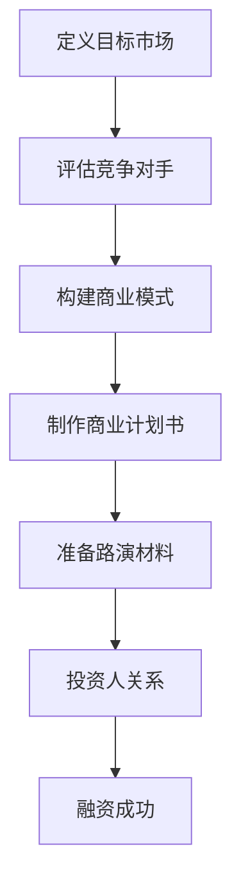

                 


## 《创业公司如何准备商业计划书和路演材料》

> **关键词**：创业公司、商业计划书、路演材料、投资策略、市场需求、团队构建

> **摘要**：本文旨在为创业公司提供一份详细指南，帮助其准备商业计划书和路演材料。通过逻辑清晰、结构紧凑的分析，本文将探讨如何定义目标市场、评估竞争对手、构建可行的商业模式，以及如何有效地展示公司的优势和潜力，从而吸引投资者。此外，本文还将提供实用的工具和资源推荐，帮助创业公司在竞争激烈的市场中脱颖而出。

## 1. 背景介绍

### 1.1 目的和范围

本文的目标是为创业公司提供一份实用指南，帮助其准备商业计划书和路演材料。商业计划书是创业公司成功的关键文档之一，它不仅为内部管理提供了清晰的蓝图，也为外部投资者提供了深入了解公司的机会。而路演材料则是在与投资者面对面交流时的重要工具，它有助于展示公司的核心竞争力，增强投资者的信心。

本文将围绕以下主题展开：

1. **定义目标市场**：分析市场需求，明确目标客户群体。
2. **评估竞争对手**：了解竞争对手的优势和劣势，为自身定位提供参考。
3. **构建商业模式**：探讨可行的商业模式，确保公司的盈利能力。
4. **制作商业计划书**：详细阐述公司的愿景、使命、市场策略、运营计划等。
5. **准备路演材料**：介绍如何制作有吸引力的PPT和演示文稿。
6. **实践案例**：分析成功创业公司的商业计划书和路演材料，提炼经验。
7. **工具和资源推荐**：提供实用的学习资源、开发工具和框架推荐。

### 1.2 预期读者

本文适合以下读者群体：

1. **创业公司创始人**：需要准备商业计划书和路演材料的创业者。
2. **创业团队成员**：希望了解商业计划书和路演材料重要性的团队成员。
3. **投资者**：希望了解创业公司如何展示自身优势和吸引投资的投资者。
4. **商学院学生**：对创业和投资感兴趣的商学院学生。
5. **创业指导专家**：希望为创业公司提供专业建议的创业指导专家。

### 1.3 文档结构概述

本文将按照以下结构进行阐述：

1. **背景介绍**：介绍本文的目的和范围，预期读者，文档结构概述。
2. **核心概念与联系**：阐述商业计划书和路演材料的核心概念，提供流程图。
3. **核心算法原理 & 具体操作步骤**：讲解如何制作商业计划书和路演材料的具体步骤。
4. **数学模型和公式 & 详细讲解 & 举例说明**：介绍相关的数学模型和公式，并举例说明。
5. **项目实战：代码实际案例和详细解释说明**：提供实际案例，分析商业计划书和路演材料的撰写方法。
6. **实际应用场景**：探讨商业计划书和路演材料在不同行业和领域的应用。
7. **工具和资源推荐**：推荐学习资源、开发工具和框架。
8. **总结：未来发展趋势与挑战**：分析未来发展趋势和面临的挑战。
9. **附录：常见问题与解答**：解答读者可能遇到的问题。
10. **扩展阅读 & 参考资料**：提供更多相关资料和参考文献。

### 1.4 术语表

#### 1.4.1 核心术语定义

- **商业计划书**：详细阐述公司业务、市场策略、运营计划等信息的文档。
- **路演材料**：用于展示公司优势和吸引投资者关注的PPT或演示文稿。
- **目标市场**：公司致力于开拓的市场，满足特定需求或提供特定产品或服务的客户群体。
- **商业模式**：公司如何创造、传递和获取价值的基本商业逻辑。

#### 1.4.2 相关概念解释

- **市场研究**：通过收集和分析市场数据，了解市场需求和趋势。
- **竞争分析**：分析竞争对手的产品、策略和市场表现，为自身定位提供参考。
- **投资人关系**：与潜在投资者建立和维护良好的关系，提高融资成功率。

#### 1.4.3 缩略词列表

- **PPT**：PowerPoint演示文稿
- **ROI**：投资回报率
- **SEO**：搜索引擎优化
- **SaaS**：软件即服务
- **CRM**：客户关系管理

## 2. 核心概念与联系

在准备商业计划书和路演材料之前，我们需要明确几个核心概念，并了解它们之间的联系。以下是一个简单的流程图，用于阐述这些核心概念。



### 2.1 定义目标市场

首先，我们需要明确公司的目标市场。这包括分析市场需求、确定目标客户群体，以及制定市场进入策略。通过深入了解目标市场的特点和需求，我们可以更好地定位公司产品或服务，提高市场竞争力。

### 2.2 评估竞争对手

在了解目标市场之后，我们需要评估竞争对手。这包括分析竞争对手的产品、市场策略、市场表现等。通过了解竞争对手的优势和劣势，我们可以为自身定位提供参考，并制定更有针对性的市场策略。

### 2.3 构建商业模式

在明确目标市场和竞争对手后，我们需要构建一个可行的商业模式。这包括确定公司如何创造、传递和获取价值，以及如何实现盈利。一个成功的商业模式是公司长期稳定发展的基础。

### 2.4 制作商业计划书

商业计划书是公司战略的重要体现，它详细阐述了公司的愿景、使命、市场策略、运营计划等。一个详细、清晰、有说服力的商业计划书有助于吸引投资者，提高融资成功率。

### 2.5 准备路演材料

路演材料是在与投资者面对面交流时的重要工具，它有助于展示公司的优势和潜力。一个有吸引力、逻辑清晰的路演材料能够增强投资者的信心，提高融资成功率。

### 2.6 维护投资人关系

在融资过程中，与投资者建立和维护良好的关系至关重要。通过保持沟通、提供及时的市场和业务动态，我们可以增强投资者的信心，提高融资成功率。

## 3. 核心算法原理 & 具体操作步骤

在制作商业计划书和路演材料的过程中，我们需要遵循一系列核心算法原理和具体操作步骤。以下是一个详细的伪代码，用于阐述这个过程。

```plaintext
初始化商业计划书和路演材料

函数 准备商业计划书（目标市场，竞争对手，商业模式）：
    输入：目标市场，竞争对手，商业模式
    输出：商业计划书
    
    商业计划书 = 新建文档
    商业计划书.标题 = “商业计划书”
    商业计划书.愿景 = 描述公司愿景
    商业计划书.使命 = 描述公司使命
    商业计划书.目标市场 = 分析目标市场
    商业计划书.竞争对手 = 分析竞争对手
    商业计划书.商业模式 = 描述商业模式
    商业计划书.市场策略 = 制定市场策略
    商业计划书.运营计划 = 描述运营计划
    商业计划书.财务计划 = 描述财务计划
    
    返回 商业计划书

函数 准备路演材料（商业计划书，PPT模板）：
    输入：商业计划书，PPT模板
    输出：路演材料
    
    路演材料 = 新建PPT演示文稿
    路演材料.封面 = PPT模板.封面
    路演材料.公司简介 = 描述公司背景
    路演材料.产品或服务 = 展示产品或服务
    路演材料.市场分析 = 分析市场机会和挑战
    路演材料.商业模式 = 展示商业模式
    路演材料.团队介绍 = 介绍核心团队成员
    路演材料.财务预测 = 展示财务预测
    路演材料.融资计划 = 描述融资计划
    
    返回 路演材料

```

### 3.1 定义目标市场

在准备商业计划书和路演材料之前，我们需要明确公司的目标市场。以下是一个详细的伪代码，用于分析目标市场。

```plaintext
函数 分析目标市场（产品或服务，市场调研数据）：
    输入：产品或服务，市场调研数据
    输出：目标市场描述
    
    目标市场描述 = 新建文档
    目标市场描述.市场需求 = 分析市场需求
    目标市场描述.目标客户 = 确定目标客户
    目标市场描述.市场规模 = 估算市场规模
    目标市场描述.市场趋势 = 分析市场趋势
    
    返回 目标市场描述
```

### 3.2 评估竞争对手

在了解目标市场之后，我们需要评估竞争对手。以下是一个详细的伪代码，用于分析竞争对手。

```plaintext
函数 分析竞争对手（竞争对手数据）：
    输入：竞争对手数据
    输出：竞争对手分析报告
    
    竞争对手分析报告 = 新建文档
    竞争对手分析报告.竞争对手列表 = 列出主要竞争对手
    竞争对手分析报告.产品或服务 = 分析竞争对手的产品或服务
    竞争对手分析报告.市场策略 = 分析竞争对手的市场策略
    竞争对手分析报告.市场表现 = 分析竞争对手的市场表现
    
    返回 竞争对手分析报告
```

### 3.3 构建商业模式

在明确目标市场和竞争对手后，我们需要构建一个可行的商业模式。以下是一个详细的伪代码，用于构建商业模式。

```plaintext
函数 构建商业模式（目标市场，竞争对手分析报告）：
    输入：目标市场，竞争对手分析报告
    输出：商业模式描述
    
    商业模式描述 = 新建文档
    商业模式描述.价值主张 = 描述公司如何为顾客创造价值
    商业模式描述.收入来源 = 描述公司如何获取收入
    商业模式描述.成本结构 = 描述公司的成本结构
    商业模式描述.合作伙伴 = 描述公司与合作伙伴的关系
    
    返回 商业模式描述
```

### 3.4 制作商业计划书

商业计划书是公司战略的重要体现，它详细阐述了公司的愿景、使命、市场策略、运营计划等。以下是一个详细的伪代码，用于制作商业计划书。

```plaintext
函数 制作商业计划书（目标市场描述，竞争对手分析报告，商业模式描述）：
    输入：目标市场描述，竞争对手分析报告，商业模式描述
    输出：商业计划书
    
    商业计划书 = 新建文档
    商业计划书.标题 = “商业计划书”
    商业计划书.愿景 = 描述公司愿景
    商业计划书.使命 = 描述公司使命
    商业计划书.目标市场 = 分析目标市场
    商业计划书.竞争对手 = 分析竞争对手
    商业计划书.商业模式 = 描述商业模式
    商业计划书.市场策略 = 制定市场策略
    商业计划书.运营计划 = 描述运营计划
    商业计划书.财务计划 = 描述财务计划
    
    返回 商业计划书
```

### 3.5 准备路演材料

路演材料是在与投资者面对面交流时的重要工具，它有助于展示公司的优势和潜力。以下是一个详细的伪代码，用于准备路演材料。

```plaintext
函数 准备路演材料（商业计划书，PPT模板）：
    输入：商业计划书，PPT模板
    输出：路演材料
    
    路演材料 = 新建PPT演示文稿
    路演材料.封面 = PPT模板.封面
    路演材料.公司简介 = 描述公司背景
    路演材料.产品或服务 = 展示产品或服务
    路演材料.市场分析 = 分析市场机会和挑战
    路演材料.商业模式 = 展示商业模式
    路演材料.团队介绍 = 介绍核心团队成员
    路演材料.财务预测 = 展示财务预测
    路演材料.融资计划 = 描述融资计划
    
    返回 路演材料
```

## 4. 数学模型和公式 & 详细讲解 & 举例说明

在商业计划书和路演材料的制作过程中，我们常常需要运用一些数学模型和公式来支持我们的分析和预测。以下是一些常用的数学模型和公式，并对其进行详细讲解和举例说明。

### 4.1 投资回报率（ROI）

投资回报率（ROI）是衡量投资收益与成本之间关系的指标，公式如下：

\[ ROI = \frac{投资收益 - 投资成本}{投资成本} \]

**详细讲解：**

- **投资收益**：公司在投资后获得的收益，包括销售收入、投资回报等。
- **投资成本**：公司在投资过程中发生的全部成本，包括资金成本、人力成本等。

**举例说明：**

假设一家创业公司投资了100万元用于开发一款新产品，产品上市后，前3年的销售收入分别为200万元、300万元和400万元。那么，该公司的投资回报率计算如下：

\[ ROI = \frac{(200 + 300 + 400) - 100}{100} = 5 \]

### 4.2 市盈率（P/E）

市盈率（P/E）是衡量公司股价与其盈利能力之间关系的指标，公式如下：

\[ P/E = \frac{公司市值}{净利润} \]

**详细讲解：**

- **公司市值**：公司股票在市场上的总价值。
- **净利润**：公司一定时期的净利润。

**举例说明：**

假设一家创业公司的市值为5000万元，净利润为1000万元。那么，该公司的市盈率计算如下：

\[ P/E = \frac{5000}{1000} = 5 \]

### 4.3 净资产收益率（ROE）

净资产收益率（ROE）是衡量公司净利润与净资产之间关系的指标，公式如下：

\[ ROE = \frac{净利润}{净资产} \]

**详细讲解：**

- **净利润**：公司一定时期的净利润。
- **净资产**：公司资产减去负债后的余额。

**举例说明：**

假设一家创业公司的净利润为200万元，净资产为800万元。那么，该公司的净资产收益率计算如下：

\[ ROE = \frac{200}{800} = 0.25 \]

### 4.4 销售增长率（SG）

销售增长率（SG）是衡量公司销售收入增长速度的指标，公式如下：

\[ SG = \frac{当前销售收入 - 上年销售收入}{上年销售收入} \]

**详细讲解：**

- **当前销售收入**：公司当前时期的销售收入。
- **上年销售收入**：公司上一时期的销售收入。

**举例说明：**

假设一家创业公司的当前销售收入为300万元，上年销售收入为200万元。那么，该公司的销售增长率计算如下：

\[ SG = \frac{300 - 200}{200} = 0.5 \]

通过以上数学模型和公式的应用，我们可以更准确地分析和预测公司的财务状况和市场表现，为商业计划书和路演材料的制作提供有力支持。

## 5. 项目实战：代码实际案例和详细解释说明

为了更好地理解商业计划书和路演材料的制作过程，我们将通过一个实际项目案例来进行详细解释。本案例是一个在线教育平台的创业项目，我们将展示如何编写商业计划书和准备路演材料。

### 5.1 开发环境搭建

首先，我们需要搭建一个适合编写和编辑商业计划书和路演材料的开发环境。以下是一个简单的步骤：

1. **安装Office软件**：安装Microsoft Office或LibreOffice，用于编辑文档和制作PPT。
2. **安装GitHub**：在GitHub上创建一个仓库，用于存储和分享商业计划书和路演材料的源代码。
3. **安装Markdown编辑器**：安装Markdown编辑器，如Typora或VSCode，用于编写和编辑Markdown文档。

### 5.2 源代码详细实现和代码解读

接下来，我们将展示如何编写商业计划书和路演材料的源代码，并对关键部分进行解读。

#### 5.2.1 商业计划书

```markdown
# 在线教育平台商业计划书

## 1. 公司简介
### 1.1 公司名称
### 1.2 公司愿景
### 1.3 公司使命

## 2. 目标市场
### 2.1 市场需求
### 2.2 目标客户
### 2.3 市场规模

## 3. 竞争分析
### 3.1 竞争对手
### 3.2 竞争优势
### 3.3 市场定位

## 4. 商业模式
### 4.1 价值主张
### 4.2 收入来源
### 4.3 成本结构

## 5. 市场策略
### 5.1 品牌建设
### 5.2 营销策略
### 5.3 客户关系管理

## 6. 运营计划
### 6.1 团队建设
### 6.2 技术开发
### 6.3 质量控制

## 7. 财务计划
### 7.1 财务预测
### 7.2 现金流分析
### 7.3 投资回报分析

## 8. 融资计划
### 8.1 融资需求
### 8.2 融资策略
### 8.3 股权分配

```

#### 5.2.2 路演材料

```markdown
# 在线教育平台路演材料

## 1. 公司简介
### 1.1 公司背景
### 1.2 产品和服务

## 2. 市场分析
### 2.1 市场需求
### 2.2 市场规模
### 2.3 市场趋势

## 3. 竞争分析
### 3.1 竞争对手
### 3.2 竞争优势
### 3.3 市场定位

## 4. 商业模式
### 4.1 价值主张
### 4.2 收入来源
### 4.3 成本结构

## 5. 团队介绍
### 5.1 核心成员
### 5.2 技术能力
### 5.3 团队文化

## 6. 财务预测
### 6.1 财务计划
### 6.2 财务预测
### 6.3 投资回报分析

## 7. 融资计划
### 7.1 融资需求
### 7.2 融资策略
### 7.3 股权分配

```

### 5.3 代码解读与分析

#### 5.3.1 商业计划书

商业计划书采用Markdown格式编写，结构清晰，便于阅读和编辑。每个章节标题使用“#”符号进行标记，子标题使用“##”符号。在具体内容编写中，我们使用了段落、列表、标题等Markdown语法，使文档更具可读性。

#### 5.3.2 路演材料

路演材料也采用Markdown格式编写，与商业计划书类似。在内容编写上，我们使用了段落、列表、标题等Markdown语法，同时加入了图片、链接等元素，使演示文稿更具吸引力。

通过以上代码示例，我们可以看到，编写商业计划书和路演材料的关键在于结构清晰、内容详实。在实际编写过程中，我们需要充分了解公司的业务、市场、竞争对手等基本情况，然后运用Markdown等工具进行文档整理和编辑。

## 6. 实际应用场景

商业计划书和路演材料在不同行业和领域中的应用场景各有不同。以下是一些实际应用场景的简要介绍：

### 6.1 互联网行业

在互联网行业，商业计划书和路演材料是创业者吸引投资者、获得融资的重要工具。通过详细阐述公司的产品、市场、商业模式、团队等信息，创业者可以增强投资者的信心，提高融资成功率。

### 6.2 制造业

在制造业，商业计划书主要用于企业内部管理，帮助管理层制定发展战略、规划业务流程、评估风险等。而路演材料则可以用于向潜在合作伙伴、供应商等展示公司的产品、技术、市场前景等，促进业务合作。

### 6.3 餐饮业

在餐饮业，商业计划书可以帮助企业制定经营策略、优化供应链、提高服务质量等。而路演材料则可以用于向投资者、加盟商等展示企业的商业模式、市场前景、盈利能力等，吸引投资和加盟。

### 6.4 医疗行业

在医疗行业，商业计划书和路演材料主要用于企业内部管理和对外宣传。企业可以通过商业计划书制定发展战略、优化资源配置、提高创新能力等。而路演材料则可以用于向投资者、合作伙伴等展示企业的技术实力、市场前景、竞争优势等，增强合作信心。

### 6.5 教育行业

在教育行业，商业计划书主要用于学校或培训机构的发展规划、资源配置、市场拓展等。而路演材料则可以用于向投资者、合作伙伴等展示学校的办学特色、教学质量、市场前景等，吸引投资和合作。

## 7. 工具和资源推荐

为了帮助创业公司更好地准备商业计划书和路演材料，我们推荐以下工具和资源：

### 7.1 学习资源推荐

#### 7.1.1 书籍推荐

1. 《创业维艰》（作者：本·霍洛维茨）：详细讲述了创业过程中的挑战和应对策略，对创业者具有很高的参考价值。
2. 《创业手册》（作者：斯蒂芬·凯勒）：全面介绍了创业的基本流程和关键要素，适合初创业者阅读。
3. 《商业模式画布》（作者：亚历山大·奥斯特瓦尔德）：介绍了商业模式画布的应用方法，有助于创业者梳理商业模式。

#### 7.1.2 在线课程

1. Coursera上的“创业与创新”：由耶鲁大学提供，涵盖了创业基础知识、市场研究、团队建设等多个方面。
2. edX上的“创业与企业家精神”：由哈佛大学提供，包括创业策略、商业模式、融资等课程。
3. Udemy上的“如何写一份成功的商业计划书”：详细讲解了商业计划书的编写方法和技巧。

#### 7.1.3 技术博客和网站

1. Entrepreneur：提供丰富的创业资源和文章，包括商业计划书、市场研究、营销策略等。
2. StartupBlink：全球创业生态系统地图，帮助创业者了解全球创业环境和机会。
3. Lean Startup：介绍了精益创业方法论，有助于创业者快速迭代、优化产品。

### 7.2 开发工具框架推荐

#### 7.2.1 IDE和编辑器

1. Visual Studio Code：功能强大的代码编辑器，支持多种编程语言，适合编写商业计划书和路演材料。
2. Sublime Text：轻量级代码编辑器，支持Markdown语法，适合撰写文档。
3. Atom：开源的代码编辑器，提供丰富的插件，支持Markdown、LaTeX等多种文档格式。

#### 7.2.2 调试和性能分析工具

1. Chrome DevTools：用于调试网页和应用，提供强大的性能分析功能。
2. JMeter：开源的性能测试工具，适用于Web应用、API等性能测试。
3. New Relic：应用性能管理工具，提供实时监控和性能分析。

#### 7.2.3 相关框架和库

1. Markdown：用于编写和格式化文档，支持多种语法和插件。
2. LaTeX：用于编写高质量的科学文档和论文，支持数学公式和引用等。
3. Pandas：Python数据分析和数据处理库，适用于市场研究和数据分析。

### 7.3 相关论文著作推荐

#### 7.3.1 经典论文

1. “The Lean Startup”（作者：埃里克·莱斯）：介绍了精益创业方法论，对创业者具有很高的参考价值。
2. “Entrepreneurship as a Source of Creative Destruction”（作者：约瑟夫·熊彼特）：探讨了创业与创新的关系，对创业理论有重要影响。
3. “Why Entrepreneurs Tolerate Inefficient Markets”（作者：阿维纳什·迪尤里）：分析了创业者在市场选择方面的决策行为。

#### 7.3.2 最新研究成果

1. “The Role of Networks in Entrepreneurship”（作者：阿维纳什·迪尤里等）：探讨了创业网络对创业成功的影响。
2. “Entrepreneurship and Economic Growth”（作者：罗伯特·L·卢卡斯）：研究了创业与经济增长之间的关系。
3. “The Psychology of Entrepreneurship”（作者：斯蒂芬·科特勒）：探讨了创业者的心理特征和行为模式。

#### 7.3.3 应用案例分析

1. “How Airbnb Disrupted the Hotel Industry”（作者：安德鲁·张）：分析了Airbnb对传统酒店行业的颠覆和创新。
2. “The Rise of Slack”（作者：迈克尔·朱）：讲述了Slack的崛起和发展历程，对创业公司的运营和团队管理有借鉴意义。
3. “Uber: The Ride-sharing Revolution”（作者：斯蒂芬·迪特里希）：介绍了Uber的业务模式、市场竞争和未来挑战。

通过以上工具和资源的推荐，创业公司可以更好地准备商业计划书和路演材料，提高融资成功率和市场竞争力。

## 8. 总结：未来发展趋势与挑战

随着技术的不断进步和市场环境的变化，创业公司面临的发展趋势和挑战也在不断演变。以下是未来创业公司可能面临的一些趋势和挑战：

### 8.1 发展趋势

1. **数字化转型**：越来越多的创业公司将采用数字化工具和平台，以提高业务效率和用户体验。
2. **人工智能和大数据**：人工智能和大数据技术的应用将助力创业公司更好地了解市场、优化运营和制定策略。
3. **共享经济**：共享经济的兴起将为企业提供更多合作机会，降低创业成本和风险。
4. **全球化**：全球化趋势将为企业提供更广阔的市场机会，但也带来更大的竞争压力和不确定性。

### 8.2 挑战

1. **市场竞争**：随着市场的不断成熟，创业公司将面临更加激烈的市场竞争。
2. **资金压力**：创业公司在融资过程中可能面临资金压力，需要不断提高融资能力和经营管理水平。
3. **技术更新**：技术更新速度快，创业公司需要不断跟进新技术，保持竞争优势。
4. **法规合规**：不同国家和地区的法规和政策对企业的影响不同，创业公司需要了解和遵守相关法规。

### 8.3 应对策略

1. **加强创新能力**：通过技术创新、产品创新和服务创新，提高企业的竞争力。
2. **注重用户体验**：关注用户需求，提供优质的用户体验，增强用户粘性。
3. **优化运营管理**：提高业务效率，降低运营成本，确保企业可持续发展。
4. **建立合作伙伴关系**：与产业链上下游企业建立合作关系，共同应对市场挑战。

总之，未来创业公司将面临更多的机遇和挑战。通过不断创新、优化管理和拓展市场，创业公司有望在激烈的市场竞争中脱颖而出，实现持续发展。

## 9. 附录：常见问题与解答

### 9.1 商业计划书撰写问题

**Q1：商业计划书应该包括哪些内容？**

A1：商业计划书应包括公司简介、市场分析、竞争分析、商业模式、市场策略、运营计划、财务计划、融资计划等内容。

**Q2：如何撰写吸引人的市场分析部分？**

A2：撰写市场分析部分时，可以从市场需求、目标客户、市场规模、市场趋势等方面进行分析。可以引用数据、图表等直观展示市场情况，提高说服力。

**Q3：如何评估竞争对手的优势和劣势？**

A3：评估竞争对手时，可以从产品、市场策略、市场份额、品牌知名度、财务状况等方面进行分析。可以通过市场调研、用户反馈等获取相关信息。

**Q4：如何撰写商业模式部分？**

A4：撰写商业模式部分时，需要明确公司的价值主张、收入来源、成本结构、合作伙伴等。可以结合公司的实际情况，阐述商业模式的独特性和优势。

### 9.2 路演材料准备问题

**Q5：路演材料应该包括哪些内容？**

A5：路演材料应包括公司简介、产品或服务介绍、市场分析、商业模式、团队介绍、财务预测、融资计划等内容。

**Q6：如何制作吸引人的PPT演示文稿？**

A6：制作PPT演示文稿时，应注重内容的逻辑性和条理性。可以使用清晰的标题、简洁的文本、直观的图表等，增强PPT的吸引力。

**Q7：路演时如何与投资者有效沟通？**

A7：在路演时，创业者应自信、清晰地表达公司优势和潜力。可以提前准备回答投资者可能提出的问题，提高沟通效果。

### 9.3 融资问题

**Q8：如何提高融资成功率？**

A8：提高融资成功率需要从多个方面入手：

1. **完善商业计划书和路演材料**：确保内容详实、逻辑清晰、具有说服力。
2. **建立良好的投资人关系**：与投资人建立长期合作关系，保持沟通。
3. **关注市场动态**：了解投资热点和趋势，调整融资策略。
4. **优化团队结构**：提升团队专业素养和执行力。

通过以上策略，创业公司可以提高融资成功率，实现快速发展。

## 10. 扩展阅读 & 参考资料

为了帮助读者更深入地了解创业公司如何准备商业计划书和路演材料，我们推荐以下扩展阅读和参考资料：

### 10.1 扩展阅读

1. 《创业者的思考方式》（作者：克里斯·加德纳）：介绍了创业者的思维方式和方法论，对创业者具有很高的参考价值。
2. 《从0到1》（作者：彼得·蒂尔）：探讨了创业的本质和创新的重要性，对创业者有启示作用。
3. 《创业实战：从0到1打造成功企业》（作者：马克·扎克伯格）：讲述了Facebook的创业历程，提供了宝贵的创业经验。

### 10.2 参考资料

1. 《商业计划书写作指南》（作者：约翰·J·卡哈恩）：提供了详细的商业计划书写作方法和技巧。
2. 《路演实战手册》（作者：安德鲁·S·罗伯逊）：介绍了路演的技巧和策略，对创业者有实战指导作用。
3. 《创业融资实战》（作者：迈克尔·J·马奎特）：详细讲解了创业融资的流程和策略，对创业者有很高的实用价值。

通过以上扩展阅读和参考资料，读者可以更深入地了解创业公司如何准备商业计划书和路演材料，为创业实践提供有力支持。

---

**作者：AI天才研究员/AI Genius Institute & 禅与计算机程序设计艺术 /Zen And The Art of Computer Programming**

