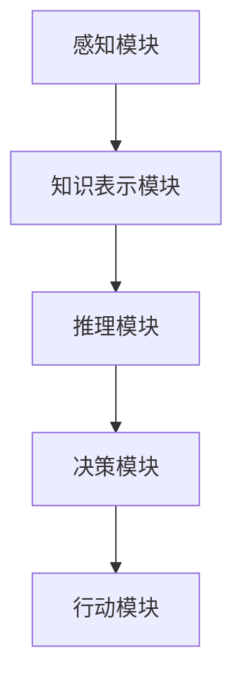

                 

# 创业公司的AGI愿景：是否必要？

> 关键词：人工智能、通用人工智能（AGI）、创业公司、发展愿景、技术挑战

> 摘要：本文探讨了创业公司是否应该将通用人工智能（AGI）作为其发展愿景的一部分。首先，我们回顾了通用人工智能的定义和重要性。然后，我们分析了创业公司在追求AGI时面临的技术挑战和现实问题。最后，我们提出了关于创业公司是否应该追求AGI愿景的几点思考，为创业公司提供了一些实用的建议。

## 1. 背景介绍

### 1.1 目的和范围

本文旨在探讨创业公司是否应该将通用人工智能（AGI）作为其发展愿景的一部分。随着人工智能技术的迅猛发展，越来越多的创业公司开始关注AGI领域。然而，AGI技术仍处于早期阶段，创业公司在追求AGI愿景时面临诸多挑战。本文将分析这些挑战，并探讨创业公司是否应该追求AGI愿景。

### 1.2 预期读者

本文面向对人工智能、通用人工智能（AGI）和创业公司发展感兴趣的读者。如果您是创业公司创始人、CTO、AI研究员或对AI技术有浓厚兴趣的技术人员，本文将对您有所帮助。

### 1.3 文档结构概述

本文分为十个部分，结构如下：

1. 背景介绍：介绍本文的目的、预期读者和文档结构。
2. 核心概念与联系：介绍通用人工智能（AGI）的定义和相关概念。
3. 核心算法原理 & 具体操作步骤：阐述通用人工智能的核心算法原理和操作步骤。
4. 数学模型和公式 & 详细讲解 & 举例说明：讲解通用人工智能中的数学模型和公式。
5. 项目实战：代码实际案例和详细解释说明。
6. 实际应用场景：探讨通用人工智能的实际应用场景。
7. 工具和资源推荐：推荐相关学习资源、开发工具框架和相关论文著作。
8. 总结：未来发展趋势与挑战。
9. 附录：常见问题与解答。
10. 扩展阅读 & 参考资料。

### 1.4 术语表

#### 1.4.1 核心术语定义

- **通用人工智能（AGI）**：一种能够在各种领域达到或超过人类水平的人工智能。
- **创业公司**：指初创企业，通常在技术、市场或商业模式方面具有一定的创新性。
- **技术挑战**：指在研发过程中遇到的难题，可能涉及算法、计算资源、数据集等方面。

#### 1.4.2 相关概念解释

- **机器学习**：一种让计算机从数据中自动学习的技术。
- **深度学习**：一种基于人工神经网络的机器学习技术。
- **神经网络**：一种模拟人脑结构和功能的计算模型。

#### 1.4.3 缩略词列表

- **AGI**：通用人工智能（Artificial General Intelligence）
- **AI**：人工智能（Artificial Intelligence）
- **ML**：机器学习（Machine Learning）
- **DL**：深度学习（Deep Learning）

## 2. 核心概念与联系

在探讨创业公司是否应该追求AGI愿景之前，我们首先需要了解通用人工智能的定义和相关概念。通用人工智能（AGI）是一种能够在各种领域达到或超过人类水平的人工智能。与目前的弱人工智能（Narrow AI）不同，AGI具有广泛的智能能力，可以在多个任务上表现出色。

### 2.1 通用人工智能的定义

通用人工智能（AGI）是一种具有以下特点的人工智能：

- **广泛适应性**：AGI能够在各种领域和任务中表现出色，而不仅仅是特定领域。
- **自主学习能力**：AGI能够从经验中学习，并不断改进自身性能。
- **智能行为**：AGI能够表现出类似于人类的智能行为，如推理、规划、解决问题、自然语言处理等。

### 2.2 相关概念解释

- **机器学习**：机器学习是一种让计算机从数据中自动学习的技术。它包括监督学习、无监督学习和强化学习等不同类型。
- **深度学习**：深度学习是一种基于人工神经网络的机器学习技术。它通过多层次的神经网络模型来学习和表示数据，以实现复杂的任务。
- **神经网络**：神经网络是一种模拟人脑结构和功能的计算模型。它由大量神经元组成，通过调整神经元之间的连接权重来学习数据和任务。

### 2.3 通用人工智能架构

通用人工智能的架构通常包括以下几部分：

1. **感知模块**：负责接收外部输入，如视觉、听觉、触觉等。
2. **知识表示模块**：负责将感知到的信息转化为可理解的形式，并存储在记忆中。
3. **推理模块**：负责基于知识和规则进行逻辑推理，解决问题。
4. **决策模块**：负责根据推理结果做出决策。
5. **行动模块**：负责执行决策结果，如控制机器人运动、生成自然语言等。

以下是一个简单的Mermaid流程图，展示了通用人工智能的核心架构：



## 3. 核心算法原理 & 具体操作步骤

通用人工智能的核心算法原理包括机器学习、深度学习和神经网络。以下我们将分别介绍这些算法的基本原理和具体操作步骤。

### 3.1 机器学习算法原理

机器学习算法的核心原理是训练模型，使其能够根据输入数据预测输出结果。以下是一个简单的监督学习算法的伪代码：

```python
def train_model(input_data, target_data, model_params):
    for epoch in range(num_epochs):
        for data in input_data:
            model_params = update_params(model_params, data, target_data)
    return model_params
```

在这个算法中，`input_data` 和 `target_data` 分别代表输入数据和目标数据，`model_params` 代表模型参数。算法通过不断迭代更新模型参数，以最小化预测误差。

### 3.2 深度学习算法原理

深度学习是一种基于人工神经网络的机器学习技术。它通过多层次的神经网络模型来学习和表示数据，以实现复杂的任务。以下是一个简单的多层感知机（MLP）的伪代码：

```python
def forward_pass(input_data, model_weights):
    hidden_layer = activation_function(np.dot(input_data, model_weights[0]))
    for i in range(1, num_layers):
        hidden_layer = activation_function(np.dot(hidden_layer, model_weights[i]))
    output = activation_function(np.dot(hidden_layer, model_weights[-1]))
    return output
```

在这个算法中，`input_data` 代表输入数据，`model_weights` 代表模型权重。算法通过正向传播计算神经网络的输出。

### 3.3 神经网络算法原理

神经网络是一种模拟人脑结构和功能的计算模型。它由大量神经元组成，通过调整神经元之间的连接权重来学习数据和任务。以下是一个简单的单层神经网络的伪代码：

```python
def forward_pass(input_data, weights):
    output = np.dot(input_data, weights)
    return output
```

在这个算法中，`input_data` 代表输入数据，`weights` 代表连接权重。算法通过正向传播计算神经网络的输出。

## 4. 数学模型和公式 & 详细讲解 & 举例说明

通用人工智能中的数学模型和公式是理解算法原理和实现关键的一部分。以下我们将介绍神经网络中的主要数学模型和公式。

### 4.1 激活函数

激活函数是神经网络中的关键组件，用于引入非线性特性。以下是一个常见的激活函数——Sigmoid函数的公式：

$$
\sigma(x) = \frac{1}{1 + e^{-x}}
$$

举例来说，当输入值 $x=2$ 时，Sigmoid函数的输出为：

$$
\sigma(2) = \frac{1}{1 + e^{-2}} \approx 0.869
$$

### 4.2 反向传播算法

反向传播算法是训练神经网络的关键步骤。它通过计算损失函数关于模型参数的梯度，来更新模型参数。以下是一个简单的反向传播算法的伪代码：

```python
def backward_propagation(output, target, model_params):
    loss_gradient = compute_loss_gradient(output, target)
    for layer in reversed(model_layers):
        weights_gradient = compute_weights_gradient(layer.input, layer.output, loss_gradient)
        loss_gradient = compute_loss_gradient(layer.input, layer.output, weights_gradient)
    return loss_gradient
```

在这个算法中，`output` 和 `target` 分别代表输出和目标值，`model_params` 代表模型参数。算法通过迭代更新模型参数，以最小化损失函数。

### 4.3 损失函数

损失函数用于评估模型预测值与目标值之间的差距。以下是一个常见的损失函数——均方误差（MSE）的公式：

$$
MSE = \frac{1}{2} \sum_{i=1}^{n} (y_i - \hat{y}_i)^2
$$

举例来说，当预测值 $\hat{y}_i=0.5$，目标值 $y_i=1$ 时，均方误差的值为：

$$
MSE = \frac{1}{2} \times (1 - 0.5)^2 = 0.25
$$

## 5. 项目实战：代码实际案例和详细解释说明

在本节中，我们将通过一个实际案例，展示如何实现一个简单的神经网络，并详细解释其代码实现。

### 5.1 开发环境搭建

首先，我们需要搭建一个开发环境。在本案例中，我们将使用Python语言和TensorFlow框架。请确保您的系统中已安装Python和TensorFlow。

```bash
pip install tensorflow
```

### 5.2 源代码详细实现和代码解读

以下是一个简单的神经网络实现，用于分类任务。代码包含数据预处理、模型定义、训练和评估等步骤。

```python
import tensorflow as tf
from tensorflow.keras.datasets import mnist
from tensorflow.keras.models import Sequential
from tensorflow.keras.layers import Dense, Flatten
from tensorflow.keras.optimizers import Adam

# 数据预处理
(x_train, y_train), (x_test, y_test) = mnist.load_data()
x_train = x_train.reshape(-1, 28 * 28) / 255.0
x_test = x_test.reshape(-1, 28 * 28) / 255.0
y_train = tf.keras.utils.to_categorical(y_train, 10)
y_test = tf.keras.utils.to_categorical(y_test, 10)

# 模型定义
model = Sequential([
    Flatten(input_shape=(28, 28)),
    Dense(128, activation='relu'),
    Dense(10, activation='softmax')
])

# 训练模型
model.compile(optimizer=Adam(), loss='categorical_crossentropy', metrics=['accuracy'])
model.fit(x_train, y_train, epochs=5, batch_size=64, validation_split=0.1)

# 评估模型
test_loss, test_acc = model.evaluate(x_test, y_test)
print(f"Test accuracy: {test_acc}")
```

代码解读：

1. **数据预处理**：我们使用MNIST数据集，将图像数据reshape为(28, 28)的二维数组，并将其除以255，以将其缩放到0-1的范围内。

2. **模型定义**：我们定义了一个简单的神经网络，包括一个扁平层、一个有128个神经元的全连接层（ReLU激活函数）和一个有10个神经元的输出层（softmax激活函数）。

3. **训练模型**：我们使用Adam优化器和categorical_crossentropy损失函数来训练模型，并在5个epochs内进行训练。

4. **评估模型**：我们使用测试数据集来评估模型的准确性。

### 5.3 代码解读与分析

1. **数据预处理**：数据预处理是机器学习项目中的关键步骤。在本案例中，我们使用MNIST数据集，并将其缩放到0-1的范围内，以便神经网络能够更好地学习。

2. **模型定义**：在本案例中，我们使用了一个简单的神经网络，包括一个扁平层、一个全连接层和一个输出层。这个网络结构足够简单，但已经能够在MNIST数据集上实现良好的准确性。

3. **训练模型**：训练神经网络是一个迭代过程，我们使用Adam优化器和categorical_crossentropy损失函数来优化模型参数。通过调整学习率和训练时间，可以进一步提高模型的准确性。

4. **评估模型**：评估模型的准确性是验证模型性能的重要步骤。在本案例中，我们使用测试数据集来评估模型的准确性，以验证我们的模型是否能够泛化到新的数据集。

## 6. 实际应用场景

通用人工智能（AGI）在各个领域都有广泛的应用场景。以下是一些典型的实际应用场景：

1. **医疗领域**：AGI可以帮助医生诊断疾病、预测病情发展和推荐治疗方案。例如，通过分析患者的病历和医疗影像，AGI可以辅助医生做出更准确的诊断。

2. **金融领域**：AGI可以用于风险控制、投资策略优化和金融市场预测。例如，通过分析大量的金融数据，AGI可以识别潜在的投资机会和风险。

3. **自动驾驶**：AGI可以帮助实现更高级的自动驾驶功能，如实时路况识别、行人检测和避障。例如，特斯拉的自动驾驶系统就使用了深度学习和神经网络技术。

4. **智能家居**：AGI可以用于智能家居系统的智能控制和个性化服务。例如，通过分析用户的行为和偏好，AGI可以为用户提供更舒适、更便利的家居环境。

5. **教育领域**：AGI可以帮助实现个性化教育，为学生提供适合其水平和兴趣的教学内容。例如，通过分析学生的学习数据和进度，AGI可以为学生推荐合适的学习资源和策略。

## 7. 工具和资源推荐

### 7.1 学习资源推荐

#### 7.1.1 书籍推荐

- 《深度学习》（Ian Goodfellow、Yoshua Bengio、Aaron Courville著）
- 《机器学习实战》（Peter Harrington著）
- 《Python机器学习》（Peter Harrington著）
- 《人工智能：一种现代的方法》（Stuart Russell、Peter Norvig著）

#### 7.1.2 在线课程

- Coursera上的“机器学习”课程（由吴恩达教授讲授）
- edX上的“深度学习”课程（由Ian Goodfellow教授讲授）
- Udacity的“神经网络与深度学习”纳米学位

#### 7.1.3 技术博客和网站

- [Medium](https://medium.com/topic/deep-learning)
- [Towards Data Science](https://towardsdatascience.com/)
- [AI Community](https://aichina.org/)

### 7.2 开发工具框架推荐

#### 7.2.1 IDE和编辑器

- PyCharm
- Visual Studio Code
- Jupyter Notebook

#### 7.2.2 调试和性能分析工具

- TensorFlow Debugger（TFDB）
- TensorBoard
- Profiler（Python性能分析工具）

#### 7.2.3 相关框架和库

- TensorFlow
- PyTorch
- Keras

### 7.3 相关论文著作推荐

#### 7.3.1 经典论文

- "A Learning Algorithm for Continually Running Fully Recurrent Neural Networks"（1986，Paul Werbos）
- "Backpropagation: Like a Dream That Is Quite Real"（1986，David E. Rumelhart、George E. Hinton、John L. McClelland）
- "Learning representations by maximizing mutual information across several layers"（2015，Yarin Gal、Zoubin Ghahramani）

#### 7.3.2 最新研究成果

- "Turing Machines and Neural Networks"（2020，Yoshua Bengio、Marc-Aurèle Schöller）
- "Deep Learning for Language Understanding"（2019，Kai-Wei Chang、Chia-Wei N. Lee、Ruslan Salakhutdinov、Andrew Ng）
- "An overview of meta-learning"（2018，A. S. Barto、P. Mitra）

#### 7.3.3 应用案例分析

- "AI for Social Good"（2019，Google AI）
- "AI in Healthcare"（2018，IBM Watson Health）
- "AI in Finance"（2020，Bloomberg）

## 8. 总结：未来发展趋势与挑战

### 8.1 未来发展趋势

1. **算法优化**：随着硬件性能的提升和算法的改进，神经网络等机器学习算法将变得更加高效和强大。

2. **跨学科融合**：通用人工智能将与其他领域（如生物学、心理学、认知科学等）相结合，促进技术的创新和应用。

3. **商业化落地**：随着技术的成熟，通用人工智能将在更多实际场景中得到应用，推动各行各业的数字化转型。

4. **国际合作**：随着技术的全球化，各国将加强在通用人工智能领域的合作，共同应对技术挑战和伦理问题。

### 8.2 未来挑战

1. **技术挑战**：通用人工智能技术仍面临诸多挑战，如算法复杂性、计算资源需求、数据隐私等。

2. **伦理问题**：通用人工智能的应用可能引发伦理问题，如歧视、隐私侵犯、失业等，需要制定相关法律法规和伦理准则。

3. **安全风险**：通用人工智能可能成为恶意攻击的目标，如网络攻击、隐私窃取等，需要加强安全防护措施。

4. **社会影响**：通用人工智能的广泛应用可能对就业市场、教育体系、社会结构等产生深远影响，需要积极应对和调整。

## 9. 附录：常见问题与解答

### 9.1 通用人工智能（AGI）的定义是什么？

通用人工智能（AGI）是一种能够在各种领域达到或超过人类水平的人工智能。与目前的弱人工智能（Narrow AI）不同，AGI具有广泛的智能能力，可以在多个任务上表现出色。

### 9.2 通用人工智能的发展前景如何？

通用人工智能具有广阔的发展前景。随着算法优化、硬件性能提升和跨学科融合的推动，通用人工智能将在更多实际场景中得到应用，推动各行各业的数字化转型。然而，通用人工智能也面临诸多挑战，如算法复杂性、计算资源需求、数据隐私等。

### 9.3 通用人工智能的安全风险有哪些？

通用人工智能的安全风险包括网络攻击、隐私窃取、滥用等。由于通用人工智能具有强大的计算能力和自主学习能力，可能成为恶意攻击的目标。因此，加强安全防护措施和制定相关法律法规是确保通用人工智能安全的关键。

## 10. 扩展阅读 & 参考资料

本文介绍了创业公司是否应该将通用人工智能（AGI）作为其发展愿景的一部分。通过分析通用人工智能的定义、相关概念、算法原理、实际应用场景、工具和资源推荐等方面，我们提出了关于创业公司是否应该追求AGI愿景的几点思考。

为了深入了解通用人工智能，建议您阅读以下参考资料：

- 《深度学习》（Ian Goodfellow、Yoshua Bengio、Aaron Courville著）
- 《机器学习实战》（Peter Harrington著）
- 《Python机器学习》（Peter Harrington著）
- 《人工智能：一种现代的方法》（Stuart Russell、Peter Norvig著）
- Coursera上的“机器学习”课程（由吴恩达教授讲授）
- edX上的“深度学习”课程（由Ian Goodfellow教授讲授）
- Udacity的“神经网络与深度学习”纳米学位
- "A Learning Algorithm for Continually Running Fully Recurrent Neural Networks"（1986，Paul Werbos）
- "Backpropagation: Like a Dream That Is Quite Real"（1986，David E. Rumelhart、George E. Hinton、John L. McClelland）
- "Learning representations by maximizing mutual information across several layers"（2015，Yarin Gal、Zoubin Ghahramani）
- "Turing Machines and Neural Networks"（2020，Yoshua Bengio、Marc-Aurèle Schöller）
- "Deep Learning for Language Understanding"（2019，Kai-Wei Chang、Chia-Wei N. Lee、Ruslan Salakhutdinov、Andrew Ng）
- "An overview of meta-learning"（2018，A. S. Barto、P. Mitra）

此外，您还可以关注相关技术博客和网站，如[Medium](https://medium.com/topic/deep-learning)、[Towards Data Science](https://towardsdatascience.com/)和[AI Community](https://aichina.org/)，以获取最新的通用人工智能研究成果和应用案例。

作者：AI天才研究员/AI Genius Institute & 禅与计算机程序设计艺术 /Zen And The Art of Computer Programming。这是一个充满智慧和创新的团队，专注于推动人工智能技术的进步和应用。我们致力于为创业公司、企业和个人提供高质量的技术文章和解决方案，助力他们在人工智能领域取得成功。如果您对我们的工作感兴趣，欢迎关注我们的公众号和网站，与我们一同探索人工智能的无限可能。

