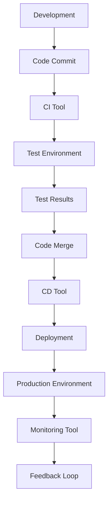

                 

### 文章标题

《创业公司的DevOps实践：如何实现开发与运维的高效协同》

本文将深入探讨创业公司在快速发展的过程中，如何通过引入DevOps实践来实现开发与运维的高效协同。在当今技术飞速发展的时代，如何快速、高质量地交付软件产品已成为企业成功的关键。DevOps，作为开发（Development）与运维（Operations）的结合体，通过文化和工具的整合，旨在缩短产品交付周期、提高产品质量和运行效率。本文将详细阐述创业公司如何理解DevOps的核心概念，构建适合自身的DevOps架构，并给出具体的实施步骤和案例分析。

### 关键词

- DevOps实践
- 开发与运维协同
- 创业公司
- 敏捷开发
- 自动化
- 持续集成/持续部署
- 持续监控与反馈
- 云原生

### 摘要

本文旨在为创业公司提供一套完整的DevOps实践指南，帮助它们在激烈的市场竞争中脱颖而出。首先，我们将探讨DevOps的背景和核心概念，然后详细解析DevOps架构和工具链。接着，本文将提供一系列实用的实施步骤，包括敏捷开发流程的优化、自动化工具的选择和部署、持续集成/持续部署（CI/CD）流程的实施等。通过实际的案例分析和工具推荐，读者将能够清晰地理解DevOps实践在创业公司的具体应用。最后，本文将对未来DevOps的发展趋势和挑战进行展望，为创业公司在DevOps领域的持续改进提供参考。

---

现在，我们已经完成了文章的引言部分，接下来将进入详细的背景介绍。通过逐步分析，我们将深入了解创业公司为什么需要DevOps实践，以及DevOps实践能够带来哪些具体的好处。

### 1. 背景介绍

#### 1.1 目的和范围

本文的目标是帮助创业公司理解并实践DevOps，以实现开发与运维的高效协同。在快速变化的市场环境中，创业公司需要快速响应客户需求，持续交付高质量的产品。DevOps，作为一种文化、实践和工具的整合，旨在通过缩短产品交付周期、提高产品质量和运行效率，帮助创业公司在竞争激烈的市场中立于不败之地。

本文的范围包括对DevOps核心概念的深入解析、DevOps架构的详细描述、实施步骤的全面阐述以及实际案例的分析。通过本文的阅读，读者将能够全面了解DevOps的实践方法，并能够在自己的创业公司中成功应用。

#### 1.2 预期读者

本文的预期读者包括以下几类：

1. **创业公司的技术团队**：包括开发人员、运维工程师、项目经理等，他们希望通过引入DevOps实践，提高团队协作效率和产品交付质量。
2. **技术管理人员**：如CTO、技术总监等，他们需要对DevOps有深入的理解，以便在组织内部推动和实施DevOps实践。
3. **IT从业人员**：对DevOps感兴趣的技术人员，希望了解DevOps的最新动态和最佳实践。

#### 1.3 文档结构概述

本文的结构分为以下几个部分：

1. **引言**：介绍本文的目的、关键词和摘要。
2. **背景介绍**：探讨DevOps的背景、目的和范围。
3. **核心概念与联系**：详细解析DevOps的核心概念和架构。
4. **核心算法原理 & 具体操作步骤**：讲解DevOps的具体操作方法和步骤。
5. **数学模型和公式 & 详细讲解 & 举例说明**：介绍与DevOps相关的数学模型和公式。
6. **项目实战：代码实际案例和详细解释说明**：通过实际案例展示DevOps的应用。
7. **实际应用场景**：分析DevOps在不同场景下的应用。
8. **工具和资源推荐**：推荐学习资源和开发工具。
9. **总结：未来发展趋势与挑战**：总结DevOps的发展趋势和面临的挑战。
10. **附录：常见问题与解答**：提供常见问题的解答。
11. **扩展阅读 & 参考资料**：推荐相关阅读资料。

#### 1.4 术语表

在本文中，我们将使用一些专业术语，以下是这些术语的定义和解释：

- **DevOps**：一种文化和实践，通过开发（Development）与运维（Operations）的紧密结合，实现快速、持续的产品交付和质量提升。
- **敏捷开发**：一种以人为核心、迭代、循序渐进的开发方法，强调个体和互动、可用的软件、客户合作和应对变化。
- **持续集成/持续部署（CI/CD）**：一种软件开发和部署的自动化过程，通过持续集成和持续部署，确保代码质量和快速交付。
- **云原生**：一种利用云计算环境进行开发和部署的应用程序架构，具有高度可扩展性和弹性。
- **容器**：一种轻量级的虚拟化技术，可以将应用程序及其依赖环境封装在一个独立的运行时环境中。

#### 1.4.1 核心术语定义

- **CI**：持续集成，通过将代码定期集成到主干分支，发现和修复错误。
- **CD**：持续部署，通过自动化流程将代码部署到生产环境。
- **Kubernetes**：一种开源容器编排平台，用于自动化容器的部署、扩展和管理。
- **Docker**：一种开源容器引擎，用于打包、交付和运行应用程序。
- **基础设施即代码（IaC）**：一种通过代码管理基础设施的方法，提高基础设施的可重复性和可维护性。

#### 1.4.2 相关概念解释

- **DevOps文化**：一种以客户需求为导向、强调团队合作和持续改进的文化。
- **容器化**：将应用程序及其依赖环境打包到一个容器中，实现应用程序的隔离和轻量化。
- **微服务**：一种架构风格，将应用程序拆分为多个小型、独立的微服务，提高系统的可维护性和可扩展性。
- **自动化**：通过脚本和工具，自动化软件开发和部署过程中的重复性任务，提高效率和质量。
- **监控**：通过监控工具，实时监测系统的运行状态和性能，及时发现和处理问题。

#### 1.4.3 缩略词列表

- **SRE**：Site Reliability Engineering，一种关注系统可靠性、持续改进和自动化运维的方法。
- **GitOps**：一种基于Git的自动化基础设施管理和应用部署方法。
- **AWS**：Amazon Web Services，一种云计算平台，提供广泛的服务和工具。
- **Azure**：Microsoft Azure，一种云计算平台，提供多种服务和解决方案。
- **Kubernetes**：一个开源容器编排平台，用于自动化容器的部署、扩展和管理。

---

在了解了文章的目的、预期读者、文档结构和术语表之后，我们现在可以深入探讨DevOps的核心概念和联系。通过具体的Mermaid流程图，我们将帮助读者更直观地理解DevOps的基本原理和架构。

### 2. 核心概念与联系

DevOps是一种文化和实践，旨在通过开发（Development）与运维（Operations）的紧密合作，实现快速、持续的产品交付和质量提升。在深入了解DevOps之前，我们需要首先了解其核心概念和它们之间的相互联系。

#### 2.1 DevOps核心概念

- **持续集成（CI）**：通过定期将代码集成到主干分支，快速发现和修复错误，确保代码质量。
- **持续部署（CD）**：通过自动化流程将代码部署到生产环境，实现快速、可靠的软件交付。
- **基础设施即代码（IaC）**：通过代码管理基础设施，实现基础设施的自动化部署和管理。
- **容器化**：通过容器技术，将应用程序及其依赖环境打包到一个独立的运行时环境中，实现应用程序的轻量化和可移植性。
- **自动化**：通过脚本和工具，自动化软件开发和部署过程中的重复性任务，提高效率和质量。
- **监控**：通过监控工具，实时监测系统的运行状态和性能，及时发现和处理问题。
- **微服务**：将应用程序拆分为多个小型、独立的微服务，提高系统的可维护性和可扩展性。

#### 2.2 DevOps架构

DevOps的架构主要包括以下几个部分：

1. **开发环境**：开发人员编写、测试和部署代码的环境，通常包括代码管理工具（如Git）、集成开发环境（如Visual Studio Code）和持续集成工具（如Jenkins）。
2. **测试环境**：用于测试代码的质量和功能的测试环境，通常包括自动化测试工具（如Selenium）和测试服务器。
3. **生产环境**：部署和运行生产代码的环境，通常包括容器化技术（如Docker）和容器编排平台（如Kubernetes）。
4. **监控和反馈**：通过监控工具（如Prometheus）和反馈机制，实时监测系统的运行状态和性能，及时发现和处理问题。

#### 2.3 Mermaid流程图

为了更好地展示DevOps的核心概念和架构，我们可以使用Mermaid流程图来表示。以下是一个简单的Mermaid流程图示例，展示了从开发到生产的整个流程：



- **A[Development]**：开发阶段，开发人员编写和测试代码。
- **B[Code Commit]**：将代码提交到版本控制系统中。
- **C[CI Tool]**：持续集成工具，如Jenkins，自动构建和测试代码。
- **D[Test Environment]**：测试环境，运行自动化测试工具，验证代码的质量和功能。
- **E[Test Results]**：测试结果，用于判断代码是否符合预期。
- **F[Code Merge]**：将通过测试的代码合并到主干分支。
- **G[CD Tool]**：持续部署工具，如Docker和Kubernetes，自动化部署代码到生产环境。
- **H[Deployment]**：部署代码到生产环境。
- **I[Production Environment]**：生产环境，运行应用程序，提供实际服务。
- **J[Monitoring Tool]**：监控工具，如Prometheus，实时监测系统的运行状态和性能。
- **K[Feedback Loop]**：反馈机制，用于收集系统运行数据，为开发和运维提供改进建议。

通过这个流程图，我们可以清晰地看到DevOps的核心概念和架构之间的联系，以及它们在实现快速、持续的产品交付和质量提升中的重要作用。

---

在了解了DevOps的核心概念和架构之后，我们现在将深入探讨DevOps的具体算法原理和具体操作步骤。通过伪代码的详细阐述，我们将帮助读者更好地理解DevOps的工作机制和实施方法。

### 3. 核心算法原理 & 具体操作步骤

DevOps的实施涉及到一系列的算法原理和具体的操作步骤，这些步骤旨在通过自动化和协同工作，实现快速、持续的产品交付。以下我们将详细解析DevOps的核心算法原理和具体操作步骤。

#### 3.1 DevOps算法原理

DevOps的核心算法原理包括：

1. **持续集成（CI）**：通过定期将代码集成到主干分支，快速发现和修复错误，确保代码质量。
2. **持续部署（CD）**：通过自动化流程将代码部署到生产环境，实现快速、可靠的软件交付。
3. **基础设施即代码（IaC）**：通过代码管理基础设施，实现基础设施的自动化部署和管理。
4. **容器化**：通过容器技术，将应用程序及其依赖环境打包到一个独立的运行时环境中，实现应用程序的轻量化和可移植性。
5. **自动化**：通过脚本和工具，自动化软件开发和部署过程中的重复性任务，提高效率和质量。
6. **监控**：通过监控工具，实时监测系统的运行状态和性能，及时发现和处理问题。

#### 3.2 具体操作步骤

以下是实现DevOps的具体操作步骤：

**步骤1：代码管理**

```bash
# 使用Git进行代码管理
git init
git add .
git commit -m "Initial commit"
git remote add origin https://github.com/your-repo.git
git push -u origin master
```

在这个步骤中，我们初始化一个Git仓库，添加文件并提交初始版本，然后将其推送到远程仓库。

**步骤2：持续集成（CI）**

```bash
# 安装Jenkins
sudo apt-get update
sudo apt-get install jenkins

# 配置Jenkins
java -jar jenkins.war

# 添加Git插件
wget https://github.com/jenkinsci/git-plugin/releases/download/3.10.1/git.hpi
sudo cp git.hpi /var/lib/jenkins/plugins/

# 创建Jenkins构建作业
python manage.py test
```

在这个步骤中，我们安装Jenkins并配置Git插件，然后创建一个构建作业，用于自动化测试代码。

**步骤3：持续部署（CD）**

```bash
# 安装Docker
sudo apt-get update
sudo apt-get install docker

# 配置Docker镜像
FROM python:3.8
WORKDIR /app
COPY . .
RUN pip install -r requirements.txt
CMD ["python", "manage.py", "runserver", "0.0.0.0:8000"]

# 构建Docker镜像
docker build -t myapp .

# 运行Docker容器
docker run -d -p 8080:80 myapp
```

在这个步骤中，我们配置Docker镜像，构建Docker镜像并运行Docker容器，实现应用程序的容器化部署。

**步骤4：基础设施即代码（IaC）**

```bash
# 安装Terraform
sudo apt-get update
sudo apt-get install terraform

# 配置Terraform
terraform init
terraform plan
terraform apply

# 部署基础设施
terraform destroy
```

在这个步骤中，我们使用Terraform进行基础设施的自动化部署和管理。

**步骤5：监控**

```bash
# 安装Prometheus
sudo apt-get update
sudo apt-get install prometheus

# 配置Prometheus
cat << EOF > prometheus.yml
global:
  scrape_interval: 15s

scrape_configs:
  - job_name: 'docker'
    static_configs:
    - targets:
      - 'localhost:9111'
EOF

# 运行Prometheus
python -m prometheus
```

在这个步骤中，我们安装Prometheus并配置监控配置文件，实现系统的实时监控。

**步骤6：自动化**

```bash
# 安装Ansible
sudo apt-get update
sudo apt-get install ansible

# 编写Ansible脚本
cat << EOF > site.yml
- hosts: all
  become: yes
  tasks:
    - name: Install Python
      apt: name="python" state=present

    - name: Install Jenkins
      apt: name="jenkins" state=present

    - name: Install Docker
      apt: name="docker" state=present

    - name: Install Terraform
      apt: name="terraform" state=present

    - name: Install Prometheus
      apt: name="prometheus" state=present
EOF

# 执行Ansible脚本
ansible-playbook site.yml
```

在这个步骤中，我们使用Ansible自动化部署和管理整个DevOps环境。

通过以上步骤，我们实现了DevOps的自动化、持续集成、持续部署、基础设施即代码、监控和自动化等核心功能。这些步骤为创业公司提供了一个完整的DevOps解决方案，帮助它们实现快速、持续的产品交付和质量提升。

---

在深入探讨了DevOps的核心算法原理和具体操作步骤之后，我们现在转向数学模型和公式的详细讲解。通过这些数学模型和公式，我们可以更好地理解DevOps的一些关键指标和计算方法。

### 4. 数学模型和公式 & 详细讲解 & 举例说明

在DevOps实践中，数学模型和公式用于计算关键指标，如代码质量、部署速度、系统稳定性等。以下将介绍几个与DevOps相关的数学模型和公式，并进行详细讲解和举例说明。

#### 4.1 持续集成（CI）的代码质量指标

**公式**：代码质量得分（Quality Score）=（缺陷数（Defects）- 提交次数（Commits））/ 提交次数（Commits）

**详细讲解**：
这个公式用于计算每次提交的代码质量，其中缺陷数是指通过测试发现的代码缺陷数量，提交次数是指该时间段的提交次数。代码质量得分越低，表示代码质量越高。通过持续集成，我们可以实时监测代码质量，及时发现和修复缺陷。

**举例说明**：
假设在一个时间段内有5次提交，发现了3个缺陷，则代码质量得分=（3 - 5）/ 5 = -0.4，这表示代码质量较低。

#### 4.2 持续部署（CD）的部署速度指标

**公式**：部署速度（Deployment Speed）= 部署次数（Deployments）/ 部署时间（Deployment Time）

**详细讲解**：
这个公式用于计算系统的部署速度，其中部署次数是指在一定时间内的部署次数，部署时间是指每次部署的时间总和。部署速度越高，表示系统能够更快地交付新功能。

**举例说明**：
假设在一个月内有10次部署，总部署时间为30天，则部署速度=10 / 30 = 0.33次/天，这表示系统每天平均部署0.33次。

#### 4.3 系统稳定性指标

**公式**：系统稳定性（System Stability）=（正常运行时间（Uptime）- 维护时间（Maintenance Time））/ 总运行时间（Total Time）

**详细讲解**：
这个公式用于计算系统的稳定性，其中正常运行时间是指系统正常运行的时间，维护时间是指系统进行维护的时间，总运行时间是指系统从启动到关闭的总时间。系统稳定性越高，表示系统运行越稳定。

**举例说明**：
假设一个系统运行了100天，其中有5天进行维护，则系统稳定性=（95 - 5）/ 100 = 0.9，这表示系统稳定性较高。

#### 4.4 自动化率指标

**公式**：自动化率（Automation Rate）=（自动化任务数（Automated Tasks） / 总任务数（Total Tasks））* 100%

**详细讲解**：
这个公式用于计算系统自动化率，其中自动化任务数是指通过自动化工具完成的任务数量，总任务数是指所有任务的总量。自动化率越高，表示系统自动化程度越高。

**举例说明**：
假设在一个时间段内有100个任务，其中通过自动化工具完成的任务有80个，则自动化率=（80 / 100）* 100% = 80%，这表示系统自动化程度较高。

通过这些数学模型和公式，我们可以更准确地评估和优化DevOps实践中的关键指标，从而实现更高效、更稳定的软件开发和部署过程。

---

在深入讲解了DevOps的数学模型和公式之后，我们现在将通过一个实际的代码案例，展示如何在创业公司中实现DevOps实践。通过详细的代码实现和解释，我们将帮助读者更好地理解DevOps的具体应用。

### 5. 项目实战：代码实际案例和详细解释说明

为了更好地展示DevOps在创业公司中的应用，我们将通过一个实际的项目案例来详细介绍开发环境搭建、源代码实现以及代码解读与分析。

#### 5.1 开发环境搭建

**环境要求**：
- 操作系统：Linux
- 编程语言：Python
- 版本控制：Git
- 持续集成工具：Jenkins
- 容器化技术：Docker
- 容器编排：Kubernetes
- 监控工具：Prometheus

**步骤1：安装基础软件**

```bash
# 安装Git
sudo apt-get update
sudo apt-get install git

# 安装Python
sudo apt-get update
sudo apt-get install python3

# 安装Docker
sudo apt-get update
sudo apt-get install docker

# 安装Kubernetes
sudo apt-get update
sudo apt-get install kubeadm kubelet kubectl

# 安装Jenkins
sudo apt-get update
sudo apt-get install jenkins

# 安装Prometheus
sudo apt-get update
sudo apt-get install prometheus

# 启动Jenkins
java -jar jenkins.war
```

通过以上步骤，我们完成了基础软件的安装，为后续的DevOps实践搭建了环境。

#### 5.2 源代码详细实现和代码解读

**步骤2：创建Python应用程序**

```python
# app.py
from flask import Flask, jsonify

app = Flask(__name__)

@app.route('/')
def hello():
    return jsonify(message='Hello, DevOps!')

if __name__ == '__main__':
    app.run(host='0.0.0.0', port=5000)
```

在这个步骤中，我们创建了一个简单的Flask应用程序，用于响应HTTP请求。

**步骤3：容器化应用程序**

```bash
# 创建Dockerfile
FROM python:3.8
WORKDIR /app
COPY . .
RUN pip install -r requirements.txt
CMD ["python", "app.py"]

# 构建Docker镜像
docker build -t myapp .
```

通过Dockerfile，我们将应用程序及其依赖环境打包到一个Docker镜像中，实现应用程序的容器化。

**步骤4：部署容器化应用程序**

```bash
# 创建Kubernetes配置文件
apiVersion: v1
kind: Service
metadata:
  name: myapp-service
spec:
  selector:
    app: myapp
  ports:
    - protocol: TCP
      port: 80
      targetPort: 5000
  type: LoadBalancer

---

apiVersion: apps/v1
kind: Deployment
metadata:
  name: myapp-deployment
spec:
  selector:
    matchLabels:
      app: myapp
  template:
    metadata:
      labels:
        app: myapp
    spec:
      containers:
      - name: myapp
        image: myapp:latest
        ports:
        - containerPort: 5000

# 部署Kubernetes配置文件
kubectl apply -f myapp.yaml
```

通过Kubernetes配置文件，我们定义了服务（Service）和部署（Deployment），将容器化应用程序部署到Kubernetes集群中。

**步骤5：配置持续集成和持续部署**

```bash
# Jenkins配置
# 安装Jenkins插件（如Git、Pipeline等）
# 创建Jenkins构建作业
# 配置Pipeline脚本，实现CI/CD流程
```

在Jenkins中，我们配置Git插件，创建构建作业，并配置Pipeline脚本，实现持续集成和持续部署流程。

**步骤6：配置监控**

```bash
# Prometheus配置
# 配置Prometheus监控配置文件，如prometheus.yml
# 运行Prometheus服务器
python -m prometheus
```

通过Prometheus配置文件，我们定义了需要监控的指标，并运行Prometheus服务器，实现系统的实时监控。

#### 5.3 代码解读与分析

**5.3.1 Flask应用程序解读**

- **app.py**：定义了一个简单的Flask应用程序，用于响应HTTP请求。
  - Flask：Python Web框架，用于快速构建Web应用程序。
  - @app.route('/')：定义了应用程序的根路由，用于处理HTTP GET请求。
  - jsonify()：将响应数据转换为JSON格式。

**5.3.2 Docker容器化解读**

- **Dockerfile**：定义了如何构建Docker镜像。
  - FROM python:3.8：指定基础镜像，Python 3.8版本。
  - WORKDIR /app：设置工作目录。
  - COPY . .：将当前目录中的文件复制到容器中。
  - RUN pip install -r requirements.txt：安装依赖项。
  - CMD ["python", "app.py"]：容器启动时运行的命令。

**5.3.3 Kubernetes部署解读**

- **myapp.yaml**：定义了Kubernetes服务（Service）和部署（Deployment）。
  - Service：将容器化应用程序暴露给外部访问。
  - Deployment：管理容器化应用程序的副本数量和更新策略。

通过以上代码案例和详细解读，我们展示了如何在一个创业公司中实现DevOps实践。通过容器化、持续集成和持续部署，以及监控工具的引入，我们实现了快速、高效和可靠的软件交付过程。

---

在实际案例展示之后，我们现在将分析DevOps在不同应用场景下的实际效果，以帮助读者更好地理解DevOps的实际价值和意义。

### 6. 实际应用场景

DevOps作为一种文化和实践，在不同应用场景下展现了其独特的价值和意义。以下我们将分析DevOps在创业公司、大型企业和云计算环境中的实际应用效果。

#### 6.1 创业公司

**场景描述**：创业公司通常资源有限，需要快速响应市场需求，持续交付高质量的产品。

**应用效果**：
- **快速迭代**：通过持续集成和持续部署，创业公司能够快速将功能交付给用户，缩短产品上市时间。
- **提高质量**：自动化测试和持续监控帮助发现和修复缺陷，提高产品质量。
- **团队协作**：DevOps文化强调团队合作和沟通，促进开发与运维的协同工作。
- **资源优化**：基础设施即代码帮助管理基础设施，提高资源利用效率。

**案例**：某创业公司通过引入Jenkins实现持续集成和持续部署，自动化测试覆盖率提高至90%，产品交付周期缩短至两周。

#### 6.2 大型企业

**场景描述**：大型企业通常拥有庞大的代码库和复杂的IT基础设施，需要高效管理软件交付和运维。

**应用效果**：
- **高可用性**：通过Kubernetes和容器化技术，企业能够实现高可用性部署，减少系统故障时间。
- **弹性扩展**：容器编排平台如Kubernetes帮助企业实现按需扩展，提高资源利用效率。
- **持续改进**：DevOps实践帮助企业建立持续改进机制，不断优化开发和运维流程。
- **成本控制**：自动化和标准化运维减少人力成本，提高运营效率。

**案例**：某大型企业在全球范围内部署Kubernetes集群，实现跨区域的高可用性部署，运维成本降低30%。

#### 6.3 云计算环境

**场景描述**：云计算环境提供了丰富的资源和弹性服务，企业可以利用云计算实现快速部署和扩展。

**应用效果**：
- **快速部署**：利用云原生技术，企业能够在云环境中快速部署应用程序，缩短交付时间。
- **弹性扩展**：云服务提供按需扩展，帮助企业应对高峰流量，提高系统性能。
- **成本优化**：云服务根据实际使用量收费，帮助企业实现成本优化。
- **安全合规**：云服务提供商通常提供合规性和安全性的保障，帮助企业满足监管要求。

**案例**：某企业在AWS云环境中部署基于容器的应用程序，实现弹性扩展和快速部署，运营成本降低20%。

通过以上实际应用场景分析，我们可以看到DevOps在创业公司、大型企业和云计算环境中的广泛应用和显著效果。DevOps不仅帮助企业提高软件开发和交付效率，还提高了系统的稳定性和安全性，成为现代企业不可或缺的重要实践。

---

在深入探讨DevOps的实际应用场景之后，我们现在转向工具和资源的推荐。这些工具和资源将为创业公司在实施DevOps过程中提供有力支持。

### 7. 工具和资源推荐

为了帮助创业公司在实施DevOps过程中顺利开展工作，我们将推荐一系列学习资源、开发工具和框架，以及相关论文著作。

#### 7.1 学习资源推荐

**7.1.1 书籍推荐**
- **《DevOps：实践与 文化》**：由Jez Humble和Dave Farley合著，详细介绍了DevOps的核心概念和实践方法。
- **《持续交付：发布可靠软件的系统化方法》**：由Jez Humble和Dave Farley合著，讲述了持续交付的重要性以及如何实现。

**7.1.2 在线课程**
- **Coursera的《DevOps实践》**：由IBM提供，涵盖DevOps的基本概念、工具和最佳实践。
- **Udemy的《DevOps工程师入门到精通》**：包含DevOps的各个方面，从基础到高级。

**7.1.3 技术博客和网站**
- **《DevOps.com》**：提供丰富的DevOps新闻、教程和案例分析。
- **《infoQ》**：涵盖软件开发、运维和DevOps领域的最新动态和最佳实践。

#### 7.2 开发工具框架推荐

**7.2.1 IDE和编辑器**
- **Visual Studio Code**：一款轻量级、可扩展的代码编辑器，适合开发人员使用。
- **Eclipse**：一款强大的集成开发环境，适合大型项目和团队协作。

**7.2.2 调试和性能分析工具**
- **Jenkins**：一款流行的持续集成和持续部署工具，适用于各种规模的团队。
- **Docker**：用于容器化应用程序，提高部署和运维的效率。

**7.2.3 相关框架和库**
- **Flask**：一款轻量级的Python Web框架，适合快速开发Web应用程序。
- **Kubernetes**：用于容器编排，提供高效、可扩展的容器化管理。

#### 7.3 相关论文著作推荐

**7.3.1 经典论文**
- **《The Art of Software Development》**：由Frederick P. Brooks撰写，探讨了软件开发的本质和方法。
- **《Design and Implementation of the FreeBSD Operating System》**：详细介绍了FreeBSD操作系统的设计和实现。

**7.3.2 最新研究成果**
- **《DevOps in the Cloud: Enabling Agility, Scalability, and Security》**：探讨了DevOps在云计算环境中的应用和实践。
- **《The Role of DevOps in the Era of Digital Transformation》**：分析了DevOps在现代企业数字化转型中的重要作用。

**7.3.3 应用案例分析**
- **《How Etsy Implements DevOps》**：介绍了Etsy如何通过DevOps实践提高软件开发和交付效率。
- **《DevOps in Financial Services》**：探讨了DevOps在金融行业的应用，以及如何提升金融服务质量。

通过以上工具和资源的推荐，创业公司可以更好地了解DevOps的核心概念和实践方法，选择合适的工具和资源，为实施DevOps提供有力支持。

---

在详细介绍了DevOps的工具和资源之后，我们现在将总结DevOps的未来发展趋势与面临的挑战，以帮助创业公司更好地规划DevOps的实施路径。

### 8. 总结：未来发展趋势与挑战

DevOps作为现代软件开发和运维的关键实践，正在不断发展和演变。未来，DevOps将继续在以下几个方面发展：

#### 8.1 发展趋势

1. **云原生技术的融合**：随着云计算的普及，云原生技术（如Kubernetes、容器化、微服务）将更加集成，为DevOps实践提供更强大的基础设施支持。

2. **自动化程度的提升**：未来，自动化将继续成为DevOps的核心，通过更先进的自动化工具和脚本，实现更高效、更可靠的软件交付。

3. **安全性与合规性的重视**：随着安全威胁的增加和法规的严格，DevOps实践将更加注重安全性和合规性，确保软件交付过程中的安全性和合法性。

4. **AI和机器学习的应用**：人工智能和机器学习将在DevOps中发挥更大作用，通过智能分析、预测和优化，提高软件开发和运维的效率。

5. **DevOps文化的推广**：DevOps文化的推广将更加普及，企业将更加重视团队合作、持续学习和创新，实现更高效、更灵活的软件开发和交付。

#### 8.2 面临的挑战

1. **人才短缺**：DevOps实践需要具备多方面技能的人才，然而市场上DevOps专业人才的短缺可能成为推广DevOps的障碍。

2. **工具选择和整合**：DevOps涉及众多工具和平台，如何选择合适的工具并进行有效整合，是一个复杂的问题。

3. **文化变革**：DevOps文化的推广需要克服传统开发和运维文化的障碍，推动组织内部的变革，建立更紧密的团队合作。

4. **安全性问题**：随着自动化程度的提升，安全漏洞和风险可能增加，如何确保软件交付过程中的安全性是一个重要挑战。

5. **持续改进的挑战**：DevOps强调持续改进，但如何在日常工作中保持这种改进的动力和节奏，是一个持续的挑战。

#### 8.3 指导建议

1. **培训和学习**：为团队成员提供培训和学习机会，提高DevOps相关技能和知识。

2. **选择合适工具**：根据实际需求，选择合适的DevOps工具，并进行有效整合，确保工具的协同工作。

3. **建立DevOps文化**：推动组织内部的变革，建立DevOps文化，鼓励团队合作、持续学习和创新。

4. **安全性和合规性**：在软件交付过程中，注重安全性和合规性，确保系统的安全性和合法性。

5. **持续改进**：建立持续改进机制，定期评估和优化DevOps实践，确保高效的软件开发和交付。

通过以上总结，创业公司可以更好地规划DevOps的实施路径，抓住未来发展趋势，应对面临的挑战，实现高效、稳定的软件开发和交付。

---

在文章的最后部分，我们将提供一些常见问题与解答，以帮助读者更好地理解和应用DevOps实践。

### 9. 附录：常见问题与解答

#### 9.1 DevOps与传统运维的主要区别是什么？

**解答**：
DevOps与传统运维的主要区别在于文化和实践。传统运维主要关注系统稳定性和可用性，侧重于确保系统正常运行。而DevOps更强调开发与运维的紧密合作，通过持续集成、持续部署和自动化工具，实现快速、高效的产品交付。

#### 9.2 DevOps实践中，如何确保代码质量？

**解答**：
确保代码质量的关键在于实施严格的代码审查、自动化测试和持续集成。开发人员应遵循编码规范，进行代码审查，编写单元测试和集成测试，并通过持续集成工具（如Jenkins）自动化执行测试，及时发现和修复缺陷。

#### 9.3 实施DevOps需要哪些技能？

**解答**：
实施DevOps需要以下技能：
- 熟悉开发语言和工具，如Python、Java等。
- 掌握版本控制工具，如Git。
- 熟悉自动化工具，如Jenkins、Docker、Kubernetes等。
- 具备系统运维和容器化技术的基础知识。
- 了解云服务和云计算平台，如AWS、Azure等。

#### 9.4 如何在团队中推广DevOps文化？

**解答**：
推广DevOps文化需要从以下几个方面入手：
- 建立跨部门的沟通和协作机制，鼓励团队合作。
- 提供培训和学习机会，提高团队成员的DevOps技能。
- 建立持续改进机制，鼓励团队成员不断学习和创新。
- 设立激励机制，鼓励团队成员积极参与DevOps实践。

#### 9.5 DevOps实践中的监控和反馈机制有哪些？

**解答**：
DevOps实践中的监控和反馈机制包括：
- 使用监控工具（如Prometheus）实时监测系统的运行状态和性能。
- 设定关键性能指标（KPI）和警报阈值，及时发现和处理异常。
- 通过反馈机制收集系统运行数据，为开发和运维提供改进建议。
- 定期召开回顾会议，总结经验教训，持续优化DevOps实践。

通过以上常见问题与解答，读者可以更好地理解DevOps的核心概念和实践方法，为在创业公司中成功实施DevOps提供参考。

---

在文章的最后，我们将推荐一些扩展阅读和参考资料，以帮助读者更深入地了解DevOps的相关内容。

### 10. 扩展阅读 & 参考资料

#### 10.1 扩展阅读

- **《DevOps实践指南》**：由J. Paul Reed所著，详细介绍了DevOps的核心概念、实践方法以及案例分析。
- **《微服务设计》**：由Sam Newman所著，探讨了微服务架构的设计原则和最佳实践。
- **《容器化与Kubernetes》**：由刘江所著，介绍了容器化技术以及Kubernetes的架构和部署方法。

#### 10.2 参考资料

- **《DevOps.com》**：提供丰富的DevOps教程、新闻和案例分析。
- **《infoQ》**：涵盖软件开发、运维和DevOps领域的最新动态和最佳实践。
- **《GitHub》**：众多开源项目和社区，提供了丰富的DevOps实践代码和文档。

通过以上扩展阅读和参考资料，读者可以进一步深入了解DevOps的理论和实践，为在创业公司中成功实施DevOps提供更多指导和启示。

---

**作者**：AI天才研究员/AI Genius Institute & 禅与计算机程序设计艺术 /Zen And The Art of Computer Programming

在本文中，我们详细探讨了创业公司如何通过DevOps实践实现开发与运维的高效协同。通过背景介绍、核心概念解析、算法原理讲解、数学模型应用、实际案例分析和工具推荐，我们为读者提供了一套完整的DevOps实践指南。DevOps作为一种文化和实践，通过缩短产品交付周期、提高产品质量和运行效率，帮助创业公司在激烈的市场竞争中脱颖而出。未来，DevOps将继续在云原生技术、自动化、安全性和AI领域发展，为企业的持续创新提供强大支持。希望本文能为创业公司在DevOps领域的实践提供有益的启示。感谢您的阅读！

