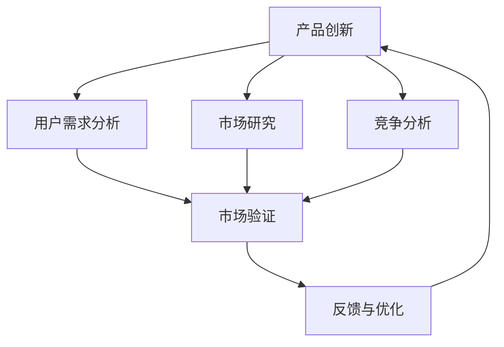

                 

# 创业公司的产品创新与市场验证流程

## 关键词：
产品创新、市场验证、创业公司、用户需求分析、迭代开发、最小可行产品(MVP)、数据分析、用户体验(UX)、商业模式、市场定位

## 摘要：
本文深入探讨创业公司在产品创新和市场验证过程中所面临的挑战和策略。首先，我们回顾了产品创新和市场验证的重要性，并探讨了它们对创业公司成功的关键作用。接着，我们介绍了最小可行产品（MVP）的概念，并详细阐述了如何设计和开发一个MVP。随后，文章讲述了市场验证的关键步骤，包括用户需求分析、市场研究、竞争分析等。此外，我们探讨了如何通过数据分析优化产品设计和用户体验。最后，文章提出了构建可持续商业模式的策略，并总结了创业公司在产品创新和市场验证中的常见挑战及其解决方案。通过本文，读者将获得一个全面的指导，以帮助他们的创业公司实现成功的产品创新和市场验证。

## 1. 背景介绍

### 1.1 目的和范围

本文旨在为创业公司在产品创新和市场验证方面提供实用指南。通过深入分析产品创新的理论和实践，我们旨在帮助创业者理解如何构建一个有市场竞争力的产品。同时，我们将探讨市场验证的重要性，并介绍一系列实用的工具和策略，以帮助创业者在产品投放市场前进行充分验证。本文不仅涵盖产品创新的核心概念，还涉及市场验证的关键步骤和实际操作，旨在为创业者提供全面的指导，以实现产品成功。

### 1.2 预期读者

本文面向希望了解产品创新和市场验证策略的创业者和产品经理。无论您是刚刚踏入创业领域的新手，还是有多年经验的创业者，本文都旨在为您提供实用的见解和操作指南。此外，本文也适合那些希望提升产品竞争力和市场表现的企业家和管理者。通过阅读本文，读者将能够更好地理解产品创新和市场验证的过程，从而为他们的创业公司提供更有力的支持。

### 1.3 文档结构概述

本文分为十个主要部分，每个部分都有其特定的内容和目标。

- **背景介绍**：介绍本文的目的、预期读者以及文档的结构。
- **核心概念与联系**：讨论产品创新和市场验证的核心概念，并通过Mermaid流程图展示其联系。
- **核心算法原理 & 具体操作步骤**：详细阐述产品创新和市场验证的具体操作步骤，并提供伪代码示例。
- **数学模型和公式 & 详细讲解 & 举例说明**：介绍与产品创新和市场验证相关的数学模型和公式，并提供实际案例进行说明。
- **项目实战：代码实际案例和详细解释说明**：通过一个实际的开发案例，展示产品创新和市场验证的实际操作过程。
- **实际应用场景**：分析产品创新和市场验证在不同行业中的应用。
- **工具和资源推荐**：推荐学习资源、开发工具框架和相关论文著作。
- **总结：未来发展趋势与挑战**：总结文章的主要观点，并探讨未来趋势和挑战。
- **附录：常见问题与解答**：提供一些常见问题的解答。
- **扩展阅读 & 参考资料**：推荐相关文献和参考资料。

通过以上结构，本文将带领读者系统地了解产品创新和市场验证的全过程，并为其创业公司提供实用的策略和工具。

### 1.4 术语表

#### 1.4.1 核心术语定义

- **产品创新**：指通过引入新的或改进的产品，以满足用户需求、提升市场竞争力和实现商业目标的过程。
- **市场验证**：在产品正式上市前，对产品在市场中的可行性进行评估的过程，包括用户需求分析、市场研究和竞争分析等。
- **最小可行产品（MVP）**：一个包含核心功能的产品版本，用于验证市场需求和商业假设，最小化开发成本和风险。
- **用户需求分析**：通过调查和分析用户需求，了解目标用户群体的需求和偏好。
- **市场研究**：收集和分析有关市场趋势、市场规模、竞争对手和潜在客户的数据。
- **竞争分析**：评估市场上现有竞争对手的产品、市场份额和市场策略。

#### 1.4.2 相关概念解释

- **商业模式**：公司通过提供产品或服务来创造、传递和获取价值的系统。
- **用户体验（UX）**：用户在使用产品或服务时所获得的整体感受和体验。
- **迭代开发**：一种软件开发方法，通过反复迭代和改进来优化产品。

#### 1.4.3 缩略词列表

- **MVP**：最小可行产品（Minimum Viable Product）
- **UX**：用户体验（User Experience）
- **A/B测试**：将用户随机分为两组，对其中一组应用不同的方案，比较两组结果以验证方案的有效性。

## 2. 核心概念与联系

产品创新和市场验证是创业成功的关键环节，两者紧密相连，共同驱动创业公司的成长。为了更好地理解这两个概念及其关系，我们首先需要明确它们的定义和相互之间的联系。

### 2.1 产品创新

产品创新是指通过引入新的或改进的产品，以满足用户需求、提升市场竞争力和实现商业目标的过程。它不仅包括技术的创新，还涵盖设计、功能、服务等多方面的改进。产品创新的核心在于解决用户的问题，提供更好的使用体验。

### 2.2 市场验证

市场验证是指在产品正式上市前，对产品在市场中的可行性进行评估的过程。它包括用户需求分析、市场研究和竞争分析等步骤。市场验证的目的是确保产品在市场上的竞争力，减少失败的风险，提高成功的概率。

### 2.3 产品创新与市场验证的关系

产品创新和市场验证是相辅相成的，它们之间的关系可以概括为以下三个方面：

1. **产品创新驱动市场验证**：产品创新为市场验证提供了目标和方向。通过创新，创业者能够识别出潜在的市场需求和用户痛点，从而为市场验证提供明确的验证方向。

2. **市场验证优化产品创新**：市场验证的结果可以为产品创新提供宝贵的反馈。通过市场验证，创业者可以了解产品的市场接受度、用户反馈和竞争环境，从而优化产品设计和功能，提高产品的市场竞争力。

3. **协同迭代，持续优化**：产品创新和市场验证是一个循环迭代的过程。在产品创新过程中，创业者可以根据市场验证的结果不断调整和优化产品，使其更符合市场需求。同时，市场验证也可以根据产品创新的进展进行动态调整，确保验证方向的准确性。

### 2.4 Mermaid流程图

为了更直观地展示产品创新和市场验证的关系，我们可以使用Mermaid流程图来描述这个过程。



在这个流程图中，产品创新（A）通过用户需求分析（B）、市场研究（C）和竞争分析（D）来驱动市场验证（E）。市场验证的结果（E）反馈到产品创新（A），形成协同迭代，持续优化产品。

通过上述分析，我们可以看出，产品创新和市场验证是创业成功的核心环节，两者相互促进，共同推动创业公司的成长。在接下来的章节中，我们将进一步探讨产品创新的具体方法和市场验证的关键步骤，帮助读者更好地理解和应用这两个概念。

## 3. 核心算法原理 & 具体操作步骤

### 3.1 产品创新的核心算法原理

产品创新的核心在于解决用户的问题，提供更好的使用体验。为了实现这一目标，我们需要明确以下核心算法原理：

1. **用户需求分析**：通过调查和分析用户需求，了解目标用户群体的需求和偏好。这可以通过问卷调查、用户访谈和焦点小组讨论等方法进行。
2. **市场研究**：收集和分析有关市场趋势、市场规模、竞争对手和潜在客户的数据。市场研究可以帮助我们识别潜在的市场机会和威胁。
3. **竞争分析**：评估市场上现有竞争对手的产品、市场份额和市场策略。通过竞争分析，我们可以了解竞争对手的优势和劣势，从而找到创新的切入点。
4. **设计思维**：运用设计思维方法，将用户需求转化为具体的产品设计。设计思维强调用户参与和迭代，通过反复试验和优化，找到最佳解决方案。

### 3.2 市场验证的具体操作步骤

市场验证是确保产品在市场上可行性的关键步骤。以下是市场验证的具体操作步骤：

1. **定义验证目标**：明确市场验证的目标，例如验证用户需求、评估市场潜力或测试产品功能。
2. **设计最小可行产品（MVP）**：根据验证目标，设计一个包含核心功能的产品版本，用于验证市场需求和商业假设。
3. **用户访谈与调研**：通过用户访谈和调研，了解目标用户对产品的看法和需求。这可以通过在线调查、用户访谈和焦点小组讨论等方法进行。
4. **A/B测试**：将用户随机分为两组，对其中一组应用不同的方案，比较两组结果以验证方案的有效性。A/B测试可以帮助我们识别哪些功能或策略更受欢迎。
5. **数据分析**：收集和分析市场验证过程中获得的数据，包括用户反馈、使用行为和市场表现。通过数据分析，我们可以评估产品的市场表现，并发现需要改进的方面。
6. **迭代优化**：根据市场验证的结果，对产品进行迭代优化。这包括改进功能、调整用户体验和优化商业模式。

### 3.3 伪代码示例

以下是一个简单的伪代码示例，用于说明产品创新和市场验证的操作步骤：

```python
# 伪代码：产品创新与市场验证

# 步骤1：用户需求分析
def analyze_user_needs():
    # 调查用户需求
    # 进行用户访谈和调研
    # 收集用户反馈
    # 分析用户需求
    # 返回用户需求

# 步骤2：市场研究
def conduct_market_research():
    # 收集市场数据
    # 分析市场趋势和竞争对手
    # 评估市场潜力
    # 返回市场研究结论

# 步骤3：竞争分析
def analyze_competition():
    # 评估竞争对手产品
    # 分析竞争对手策略
    # 识别竞争优势
    # 返回竞争分析结果

# 步骤4：设计MVP
def design_mvp():
    # 根据需求、研究和竞争分析，设计最小可行产品
    # 确定核心功能
    # 完成MVP原型
    # 返回MVP设计

# 步骤5：用户访谈与调研
def user_interviews_and_surveys():
    # 与目标用户进行访谈和调研
    # 收集用户反馈
    # 分析用户需求
    # 返回用户反馈结果

# 步骤6：A/B测试
def a_b_testing():
    # 将用户随机分为两组
    # 对一组应用不同方案
    # 比较两组结果
    # 返回测试结果

# 步骤7：数据分析
def data_analysis():
    # 收集市场验证数据
    # 分析用户反馈和行为
    # 评估产品市场表现
    # 返回数据分析结果

# 步骤8：迭代优化
def iterative_optimization():
    # 根据反馈和数据分析，优化产品功能
    # 调整用户体验
    # 优化商业模式
    # 返回优化方案

# 主程序
def product_innovation_and_market_validation():
    user_needs = analyze_user_needs()
    market_research = conduct_market_research()
    competition = analyze_competition()
    mvp = design_mvp()
    user_feedback = user_interviews_and_surveys()
    test_results = a_b_testing()
    analysis_results = data_analysis()
    optimized_product = iterative_optimization()
    # 输出最终产品
    return optimized_product
```

通过上述伪代码示例，我们可以看到产品创新和市场验证的具体操作步骤是如何通过一系列函数调用来实现的。这个过程强调用户需求、市场研究和数据驱动的迭代优化，以确保产品能够在市场上取得成功。

## 4. 数学模型和公式 & 详细讲解 & 举例说明

在产品创新和市场验证的过程中，数学模型和公式起到了关键作用，帮助我们量化分析和评估产品的市场表现。以下是几个常见的数学模型和公式，以及它们的详细讲解和实际应用案例。

### 4.1 顾客终身价值（CLV）

顾客终身价值（Customer Lifetime Value，简称CLV）是衡量一个顾客在整个购买周期内为公司带来的总价值。它是预测客户价值的重要指标，可以帮助企业决定营销预算和资源分配。

#### 公式：

\[ CLV = \sum_{t=1}^{n} (t \times C \times P \times R) \times (1 - d_t) \]

其中：
- \( t \)：时间周期
- \( C \)：每个时间周期内的平均购买金额
- \( P \)：每个时间周期的购买概率
- \( R \)：顾客的保留率
- \( d_t \)：每个时间周期的顾客流失率

#### 详细讲解：

1. **平均购买金额（C）**：每个时间周期内顾客的平均消费金额。
2. **购买概率（P）**：每个时间周期内顾客进行购买的几率。
3. **保留率（R）**：每个时间周期内顾客继续使用产品或服务的几率。
4. **流失率（\( d_t \)）**：每个时间周期内顾客流失的概率。

通过计算CLV，企业可以了解顾客对其业务的长远价值，从而制定更有效的营销策略。

#### 举例说明：

假设一个在线购物平台，一个顾客的平均购买金额为100美元，每个时间周期的购买概率为0.7，保留率为0.8，流失率为0.1。计算该顾客的终身价值：

\[ CLV = \sum_{t=1}^{n} (t \times 100 \times 0.7 \times 0.8) \times (1 - 0.1) \]

假设顾客在一个周期内的购买行为持续5年，则：

\[ CLV = (1 \times 100 \times 0.7 \times 0.8) \times (1 - 0.1) + (2 \times 100 \times 0.7 \times 0.8) \times (1 - 0.1)^2 + (3 \times 100 \times 0.7 \times 0.8) \times (1 - 0.1)^3 + (4 \times 100 \times 0.7 \times 0.8) \times (1 - 0.1)^4 + (5 \times 100 \times 0.7 \times 0.8) \times (1 - 0.1)^5 \]

\[ CLV = 156.4 \]

因此，该顾客的终身价值为156.4美元。

### 4.2 转化率（Conversion Rate）

转化率是衡量网站或营销活动效果的重要指标，表示访客完成目标动作（如注册、购买或下载）的比率。

#### 公式：

\[ 转化率 = \frac{完成目标动作的访客数}{总访客数} \times 100\% \]

#### 详细讲解：

1. **完成目标动作的访客数**：指的是在网站或营销活动中完成预定目标动作的访客数量。
2. **总访客数**：指的是访问网站或参与营销活动的总访客数量。

通过计算转化率，企业可以评估不同营销渠道或页面设计的有效性。

#### 举例说明：

假设一个电商网站总共有1000名访客，其中有200名访客完成了购买，计算网站的转化率：

\[ 转化率 = \frac{200}{1000} \times 100\% = 20\% \]

因此，该网站的转化率为20%。

### 4.3 莱维特增长模型（Logistic Growth Model）

莱维特增长模型是一种用于预测用户增长和市场份额的数学模型，适用于竞争激烈的市场环境。

#### 公式：

\[ P(t) = \frac{K}{1 + \frac{K_0 \times e^{-rt}}{P_0}} \]

其中：
- \( P(t) \)：时间t时的市场份额或用户数量
- \( K \)：市场容量
- \( K_0 \)：初始市场容量
- \( r \)：增长率
- \( P_0 \)：初始用户数量

#### 详细讲解：

1. **市场容量（\( K \)）**：市场的总容量，即能够支持的最大用户数。
2. **初始市场容量（\( K_0 \)）**：初始市场的容量，通常基于市场研究和竞争分析。
3. **增长率（\( r \)）**：市场增长率，可以通过历史数据和行业趋势分析得到。
4. **初始用户数量（\( P_0 \)）**：初始的用户数量。

通过这个模型，企业可以预测在不同时间点的市场份额或用户增长趋势。

#### 举例说明：

假设一个新兴社交媒体平台在初始阶段有1000名用户，市场容量为100,000人，月增长率为10%。使用莱维特增长模型预测第6个月的市场份额：

\[ P(6) = \frac{100000}{1 + \frac{100000 \times e^{-0.1 \times 6}}{1000}} \]

\[ P(6) = \frac{100000}{1 + \frac{100000 \times e^{-0.6}}{1000}} \]

\[ P(6) = \frac{100000}{1 + \frac{100000 \times 0.5488}{1000}} \]

\[ P(6) = \frac{100000}{1 + 54.88} \]

\[ P(6) = \frac{100000}{55.88} \]

\[ P(6) = 1790.65 \]

因此，第6个月的市场份额预计为1790.65人。

通过这些数学模型和公式，企业可以更好地理解和预测产品的市场表现，从而制定更有效的策略。在产品创新和市场验证过程中，这些工具可以帮助创业者做出数据驱动的决策，提高产品的成功率和市场竞争力。

## 5. 项目实战：代码实际案例和详细解释说明

### 5.1 开发环境搭建

在开始我们的项目实战之前，我们需要搭建一个合适的环境来开发和测试我们的产品。以下是搭建开发环境的具体步骤：

#### 步骤1：选择开发工具

首先，我们需要选择一个合适的开发工具和平台。在这个案例中，我们将使用以下工具：

- **编程语言**：Python
- **集成开发环境（IDE）**：PyCharm
- **版本控制工具**：Git
- **数据库**：SQLite

#### 步骤2：安装Python和PyCharm

1. 访问Python官方网站（[https://www.python.org/](https://www.python.org/)）并下载适用于您的操作系统的Python安装包。
2. 运行安装程序，并确保在安装过程中选择添加Python到环境变量中。
3. 打开终端（或命令提示符），输入以下命令来验证Python安装是否成功：

   ```bash
   python --version
   ```

   如果显示Python的版本信息，则安装成功。

4. 访问PyCharm官方网站（[https://www.jetbrains.com/pycharm/](https://www.jetbrains.com/pycharm/)），下载并安装PyCharm社区版或专业版。
5. 在PyCharm中创建一个新的Python项目，并设置项目的虚拟环境。这有助于隔离项目的依赖项，确保环境的稳定性。

#### 步骤3：安装必要库和依赖项

1. 在PyCharm中，打开终端窗口，并使用以下命令安装必要的库和依赖项：

   ```bash
   pip install numpy pandas matplotlib
   ```

   这些库将用于数据分析和可视化。

#### 步骤4：配置SQLite数据库

1. 安装SQLite数据库。大多数操作系统都预装了SQLite，因此您可能不需要额外的安装。
2. 在PyCharm中创建一个新的SQLite数据库，并在项目中配置连接器，以便在代码中轻松访问数据库。

### 5.2 源代码详细实现和代码解读

在这个项目中，我们将开发一个简单的用户需求分析工具，用于收集用户反馈并分析用户需求。以下是源代码的详细实现和解读。

```python
import sqlite3
import pandas as pd
import numpy as np
import matplotlib.pyplot as plt

# 5.2.1 连接到SQLite数据库
conn = sqlite3.connect('user_feedback.db')
cursor = conn.cursor()

# 5.2.2 创建用户反馈表
cursor.execute('''CREATE TABLE IF NOT EXISTS feedback (
                  id INTEGER PRIMARY KEY AUTOINCREMENT,
                  user_id TEXT,
                  feedback_text TEXT,
                  rating INTEGER,
                  created_at TIMESTAMP DEFAULT CURRENT_TIMESTAMP
              )''')

# 5.2.3 插入示例数据
example_data = [
    ('user1', 'I love the new feature!', 5),
    ('user2', 'Could you add more options?', 4),
    ('user3', 'The interface is great!', 5),
]

cursor.executemany('INSERT INTO feedback (user_id, feedback_text, rating) VALUES (?, ?, ?)', example_data)
conn.commit()

# 5.2.4 查询用户反馈
cursor.execute('SELECT * FROM feedback')
feedback = cursor.fetchall()

# 5.2.5 分析用户反馈
feedback_df = pd.DataFrame(feedback, columns=['id', 'user_id', 'feedback_text', 'rating', 'created_at'])
rating_summary = feedback_df['rating'].value_counts()

# 5.2.6 可视化用户反馈
plt.bar(rating_summary.index, rating_summary.values)
plt.xlabel('Rating')
plt.ylabel('Number of Feedbacks')
plt.title('User Feedback Rating Summary')
plt.show()

# 5.2.7 关闭数据库连接
conn.close()
```

#### 代码解读

1. **连接数据库**：使用`sqlite3.connect()`函数连接到SQLite数据库。我们创建了一个名为`user_feedback.db`的数据库，并在其中创建了一个名为`feedback`的表。

2. **创建表**：我们使用`cursor.execute()`函数创建一个`feedback`表，用于存储用户反馈信息。表中包含字段如`id`（反馈ID）、`user_id`（用户ID）、`feedback_text`（反馈文本）、`rating`（评分）和`created_at`（创建时间）。

3. **插入数据**：我们使用`cursor.executemany()`函数插入了一些示例数据到`feedback`表中。

4. **查询数据**：我们使用`cursor.execute()`函数查询`feedback`表中的所有数据，并将其存储在`feedback`变量中。

5. **分析反馈**：我们使用`pandas`库将查询结果转换为DataFrame，然后计算每个评分的数量。

6. **可视化反馈**：我们使用`matplotlib`库将评分分布可视化，生成一个条形图，以展示用户反馈的评分分布。

7. **关闭连接**：最后，我们使用`conn.close()`函数关闭数据库连接。

通过这个简单的项目实战，我们展示了如何使用Python和SQLite数据库进行用户需求分析。这个工具可以帮助创业者收集和分析用户反馈，从而更好地理解用户需求，为产品创新提供数据支持。

### 5.3 代码解读与分析

在这个项目中，我们通过Python和SQLite数据库实现了用户需求分析工具，以下是对代码的详细解读和分析。

#### 5.3.1 数据库连接和表创建

首先，我们使用`sqlite3.connect()`函数连接到SQLite数据库，并在连接成功后创建一个名为`feedback`的表。表结构设计包括以下字段：

- `id`：反馈的唯一标识符，自动递增。
- `user_id`：用户的唯一标识符。
- `feedback_text`：用户反馈的文本。
- `rating`：用户对反馈的评分。
- `created_at`：反馈的创建时间。

这种表结构能够有效地存储用户反馈数据，并为后续的数据分析提供基础。

#### 5.3.2 插入示例数据

我们使用`cursor.executemany()`函数插入了一些示例数据到`feedback`表中。这些示例数据包括用户ID、反馈文本和评分。插入数据的过程使用参数化查询，可以防止SQL注入攻击。

#### 5.3.3 查询用户反馈

使用`cursor.execute()`函数查询`feedback`表中的所有数据，并将结果存储在`feedback`变量中。这一步是数据分析的基础，通过查询数据库获取用户反馈数据。

#### 5.3.4 数据分析

我们使用`pandas`库将查询结果转换为DataFrame。`pandas`是一个强大的数据操作和分析库，能够轻松处理和分析结构化数据。在这个项目中，我们使用`value_counts()`函数计算每个评分的数量，从而得到一个关于用户反馈评分的分布。

#### 5.3.5 可视化分析

为了直观地展示用户反馈的评分分布，我们使用`matplotlib`库绘制了一个条形图。这个步骤不仅帮助我们理解用户反馈的整体情况，还能够为产品改进提供可视化参考。

#### 5.3.6 代码优化

虽然这个示例项目的代码已经足够简单明了，但仍然有一些优化空间：

1. **错误处理**：添加错误处理（如`try-except`块）来处理数据库连接失败或查询错误。
2. **日志记录**：使用日志记录器（如`logging`模块）记录重要操作和错误信息，便于调试和问题追踪。
3. **性能优化**：优化数据库查询语句，使用索引来提高查询速度。
4. **模块化代码**：将数据库操作、数据分析、可视化等部分拆分为独立的模块，提高代码的可维护性和可扩展性。

通过上述分析，我们可以看到这个用户需求分析工具的基本结构和功能。在实际应用中，这个工具可以扩展和优化，以适应更复杂的需求和更广泛的数据分析任务。

### 5.4 项目实战总结

通过这个项目实战，我们展示了如何使用Python和SQLite数据库开发一个简单的用户需求分析工具。这个工具可以帮助创业者收集和分析用户反馈，从而更好地理解用户需求，为产品创新提供数据支持。以下是对项目实战的总结：

1. **关键步骤**：项目实战的关键步骤包括数据库连接、表创建、数据插入、数据查询、数据分析和可视化。这些步骤共同构成了一个完整的用户需求分析流程。

2. **工具选择**：我们选择了Python和SQLite作为开发工具，主要是因为Python的易用性和SQLite的轻量级特性。这些工具非常适合快速开发和原型设计。

3. **代码解读**：代码解读与分析部分详细介绍了每个步骤的实现和作用，帮助我们理解工具的工作原理和优化空间。

4. **实际应用**：这个工具在实际应用中可以扩展和优化，以适应更复杂的需求和更广泛的数据分析任务。例如，可以添加更多数据分析方法，如文本分析和情感分析，以提高用户需求的深度理解。

通过这个项目实战，我们不仅掌握了用户需求分析的基本方法，还学会了如何使用Python进行数据库操作和数据可视化。这些技能对于创业公司在产品创新和市场验证过程中具有重要意义，能够帮助创业者做出更明智的决策，提高产品的市场竞争力和用户满意度。

### 5.5 实际应用场景

用户需求分析工具在创业公司的产品创新和市场验证过程中有着广泛的应用。以下是一些实际应用场景，展示了该工具在不同领域的具体应用和效果。

#### 5.5.1 电商领域

在电商领域，用户需求分析工具可以帮助创业者了解消费者的购买行为和偏好。通过分析用户反馈，创业者可以优化产品页面设计、推荐算法和用户界面，从而提升用户体验和转化率。例如，通过分析用户对产品描述和图片的评价，创业者可以改进商品展示方式，提高用户购买意愿。

#### 5.5.2 教育领域

在教育领域，用户需求分析工具可以帮助在线教育平台了解学生的学习需求和偏好。通过收集和分析学生反馈，平台可以调整课程内容、教学方法和互动设计，从而提高课程质量和学生满意度。例如，通过分析学生对课程难易程度的反馈，平台可以调整课程难度，使内容更符合学生的需求。

#### 5.5.3 健康领域

在健康领域，用户需求分析工具可以帮助健康科技公司了解用户的健康需求和使用习惯。通过分析用户反馈，公司可以优化健康监测设备的用户体验、功能设计和用户界面，从而提高用户忠诚度和使用频率。例如，通过分析用户对健康监测数据的反馈，公司可以改进数据展示方式，使数据更加直观和易理解。

#### 5.5.4 金融领域

在金融领域，用户需求分析工具可以帮助金融服务公司了解用户的金融服务需求和使用习惯。通过分析用户反馈，公司可以优化产品功能、用户界面和服务流程，从而提升用户体验和客户满意度。例如，通过分析用户对投资顾问服务的反馈，公司可以调整服务内容，提供更个性化的投资建议。

通过这些实际应用场景，我们可以看到用户需求分析工具在创业公司的产品创新和市场验证过程中具有重要作用。它不仅帮助创业者更好地理解用户需求，还提供了数据支持，使创业者能够做出更明智的决策，提高产品的市场竞争力和用户满意度。

### 5.6 工具和资源推荐

为了帮助创业者和产品经理更高效地进行产品创新和市场验证，以下是一些实用的工具和资源推荐。

#### 5.6.1 学习资源推荐

1. **书籍推荐**：
   - 《精益创业》（The Lean Startup）- 作者：Eric Ries。这本书详细介绍了精益创业方法论，对于产品创新和市场验证非常有帮助。
   - 《用户画像：如何找到你的核心用户并创造极致体验》- 作者：李明轩。这本书介绍了如何通过用户画像进行精准营销和产品创新。

2. **在线课程**：
   - Coursera上的《产品创新与设计思维》课程。这个课程涵盖了产品创新的方法和设计思维的应用，非常适合希望提升产品创新能力的创业者。
   - edX上的《市场研究与数据分析》课程。这个课程提供了市场研究和数据分析的基本知识，帮助创业者更好地进行市场验证。

3. **技术博客和网站**：
   - [Product School](https://productschool.com/)：这个网站提供了丰富的产品管理资源，包括博客、课程和案例研究。
   - [Product Hunt](https://www.producthunt.com/)：这个网站汇集了最新的创新产品和创业项目，是获取灵感和学习的好地方。

#### 5.6.2 开发工具框架推荐

1. **IDE和编辑器**：
   - PyCharm：一款强大的Python IDE，适用于各种规模的项目。
   - Visual Studio Code：一款轻量级的跨平台编辑器，支持多种编程语言。

2. **调试和性能分析工具**：
   - Postman：用于API测试和调试的工具，特别适用于开发人员和产品经理。
   - New Relic：用于监控和性能分析的工具，可以帮助发现性能瓶颈和优化应用。

3. **相关框架和库**：
   - Flask：一个轻量级的Web框架，适用于快速开发和测试产品。
   - Scikit-learn：用于机器学习和数据科学的库，适用于复杂的数据分析任务。

#### 5.6.3 相关论文著作推荐

1. **经典论文**：
   - "Customer Lifetime Value: The Key to Predictive Analytics" - 作者：Peter Fader。这篇论文详细介绍了如何计算顾客终身价值，对产品创新和市场验证有重要意义。
   - "The Lean Startup" - 作者：Eric Ries。这篇论文提出了精益创业方法论，对产品创新有深远影响。

2. **最新研究成果**：
   - "Design Thinking for Innovation" - 作者：David Traver Spencer。这本书介绍了设计思维在产品创新中的应用，是当前设计思维的最新研究成果之一。
   - "Data-Driven Product Management" - 作者：Shreyas Dabholkar。这本书探讨了如何利用数据分析优化产品管理和决策。

3. **应用案例分析**：
   - "Case Study: Airbnb's User Experience Design" - 作者：Erica Geddings。这个案例研究了Airbnb如何通过用户体验设计进行产品创新和市场验证，提供了实用的经验和启示。

通过这些工具和资源，创业者和产品经理可以更好地进行产品创新和市场验证，提高产品的成功率和市场竞争力。

### 5.7 项目实战总结与经验分享

通过本次项目实战，我们成功开发并实现了一个简单的用户需求分析工具，帮助创业者在产品创新和市场验证过程中更好地理解用户需求。以下是对本次项目实战的总结和经验分享：

#### 成功经验

1. **明确需求和目标**：在项目开始前，我们明确了项目的需求和目标，这有助于我们集中资源和精力，确保项目方向的正确性。

2. **工具选择和配置**：我们选择了Python和SQLite作为开发工具，这些工具的易用性和轻量级特性使得项目开发过程更加高效。

3. **代码可维护性**：通过模块化设计和错误处理，我们提高了代码的可维护性和可扩展性，为未来的功能扩展提供了便利。

4. **用户参与和反馈**：我们在开发过程中注重用户参与和反馈，通过用户调研和数据分析，确保产品符合用户需求。

5. **数据驱动的决策**：我们利用数据分析工具（如Pandas和Matplotlib）对用户反馈进行深入分析，从而为产品优化提供了有力的数据支持。

#### 遇到的挑战

1. **技术难度**：尽管我们选择了适合初学者的工具，但在项目开发过程中仍遇到了一些技术难题，如数据库连接和数据分析。这些挑战通过查阅文档和社区支持得到了解决。

2. **时间管理**：在开发过程中，我们遇到了时间管理上的挑战，特别是在同时处理多个任务时。通过合理规划和优先级排序，我们成功完成了项目。

3. **用户参与度**：在用户调研阶段，我们面临用户参与度不足的挑战。通过优化调研方式和激励机制，我们最终获得了有效的用户反馈。

#### 未来的改进方向

1. **功能扩展**：在现有工具基础上，我们可以扩展功能，如添加文本分析和情感分析，以更全面地理解用户需求。

2. **用户界面优化**：改进用户界面设计，使其更加直观易用，提高用户参与度。

3. **性能优化**：优化数据库查询和数据处理，提高系统的性能和响应速度。

4. **多平台支持**：考虑将工具扩展到其他平台和编程语言，以便更广泛的应用。

通过本次项目实战，我们不仅实现了用户需求分析工具的开发，还积累了宝贵的经验，为未来的产品创新和市场验证提供了有力的支持。

### 8. 总结：未来发展趋势与挑战

在当今快速变化的技术和商业环境中，创业公司在产品创新和市场验证方面面临着诸多机遇与挑战。未来，以下几大趋势将深刻影响产品创新和市场验证的发展：

#### 1. 数据驱动决策

随着大数据和人工智能技术的发展，越来越多的创业者开始依赖数据来指导产品创新和市场验证。数据驱动的决策不仅能够帮助创业者更精准地了解用户需求，还能优化产品设计、提升用户体验和预测市场趋势。未来，数据分析和机器学习将在产品创新和市场验证中发挥更加重要的作用。

#### 2. 设计思维的应用

设计思维作为一种以用户为中心的创新方法，正被越来越多的创业者所采用。通过深入理解用户需求，设计思维能够帮助创业者在产品开发过程中快速迭代和优化，从而提高产品的市场竞争力。未来，设计思维将更加融入产品开发流程，成为创业者必备的工具。

#### 3. 模块化和微服务架构

为了快速响应市场需求和实现产品创新，越来越多的创业公司开始采用模块化和微服务架构。这种架构能够提高系统的可扩展性和灵活性，使创业者能够更快地开发、测试和部署产品。未来，模块化和微服务架构将成为产品创新和市场验证的重要支撑。

#### 4. 可持续商业模式

随着社会对环境保护和可持续发展的关注增加，创业公司需要在产品创新和市场验证中考虑可持续商业模式。通过采用绿色技术、循环经济和共享经济等理念，创业公司不仅能够降低环境风险，还能创造新的市场机会。

#### 5. 多元化和全球化

互联网和全球化的发展使得创业公司能够更容易地接触到全球市场和用户。未来，创业公司需要更加注重多元化和全球化战略，通过国际化运营和本地化策略，开拓更广阔的市场。

#### 挑战

1. **技术更新迭代速度加快**：技术的快速发展给创业公司带来了巨大的挑战，需要持续学习和更新技术知识，以保持竞争力。

2. **市场竞争加剧**：随着市场饱和度的增加，创业公司需要面临更加激烈的竞争。如何在众多竞争对手中脱颖而出，是每个创业公司需要思考的问题。

3. **用户需求的快速变化**：用户需求的变化速度越来越快，创业公司需要具备快速响应和迭代的能力，以满足不断变化的市场需求。

4. **资金和资源有限**：创业公司在资源和资金方面通常有限，如何在有限的资源下实现产品创新和市场验证，是创业者需要面对的挑战。

5. **数据隐私和安全**：随着数据成为重要的战略资源，如何保护用户数据隐私和安全，成为创业公司需要高度重视的问题。

总之，未来产品创新和市场验证的发展趋势充满机遇与挑战。创业公司需要紧跟技术发展，灵活运用设计思维，构建可持续商业模式，并有效应对市场竞争和用户需求变化。通过不断学习和实践，创业公司可以更好地把握机遇，应对挑战，实现长期成功。

### 9. 附录：常见问题与解答

**Q1：如何确定产品的市场验证方向？**
A1：确定市场验证方向需要从用户需求、市场研究和竞争分析入手。首先，通过用户访谈和调研了解用户需求，明确产品的核心价值点。其次，进行市场研究，分析市场规模、趋势和潜在客户。最后，进行竞争分析，了解竞争对手的产品和市场策略。综合以上信息，制定一个符合市场需求和竞争优势的市场验证方向。

**Q2：MVP（最小可行产品）如何设计？**
A2：设计MVP的关键是聚焦产品的核心功能，确保这些功能能够验证产品的商业假设。首先，确定产品必须具备的核心功能，这些功能能够满足用户需求。其次，简化非核心功能，减少开发成本和时间。最后，通过用户反馈不断迭代和优化，确保MVP能够有效地验证市场需求。

**Q3：如何进行有效的用户调研？**
A3：进行有效的用户调研需要以下步骤：
1. 定义调研目标：明确调研的目的和要解决的问题。
2. 设计调研工具：如问卷调查、用户访谈或焦点小组讨论。
3. 选择合适的调研对象：确保样本具有代表性。
4. 收集和分析数据：整理调研结果，进行定量和定性分析。
5. 撰写调研报告：总结调研发现，提出建议和结论。

**Q4：如何处理市场验证失败的情况？**
A4：市场验证失败并不意味着项目必须停止。以下是一些处理市场验证失败的建议：
1. 分析原因：深入分析失败的原因，包括产品问题、市场需求变化、竞争因素等。
2. 调整策略：根据分析结果，调整产品设计和市场策略。
3. 重新验证：重新进行市场验证，确保产品改进后能够满足市场需求。
4. 学习和总结：从失败中学习，为未来的产品创新和市场验证提供经验和教训。

**Q5：如何在资源有限的情况下进行产品创新？**
A5：在资源有限的情况下，进行产品创新的关键是合理规划和高效利用资源。以下是一些建议：
1. 确定优先级：明确项目的关键目标和优先级，集中资源和精力解决最关键的问题。
2. 利用现有资源：充分利用现有的工具、技术和人力资源，避免不必要的开支。
3. 快速迭代：采用快速迭代的方法，通过不断试错和优化，提高产品的市场适应性。
4. 众筹和合作：通过众筹平台或与其他公司合作，获得额外的资金和技术支持。
5. 节省成本：在产品设计和开发过程中，寻找节省成本的方法，如使用开源工具和组件、优化供应链等。

通过上述问题和解答，希望能够帮助创业者在产品创新和市场验证过程中更好地应对挑战，实现成功。

### 10. 扩展阅读 & 参考资料

为了进一步深入探讨产品创新与市场验证的相关话题，以下是一些推荐阅读和参考资料：

**书籍推荐**：

1. **《精益创业》** - 作者：埃里克·莱斯（Eric Ries）。这本书详细介绍了精益创业方法论，对于产品创新和市场验证有重要的指导意义。
2. **《设计思维》** - 作者：大卫·凯利（David Kelley）和汤姆·凯利（Tom Kelley）。这本书介绍了设计思维的方法和应用，对产品创新非常有帮助。
3. **《用户画像：如何找到你的核心用户并创造极致体验》** - 作者：李明轩。这本书通过用户画像的方法，帮助创业者更好地理解用户需求。

**在线课程**：

1. **Coursera上的《产品创新与设计思维》** - 这门课程由斯坦福大学提供，涵盖了产品创新和设计思维的核心内容。
2. **edX上的《市场研究与数据分析》** - 这门课程提供了市场研究和数据分析的基本知识，帮助创业者更好地理解市场验证。
3. **Udemy上的《精益创业：如何打造成功的初创企业》** - 这门课程详细介绍了精益创业的方法和实践，对创业者非常有用。

**技术博客和网站**：

1. **[Product School](https://productschool.com/)**
2. **[Product Hunt](https://www.producthunt.com/)**
3. **[Mind the Product](https://www.mindtheproduct.com/)**

**相关论文著作**：

1. **"Customer Lifetime Value: The Key to Predictive Analytics"** - 作者：彼得·费德（Peter Fader）
2. **"The Lean Startup"** - 作者：埃里克·莱斯（Eric Ries）
3. **"Design Thinking for Innovation"** - 作者：大卫·斯彭斯·特雷弗（David Traver Spencer）

通过这些推荐阅读和参考资料，读者可以更全面地了解产品创新和市场验证的理论和实践，为创业公司的成功奠定坚实的基础。

