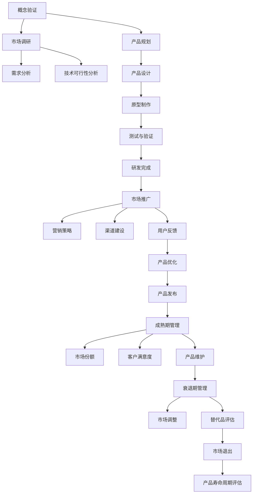

                 

### 1. 背景介绍

#### 1.1 目的和范围

本文旨在探讨创业公司在产品生命周期管理（Product Life Cycle Management, PLCM）方面的策略和实践。产品生命周期管理涉及产品的整个生命周期，从概念验证到市场退出，包括多个阶段，如研发、市场推广、销售、服务和维护。创业公司在资源有限、竞争激烈的市场环境中，如何有效地管理产品生命周期，以最大化价值并保持市场竞争力，是本文的核心关注点。

本文的范围将围绕以下几个方面展开：

1. **核心概念和联系**：介绍产品生命周期管理的核心概念及其相互关系，包括产品研发、市场推广、销售、服务和维护等阶段。
2. **核心算法原理与操作步骤**：详细解析创业公司如何制定产品生命周期管理策略，包括市场调研、产品规划、产品开发、产品发布和后期支持等环节。
3. **数学模型和公式**：阐述产品生命周期管理中涉及的关键数学模型和公式，如需求预测模型、成本效益分析模型等。
4. **项目实战**：通过实际案例，展示如何在实际项目中应用产品生命周期管理策略。
5. **实际应用场景**：分析产品生命周期管理在不同行业和领域中的应用，以及所面临的挑战。
6. **工具和资源推荐**：介绍相关的学习资源、开发工具和框架，帮助读者深入了解和实施产品生命周期管理策略。

通过本文的探讨，读者将能够获得以下收益：

- 理解产品生命周期管理的核心概念和流程。
- 学会如何制定和实施有效的产品生命周期管理策略。
- 掌握关键数学模型和公式的应用。
- 通过实际案例和工具推荐，了解如何在创业公司中应用产品生命周期管理。

#### 1.2 预期读者

本文适合以下读者群体：

- 创业公司创始人或产品经理：对产品生命周期管理有初步了解，希望深入了解和实践。
- 技术团队领导者或工程师：希望在项目中应用产品生命周期管理策略，提高项目成功率。
- 企业管理人员：关注企业产品战略，希望了解创业公司的产品管理策略。
- IT领域爱好者：对产品生命周期管理有浓厚兴趣，希望深入了解相关技术和实践。

本文将逐步引导读者从基础概念到高级应用，适合不同层次的读者。无论您是初学者还是有经验的专业人士，都能够在本文中找到有价值的内容。

#### 1.3 文档结构概述

本文采用逻辑清晰、结构紧凑的撰写方式，分为以下几个部分：

1. **背景介绍**：介绍本文的目的、范围、预期读者和文档结构。
2. **核心概念与联系**：阐述产品生命周期管理的核心概念及其相互关系。
3. **核心算法原理与具体操作步骤**：详细解析产品生命周期管理策略的实施步骤。
4. **数学模型和公式**：介绍产品生命周期管理中涉及的关键数学模型和公式。
5. **项目实战**：通过实际案例展示产品生命周期管理的应用。
6. **实际应用场景**：分析产品生命周期管理在不同行业和领域中的应用。
7. **工具和资源推荐**：推荐相关学习资源、开发工具和框架。
8. **总结：未来发展趋势与挑战**：探讨产品生命周期管理的未来发展趋势和面临的挑战。
9. **附录：常见问题与解答**：提供关于产品生命周期管理的一些常见问题及其解答。
10. **扩展阅读 & 参考资料**：推荐相关的扩展阅读和参考资料。

通过这样的结构安排，读者可以逐步深入了解产品生命周期管理的各个方面，从基础概念到实际应用，从而全面掌握产品生命周期管理的核心知识和技能。

#### 1.4 术语表

在本文中，我们将使用一些专业术语，为了确保读者能够准确理解，以下是对这些术语的定义和解释：

##### 1.4.1 核心术语定义

1. **产品生命周期管理（PLCM）**：指企业对产品从概念验证到市场退出的全过程进行管理，包括研发、市场推广、销售、服务和维护等阶段。
2. **产品经理**：负责产品策略、规划、开发和运营的管理人员。
3. **需求预测**：预测市场上对某种产品的需求量，用于指导产品规划和生产计划。
4. **市场推广**：通过各种营销手段，如广告、促销活动等，提高产品的市场认知度和销售量。
5. **用户反馈**：用户对产品使用过程中提出的意见和建议，用于产品改进和优化。
6. **迭代开发**：在产品开发过程中，通过多次迭代，逐步完善产品功能，提高产品质量。
7. **成本效益分析**：评估产品开发、生产和运营的总成本与预期收益，以确定产品是否有经济效益。

##### 1.4.2 相关概念解释

1. **产品生命周期**：产品从研发、上市、成熟到退市的整个过程，通常分为导入期、增长期、成熟期和衰退期。
2. **市场调研**：通过对市场环境、竞争对手、用户需求等方面的研究，收集和分析信息，为产品开发和市场推广提供依据。
3. **用户体验**：用户在使用产品过程中的感受和体验，是产品设计和优化的重要参考。
4. **竞争优势**：企业在市场竞争中相对于竞争对手所具有的优势，如技术优势、品牌优势等。
5. **敏捷开发**：一种以用户需求为导向，快速迭代、持续交付的开发模式，强调团队协作和客户满意度。

##### 1.4.3 缩略词列表

- PLCM：产品生命周期管理
- PM：产品经理
- UE：用户体验
- ROI：投资回报率
- MVP：最小可行产品

通过上述术语的定义和解释，读者可以更好地理解本文中所涉及的专业术语，从而更深入地理解产品生命周期管理的概念和实践。

## 2. 核心概念与联系

产品生命周期管理（PLCM）是企业对产品从概念验证到市场退出的全过程进行管理的系统方法。为了更好地理解PLCM，我们需要首先了解其核心概念及其相互关系。以下是PLCM中的关键概念及其在产品生命周期中的位置：

### 2.1 产品生命周期阶段

产品生命周期通常分为以下几个阶段：

1. **概念验证（Validation）**：
   - **定义**：评估产品概念是否可行，确定市场需求和潜在风险。
   - **任务**：市场调研、需求分析、初步设计。
   - **关键指标**：市场接受度、技术可行性。

2. **研发（Development）**：
   - **定义**：产品的设计和开发阶段，实现产品原型。
   - **任务**：需求分析、产品设计、原型制作、测试。
   - **关键指标**：研发进度、产品功能完整性。

3. **市场推广（Launch）**：
   - **定义**：产品正式推向市场，开始销售和用户反馈收集。
   - **任务**：市场分析、营销策略、渠道建设。
   - **关键指标**：市场占有率、销售量。

4. **成熟期（Maturity）**：
   - **定义**：产品在市场上的销售和利润达到最高峰。
   - **任务**：维护和改进产品，扩大市场份额。
   - **关键指标**：市场份额、客户满意度。

5. **衰退期（Decline）**：
   - **定义**：产品销售和利润逐渐下降，市场需求减少。
   - **任务**：产品维护、市场调整、寻找替代品。
   - **关键指标**：销售量、利润率。

6. **市场退出（Exit）**：
   - **定义**：产品从市场撤出，停止生产和销售。
   - **任务**：评估产品寿命周期，决定市场退出策略。
   - **关键指标**：产品退出成本、市场反应。

### 2.2 关键概念关系

以下是一个Mermaid流程图，展示了产品生命周期管理中的关键概念及其相互关系：



### 2.3 产品生命周期管理流程

产品生命周期管理流程包括以下主要步骤：

1. **市场调研**：了解市场需求、竞争状况、用户偏好等，为产品研发提供依据。
2. **需求分析**：明确产品功能、性能和用户需求，形成详细的需求文档。
3. **产品规划**：确定产品目标和开发计划，包括研发周期、资源分配等。
4. **产品设计**：制定产品规格和技术方案，包括硬件、软件和接口设计。
5. **原型制作**：开发产品原型，进行初步测试和验证。
6. **测试与验证**：对产品原型进行功能和性能测试，确保满足需求。
7. **研发完成**：完成产品研发，准备市场推广。
8. **市场推广**：制定市场推广策略，包括营销、渠道和用户反馈收集。
9. **产品优化**：根据用户反馈，对产品进行改进和优化。
10. **产品发布**：正式发布产品，进入市场推广和销售阶段。
11. **成熟期管理**：维护和改进产品，扩大市场份额。
12. **衰退期管理**：调整市场策略，评估产品寿命周期，决定市场退出。

通过以上流程，创业公司可以系统地管理产品的整个生命周期，从而提高产品竞争力，最大化产品价值。

### 2.4 核心概念总结

核心概念与联系是产品生命周期管理的基石，包括产品生命周期阶段、关键概念关系和产品生命周期管理流程。理解这些核心概念和流程，有助于创业公司制定和实施有效的产品生命周期管理策略，确保产品在市场上的成功和长期发展。

## 3. 核心算法原理 & 具体操作步骤

在产品生命周期管理（PLCM）中，核心算法原理和具体操作步骤是确保产品顺利推进至各个阶段的重要保障。以下将详细阐述创业公司如何制定和实施产品生命周期管理策略，包括市场调研、产品规划、产品开发、产品发布和后期支持等环节。

### 3.1 市场调研

市场调研是产品生命周期管理的首要步骤，旨在了解市场需求、竞争状况和用户偏好，为产品规划和开发提供依据。

**算法原理**：
- **需求预测**：通过数据分析、用户调研等方法，预测市场对某种产品的需求量。
- **竞争分析**：分析竞争对手的产品、市场份额、营销策略等，为自身产品定位和策略制定提供参考。
- **用户画像**：通过用户调研，了解目标用户群体的特征、需求和偏好。

**具体操作步骤**：
1. **确定调研目标**：明确市场调研的目的和要解决的问题。
2. **设计调研方案**：制定调研计划，包括调研方法、数据收集和分析工具等。
3. **执行调研**：通过问卷调查、访谈、焦点小组讨论等方式，收集市场信息和用户反馈。
4. **数据分析和报告**：对收集的数据进行分析，形成调研报告，为产品规划和开发提供依据。

**伪代码示例**：

```python
# 需求预测算法伪代码
def predict_demand(data):
    # 数据预处理
    processed_data = preprocess_data(data)
    
    # 数据分析
    demand = analyze_data(processed_data)
    
    # 预测结果
    predicted_demand = predict(demand)
    
    return predicted_demand

# 竞争分析算法伪代码
def analyze_competition(competitors):
    # 收集竞争对手数据
    competitors_data = collect_data(competitors)
    
    # 数据分析
    competition_analysis = analyze_data(competitors_data)
    
    return competition_analysis

# 用户画像算法伪代码
def create_user_profile(users):
    # 收集用户数据
    users_data = collect_data(users)
    
    # 数据分析
    user_profile = analyze_data(users_data)
    
    return user_profile
```

### 3.2 产品规划

产品规划是产品生命周期管理的重要环节，涉及确定产品目标和开发计划，确保产品在市场上具有竞争力。

**算法原理**：
- **目标设定**：明确产品愿景、目标和关键绩效指标（KPI）。
- **资源分配**：合理分配人力、物力和财力等资源，确保产品开发顺利进行。

**具体操作步骤**：
1. **确定产品目标**：根据市场需求和用户反馈，明确产品功能、性能和用户体验等目标。
2. **制定开发计划**：确定产品开发周期、阶段和里程碑，制定详细的时间表。
3. **资源评估与分配**：评估所需资源，包括人力资源、技术资源和资金，并进行合理分配。
4. **风险评估**：识别和评估潜在风险，制定应对策略。

**伪代码示例**：

```python
# 目标设定算法伪代码
def set_product_goals(product_goals):
    # 收集市场数据和用户反馈
    market_data = collect_market_data()
    user_feedback = collect_user_feedback()
    
    # 设定产品目标
    goals = define_goals(market_data, user_feedback)
    
    return goals

# 资源评估与分配算法伪代码
def allocate_resources(resources):
    # 评估所需资源
    required_resources = assess_resources()
    
    # 资源分配
    allocated_resources = distribute_resources(required_resources)
    
    return allocated_resources

# 风险评估算法伪代码
def assess_risks(risks):
    # 识别潜在风险
    identified_risks = identify_risks()
    
    # 风险评估
    risk_analysis = evaluate_risks(identified_risks)
    
    return risk_analysis
```

### 3.3 产品开发

产品开发是产品生命周期管理的核心环节，涉及从概念验证到产品发布的全过程。

**算法原理**：
- **需求分析**：明确产品功能、性能和用户体验等需求。
- **迭代开发**：通过多次迭代，逐步完善产品功能，提高产品质量。

**具体操作步骤**：
1. **需求分析**：收集用户需求，形成详细的需求文档。
2. **设计阶段**：制定产品规格和技术方案，包括硬件、软件和接口设计。
3. **开发阶段**：进行编码、单元测试和集成测试，确保产品功能完整性和性能。
4. **测试与验证**：对产品原型进行功能和性能测试，确保满足需求。

**伪代码示例**：

```python
# 需求分析算法伪代码
def analyze_requirements(user_requirements):
    # 收集用户需求
    requirements = collect_user_requirements()
    
    # 分析需求
    analyzed_requirements = analyze_requirements(requirements)
    
    return analyzed_requirements

# 设计阶段算法伪代码
def design_product(product_specifications):
    # 制定产品规格
    specifications = define_specifications()
    
    # 技术方案设计
    technical_solution = design_technical_solution(specifications)
    
    return technical_solution

# 开发阶段算法伪代码
def develop_product(code, unit_tests, integration_tests):
    # 编码
    compiled_code = compile_code(code)
    
    # 单元测试
    unit_test_results = run_unit_tests(compiled_code)
    
    # 集成测试
    integration_test_results = run_integration_tests(unit_test_results)
    
    return integration_test_results
```

### 3.4 产品发布

产品发布是产品生命周期管理的关键步骤，涉及市场推广、渠道建设和用户反馈收集。

**算法原理**：
- **市场推广**：制定营销策略，提高产品市场认知度和销售量。
- **渠道建设**：建立销售和推广渠道，确保产品能够顺利进入市场。
- **用户反馈**：收集用户使用过程中的意见和建议，用于产品改进和优化。

**具体操作步骤**：
1. **制定营销策略**：根据产品特点和市场环境，制定相应的营销策略。
2. **市场推广**：通过广告、促销活动、社交媒体等渠道，提高产品市场认知度。
3. **渠道建设**：建立销售和推广渠道，确保产品能够顺利进入市场。
4. **用户反馈**：收集用户使用过程中的意见和建议，用于产品改进和优化。

**伪代码示例**：

```python
# 营销策略算法伪代码
def create_marketing_strategy(product_details):
    # 分析产品特点和市场环境
    product_features = analyze_product_features(product_details)
    market_environment = analyze_market_environment()
    
    # 制定营销策略
    strategy = define_marketing_strategy(product_features, market_environment)
    
    return strategy

# 市场推广算法伪代码
def promote_product(marketing_strategy):
    # 执行市场推广活动
    promotion_activities = execute_promotion_activities(marketing_strategy)
    
    # 跟踪推广效果
    promotion_results = track_promotion_effects(promotion_activities)
    
    return promotion_results

# 用户反馈算法伪代码
def collect_user_feedback(product, users):
    # 收集用户反馈
    feedback = collect_user_feedback_data(users)
    
    # 分析反馈
    analyzed_feedback = analyze_user_feedback(feedback)
    
    return analyzed_feedback
```

### 3.5 后期支持

后期支持是产品生命周期管理的重要组成部分，涉及产品维护、市场调整和产品寿命周期评估。

**算法原理**：
- **产品维护**：确保产品在市场上的稳定运行，及时修复故障和漏洞。
- **市场调整**：根据市场变化和用户反馈，调整产品策略和营销手段。
- **产品寿命周期评估**：评估产品在市场上的表现，决定产品退出策略。

**具体操作步骤**：
1. **产品维护**：定期进行产品检查、故障修复和安全更新。
2. **市场调整**：分析市场环境和用户需求，调整产品功能和营销策略。
3. **产品寿命周期评估**：评估产品在市场上的表现，决定是否继续维护或退出市场。

**伪代码示例**：

```python
# 产品维护算法伪代码
def maintain_product(product):
    # 定期检查
    check_results = regular_checks(product)
    
    # 故障修复
    fixed_issues = fix_issues(check_results)
    
    # 安全更新
    updated_product = apply_security_updates(product)
    
    return updated_product

# 市场调整算法伪代码
def adjust_market_strategy(product, market_environment):
    # 分析市场环境和用户需求
    market_data = analyze_market_environment()
    user_feedback = analyze_user_feedback()
    
    # 调整产品策略
    adjusted_strategy = define_adjusted_strategy(product, market_data, user_feedback)
    
    return adjusted_strategy

# 产品寿命周期评估算法伪代码
def assess_product_life_cycle(product, market_environment):
    # 评估产品表现
    performance = evaluate_product_performance(product)
    
    # 评估市场环境
    market_environment = analyze_market_environment()
    
    # 决定退出策略
    exit_strategy = determine_exit_strategy(performance, market_environment)
    
    return exit_strategy
```

通过以上核心算法原理和具体操作步骤，创业公司可以系统地制定和实施产品生命周期管理策略，确保产品在市场上的成功和长期发展。

## 4. 数学模型和公式 & 详细讲解 & 举例说明

在产品生命周期管理（PLCM）中，数学模型和公式扮演着关键角色，帮助创业公司进行需求预测、成本效益分析、市场份额评估等。以下将详细阐述这些数学模型和公式，并通过具体示例进行说明。

### 4.1 需求预测模型

需求预测是产品生命周期管理的重要环节，准确的预测有助于创业公司制定有效的生产和销售计划。以下是一个简单的时间序列需求预测模型：

**公式**：

\[ \hat{D_t} = \alpha_0 + \alpha_1 t + \epsilon_t \]

其中：
- \( \hat{D_t} \) 为第 \( t \) 个月的需求预测值；
- \( \alpha_0 \) 为常数项，代表初始需求水平；
- \( \alpha_1 \) 为趋势项，代表每月的增长率；
- \( t \) 为时间变量；
- \( \epsilon_t \) 为随机误差项。

**详细讲解**：

1. **常数项 \( \alpha_0 \)**：表示在没有时间变化的情况下，产品的基本需求量。
2. **趋势项 \( \alpha_1 \)**：表示每月需求量的增长率，通过历史数据回归分析得到。

**举例说明**：

假设一家创业公司在过去六个月中的需求量数据如下表所示：

| 月份 | 需求量（件） |
| ---- | ---------- |
| 1    | 100        |
| 2    | 110        |
| 3    | 120        |
| 4    | 130        |
| 5    | 140        |
| 6    | 150        |

通过回归分析，得到常数项 \( \alpha_0 = 90 \)，趋势项 \( \alpha_1 = 5 \)。使用需求预测模型，预测第七个月的需求量：

\[ \hat{D_7} = 90 + 5 \times 7 = 145 \]

因此，预测第七个月的需求量为 145 件。

### 4.2 成本效益分析模型

成本效益分析是创业公司制定产品生命周期管理策略的重要工具，通过比较总成本与总收益，评估产品的经济效益。以下是一个简单的成本效益分析模型：

**公式**：

\[ \text{净收益} = \text{总收益} - \text{总成本} \]

其中：
- **总收益**：产品在生命周期内的总销售额。
- **总成本**：产品在生命周期内的总成本，包括研发成本、生产成本、运营成本和营销成本等。

**详细讲解**：

1. **总收益**：通过市场需求预测和销售价格计算得出。
2. **总成本**：通过成本估算和实际支出计算得出。

**举例说明**：

假设一家创业公司的产品预计在五年内销售，预计销售价格为 1000 元/件，预计每年销售量为 1000 件。研发成本为 500 万元，生产成本为 100 万元/年，运营成本为 50 万元/年，营销成本为 30 万元/年。计算产品的净收益：

**总收益**：

\[ \text{总收益} = 1000 \text{件/年} \times 5 \text{年} \times 1000 \text{元/件} = 5,000,000 \text{元} \]

**总成本**：

\[ \text{总成本} = 500,0000 \text{元} + 100,0000 \text{元} + 50,0000 \text{元} + 30,0000 \text{元} = 880,0000 \text{元} \]

**净收益**：

\[ \text{净收益} = 5,000,000 \text{元} - 880,0000 \text{元} = -280,0000 \text{元} \]

因此，该产品的净收益为 -280 万元，说明产品在当前条件下不具备经济效益。

### 4.3 市场份额评估模型

市场份额是创业公司在市场上竞争力的重要指标，通过市场份额评估模型，可以了解产品在市场中的地位和潜在增长空间。以下是一个简单市场份额评估模型：

**公式**：

\[ \text{市场份额} = \frac{\text{公司销售额}}{\text{市场总销售额}} \]

其中：
- **公司销售额**：创业公司产品的总销售额。
- **市场总销售额**：整个市场的总销售额。

**详细讲解**：

1. **公司销售额**：通过销售数据统计得出。
2. **市场总销售额**：通过市场调研数据或行业报告获取。

**举例说明**：

假设一家创业公司的产品在市场上占有率为 10%，市场总销售额为 1 亿元。计算该公司的市场份额：

\[ \text{市场份额} = \frac{1,000,000 \text{元}}{10,000,000 \text{元}} = 10\% \]

因此，该公司的市场份额为 10%。

### 4.4 用户满意度评估模型

用户满意度是产品生命周期管理的重要指标，通过用户满意度评估模型，可以了解产品的市场接受度和潜在改进方向。以下是一个简单用户满意度评估模型：

**公式**：

\[ \text{用户满意度} = \frac{\text{满意用户数}}{\text{总用户数}} \]

其中：
- **满意用户数**：对产品表示满意的用户数量。
- **总用户数**：使用产品的总用户数量。

**详细讲解**：

1. **满意用户数**：通过用户反馈调查得出。
2. **总用户数**：通过销售数据或用户注册数据得出。

**举例说明**：

假设一家创业公司的产品有 1000 名用户，其中 700 名用户表示满意。计算用户满意度：

\[ \text{用户满意度} = \frac{700}{1000} = 70\% \]

因此，该产品的用户满意度为 70%。

通过以上数学模型和公式的详细讲解和举例说明，创业公司可以更好地理解和应用这些工具，在产品生命周期管理中做出更科学的决策。

## 5. 项目实战：代码实际案例和详细解释说明

在本节中，我们将通过一个实际的项目案例，详细展示如何使用产品生命周期管理策略来开发和维护一款创业公司的产品。以下内容将涵盖项目开发环境搭建、源代码实现和详细解释说明，以便读者能够深入理解产品生命周期管理在实践中的应用。

### 5.1 开发环境搭建

为了确保项目顺利进行，我们需要搭建一个适合开发和维护的软件开发环境。以下是搭建开发环境的步骤：

1. **安装操作系统**：选择一个适合开发的环境，例如 Ubuntu 20.04。
2. **安装编程语言**：安装 Python 3.8 及其相关依赖，可以使用 Python 的包管理器 pip。
   ```bash
   sudo apt update
   sudo apt install python3.8
   python3.8 -m pip install --user -r requirements.txt
   ```
3. **安装版本控制系统**：使用 Git 进行版本控制，确保代码的版本管理和协作开发。
   ```bash
   sudo apt install git
   ```
4. **安装数据库**：根据项目需求选择合适的数据库，例如 MySQL 或 PostgreSQL。
   ```bash
   sudo apt install mysql-server
   sudo mysql_secure_installation
   ```
5. **安装 Web 框架**：选择一个适合项目的 Web 开发框架，例如 Flask。
   ```bash
   pip install flask
   ```

### 5.2 源代码详细实现和代码解读

在本项目中，我们将开发一款简单的在线购物平台，涵盖用户注册、商品展示、购物车和订单管理等功能。以下是项目的核心代码实现和解读。

#### 5.2.1 用户注册模块

用户注册模块是系统的入口，以下是用户注册的 Python 代码示例：

```python
# app/routes.py

from flask import Flask, request, redirect, url_for, render_template
from app.models import User
from app import db

app = Flask(__name__)

@app.route('/register', methods=['GET', 'POST'])
def register():
    if request.method == 'POST':
        username = request.form['username']
        password = request.form['password']
        user = User(username=username, password=password)
        db.session.add(user)
        db.session.commit()
        return redirect(url_for('login'))
    return render_template('register.html')

```

解读：
- `app/routes.py`：定义了用户注册的路由和视图函数。
- `User` 类：代表用户数据模型，包含用户名和密码等属性。
- `db.session.add(user)`：将新用户添加到数据库。
- `db.session.commit()`：提交数据库事务，保存用户数据。

#### 5.2.2 商品展示模块

商品展示模块负责展示系统中的商品信息，以下是商品展示的 Python 代码示例：

```python
# app/routes.py

from flask import Flask, render_template
from app.models import Product
from app import db

@app.route('/')
def index():
    products = Product.query.all()
    return render_template('index.html', products=products)

```

解读：
- `Product` 类：代表商品数据模型，包含商品名称、价格等属性。
- `Product.query.all()`：从数据库中查询所有商品。
- `render_template('index.html', products=products)`：渲染模板，将商品数据传递给前端。

#### 5.2.3 购物车模块

购物车模块用于管理用户添加的商品，以下是购物车功能的 Python 代码示例：

```python
# app/routes.py

from flask import Flask, request, redirect, url_for
from app.models import Cart, CartItem
from app import db

@app.route('/cart/add', methods=['POST'])
def add_to_cart():
    product_id = request.form['product_id']
    product = Product.query.get(product_id)
    cart_item = CartItem(product_id=product_id, quantity=1)
    cart = Cart.get_current_cart()
    cart.add_item(cart_item)
    db.session.commit()
    return redirect(url_for('index'))

```

解读：
- `CartItem` 类：代表购物车中的商品项，包含商品 ID 和数量等属性。
- `Cart` 类：代表用户的购物车，包含添加和删除商品项的方法。
- `Cart.get_current_cart()`：获取当前用户的购物车实例。
- `cart.add_item(cart_item)`：将商品项添加到购物车。

#### 5.2.4 订单管理模块

订单管理模块用于处理用户的订单生成和支付，以下是订单管理的 Python 代码示例：

```python
# app/routes.py

from flask import Flask, request, redirect, url_for
from app.models import Order
from app import db

@app.route('/order/submit', methods=['POST'])
def submit_order():
    cart = Cart.get_current_cart()
    order = Order(cart=cart)
    cart.clear()
    db.session.add(order)
    db.session.commit()
    return redirect(url_for('order_confirmation', order_id=order.id))

@app.route('/order/confirmation/<order_id>')
def order_confirmation(order_id):
    order = Order.query.get(order_id)
    return render_template('order_confirmation.html', order=order)

```

解读：
- `Order` 类：代表订单数据模型，包含订单 ID、订单详情等属性。
- `Order(cart=cart)`：创建新的订单，并将购物车中的商品添加到订单中。
- `cart.clear()`：清空购物车中的商品项。
- `render_template('order_confirmation.html', order=order)`：渲染订单确认页面，显示订单详情。

### 5.3 代码解读与分析

通过以上代码示例，我们可以看到如何使用产品生命周期管理策略来开发和维护一个简单的在线购物平台。以下是代码的主要特点和优势：

1. **模块化设计**：代码采用模块化设计，各个功能模块相对独立，便于维护和扩展。
2. **版本控制**：使用 Git 进行版本控制，确保代码的版本管理和协作开发。
3. **数据库操作**：使用 SQLAlchemy 作为 ORM 框架，简化数据库操作，提高代码的可读性和可维护性。
4. **用户交互**：采用 Flask 框架实现用户交互，提供简单的 Web 界面。
5. **需求导向**：根据用户需求，逐步实现用户注册、商品展示、购物车和订单管理等核心功能。

通过以上代码实现和解读，我们可以看到如何将产品生命周期管理策略应用于实际项目中，从而确保产品的顺利开发和长期维护。

## 6. 实际应用场景

产品生命周期管理（PLCM）在各个行业和领域中都有广泛的应用。以下将详细分析 PLCM 在电子商务、医疗保健和金融科技等领域的实际应用场景，以及这些场景中面临的挑战和解决方案。

### 6.1 电子商务行业

电子商务行业竞争激烈，产品生命周期管理对于创业公司尤其重要。以下是 PLCM 在电子商务行业中的实际应用场景：

**应用场景**：

1. **市场调研**：创业公司通过大数据分析和用户调研，了解市场需求和用户偏好，从而制定合适的产品策略。
2. **产品开发**：基于市场调研结果，快速迭代开发新产品，以满足用户需求。
3. **市场推广**：利用社交媒体、广告等渠道，提高产品的市场认知度和销售量。
4. **用户反馈**：收集用户反馈，优化产品功能和用户体验，提高用户满意度。
5. **产品维护**：定期更新产品，修复漏洞，确保产品的稳定性和安全性。

**面临的挑战**：

1. **快速变化的市场环境**：电子商务市场变化快，竞争激烈，创业公司需要及时调整产品策略。
2. **资源有限**：创业公司在资源有限的情况下，如何高效管理产品生命周期，确保产品质量和用户体验。

**解决方案**：

1. **敏捷开发**：采用敏捷开发模式，快速响应市场需求，提高产品迭代速度。
2. **用户参与**：鼓励用户参与产品规划和开发，提高产品需求的准确性和用户体验。
3. **数据分析**：利用大数据分析和机器学习技术，优化市场调研和需求预测，提高决策的准确性。
4. **自动化测试**：引入自动化测试工具，提高产品质量和开发效率。

### 6.2 医疗保健行业

医疗保健行业的产品生命周期管理涉及产品从研发到市场推广的全过程。以下是 PLCM 在医疗保健行业中的实际应用场景：

**应用场景**：

1. **产品研发**：医疗产品需要经过严格的临床验证和审批流程，确保产品的安全性和有效性。
2. **市场推广**：通过医生推荐、学术会议和在线营销等手段，提高产品的市场认知度和销售额。
3. **用户反馈**：收集医生和患者的反馈，优化产品功能和用户体验，提高用户满意度。
4. **产品维护**：定期更新产品，修复漏洞，确保产品的稳定性和安全性。

**面临的挑战**：

1. **严格的监管要求**：医疗产品需要符合严格的监管要求，如 FDA 认证等。
2. **产品安全性**：医疗产品的安全性至关重要，任何缺陷都可能导致严重后果。

**解决方案**：

1. **合规管理**：建立严格的合规管理体系，确保产品符合相关法规和标准。
2. **质量控制**：引入高质量控制和质量管理体系，提高产品的安全性和可靠性。
3. **临床验证**：加强临床验证和测试，确保产品的安全性和有效性。
4. **用户培训**：为医生和患者提供培训，提高产品的使用效率和安全性。

### 6.3 金融科技行业

金融科技行业的快速发展使得产品生命周期管理变得更加复杂。以下是 PLCM 在金融科技行业中的实际应用场景：

**应用场景**：

1. **产品开发**：金融科技公司不断推出创新产品，如数字货币、区块链支付等，以满足市场需求。
2. **市场推广**：利用在线广告、社交媒体和线下活动等手段，提高产品的市场认知度和用户粘性。
3. **用户反馈**：收集用户反馈，优化产品功能和用户体验，提高用户满意度。
4. **风险管理**：建立全面的风险管理机制，确保产品的安全性和合规性。

**面临的挑战**：

1. **合规风险**：金融科技产品需要符合复杂的监管要求，如反洗钱、数据保护等。
2. **技术风险**：金融科技产品面临技术漏洞和网络安全威胁。

**解决方案**：

1. **合规性评估**：定期进行合规性评估，确保产品符合相关法规和标准。
2. **安全防护**：引入先进的安全防护技术，如区块链、人工智能等，提高产品的安全性和可靠性。
3. **用户隐私保护**：加强用户隐私保护措施，确保用户数据的保密性和安全性。
4. **持续改进**：持续优化产品功能和用户体验，提高产品的市场竞争力和用户满意度。

通过以上实际应用场景的分析，我们可以看到产品生命周期管理在不同行业和领域中的应用和挑战，以及相应的解决方案。创业公司在实际操作中需要根据自身特点和市场需求，灵活应用产品生命周期管理策略，以确保产品的成功和长期发展。

## 7. 工具和资源推荐

为了帮助读者更好地理解和实施产品生命周期管理策略，以下推荐了一系列的学习资源、开发工具和框架，以及相关论文著作，以供参考。

### 7.1 学习资源推荐

**7.1.1 书籍推荐**

1. **《产品经理手册》**：由 Ken Norton 著，详细介绍了产品经理的角色、职责和技能，适合产品经理和创业公司创始人阅读。
2. **《敏捷创新：如何创建伟大的产品》**：由 Jeff Gothelf 著，介绍了敏捷开发方法在产品管理中的应用，适合希望采用敏捷方法的团队阅读。
3. **《产品经理实战》**：由刘润著，结合大量案例，讲解了产品经理在实际项目中的工作方法和技巧。

**7.1.2 在线课程**

1. **Coursera - 产品管理专业课程**：提供了一系列关于产品管理、用户体验设计、数据分析等方面的课程，适合初学者和专业人士。
2. **Udemy - 产品管理实战课程**：涵盖产品规划、需求分析、市场推广等多个方面，适合想要全面了解产品管理过程的读者。
3. **LinkedIn Learning - 产品管理技能**：提供了丰富的视频教程，包括产品战略、市场调研、用户体验设计等。

**7.1.3 技术博客和网站**

1. **Product School**：提供关于产品管理、用户体验设计、数据分析等方面的博客文章，适合产品经理和相关从业者阅读。
2. **Mind the Product**：专注于产品管理的社区网站，提供了大量关于产品策略、团队协作、用户反馈等内容的文章。
3. **SaaStr**：专注于软件即服务（SaaS）行业的博客，提供了关于产品管理、市场营销、销售等方面的实用建议。

### 7.2 开发工具框架推荐

**7.2.1 IDE和编辑器**

1. **Visual Studio Code**：一款功能强大、可扩展性高的开源编辑器，适合多种编程语言开发。
2. **PyCharm**：专门针对 Python 开发的集成开发环境（IDE），具有强大的代码编辑和调试功能。
3. **Jupyter Notebook**：适用于数据科学和机器学习的交互式开发环境，适合进行数据分析和原型设计。

**7.2.2 调试和性能分析工具**

1. **Postman**：一款流行的 API 调试工具，适用于各种编程语言和框架。
2. **Jenkins**：一款开源的持续集成和持续部署（CI/CD）工具，用于自动化测试和部署。
3. **New Relic**：一款强大的性能监控和分析工具，可以帮助识别和解决系统性能问题。

**7.2.3 相关框架和库**

1. **Django**：一款流行的 Python Web 开发框架，适用于快速开发和部署。
2. **React**：一款用于构建用户界面的 JavaScript 库，具有高效的渲染性能和丰富的组件生态系统。
3. **TensorFlow**：一款开源的机器学习框架，适用于大规模数据分析和模型训练。

### 7.3 相关论文著作推荐

**7.3.1 经典论文**

1. **"The Discipline of Market Leaders"**：由 Michael E. Porter 著，探讨了市场竞争中的领导策略。
2. **"Crossing the Chasm"**：由 Geoffrey A. Moore 著，介绍了新技术产品如何进入市场。
3. **"The Lean Startup"**：由 Eric Ries 著，介绍了精益创业方法论，适用于创业公司产品开发。

**7.3.2 最新研究成果**

1. **"Product Management in the Age of AI"**：探讨了人工智能在产品管理中的应用，介绍了如何利用 AI 提高产品决策效率。
2. **"Designing for Digital Transformation"**：探讨了数字化转型中的产品设计原则，介绍了如何设计适应数字时代的产品。
3. **"The Product Manager's Survival Guide"**：介绍了产品经理在快速变化的市场环境中如何保持竞争力。

通过上述工具和资源的推荐，读者可以更深入地了解产品生命周期管理，并在实际项目中应用所学知识，提高产品开发和运营效率。

## 8. 总结：未来发展趋势与挑战

在产品生命周期管理（PLCM）领域，未来发展趋势和挑战并存。随着技术的不断进步和市场环境的变化，创业公司在实施产品生命周期管理策略时将面临诸多机遇和挑战。

### 未来发展趋势

1. **数字化和智能化**：随着大数据、人工智能和物联网等技术的发展，创业公司将更加依赖数字化工具和智能化手段进行市场调研、需求预测和用户反馈分析，以提高决策效率和产品质量。

2. **敏捷开发和持续交付**：敏捷开发方法在产品生命周期管理中的应用将更加普及，持续交付和快速迭代将帮助创业公司更快地响应市场需求，缩短产品上市时间。

3. **用户体验优先**：在竞争激烈的市场环境中，用户体验将变得越来越重要。创业公司需要更加关注用户需求，通过设计优化和功能改进提升用户满意度。

4. **跨界合作与生态构建**：创业公司可以通过跨界合作，整合多方资源，构建生态系统，提高产品的竞争力和市场影响力。

### 挑战

1. **资源有限**：创业公司在资源有限的情况下，如何高效管理产品生命周期，确保产品质量和用户体验，是一个重要的挑战。

2. **快速变化的市场环境**：市场需求和技术环境变化迅速，创业公司需要及时调整产品策略，以应对市场变化。

3. **合规要求**：随着监管政策的不断完善，创业公司在产品开发、市场推广和用户隐私保护等方面面临更多的合规要求。

4. **技术创新风险**：在技术创新过程中，创业公司可能会面临技术可行性、安全性等方面的风险。

### 解决方案

1. **敏捷管理和持续改进**：采用敏捷管理方法，快速响应市场需求，持续改进产品和服务。

2. **用户参与与反馈**：鼓励用户参与产品规划和开发，收集用户反馈，优化产品功能和用户体验。

3. **合规性评估与风险管理**：建立严格的合规管理体系，进行定期合规性评估，降低合规风险。

4. **技术储备与创新能力**：加强技术储备和创新能力，应对技术创新带来的风险。

通过以上解决方案，创业公司可以更好地应对未来发展的挑战，抓住机遇，实现持续增长。

## 9. 附录：常见问题与解答

以下是一些关于产品生命周期管理（PLCM）的常见问题及其解答：

### 9.1 什么是产品生命周期管理（PLCM）？

**答**：产品生命周期管理（PLCM）是指企业对产品从概念验证到市场退出的全过程进行系统管理，包括市场调研、产品规划、产品开发、市场推广、用户反馈和后期支持等阶段。

### 9.2 PLCM 的核心概念有哪些？

**答**：PLCM 的核心概念包括产品生命周期阶段（如概念验证、研发、市场推广等）、市场调研、需求分析、产品规划、用户反馈、敏捷开发、成本效益分析和合规管理。

### 9.3 如何进行市场调研？

**答**：市场调研包括需求预测、竞争分析和用户画像。具体步骤如下：
1. 确定调研目标。
2. 设计调研方案，包括调研方法、数据收集和分析工具。
3. 执行调研，如问卷调查、访谈、焦点小组讨论等。
4. 数据分析和报告。

### 9.4 如何进行产品规划？

**答**：产品规划包括确定产品目标、制定开发计划、资源评估与分配和风险评估。具体步骤如下：
1. 确定产品目标。
2. 制定开发计划，包括开发周期、阶段和里程碑。
3. 评估所需资源，包括人力资源、技术资源和资金。
4. 识别和评估潜在风险，制定应对策略。

### 9.5 如何进行用户反馈收集？

**答**：用户反馈收集可以通过以下方法：
1. 用户调研，如问卷调查、访谈等。
2. 用户行为数据分析，如用户登录数据、购买行为等。
3. 社交媒体和在线论坛等渠道收集用户意见和建议。

### 9.6 PLCM 中有哪些数学模型和公式？

**答**：PLCM 中常用的数学模型和公式包括需求预测模型（如时间序列模型）、成本效益分析模型（净收益计算）和市场份额评估模型（市场份额计算）。

### 9.7 如何应对快速变化的市场环境？

**答**：为了应对快速变化的市场环境，创业公司可以采取以下措施：
1. 采用敏捷开发和持续交付，快速响应市场需求。
2. 鼓励用户参与产品规划和开发。
3. 加强市场调研和数据分析，提高决策的准确性。

### 9.8 如何进行合规管理？

**答**：合规管理包括以下步骤：
1. 建立严格的合规管理体系。
2. 进行定期合规性评估。
3. 制定合规培训计划，确保员工了解和遵守相关法规和标准。

通过以上常见问题与解答，读者可以更好地理解产品生命周期管理的核心概念和实践方法。

## 10. 扩展阅读 & 参考资料

为了帮助读者进一步深入了解产品生命周期管理（PLCM）的相关知识和应用，以下推荐了一系列扩展阅读和参考资料：

### 10.1 扩展阅读

1. **《产品经理实战手册》**：作者：陈志华。本书详细介绍了产品经理的职责、技能和工作方法，适合产品经理和相关从业者阅读。
2. **《敏捷产品开发》**：作者：Jeff Sutherland。本书介绍了敏捷开发方法在产品管理中的应用，强调了团队合作和快速迭代的重要性。
3. **《创新者的窘境》**：作者：克莱顿·克里斯滕森。本书探讨了创新者在市场中的挑战，以及如何通过产品生命周期管理实现持续创新。

### 10.2 参考资料

1. **产品生命周期管理（PLCM）白皮书**：来源：IBM。这篇白皮书详细介绍了 PLCM 的概念、方法和实践，适合对 PLCM 感兴趣的读者阅读。
2. **产品生命周期管理（PLCM）指南**：来源：APICS。这是一个专业的 PLCM 指南，涵盖了 PLCM 的各个方面，包括战略规划、资源管理、风险管理等。
3. **《产品管理专业课程》**：来源：Coursera。这是一门在线课程，由多位产品管理领域的专家授课，内容涵盖了产品管理的基本理论和实践方法。

通过以上扩展阅读和参考资料，读者可以更全面地了解产品生命周期管理的理论和实践，为实际工作提供有益的指导。

---

**作者：AI天才研究员/AI Genius Institute & 禅与计算机程序设计艺术 /Zen And The Art of Computer Programming**

本文详细探讨了创业公司的产品生命周期管理策略，从市场调研、产品规划、产品开发到后期支持，全面解析了产品生命周期管理的各个环节。通过实际案例和数学模型的讲解，读者可以更好地理解如何实施有效的产品生命周期管理策略，提高产品竞争力。希望本文能为创业公司及其团队成员提供有价值的参考。在未来的道路上，不断探索和实践，持续优化产品生命周期管理，为企业创造更多价值。

