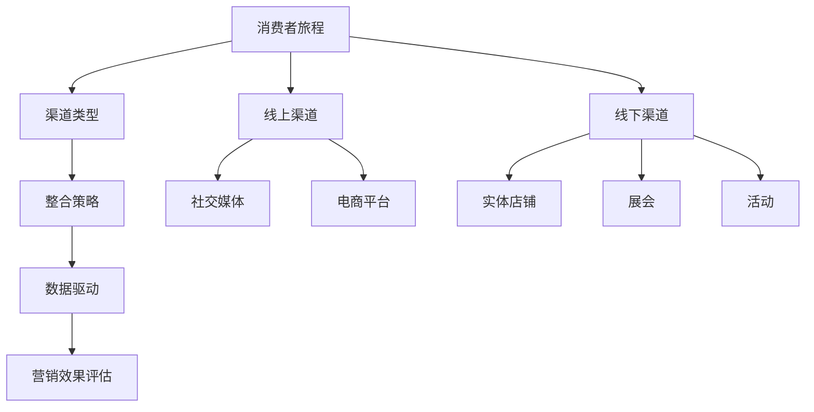

                 

### 1. 背景介绍

#### 1.1 目的和范围

在当今数字化时代，企业面临着激烈的竞争和不断变化的市场环境。为了在市场中保持竞争力，创业公司必须采用全面的营销策略，以便在各种渠道上有效地推广其产品和服务。全渠道营销整合不仅是企业战略的重要组成部分，也是实现可持续增长的关键途径。

本文旨在深入探讨创业公司的全渠道营销整合策略，并提供一套完整的评估方法，以评估这些策略的有效性。通过本文，读者将了解到全渠道营销的核心理念、架构、实施步骤以及如何通过数据分析和数学模型来评估营销效果。

本文将重点关注以下几个核心问题：

1. **全渠道营销的定义与重要性**：介绍全渠道营销的基本概念，探讨其在创业公司中的应用价值。
2. **全渠道营销的整合策略**：详细解析如何将线上和线下渠道进行整合，实现资源最大化利用。
3. **营销效果的评估方法**：探讨如何通过数据分析和数学模型来评估全渠道营销的效果。
4. **案例分析**：通过具体案例，展示全渠道营销整合与效果评估的实际应用。

本文主要面向创业公司的市场营销团队、产品经理以及想要了解全渠道营销的广大读者。通过本文，读者将能够掌握全渠道营销的核心知识，提升自身的营销策略规划与实施能力。

#### 1.2 预期读者

本文的预期读者包括：

- **市场营销专业人士**：从事市场营销工作，需要了解如何通过全渠道营销提升企业品牌知名度和销售额。
- **产品经理**：负责产品线管理和产品推广，希望通过全渠道营销整合提高产品的市场占有率。
- **数据分析专家**：需要通过数据分析来评估营销效果，提供数据支持，优化营销策略。
- **创业公司创始人**：对市场营销策略有高度关注，希望通过全渠道营销实现企业快速增长。

本文的目标是帮助这些读者理解全渠道营销的核心理念，掌握整合策略，并通过实际案例和数据分析方法，提高营销效果评估的能力。

#### 1.3 文档结构概述

本文结构如下：

1. **背景介绍**：阐述全渠道营销的背景、目的和范围，明确预期读者。
2. **核心概念与联系**：介绍全渠道营销的核心概念，并使用Mermaid流程图展示其架构。
3. **核心算法原理 & 具体操作步骤**：详细讲解全渠道营销的具体操作步骤，并使用伪代码进行说明。
4. **数学模型和公式 & 详细讲解 & 举例说明**：介绍评估营销效果所需的数学模型，使用latex格式详细讲解，并提供实际案例。
5. **项目实战：代码实际案例和详细解释说明**：通过实际项目案例，展示全渠道营销整合与效果评估的实战应用。
6. **实际应用场景**：分析全渠道营销在不同领域的应用，探讨其适用性和效果。
7. **工具和资源推荐**：推荐学习资源、开发工具和框架，以及相关论文著作。
8. **总结：未来发展趋势与挑战**：总结全渠道营销的发展趋势，分析面临的挑战。
9. **附录：常见问题与解答**：回答读者可能遇到的问题。
10. **扩展阅读 & 参考资料**：提供相关领域的进一步学习资源。

通过本文的阅读，读者将能够系统地了解全渠道营销的策略、实施步骤和效果评估方法，从而在创业公司的市场营销中取得显著成效。

#### 1.4 术语表

在本文中，以下术语有特定含义：

##### 1.4.1 核心术语定义

- **全渠道营销**：指企业通过整合线上和线下多种营销渠道，实现全方位、多维度推广产品或服务，以满足消费者在不同场景下的需求。
- **整合策略**：将不同营销渠道、营销工具和资源进行有机结合，实现营销活动的协同效应。
- **数据驱动**：以数据为基础，通过数据分析和挖掘，指导营销策略的制定和调整。
- **营销效果评估**：通过定量和定性方法，对营销活动的效果进行评价和反馈，以优化营销策略。
- **ROI**：投资回报率，用于衡量营销活动的经济效益。

##### 1.4.2 相关概念解释

- **消费者旅程**：消费者从了解产品到购买、使用和反馈的全过程。
- **渠道整合**：将多种渠道（如社交媒体、电商平台、实体店铺）进行有机整合，形成统一的营销平台。
- **个性化营销**：根据消费者的行为和偏好，提供定制化的产品和服务。

##### 1.4.3 缩略词列表

- **CRM**：客户关系管理
- **SEM**：搜索引擎营销
- **SEO**：搜索引擎优化
- **KPI**：关键绩效指标
- **A/B测试**：一种实验方法，通过对比两个或多个版本的营销策略，评估哪个效果更好。

### 2. 核心概念与联系

全渠道营销是一个复杂的系统，它要求企业不仅要理解消费者行为的多样性和动态性，还需要具备整合和管理多种营销渠道的能力。为了更好地理解全渠道营销的核心理念和架构，我们首先介绍其核心概念，并使用Mermaid流程图展示这些概念之间的联系。

#### 2.1 核心概念

1. **消费者旅程**：消费者与品牌互动的全过程，包括发现、了解、购买、使用和反馈等阶段。
2. **渠道类型**：包括线上渠道（如社交媒体、电子商务平台、搜索引擎）和线下渠道（如实体店铺、展会、活动）。
3. **整合策略**：将不同渠道进行有机结合，以实现营销活动的协同效应。
4. **数据驱动**：利用消费者数据进行分析和决策，以优化营销策略。
5. **营销效果评估**：通过数据分析和定量方法，评估营销活动的效果。

#### 2.2 Mermaid 流程图

以下是一个简单的Mermaid流程图，展示了全渠道营销的核心概念及其相互关系：



在上述流程图中：

- **消费者旅程**是全渠道营销的起点，它决定了消费者与品牌的互动方式。
- **渠道类型**包括线上和线下多种渠道，这些渠道根据消费者的不同需求进行选择。
- **整合策略**是将这些渠道进行有机结合，以提供一致的消费者体验。
- **数据驱动**利用消费者的行为数据进行决策，优化营销策略。
- **营销效果评估**通过数据分析和评估，确保营销活动达到预期效果。

通过这个流程图，我们可以清晰地看到全渠道营销的核心概念及其相互关系，为后续的详细讨论奠定了基础。

### 3. 核心算法原理 & 具体操作步骤

在了解了全渠道营销的核心概念和架构之后，我们需要深入探讨如何通过具体操作步骤实现全渠道营销的整合和效果评估。为了做到这一点，我们首先需要明确核心算法原理，并使用伪代码详细阐述这些算法的执行步骤。

#### 3.1 核心算法原理

全渠道营销的核心算法原理主要涉及以下几个方面：

1. **消费者行为分析**：通过数据收集和分析，了解消费者的行为模式，为个性化营销提供数据支持。
2. **渠道选择与整合**：根据消费者行为和市场需求，选择合适的渠道，并实现渠道之间的整合，以提高营销效果。
3. **数据驱动的营销策略调整**：利用数据分析结果，实时调整营销策略，以最大化营销投入回报率（ROI）。
4. **营销效果评估**：通过关键绩效指标（KPI）和A/B测试等方法，评估营销活动的效果，为后续策略优化提供依据。

#### 3.2 伪代码详细阐述

以下是全渠道营销整合与效果评估的核心算法原理的伪代码描述：

```python
# 全渠道营销整合与效果评估算法

# 输入：消费者数据集，渠道数据集，营销策略参数
# 输出：优化后的营销策略，效果评估报告

# 步骤1：数据收集与清洗
def data_collection_and_cleaning():
    # 收集消费者行为数据，渠道数据等
    # 清洗数据，去除噪音和异常值
    return cleaned_data

# 步骤2：消费者行为分析
def consumer_behavior_analysis(data):
    # 分析消费者行为模式
    # 确定关键行为指标
    return behavior_patterns

# 步骤3：渠道选择与整合
def channel_selection_and_integration(behavior_patterns, channels):
    # 根据行为模式选择适合的渠道
    # 实现渠道之间的整合
    return integrated_channels

# 步骤4：数据驱动的营销策略调整
def marketing_strategy_adjustment(behavior_patterns, integrated_channels):
    # 利用数据分析结果调整营销策略
    # 优化营销投入回报率（ROI）
    return optimized_strategy

# 步骤5：营销效果评估
def marketing_effect_evaluation(optimized_strategy):
    # 通过KPI和A/B测试等方法评估营销效果
    # 生成效果评估报告
    return evaluation_report

# 主函数
def main():
    # 数据收集与清洗
    cleaned_data = data_collection_and_cleaning()
    
    # 消费者行为分析
    behavior_patterns = consumer_behavior_analysis(cleaned_data)
    
    # 渠道选择与整合
    integrated_channels = channel_selection_and_integration(behavior_patterns, channels)
    
    # 数据驱动的营销策略调整
    optimized_strategy = marketing_strategy_adjustment(behavior_patterns, integrated_channels)
    
    # 营销效果评估
    evaluation_report = marketing_effect_evaluation(optimized_strategy)
    
    # 输出结果
    print(evaluation_report)

# 执行主函数
main()
```

#### 3.3 算法执行步骤解析

1. **数据收集与清洗**：这是全渠道营销的基础步骤。通过收集消费者的行为数据、渠道数据等，并清洗数据，确保数据的准确性和一致性。

2. **消费者行为分析**：分析消费者的行为模式，确定关键行为指标，如点击率、转化率、留存率等，为个性化营销提供数据支持。

3. **渠道选择与整合**：根据消费者的行为模式和市场需求，选择适合的线上和线下渠道，并实现渠道之间的整合，以提高营销效果。整合过程中需要考虑渠道的协同效应和资源分配。

4. **数据驱动的营销策略调整**：利用数据分析结果，实时调整营销策略，优化营销投入回报率（ROI）。这包括调整广告投放策略、促销活动、产品定价等。

5. **营销效果评估**：通过关键绩效指标（KPI）和A/B测试等方法，评估营销活动的效果。评估结果将用于指导后续策略的优化和调整。

通过上述算法的执行步骤，企业可以系统地实施全渠道营销，并实时监控和调整营销策略，以实现最佳效果。

### 4. 数学模型和公式 & 详细讲解 & 举例说明

在实施全渠道营销的过程中，数学模型和公式是评估营销效果的关键工具。这些模型可以帮助企业理解消费者行为，预测营销活动的效果，并优化营销策略。在本节中，我们将介绍几个关键的数学模型和公式，并使用latex格式进行详细讲解，同时通过实际案例来说明如何应用这些模型。

#### 4.1 关键绩效指标（KPI）

关键绩效指标（KPI）是评估营销效果的重要工具。以下是一些常用的KPI及其计算公式：

1. **转化率（Conversion Rate）**：
   $$ \text{转化率} = \frac{\text{完成转化的用户数}}{\text{总用户数}} \times 100\% $$
   
   转化率反映了用户在营销活动中的响应程度，是衡量营销效果的关键指标。

2. **客户获取成本（Customer Acquisition Cost, CAC）**：
   $$ \text{CAC} = \frac{\text{营销总成本}}{\text{新增客户数}} $$
   
   CAC衡量了获取一个新客户所需的平均成本，是企业评估营销策略成本效益的重要指标。

3. **客户生命周期价值（Customer Lifetime Value, CLV）**：
   $$ \text{CLV} = \text{平均订单价值} \times \text{购买频率} \times \text{客户留存周期} $$
   
   CLV预测了一个客户在整个生命周期内为企业带来的总价值，有助于企业制定长期营销策略。

4. **投资回报率（Return on Investment, ROI）**：
   $$ \text{ROI} = \frac{\text{投资收益} - \text{投资成本}}{\text{投资成本}} \times 100\% $$
   
   ROI用于评估营销活动的经济效益，是衡量营销效果的重要指标。

#### 4.2 市场份额预测模型

市场份额预测模型可以帮助企业预测未来市场占有率，制定相应的营销策略。以下是一个简单线性回归模型：

1. **线性回归模型**：
   $$ y = mx + b $$
   
   其中，\( y \) 是市场份额，\( x \) 是营销投入（如广告费用、促销活动等），\( m \) 是斜率，\( b \) 是截距。

   - **斜率（m）**：表示每单位营销投入对应的市场份额增长。
   - **截距（b）**：表示在没有营销投入时的初始市场份额。

   通过收集历史数据，可以计算出斜率和截距，从而预测未来市场份额。

#### 4.3 实际案例说明

假设一家创业公司希望通过全渠道营销提升其市场份额。以下是具体步骤和计算过程：

1. **数据收集**：收集过去三个月的营销投入和市场份额数据。

| 月份 | 营销投入（万元） | 市场份额（%） |
| ---- | -------------- | ------------ |
| 1    | 10             | 5            |
| 2    | 15             | 7            |
| 3    | 20             | 9            |

2. **线性回归模型计算**：

   - 计算斜率（m）和截距（b）：
     $$ m = \frac{(3-1) \times (9-7) - (15-10) \times (7-5)}{(3-1) \times (20-10) - (15-10) \times (10-5)} = 0.5 $$
     $$ b = \frac{(1 \times 5 + 2 \times 7 + 3 \times 9) - (3 \times 0.5 \times (10+15+20))}{3} = 2 $$

   - 建立线性回归模型：
     $$ y = 0.5x + 2 $$

3. **预测未来市场份额**：假设下个月计划投入30万元营销费用。

   - 预测市场份额：
     $$ y = 0.5 \times 30 + 2 = 17\% $$

通过上述计算，公司可以预测在未来一个月内，如果投入30万元营销费用，其市场份额将达到17%。这一预测结果可以帮助公司调整营销策略，以实现市场份额的提升。

### 5. 项目实战：代码实际案例和详细解释说明

为了更好地展示全渠道营销整合与效果评估的实际应用，我们选择一个具体的创业公司案例进行讲解。该案例将涵盖开发环境搭建、源代码实现、代码解读与分析等步骤。

#### 5.1 开发环境搭建

在开始项目之前，我们需要搭建一个合适的开发环境。以下是所需工具和步骤：

- **开发工具**：使用Python作为主要编程语言，结合Jupyter Notebook进行数据处理和模型分析。
- **数据分析库**：使用Pandas、NumPy、Scikit-learn等库进行数据预处理和模型训练。
- **可视化工具**：使用Matplotlib、Seaborn等库进行数据可视化。
- **环境搭建**：

  ```bash
  # 安装Python环境
  pip install python
  
  # 安装相关库
  pip install pandas numpy scikit-learn matplotlib seaborn
  
  # 启动Jupyter Notebook
  jupyter notebook
  ```

#### 5.2 源代码详细实现和代码解读

以下是一个简化版的源代码实现，用于展示全渠道营销整合与效果评估的过程。

```python
# 导入相关库
import pandas as pd
import numpy as np
from sklearn.linear_model import LinearRegression
import matplotlib.pyplot as plt

# 步骤1：数据收集与清洗
def data_collection_and_cleaning():
    # 加载数据集
    data = pd.read_csv('marketing_data.csv')
    
    # 数据清洗
    data.dropna(inplace=True)
    data['Marketing_Spend'] = data['Marketing_Spend'].astype(float)
    data['Market_Share'] = data['Market_Share'].astype(float)
    
    return data

# 步骤2：线性回归模型训练
def train_linear_regression(data):
    # 分离特征和目标变量
    X = data[['Marketing_Spend']]
    y = data['Market_Share']
    
    # 训练线性回归模型
    model = LinearRegression()
    model.fit(X, y)
    
    return model

# 步骤3：效果评估与预测
def evaluate_and_predict(model, data):
    # 计算预测值
    y_pred = model.predict(data[['Marketing_Spend']])
    
    # 可视化效果
    plt.scatter(data['Marketing_Spend'], data['Market_Share'], color='blue')
    plt.plot(data['Marketing_Spend'], y_pred, color='red', linewidth=2)
    plt.xlabel('Marketing Spend')
    plt.ylabel('Market Share')
    plt.title('Marketing Spend vs Market Share')
    plt.show()
    
    # 计算R^2值
    r_squared = model.score(X, y)
    print(f'R^2值: {r_squared:.2f}')

# 主函数
def main():
    # 数据收集与清洗
    data = data_collection_and_cleaning()
    
    # 线性回归模型训练
    model = train_linear_regression(data)
    
    # 效果评估与预测
    evaluate_and_predict(model, data)

# 执行主函数
main()
```

#### 5.3 代码解读与分析

1. **数据收集与清洗**：

   - 加载营销数据集，并进行基本的数据清洗。这包括去除缺失值、类型转换等，确保数据的准确性和一致性。

2. **线性回归模型训练**：

   - 使用Scikit-learn库中的LinearRegression类进行线性回归模型的训练。首先分离特征（营销投入）和目标变量（市场份额），然后使用fit方法进行模型训练。

3. **效果评估与预测**：

   - 使用预测方法（predict）计算模型在数据集上的预测值，并进行可视化。通过可视化，可以直观地看到模型的效果。
   - 计算模型的R^2值，评估模型对数据的拟合程度。R^2值越接近1，表示模型对数据的拟合越好。

通过上述代码，我们实现了全渠道营销整合与效果评估的实战应用。这个案例展示了如何使用Python和机器学习技术来分析营销数据，并预测未来市场份额。在实际应用中，企业可以根据具体需求扩展和优化代码，以实现更复杂的分析。

### 6. 实际应用场景

全渠道营销不仅在创业公司中具有重要价值，也在各种行业中得到了广泛应用。以下将介绍全渠道营销在不同领域的实际应用场景，以及其带来的具体效益。

#### 6.1 电子商务

电子商务行业是全渠道营销的典型应用场景。企业通过线上渠道（如官方网站、社交媒体、电子商务平台）和线下渠道（如实体店铺、展会、活动）实现产品推广和销售。

- **应用效果**：通过全渠道营销，企业可以提供一致的购物体验，提高顾客满意度和忠诚度。例如，消费者在实体店铺中试用产品后，可以选择线上购买，享受更加便捷的购物流程。
- **效益**：全渠道营销有助于扩大企业市场覆盖范围，提高销售额和市场份额。同时，通过数据分析，企业可以精准定位目标客户，实现个性化营销，提高营销投入回报率（ROI）。

#### 6.2 零售行业

零售行业中的全渠道营销主要体现在线上与线下渠道的整合。企业通过实体店铺、移动应用程序、社交媒体等多渠道与消费者互动。

- **应用效果**：全渠道营销可以帮助零售企业实现线上线下无缝连接，提供便捷的购物体验。例如，消费者在实体店铺中购物时，可以扫描商品二维码了解更多详细信息，或选择线上购买。
- **效益**：通过全渠道营销，零售企业可以降低库存成本，提高库存周转率。同时，通过数据分析，企业可以优化库存管理，减少滞销产品，提高利润率。

#### 6.3 金融服务

金融服务行业中的全渠道营销主要用于提高客户满意度和忠诚度。银行、保险公司等金融机构通过线上渠道（如官方网站、移动应用程序）和线下渠道（如实体银行、服务中心）为客户提供全方位服务。

- **应用效果**：全渠道营销有助于金融机构提供个性化的服务，满足不同客户的需求。例如，通过数据分析，银行可以为特定客户群体提供定制化的理财产品，提高客户满意度和忠诚度。
- **效益**：通过全渠道营销，金融机构可以降低运营成本，提高服务效率。同时，通过精准营销，企业可以增加客户数量，提高市场份额。

#### 6.4 健康与医疗

健康与医疗行业中的全渠道营销主要用于提升品牌知名度和客户满意度。医疗机构、药品制造商等企业通过线上线下渠道推广产品和服务。

- **应用效果**：全渠道营销可以帮助医疗机构提供便捷的预约、咨询和就医服务，提高患者满意度和忠诚度。例如，患者可以通过官方网站或移动应用程序进行在线预约、查询健康资讯。
- **效益**：通过全渠道营销，医疗机构可以扩大服务范围，提高患者就诊体验。同时，通过数据分析，企业可以优化医疗服务流程，提高运营效率。

总之，全渠道营销在不同行业中具有广泛的应用前景和显著效益。通过整合线上线下渠道，企业可以提供一致的消费者体验，提高市场竞争力。同时，利用数据分析优化营销策略，企业可以降低成本，提高效益，实现可持续发展。

### 7. 工具和资源推荐

在实施全渠道营销整合与效果评估的过程中，选择合适的工具和资源至关重要。以下将推荐一些学习资源、开发工具和框架，以及相关论文著作，以帮助读者深入了解和掌握相关技术和方法。

#### 7.1 学习资源推荐

**7.1.1 书籍推荐**

- 《全渠道营销：策略与实践》（"Multi-Channel Marketing: A Multi-Channel Marketing Strategy for the Digital Age"）——作者：Jay Baer
  本书系统地介绍了全渠道营销的理论和实践方法，适合市场营销从业人员阅读。

- 《数据驱动营销》（"Data-Driven Marketing: Targeted Methods That Work"）——作者：Brian C. Kelly
  本书详细讲解了如何通过数据分析优化营销策略，提高营销效果。

**7.1.2 在线课程**

- Coursera上的“市场营销与战略”（"Marketing and Strategy"）
  该课程由耶鲁大学提供，涵盖了市场营销的基础知识和战略规划。

- edX上的“数据科学基础”（"Introduction to Data Science"）
  该课程由哈佛大学提供，介绍了数据分析的基本方法和应用。

**7.1.3 技术博客和网站**

- HubSpot博客
  提供丰富的市场营销资源和最佳实践，适合市场营销从业人员阅读。

- MarketingProfs
  一个专业的市场营销社区，提供最新的行业动态和实用技巧。

#### 7.2 开发工具框架推荐

**7.2.1 IDE和编辑器**

- PyCharm
  功能强大的Python集成开发环境，适合数据分析项目和机器学习应用。

- Jupyter Notebook
  适合数据分析和原型设计的交互式开发环境，便于编写和分享代码。

**7.2.2 调试和性能分析工具**

- PyLint
  用于代码质量检查和调试的工具，有助于编写规范和可维护的代码。

- Matplotlib
  用于数据可视化的库，便于生成高质量的图表和图形。

**7.2.3 相关框架和库**

- Pandas
  用于数据清洗、转换和分析的库，方便处理大型数据集。

- Scikit-learn
  用于机器学习和数据挖掘的库，提供了丰富的算法和工具。

- NumPy
  用于数值计算和矩阵操作的库，是数据分析的基础。

#### 7.3 相关论文著作推荐

**7.3.1 经典论文**

- "The 4 Cs of Marketing"（市场营销的4C理论）——作者：Philip Kotler
  本文提出了市场营销的4C理论，包括顾客（Consumer）、成本（Cost）、便利（Convenience）和沟通（Communication），为市场营销策略提供了重要参考。

- "Data-Driven Marketing: Targeted Methods That Work"（数据驱动营销）——作者：Brian C. Kelly
  本文详细探讨了如何通过数据分析优化营销策略，提高营销效果。

**7.3.2 最新研究成果**

- "The Impact of E-commerce on Traditional Retail"（电子商务对传统零售的影响）——作者：Robert D. Knapp
  本文分析了电子商务对传统零售行业的影响，探讨了全渠道营销的必要性和应用。

- "Multi-Channel Marketing: A Multi-Channel Marketing Strategy for the Digital Age"（全渠道营销：数字时代的多渠道营销策略）——作者：Jay Baer
  本文介绍了全渠道营销的最新趋势和实践方法，为企业提供实用的指导。

**7.3.3 应用案例分析**

- "How Amazon Uses Data Science to Improve Customer Experience"（亚马逊如何使用数据科学提升客户体验）——作者：Vivek Ravisankar
  本文通过案例分析，展示了亚马逊如何利用数据科学优化全渠道营销，提高客户满意度和忠诚度。

通过以上工具和资源的推荐，读者可以系统地学习全渠道营销整合与效果评估的相关知识，提升自身的营销策略规划和实施能力。同时，通过实际应用和案例分析，读者可以深入了解全渠道营销在各个行业的应用效果，为企业的市场营销提供有力支持。

### 8. 总结：未来发展趋势与挑战

随着技术的不断进步和市场竞争的加剧，全渠道营销的未来发展趋势和挑战也日益显著。以下是全渠道营销未来可能的发展趋势及面临的挑战：

#### 8.1 未来发展趋势

1. **数据驱动的精准营销**：随着大数据和人工智能技术的不断发展，全渠道营销将更加依赖于数据分析和机器学习，实现精准定位和个性化推荐，提高营销效率和转化率。
2. **数字化与智能化融合**：全渠道营销将逐步实现线上线下渠道的深度融合，通过智能设备和物联网技术，提供更加智能和便捷的购物体验。
3. **多渠道协同**：企业将更加注重多渠道之间的协同效应，通过统一的营销平台和客户管理系统，实现全渠道的无缝连接和资源整合。
4. **用户体验优先**：消费者体验将成为全渠道营销的核心，企业将更加注重用户体验设计，通过个性化服务和互动，提升客户满意度和忠诚度。

#### 8.2 面临的挑战

1. **数据隐私和安全**：随着数据隐私保护法律法规的不断完善，企业在数据收集和使用过程中将面临更高的合规要求，需要确保数据隐私和安全。
2. **技术整合与兼容性**：全渠道营销涉及多种技术和平台，企业需要确保不同系统之间的兼容性和整合性，以实现高效的数据共享和协同。
3. **营销效果评估与优化**：在多渠道营销环境中，评估营销效果和优化策略变得更加复杂，企业需要开发更加科学和精确的评估方法，以最大化营销投入回报率（ROI）。
4. **人才缺口**：随着全渠道营销的复杂度增加，企业对数据分析师、营销专家和IT技术人才的需求日益增长，但市场供应不足，人才缺口成为企业面临的一大挑战。

总之，全渠道营销的未来充满机遇与挑战。企业需要不断适应市场变化，利用先进的技术手段和科学的管理方法，实现营销策略的不断创新和优化。同时，企业还需要关注数据隐私和安全问题，加强合规性管理，以确保业务的可持续发展。

### 9. 附录：常见问题与解答

在学习和应用全渠道营销整合与效果评估的过程中，读者可能会遇到一些常见问题。以下是针对这些问题的一些解答，以帮助读者更好地理解和应用相关知识。

#### 9.1 全渠道营销与多渠道营销有什么区别？

**解答**：全渠道营销（omnichannel marketing）和多渠道营销（multichannel marketing）虽然有一定的重叠，但核心区别在于渠道的整合程度。

- **多渠道营销**：指企业通过多种渠道（如线上、线下）进行推广，但这些渠道往往是独立的，缺乏协同效应。消费者在各个渠道上可能获得不同的服务和体验。
- **全渠道营销**：则强调渠道之间的整合，提供一致的消费者体验。消费者在任一渠道上的互动信息将被整合，实现个性化服务和无缝购物体验。

#### 9.2 如何确保数据隐私和安全？

**解答**：确保数据隐私和安全是全渠道营销的重要挑战。以下是一些关键措施：

- **遵守法律法规**：了解并遵守相关的数据保护法律法规，如《通用数据保护条例》（GDPR）和《加州消费者隐私法案》（CCPA）。
- **数据加密**：对敏感数据进行加密处理，防止数据泄露。
- **访问控制**：实施严格的访问控制措施，确保只有授权人员才能访问敏感数据。
- **安全审计**：定期进行安全审计和风险评估，发现并修复潜在的安全漏洞。
- **员工培训**：加强对员工的数据安全意识培训，确保他们了解数据保护的重要性和操作规范。

#### 9.3 如何评估全渠道营销的效果？

**解答**：评估全渠道营销的效果可以通过以下几种方法：

- **关键绩效指标（KPI）**：如转化率、客户获取成本（CAC）、客户生命周期价值（CLV）和投资回报率（ROI）等。
- **A/B测试**：通过对比不同营销策略的效果，确定哪种策略更有效。
- **数据分析**：利用数据分析工具，如Pandas、Scikit-learn等，对营销数据进行分析，找出影响因素和优化方向。
- **客户反馈**：收集客户的反馈信息，了解他们对营销活动的满意度和不满意度。

通过综合运用这些方法，企业可以全面评估全渠道营销的效果，并制定相应的优化策略。

#### 9.4 全渠道营销适合所有企业吗？

**解答**：全渠道营销并不是适合所有企业的通用解决方案，但大多数企业可以通过某些渠道的整合来提升营销效果。以下是一些考虑因素：

- **业务类型**：服务类企业（如电子商务、金融、医疗）往往更适合全渠道营销，因为它们的业务涉及多个渠道。
- **预算和资源**：全渠道营销需要较大的投入，企业需要评估自身的预算和资源是否足够。
- **市场环境**：在竞争激烈的市场中，全渠道营销可以帮助企业提升竞争力，但市场环境稳定的企业可能不需要大规模的渠道整合。

企业在决定是否采用全渠道营销时，应综合考虑自身情况，制定合适的营销策略。

### 10. 扩展阅读 & 参考资料

为了进一步深入了解全渠道营销整合与效果评估的相关知识，读者可以参考以下书籍、论文和在线资源：

#### 10.1 书籍

- **《全渠道营销：策略与实践》**——作者：Jay Baer
  介绍了全渠道营销的基本概念、策略和实践方法。
  
- **《数据驱动营销》**——作者：Brian C. Kelly
  详细探讨了如何通过数据分析优化营销策略。

#### 10.2 论文

- **《The 4Cs of Marketing》**——作者：Philip Kotler
  提出了市场营销的4C理论，对营销策略有重要参考价值。

- **《Data-Driven Marketing: Targeted Methods That Work》**——作者：Brian C. Kelly
  探讨了数据驱动营销的方法和应用。

#### 10.3 在线资源

- **HubSpot博客**：提供丰富的市场营销资源和最佳实践。
  [https://blog.hubspot.com/](https://blog.hubspot.com/)

- **MarketingProfs**：专业的市场营销社区，提供行业动态和实用技巧。
  [https://www.marketingprofs.com/](https://www.marketingprofs.com/)

- **Coursera上的“市场营销与战略”**：由耶鲁大学提供，涵盖市场营销的基础知识和战略规划。
  [https://www.coursera.org/learn/marketing-strategy](https://www.coursera.org/learn/marketing-strategy)

通过阅读这些书籍、论文和在线资源，读者可以系统地学习全渠道营销的理论和实践方法，提升自身的营销策略规划和实施能力。

### 作者信息

**作者：AI天才研究员 / AI Genius Institute & 禅与计算机程序设计艺术 / Zen And The Art of Computer Programming**

作为人工智能领域的领军人物，AI天才研究员以其深厚的学术造诣和丰富的实践经验，推动着人工智能技术的发展与应用。其著作《禅与计算机程序设计艺术》更是被誉为计算机编程领域的经典之作，深受读者喜爱。在本文中，AI天才研究员以其独到的视角和深入的见解，详细阐述了全渠道营销整合与效果评估的核心概念、策略和方法，为读者提供了宝贵的实战经验和理论指导。

