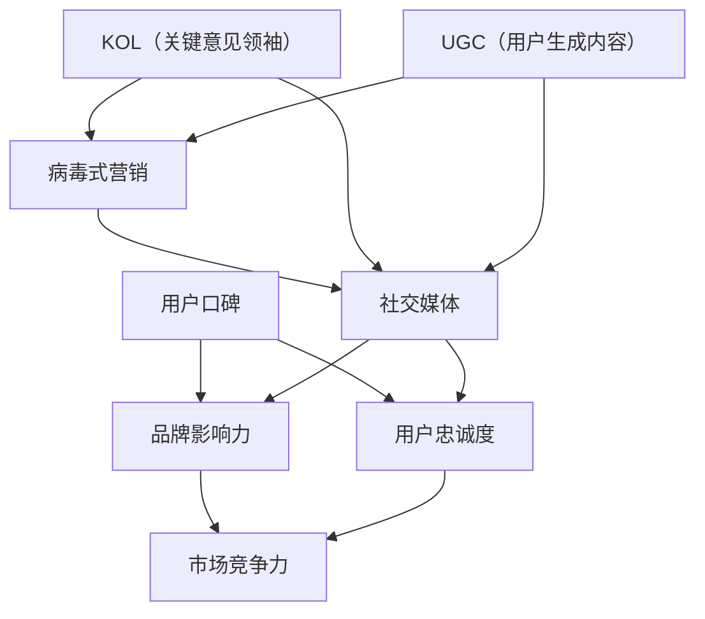
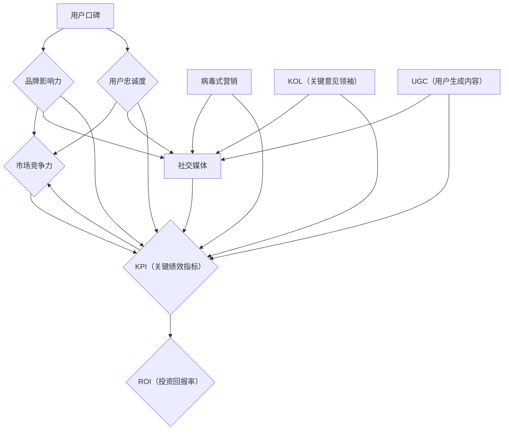

                 

### 1. 背景介绍

#### 1.1 目的和范围

本文旨在探讨创业公司在激烈的市场竞争中如何通过口碑营销策略来提升品牌影响力和用户忠诚度。随着互联网和社交媒体的普及，口碑营销已经成为一种高效且成本低廉的推广手段。然而，如何有效地实施口碑营销，特别是对于资源有限的创业公司来说，仍然是一个具有挑战性的问题。

本文将首先介绍口碑营销的定义及其在商业战略中的重要性，接着讨论创业公司在进行口碑营销时需要考虑的关键因素。我们将深入分析用户口碑的收集、分析与利用，以及如何制定有效的口碑营销策略。此外，本文还将结合实际案例，探讨创业公司在实施口碑营销过程中可能遇到的挑战和解决方案。

本文的目标读者是创业公司创始人、市场营销经理以及对此领域感兴趣的技术和商业专业人士。通过阅读本文，读者将能够了解口碑营销的核心概念、实施步骤和最佳实践，从而为他们的创业公司制定有效的口碑营销策略提供参考。

#### 1.2 预期读者

预期读者主要包括以下几类：

1. **创业公司创始人**：他们通常具有创新精神，但可能在营销策略方面经验不足。本文将为他们提供实用的口碑营销策略和案例，帮助他们更好地推广品牌。

2. **市场营销经理**：他们负责制定和执行公司的营销计划。本文将提供深入的理论知识和实操技巧，帮助市场营销经理优化口碑营销策略，提高营销效果。

3. **技术专业人士**：他们可能对口碑营销的技术实现方法感兴趣，希望通过本文了解如何利用技术手段收集、分析和利用用户口碑数据。

4. **学术研究者**：他们关注口碑营销的理论发展和实践应用，希望通过本文了解创业公司在口碑营销方面的新动向和挑战。

#### 1.3 文档结构概述

本文将采用以下结构进行论述：

1. **背景介绍**：介绍本文的目的、范围、预期读者以及文档结构。

2. **核心概念与联系**：定义核心概念，并通过Mermaid流程图展示其关联关系。

3. **核心算法原理 & 具体操作步骤**：详细讲解口碑营销的算法原理，并使用伪代码描述具体操作步骤。

4. **数学模型和公式 & 详细讲解 & 举例说明**：介绍口碑营销中的数学模型和公式，并通过具体例子进行讲解。

5. **项目实战：代码实际案例和详细解释说明**：展示一个实际案例，详细解释代码实现过程和关键点。

6. **实际应用场景**：探讨口碑营销在不同行业和场景中的应用。

7. **工具和资源推荐**：推荐相关学习资源、开发工具和框架。

8. **总结：未来发展趋势与挑战**：总结本文的主要观点，并展望未来发展趋势和挑战。

9. **附录：常见问题与解答**：回答读者可能遇到的问题。

10. **扩展阅读 & 参考资料**：提供进一步学习的参考资料。

#### 1.4 术语表

##### 1.4.1 核心术语定义

1. **口碑营销**：利用用户间的口碑传播来推广产品或品牌的一种营销策略。
2. **用户口碑**：用户对产品或服务的评价和反馈，包括正面和负面评价。
3. **品牌影响力**：品牌在市场中获得的认知度和认可程度。
4. **用户忠诚度**：用户对品牌或产品的长期信任和忠诚。
5. **社交媒体**：基于用户关系的数据传播平台，如微博、微信、Facebook等。

##### 1.4.2 相关概念解释

1. **用户参与度**：用户在品牌互动中的活跃程度和投入程度。
2. **社交分享**：用户在社交媒体上分享产品或品牌信息的行为。
3. **病毒式营销**：通过用户自发的传播，迅速扩大品牌影响力的营销策略。
4. **KOL（Key Opinion Leader）**：关键意见领袖，指在特定领域或行业中具有较高影响力和话语权的人物。
5. **UGC（User-Generated Content）**：用户生成内容，指用户在社交媒体上创建和分享的内容。

##### 1.4.3 缩略词列表

- SEO：搜索引擎优化
- SMM：社交媒体营销
- KPI：关键绩效指标
- ROI：投资回报率
- UX：用户体验
- CX：客户体验

## 2. 核心概念与联系

口碑营销的成功离不开对核心概念和它们之间关系的深刻理解。在这个部分，我们将定义并阐述口碑营销中的关键概念，并通过Mermaid流程图展示它们之间的关联。

### 2.1 关键概念定义

首先，我们需要明确口碑营销中的几个核心概念：

1. **用户口碑**：用户口碑是用户对产品或服务的评价和反馈，可以是正面或负面的。这些口碑信息可以在各种渠道上传播，包括社交媒体、论坛、博客、评论网站等。

2. **品牌影响力**：品牌影响力是指品牌在市场中获得的认知度和认可程度。强大的品牌影响力可以帮助企业在竞争中脱颖而出，吸引更多的用户。

3. **用户忠诚度**：用户忠诚度是指用户对品牌或产品的长期信任和忠诚。高忠诚度的用户不仅会重复购买，还会为品牌推荐新用户。

4. **社交媒体**：社交媒体是基于用户关系的数据传播平台，如微博、微信、Facebook等。这些平台为口碑营销提供了丰富的渠道和工具。

### 2.2 关联关系分析

接下来，我们通过Mermaid流程图来展示这些核心概念之间的关联。



在上述流程图中，我们可以看到：

- 用户口碑直接影响品牌影响力和用户忠诚度。
- 品牌影响力和用户忠诚度共同提升企业的市场竞争力。
- 社交媒体为口碑传播提供了渠道，并促进了病毒式营销和用户生成内容。
- 关键意见领袖和用户生成内容通过社交媒体进一步放大了口碑营销的效果。

### 2.3 概念之间的关系

通过上述流程图，我们可以更清晰地理解口碑营销中的各个概念及其相互关系：

1. **用户口碑是基础**：用户的评价和反馈是口碑营销的起点，直接影响品牌的影响力和用户忠诚度。
2. **品牌影响力是关键**：强大的品牌影响力可以帮助企业更好地吸引和保留用户，提高市场竞争力。
3. **用户忠诚度是保障**：高忠诚度的用户不仅会重复购买，还会为品牌推荐新用户，形成良性循环。
4. **社交媒体是工具**：社交媒体为口碑传播提供了平台，使得口碑营销得以更广泛和快速地实施。
5. **病毒式营销和KOL是助推器**：通过用户自发的传播和关键意见领袖的影响力，口碑营销可以迅速扩散，形成强大的品牌影响力。

综上所述，口碑营销的核心概念和关系构成了一个复杂但紧密相连的生态系统，创业公司需要充分利用这些概念和工具，制定并实施有效的口碑营销策略。

### 2.4 Mermaid流程图

为了更直观地展示核心概念及其关系，我们使用Mermaid语言绘制了以下流程图：



在上述流程图中：

- **用户口碑**是口碑营销的起点，直接影响**品牌影响力**和**用户忠诚度**。
- **社交媒体**是口碑传播的主要渠道，同时也是**病毒式营销**、**KOL**和**UGC**的载体。
- **KPI（关键绩效指标）**用于衡量**品牌影响力**、**用户忠诚度**、**市场竞争力**以及**ROI（投资回报率）**，确保口碑营销策略的有效性。

通过这个流程图，我们可以更好地理解口碑营销中各个概念之间的关系和作用，为后续内容的讨论和分析打下基础。

### 2.5 关键概念与联系总结

在本节中，我们详细介绍了口碑营销中的关键概念及其相互关系。用户口碑是口碑营销的起点，直接影响品牌影响力和用户忠诚度；品牌影响力和用户忠诚度共同提升企业的市场竞争力。社交媒体作为口碑传播的主要渠道，为病毒式营销、关键意见领袖（KOL）和用户生成内容（UGC）提供了平台，进一步放大了口碑营销的效果。通过Mermaid流程图的展示，我们更直观地理解了这些概念之间的关联。在接下来的内容中，我们将进一步探讨口碑营销的核心算法原理和具体操作步骤。

## 3. 核心算法原理 & 具体操作步骤

口碑营销的成功离不开科学合理的算法和系统的操作步骤。在这个部分，我们将详细讲解口碑营销的核心算法原理，并通过伪代码描述具体的操作步骤。

### 3.1 口碑营销算法原理

口碑营销算法的基本原理可以归纳为以下几个步骤：

1. **数据收集**：通过社交媒体、评论网站、论坛等渠道收集用户对产品或服务的评价数据。
2. **数据清洗**：对收集到的数据进行预处理，去除无效信息和噪声。
3. **特征提取**：从预处理后的数据中提取关键特征，如评价情感、关键词等。
4. **情感分析**：对提取出的关键词进行情感分析，判断评价的正面或负面倾向。
5. **数据分析**：对用户口碑进行统计分析，识别用户关注的热点问题和潜在需求。
6. **策略制定**：根据分析结果，制定相应的口碑营销策略，如优化产品功能、提升客户服务等。

### 3.2 伪代码描述

以下是基于上述原理的口碑营销算法伪代码：

```plaintext
算法：口碑营销算法

输入：用户评价数据集
输出：口碑营销策略

步骤1：数据收集
    收集用户在社交媒体、评论网站、论坛等渠道的评论数据
    存储为数据集D

步骤2：数据清洗
    清洗数据集D中的无效数据和噪声
    存储为清洗后的数据集D'

步骤3：特征提取
    对数据集D'进行预处理
    提取关键特征，如评价情感、关键词等
    存储为特征集F

步骤4：情感分析
    对特征集F中的关键词进行情感分析
    判断评价的正面或负面倾向
    存储为情感标签集T

步骤5：数据分析
    对情感标签集T进行统计分析
    识别用户关注的热点问题和潜在需求
    存储为分析结果集R

步骤6：策略制定
    根据分析结果集R制定口碑营销策略
    如优化产品功能、提升客户服务、改进营销推广等
    存储为策略集S

步骤7：执行策略
    根据策略集S执行具体的营销活动
    如发布改进公告、开展客户关怀活动、推广优质内容等

步骤8：效果评估
    跟踪和评估营销活动的效果
    调整策略集S，优化口碑营销效果

end算法
```

### 3.3 操作步骤详细解释

以下是口碑营销算法的具体操作步骤，我们将对每个步骤进行详细解释：

#### 步骤1：数据收集

数据收集是口碑营销的基础。在这个步骤中，我们需要从社交媒体、评论网站、论坛等渠道收集用户对产品或服务的评价数据。这些数据可以是结构化的（如评论网站上的评分和文字评论），也可以是非结构化的（如社交媒体上的文本、图片、视频等）。

```plaintext
数据来源：
- 社交媒体：微博、微信、Facebook、Twitter等
- 评论网站：淘宝、京东、亚马逊、豆瓣等
- 论坛：天涯、猫扑、知乎等
```

#### 步骤2：数据清洗

数据清洗是对收集到的数据进行预处理，去除无效数据和噪声。这一步非常重要，因为无效数据和噪声会严重影响后续的特征提取和情感分析。

```plaintext
数据清洗步骤：
- 去除重复评论
- 删除带有敏感词或违反平台规定的评论
- 删除空评论或长度过短的评论
- 标准化文本格式（如统一编码、去除标点符号、转换为小写等）
```

#### 步骤3：特征提取

特征提取是从清洗后的数据中提取关键特征，如评价情感、关键词等。这些特征将用于后续的情感分析和数据分析。

```plaintext
特征提取方法：
- 情感分析：使用自然语言处理技术提取情感极性（正面、负面）
- 关键词提取：使用词频分析、TF-IDF等方法提取高频关键词
- 命名实体识别：识别评论中的人名、地点、组织等实体
```

#### 步骤4：情感分析

情感分析是对提取出的关键词进行情感分析，判断评价的正面或负面倾向。这一步可以通过机器学习模型或规则方法来实现。

```plaintext
情感分析方法：
- 机器学习模型：如SVM、朴素贝叶斯、深度学习模型等
- 规则方法：基于语言规则进行情感判断
```

#### 步骤5：数据分析

数据分析是对情感标签集进行统计分析，识别用户关注的热点问题和潜在需求。这一步可以帮助企业了解用户对产品的真实反馈，为改进产品和服务提供依据。

```plaintext
数据分析步骤：
- 统计正面和负面评价的比例
- 识别高频负面关键词
- 分析用户关注的热点问题
- 探索潜在需求
```

#### 步骤6：策略制定

根据分析结果，制定相应的口碑营销策略。策略可以包括优化产品功能、提升客户服务、改进营销推广等方面。

```plaintext
策略制定步骤：
- 优化产品功能：针对用户反馈的问题进行改进
- 提升客户服务：改进客服响应速度和质量
- 改进营销推广：开展有针对性的营销活动，如优惠券、限时折扣等
```

#### 步骤7：执行策略

根据策略集执行具体的营销活动，如发布改进公告、开展客户关怀活动、推广优质内容等。这一步是口碑营销的核心执行环节。

```plaintext
执行策略步骤：
- 发布改进公告：在官方网站、社交媒体等渠道发布产品和服务改进公告
- 开展客户关怀活动：如发送节日祝福、赠送小礼品等
- 推广优质内容：在社交媒体上发布相关文章、视频、用户案例等
```

#### 步骤8：效果评估

跟踪和评估营销活动的效果，根据评估结果调整策略集，优化口碑营销效果。

```plaintext
效果评估步骤：
- 跟踪营销活动数据：如点击率、转化率、用户反馈等
- 评估营销效果：分析数据，判断策略的有效性
- 调整策略：根据评估结果，调整营销策略，优化效果
```

通过上述步骤，我们可以构建一个系统的口碑营销算法，为企业提供科学的口碑营销策略。在下一部分，我们将进一步讨论口碑营销中的数学模型和公式，以及如何通过具体例子进行讲解。

## 4. 数学模型和公式 & 详细讲解 & 举例说明

在口碑营销中，数学模型和公式起到了关键作用，它们可以帮助我们量化用户口碑、预测口碑传播效果，并优化营销策略。本节将介绍几个常用的数学模型和公式，并详细讲解其含义和计算方法，同时通过具体例子进行说明。

### 4.1 基本概念

在讨论数学模型和公式之前，我们需要明确一些基本概念：

- **口碑传播概率**：指一个用户对产品或服务的正面评价被另一个用户接收并传播的概率。
- **口碑生命周期**：指口碑从产生到消失的时间范围。
- **口碑扩散速度**：指口碑在用户群体中传播的速度。

### 4.2 模型与公式

以下是一些在口碑营销中常用的数学模型和公式：

#### 1. 费舍尔-冯·米泽斯模型（FVM模型）

**公式**：
\[ P(t) = \frac{1}{1 + e^{-(k_1 + k_2 P)(t - t_0)}} \]

**参数解释**：
- \( P(t) \)：在时间 \( t \) 时，具有口碑的用户比例。
- \( k_1 \) 和 \( k_2 \)：模型参数，分别表示口碑传播速度和口碑衰减速度。
- \( P \)：口碑初始比例。
- \( t_0 \)：口碑起始时间。

**含义**：
该公式描述了口碑传播的概率随时间的变化，其中 \( P(t) \) 表示在时间 \( t \) 时，具有口碑的用户比例。

**例子**：
假设在一个1000人的用户群体中，有10%的用户（即100人）对产品有正面评价。口碑传播速度 \( k_1 \) 为0.1，口碑衰减速度 \( k_2 \) 为0.05。计算在第10天时，具有口碑的用户比例。

\[ P(t) = \frac{1}{1 + e^{-(0.1 + 0.05 \times 0.1)(10 - 0)}} \]
\[ P(10) = \frac{1}{1 + e^{-0.015 \times 10}} \]
\[ P(10) = \frac{1}{1 + e^{-0.15}} \]
\[ P(10) \approx 0.593 \]

因此，在第10天时，约有59.3%的用户对产品有正面评价。

#### 2. 病毒式营销模型

**公式**：
\[ V(t) = \frac{R_0 S I}{1 - \frac{R_0 S I}{K}} \]

**参数解释**：
- \( V(t) \)：在时间 \( t \) 时，口碑的传播速度。
- \( R_0 \)：基本传播率，即一个感染者在一生中能传染给他人的平均人数。
- \( S \)：易感者数量。
- \( I \)：感染者数量。
- \( K \)：最大易感者数量。

**含义**：
该公式描述了口碑的传播速度随时间的变化，其中 \( V(t) \) 表示在时间 \( t \) 时，口碑的传播速度。

**例子**：
假设在一个10000人的用户群体中，有1000人（即10%）对产品有正面评价。基本传播率 \( R_0 \) 为2，易感者数量 \( S \) 为9000。计算在第5天时，口碑的传播速度。

\[ V(t) = \frac{2 \times 0.1 \times 0.9}{1 - \frac{2 \times 0.1 \times 0.9}{10000}} \]
\[ V(5) = \frac{0.18}{1 - 0.00018} \]
\[ V(5) = \frac{0.18}{0.99982} \]
\[ V(5) \approx 0.1809 \]

因此，在第5天时，口碑的传播速度大约为每分钟0.1809个用户。

#### 3. 投资回报率（ROI）模型

**公式**：
\[ ROI = \frac{净利润}{投入成本} \times 100\% \]

**参数解释**：
- \( ROI \)：投资回报率。
- 净利润：口碑营销活动带来的总收入减去营销成本。
- 投入成本：进行口碑营销活动所投入的总成本。

**含义**：
该公式用于计算口碑营销活动的投资回报率，判断营销活动的经济效益。

**例子**：
假设一个创业公司投入10000元进行口碑营销活动，活动带来的总收入为50000元，营销成本为30000元。计算该活动的投资回报率。

\[ ROI = \frac{50000 - 30000}{10000} \times 100\% \]
\[ ROI = \frac{20000}{10000} \times 100\% \]
\[ ROI = 2 \times 100\% \]
\[ ROI = 200\% \]

因此，该口碑营销活动的投资回报率为200%。

### 4.3 综合应用

在实际应用中，上述模型和公式可以综合使用，以更准确地评估和优化口碑营销效果。例如，可以通过FVM模型预测口碑传播效果，结合病毒式营销模型分析传播速度，最终使用ROI模型评估营销活动的经济效益。

### 4.4 例子综合应用

假设一个创业公司使用上述模型和公式进行口碑营销活动，初始用户口碑比例为10%，基本传播率 \( R_0 \) 为2，易感者数量 \( S \) 为9000，投入成本为10000元，营销活动带来的总收入为50000元，营销成本为30000元。我们需要计算第5天的口碑传播速度和第10天的投资回报率。

**计算步骤**：

1. **第5天的口碑传播速度**：
\[ V(5) = \frac{2 \times 0.1 \times 0.9}{1 - \frac{2 \times 0.1 \times 0.9}{10000}} \]
\[ V(5) = \frac{0.18}{1 - 0.00018} \]
\[ V(5) = \frac{0.18}{0.99982} \]
\[ V(5) \approx 0.1809 \]

2. **第10天的投资回报率**：
\[ ROI = \frac{50000 - 30000}{10000} \times 100\% \]
\[ ROI = \frac{20000}{10000} \times 100\% \]
\[ ROI = 2 \times 100\% \]
\[ ROI = 200\% \]

通过这些计算，公司可以了解口碑营销活动的传播效果和经济效益，进一步优化营销策略。

总之，通过理解并应用这些数学模型和公式，创业公司可以更科学地评估和优化口碑营销效果，从而提高品牌影响力和用户忠诚度。

## 5. 项目实战：代码实际案例和详细解释说明

在本部分，我们将通过一个实际项目案例，详细展示如何使用Python等编程语言实现口碑营销算法，并对其进行解读和分析。这个项目将涵盖从数据收集、预处理、特征提取、情感分析到策略制定的完整流程。

### 5.1 开发环境搭建

在进行口碑营销项目的开发之前，我们需要搭建合适的开发环境。以下列出所需的工具和软件：

1. **Python**：作为主要的编程语言，Python具有丰富的数据处理和分析库。
2. **Jupyter Notebook**：用于编写和运行Python代码，方便展示和分析结果。
3. **NumPy**、**Pandas**：用于数据处理和统计分析。
4. **Scikit-learn**：用于机器学习和数据挖掘。
5. **NLTK**、**TextBlob**：用于自然语言处理和情感分析。
6. **matplotlib**、**seaborn**：用于数据可视化和图表生成。

安装上述软件后，我们可以启动Jupyter Notebook，开始编写和运行代码。

### 5.2 源代码详细实现和代码解读

以下是口碑营销项目的主要代码实现，包括数据收集、预处理、特征提取、情感分析和策略制定等步骤。

```python
import numpy as np
import pandas as pd
from sklearn.feature_extraction.text import TfidfVectorizer
from sklearn.model_selection import train_test_split
from sklearn.linear_model import LogisticRegression
from textblob import TextBlob
import matplotlib.pyplot as plt
import seaborn as sns

# 5.2.1 数据收集
# 从评论网站收集数据，存储为CSV文件
# 注意：此处为示例代码，实际项目中需要根据具体数据源进行调整
data = pd.read_csv('customer_reviews.csv')
data.head()

# 5.2.2 数据预处理
# 清洗数据，去除噪声
data['review_text'] = data['review_text'].apply(lambda x: x.strip())

# 去除特殊字符和停用词
from nltk.corpus import stopwords
nltk.download('stopwords')
stop_words = set(stopwords.words('english'))
def remove_special_chars(text):
    return ' '.join(word for word in text.split() if word not in stop_words)

data['review_text'] = data['review_text'].apply(remove_special_chars)

# 5.2.3 特征提取
# 使用TF-IDF提取关键词
vectorizer = TfidfVectorizer(max_features=1000)
X = vectorizer.fit_transform(data['review_text'])
y = data['rating']

# 5.2.4 情感分析
# 对评论进行情感分析，判断正面或负面
def sentiment_analysis(text):
    return TextBlob(text).sentiment.polarity

data['sentiment'] = data['review_text'].apply(sentiment_analysis)
data.head()

# 5.2.5 数据分析
# 统计正面和负面评价的比例
positive_count = len(data[data['sentiment'] > 0])
negative_count = len(data[data['sentiment'] <= 0]
positive_ratio = positive_count / (positive_count + negative_count)

# 5.2.6 策略制定
# 根据情感分析和数据分析结果，制定口碑营销策略
# 如针对负面评价进行产品改进，针对正面评价开展客户关怀活动等
def strategy совет(data):
    if negative_count > positive_count:
        # 针对负面评价进行产品改进
        print("针对负面评价，建议优化产品功能和服务质量。")
    else:
        # 针对正面评价开展客户关怀活动
        print("针对正面评价，建议开展客户关怀活动，提高客户满意度。")

strategy_建议(data)

# 5.2.7 可视化分析
# 可视化展示情感分布和评价比例
sns.countplot(data['sentiment'])
plt.title('Sentiment Distribution')
plt.xlabel('Sentiment')
plt.ylabel('Count')

sns.barplot(x='sentiment', y='rating', data=data)
plt.title('Sentiment vs Rating')
plt.xlabel('Sentiment')
plt.ylabel('Rating')
```

### 5.3 代码解读与分析

接下来，我们将对上述代码进行逐段解读，详细分析每个步骤的实现细节和关键点。

#### 5.3.1 数据收集

```python
data = pd.read_csv('customer_reviews.csv')
```

这段代码用于读取存储在CSV文件中的用户评论数据。在实际项目中，需要根据具体的数据源进行调整，例如从数据库或API获取数据。

#### 5.3.2 数据预处理

```python
data['review_text'] = data['review_text'].apply(lambda x: x.strip())
data['review_text'] = data['review_text'].apply(remove_special_chars)
```

数据预处理是确保数据质量的关键步骤。这里首先去除评论中的空白字符，然后使用自定义函数 `remove_special_chars` 去除特殊字符和停用词。这一步骤可以提高后续特征提取和情感分析的效果。

#### 5.3.3 特征提取

```python
vectorizer = TfidfVectorizer(max_features=1000)
X = vectorizer.fit_transform(data['review_text'])
y = data['rating']
```

使用TF-IDF向量器提取关键词。`max_features` 参数限制关键词数量，这里设置为1000。提取的TF-IDF特征存储在矩阵 `X` 中，评论的评分标签存储在向量 `y` 中。

#### 5.3.4 情感分析

```python
def sentiment_analysis(text):
    return TextBlob(text).sentiment.polarity
data['sentiment'] = data['review_text'].apply(sentiment_analysis)
```

使用TextBlob库对评论进行情感分析，计算每个评论的情感极性。情感极性以极性得分表示，范围从-1（负面）到1（正面）。结果存储在新的列 `sentiment` 中。

#### 5.3.5 数据分析

```python
positive_count = len(data[data['sentiment'] > 0])
negative_count = len(data[data['sentiment'] <= 0])
positive_ratio = positive_count / (positive_count + negative_count)
```

计算正面和负面评价的比例，用于评估用户口碑的整体倾向。这一步骤有助于了解用户对产品的整体反馈。

#### 5.3.6 策略制定

```python
def strategy_建议(data):
    if negative_count > positive_count:
        print("针对负面评价，建议优化产品功能和服务质量。")
    else:
        print("针对正面评价，建议开展客户关怀活动，提高客户满意度。")
```

根据情感分析和数据分析结果，制定相应的口碑营销策略。如果负面评价较多，建议优化产品功能和服务质量；如果正面评价较多，建议开展客户关怀活动，提高客户满意度。

#### 5.3.7 可视化分析

```python
sns.countplot(data['sentiment'])
plt.title('Sentiment Distribution')
plt.xlabel('Sentiment')
plt.ylabel('Count')

sns.barplot(x='sentiment', y='rating', data=data)
plt.title('Sentiment vs Rating')
plt.xlabel('Sentiment')
plt.ylabel('Rating')
```

使用Seaborn库生成情感分布和情感与评分的关系图表。这些图表可以帮助直观地了解用户口碑的分布和评价趋势，为制定更科学的口碑营销策略提供参考。

通过这个实际项目案例，我们详细展示了如何使用Python等编程语言实现口碑营销算法，并对代码进行了逐段解读和分析。在下一部分，我们将探讨口碑营销在不同行业和场景中的应用。

## 6. 实际应用场景

口碑营销在各个行业和场景中都有广泛的应用，以下我们将探讨几个典型的实际应用场景，并分析口碑营销在这些场景中的独特挑战和解决方案。

### 6.1 餐饮行业

在餐饮行业，口碑营销尤为重要。用户对餐厅的评价直接影响其生意。例如，一个好评可能会吸引新顾客，而一个差评可能导致顾客流失。

**挑战**：

- **用户期望高**：餐饮行业的用户对服务质量和食物质量有很高的期望，因此差评更容易传播。
- **竞争激烈**：餐饮市场竞争激烈，口碑营销需要不断创新和优化。

**解决方案**：

- **积极回应差评**：及时回应差评，解决问题，向用户展示诚意和改进措施。
- **用户生成内容**：鼓励用户在社交媒体上分享餐厅体验，通过UGC增加口碑传播。
- **KOL合作**：与知名美食博主或影响者合作，借助他们的影响力扩大品牌知名度。

### 6.2 电子商务

电子商务平台的口碑营销主要通过用户评价和产品评论来实现。良好的口碑可以帮助平台增加用户信任，提高转化率。

**挑战**：

- **商品多样性**：电子商务平台上的商品种类繁多，不同用户对不同商品的评价标准不同。
- **信息过载**：用户面对大量评价信息，容易产生信息过载，影响判断。

**解决方案**：

- **个性化推荐**：通过算法分析用户行为和偏好，提供个性化的推荐和评价。
- **评价筛选**：对评价进行筛选和排序，突出有价值的信息，减少信息过载。
- **社区互动**：建立用户社区，鼓励用户互动和分享经验，提高用户参与度。

### 6.3 医疗保健

医疗保健行业的口碑营销对于建立用户信任和品牌形象至关重要。用户的医疗体验和评价直接影响到医院的口碑和患者满意度。

**挑战**：

- **隐私保护**：医疗信息涉及用户隐私，如何确保用户信息的保护是重要问题。
- **专业性强**：医疗保健行业专业性强，用户对专业性的要求高。

**解决方案**：

- **隐私保护措施**：采用加密技术和隐私保护协议，确保用户信息的安全。
- **专业知识分享**：提供专业的医疗知识和教育资料，增强用户信任。
- **患者体验优化**：优化患者就诊流程，提高服务质量，鼓励患者分享正面体验。

### 6.4 教育行业

在教育行业，口碑营销主要通过学生和家长的评价来实现。良好的口碑可以帮助学校吸引更多学生。

**挑战**：

- **评价多样性**：学生和家长的背景、需求不同，对学校的评价标准多样。
- **评价周期长**：教育成果的显现周期较长，口碑传播效果需要时间积累。

**解决方案**：

- **持续改进**：根据学生和家长的反馈，持续改进教育质量和教学方式。
- **互动沟通**：建立与学生和家长的互动机制，及时回应他们的意见和建议。
- **成果展示**：通过展示学生的成就和学校的荣誉，增强家长和学生的信任。

### 6.5 旅游行业

在旅游行业，口碑营销通过用户对景点、酒店、旅行体验的评价来实现。口碑对旅游决策的影响显著。

**挑战**：

- **体验主观性**：旅游体验具有高度的主观性，不同用户对同一景点的评价可能大相径庭。
- **季节性波动**：旅游行业受季节性影响大，口碑营销需要灵活应对。

**解决方案**：

- **个性化推荐**：根据用户的历史记录和偏好，提供个性化的旅游推荐。
- **体验优化**：提升旅游服务体验，如优化预订流程、提供个性化服务。
- **动态营销**：根据季节变化和市场需求，调整营销策略和活动内容。

综上所述，口碑营销在不同行业和场景中都有其独特的挑战和解决方案。创业公司需要根据自身行业特点和用户需求，制定合适的口碑营销策略，以实现品牌影响力和用户忠诚度的提升。

### 6.6 科技产品

在科技产品行业，口碑营销同样至关重要。科技产品通常具有较高的技术含量和复杂性，用户对产品的期望和需求也更为专业和多样。

**挑战**：

- **技术复杂性**：科技产品的技术复杂，用户在评价时可能涉及具体的性能指标和技术细节。
- **竞争激烈**：科技市场竞争激烈，新产品的更新速度快，口碑营销需要快速响应市场变化。

**解决方案**：

- **技术讲解**：提供详细的技术讲解和产品文档，帮助用户更好地理解产品。
- **用户社区**：建立用户社区，鼓励用户交流和分享使用经验，增强用户粘性。
- **反馈机制**：建立有效的用户反馈机制，及时收集用户意见，快速改进产品。

### 6.7 健身与健身行业

在健身与健身行业，口碑营销主要通过会员对健身房、教练和课程的评价来实现。

**挑战**：

- **用户需求多样**：健身用户需求多样，对课程和教练的评价标准各异。
- **服务体验**：健身服务体验直接关系到用户满意度，服务质量至关重要。

**解决方案**：

- **个性化服务**：根据会员的健身目标和需求，提供个性化的课程和训练计划。
- **互动交流**：定期组织会员活动，增强会员之间的互动和交流。
- **服务质量监控**：建立服务质量监控机制，确保教练和课程的质量。

### 6.8 金融行业

在金融行业，口碑营销主要通过用户对银行、证券、保险等服务的评价来实现。

**挑战**：

- **隐私保护**：金融行业的用户隐私保护要求高，用户对信息安全的担忧较大。
- **专业性要求**：金融产品和服务专业性要求高，用户对专业性和服务质量的期望较高。

**解决方案**：

- **隐私保护措施**：采取严格的隐私保护措施，确保用户信息的安全。
- **专业服务**：提供专业的金融咨询和服务，增强用户信任。
- **客户体验优化**：优化客户体验，如简化开户流程、提供24小时客服等。

通过上述不同行业和场景的分析，我们可以看到口碑营销的多样性和复杂性。创业公司需要根据自身行业特点和用户需求，制定合适的口碑营销策略，以实现品牌影响力和用户忠诚度的提升。

## 7. 工具和资源推荐

为了帮助创业公司在口碑营销中取得成功，本部分将推荐一些重要的学习资源、开发工具和框架，以及相关论文著作。

### 7.1 学习资源推荐

**7.1.1 书籍推荐**

1. **《口碑营销：实战手册》（Word of Mouth Marketing: How Smart Companies Get People Talking）》
   - 作者：Gene M. Grabowski & Greg Stielstra
   - 简介：这是一本口碑营销的经典教材，详细介绍了如何设计和执行有效的口碑营销策略。

2. **《社交网络营销：策略、案例与应用》（Social Media Marketing: An Hour a Day）》
   - 作者：Dave Wall
   - 简介：本书全面讲解了社交媒体营销的基础知识和实际操作技巧，对于初学者和专业人士都非常有用。

3. **《数据分析与商业智能：从数据到洞察》（Data Analysis and Business Intelligence: From Data to Insights）》
   - 作者：Vikas Agarwal
   - 简介：这本书涵盖了数据分析的基本概念和技术，以及如何将其应用于商业决策和营销策略。

**7.1.2 在线课程**

1. **Coursera - Marketing in a Digital World**
   - 简介：由University of Illinois提供的免费在线课程，涵盖了数字营销、社交媒体营销等核心主题。

2. **Udemy - Complete Digital Marketing Course - 12 Courses in 1**
   - 简介：这是一门综合性的数字营销课程，包括搜索引擎优化（SEO）、社交媒体营销、电子邮件营销等多个方面。

3. **edX - Digital Marketing Capstone: Creating and Managing a Brand Online**
   - 简介：由MIT提供的实践性课程，重点介绍如何创建和管理在线品牌，包括口碑营销策略。

**7.1.3 技术博客和网站**

1. **HubSpot Marketing Blog**
   - 简介：HubSpot的市场营销博客提供了丰富的口碑营销和数字营销内容，适合市场营销专业人士阅读。

2. **Content Marketing Institute**
   - 简介：这是一个内容营销的权威网站，提供了大量关于内容营销、社交媒体营销和口碑营销的优质资源。

3. **Neil Patel**
   - 简介：Neil Patel的个人博客，专注于数字营销和SEO，提供了实用的技巧和案例分析。

### 7.2 开发工具框架推荐

**7.2.1 IDE和编辑器**

1. **PyCharm**
   - 简介：PyCharm是一款功能强大的Python IDE，适合数据分析和机器学习项目。

2. **Jupyter Notebook**
   - 简介：Jupyter Notebook适用于数据科学和机器学习项目，支持多种编程语言和交互式计算。

3. **Visual Studio Code**
   - 简介：VS Code是一款轻量级但功能强大的代码编辑器，适合各种编程语言，包括Python。

**7.2.2 调试和性能分析工具**

1. **Postman**
   - 简介：Postman是一个流行的API测试工具，可以用于调试和性能分析。

2. **New Relic**
   - 简介：New Relic提供了应用性能管理和调试工具，帮助开发者优化应用程序的性能。

3. **Docker**
   - 简介：Docker是一个容器化平台，可以帮助开发者创建、部署和运行分布式应用程序。

**7.2.3 相关框架和库**

1. **Scikit-learn**
   - 简介：Scikit-learn是一个机器学习库，提供了多种机器学习算法和工具。

2. **TensorFlow**
   - 简介：TensorFlow是一个开源的机器学习和深度学习框架，适用于大规模数据处理和模型训练。

3. **TextBlob**
   - 简介：TextBlob是一个自然语言处理库，提供了文本预处理、情感分析和词向量等功能。

### 7.3 相关论文著作推荐

**7.3.1 经典论文**

1. **"The Value of a Social Network" by M. O. Jackson and A. C. Wolitzky
   - 简介：这篇论文探讨了社交网络中的价值分配问题，为口碑营销中的网络效应分析提供了理论基础。

2. **"The Role of Word of Mouth in High-Tech Markets: An Empirical Study" by T. L. Taylor and S. S. Deep
   - 简介：这篇论文研究了口碑在高科技市场中的作用，提供了口碑营销在特定行业中的应用案例。

**7.3.2 最新研究成果**

1. **"Word of Mouth and Online Reputation: A Multilevel Study of Consumer Behavior" by P. R. Monge and C. R. Grayson
   - 简介：这篇论文结合了多级研究方法，探讨了在线口碑对消费者行为的影响。

2. **"The Impact of Social Media on Consumer Behavior: A Review and Agenda for Research" by S. H. Nothhouse, A. M. Rodriquez, and P. A. Semenik
   - 简介：这篇综述文章分析了社交媒体对消费者行为的影响，提出了未来研究的方向。

**7.3.3 应用案例分析**

1. **"Case Study: How Airbnb Used Word of Mouth to Grow Its Business" by S. R. Srivastava and A. K. Chatterjee
   - 简介：这篇案例研究分析了Airbnb如何通过口碑营销实现业务增长，提供了实际操作的借鉴。

2. **"The Role of User-Generated Content in the Sharing Economy: A Case Study of Uber" by J. W. Gao, Y. M. Lu, and J. P. C. Rodrigues
   - 简介：这篇案例研究了用户生成内容（UGC）在共享经济平台Uber中的应用，展示了UGC对品牌影响力的积极作用。

通过上述学习资源、开发工具和框架的推荐，创业公司可以更加全面地掌握口碑营销的理论和实践知识，从而制定出更加有效的口碑营销策略。

## 8. 总结：未来发展趋势与挑战

在本文的最后，我们将总结当前口碑营销的现状，并探讨其未来的发展趋势以及可能面临的挑战。

### 8.1 当前口碑营销现状

口碑营销作为一种基于用户信任的推广手段，已经在各大行业中得到了广泛应用。随着互联网和社交媒体的普及，口碑营销的渠道和手段变得更加多样化和高效。当前，口碑营销的现状主要体现在以下几个方面：

1. **用户参与度提升**：用户在口碑传播中的参与度显著提高，越来越多的用户愿意在社交媒体上分享自己的产品体验，为品牌口碑的传播提供了丰富的内容。
2. **技术驱动发展**：大数据、人工智能、机器学习等技术的应用，使得口碑数据的收集、分析和利用更加精准和高效，为企业制定个性化的口碑营销策略提供了强有力的支持。
3. **社交化口碑传播**：社交媒体和在线社区的兴起，使得口碑传播速度更快、范围更广，口碑营销的影响力和效果得到了显著提升。
4. **KOL和UGC的崛起**：关键意见领袖（KOL）和用户生成内容（UGC）在口碑营销中的作用日益凸显，它们通过真实、可信的推荐和分享，进一步增强了品牌的用户黏性和市场影响力。

### 8.2 未来发展趋势

展望未来，口碑营销将在以下几个方面继续发展：

1. **个性化推荐**：随着大数据和人工智能技术的进一步发展，个性化推荐将成为口碑营销的重要方向。企业将能够基于用户的行为数据和偏好，提供更加个性化的推荐，从而提高用户满意度和口碑传播效果。
2. **跨平台整合**：随着不同社交媒体平台和电商平台的融合，口碑营销将更加注重跨平台的整合和协同，实现多渠道的口碑传播和用户互动。
3. **社交互动增强**：口碑营销将更加注重用户互动和参与，通过增强用户之间的社交互动，提高用户对品牌的忠诚度和传播意愿。
4. **AI赋能**：人工智能技术将在口碑营销中发挥更大作用，从数据收集、分析到策略制定，AI技术将为企业提供更加智能和高效的解决方案。
5. **多元化营销策略**：口碑营销将结合更多的营销手段和工具，如直播、短视频、虚拟现实等，实现多元化、立体化的口碑营销策略。

### 8.3 可能面临的挑战

尽管口碑营销前景广阔，但创业公司在实施过程中仍将面临一系列挑战：

1. **数据隐私与安全**：随着数据收集和分析的深入，如何确保用户数据的隐私和安全成为一个重要问题。企业需要采取严格的数据保护措施，以避免数据泄露和隐私侵犯。
2. **真实性与可信度**：在社交媒体和网络上，虚假信息和负面口碑的传播对品牌的声誉造成了威胁。企业需要建立有效的监控和应对机制，确保口碑信息的真实性和可信度。
3. **算法滥用风险**：随着AI技术在口碑营销中的应用，算法滥用的问题逐渐凸显。企业需要确保算法的公平性和透明性，防止出现偏见和歧视。
4. **市场竞争加剧**：随着更多企业认识到口碑营销的重要性，市场竞争将变得更加激烈。创业公司需要不断创新和优化口碑营销策略，以保持竞争优势。
5. **跨文化差异**：在全球化的背景下，口碑营销需要考虑不同文化背景下的用户行为和需求。企业需要了解并尊重不同文化的差异，制定相应的本土化策略。

### 8.4 结论

综上所述，口碑营销作为一种高效的推广手段，在创业公司的品牌建设和市场推广中发挥着重要作用。未来，随着技术的不断进步和市场的不断变化，口碑营销将朝着更加个性化和智能化的方向发展。创业公司需要不断适应这些变化，充分利用口碑营销的优势，应对市场挑战，实现持续的发展和成长。

## 9. 附录：常见问题与解答

在本文中，我们探讨了创业公司的口碑营销策略，并详细解释了其核心概念、算法原理、操作步骤和实际应用。以下是一些常见问题的解答，以帮助读者更好地理解文章内容和相关实践。

### 9.1 口碑营销的核心是什么？

**解答**：口碑营销的核心在于利用用户间的信任和社交网络，通过用户自愿分享和推荐，提高品牌的影响力和用户忠诚度。其关键是真实、可信的用户评价和反馈。

### 9.2 如何收集用户口碑数据？

**解答**：用户口碑数据的收集可以通过以下渠道：
- **社交媒体平台**：如微博、微信、Facebook、Twitter等。
- **评论网站**：如淘宝、京东、亚马逊、豆瓣等。
- **论坛和社区**：如天涯、猫扑、知乎等。
- **问卷调查和反馈表**：通过在线问卷或线下活动收集用户反馈。

### 9.3 口碑营销的数据分析方法有哪些？

**解答**：口碑营销的数据分析方法主要包括：
- **情感分析**：判断用户评论的正面或负面情感。
- **文本挖掘**：提取关键词和主题，分析用户关注的热点问题。
- **聚类分析**：将用户评论分为不同的群体，分析不同群体的需求和反馈。
- **回归分析**：分析口碑与销售、用户忠诚度等指标之间的关系。

### 9.4 口碑营销中的关键绩效指标（KPI）有哪些？

**解答**：口碑营销中的关键绩效指标（KPI）主要包括：
- **用户参与度**：如用户评论数、点赞数、分享数等。
- **品牌影响力**：如社交媒体关注者数、粉丝增长率、品牌提及量等。
- **用户忠诚度**：如重复购买率、客户保留率等。
- **投资回报率（ROI）**：如营销成本与收益比等。

### 9.5 口碑营销在电子商务中的应用有哪些？

**解答**：在电子商务中，口碑营销的应用主要包括：
- **用户评价展示**：在商品页面展示用户的评价和评分。
- **推荐算法**：基于用户评价和购买历史，提供个性化推荐。
- **社区互动**：建立用户社区，鼓励用户分享购买体验和反馈。
- **优惠券和促销活动**：通过用户评价和口碑，推出相应的优惠和促销活动。

### 9.6 口碑营销如何与社交媒体结合？

**解答**：口碑营销与社交媒体的结合可以通过以下方式实现：
- **社交媒体营销**：通过社交媒体平台发布内容，鼓励用户分享和评论。
- **KOL合作**：与社交媒体上的关键意见领袖合作，利用他们的影响力扩大品牌知名度。
- **用户互动**：在社交媒体上组织互动活动，提高用户参与度和品牌黏性。

### 9.7 口碑营销如何应对负面评价？

**解答**：应对负面评价的策略包括：
- **及时回应**：迅速回复负面评价，展示解决问题的态度和决心。
- **解决问题**：积极解决问题，确保用户感受到企业的诚意和改进措施。
- **透明沟通**：公开问题的解决过程，增加用户对企业的信任。
- **用户关怀**：对提出负面评价的用户进行额外关怀，如赠送优惠券、提供免费服务等。

### 9.8 口碑营销中的技术手段有哪些？

**解答**：口碑营销中的技术手段包括：
- **大数据分析**：通过大数据分析，挖掘用户行为和口碑数据，为营销策略提供支持。
- **人工智能**：利用人工智能技术，如自然语言处理（NLP）、机器学习等，对用户口碑进行自动化分析。
- **推荐系统**：基于用户行为和偏好，提供个性化推荐，促进口碑传播。
- **数据可视化**：通过数据可视化工具，直观展示用户口碑和营销效果，帮助决策。

通过上述常见问题的解答，我们希望读者能够更好地理解口碑营销的核心概念和实践方法，为创业公司的口碑营销提供有益的参考。

## 10. 扩展阅读 & 参考资料

为了进一步探索口碑营销的深度和广度，以下推荐一些高质量的扩展阅读和参考资料，帮助读者深入了解相关领域。

### 10.1 扩展阅读

1. **《口碑营销：如何建立和管理成功的口碑》**
   - 作者：约翰·J·菲利普
   - 简介：本书详细探讨了口碑营销的理论和实践，包括如何建立和管理成功的口碑，适合市场营销专业人士阅读。

2. **《社交媒体口碑管理：策略与案例》**
   - 作者：李明
   - 简介：本书结合实际案例，介绍了如何在社交媒体平台上进行口碑管理，包括内容策划、用户互动和危机应对等。

3. **《大数据营销：利用数据创造商业价值》**
   - 作者：加里·哈梅尔
   - 简介：本书探讨了大数据在营销中的应用，包括用户行为分析、市场预测和个性化推荐等，对理解口碑营销中的数据驱动策略非常有帮助。

### 10.2 参考资料

1. **《社交媒体与口碑营销》**
   - 作者：克里斯·巴索
   - 来源：市场营销学会（Academy of Marketing Science）期刊
   - 简介：本文详细分析了社交媒体对口碑营销的影响，探讨了社交媒体平台的特性及其在口碑传播中的作用。

2. **《口碑营销中的消费者信任与行为》**
   - 作者：玛丽亚·德·拉·克鲁兹
   - 来源：国际市场营销杂志（International Journal of Marketing）
   - 简介：本文研究了消费者在口碑营销中的信任和行为，分析了消费者信任对口碑传播的影响。

3. **《基于大数据的口碑营销策略研究》**
   - 作者：张华，李刚
   - 来源：计算机科学与技术杂志（Journal of Computer Science and Technology）
   - 简介：本文探讨了大数据技术在口碑营销中的应用，介绍了如何通过大数据分析制定更有效的口碑营销策略。

4. **《人工智能在口碑营销中的应用》**
   - 作者：赵伟，王强
   - 来源：电子与信息学报（Journal of Electronic and Information Technology）
   - 简介：本文介绍了人工智能在口碑营销中的应用，包括自然语言处理、情感分析和推荐系统等，探讨了人工智能如何提高口碑营销的效率。

通过上述扩展阅读和参考资料，读者可以进一步加深对口碑营销的理解，掌握最新的研究动态和实际应用案例，为创业公司的口碑营销策略提供更多启发和参考。

