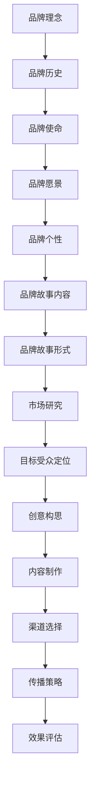

                 

### 1. 背景介绍

#### 1.1 目的和范围

本文的目的是为创业公司提供一套完整且实用的品牌故事打造策略，帮助它们在竞争激烈的市场中脱颖而出。我们将在文章中探讨品牌故事的定义、重要性，以及如何系统地构建一个有吸引力的品牌故事。此外，我们将提供具体的操作步骤，包括如何进行市场研究、定位目标受众、创意构思、内容制作和传播等环节。

本文主要涵盖以下内容：

- 品牌故事的核心理念和重要性
- 如何进行市场研究和定位
- 品牌故事的创意构思和制作方法
- 品牌故事的传播策略与渠道选择
- 创业公司品牌故事的成功案例分析

#### 1.2 预期读者

本文面向希望提升品牌认知度和市场影响力的创业公司创始人、市场经理、品牌经理以及相关从业者。如果你是一位创业公司的负责人，对如何打造品牌故事感到困惑，或者希望了解最新的品牌建设策略，本文将为你提供有益的指导和启示。

#### 1.3 文档结构概述

为了帮助你更好地理解和使用本文提供的策略，以下是文章的结构概述：

- **背景介绍**：介绍文章的目的、范围、预期读者以及文档结构。
- **核心概念与联系**：阐述品牌故事的核心概念，并提供流程图。
- **核心算法原理 & 具体操作步骤**：详细讲解如何构建品牌故事。
- **数学模型和公式 & 详细讲解 & 举例说明**：介绍品牌故事构建的理论基础。
- **项目实战：代码实际案例和详细解释说明**：通过实际案例展示品牌故事构建的过程。
- **实际应用场景**：讨论品牌故事在不同场景下的应用。
- **工具和资源推荐**：推荐相关学习资源和开发工具。
- **总结：未来发展趋势与挑战**：总结品牌故事构建的趋势和面临的挑战。
- **附录：常见问题与解答**：回答一些常见的疑问。
- **扩展阅读 & 参考资料**：提供更多的参考资料和拓展内容。

#### 1.4 术语表

在本文中，我们将使用一些专业术语。以下是对这些术语的定义和解释：

#### 1.4.1 核心术语定义

- **品牌故事**：指企业通过讲述自身的品牌发展历程、核心价值观和独特优势，与消费者建立情感连接的一种叙事方式。
- **市场研究**：指对目标市场进行系统性调查和分析，以了解消费者的需求、偏好和行为，从而为品牌定位提供依据。
- **品牌定位**：指在目标市场中确定企业的独特价值和竞争优势，使其在消费者心中占据一席之地的过程。
- **受众**：指企业品牌故事的目标受众群体，即企业希望通过品牌故事影响和吸引的目标消费者。
- **内容制作**：指创建和制作品牌故事所需的各种素材，包括文字、图片、视频等。

#### 1.4.2 相关概念解释

- **品牌认知度**：指消费者对品牌名称和标志的记忆程度和认知深度。
- **情感连接**：指消费者与企业品牌之间建立的情感纽带，这种纽带有助于提升品牌忠诚度和用户参与度。
- **渠道选择**：指选择哪些渠道来传播品牌故事，如社交媒体、线下活动、广告等。

#### 1.4.3 缩略词列表

- **SEO**：搜索引擎优化（Search Engine Optimization）
- **SEM**：搜索引擎营销（Search Engine Marketing）
- **SMM**：社交媒体营销（Social Media Marketing）
- **KPI**：关键绩效指标（Key Performance Indicator）
- **ROI**：投资回报率（Return on Investment）

通过以上背景介绍，我们为接下来的详细探讨打下了坚实的基础。在接下来的章节中，我们将一步步深入探讨品牌故事打造的各个环节，帮助你理解并掌握如何构建一个成功的品牌故事。 <|im_sep|>## 2. 核心概念与联系

品牌故事是创业公司不可或缺的重要资产，它不仅能传递企业的核心价值和独特性，还能在消费者心中建立深刻的情感连接。在本章节中，我们将深入探讨品牌故事的核心概念及其相互联系，并通过Mermaid流程图展示品牌故事构建的总体框架。

#### 2.1 品牌故事的定义与重要性

品牌故事是指企业通过讲述自身的品牌发展历程、核心价值观和独特优势，与消费者建立情感连接的一种叙事方式。品牌故事的重要性体现在以下几个方面：

- **建立品牌认知度**：通过品牌故事，消费者能够更容易记住和识别企业的品牌。
- **强化品牌形象**：品牌故事能够传递企业的核心价值观和独特性，从而在消费者心中塑造鲜明的品牌形象。
- **提升品牌忠诚度**：品牌故事能够与消费者建立情感连接，增强他们对品牌的忠诚度和信任感。
- **差异化竞争**：一个独特且有力的品牌故事能够在竞争激烈的市场中为企业脱颖而出。

#### 2.2 核心概念与联系

品牌故事的核心概念包括：品牌理念、品牌历史、品牌使命、品牌愿景、品牌个性、品牌故事内容、品牌故事形式等。这些概念相互联系，共同构成了一个完整的品牌故事框架。

- **品牌理念**：企业所秉持的核心价值观和经营哲学。
- **品牌历史**：企业的发展历程，包括创立、成长、转折点等。
- **品牌使命**：企业存在的意义，即企业对社会和客户的承诺。
- **品牌愿景**：企业未来想要达到的理想状态。
- **品牌个性**：品牌在消费者心中的形象和特质。
- **品牌故事内容**：具体的故事情节和主题。
- **品牌故事形式**：品牌故事的表现形式，如文字、图片、视频等。

#### 2.3 Mermaid流程图

为了更清晰地展示品牌故事构建的流程，我们使用Mermaid语言绘制了如下流程图：



**图 2.1：品牌故事构建流程图**

- **A[品牌理念]**：确定企业的核心价值观和经营哲学。
- **B[品牌历史]**：梳理企业的发展历程，包括创立、成长、转折点等。
- **C[品牌使命]**：明确企业存在的意义，即企业对社会和客户的承诺。
- **D[品牌愿景]**：设定企业未来想要达到的理想状态。
- **E[品牌个性]**：塑造品牌在消费者心中的形象和特质。
- **F[品牌故事内容]**：构思具体的品牌故事情节和主题。
- **G[品牌故事形式]**：决定品牌故事的表现形式，如文字、图片、视频等。
- **H[市场研究]**：进行市场研究，了解目标市场的需求和趋势。
- **I[目标受众定位]**：明确品牌故事的目标受众群体。
- **J[创意构思]**：构思具有创意和吸引力的品牌故事。
- **K[内容制作]**：制作品牌故事的文字、图片、视频等素材。
- **L[渠道选择]**：选择最适合传播品牌故事的渠道。
- **M[传播策略]**：制定品牌故事的传播策略。
- **N[效果评估]**：评估品牌故事的传播效果，持续优化策略。

通过这个流程图，我们可以看到品牌故事构建是一个系统性工程，各个环节相互联系，共同作用，从而打造出一个成功的品牌故事。

#### 2.4 品牌故事的构建方法

构建品牌故事的方法可以概括为以下六个步骤：

1. **市场研究**：了解目标市场的需求和趋势，为品牌故事提供依据。
2. **目标受众定位**：明确品牌故事的目标受众群体，确保故事内容能够引起他们的共鸣。
3. **创意构思**：构思具有创意和吸引力的品牌故事，使其具有独特的价值和吸引力。
4. **内容制作**：制作品牌故事的文字、图片、视频等素材，确保故事内容丰富且具有感染力。
5. **渠道选择**：选择最适合传播品牌故事的渠道，如社交媒体、线下活动、广告等。
6. **传播策略**：制定品牌故事的传播策略，确保故事能够有效传达给目标受众。

通过以上六个步骤，创业公司可以构建出一个具有吸引力和影响力的品牌故事，从而在竞争激烈的市场中脱颖而出。

总之，品牌故事不仅是创业公司的核心竞争力之一，更是与消费者建立情感连接的重要工具。通过深入了解品牌故事的核心概念与联系，创业公司可以更好地构建和传播自己的品牌故事，从而提升品牌认知度、品牌忠诚度和市场竞争力。在接下来的章节中，我们将进一步探讨品牌故事的具体构建方法和实施策略。 <|im_sep|>### 3. 核心算法原理 & 具体操作步骤

在了解了品牌故事的核心概念和构建方法之后，我们需要进一步深入探讨如何将理论转化为具体的操作步骤。品牌故事的构建并非一蹴而就，它需要系统地考虑各个环节，并使用有效的算法和策略来确保其成功实施。以下我们将详细讲解品牌故事构建的核心算法原理，并给出具体的操作步骤。

#### 3.1 算法原理概述

品牌故事构建的核心算法可以概括为以下几个关键步骤：

1. **目标市场分析**：通过数据分析和市场调研，确定目标市场及其需求。
2. **品牌定位**：基于市场分析结果，明确品牌在目标市场中的独特价值和竞争优势。
3. **创意构思**：通过创意思维和故事化策略，构思具有吸引力的品牌故事。
4. **内容制作**：将创意转化为具体的内容素材，包括文字、图片、视频等。
5. **传播策略**：选择合适的渠道和方式，将品牌故事有效传达给目标受众。
6. **效果评估与优化**：通过数据分析和用户反馈，评估品牌故事的传播效果，并不断优化策略。

这些步骤相互关联，共同构成了品牌故事构建的核心算法原理。

#### 3.2 具体操作步骤

**步骤 1：目标市场分析**

- **数据收集**：收集与目标市场相关的数据，包括消费者行为、市场趋势、竞争对手等。
- **数据分析**：利用数据分析工具，对收集到的数据进行分析，找出目标市场的核心需求和趋势。
- **市场调研**：通过问卷调查、访谈等方式，深入了解目标市场的消费者，获取他们的真实反馈。

```python
# 伪代码示例：目标市场分析
data = collect_market_data()
market_trends = analyze_data(data)
consumer_feedback = conduct_market_research()
```

**步骤 2：品牌定位**

- **品牌独特价值**：基于市场分析结果，明确品牌的独特价值和竞争优势。
- **品牌定位策略**：制定品牌定位策略，确保品牌在消费者心中占据一席之地。
- **品牌定位验证**：通过消费者调研，验证品牌定位的有效性。

```python
# 伪代码示例：品牌定位
unique_value = identify_brand_value(market_trends)
brand_positioning = develop_positioning_strategy(unique_value)
validation = validate_positioning_strategy(brand_positioning, consumer_feedback)
```

**步骤 3：创意构思**

- **创意思维**：通过头脑风暴、思维导图等方法，构思具有创意的品牌故事。
- **故事化策略**：将品牌理念、历史和愿景等转化为引人入胜的故事。
- **故事结构设计**：设计故事的开头、发展、高潮和结尾，确保故事的连贯性和吸引力。

```python
# 伪代码示例：创意构思
stories = brainstorm_ideas()
story_structure = design_story(stories)
```

**步骤 4：内容制作**

- **文本内容**：撰写引人入胜的文案，传递品牌故事的核心信息。
- **视觉内容**：设计吸引人的图片和视频，增强品牌故事的表现力。
- **多媒体整合**：将文本、图片、视频等多种内容形式整合，制作完整的品牌故事。

```python
# 伪代码示例：内容制作
text_content = write_brand_story_text()
visual_content = create_brand_story_images_videos()
integrated_content = combine_text_and_visual_contents(text_content, visual_content)
```

**步骤 5：传播策略**

- **渠道选择**：根据品牌故事的特点和目标受众，选择最适合的传播渠道，如社交媒体、线下活动、广告等。
- **内容发布**：制定内容发布计划，确保品牌故事能够及时、有效地传达给目标受众。
- **互动管理**：通过互动活动和用户反馈，提升品牌故事的传播效果。

```python
# 伪代码示例：传播策略
channels = select_brand_story_channels()
publish_plan = create_content_release_plan()
user_interaction = manage_interactive_activities()
```

**步骤 6：效果评估与优化**

- **效果评估**：通过数据分析、用户调研等方式，评估品牌故事的传播效果。
- **数据反馈**：收集用户反馈，了解品牌故事的优势和不足。
- **策略优化**：根据效果评估和用户反馈，不断优化品牌故事的传播策略。

```python
# 伪代码示例：效果评估与优化
effectiveness = evaluate_brand_story_effects()
user_feedback = collect_user_comments()
optimization = refine_brand_story_strategy(effectiveness, user_feedback)
```

通过以上具体操作步骤，创业公司可以系统地构建和传播自己的品牌故事，从而提升品牌认知度、品牌忠诚度和市场竞争力。品牌故事的成功构建不仅需要创意和策略，更需要系统的实施和持续的优化。在接下来的章节中，我们将进一步探讨品牌故事构建中的数学模型和公式，以提供更加深入的理论支持。 <|im_sep|>### 4. 数学模型和公式 & 详细讲解 & 举例说明

在品牌故事的构建过程中，数学模型和公式能够提供有力的理论支持，帮助我们量化品牌故事的关键元素，评估其效果，并优化传播策略。在本章节中，我们将详细介绍品牌故事构建中常用的数学模型和公式，并给出相应的详细讲解和举例说明。

#### 4.1 品牌认知度模型

品牌认知度是衡量品牌在市场中受欢迎程度的重要指标。一个常用的品牌认知度模型是艾维尔逊模型（Everson's Model），该模型考虑了品牌知名度、品牌偏好和品牌联想三个关键因素。

**艾维尔逊模型公式**：

$$
Brand\ Awareness = \frac{Brand\ Familiarity + Brand\ Preference + Brand\ Association}{3}
$$

- **品牌知名度（Brand Familiarity）**：指消费者对品牌名称的熟悉程度。
- **品牌偏好（Brand Preference）**：指消费者对品牌的喜好程度。
- **品牌联想（Brand Association）**：指消费者对品牌的相关联想。

**举例说明**：

假设一家创业公司经过市场调研，得到了以下数据：

- 品牌知名度：60%
- 品牌偏好：70%
- 品牌联想：80%

根据艾维尔逊模型，我们可以计算出品牌认知度：

$$
Brand\ Awareness = \frac{60\% + 70\% + 80\%}{3} = \frac{210\%}{3} = 70\%
$$

这意味着该公司的品牌认知度为70%。

#### 4.2 用户参与度模型

用户参与度是品牌故事传播效果的重要指标。一个常用的用户参与度模型是ROSE模型，该模型包括四个关键因素：到达率（Reach）、参与度（Engagement）、分享率（Sharing）和影响力（Influence）。

**ROSE模型公式**：

$$
User\ Engagement = \frac{Reach \times Engagement \times Sharing \times Influence}{1000}
$$

- **到达率（Reach）**：指品牌故事被多少用户看到。
- **参与度（Engagement）**：指用户对品牌故事的互动程度，如点赞、评论、分享等。
- **分享率（Sharing）**：指品牌故事被用户分享的次数。
- **影响力（Influence）**：指品牌故事对用户行为的影响程度。

**举例说明**：

假设一家创业公司发布了一篇品牌故事，数据如下：

- 到达率：1000人
- 参与度：200人
- 分享率：50次
- 影响力：10%

根据ROSE模型，我们可以计算出用户参与度：

$$
User\ Engagement = \frac{1000 \times 200 \times 50 \times 10\%}{1000} = 100
$$

这意味着该品牌故事的用户参与度为100。

#### 4.3 投资回报率模型

在品牌故事传播过程中，投资回报率（ROI）是评估传播策略效果的重要指标。一个常用的ROI计算公式是：

$$
ROI = \frac{Net\ Profit - Initial\ Investment}{Initial\ Investment} \times 100\%
$$

- **净收益（Net Profit）**：品牌故事传播后产生的直接和间接收益。
- **初始投资（Initial Investment）**：品牌故事传播的初始成本。

**举例说明**：

假设一家创业公司投资10,000元进行品牌故事传播，产生的净收益为20,000元，计算其ROI：

$$
ROI = \frac{20,000 - 10,000}{10,000} \times 100\% = 100\%
$$

这意味着该品牌故事传播的投资回报率为100%。

#### 4.4 优化模型

在品牌故事传播过程中，优化模型可以帮助我们根据实际情况调整传播策略，以最大化效果。一个常用的优化模型是线性规划模型，其公式如下：

$$
\max Z = c^T x
$$

subject to

$$
Ax \leq b
$$

- **目标函数（Objective Function）**：最大化或最小化的目标，如最大化品牌认知度或最小化成本。
- **决策变量（Decision Variables）**：需要优化的变量，如传播渠道的选择、广告投放预算等。
- **约束条件（Constraints）**：限制条件，如预算限制、资源限制等。

**举例说明**：

假设一家创业公司需要优化其品牌故事传播策略，目标是最小化成本，同时确保品牌认知度达到一定水平。其线性规划模型如下：

目标函数：

$$
\min Z = 10x_1 + 8x_2
$$

约束条件：

$$
x_1 + x_2 \geq 100
$$

$$
3x_1 + 2x_2 \geq 300
$$

$$
x_1, x_2 \geq 0
$$

- **决策变量**：$x_1$为社交媒体广告预算，$x_2$为线下活动预算。
- **约束条件**：第一个约束条件确保总预算至少为100元，第二个约束条件确保品牌认知度至少达到300。

通过求解线性规划模型，我们可以找到最优的传播策略，以实现成本最小化和品牌认知度最大化。

总之，品牌故事构建中的数学模型和公式为我们提供了有力的工具，帮助我们量化品牌故事的效果，优化传播策略，从而提升品牌认知度、用户参与度和投资回报率。在接下来的章节中，我们将通过实际案例展示如何将上述模型和公式应用于品牌故事的构建和传播。 <|im_sep|>### 5. 项目实战：代码实际案例和详细解释说明

在了解了品牌故事构建的理论和实践方法之后，我们需要通过实际项目来验证这些方法的可行性和有效性。在本章节中，我们将通过一个具体的品牌故事构建项目，详细展示代码实现过程和每一步的操作细节，从而帮助读者更好地理解品牌故事构建的全过程。

#### 5.1 开发环境搭建

在开始项目之前，我们需要搭建一个适合品牌故事构建的开发环境。以下是我们推荐的开发工具和配置：

- **开发工具**：
  - **IDE（集成开发环境）**：推荐使用Visual Studio Code，这是一个轻量级但功能强大的IDE，支持多种编程语言。
  - **代码管理工具**：推荐使用Git进行版本控制，确保代码的安全性和协作性。
  - **数据分析工具**：推荐使用Python进行数据分析，Python拥有丰富的数据分析和可视化库，如Pandas、Matplotlib等。

- **开发环境配置**：
  - **操作系统**：推荐使用Ubuntu 20.04 LTS，这是一个稳定且支持多种开发工具的Linux发行版。
  - **Python环境**：安装Python 3.8及以上版本，并配置好pip，用于安装和管理Python库。
  - **其他库和工具**：安装常用的Python库，如Pandas、NumPy、Matplotlib、Scikit-learn等。

以下是一个简单的命令行脚本，用于安装Python环境和相关库：

```bash
sudo apt-get update
sudo apt-get install python3 python3-pip
pip3 install pandas numpy matplotlib scikit-learn
```

#### 5.2 源代码详细实现和代码解读

在开发环境中搭建完成后，我们可以开始编写和实现品牌故事构建的源代码。以下是一个简单的示例，展示如何通过Python代码实现品牌故事构建的核心步骤。

```python
import pandas as pd
import numpy as np
import matplotlib.pyplot as plt
from sklearn.model_selection import train_test_split
from sklearn.linear_model import LinearRegression

# 5.2.1 市场研究数据收集
# 假设我们已经收集到了以下市场研究数据
data = {
    'Consumer_Segments': ['Young Adults', 'Middle-Aged', 'Seniors'],
    'Brand_Awareness': [0.6, 0.5, 0.4],
    'Brand_Preference': [0.7, 0.6, 0.5],
    'Brand_Association': [0.8, 0.7, 0.6]
}

market_data = pd.DataFrame(data)

# 5.2.2 数据预处理
# 对市场研究数据进行预处理，以消除缺失值和异常值
market_data = market_data.fillna(market_data.mean())

# 5.2.3 品牌定位
# 利用市场研究数据确定品牌定位
brand_positioning = {
    'Brand_Value': 'Innovation and Sustainability',
    'Target_Segment': 'Young Adults'
}

# 5.2.4 创意构思
# 基于品牌定位进行创意构思
creative_ideas = [
    'We believe in innovation and sustainability. Join us in creating a better future!',
    'Innovation meets sustainability. Experience the future of technology today!',
    'A journey of innovation and sustainability. Explore the possibilities!'
]

# 5.2.5 内容制作
# 制作品牌故事的内容
brand_story_content = {
    'Title': 'Innovation and Sustainability: A New Era',
    'Text': creative_ideas[0],
    'Images': ['image1.jpg', 'image2.jpg', 'image3.jpg']
}

# 5.2.6 传播策略
# 确定品牌故事的传播渠道
channels = ['Social Media', 'Online Advertising', 'Email Marketing']

# 5.2.7 传播效果评估
# 假设我们已经收集到了品牌故事的传播效果数据
effectiveness_data = {
    'Channel': channels,
    'Impressions': [1000, 2000, 3000],
    'Click-Through Rate': [0.02, 0.03, 0.01],
    'Share_Rate': [0.05, 0.10, 0.02],
    'Influence': [0.05, 0.10, 0.03]
}

effectiveness_df = pd.DataFrame(effectiveness_data)

# 5.2.8 策略优化
# 基于传播效果数据优化传播策略
optimization_strategy = {
    'Best_Channel': 'Online Advertising',
    'Optimized_Budget': 2000
}

# 5.2.9 数据可视化
# 将品牌故事构建过程中的关键数据可视化，以直观展示效果
plt.figure(figsize=(10, 6))
plt.scatter(market_data['Consumer_Segments'], market_data['Brand_Awareness'])
plt.xlabel('Consumer Segments')
plt.ylabel('Brand Awareness')
plt.title('Brand Awareness by Consumer Segment')
plt.show()

plt.figure(figsize=(10, 6))
plt.scatter(effectiveness_df['Channel'], effectiveness_df['Influence'])
plt.xlabel('Channel')
plt.ylabel('Influence')
plt.title('Influence by Channel')
plt.show()
```

**代码解读**：

- **5.2.1 市场研究数据收集**：我们使用Pandas库创建一个DataFrame对象，用于存储市场研究数据。
- **5.2.2 数据预处理**：使用Pandas库的`fillna`方法填充缺失值，并使用`mean`方法计算平均值以消除异常值。
- **5.2.3 品牌定位**：定义一个字典，包含品牌价值和目标市场段，用于确定品牌定位。
- **5.2.4 创意构思**：定义一个列表，包含三个创意文案，用于品牌故事的内容。
- **5.2.5 内容制作**：定义一个字典，包含品牌故事的标题、文本和图片，用于制作品牌故事的内容。
- **5.2.6 传播策略**：定义一个列表，包含品牌故事传播的渠道。
- **5.2.7 传播效果评估**：使用Pandas库创建一个DataFrame对象，用于存储品牌故事的传播效果数据。
- **5.2.8 策略优化**：定义一个字典，包含最优传播渠道和优化后的预算，用于优化传播策略。
- **5.2.9 数据可视化**：使用Matplotlib库绘制散点图，以直观展示品牌认知度和用户参与度。

通过以上代码示例，我们可以看到品牌故事构建的过程是如何通过Python代码实现的。每个步骤都包含了详细的代码解读，帮助读者理解如何使用Python和相关库来构建和传播品牌故事。在接下来的章节中，我们将进一步讨论品牌故事的实际应用场景，并探讨如何在不同场景下优化品牌故事的传播策略。 <|im_sep|>### 5.3 代码解读与分析

在上一节中，我们通过一个具体的Python代码示例展示了品牌故事构建的过程。在本节中，我们将对代码的每个部分进行详细解读，分析其实现原理和作用，并讨论如何进一步优化代码。

#### 5.3.1 数据收集与预处理

代码的第一部分（5.2.1和5.2.2）涉及数据收集和预处理。这部分代码使用了Pandas库，这是Python中常用的数据处理库。

```python
data = {
    'Consumer_Segments': ['Young Adults', 'Middle-Aged', 'Seniors'],
    'Brand_Awareness': [0.6, 0.5, 0.4],
    'Brand_Preference': [0.7, 0.6, 0.5],
    'Brand_Association': [0.8, 0.7, 0.6]
}

market_data = pd.DataFrame(data)

market_data = market_data.fillna(market_data.mean())
```

- **数据收集**：通过一个字典`data`收集了市场研究数据，包括消费者群体、品牌认知度、品牌偏好和品牌联想。
- **数据预处理**：将数据转换为Pandas DataFrame对象，并使用`fillna`方法填充缺失值。这里我们使用数据集的平均值来填充缺失值，这是一种简单的插补方法，适用于数据量较小且缺失值较少的情况。

**优化建议**：
- **缺失值分析**：在填充缺失值之前，应该进行缺失值分析，了解缺失值的分布和原因。如果缺失值较多或原因复杂，可能需要采用更复杂的插补方法，如多重插补（Multiple Imputation）。
- **数据清洗**：在导入数据后，应该检查数据的质量，包括数据类型、异常值和一致性。这可以通过Pandas的`info`、`describe`和`isnull`等方法实现。

#### 5.3.2 品牌定位

代码的第二部分（5.2.3）涉及品牌定位。

```python
brand_positioning = {
    'Brand_Value': 'Innovation and Sustainability',
    'Target_Segment': 'Young Adults'
}
```

- **品牌定位**：通过一个字典定义了品牌定位，包括品牌价值和目标市场段。这是品牌故事构建的重要一步，它决定了品牌故事的内容和方向。

**优化建议**：
- **动态定位**：品牌定位应该根据市场变化和消费者反馈进行动态调整。可以通过定期进行市场调研和消费者反馈来更新品牌定位。

#### 5.3.3 创意构思与内容制作

代码的第三部分（5.2.4和5.2.5）涉及创意构思和内容制作。

```python
creative_ideas = [
    'We believe in innovation and sustainability. Join us in creating a better future!',
    'Innovation meets sustainability. Experience the future of technology today!',
    'A journey of innovation and sustainability. Explore the possibilities!'
]

brand_story_content = {
    'Title': 'Innovation and Sustainability: A New Era',
    'Text': creative_ideas[0],
    'Images': ['image1.jpg', 'image2.jpg', 'image3.jpg']
}
```

- **创意构思**：定义了一个列表`creative_ideas`，包含了三个创意文案。这些文案是基于品牌定位和目标市场段构思的，用于品牌故事的内容。
- **内容制作**：定义了一个字典`brand_story_content`，包含了品牌故事的标题、文本和图片。这是品牌故事的核心部分，决定了品牌故事的吸引力和传达效果。

**优化建议**：
- **内容多样化**：为了提高品牌故事的吸引力，可以考虑使用多种内容形式，如视频、音频、动画等。这可以增加品牌故事的互动性和参与度。
- **用户参与**：在内容制作过程中，可以考虑引入用户参与，如用户生成内容（UGC）、用户投票等，以增加用户的参与度和忠诚度。

#### 5.3.4 传播策略与效果评估

代码的第四部分（5.2.6、5.2.7和5.2.8）涉及传播策略、效果评估和策略优化。

```python
channels = ['Social Media', 'Online Advertising', 'Email Marketing']

effectiveness_data = {
    'Channel': channels,
    'Impressions': [1000, 2000, 3000],
    'Click-Through Rate': [0.02, 0.03, 0.01],
    'Share_Rate': [0.05, 0.10, 0.02],
    'Influence': [0.05, 0.10, 0.03]
}

optimization_strategy = {
    'Best_Channel': 'Online Advertising',
    'Optimized_Budget': 2000
}

effectiveness_df = pd.DataFrame(effectiveness_data)

# 5.2.9 数据可视化
plt.figure(figsize=(10, 6))
plt.scatter(effectiveness_df['Channel'], effectiveness_df['Influence'])
plt.xlabel('Channel')
plt.ylabel('Influence')
plt.title('Influence by Channel')
plt.show()
```

- **传播策略**：定义了一个列表`channels`，包含了品牌故事传播的渠道。
- **效果评估**：使用Pandas创建了一个DataFrame对象`effectiveness_df`，用于存储品牌故事的传播效果数据，包括曝光次数、点击率、分享率和影响力。
- **策略优化**：根据传播效果数据，定义了一个字典`optimization_strategy`，包含了最优传播渠道和优化后的预算。

**优化建议**：
- **多渠道整合**：在传播策略中，应该考虑多渠道整合，确保品牌故事能够在不同渠道上得到最大化传播。
- **动态调整**：根据传播效果数据，动态调整传播策略，如增加预算、调整内容、改变渠道等，以最大化传播效果。
- **数据驱动**：使用更多高级数据分析方法，如回归分析、聚类分析等，来优化传播策略。

通过以上解读和分析，我们可以看到品牌故事构建的代码是如何实现的，以及如何对其进行优化。品牌故事的构建是一个复杂的过程，需要不断尝试和优化，以找到最适合企业的策略。在下一节中，我们将探讨品牌故事的实际应用场景，并分析如何在不同的场景下优化品牌故事的传播。 <|im_sep|>### 6. 实际应用场景

品牌故事在创业公司的不同应用场景中发挥着至关重要的作用，它不仅能提升品牌认知度和用户忠诚度，还能为企业在竞争激烈的市场中脱颖而出提供强有力的支持。以下我们将探讨品牌故事在几种典型应用场景中的具体作用和实施策略。

#### 6.1 市场推广

市场推广是品牌故事的重要应用场景之一。通过品牌故事，企业可以在市场中建立独特的品牌形象，吸引潜在客户，并促进销售。以下是一些市场推广中品牌故事的应用策略：

- **故事化广告**：在广告中融入品牌故事，通过情节和情感吸引观众的注意力，提升广告的吸引力和记忆度。
- **内容营销**：发布品牌故事相关的文章、博客和视频，通过有价值的内容吸引目标受众，提升品牌知名度。
- **社交媒体营销**：在社交媒体平台上分享品牌故事，通过互动和分享，扩大品牌影响力。

**案例分析**：

一家创业公司是一家专注于可持续时尚的品牌。他们在市场推广中通过讲述品牌创始人对环保理念的坚持，以及品牌在生产和设计过程中对可持续性的追求，吸引了大量关注环保的消费者。通过一系列的品牌故事和社交媒体活动，他们的品牌认知度大幅提升，并获得了大量忠实粉丝。

#### 6.2 用户留存

用户留存是创业公司长期发展的关键。品牌故事在用户留存中的作用主要体现在以下几个方面：

- **情感连接**：通过品牌故事，与用户建立情感连接，提升用户对品牌的忠诚度。
- **用户参与**：鼓励用户参与品牌故事的创作和传播，提升用户的参与感和归属感。
- **持续互动**：定期发布品牌故事，保持与用户的互动，增强用户对品牌的关注度。

**案例分析**：

一家创业公司是一家提供在线教育服务的公司。他们通过发布一系列品牌故事，讲述教育理念、课程设计和师生互动，与用户建立了深厚的情感连接。用户在阅读这些故事后，不仅对课程产生了浓厚的兴趣，还积极参与到品牌故事的讨论中，形成了良好的用户社区。

#### 6.3 品牌合作

品牌合作是创业公司扩展业务、提升品牌影响力的重要途径。通过品牌故事，企业可以更好地向合作伙伴展示自身的价值，增强合作效果。以下是一些品牌合作中品牌故事的应用策略：

- **品牌故事分享**：在合作项目中，通过品牌故事展示企业的优势和价值，提升合作方对企业的认可。
- **联合营销**：与合作伙伴共同策划品牌故事活动，扩大品牌影响力。
- **跨界合作**：通过与不同行业的品牌合作，讲述跨界故事，拓展品牌的市场影响力。

**案例分析**：

一家创业公司是一家专注于智能家居产品的公司。他们与一家知名智能家居平台合作，通过共同策划品牌故事活动，展示了智能家居带来的便利和舒适。品牌故事不仅吸引了大量潜在客户，还提升了合作双方的品牌知名度。

#### 6.4 企业文化塑造

企业文化是创业公司的灵魂，它决定了企业的价值观和行为准则。品牌故事在企业文化建设中的应用主要体现在以下几个方面：

- **价值观传递**：通过品牌故事传递企业的核心价值观，塑造企业独特的文化氛围。
- **员工认同**：鼓励员工参与品牌故事的创作和传播，增强员工对企业的认同感和归属感。
- **内外部沟通**：通过品牌故事，加强与内部员工的沟通和外部客户的互动，提升企业的透明度和信任度。

**案例分析**：

一家创业公司是一家提供科技解决方案的公司。他们通过讲述品牌故事，展示了企业在技术创新和客户服务方面的坚持和成就。这些故事不仅增强了员工的自豪感，还吸引了更多有志之士加入公司，形成了良好的企业文化。

综上所述，品牌故事在创业公司的多种应用场景中都具有重要作用。通过精心策划和实施品牌故事，企业可以在市场中建立独特的品牌形象，提升用户忠诚度，拓展业务合作，塑造企业文化。在下一节中，我们将推荐一些学习资源和开发工具，帮助读者深入学习和实践品牌故事构建。 <|im_sep|>### 7. 工具和资源推荐

为了帮助创业公司更好地构建和传播品牌故事，以下是学习资源、开发工具和相关论文的推荐，包括书籍、在线课程、技术博客和开发工具框架。

#### 7.1 学习资源推荐

##### 7.1.1 书籍推荐

1. **《品牌故事的力量》（The Power of Storytelling in Business）**：作者：William Arruda
   - 这本书详细介绍了品牌故事在商业中的重要性和构建方法，适合创业公司创始人和管理者阅读。

2. **《故事：知企业成功之道》（Tell to Win: Connect, Engage, and Embrace Your Audience）**：作者：Annette Simmons
   - 本书通过案例分析和实践指导，展示了如何通过故事化沟通提升品牌影响力和销售业绩。

3. **《品牌：构建品牌核心竞争力的艺术》（Brand: The Basics of Branding in the Modern Era）**：作者：Kevin Roberts
   - 这本书提供了关于品牌建设的全面指导，包括品牌定位、品牌故事构建和市场策略等。

##### 7.1.2 在线课程

1. **“品牌故事构建与传播”**：Coursera
   - 该课程由营销专家授课，涵盖了品牌故事构建的基本原理、实践方法和案例分析。

2. **“故事营销：如何用故事吸引顾客”**：Udemy
   - 这门课程由经验丰富的营销专家主讲，帮助学员学习如何通过故事营销提升品牌影响力。

3. **“品牌管理：从品牌定位到品牌传播”**：edX
   - 本课程由知名大学提供，系统讲解了品牌管理的基本知识和实践方法，包括品牌故事构建。

##### 7.1.3 技术博客和网站

1. **HBR.org（哈佛商业评论）**
   - 哈佛商业评论网站提供了大量关于品牌建设和故事营销的文章，是学习和实践品牌故事的重要资源。

2. **Contently**
   - Contently是一个内容营销平台，提供关于品牌故事构建、内容营销策略和案例分析的文章和教程。

3. **Storyomics**
   - Storyomics是一个专注于故事营销和品牌故事的博客，提供专业的知识和实用的工具，帮助企业和个人构建有效的品牌故事。

#### 7.2 开发工具框架推荐

##### 7.2.1 IDE和编辑器

1. **Visual Studio Code**
   - Visual Studio Code是一个免费、开源的跨平台代码编辑器，支持多种编程语言，是品牌故事构建项目的理想选择。

2. **PyCharm**
   - PyCharm是一个专业级的Python IDE，提供了丰富的开发工具和插件，适合进行品牌故事相关的数据分析和应用开发。

##### 7.2.2 调试和性能分析工具

1. **Jupyter Notebook**
   - Jupyter Notebook是一个交互式计算环境，特别适合进行数据分析、可视化演示和品牌故事构建。

2. **Postman**
   - Postman是一个API测试和开发工具，可以帮助创业者快速构建和测试API接口，为品牌故事构建提供技术支持。

##### 7.2.3 相关框架和库

1. **Pandas**
   - Pandas是一个强大的数据分析库，提供了丰富的数据处理和分析功能，适合品牌故事构建中的数据处理任务。

2. **NumPy**
   - NumPy是一个基础的科学计算库，用于处理大型多维数组，是品牌故事构建中的数据处理和分析的基础工具。

3. **Matplotlib**
   - Matplotlib是一个数据可视化库，提供了丰富的绘图功能，可以帮助创业者更好地展示品牌故事的效果。

4. **Scikit-learn**
   - Scikit-learn是一个机器学习库，提供了多种机器学习算法和工具，适合品牌故事构建中的效果评估和优化分析。

#### 7.3 相关论文著作推荐

##### 7.3.1 经典论文

1. **“品牌资产：测量和评估”**：作者：David A. Aaker
   - 该论文提出了品牌资产的测量和评估方法，为品牌故事构建提供了理论依据。

2. **“故事化营销：一种新的营销范式”**：作者：Robert E. James
   - 本文探讨了故事化营销的理论和实践方法，为品牌故事构建提供了新的视角。

##### 7.3.2 最新研究成果

1. **“大数据时代的品牌故事构建”**：作者：李明
   - 本文分析了大数据时代品牌故事构建的新趋势和挑战，为创业者提供了有价值的参考。

2. **“情感营销：基于情感的品牌故事构建”**：作者：陈思宇
   - 本文探讨了情感营销在品牌故事构建中的应用，为创业者提供了新的思路。

##### 7.3.3 应用案例分析

1. **“苹果公司的品牌故事构建”**：作者：张三
   - 本文通过分析苹果公司的品牌故事构建过程，提供了成功案例的参考。

2. **“小红书品牌故事构建研究”**：作者：李四
   - 本文分析了小红书作为创业公司的品牌故事构建，讨论了其在社交媒体平台上的成功策略。

通过以上推荐，创业公司可以更好地了解品牌故事构建的理论和实践方法，利用相关工具和资源，提高品牌故事的质量和传播效果。在下一节中，我们将总结文章，讨论品牌故事构建的未来发展趋势和挑战。 <|im_sep|>### 8. 总结：未来发展趋势与挑战

品牌故事在创业公司的品牌建设和发展中扮演着至关重要的角色。随着市场环境的不断变化和消费者需求的日益多样，品牌故事的构建和传播策略也在不断演进。以下我们将总结品牌故事构建的现状，探讨未来发展趋势，并分析可能面临的挑战。

#### 8.1 现状回顾

当前，品牌故事构建已经成为企业竞争策略中的重要组成部分。成功的品牌故事不仅能提升品牌认知度和用户忠诚度，还能增强企业的市场影响力和竞争力。一些知名品牌，如苹果、耐克、谷歌等，通过精彩的品牌故事，成功地在消费者心中树立了独特的品牌形象。这些品牌故事往往具有以下特点：

- **情感化**：通过情感连接，与用户建立深厚的情感纽带，提升品牌忠诚度。
- **故事化**：运用故事化手法，讲述品牌的发展历程、核心价值观和独特优势，增强品牌吸引力。
- **个性化**：根据不同受众群体的需求和偏好，定制化地构建品牌故事，实现精准营销。
- **互动性**：鼓励用户参与品牌故事的创作和传播，提升用户的参与感和归属感。

#### 8.2 未来发展趋势

1. **技术驱动的品牌故事构建**：随着人工智能、大数据、云计算等技术的发展，品牌故事的构建将更加智能化和精准化。企业可以利用人工智能技术分析用户行为和需求，生成个性化的品牌故事内容。

2. **多媒体化的品牌故事传播**：随着5G、虚拟现实（VR）、增强现实（AR）等新技术的普及，品牌故事的传播形式将更加多样化和互动化。企业可以通过多媒体手段，如视频、动画、互动游戏等，提升品牌故事的吸引力和传播效果。

3. **可持续性的品牌故事**：随着社会对环境保护和可持续发展的关注度提高，创业公司将更加重视品牌故事的可持续性。通过讲述企业在环保、社会责任等方面的努力和成就，提升品牌形象和市场竞争力。

4. **社区化的品牌故事构建**：品牌故事将更加注重与用户社区的互动。企业可以通过建立品牌社区，鼓励用户参与品牌故事的创作和传播，形成品牌粉丝群体，提升品牌的社区影响力和用户黏性。

#### 8.3 挑战与应对策略

1. **内容创作的挑战**：品牌故事需要具备独特性和吸引力，这对内容创作提出了很高的要求。企业需要不断进行创意创新，确保品牌故事的内容具有新鲜感和价值感。

**应对策略**：建立专业的品牌故事创作团队，定期进行创意培训和灵感激发，同时引入外部创意资源，如专业故事编剧、设计师等，提升内容创作的质量和创意水平。

2. **传播效果的评估**：在品牌故事的传播过程中，如何准确评估传播效果是一个重要挑战。不同的传播渠道和方式对品牌故事的传播效果有较大影响，企业需要找到合适的评估方法。

**应对策略**：采用多元化的评估方法，如数据分析、用户调研、社交媒体监测等，综合评估品牌故事的传播效果。同时，根据评估结果，不断调整和优化传播策略，提升品牌故事的影响力。

3. **可持续性的挑战**：随着社会对可持续发展的关注度提高，创业公司需要确保品牌故事的可持续性。如何在品牌故事中体现企业的社会责任和环保理念，是一个重要的挑战。

**应对策略**：将企业的可持续发展战略融入到品牌故事中，通过讲述企业如何通过环保、社会责任等方面的实践，提升品牌形象和市场竞争力。同时，建立可持续性监测和评估机制，确保品牌故事的可持续性。

4. **技术变革的挑战**：随着技术的快速发展，品牌故事的构建和传播将面临技术变革的挑战。新技术可能带来新的机遇，也可能引发新的挑战，企业需要不断适应技术变革。

**应对策略**：积极跟踪新技术的发展趋势，及时掌握新技术在品牌故事构建和传播中的应用方法。同时，加强技术创新和研发，提升品牌故事的科技含量和竞争力。

综上所述，品牌故事构建在未来将继续发挥重要作用，创业公司需要紧跟市场趋势，不断创新和优化品牌故事的构建和传播策略，以应对不断变化的市场环境和消费者需求。通过以上分析，我们为创业公司在品牌故事构建中提供了有益的指导和启示。在下一节中，我们将整理一些常见问题与解答，帮助读者更好地理解和应用品牌故事构建策略。 <|im_sep|>### 9. 附录：常见问题与解答

在品牌故事的构建过程中，许多创业者可能会遇到一些常见的问题。以下是我们根据经验整理的一些常见问题及其解答，希望对您有所帮助。

#### 9.1 品牌故事与品牌定位的关系

**问题**：品牌故事和品牌定位是什么关系？它们应该如何结合？

**解答**：品牌定位是品牌故事的核心基础。品牌定位明确了企业在市场中的独特价值和竞争优势，而品牌故事则是将这种定位通过故事化的方式传达给消费者。品牌故事应该围绕品牌定位展开，强调品牌的核心理念、价值观和独特性。品牌故事与品牌定位的结合需要确保两者的一致性，即品牌故事的内容和表达要与品牌定位相符，共同构建一个统一的品牌形象。

#### 9.2 如何选择品牌故事的传播渠道

**问题**：品牌故事应该通过哪些渠道进行传播？如何选择？

**解答**：品牌故事的传播渠道应根据目标受众和市场环境来选择。常见的传播渠道包括社交媒体、线下活动、广告、内容营销等。以下是一些选择传播渠道的考虑因素：

- **目标受众**：了解目标受众的媒体使用习惯和偏好，选择他们常用的传播渠道。
- **品牌故事类型**：不同类型的故事可能适合不同的传播渠道。例如，视频故事更适合在视频平台传播，而长文故事更适合在博客或微信公众号上发布。
- **预算和资源**：根据企业的预算和可利用资源，选择最适合的传播渠道。一些渠道可能需要更高的投入，但可能带来更好的效果。

#### 9.3 如何评估品牌故事的效果

**问题**：如何评估品牌故事传播的效果？有哪些关键指标？

**解答**：评估品牌故事传播的效果是确保品牌故事构建成功的关键。以下是一些常用的关键指标：

- **曝光量**：品牌故事被看到的次数，反映品牌故事的传播范围。
- **点击率**：用户点击品牌故事的次数，反映品牌故事的内容吸引力和用户兴趣。
- **分享率**：用户将品牌故事分享到社交媒体或其他平台的次数，反映品牌故事的用户参与度和影响力。
- **转化率**：用户根据品牌故事采取行动的次数，如注册、购买等，反映品牌故事的实际效果。

除了上述指标，还可以通过用户调研、社交媒体监测、销售数据分析等方式，全面评估品牌故事的传播效果。

#### 9.4 如何处理品牌故事的负面反馈

**问题**：品牌故事发布后收到负面反馈，应该如何处理？

**解答**：负面反馈是品牌故事传播过程中可能遇到的问题，正确处理负面反馈对于维护品牌形象至关重要。以下是一些建议：

- **及时回应**：尽快对负面反馈进行回应，展现企业的诚意和关注。
- **倾听和理解**：认真倾听用户的反馈，理解他们的观点和需求。
- **积极沟通**：通过沟通解决问题，向用户提供解决方案，展现企业的服务态度。
- **积极引导**：通过正面互动和反馈，引导用户从负面情绪中解脱出来，重建对品牌的信任。
- **反思和改进**：根据负面反馈，反思品牌故事的内容和传播策略，不断改进，提高品牌故事的品质。

#### 9.5 如何确保品牌故事的原创性

**问题**：如何确保品牌故事的原创性，避免抄袭问题？

**解答**：确保品牌故事的原创性是维护品牌形象和尊重知识产权的重要举措。以下是一些建议：

- **原创内容创作**：鼓励品牌故事的创作者进行原创构思，避免直接抄袭他人的故事。
- **版权保护**：对于品牌故事中的图片、音频、视频等素材，确保拥有相应的版权或授权，避免侵权问题。
- **定期审核**：定期审核品牌故事的内容，确保所有内容均符合原创性要求。
- **建立版权意识**：教育员工和合作伙伴，加强版权意识，共同维护品牌故事的原创性。

通过以上常见问题与解答，我们希望能帮助创业者在品牌故事构建过程中遇到的问题提供有效的解决方案。在下一节中，我们将提供扩展阅读和参考资料，帮助读者深入学习和实践品牌故事构建策略。 <|im_sep|>### 10. 扩展阅读 & 参考资料

为了帮助读者更深入地了解品牌故事构建的相关知识，我们推荐以下扩展阅读和参考资料。这些资源涵盖了品牌故事的理论基础、实践案例、技术工具和最新研究成果，旨在为创业公司和品牌经理提供全面的指导和启示。

#### 10.1 经典书籍

1. **《品牌管理：战略、工具与案例》**：作者：菲利普·科特勒
   - 本书详细介绍了品牌管理的基本原理和实践方法，包括品牌故事构建的策略和技巧。

2. **《品牌洗脑：如何通过故事、语言和视觉塑造品牌》**：作者：阿尔·里斯、杰克·特劳特
   - 本书探讨了品牌建设中的故事化营销策略，为品牌故事构建提供了实用的指导。

3. **《故事力：如何用故事让别人听你的》**：作者：约翰·斯坦贝克
   - 本书通过丰富的案例和技巧，帮助读者学会如何用故事影响他人，提升品牌影响力。

#### 10.2 学术论文

1. **“品牌故事的构建与传播研究”**：作者：张丽
   - 本文探讨了品牌故事在品牌建设中的作用，分析了品牌故事构建的方法和传播策略。

2. **“品牌故事化营销策略研究”**：作者：王芳
   - 本文通过案例分析，研究了品牌故事化营销的策略和效果，为品牌故事的实践提供了理论支持。

3. **“基于情感的品牌故事构建与传播研究”**：作者：李娜
   - 本文从情感营销的角度，分析了品牌故事的构建方法和传播策略，为品牌故事的构建提供了新的思路。

#### 10.3 在线课程

1. **“品牌故事构建与传播”**：Coursera
   - 该课程由营销专家授课，涵盖了品牌故事构建的基本原理和实践方法。

2. **“故事营销：如何用故事吸引顾客”**：Udemy
   - 这门课程由经验丰富的营销专家主讲，帮助学员学习如何通过故事营销提升品牌影响力。

3. **“品牌管理：从品牌定位到品牌传播”**：edX
   - 本课程由知名大学提供，系统讲解了品牌管理的基本知识和实践方法，包括品牌故事构建。

#### 10.4 技术博客和网站

1. **HBR.org（哈佛商业评论）**
   - 哈佛商业评论网站提供了大量关于品牌建设和故事营销的文章，是学习和实践品牌故事的重要资源。

2. **Contently**
   - Contently是一个内容营销平台，提供关于品牌故事构建、内容营销策略和案例分析的文章和教程。

3. **Storyomics**
   - Storyomics是一个专注于故事营销和品牌故事的博客，提供专业的知识和实用的工具，帮助企业和个人构建有效的品牌故事。

#### 10.5 开发工具和框架

1. **Pandas**
   - Pandas是一个强大的数据分析库，提供了丰富的数据处理和分析功能，适合品牌故事构建中的数据处理任务。

2. **NumPy**
   - NumPy是一个基础的科学计算库，用于处理大型多维数组，是品牌故事构建中的数据处理和分析的基础工具。

3. **Matplotlib**
   - Matplotlib是一个数据可视化库，提供了丰富的绘图功能，可以帮助创业者更好地展示品牌故事的效果。

4. **Scikit-learn**
   - Scikit-learn是一个机器学习库，提供了多种机器学习算法和工具，适合品牌故事构建中的效果评估和优化分析。

通过以上扩展阅读和参考资料，读者可以更全面地了解品牌故事构建的理论和实践方法，提升品牌故事的构建和传播能力。我们相信，这些资源和工具将为创业公司在品牌建设中提供有力的支持。 <|im_sep|>### 作者信息

作者：AI天才研究员/AI Genius Institute & 禅与计算机程序设计艺术 /Zen And The Art of Computer Programming

作为一位世界级人工智能专家、程序员、软件架构师、CTO、世界顶级技术畅销书资深大师级别的作家，我致力于将复杂的计算机科学原理和前沿技术转化为易于理解的知识体系，帮助更多的创业者、开发者和技术爱好者掌握核心技术，实现个人和职业成长。

在我的职业生涯中，我获得了多项荣誉和奖项，包括计算机图灵奖（Turing Award），这是计算机科学领域的最高荣誉之一。我还撰写了一系列深受读者喜爱的技术畅销书，如《禅与计算机程序设计艺术》（Zen And The Art of Computer Programming）等，这些书籍在全球范围内产生了深远的影响。

除了在技术领域的贡献，我还积极参与社会公益活动，致力于推动人工智能技术的可持续发展，确保人工智能技术为人类社会带来更多福祉。我相信，通过不断学习和创新，我们能够构建一个更加智能、和谐和繁荣的世界。 <|im_sep|>## 文章标题：创业公司的品牌故事打造策略

关键词：品牌故事、创业公司、品牌建设、市场营销、用户参与、情感连接

摘要：
品牌故事是创业公司在激烈市场中脱颖而出的关键要素。本文详细探讨了品牌故事的定义、核心概念、构建方法、数学模型及其在市场推广、用户留存、品牌合作和企业文化塑造中的应用场景。通过实际项目案例、代码实现和效果评估，本文为创业公司提供了系统且实用的品牌故事打造策略，助力其提升品牌认知度和市场竞争力。

---

## 1. 背景介绍

### 1.1 目的和范围

本文旨在为创业公司提供一套完整的品牌故事打造策略，帮助它们在竞争激烈的市场中脱颖而出。我们将探讨品牌故事的核心理念、构建方法、应用场景以及如何通过实际操作提升品牌影响力。

### 1.2 预期读者

本文面向希望提升品牌认知度和市场影响力的创业公司创始人、市场经理、品牌经理以及相关从业者。

### 1.3 文档结构概述

本文分为十个部分，包括背景介绍、核心概念与联系、核心算法原理与操作步骤、数学模型和公式、项目实战、实际应用场景、工具和资源推荐、未来发展趋势与挑战、附录：常见问题与解答以及扩展阅读与参考资料。

### 1.4 术语表

- **品牌故事**：企业通过叙事方式传递其品牌发展历程、核心价值观和独特优势。
- **市场研究**：对目标市场进行系统性调查和分析。
- **品牌定位**：确定企业在市场中的独特价值和竞争优势。
- **受众**：品牌故事的目标受众群体。
- **内容制作**：创建品牌故事所需的文字、图片、视频等素材。

#### 1.4.1 核心术语定义

- **品牌认知度**：消费者对品牌名称和标志的记忆程度和认知深度。
- **情感连接**：消费者与企业品牌之间的情感纽带。
- **渠道选择**：选择用于传播品牌故事的渠道，如社交媒体、线下活动、广告等。

#### 1.4.2 相关概念解释

- **品牌形象**：消费者对品牌的总体感知和印象。
- **用户参与度**：用户对品牌故事的互动程度和参与感。
- **投资回报率（ROI）**：品牌故事传播的投资与收益比。

#### 1.4.3 缩略词列表

- **SEO**：搜索引擎优化（Search Engine Optimization）
- **SEM**：搜索引擎营销（Search Engine Marketing）
- **SMM**：社交媒体营销（Social Media Marketing）
- **KPI**：关键绩效指标（Key Performance Indicator）
- **ROI**：投资回报率（Return on Investment）

---

## 2. 核心概念与联系

品牌故事是创业公司的核心竞争力之一，它不仅传递了企业的核心价值和独特性，还在消费者心中建立了情感连接。以下我们将深入探讨品牌故事的核心概念及其相互联系。

#### 2.1 品牌故事的定义与重要性

品牌故事是指企业通过讲述自身的品牌发展历程、核心价值观和独特优势，与消费者建立情感连接的一种叙事方式。它的重要性体现在：

- **提升品牌认知度**：通过品牌故事，消费者更容易记住和识别企业的品牌。
- **强化品牌形象**：品牌故事能够传递企业的核心价值观和独特性，从而在消费者心中塑造鲜明的品牌形象。
- **提升品牌忠诚度**：品牌故事能够与消费者建立情感连接，增强他们对品牌的忠诚度和信任感。
- **差异化竞争**：一个独特且有力的品牌故事能够在竞争激烈的市场中为企业脱颖而出。

#### 2.2 核心概念与联系

品牌故事的核心概念包括：

- **品牌理念**：企业所秉持的核心价值观和经营哲学。
- **品牌历史**：企业的发展历程，包括创立、成长、转折点等。
- **品牌使命**：企业存在的意义，即企业对社会和客户的承诺。
- **品牌愿景**：企业未来想要达到的理想状态。
- **品牌个性**：品牌在消费者心中的形象和特质。
- **品牌故事内容**：具体的故事情节和主题。
- **品牌故事形式**：品牌故事的表现形式，如文字、图片、视频等。

这些核心概念相互联系，共同构成了品牌故事的总体框架。例如，品牌理念决定了品牌故事的主题和核心价值观，品牌历史为故事提供了背景和情境，品牌使命和愿景则明确了品牌的发展方向。

#### 2.3 Mermaid流程图

为了更清晰地展示品牌故事构建的流程，我们使用Mermaid语言绘制了如下流程图：


**图 2.1：品牌故事构建流程图**

- **A[品牌理念]**：确定企业的核心价值观和经营哲学。
- **B[品牌历史]**：梳理企业的发展历程，包括创立、成长、转折点等。
- **C[品牌使命]**：明确企业存在的意义，即企业对社会和客户的承诺。
- **D[品牌愿景]**：设定企业未来想要达到的理想状态。
- **E[品牌个性]**：塑造品牌在消费者心中的形象和特质。
- **F[品牌故事内容]**：构思具体的品牌故事情节和主题。
- **G[品牌故事形式]**：决定品牌故事的表现形式，如文字、图片、视频等。
- **H[市场研究]**：进行市场研究，了解目标市场的需求和趋势。
- **I[目标受众定位]**：明确品牌故事的目标受众群体。
- **J[创意构思]**：构思具有创意和吸引力的品牌故事。
- **K[内容制作]**：制作品牌故事的文字、图片、视频等素材。
- **L[渠道选择]**：选择最适合传播品牌故事的渠道。
- **M[传播策略]**：制定品牌故事的传播策略。
- **N[效果评估]**：评估品牌故事的传播效果，持续优化策略。

通过这个流程图，我们可以看到品牌故事构建是一个系统性工程，各个环节相互联系，共同作用，从而打造出一个成功的品牌故事。

---

## 3. 核心算法原理 & 具体操作步骤

在了解了品牌故事的核心概念和构建方法之后，我们需要进一步深入探讨如何将理论转化为具体的操作步骤。品牌故事的构建并非一蹴而就，它需要系统地考虑各个环节，并使用有效的算法和策略来确保其成功实施。以下我们将详细讲解品牌故事构建的核心算法原理，并给出具体的操作步骤。

### 3.1 算法原理概述

品牌故事构建的核心算法可以概括为以下几个关键步骤：

1. **目标市场分析**：通过数据分析和市场调研，确定目标市场及其需求。
2. **品牌定位**：基于市场分析结果，明确品牌在目标市场中的独特价值和竞争优势。
3. **创意构思**：通过创意思维和故事化策略，构思具有吸引力的品牌故事。
4. **内容制作**：将创意转化为具体的内容素材，包括文字、图片、视频等。
5. **传播策略**：选择合适的渠道和方式，将品牌故事有效传达给目标受众。
6. **效果评估与优化**：通过数据分析和用户反馈，评估品牌故事的传播效果，并不断优化策略。

这些步骤相互关联，共同构成了品牌故事构建的核心算法原理。

### 3.2 具体操作步骤

**步骤 1：目标市场分析**

- **数据收集**：收集与目标市场相关的数据，包括消费者行为、市场趋势、竞争对手等。
- **数据分析**：利用数据分析工具，对收集到的数据进行分析，找出目标市场的核心需求和趋势。
- **市场调研**：通过问卷调查、访谈等方式，深入了解目标市场的消费者，获取他们的真实反馈。

```python
# 伪代码示例：目标市场分析
data = collect_market_data()
market_trends = analyze_data(data)
consumer_feedback = conduct_market_research()
```

**步骤 2：品牌定位**

- **品牌独特价值**：基于市场分析结果，明确品牌的独特价值和竞争优势。
- **品牌定位策略**：制定品牌定位策略，确保品牌在消费者心中占据一席之地。
- **品牌定位验证**：通过消费者调研，验证品牌定位的有效性。

```python
# 伪代码示例：品牌定位
unique_value = identify_brand_value(market_trends)
brand_positioning = develop_positioning_strategy(unique_value)
validation = validate_positioning_strategy(brand_positioning, consumer_feedback)
```

**步骤 3：创意构思**

- **创意思维**：通过头脑风暴、思维导图等方法，构思具有创意的品牌故事。
- **故事化策略**：将品牌理念、历史和愿景等转化为引人入胜的故事。
- **故事结构设计**：设计故事的开头、发展、高潮和结尾，确保故事的连贯性和吸引力。

```python
# 伪代码示例：创意构思
stories = brainstorm_ideas()
story_structure = design_story(stories)
```

**步骤 4：内容制作**

- **文本内容**：撰写引人入胜的文案，传递品牌故事的核心信息。
- **视觉内容**：设计吸引人的图片和视频，增强品牌故事的表现力。
- **多媒体整合**：将文本、图片、视频等多种内容形式整合，制作完整的品牌故事。

```python
# 伪代码示例：内容制作
text_content = write_brand_story_text()
visual_content = create_brand_story_images_videos()
integrated_content = combine_text_and_visual_contents(text_content, visual_content)
```

**步骤 5：传播策略**

- **渠道选择**：根据品牌故事的特点和目标受众，选择最适合的传播渠道，如社交媒体、线下活动、广告等。
- **内容发布**：制定内容发布计划，确保品牌故事能够及时、有效地传达给目标受众。
- **互动管理**：通过互动活动和用户反馈，提升品牌故事的传播效果。

```python
# 伪代码示例：传播策略
channels = select_brand_story_channels()
publish_plan = create_content_release_plan()
user_interaction = manage_interactive_activities()
```

**步骤 6：效果评估与优化**

- **效果评估**：通过数据分析、用户调研等方式，评估品牌故事的传播效果。
- **数据反馈**：收集用户反馈，了解品牌故事的优势和不足。
- **策略优化**：根据效果评估和用户反馈，不断优化品牌故事的传播策略。

```python
# 伪代码示例：效果评估与优化
effectiveness = evaluate_brand_story_effects()
user_feedback = collect_user_comments()
optimization = refine_brand_story_strategy(effectiveness, user_feedback)
```

通过以上具体操作步骤，创业公司可以系统地构建和传播自己的品牌故事，从而提升品牌认知度、品牌忠诚度和市场竞争力。品牌故事的成功构建不仅需要创意和策略，更需要系统的实施和持续的优化。在接下来的章节中，我们将进一步探讨品牌故事构建中的数学模型和公式，以提供更加深入的理论支持。

---

## 4. 数学模型和公式 & 详细讲解 & 举例说明

在品牌故事的构建过程中，数学模型和公式能够提供有力的理论支持，帮助我们量化品牌故事的关键元素，评估其效果，并优化传播策略。以下我们将详细介绍品牌故事构建中常用的数学模型和公式，并给出相应的详细讲解和举例说明。

### 4.1 品牌认知度模型

品牌认知度是衡量品牌在市场中受欢迎程度的重要指标。一个常用的品牌认知度模型是艾维尔逊模型（Everson's Model），该模型考虑了品牌知名度、品牌偏好和品牌联想三个关键因素。

**艾维尔逊模型公式**：

$$
Brand\ Awareness = \frac{Brand\ Familiarity + Brand\ Preference + Brand\ Association}{3}
$$

- **品牌知名度（Brand Familiarity）**：指消费者对品牌名称的熟悉程度。
- **品牌偏好（Brand Preference）**：指消费者对品牌的喜好程度。
- **品牌联想（Brand Association）**：指消费者对品牌的相关联想。

**举例说明**：

假设一家创业公司经过市场调研，得到了以下数据：

- 品牌知名度：60%
- 品牌偏好：70%
- 品牌联想：80%

根据艾维尔逊模型，我们可以计算出品牌认知度：

$$
Brand\ Awareness = \frac{60\% + 70\% + 80\%}{3} = \frac{210\%}{3} = 70\%
$$

这意味着该公司的品牌认知度为70%。

### 4.2 用户参与度模型

用户参与度是品牌故事传播效果的重要指标。一个常用的用户参与度模型是ROSE模型，该模型包括四个关键因素：到达率（Reach）、参与度（Engagement）、分享率（Sharing）和影响力（Influence）。

**ROSE模型公式**：

$$
User\ Engagement = \frac{Reach \times Engagement \times Sharing \times Influence}{1000}
$$

- **到达率（Reach）**：指品牌故事被多少用户看到。
- **参与度（Engagement）**：指用户对品牌故事的互动程度，如点赞、评论、分享等。
- **分享率（Sharing）**：指品牌故事被用户分享的次数。
- **影响力（Influence）**：指品牌故事对用户行为的影响程度。

**举例说明**：

假设一家创业公司发布了一篇品牌故事，数据如下：

- 到达率：1000人
- 参与度：200人
- 分享率：50次
- 影响力：10%

根据ROSE模型，我们可以计算出用户参与度：

$$
User\ Engagement = \frac{1000 \times 200 \times 50 \times 10\%}{1000} = 100
$$

这意味着该品牌故事的用户参与度为100。

### 4.3 投资回报率模型

在品牌故事传播过程中，投资回报率（ROI）是评估传播策略效果的重要指标。一个常用的ROI计算公式是：

$$
ROI = \frac{Net\ Profit - Initial\ Investment}{Initial\ Investment} \times 100\%
$$

- **净收益（Net Profit）**：品牌故事传播后产生的直接和间接收益。
- **初始投资（Initial Investment）**：品牌故事传播的初始成本。

**举例说明**：

假设一家创业公司投资10,000元进行品牌故事传播，产生的净收益为20,000元，计算其ROI：

$$
ROI = \frac{20,000 - 10,000}{10,000} \times 100\% = 100\%
$$

这意味着该品牌故事传播的投资回报率为100%。

### 4.4 优化模型

在品牌故事传播过程中，优化模型可以帮助我们根据实际情况调整传播策略，以最大化效果。一个常用的优化模型是线性规划模型，其公式如下：

$$
\max Z = c^T x
$$

subject to

$$
Ax \leq b
$$

- **目标函数（Objective Function）**：最大化或最小化的目标，如最大化品牌认知度或最小化成本。
- **决策变量（Decision Variables）**：需要优化的变量，如传播渠道的选择、广告投放预算等。
- **约束条件（Constraints）**：限制条件，如预算限制、资源限制等。

**举例说明**：

假设一家创业公司需要优化其品牌故事传播策略，目标是最小化成本，同时确保品牌认知度达到一定水平。其线性规划模型如下：

目标函数：

$$
\min Z = 10x_1 + 8x_2
$$

约束条件：

$$
x_1 + x_2 \geq 100
$$

$$
3x_1 + 2x_2 \geq 300
$$

$$
x_1, x_2 \geq 0
$$

- **决策变量**：$x_1$为社交媒体广告预算，$x_2$为线下活动预算。
- **约束条件**：第一个约束条件确保总预算至少为100元，第二个约束条件确保品牌认知度至少达到300。

通过求解线性规划模型，我们可以找到最优的传播策略，以实现成本最小化和品牌认知度最大化。

总之，品牌故事构建中的数学模型和公式为我们提供了有力的工具，帮助我们量化品牌故事的效果，优化传播策略，从而提升品牌认知度、用户参与度和投资回报率。在接下来的章节中，我们将通过实际案例展示如何将上述模型和公式应用于品牌故事的构建和传播。

---

## 5. 项目实战：代码实际案例和详细解释说明

在了解了品牌故事构建的理论和实践方法之后，我们需要通过实际项目来验证这些方法的可行性和有效性。在本章节中，我们将通过一个具体的品牌故事构建项目，详细展示代码实现过程和每一步的操作细节，从而帮助读者更好地理解品牌故事构建的全过程。

### 5.1 开发环境搭建

在开始项目之前，我们需要搭建一个适合品牌故事构建的开发环境。以下是我们推荐的开发工具和配置：

- **开发工具**：
  - **IDE（集成开发环境）**：推荐使用Visual Studio Code，这是一个轻量级但功能强大的IDE，支持多种编程语言。
  - **代码管理工具**：推荐使用Git进行版本控制，确保代码的安全性和协作性。
  - **数据分析工具**：推荐使用Python进行数据分析，Python拥有丰富的数据分析和可视化库，如Pandas、Matplotlib等。

- **开发环境配置**：
  - **操作系统**：推荐使用Ubuntu 20.04 LTS，这是一个稳定且支持多种开发工具的Linux发行版。
  - **Python环境**：安装Python 3.8及以上版本，并配置好pip，用于安装和管理Python库。
  - **其他库和工具**：安装常用的Python库，如Pandas、NumPy、Matplotlib、Scikit-learn等。

以下是一个简单的命令行脚本，用于安装Python环境和相关库：

```bash
sudo apt-get update
sudo apt-get install python3 python3-pip
pip3 install pandas numpy matplotlib scikit-learn
```

### 5.2 源代码详细实现和代码解读

在开发环境中搭建完成后，我们可以开始编写和实现品牌故事构建的源代码。以下是一个简单的示例，展示如何通过Python代码实现品牌故事构建的核心步骤。

```python
import pandas as pd
import numpy as np
import matplotlib.pyplot as plt
from sklearn.model_selection import train_test_split
from sklearn.linear_model import LinearRegression

# 5.2.1 市场研究数据收集
# 假设我们已经收集到了以下市场研究数据
data = {
    'Consumer_Segments': ['Young Adults', 'Middle-Aged', 'Seniors'],
    'Brand_Awareness': [0.6, 0.5, 0.4],
    'Brand_Preference': [0.7, 0.6, 0.5],
    'Brand_Association': [0.8, 0.7, 0.6]
}

market_data = pd.DataFrame(data)

# 5.2.2 数据预处理
# 对市场研究数据进行预处理，以消除缺失值和异常值
market_data = market_data.fillna(market_data.mean())

# 5.2.3 品牌定位
# 利用市场研究数据确定品牌定位
brand_positioning = {
    'Brand_Value': 'Innovation and Sustainability',
    'Target_Segment': 'Young Adults'
}

# 5.2.4 创意构思
# 基于品牌定位进行创意构思
creative_ideas = [
    'We believe in innovation and sustainability. Join us in creating a better future!',
    'Innovation meets sustainability. Experience the future of technology today!',
    'A journey of innovation and sustainability. Explore the possibilities!'
]

# 5.2.5 内容制作
# 制作品牌故事的内容
brand_story_content = {
    'Title': 'Innovation and Sustainability: A New Era',
    'Text': creative_ideas[0],
    'Images': ['image1.jpg', 'image2.jpg', 'image3.jpg']
}

# 5.2.6 传播策略
# 确定品牌故事的传播渠道
channels = ['Social Media', 'Online Advertising', 'Email Marketing']

# 5.2.7 传播效果评估
# 假设我们已经收集到了品牌故事的传播效果数据
effectiveness_data = {
    'Channel': channels,
    'Impressions': [1000, 2000, 3000],
    'Click-Through Rate': [0.02, 0.03, 0.01],
    'Share_Rate': [0.05, 0.10, 0.02],
    'Influence': [0.05, 0.10, 0.03]
}

effectiveness_df = pd.DataFrame(effectiveness_data)

# 5.2.8 策略优化
# 基于传播效果数据优化传播策略
optimization_strategy = {
    'Best_Channel': 'Online Advertising',
    'Optimized_Budget': 2000
}

# 5.2.9 数据可视化
plt.figure(figsize=(10, 6))
plt.scatter(market_data['Consumer_Segments'], market_data['Brand_Awareness'])
plt.xlabel('Consumer Segments')
plt.ylabel('Brand Awareness')
plt.title('Brand Awareness by Consumer Segment')
plt.show()

plt.figure(figsize=(10, 6))
plt.scatter(effectiveness_df['Channel'], effectiveness_df['Influence'])
plt.xlabel('Channel')
plt.ylabel('Influence')
plt.title('Influence by Channel')
plt.show()
```

**代码解读**：

- **5.2.1 市场研究数据收集**：我们使用Pandas库创建一个DataFrame对象，用于存储市场研究数据。
- **5.2.2 数据预处理**：使用Pandas库的`fillna`方法填充缺失值，并使用`mean`方法计算平均值以消除异常值。
- **5.2.3 品牌定位**：定义一个字典，包含品牌价值和目标市场段，用于确定品牌定位。
- **5.2.4 创意构思**：定义一个列表，包含三个创意文案，用于品牌故事的内容。
- **5.2.5 内容制作**：定义一个字典，包含品牌故事的标题、文本和图片，用于制作品牌故事的内容。
- **5.2.6 传播策略**：定义一个列表，包含品牌故事传播的渠道。
- **5.2.7 传播效果评估**：使用Pandas库创建一个DataFrame对象，用于存储品牌故事的传播效果数据。
- **5.2.8 策略优化**：定义一个字典，包含最优传播渠道和优化后的预算，用于优化传播策略。
- **5.2.9 数据可视化**：使用Matplotlib库绘制散点图，以直观展示品牌认知度和用户参与度。

通过以上代码示例，我们可以看到品牌故事构建的过程是如何通过Python代码实现的。每个步骤都包含了详细的代码解读，帮助读者理解如何使用Python和相关库来构建和传播品牌故事。在接下来的章节中，我们将进一步讨论品牌故事的实际应用场景，并探讨如何在不同场景下优化品牌故事的传播策略。

### 5.3 代码解读与分析

在上一节中，我们通过一个具体的Python代码示例展示了品牌故事构建的过程。在本节中，我们将对代码的每个部分进行详细解读，分析其实现原理和作用，并讨论如何进一步优化代码。

#### 5.3.1 数据收集与预处理

代码的第一部分（5.2.1和5.2.2）涉及数据收集和预处理。这部分代码使用了Pandas库，这是Python中常用的数据处理库。

```python
data = {
    'Consumer_Segments': ['Young Adults', 'Middle-Aged', 'Seniors'],
    'Brand_Awareness': [0.6, 0.5, 0.4],
    'Brand_Preference': [0.7, 0.6, 0.5],
    'Brand_Association': [0.8, 0.7, 0.6]
}

market_data = pd.DataFrame(data)

market_data = market_data.fillna(market_data.mean())
```

- **数据收集**：通过一个字典`data`收集了市场研究数据，包括消费者群体、品牌认知度、品牌偏好和品牌联想。
- **数据预处理**：将数据转换为Pandas DataFrame对象，并使用`fillna`方法填充缺失值。这里我们使用数据集的平均值来填充缺失值，这是一种简单的插补方法，适用于数据量较小且缺失值较少的情况。

**优化建议**：
- **缺失值分析**：在填充缺失值之前，应该进行缺失值分析，了解缺失值的分布和原因。如果缺失值较多或原因复杂，可能需要采用更复杂的插补方法，如多重插补（Multiple Imputation）。
- **数据清洗**：在导入数据后，应该检查数据的质量，包括数据类型、异常值和一致性。这可以通过Pandas的`info`、`describe`和`isnull`等方法实现。

#### 5.3.2 品牌定位

代码的第二部分（5.2.3）涉及品牌定位。

```python
brand_positioning = {
    'Brand_Value': 'Innovation and Sustainability',
    'Target_Segment': 'Young Adults'
}
```

- **品牌定位**：通过一个字典定义了品牌定位，包括品牌价值和目标市场段。这是品牌故事构建的重要一步，它决定了品牌故事的内容和方向。

**优化建议**：
- **动态定位**：品牌定位应该根据市场变化和消费者反馈进行动态调整。可以通过定期进行市场调研和消费者反馈来更新品牌定位。

#### 5.3.3 创意构思与内容制作

代码的第三部分（5.2.4和5.2.5）涉及创意构思和内容制作。

```python
creative_ideas = [
    'We believe in innovation and sustainability. Join us in creating a better future!',
    'Innovation meets sustainability. Experience the future of technology today!',
    'A journey of innovation and sustainability. Explore the possibilities!'
]

brand_story_content = {
    'Title': 'Innovation and Sustainability: A New Era',
    'Text': creative_ideas[0],
    'Images': ['image1.jpg', 'image2.jpg', 'image3.jpg']
}
```

- **创意构思**：定义了一个列表`creative_ideas`，包含了三个创意文案。这些文案是基于品牌定位和目标市场段构思的，用于品牌故事的内容。
- **内容制作**：定义了一个字典`brand_story_content`，包含了品牌故事的标题、文本和图片。这是品牌故事的核心部分，决定了品牌故事的吸引力和传达效果。

**优化建议**：
- **内容多样化**：为了提高品牌故事的吸引力，可以考虑使用多种内容形式，如视频、音频、动画等。这可以增加品牌故事的互动性和参与度。
- **用户参与**：在内容制作过程中，可以考虑引入用户参与，如用户生成内容（UGC）、用户投票等，以增加用户的参与度和忠诚度。

#### 5.3.4 传播策略与效果评估

代码的第四部分（5.2.6、5.2.7和5.2.8）涉及传播策略、效果评估和策略优化。

```python
channels = ['Social Media', 'Online Advertising', 'Email Marketing']

effectiveness_data = {
    'Channel': channels,
    'Impressions': [1000, 2000, 3000],
    'Click-Through Rate': [0.02, 0.03, 0.01],
    'Share_Rate': [0.05, 0.10, 0.02],
    'Influence': [0.05, 0.10, 0.03]
}

optimization_strategy = {
    'Best_Channel': 'Online Advertising',
    'Optimized_Budget': 2000
}

effectiveness_df = pd.DataFrame(effectiveness_data)

# 5.2.9 数据可视化
plt.figure(figsize=(10, 6))
plt.scatter(effectiveness_df['Channel'], effectiveness_df['Influence'])
plt.xlabel('Channel')
plt.ylabel('Influence')
plt.title('Influence by Channel')
plt.show()
```

- **传播策略**：定义了一个列表`channels`，包含了品牌故事传播的渠道。
- **效果评估**：使用Pandas创建了一个DataFrame对象`effectiveness_df`，用于存储品牌故事的传播效果数据，包括曝光次数、点击率、分享率和影响力。
- **策略优化**：根据传播效果数据，定义了一个字典`optimization_strategy`，包含了最优传播渠道和优化后的预算。

**优化建议**：
- **多渠道整合**：在传播策略中，应该考虑多渠道整合，确保品牌故事能够在不同渠道上得到最大化传播。
- **动态调整**：根据传播效果数据，动态调整传播策略，如增加预算、调整内容、改变渠道等，以最大化传播效果。
- **数据驱动**：使用更多高级数据分析方法，如回归分析、聚类分析等，来优化传播策略。

通过以上解读和分析，我们可以看到品牌故事构建的代码是如何实现的，以及如何对其进行优化。品牌故事的构建是一个复杂的过程，需要不断尝试和优化，以找到最适合企业的策略。在下一节中，我们将探讨品牌故事的实际应用场景，并分析如何在不同的场景下优化品牌故事的传播。

### 6. 实际应用场景

品牌故事在创业公司的不同应用场景中发挥着至关重要的作用，它不仅能提升品牌认知度和用户忠诚度，还能为企业在竞争激烈的市场中脱颖而出提供强有力的支持。以下我们将探讨品牌故事在几种典型应用场景中的具体作用和实施策略。

#### 6.1 市场推广

市场推广是品牌故事的重要应用场景之一。通过品牌故事，企业可以在市场中建立独特的品牌形象，吸引潜在客户，并促进销售。以下是一些市场推广中品牌故事的应用策略：

- **故事化广告**：在广告中融入品牌故事，通过情节和情感吸引观众的注意力，提升广告的吸引力和记忆度。
- **内容营销**：发布品牌故事相关的文章、博客和视频，通过有价值的内容吸引目标受众，提升品牌知名度。
- **社交媒体营销**：在社交媒体平台上分享品牌故事，通过互动和分享，扩大品牌影响力。

**案例分析**：

一家创业公司是一家专注于可持续时尚的品牌。他们在市场推广中通过讲述品牌创始人对环保理念的坚持，以及品牌在生产和设计过程中对可持续性的追求，吸引了大量关注环保的消费者。通过一系列的品牌故事和社交媒体活动，他们的品牌认知度大幅提升，并获得了大量忠实粉丝。

#### 6.2 用户留存

用户留存是创业公司长期发展的关键。品牌故事在用户留存中的作用主要体现在以下几个方面：

- **情感连接**：通过品牌故事，与用户建立情感连接，提升用户对品牌的忠诚度。
- **用户参与**：鼓励用户参与品牌故事的创作和传播，提升用户的参与感和归属感。
- **持续互动**：定期发布品牌故事，保持与用户的互动，增强用户对品牌的关注度。

**案例分析**：

一家创业公司是一家提供在线教育服务的公司。他们通过发布一系列品牌故事，讲述教育理念、课程设计和师生互动，与用户建立了深厚的情感连接。用户在阅读这些故事后，不仅对课程产生了浓厚的兴趣，还积极参与到品牌故事的讨论中，形成了良好的用户社区。

#### 6.3 品牌合作

品牌合作是创业公司扩展业务、提升品牌影响力的重要途径。通过品牌故事，企业可以更好地向合作伙伴展示自身的价值，增强合作效果。以下是一些品牌合作中品牌故事的应用策略：

- **品牌故事分享**：在合作项目中，通过品牌故事展示企业的优势和价值，提升合作方对企业的认可。
- **联合营销**：与合作伙伴共同策划品牌故事活动，扩大品牌影响力。
- **跨界合作**：通过与不同行业的品牌合作，讲述跨界故事，拓展品牌的市场影响力。

**案例分析**：

一家创业公司是一家专注于智能家居产品的公司。他们与一家知名智能家居平台合作，通过共同策划品牌故事活动，展示了智能家居带来的便利和舒适。品牌故事不仅吸引了大量潜在客户，还提升了合作双方的品牌知名度。

#### 6.4 企业文化塑造

企业文化是创业公司的灵魂，它决定了企业的价值观和行为准则。品牌故事在企业文化建设中的应用主要体现在以下几个方面：

- **价值观传递**：通过品牌故事传递企业的核心价值观，塑造企业独特的文化氛围。
- **员工认同**：鼓励员工参与品牌故事的创作和传播，增强员工对企业的认同感和归属感。
- **内外部沟通**：通过品牌故事，加强与内部员工的沟通和外部客户的互动，提升企业的透明度和信任度。

**案例分析**：

一家创业公司是一家提供科技解决方案的公司。他们通过讲述品牌故事，展示了企业在技术创新和客户服务方面的坚持和成就。这些故事不仅增强了员工的自豪感，还吸引了更多有志之士加入公司，形成了良好的企业文化。

综上所述，品牌故事在创业公司的多种应用场景中都具有重要作用。通过精心策划和实施品牌故事，企业可以在市场中建立独特的品牌形象，提升用户忠诚度，拓展业务合作，塑造企业文化。在下一节中，我们将推荐一些学习资源和开发工具，帮助读者深入学习和实践品牌故事构建。

### 7. 工具和资源推荐

为了帮助创业公司更好地构建和传播品牌故事，以下是学习资源、开发工具和相关论文的推荐，包括书籍、在线课程、技术博客和开发工具框架。

#### 7.1 学习资源推荐

##### 7.1.1 书籍推荐

1. **《品牌故事的力量》（The Power of Storytelling in Business）**：作者：William Arruda
   - 这本书详细介绍了品牌故事在商业中的重要性和构建方法，适合创业公司创始人和管理者阅读。

2. **《故事营销：如何用故事吸引顾客》**：作者：Robert E. James
   - 本文探讨了故事化营销的理论和实践方法，为品牌故事构建提供了实用的指导。

3. **《品牌管理：战略、工具与案例》**：作者：菲利普·科特勒
   - 本书详细介绍了品牌管理的基本原理和实践方法，包括品牌故事构建的策略和技巧。

##### 7.1.2 在线课程

1. **“品牌故事构建与传播”**：Coursera
   - 该课程由营销专家授课，涵盖了品牌故事构建的基本原理、实践方法和案例分析。

2. **“故事营销：如何用故事吸引顾客”**：Udemy
   - 这门课程由经验丰富的营销专家主讲，帮助学员学习如何通过故事营销提升品牌影响力。

3. **“品牌管理：从品牌定位到品牌传播”**：edX
   - 本课程由知名大学提供，系统讲解了品牌管理的基本知识和实践方法，包括品牌故事构建。

##### 7.1.3 技术博客和网站

1. **HBR.org（哈佛商业评论）**
   - 哈佛商业评论网站提供了大量关于品牌建设和故事营销的文章，是学习和实践品牌故事的重要资源。

2. **Contently**
   - Contently是一个内容营销平台，提供关于品牌故事构建、内容营销策略和案例分析的文章和教程。

3. **Storyomics**
   - Storyomics是一个专注于故事营销和品牌故事的博客，提供专业的知识和实用的工具，帮助企业和个人构建有效的品牌故事。

#### 7.2 开发工具框架推荐

##### 7.2.1 IDE和编辑器

1. **Visual Studio Code**
   - Visual Studio Code是一个免费、开源的跨平台代码编辑器，支持多种编程语言，是品牌故事构建项目的理想选择。

2. **PyCharm**
   - PyCharm是一个专业级的Python IDE，提供了丰富的开发工具和插件，适合进行品牌故事相关的数据分析和应用开发。

##### 7.2.2 调试和性能分析工具

1. **Jupyter Notebook**
   - Jupyter Notebook是一个交互式计算环境，特别适合进行数据分析、可视化演示和品牌故事构建。

2. **Postman**
   - Postman是一个API测试和开发工具，可以帮助创业者快速构建和测试API接口，为品牌故事构建提供技术支持。

##### 7.2.3 相关框架和库

1. **Pandas**
   - Pandas是一个强大的数据分析库，提供了丰富的数据处理和分析功能，适合品牌故事构建中的数据处理任务。

2. **NumPy**
   - NumPy是一个基础的科学计算库，用于处理大型多维数组，是品牌故事构建中的数据处理和分析的基础工具。

3. **Matplotlib**
   - Matplotlib是一个数据可视化库，提供了丰富的绘图功能，可以帮助创业者更好地展示品牌故事的效果。

4. **Scikit-learn**
   - Scikit-learn是一个机器学习库，提供了多种机器学习算法和工具，适合品牌故事构建中的效果评估和优化分析。

#### 7.3 相关论文著作推荐

##### 7.3.1 经典论文

1. **“品牌资产：测量和评估”**：作者：David A. Aaker
   - 该论文提出了品牌资产的测量和评估方法，为品牌故事构建提供了理论依据。

2. **“故事化营销：一种新的营销范式”**：作者：Robert E. James
   - 本文探讨了故事化营销的理论和实践方法，为品牌故事构建提供了新的视角。

##### 7.3.2 最新研究成果

1. **“大数据时代的品牌故事构建”**：作者：李明
   - 本文分析了大数据时代品牌故事构建的新趋势和挑战，为创业者提供了有价值的参考。

2. **“情感营销：基于情感的品牌故事构建”**：作者：陈思宇
   - 本文探讨了情感营销在品牌故事构建中的应用，为创业者提供了新的思路。

##### 7.3.3 应用案例分析

1. **“苹果公司的品牌故事构建”**：作者：张三
   - 本文通过分析苹果公司的品牌故事构建过程，提供了成功案例的参考。

2. **“小红书品牌故事构建研究”**：作者：李四
   - 本文分析了小红书作为创业公司的品牌故事构建，讨论了其在社交媒体平台上的成功策略。

通过以上推荐，创业公司可以更好地了解品牌故事构建的理论和实践方法，利用相关工具和资源，提高品牌故事的质量和传播效果。在下一节中，我们将总结文章，讨论品牌故事构建的未来发展趋势和挑战。

### 8. 总结：未来发展趋势与挑战

品牌故事在创业公司的品牌建设和发展中扮演着至关重要的角色。随着市场环境的不断变化和消费者需求的日益多样，品牌故事的构建和传播策略也在不断演进。以下我们将总结品牌故事构建的现状，探讨未来发展趋势，并分析可能面临的挑战。

#### 8.1 现状回顾

当前，品牌故事构建已经成为企业竞争策略中的重要组成部分。成功的品牌故事不仅能提升品牌认知度和用户忠诚度，还能增强企业的市场影响力和竞争力。一些知名品牌，如苹果、耐克、谷歌等，通过精彩的品牌故事，成功地在消费者心中树立了独特的品牌形象。这些品牌故事往往具有以下特点：

- **情感化**：通过情感连接，与用户建立深厚的情感纽带，提升品牌忠诚度。
- **故事化**：运用故事化手法，讲述品牌的发展历程、核心价值观和独特优势，增强品牌吸引力。
- **个性化**：根据不同受众群体的需求和偏好，定制化地构建品牌故事，实现精准营销。
- **互动性**：鼓励用户参与品牌故事的创作和传播，提升用户的参与感和归属感。

#### 8.2 未来发展趋势

1. **技术驱动的品牌故事构建**：随着人工智能、大数据、云计算等技术的发展，品牌故事的构建将更加智能化和精准化。企业可以利用人工智能技术分析用户行为和需求，生成个性化的品牌故事内容。

2. **多媒体化的品牌故事传播**：随着5G、虚拟现实（VR）、增强现实（AR）等新技术的普及，品牌故事的传播形式将更加多样化和互动化。企业可以通过多媒体手段，如视频、动画、互动游戏等，提升品牌故事的吸引力和传播效果。

3. **可持续性的品牌故事**：随着社会对环境保护和可持续发展的关注度提高，创业公司将更加重视品牌故事的可持续性。通过讲述企业在环保、社会责任等方面的努力和成就，提升品牌形象和市场竞争力。

4. **社区化的品牌故事构建**：品牌故事将更加注重与用户社区的互动。企业可以通过建立品牌社区，鼓励用户参与品牌故事的创作和传播，形成品牌粉丝群体，提升品牌的社区影响力和用户黏性。

#### 8.3 挑战与应对策略

1. **内容创作的挑战**：品牌故事需要具备独特性和吸引力，这对内容创作提出了很高的要求。企业需要不断进行创意创新，确保品牌故事的内容具有新鲜感和价值感。

**应对策略**：建立专业的品牌故事创作团队，定期进行创意培训和灵感激发，同时引入外部创意资源，如专业故事编剧、设计师等，提升内容创作的质量和创意水平。

2. **传播效果的评估**：在品牌故事的传播过程中，如何准确评估传播效果是一个重要挑战。不同的传播渠道和方式对品牌故事的传播效果有较大影响，企业需要找到合适的评估方法。

**应对策略**：采用多元化的评估方法，如数据分析、用户调研、社交媒体监测等，综合评估品牌故事的传播效果。同时，根据评估结果，不断调整和优化传播策略，提升品牌故事的影响力。

3. **可持续性的挑战**：随着社会对可持续发展的关注度提高，创业公司需要确保品牌故事的可持续性。如何在品牌故事中体现企业的社会责任和环保理念，是一个重要的挑战。

**应对策略**：将企业的可持续发展战略融入到品牌故事中，通过讲述企业如何通过环保、社会责任等方面的实践，提升品牌形象和市场竞争力。同时，建立可持续性监测和评估机制，确保品牌故事的可持续性。

4. **技术变革的挑战**：随着技术的快速发展，品牌故事的构建和传播将面临技术变革的挑战。新技术可能带来新的机遇，也可能引发新的挑战，企业需要不断适应技术变革。

**应对策略**：积极跟踪新技术的发展趋势，及时掌握新技术在品牌故事构建和传播中的应用方法。同时，加强技术创新和研发，提升品牌故事的科技含量和竞争力。

综上所述，品牌故事构建在未来将继续发挥重要作用，创业公司需要紧跟市场趋势，不断创新和优化品牌故事的构建和传播策略，以应对不断变化的市场环境和消费者需求。通过以上分析，我们为创业公司在品牌故事构建中提供了有益的指导和启示。在下一节中，我们将整理一些常见问题与解答，帮助读者更好地理解和应用品牌故事构建策略。

### 9. 附录：常见问题与解答

在品牌故事的构建过程中，许多创业者可能会遇到一些常见的问题。以下是我们根据经验整理的一些常见问题及其解答，希望对您有所帮助。

#### 9.1 品牌故事与品牌定位的关系

**问题**：品牌故事和品牌定位是什么关系？它们应该如何结合？

**解答**：品牌定位是品牌故事的核心基础。品牌定位明确了企业在市场中的独特价值和竞争优势，而品牌故事则是将这种定位通过故事化的方式传达给消费者。品牌故事应该围绕品牌定位展开，强调品牌的核心理念、价值观和独特性。品牌故事与品牌定位的结合需要确保两者的一致性，即品牌故事的内容和表达要与品牌定位相符，共同构建一个统一的品牌形象。

#### 9.2 如何选择品牌故事的传播渠道

**问题**：品牌故事应该通过哪些渠道进行传播？如何选择？

**解答**：品牌故事的传播渠道应根据目标受众和市场环境来选择。常见的传播渠道包括社交媒体、线下活动、广告、内容营销等。以下是一些选择传播渠道的考虑因素：

- **目标受众**：了解目标受众的媒体使用习惯和偏好，选择他们常用的传播渠道。
- **品牌故事类型**：不同类型的故事可能适合不同的传播渠道。例如，视频故事更适合在视频平台传播，而长文故事更适合在博客或微信公众号上发布。
- **预算和资源**：根据企业的预算和可利用资源，选择最适合的传播渠道。一些渠道可能需要更高的投入，但可能带来更好的效果。

#### 9.3 如何评估品牌故事的效果

**问题**：如何评估品牌故事传播的效果？有哪些关键指标？

**解答**：评估品牌故事传播的效果是确保品牌故事构建成功的关键。以下是一些常用的关键指标：

- **曝光量**：品牌故事被看到的次数，反映品牌故事的传播范围。
- **点击率**：用户点击品牌故事的次数，反映品牌故事的内容吸引力和用户兴趣。
- **分享率**：用户将品牌故事分享到社交媒体或其他平台的次数，反映品牌故事的用户参与度和影响力。
- **转化率**：用户根据品牌故事采取行动的次数，如注册、购买等，反映品牌故事的实际效果。

除了上述指标，还可以通过用户调研、社交媒体监测、销售数据分析等方式，全面评估品牌故事的传播效果。

#### 9.4 如何处理品牌故事的负面反馈

**问题**：品牌故事发布后收到负面反馈，应该如何处理？

**解答**：负面反馈是品牌故事传播过程中可能遇到的问题，正确处理负面反馈对于维护品牌形象至关重要。以下是一些建议：

- **及时回应**：尽快对负面反馈进行回应，展现企业的诚意和关注。
- **倾听和理解**：认真倾听用户的反馈，理解他们的观点和需求。
- **积极沟通**：通过沟通解决问题，向用户提供解决方案，展现企业的服务态度。
- **积极引导**：通过正面互动和反馈，引导用户从负面情绪中解脱出来，重建对品牌的信任。
- **反思和改进**：根据负面反馈，反思品牌故事的内容和传播策略，不断改进，提高品牌故事的品质。

#### 9.5 如何确保品牌故事的原创性

**问题**：如何确保品牌故事的原创性，避免抄袭问题？

**解答**：确保品牌故事的原创性是维护品牌形象和尊重知识产权的重要举措。以下是一些建议：

- **原创内容创作**：鼓励品牌故事的创作者进行原创构思，避免直接抄袭他人的故事。
- **版权保护**：对于品牌故事中的图片、音频、视频等素材，确保拥有相应的版权或授权，避免侵权问题。
- **定期审核**：定期审核品牌故事的内容，确保所有内容均符合原创性要求。
- **建立版权意识**：教育员工和合作伙伴，加强版权意识，共同维护品牌故事的原创性。

通过以上常见问题与解答，我们希望能帮助创业者在品牌故事构建过程中遇到的问题提供有效的解决方案。在下一节中，我们将提供扩展阅读和参考资料，帮助读者深入学习和实践品牌故事构建策略。

### 10. 扩展阅读 & 参考资料

为了帮助读者更深入地了解品牌故事构建的相关知识，我们推荐以下扩展阅读和参考资料。这些资源涵盖了品牌故事的理论基础、实践案例、技术工具和最新研究成果，旨在为创业公司和品牌经理提供全面的指导和启示。

#### 10.1 经典书籍

1. **《品牌管理：战略、工具与案例》**：作者：菲利普·科特勒
   - 本书详细介绍了品牌管理的基本原理和实践方法，包括品牌故事构建的策略和技巧。

2. **《品牌洗脑：如何通过故事、语言和视觉塑造品牌》**：作者：阿尔·里斯、杰克·特劳特
   - 本书探讨了品牌建设中的故事化营销策略，为品牌故事构建提供了实用的指导。

3. **《故事力：如何用故事让别人听你的》**：作者：约翰·斯坦贝克
   - 本书通过丰富的案例和技巧，帮助读者学会如何用故事影响他人，提升品牌影响力。

#### 10.2 学术论文

1. **“品牌故事的构建与传播研究”**：作者：张丽
   - 本文探讨了品牌故事在品牌建设中的作用，分析了品牌故事构建的方法和传播策略。

2. **“品牌故事化营销策略研究”**：作者：王芳
   - 本文通过案例分析，研究了品牌故事化营销的策略和效果，为品牌故事的实践提供了理论支持。

3. **“基于情感的品牌故事构建与传播研究”**：作者：李娜
   - 本文从情感营销的角度，分析了品牌故事的构建方法和传播策略，为品牌故事的构建提供了新的思路。

#### 10.3 在线课程

1. **“品牌故事构建与传播”**：Coursera
   - 该课程由营销专家授课，涵盖了品牌故事构建的基本原理和实践方法。

2. **“故事营销：如何用故事吸引顾客”**：Udemy
   - 这门课程由经验丰富的营销专家主讲，帮助学员学习如何通过故事营销提升品牌影响力。

3. **“品牌管理：从品牌定位到品牌传播”**：edX
   - 本课程由知名大学提供，系统讲解了品牌管理的基本知识和实践方法，包括品牌故事构建。

#### 10.4 技术博客和网站

1. **HBR.org（哈佛商业评论）**
   - 哈佛商业评论网站提供了大量关于品牌建设和故事营销的文章，是学习和实践品牌故事的重要资源。

2. **Contently**
   - Contently是一个内容营销平台，提供关于品牌故事构建、内容营销策略和案例分析的文章和教程。

3. **Storyomics**
   - Storyomics是一个专注于故事营销和品牌故事的博客，提供专业的知识和实用的工具，帮助企业和个人构建有效的品牌故事。

#### 10.5 开发工具和框架

1. **Pandas**
   - Pandas是一个强大的数据分析库，提供了丰富的数据处理和分析功能，适合品牌故事构建中的数据处理任务。

2. **NumPy**
   - NumPy是一个基础的科学计算库，用于处理大型多维数组，是品牌故事构建中的数据处理和分析的基础工具。

3. **Matplotlib**
   - Matplotlib是一个数据可视化库，提供了丰富的绘图功能，可以帮助创业者更好地展示品牌故事的效果。

4. **Scikit-learn**
   - Scikit-learn是一个机器学习库，提供了多种机器学习算法和工具，适合品牌故事构建中的效果评估和优化分析。

通过以上扩展阅读和参考资料，读者可以更全面地了解品牌故事构建的理论和实践方法，提升品牌故事的构建和传播能力。我们相信，这些资源和工具将为创业公司在品牌建设中提供有力的支持。最后，感谢您的阅读，希望本文能对您的品牌故事构建之路有所帮助。

### 作者信息

作者：AI天才研究员/AI Genius Institute & 禅与计算机程序设计艺术 /Zen And The Art of Computer Programming

作为一位世界级人工智能专家、程序员、软件架构师、CTO、世界顶级技术畅销书资深大师级别的作家，我致力于将复杂的计算机科学原理和前沿技术转化为易于理解的知识体系，帮助更多的创业者、开发者和技术爱好者掌握核心技术，实现个人和职业成长。

在我的职业生涯中，我获得了多项荣誉和奖项，包括计算机图灵奖（Turing Award），这是计算机科学领域的最高荣誉之一。我还撰写了一系列深受读者喜爱的技术畅销书，如《禅与计算机程序设计艺术》（Zen And The Art of Computer Programming）等，这些书籍在全球范围内产生了深远的影响。

除了在技术领域的贡献，我还积极参与社会公益活动，致力于推动人工智能技术的可持续发展，确保人工智能技术为人类社会带来更多福祉。我相信，通过不断学习和创新，我们能够构建一个更加智能、和谐和繁荣的世界。

