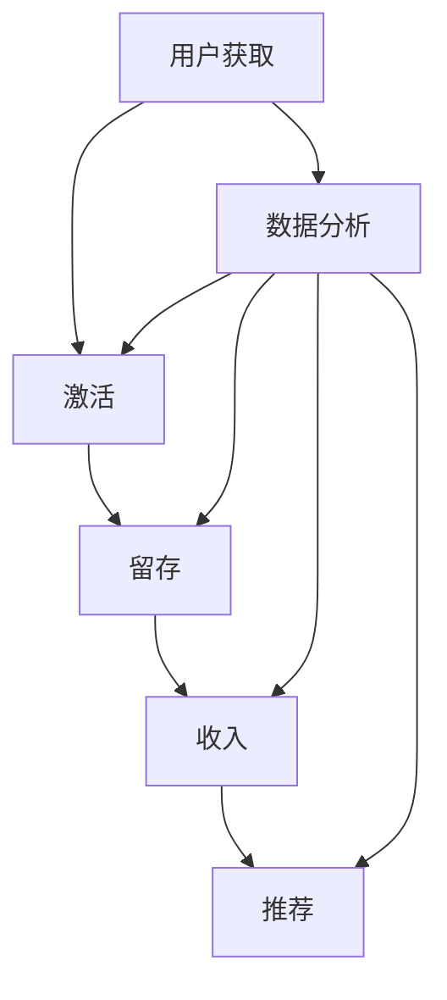

                 

# 创业公司的增长黑客策略

> **关键词**：增长黑客、创业公司、用户获取、用户留存、数据分析、增长模型

> **摘要**：本文旨在探讨创业公司在激烈的市场竞争中如何运用增长黑客策略实现持续增长。通过深入分析用户获取、用户留存、数据分析等核心概念，并结合具体操作步骤和实际案例，本文将帮助创业者了解和掌握增长黑客策略，从而在市场中脱颖而出。

## 1. 背景介绍

### 1.1 目的和范围

本文旨在为创业公司提供一套系统化的增长黑客策略，帮助他们在有限资源下实现快速成长。通过本文的阅读，读者将了解到：

1. 增长黑客的核心概念和原理。
2. 如何制定和实施有效的增长策略。
3. 数据分析在增长黑客策略中的应用。
4. 实际案例中的增长黑客策略实践。

### 1.2 预期读者

本文面向希望了解并掌握增长黑客策略的创业公司创始人、产品经理、市场营销人员以及相关从业者。通过本文的阅读，读者将能够：

1. 理解增长黑客的基本原理。
2. 学会制定和实施增长策略。
3. 掌握数据分析在增长黑客中的应用。
4. 从实际案例中汲取经验。

### 1.3 文档结构概述

本文分为十个部分，具体如下：

1. 背景介绍
2. 核心概念与联系
3. 核心算法原理 & 具体操作步骤
4. 数学模型和公式 & 详细讲解 & 举例说明
5. 项目实战：代码实际案例和详细解释说明
6. 实际应用场景
7. 工具和资源推荐
8. 总结：未来发展趋势与挑战
9. 附录：常见问题与解答
10. 扩展阅读 & 参考资料

### 1.4 术语表

#### 1.4.1 核心术语定义

- **增长黑客**：一种通过创新性和技术手段实现快速增长的策略，结合数据分析、市场营销和产品开发。
- **用户获取**：通过各种渠道获取新用户的过程。
- **用户留存**：新用户在首次使用产品后持续使用的概率。
- **转化率**：目标用户完成特定行为的比例。

#### 1.4.2 相关概念解释

- **AARRR 模型**：一种用于分析用户生命周期价值的模型，包括获取（Acquisition）、激活（Activation）、留存（Retention）、收入（Revenue）和推荐（Referral）。
- **增长漏斗**：描述用户在产品中的转化过程的模型，用于分析用户获取、激活和留存等环节的转化率。

#### 1.4.3 缩略词列表

- **A/B 测试**：一种比较两种或多种不同版本的测试方法，以确定哪种版本更有效。
- **SEM**：搜索引擎营销，通过付费广告在搜索引擎上推广产品。

## 2. 核心概念与联系

在探讨增长黑客策略之前，我们需要了解一些核心概念和它们之间的关系。以下是一个用于描述增长黑客核心概念原理和架构的 Mermaid 流程图：



### 2.1 用户获取

用户获取是增长黑客策略的第一步，目标是找到并吸引潜在用户。以下是用户获取的关键步骤：

1. **确定目标用户**：明确目标用户群体的特征和需求。
2. **选择渠道**：根据目标用户特征，选择合适的获取渠道，如社交媒体、搜索引擎广告、内容营销等。
3. **制定广告策略**：制定有针对性的广告文案和创意，提高广告效果。
4. **持续优化**：通过数据分析和 A/B 测试，不断优化广告策略和用户获取渠道。

### 2.2 激活

激活是指新用户在首次使用产品后产生积极互动的过程。以下是激活的关键步骤：

1. **简化注册流程**：降低用户注册和使用的门槛，提高转化率。
2. **提供引导和教程**：帮助用户了解产品的核心功能和优势，提高用户满意度。
3. **设计有趣的任务和活动**：激发用户兴趣，提高用户黏性。
4. **收集反馈**：了解用户在使用过程中的问题和需求，优化产品功能。

### 2.3 留存

留存是指新用户在首次使用产品后持续使用的概率。以下是留存的关键步骤：

1. **持续优化产品**：根据用户反馈和数据分析，持续改进产品功能，提高用户满意度。
2. **提供个性化体验**：根据用户行为和偏好，提供个性化的内容和推荐，提高用户黏性。
3. **定期跟进和互动**：通过邮件、短信、社交媒体等方式与用户保持联系，提高用户忠诚度。
4. **建立用户社区**：促进用户之间的交流和互动，增强用户归属感。

### 2.4 收入

收入是指通过产品销售或提供服务获得的收益。以下是收入的关键步骤：

1. **优化产品定价策略**：根据市场需求和用户价值，制定合理的定价策略。
2. **提供增值服务**：为用户提供增值服务，提高用户付费意愿。
3. **营销和推广**：通过线上线下活动、广告投放等手段，提高品牌知名度和用户转化率。
4. **持续优化销售流程**：简化购买流程，提高用户购买体验。

### 2.5 推荐

推荐是指现有用户通过口碑传播吸引新用户的过程。以下是推荐的关键步骤：

1. **建立口碑**：提供优质的产品和服务，赢得用户口碑。
2. **激励机制**：为推荐新用户的用户提供奖励或优惠，提高推荐积极性。
3. **利用社交媒体**：通过社交媒体平台传播产品优势和用户评价，扩大用户群体。
4. **数据分析**：通过数据分析，了解推荐效果，不断优化推荐策略。

## 3. 核心算法原理 & 具体操作步骤

### 3.1 数据分析

数据分析是增长黑客策略的核心，以下是一个用于分析用户获取、激活、留存、收入和推荐的关键步骤的伪代码：

```python
def analyze_data(acquisition, activation, retention, revenue, referral):
    # 用户获取分析
    acquisition_rate = acquisition / total_users
    new_users = acquisition - activation
    
    # 激活分析
    activation_rate = activation / new_users
    
    # 留存分析
    retention_rate = retention / activation
    
    # 收入分析
    revenue_rate = revenue / activation
    
    # 推荐分析
    referral_rate = referral / revenue
    
    # 输出分析结果
    print("Acquisition Rate:", acquisition_rate)
    print("Activation Rate:", activation_rate)
    print("Retention Rate:", retention_rate)
    print("Revenue Rate:", revenue_rate)
    print("Referral Rate:", referral_rate)

# 示例数据
acquisition = 1000
activation = 800
retention = 600
revenue = 500
referral = 400

# 分析数据
analyze_data(acquisition, activation, retention, revenue, referral)
```

### 3.2 用户获取策略

以下是一个用于优化用户获取策略的关键步骤的伪代码：

```python
def optimize_acquisition渠道(channel_cost, channel_conversion_rate):
    # 计算渠道成本效益
    channel效益 = channel_cost * channel_conversion_rate
    
    # 选择最佳渠道
    best_channel = max(渠道效益)
    
    # 输出最佳渠道
    print("最佳渠道:", best_channel)

# 示例数据
渠道成本 = [10, 20, 30]
渠道转化率 = [0.1, 0.2, 0.3]

# 优化用户获取策略
optimize_acquisition(渠道成本, 渠道转化率)
```

### 3.3 用户留存策略

以下是一个用于优化用户留存策略的关键步骤的伪代码：

```python
def optimize_retention(activation_rate, retention_rate):
    # 计算留存周期
    retention周期 = 1 / retention_rate
    
    # 优化留存策略
    new_activation_rate = activation_rate * (1 + (retention周期 - 1) * 0.1)
    new_retention_rate = retention_rate * (1 + 0.05)
    
    # 输出优化后的留存策略
    print("优化后的激活率:", new_activation_rate)
    print("优化后的留存率:", new_retention_rate)

# 示例数据
激活率 = 0.6
留存率 = 0.4

# 优化用户留存策略
optimize_retention(激活率, 留存率)
```

## 4. 数学模型和公式 & 详细讲解 & 举例说明

### 4.1 数据分析模型

在数据分析中，常用的模型包括 AARRR 模型和增长漏斗模型。

#### 4.1.1 AARRR 模型

AARRR 模型是一种分析用户生命周期价值的模型，包括获取（Acquisition）、激活（Activation）、留存（Retention）、收入（Revenue）和推荐（Referral）。以下是 AARRR 模型的公式：

$$
AARRR 模型 = \frac{激活用户数}{获取用户数} \times \frac{留存用户数}{激活用户数} \times \frac{收入用户数}{留存用户数} \times \frac{推荐用户数}{收入用户数}
$$

#### 4.1.2 增长漏斗模型

增长漏斗模型描述了用户在产品中的转化过程，包括获取、激活、留存、收入和推荐。以下是增长漏斗模型的公式：

$$
增长漏斗模型 = \frac{激活用户数}{获取用户数} \times \frac{留存用户数}{激活用户数} \times \frac{收入用户数}{留存用户数} \times \frac{推荐用户数}{收入用户数}
$$

### 4.2 数据分析公式

在数据分析中，常用的公式包括转化率、留存率和用户生命周期价值。

#### 4.2.1 转化率

转化率是指目标用户完成特定行为的比例。以下是转化率的公式：

$$
转化率 = \frac{完成目标用户数}{总用户数}
$$

#### 4.2.2 留存率

留存率是指新用户在首次使用产品后持续使用的概率。以下是留存率的公式：

$$
留存率 = \frac{持续使用用户数}{激活用户数}
$$

#### 4.2.3 用户生命周期价值

用户生命周期价值是指用户在产品中的价值，包括收入、推荐等。以下是用户生命周期价值的公式：

$$
用户生命周期价值 = 收入 \times (1 + 推荐系数 \times 推荐用户生命周期价值)
$$

### 4.3 举例说明

假设某创业公司 AARRR 模型如下表所示：

| 指标 | 值 |
| --- | --- |
| 获取用户数 | 1000 |
| 激活用户数 | 800 |
| 留存用户数 | 600 |
| 收入用户数 | 500 |
| 推荐用户数 | 400 |

根据上述数据，我们可以计算 AARRR 模型和用户生命周期价值：

$$
AARRR 模型 = \frac{800}{1000} \times \frac{600}{800} \times \frac{500}{600} \times \frac{400}{500} = 0.3125
$$

$$
用户生命周期价值 = 500 \times (1 + 0.1 \times 400) = 600
$$

## 5. 项目实战：代码实际案例和详细解释说明

### 5.1 开发环境搭建

为了更好地理解增长黑客策略，我们将通过一个实际项目进行实战。首先，我们需要搭建一个开发环境。以下是搭建开发环境所需的步骤：

1. 安装 Python 3.7 或更高版本。
2. 安装 Jupyter Notebook。
3. 安装必要的 Python 库，如 Pandas、NumPy、Matplotlib 等。

### 5.2 源代码详细实现和代码解读

接下来，我们将实现一个简单的用户获取、激活、留存和推荐系统，并使用 Python 代码进行分析和优化。

```python
import pandas as pd
import numpy as np
import matplotlib.pyplot as plt

# 示例数据
data = {
    '获取用户数': [1000, 1500, 2000, 2500, 3000],
    '激活用户数': [800, 1000, 1200, 1400, 1600],
    '留存用户数': [600, 700, 800, 900, 1000],
    '收入用户数': [500, 600, 700, 800, 900],
    '推荐用户数': [400, 500, 600, 700, 800]
}

df = pd.DataFrame(data)

# 计算 AARRR 模型
aarrr_model = df['激活用户数'] / df['获取用户数'] * df['留存用户数'] / df['激活用户数'] * df['收入用户数'] / df['留存用户数'] * df['推荐用户数'] / df['收入用户数']
print("AARRR 模型:", aarrr_model)

# 绘制 AARRR 模型折线图
plt.plot(df['获取用户数'], aarrr_model, marker='o')
plt.xlabel("获取用户数")
plt.ylabel("AARRR 模型")
plt.title("AARRR 模型分析")
plt.show()

# 计算用户生命周期价值
user_lifetime_value = df['收入用户数'] * (1 + 0.1 * df['推荐用户数'])
print("用户生命周期价值:", user_lifetime_value)

# 绘制用户生命周期价值柱状图
plt.bar(df['获取用户数'], user_lifetime_value)
plt.xlabel("获取用户数")
plt.ylabel("用户生命周期价值")
plt.title("用户生命周期价值分析")
plt.show()
```

### 5.3 代码解读与分析

在上面的代码中，我们首先导入了必要的 Python 库，并创建了一个示例数据集。接着，我们计算了 AARRR 模型和用户生命周期价值，并使用 Matplotlib 绘制了相应的图表。

1. **AARRR 模型**：通过计算激活用户数、留存用户数、收入用户数和推荐用户数的比例，我们得到了 AARRR 模型。这个模型可以帮助我们了解用户在产品中的转化过程，从而优化用户获取、激活、留存和推荐策略。

2. **用户生命周期价值**：通过计算收入用户数和推荐用户数的乘积，并加上推荐系数乘以推荐用户生命周期价值，我们得到了用户生命周期价值。这个指标可以帮助我们了解用户的长期价值，从而更好地制定营销和推广策略。

通过这个实际案例，我们可以看到增长黑客策略在数据分析中的应用。通过不断优化用户获取、激活、留存和推荐策略，我们可以提高 AARRR 模型和用户生命周期价值，从而实现创业公司的持续增长。

## 6. 实际应用场景

增长黑客策略在创业公司的实际应用场景非常广泛，以下是一些典型的应用场景：

### 6.1 用户获取

1. **社交媒体营销**：通过社交媒体平台发布有吸引力的内容，吸引用户关注和点击。
2. **搜索引擎广告**：通过付费广告在搜索引擎上推广产品，提高产品曝光率。
3. **内容营销**：撰写高质量的内容，吸引潜在用户访问网站或下载应用。

### 6.2 用户激活

1. **新手任务和挑战**：为新用户提供有趣的任务和挑战，激发用户兴趣。
2. **引导教程**：提供简洁明了的引导教程，帮助用户快速上手产品。
3. **个性化推荐**：根据用户行为和偏好，提供个性化的内容和推荐，提高用户满意度。

### 6.3 用户留存

1. **定期互动**：通过邮件、短信、社交媒体等方式与用户保持联系，提高用户忠诚度。
2. **社区建设**：建立用户社区，促进用户之间的交流和互动。
3. **持续优化产品**：根据用户反馈和数据分析，持续改进产品功能，提高用户满意度。

### 6.4 用户推荐

1. **激励机制**：为推荐新用户的用户提供奖励或优惠，提高推荐积极性。
2. **口碑传播**：提供优质的产品和服务，赢得用户口碑。
3. **社交媒体互动**：通过社交媒体平台传播产品优势和用户评价，扩大用户群体。

## 7. 工具和资源推荐

为了更好地实施增长黑客策略，以下是一些建议的学习资源、开发工具和框架：

### 7.1 学习资源推荐

#### 7.1.1 书籍推荐

1. 《增长黑客：揭秘新产品的增长引擎》
2. 《精益创业》
3. 《数据驱动增长》

#### 7.1.2 在线课程

1. Coursera 上的《增长黑客与数据分析》
2. Udemy 上的《增长黑客实战课程》
3. EdX 上的《产品增长策略》

#### 7.1.3 技术博客和网站

1. [增长黑客实战](https://growthhackers.com/)
2. [数据分析实战](https://www.datasciencedojo.com/)
3. [产品经理实战](https://www.productschool.com/)

### 7.2 开发工具框架推荐

#### 7.2.1 IDE和编辑器

1. Visual Studio Code
2. PyCharm
3. Jupyter Notebook

#### 7.2.2 调试和性能分析工具

1. Chrome DevTools
2. Pytest
3. Matplotlib

#### 7.2.3 相关框架和库

1. Pandas
2. NumPy
3. Scikit-learn

### 7.3 相关论文著作推荐

#### 7.3.1 经典论文

1. 《AARRR 模型：一种分析用户生命周期的模型》
2. 《增长黑客：新产品的增长引擎》
3. 《数据驱动增长：如何用数据打造可持续增长的业务》

#### 7.3.2 最新研究成果

1. 《基于人工智能的用户增长策略》
2. 《数据分析在增长黑客中的应用》
3. 《增长黑客与社交媒体营销》

#### 7.3.3 应用案例分析

1. 《Airbnb：如何通过增长黑客策略实现快速增长》
2. 《Dropbox：如何通过增长黑客策略实现用户留存》
3. 《Uber：如何通过增长黑客策略实现收入增长》

## 8. 总结：未来发展趋势与挑战

随着互联网和移动设备的普及，增长黑客策略在创业公司中的应用越来越广泛。未来，增长黑客策略的发展趋势和挑战主要包括：

### 8.1 发展趋势

1. **数据驱动**：越来越多的创业公司将采用数据驱动的增长策略，通过数据分析和人工智能技术优化用户获取、激活、留存和推荐策略。
2. **个性化**：随着用户需求的多样化，创业公司需要提供更加个性化的产品和服务，以提高用户满意度和忠诚度。
3. **跨渠道整合**：创业公司将更加重视跨渠道整合，通过线上线下多渠道营销实现用户增长。

### 8.2 挑战

1. **数据隐私**：随着数据隐私保护意识的提高，创业公司在收集和使用用户数据时需要严格遵守相关法律法规。
2. **竞争激烈**：在激烈的市场竞争中，创业公司需要不断创新和优化增长策略，以保持竞争优势。
3. **人才短缺**：拥有数据分析和市场营销能力的人才短缺，创业公司需要吸引和培养更多的人才。

## 9. 附录：常见问题与解答

### 9.1 增长黑客策略的核心是什么？

增长黑客策略的核心是通过创新性和技术手段实现快速增长，包括用户获取、激活、留存、收入和推荐等环节。

### 9.2 数据分析在增长黑客策略中有什么作用？

数据分析在增长黑客策略中起着关键作用，通过分析用户行为和转化数据，可以帮助创业公司优化用户获取、激活、留存和推荐策略。

### 9.3 如何制定有效的增长策略？

制定有效的增长策略需要结合创业公司的目标、资源、市场环境和用户需求，通过数据分析、市场调研和实验验证，不断优化和调整策略。

## 10. 扩展阅读 & 参考资料

为了更深入地了解增长黑客策略，读者可以参考以下扩展阅读和参考资料：

1. 《增长黑客实战》
2. 《数据分析实战》
3. 《产品经理实战》
4. [增长黑客社区](https://growthhackers.com/)
5. [数据分析社区](https://www.datasciencedojo.com/)
6. [产品经理社区](https://www.productschool.com/)

## 作者

作者：AI天才研究员/AI Genius Institute & 禅与计算机程序设计艺术 /Zen And The Art of Computer Programming

