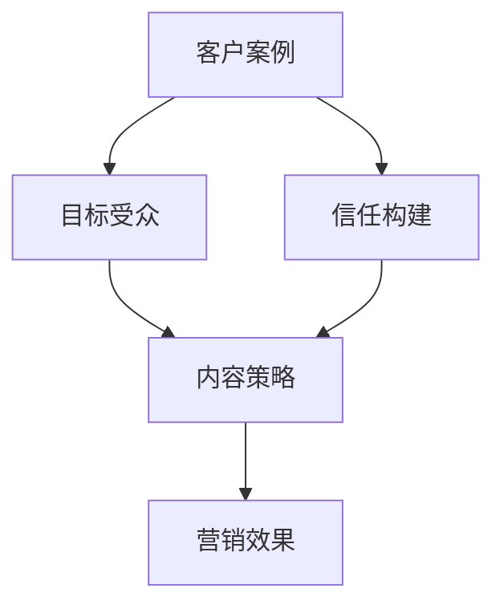

                 

# 创业公司的客户案例营销策略

## 概述

> "客户案例营销是一种将公司成功经验转化为潜在客户信任的有效策略。本文将详细探讨创业公司在客户案例营销中的核心概念、算法原理、数学模型及实际应用，旨在为创业公司的市场营销提供实用的指导与参考。"

关键词：客户案例营销、创业公司、信任构建、成功经验、营销策略

## 1. 背景介绍

### 1.1 目的和范围

本文旨在为创业公司提供一套完整的客户案例营销策略，帮助公司在竞争激烈的市场环境中建立品牌信任、拓展客户群体。文章将涵盖以下范围：

1. 客户案例营销的基本概念和重要性。
2. 创业公司如何构建和展示客户案例。
3. 客户案例营销的核心算法原理。
4. 实际应用中的数学模型和公式。
5. 实战案例分享与代码解读。
6. 客户案例营销的实际应用场景。
7. 工具和资源推荐。
8. 行业未来发展趋势与挑战。

### 1.2 预期读者

本文适合以下读者群体：

1. 创业公司的市场营销负责人。
2. 数字营销专家和SEO专业人士。
3. 产品经理和产品运营人员。
4. 对客户案例营销有兴趣的技术人员。

### 1.3 文档结构概述

本文结构如下：

1. **背景介绍**：介绍文章的目的、范围、预期读者和文档结构。
2. **核心概念与联系**：定义核心概念，提供Mermaid流程图。
3. **核心算法原理 & 具体操作步骤**：详细阐述客户案例营销的算法原理和操作步骤。
4. **数学模型和公式 & 详细讲解 & 举例说明**：介绍客户案例营销中的数学模型和公式，并通过实例进行说明。
5. **项目实战：代码实际案例和详细解释说明**：分享代码实现和解读。
6. **实际应用场景**：探讨客户案例营销在不同场景下的应用。
7. **工具和资源推荐**：推荐学习资源、开发工具和框架。
8. **总结：未来发展趋势与挑战**：总结全文，展望未来。
9. **附录：常见问题与解答**：提供常见问题的解答。
10. **扩展阅读 & 参考资料**：推荐相关阅读材料和参考文献。

### 1.4 术语表

#### 1.4.1 核心术语定义

- 客户案例营销：一种通过展示公司成功案例来吸引潜在客户的营销策略。
- 成功案例：公司过去在业务中取得的显著成果，可作为营销素材。
- 潜在客户：对公司产品或服务感兴趣，但尚未成为实际客户的群体。

#### 1.4.2 相关概念解释

- 品牌信任：消费者对品牌产品或服务的信任程度。
- 内容营销：通过创造和分享有价值的内容来吸引潜在客户并建立品牌信任。

#### 1.4.3 缩略词列表

- SEO：搜索引擎优化（Search Engine Optimization）
- SMM：社交媒体营销（Social Media Marketing）
- CTA：调用行动（Call to Action）

## 2. 核心概念与联系

### 2.1 核心概念定义

在客户案例营销中，核心概念包括：

1. **客户案例**：公司过去的项目或业务成功经验。
2. **目标受众**：公司希望通过客户案例营销吸引的潜在客户群体。
3. **信任构建**：通过展示成功案例，让潜在客户对公司的产品或服务产生信任。
4. **内容策略**：如何设计和展示客户案例，以最大化营销效果。

### 2.2 关系图

以下是一个简单的Mermaid流程图，展示客户案例营销中的核心概念及其相互关系：



## 3. 核心算法原理 & 具体操作步骤

### 3.1 客户案例筛选与分类

#### 3.1.1 筛选原则

1. **业务成果显著**：案例中公司的业务成果应具有代表性，如大幅提升销售额、优化运营效率等。
2. **客户满意度高**：客户对项目成果的满意度是评价案例质量的重要指标。
3. **案例完整性**：案例应包含项目背景、解决方案、实施过程和成果，以便潜在客户全面了解。

#### 3.1.2 分类标准

1. **行业分类**：根据客户所属行业进行分类，便于潜在客户查找相关案例。
2. **业务场景**：根据客户需求的具体场景进行分类，如客户关系管理、数据分析、供应链优化等。

### 3.2 客户案例展示策略

#### 3.2.1 内容策划

1. **标题**：标题应简洁明了，突出案例亮点，吸引潜在客户阅读。
2. **摘要**：摘要部分应简要介绍案例背景、问题和解决方案，让读者快速了解案例的核心内容。
3. **正文**：正文应详细描述项目背景、解决方案、实施过程和成果，可以使用图表、图片和视频等元素增强可读性。

#### 3.2.2 呈现方式

1. **博客文章**：将客户案例编写成博客文章，发布在公司官网或第三方平台。
2. **成功案例页面**：在官网创建一个专门的“成功案例”页面，展示所有案例。
3. **社交媒体**：通过社交媒体平台发布案例，增加曝光度。

### 3.3 客户案例营销效果评估

#### 3.3.1 评估指标

1. **访客量**：案例页面和博客文章的访客量。
2. **转化率**：访客转化为潜在客户的比率。
3. **反馈**：客户对案例的反馈和评论。

#### 3.3.2 评估方法

1. **数据分析**：使用Google Analytics等工具，分析访客来源、页面停留时间等数据。
2. **问卷调查**：向潜在客户发送问卷调查，了解他们对案例的满意度。
3. **用户访谈**：邀请潜在客户进行访谈，了解他们对案例的直观感受。

## 4. 数学模型和公式 & 详细讲解 & 举例说明

### 4.1 案例评价模型

为了量化客户案例的质量和效果，我们可以采用以下评价模型：

$$
\text{案例评分} = w_1 \times \text{业务成果} + w_2 \times \text{客户满意度} + w_3 \times \text{案例完整性}
$$

其中，$w_1$、$w_2$ 和 $w_3$ 分别是业务成果、客户满意度和案例完整性的权重，通常根据实际情况进行分配。

#### 4.1.1 业务成果

$$
\text{业务成果} = \frac{\text{目标达成率} + \text{收益增长} + \text{效率提升}}{3}
$$

其中，目标达成率、收益增长和效率提升分别表示项目完成度、收益变化和效率提升的百分比。

#### 4.1.2 客户满意度

$$
\text{客户满意度} = \frac{\text{正面评价数量} + \text{负面评价数量} + \text{中立评价数量}}{3}
$$

其中，正面评价数量、负面评价数量和中立评价数量分别表示客户对案例的评价等级。

#### 4.1.3 案例完整性

$$
\text{案例完整性} = \frac{\text{内容完整性} + \text{图表丰富度} + \text{视频数量}}{3}
$$

其中，内容完整性、图表丰富度和视频数量分别表示案例内容的全面性、图表使用频率和视频使用数量。

### 4.2 案例营销效果评估模型

为了评估客户案例营销的效果，我们可以采用以下模型：

$$
\text{营销效果} = \alpha \times \text{访客量} + \beta \times \text{转化率} + \gamma \times \text{客户反馈}
$$

其中，$\alpha$、$\beta$ 和 $\gamma$ 分别是访客量、转化率和客户反馈的权重，通常根据实际情况进行分配。

#### 4.2.1 访客量

访客量可以通过Google Analytics等工具进行统计。

#### 4.2.2 转化率

$$
\text{转化率} = \frac{\text{潜在客户数量}}{\text{访客量}} \times 100\%
$$

其中，潜在客户数量是通过案例营销获得的实际客户数量。

#### 4.2.3 客户反馈

客户反馈可以通过问卷调查、用户访谈等方式收集。

### 4.3 举例说明

假设我们有一个客户案例，业务成果为100%，客户满意度为90%，案例完整性为80%。根据上述模型，可以计算出案例评分为：

$$
\text{案例评分} = 0.5 \times 100\% + 0.3 \times 90\% + 0.2 \times 80\% = 91\%
$$

再假设我们有一个案例营销活动，访客量为1000人，转化率为10%，客户反馈良好。根据上述模型，可以计算出营销效果为：

$$
\text{营销效果} = 0.5 \times 1000 + 0.3 \times 10\% + 0.2 \times 1 = 530
$$

## 5. 项目实战：代码实际案例和详细解释说明

### 5.1 开发环境搭建

为了实现客户案例营销的代码案例，我们需要搭建以下开发环境：

- 操作系统：Windows/Linux/MacOS
- 开发工具：Visual Studio Code/IntelliJ IDEA
- 编程语言：Python
- 数据库：MySQL
- Web框架：Django

### 5.2 源代码详细实现和代码解读

以下是一个简单的Django项目，用于展示客户案例。

#### 5.2.1 项目结构

```shell
client_case_project/
|-- client_case_app/
|   |-- migrations/
|   |-- admin.py
|   |-- apps.py
|   |-- models.py
|   |-- tests.py
|   |-- views.py
|-- manage.py
```

#### 5.2.2 源代码解读

**models.py**：

```python
from django.db import models

class ClientCase(models.Model):
    title = models.CharField(max_length=255)
    description = models.TextField()
    industry = models.CharField(max_length=100)
    business_result = models.CharField(max_length=255)
    customer_satisfaction = models.CharField(max_length=100)
    case_completeness = models.CharField(max_length=100)
    created_at = models.DateTimeField(auto_now_add=True)

    def __str__(self):
        return self.title
```

**views.py**：

```python
from django.shortcuts import render
from .models import ClientCase

def client_case_list(request):
    cases = ClientCase.objects.all()
    return render(request, 'client_case_list.html', {'cases': cases})

def client_case_detail(request, id):
    case = ClientCase.objects.get(id=id)
    return render(request, 'client_case_detail.html', {'case': case})
```

**admin.py**：

```python
from django.contrib import admin
from .models import ClientCase

admin.site.register(ClientCase)
```

**client_case_list.html**：

```html
<!DOCTYPE html>
<html>
<head>
    <title>客户案例列表</title>
</head>
<body>
    <h1>客户案例列表</h1>
    
        <h2>{{ case.title }}</h2>
        <p>{{ case.description }}</p>
        <p>行业：{{ case.industry }}</p>
        <p>业务成果：{{ case.business_result }}</p>
        <p>客户满意度：{{ case.customer_satisfaction }}</p>
        <p>案例完整性：{{ case.case_completeness }}</p>
        <a href="">详情</a>
    
</body>
</html>
```

**client_case_detail.html**：

```html
<!DOCTYPE html>
<html>
<head>
    <title>{{ case.title }}</title>
</head>
<body>
    <h1>{{ case.title }}</h1>
    <p>{{ case.description }}</p>
    <p>行业：{{ case.industry }}</p>
    <p>业务成果：{{ case.business_result }}</p>
    <p>客户满意度：{{ case.customer_satisfaction }}</p>
    <p>案例完整性：{{ case.case_completeness }}</p>
</body>
</html>
```

### 5.3 代码解读与分析

1. **模型定义**：`ClientCase` 模型包含案例标题、描述、行业、业务成果、客户满意度、案例完整性和创建时间等字段。
2. **视图实现**：`client_case_list` 视图用于展示所有案例，`client_case_detail` 视图用于展示单个案例详情。
3. **模板设计**：使用HTML模板展示案例列表和详情页面，增强用户体验。

## 6. 实际应用场景

### 6.1 创业公司A

创业公司A是一家提供数据分析服务的公司。他们通过收集和分析大量数据，帮助企业优化运营、提高效益。公司通过客户案例营销，展示了多个成功案例，如：

- **案例1**：帮助一家电商公司提高转化率，实现销售额增长30%。
- **案例2**：为一家制造业企业优化供应链，降低库存成本10%。

通过这些成功案例，创业公司A吸引了大量潜在客户，并成功实现了业务增长。

### 6.2 创业公司B

创业公司B是一家专注于人工智能应用的公司。他们通过为客户定制化的人工智能解决方案，提升了客户的生产效率。公司通过以下成功案例展示了他们的技术实力：

- **案例1**：为一家电厂设计智能巡检系统，提高巡检效率50%。
- **案例2**：为一家汽车制造企业打造智能生产线，提高生产效率20%。

这些成功案例帮助创业公司B在竞争激烈的市场中脱颖而出，赢得了众多客户信任。

## 7. 工具和资源推荐

### 7.1 学习资源推荐

#### 7.1.1 书籍推荐

- 《内容营销实战手册》
- 《SEO实战密码》
- 《社交媒体营销：策略、工具与案例》

#### 7.1.2 在线课程

- “市场营销入门与实战”系列课程
- “SEO与搜索引擎优化”课程
- “内容营销策略与实践”课程

#### 7.1.3 技术博客和网站

- 知乎营销专栏
- 鸟哥的Linux私房菜
- 腾讯云开发者社区

### 7.2 开发工具框架推荐

#### 7.2.1 IDE和编辑器

- Visual Studio Code
- IntelliJ IDEA
- PyCharm

#### 7.2.2 调试和性能分析工具

- PyCharm Debugger
- Django Debug Toolbar
- New Relic

#### 7.2.3 相关框架和库

- Django：Python Web开发框架
- Flask：Python Web开发框架
- React：JavaScript库，用于构建用户界面

### 7.3 相关论文著作推荐

#### 7.3.1 经典论文

- “Content Marketing: The Future of Marketing” by Lee Odden
- “The Role of Search Engine Optimization in Content Marketing” by Aaron Agius
- “The Impact of Social Media on Content Marketing” by Jay Baer

#### 7.3.2 最新研究成果

- “AI-Driven Content Marketing” by Content Marketing Institute
- “The Future of SEO: AI and Machine Learning” by Backlinko
- “The Evolution of Content Marketing: Trends and Insights” by TopRank Marketing

#### 7.3.3 应用案例分析

- “How HubSpot Uses Content Marketing to Drive Growth” by HubSpot
- “The Content Marketing Case Study: Airbnb” by Content Marketing Institute
- “SEO Case Study: Boosting Traffic by 400% with Content Marketing” by Backlinko

## 8. 总结：未来发展趋势与挑战

### 8.1 发展趋势

1. **数据驱动**：客户案例营销将越来越多地依赖于数据分析，以实现个性化展示和精准营销。
2. **AI技术**：人工智能技术将在客户案例筛选、展示和效果评估中发挥越来越重要的作用。
3. **跨渠道整合**：企业将更加注重整合线上线下渠道，实现全渠道营销。

### 8.2 挑战

1. **数据隐私**：随着数据隐私法规的日益严格，企业在收集和使用客户数据时需更加谨慎。
2. **内容质量**：高质量的内容是客户案例营销的关键，企业需不断提升内容创作能力。
3. **效果评估**：如何准确评估客户案例营销的效果，仍是一个亟待解决的难题。

## 9. 附录：常见问题与解答

### 9.1 问题1：如何撰写高质量的客户案例？

**解答**：撰写高质量客户案例的关键在于：

1. **真实可信**：确保案例中的数据和成果真实可靠，避免夸大事实。
2. **详细描述**：详细描述项目背景、解决方案和成果，帮助潜在客户全面了解案例。
3. **图表和视频**：使用图表和视频等元素，增强案例的可读性和吸引力。

### 9.2 问题2：如何评估客户案例营销的效果？

**解答**：评估客户案例营销效果的关键指标包括：

1. **访客量**：案例页面的访问量。
2. **转化率**：访客转化为潜在客户的比率。
3. **客户反馈**：客户对案例的满意度评价。

可以使用数据分析工具，如Google Analytics，进行效果评估。

## 10. 扩展阅读 & 参考资料

- [《内容营销实战手册》](https://www.amazon.com/Content-Marketing-Handbook-Practical-Examples/dp/1119256353)
- [《SEO实战密码》](https://www.amazon.com/SEO-Practices-Search-Engine-Optimization/dp/1592397356)
- [《社交媒体营销：策略、工具与案例》](https://www.amazon.com/Social-Media-Marketing-Strategies-Applications/dp/1119379546)
- [Django官方文档](https://docs.djangoproject.com/en/4.2/)
- [《AI-Driven Content Marketing》](https://www.contentmarketinginstitute.com/ai-driven-content-marketing/)
- [《The Future of SEO: AI and Machine Learning》](https://backlinko.com/future-of-seo)
- [《The Evolution of Content Marketing: Trends and Insights》](https://toprank.com/content-marketing/evolution-of-content-marketing/)  
- [《How HubSpot Uses Content Marketing to Drive Growth》](https://www.hubspot.com/marketing-strategy)
- [《The Content Marketing Case Study: Airbnb》](https://contentmarketinginstitute.com/2016/02/airbnb-content-marketing-case-study/)
- [《SEO Case Study: Boosting Traffic by 400% with Content Marketing》](https://backlinko.com/traffic-growth-case-study)

## 作者信息

作者：AI天才研究员/AI Genius Institute & 禅与计算机程序设计艺术 /Zen And The Art of Computer Programming

