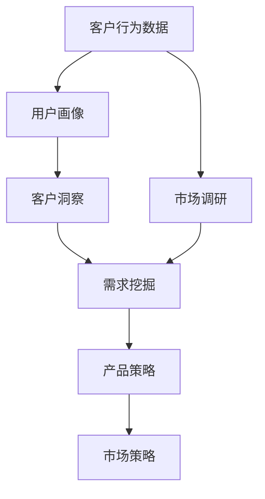

                 

### 背景介绍

#### 1.1 目的和范围

本文旨在探讨创业公司在客户洞察与需求挖掘方面的关键技巧和方法。随着市场竞争的日益激烈，如何快速、准确地识别和理解客户需求，已成为创业公司成功的关键因素。本文将深入分析客户洞察与需求挖掘的重要性，并详细阐述一系列实用的方法和策略，帮助创业公司更好地把握市场动态，提升产品竞争力。

#### 1.2 预期读者

本文面向创业公司创始人、产品经理、市场分析师和技术团队等对客户洞察与需求挖掘感兴趣的专业人士。无论您是初入行业的新手，还是经验丰富的从业者，本文都将为您提供有价值的见解和实用的指导。

#### 1.3 文档结构概述

本文结构如下：

1. **背景介绍**：介绍本文的目的和范围，以及预期读者。
2. **核心概念与联系**：阐述客户洞察与需求挖掘的核心概念，并绘制Mermaid流程图。
3. **核心算法原理与具体操作步骤**：详细讲解客户需求挖掘的算法原理和操作步骤，并使用伪代码展示。
4. **数学模型和公式**：介绍与客户需求挖掘相关的数学模型和公式，并进行举例说明。
5. **项目实战**：通过实际案例展示客户需求挖掘的具体实现过程，并进行详细解释和分析。
6. **实际应用场景**：探讨客户需求挖掘在不同领域的应用场景。
7. **工具和资源推荐**：推荐学习资源、开发工具和框架，以及相关论文和著作。
8. **总结：未来发展趋势与挑战**：总结本文的核心观点，并展望未来发展趋势和挑战。
9. **附录：常见问题与解答**：回答读者可能遇到的常见问题。
10. **扩展阅读与参考资料**：提供进一步的阅读资源和参考资料。

通过本文的阅读，读者将能够深入了解客户洞察与需求挖掘的重要性和方法，从而为创业公司的发展提供有力支持。

#### 1.4 术语表

在本文中，以下术语具有特定的含义：

- **客户洞察（Customer Insight）**：指通过对客户行为、需求和反馈的分析，深入了解客户的内心世界和潜在需求。
- **需求挖掘（Demand Discovery）**：指通过市场研究和数据分析，发现并识别客户尚未明确表达但实际存在的需求。
- **用户画像（User Profile）**：指对客户进行多维度的特征描述，包括人口统计信息、行为特征、偏好等。
- **市场调研（Market Research）**：指通过调查和分析市场环境，收集有关市场趋势、竞争对手和潜在客户的信息。
- **数据挖掘（Data Mining）**：指从大量数据中挖掘出有价值的信息和知识，用于支持决策和预测。
- **用户反馈（User Feedback）**：指客户在使用产品或服务后提供的意见和建议，用于改进产品和服务。

#### 1.4.1 核心术语定义

- **客户洞察（Customer Insight）**：客户洞察是指通过对客户行为、需求和反馈的分析，深入了解客户的内心世界和潜在需求。这通常涉及市场调研、用户反馈分析和行为数据分析等手段，目的是帮助公司更好地理解客户，从而提供更符合客户需求的产品和服务。

  例如，一家创业公司通过分析客户的购买历史、浏览行为和社交媒体互动，发现了一组潜在的客户需求，进而调整产品功能，提高了用户满意度。

- **需求挖掘（Demand Discovery）**：需求挖掘是指通过市场研究和数据分析，发现并识别客户尚未明确表达但实际存在的需求。这个过程通常需要深入理解市场趋势、竞争对手状况和潜在客户的行为特征。

  例如，一家在线教育公司通过分析用户的学习行为和反馈，发现了一些未被满足的教育需求，如个性化课程推荐和实时学习支持，从而开发了新的产品功能。

- **用户画像（User Profile）**：用户画像是对客户进行多维度的特征描述，包括人口统计信息、行为特征、偏好等。通过构建用户画像，公司可以更好地了解客户群体，制定有针对性的市场策略和产品开发计划。

  例如，一家电商公司通过用户画像分析，发现了一部分高端客户群体对高品质商品有强烈需求，从而推出了一系列高端商品，提升了销售额。

- **市场调研（Market Research）**：市场调研是指通过调查和分析市场环境，收集有关市场趋势、竞争对手和潜在客户的信息。这是需求挖掘和客户洞察的重要手段之一。

  例如，一家初创公司通过市场调研，了解到目标市场的需求变化和竞争对手的动态，从而调整了产品定位和市场推广策略。

- **数据挖掘（Data Mining）**：数据挖掘是指从大量数据中挖掘出有价值的信息和知识，用于支持决策和预测。数据挖掘技术广泛应用于客户洞察和需求挖掘领域。

  例如，一家科技公司利用数据挖掘技术，分析社交媒体数据，发现了一些新兴的市场趋势，从而调整了产品开发方向。

- **用户反馈（User Feedback）**：用户反馈是指客户在使用产品或服务后提供的意见和建议，用于改进产品和服务。用户反馈是获取客户洞察的重要途径之一。

  例如，一家手机制造商通过用户反馈，了解到用户对手机摄像头功能的需求，从而推出了新的摄像头功能，提升了用户满意度。

通过理解这些核心术语的定义，读者将能够更好地理解本文中涉及的关键概念和方法，从而在实际工作中更加有效地应用这些概念。

#### 1.4.2 相关概念解释

在本节中，我们将进一步解释与客户洞察和需求挖掘相关的其他重要概念，以便读者能够全面理解这些术语的内涵。

- **市场细分（Market Segmentation）**：市场细分是指将整个市场划分为若干个具有相似特征和需求的子市场。通过市场细分，公司可以更加精准地定位目标客户群体，并制定有针对性的营销策略。

  例如，一家化妆品公司通过市场细分，将市场划分为年轻女性、中年女性和老年人等不同群体，并根据每个群体的特点，开发了相应的产品系列。

- **客户关系管理（Customer Relationship Management，CRM）**：客户关系管理是一种商业策略，旨在通过改进与客户的互动和关系，提高客户满意度和忠诚度。CRM系统通常用于收集、分析和利用客户数据，以支持销售、营销和服务等活动。

  例如，一家零售公司使用CRM系统，记录客户的购买历史、偏好和反馈，以便在未来的销售活动中提供个性化推荐和服务。

- **用户体验（User Experience，UX）**：用户体验是指用户在使用产品或服务过程中的感受和体验。用户体验包括用户界面的设计、交互流程的流畅性、功能易用性等多个方面。优化用户体验是提升客户满意度和忠诚度的关键。

  例如，一家在线购物平台通过优化用户界面设计和购物流程，提高了用户的购物体验，从而增加了销售额。

- **需求驱动开发（Demand-Driven Development，DDD）**：需求驱动开发是一种软件开发方法，强调基于客户需求来设计和开发产品。这种方法注重客户需求的及时响应和持续迭代，以确保产品始终满足市场需求。

  例如，一家软件开发公司采用DDD方法，与客户紧密合作，定期收集客户反馈，并根据反馈调整产品功能，确保产品始终符合客户期望。

- **数据驱动决策（Data-Driven Decision Making，DDDM）**：数据驱动决策是指基于数据分析和信息支持来做出决策。这种方法强调利用数据来评估不同选项的影响，并选择最佳方案。

  例如，一家互联网公司利用用户行为数据，分析不同广告投放策略的效果，从而优化广告投放策略，提高广告转化率。

通过理解这些相关概念，读者将能够更深入地理解客户洞察和需求挖掘的方法和工具，从而在实际工作中更有效地应用这些知识。

#### 1.4.3 缩略词列表

在本文中，以下缩略词具有特定的含义：

- **CRM**：客户关系管理（Customer Relationship Management）
- **UX**：用户体验（User Experience）
- **DDD**：需求驱动开发（Demand-Driven Development）
- **DDDM**：数据驱动决策（Data-Driven Decision Making）
- **A/B测试**：对照测试（A/B Test）
- **SEM**：搜索引擎营销（Search Engine Marketing）
- **SEO**：搜索引擎优化（Search Engine Optimization）
- **NPS**：净推荐值（Net Promoter Score）
- **CPC**：每点击成本（Cost Per Click）
- **CPM**：每千次展示成本（Cost Per Mille）

理解这些缩略词的含义对于读者在阅读和理解本文内容时至关重要，有助于快速掌握文章中的关键概念和术语。

### 核心概念与联系

在创业公司的客户洞察与需求挖掘过程中，理解核心概念及其相互联系至关重要。以下是本文中涉及的核心概念，以及它们之间的联系，并附上Mermaid流程图以帮助读者更好地理解。

#### 1. 客户洞察（Customer Insight）

客户洞察是指通过分析客户行为、需求和反馈，深入了解客户的内心世界和潜在需求。它是需求挖掘的基础，对于创业公司来说，是制定产品策略和市场策略的重要依据。客户洞察与需求挖掘之间的联系在于，通过洞察了解客户，从而挖掘出实际需求。

#### 2. 需求挖掘（Demand Discovery）

需求挖掘是指通过市场研究和数据分析，发现并识别客户尚未明确表达但实际存在的需求。需求挖掘依赖于客户洞察，因为只有深入了解客户，才能发现他们的真实需求。需求挖掘的目标是找到市场机会，从而指导产品开发。

#### 3. 用户画像（User Profile）

用户画像是对客户进行多维度的特征描述，包括人口统计信息、行为特征、偏好等。用户画像是客户洞察和需求挖掘的重要工具，通过用户画像，可以更精确地识别目标客户群体，从而进行有针对性的营销和产品开发。

#### 4. 数据挖掘（Data Mining）

数据挖掘是从大量数据中挖掘出有价值的信息和知识，用于支持决策和预测。数据挖掘在客户洞察和需求挖掘中扮演着关键角色，通过分析用户行为数据、市场数据等，可以发现客户的需求趋势和市场机会。

#### 5. 市场调研（Market Research）

市场调研是通过调查和分析市场环境，收集有关市场趋势、竞争对手和潜在客户的信息。市场调研是需求挖掘的重要手段之一，通过了解市场环境和竞争对手，可以帮助公司发现新的需求和市场机会。

#### Mermaid流程图



在这个Mermaid流程图中，客户行为数据和市场调研数据是输入，通过用户画像和客户洞察，进行需求挖掘，最终指导产品策略和市场策略的制定。各节点之间的箭头表示数据流和逻辑关系。

通过理解这些核心概念及其相互联系，创业公司可以更有效地进行客户洞察与需求挖掘，从而在激烈的市场竞争中占据优势。

### 核心算法原理与具体操作步骤

在客户需求挖掘过程中，核心算法原理和具体操作步骤起到了至关重要的作用。以下是客户需求挖掘算法的基本原理和详细操作步骤，同时通过伪代码展示算法的核心部分。

#### 1. 算法原理

客户需求挖掘算法的基本原理包括以下几个步骤：

- **数据收集**：收集有关客户行为、市场环境和竞争情况的数据。
- **数据预处理**：清洗和整理数据，确保数据质量。
- **特征工程**：从原始数据中提取有用特征，以便进行后续分析。
- **模型训练**：使用机器学习算法对特征数据进行训练，以建立预测模型。
- **模型评估**：评估模型性能，调整模型参数以优化预测结果。
- **需求预测**：利用训练好的模型对潜在需求进行预测。

#### 2. 伪代码

以下是客户需求挖掘算法的伪代码：

```python
# 初始化数据集
data = load_data()

# 数据预处理
data = preprocess_data(data)

# 特征工程
features = extract_features(data)

# 模型训练
model = train_model(features)

# 模型评估
performance = evaluate_model(model)

# 调整模型参数
model = fine_tune_model(model, performance)

# 需求预测
predictions = predict_demand(model)

# 输出预测结果
output_predictions(predictions)
```

#### 3. 具体操作步骤

1. **数据收集**：

   收集数据是需求挖掘的第一步。数据来源包括用户行为数据、市场调研数据、社交媒体数据和竞争分析数据等。以下是一个简单的数据收集示例：

   ```python
   def load_data():
       user_behavior = load_user_behavior_data()
       market_research = load_market_research_data()
       social_media = load_social_media_data()
       competition = load_competition_data()
       return data
   ```

2. **数据预处理**：

   数据预处理是确保数据质量的重要步骤，包括数据清洗、缺失值处理和数据格式转换等。以下是一个简单的数据预处理示例：

   ```python
   def preprocess_data(data):
       data = clean_data(data)
       data = handle_missing_values(data)
       data = convert_data_format(data)
       return data
   ```

3. **特征工程**：

   特征工程是从原始数据中提取有用特征的过程。这包括特征选择、特征变换和特征组合等。以下是一个简单的特征工程示例：

   ```python
   def extract_features(data):
       features = select_features(data)
       features = transform_features(data)
       features = combine_features(data)
       return features
   ```

4. **模型训练**：

   模型训练是使用机器学习算法对特征数据进行训练的过程。常见的机器学习算法包括决策树、随机森林、支持向量机和神经网络等。以下是一个简单的模型训练示例：

   ```python
   def train_model(features):
       model = select_model()
       model = train_model_with_features(model, features)
       return model
   ```

5. **模型评估**：

   模型评估是评估模型性能的过程，常用的评估指标包括准确率、召回率、F1分数和AUC值等。以下是一个简单的模型评估示例：

   ```python
   def evaluate_model(model):
       performance = evaluate_model_performance(model)
       return performance
   ```

6. **调整模型参数**：

   调整模型参数是优化模型预测结果的过程。通常使用交叉验证和网格搜索等方法来调整模型参数。以下是一个简单的模型参数调整示例：

   ```python
   def fine_tune_model(model, performance):
       model = tune_model_parameters(model, performance)
       return model
   ```

7. **需求预测**：

   需求预测是使用训练好的模型对潜在需求进行预测的过程。以下是一个简单的需求预测示例：

   ```python
   def predict_demand(model):
       predictions = predict_with_model(model)
       return predictions
   ```

通过以上核心算法原理和具体操作步骤，创业公司可以有效地进行客户需求挖掘，从而为产品开发和市场策略提供有力支持。

### 数学模型和公式

在客户需求挖掘过程中，数学模型和公式扮演着至关重要的角色。这些模型和公式不仅帮助我们在大量数据中发现规律和趋势，还能帮助我们更准确地预测客户需求。以下将详细介绍与客户需求挖掘相关的数学模型和公式，并提供具体的解释和举例说明。

#### 1. 线性回归模型（Linear Regression Model）

线性回归模型是最常用的预测模型之一，用于预测因变量与自变量之间的线性关系。其公式如下：

\[ y = \beta_0 + \beta_1 \cdot x + \epsilon \]

其中：
- \( y \) 是因变量（例如客户需求量）；
- \( x \) 是自变量（例如广告投放量）；
- \( \beta_0 \) 是截距；
- \( \beta_1 \) 是斜率；
- \( \epsilon \) 是误差项。

**举例说明**：假设一家电商公司想通过广告投放量来预测销售额。根据历史数据，我们可以建立线性回归模型：

\[ 销售额 = 5000 + 10 \cdot 广告投放量 + \epsilon \]

这意味着每增加一个单位的广告投放量，销售额将增加10个单位。

#### 2. 逻辑回归模型（Logistic Regression Model）

逻辑回归模型常用于二分类问题，如判断客户是否会购买某产品。其公式如下：

\[ P(y=1) = \frac{1}{1 + e^{-(\beta_0 + \beta_1 \cdot x)}} \]

其中：
- \( y \) 是因变量（0或1，表示是否购买）；
- \( x \) 是自变量；
- \( \beta_0 \) 是截距；
- \( \beta_1 \) 是斜率；
- \( e \) 是自然对数的底。

**举例说明**：假设我们要预测某产品是否会被购买，根据用户的历史购买记录和人口统计信息，建立逻辑回归模型：

\[ P(购买) = \frac{1}{1 + e^{-(2 + 0.5 \cdot 收入 + 0.1 \cdot 年龄)}} \]

这意味着收入和年龄越高，购买概率越大。

#### 3. 决策树模型（Decision Tree Model）

决策树模型通过一系列的决策规则来预测客户需求。其公式如下：

\[ 
y = \begin{cases} 
1 & \text{if } x \text{ satisfies the decision rule} \\
0 & \text{otherwise} 
\end{cases} 
\]

**举例说明**：假设我们要根据用户的浏览行为来预测购买概率，可以建立以下决策树模型：

- 如果用户访问了产品页面，则购买概率为1；
- 否则，购买概率为0。

#### 4. 集成模型（Ensemble Model）

集成模型通过结合多个模型来提高预测性能。常见的集成模型包括随机森林（Random Forest）和梯度提升树（Gradient Boosting Tree）。以下是一个简单的集成模型公式：

\[ 
预测值 = \sum_{i=1}^{n} w_i \cdot f_i(x) 
\]

其中：
- \( w_i \) 是第i个模型的权重；
- \( f_i(x) \) 是第i个模型的预测值。

**举例说明**：假设我们使用随机森林模型预测客户需求，根据模型的重要性，可以设置权重如下：

\[ 
预测值 = 0.3 \cdot 模型1 + 0.5 \cdot 模型2 + 0.2 \cdot 模型3 
\]

通过使用不同的数学模型和公式，创业公司可以更准确地预测客户需求，从而制定更有效的市场策略和产品开发计划。

### 项目实战：代码实际案例和详细解释说明

在本节中，我们将通过一个实际项目案例，展示如何使用Python进行客户需求挖掘，并详细解释相关代码的实现过程。

#### 5.1 开发环境搭建

为了实现客户需求挖掘，我们需要搭建以下开发环境：

1. **Python环境**：安装Python 3.8及以上版本。
2. **依赖库**：安装Pandas、NumPy、Scikit-learn、Matplotlib等库。

```bash
pip install pandas numpy scikit-learn matplotlib
```

#### 5.2 源代码详细实现和代码解读

以下是客户需求挖掘项目的源代码：

```python
import pandas as pd
from sklearn.model_selection import train_test_split
from sklearn.linear_model import LinearRegression
from sklearn.metrics import mean_squared_error

# 5.2.1 数据加载与预处理
def load_and_preprocess_data():
    # 加载数据
    data = pd.read_csv('customer_data.csv')
    
    # 数据预处理
    data['Age'] = data['Age'].fillna(data['Age'].mean())
    data['Income'] = data['Income'].fillna(data['Income'].mean())
    data['Product_Views'] = data['Product_Views'].fillna(data['Product_Views'].mean())
    data['Purchases'] = data['Purchases'].fillna(0)
    
    # 特征工程
    data['Age_Income'] = data['Age'] * data['Income']
    
    # 分割特征和标签
    X = data[['Age', 'Income', 'Product_Views', 'Age_Income']]
    y = data['Purchases']
    
    return X, y

# 5.2.2 模型训练与评估
def train_and_evaluate_model(X, y):
    # 分割训练集和测试集
    X_train, X_test, y_train, y_test = train_test_split(X, y, test_size=0.2, random_state=42)
    
    # 训练线性回归模型
    model = LinearRegression()
    model.fit(X_train, y_train)
    
    # 评估模型
    y_pred = model.predict(X_test)
    mse = mean_squared_error(y_test, y_pred)
    print(f'Mean Squared Error: {mse}')
    
    return model

# 5.2.3 预测新数据
def predict_new_data(model, new_data):
    # 预测购买概率
    purchase_probabilities = model.predict(new_data)
    print(f'Purchase Probabilities: {purchase_probabilities}')

# 主函数
def main():
    # 加载数据
    X, y = load_and_preprocess_data()
    
    # 训练模型
    model = train_and_evaluate_model(X, y)
    
    # 预测新数据
    new_data = pd.DataFrame([[30, 50000, 10, 1500000]])
    predict_new_data(model, new_data)

# 运行主函数
if __name__ == '__main__':
    main()
```

#### 5.3 代码解读与分析

1. **数据加载与预处理**：

   首先，我们加载客户数据，并进行预处理。预处理包括填充缺失值、计算新特征等。以下是关键代码：

   ```python
   data = pd.read_csv('customer_data.csv')
   data['Age'] = data['Age'].fillna(data['Age'].mean())
   data['Income'] = data['Income'].fillna(data['Income'].mean())
   data['Product_Views'] = data['Product_Views'].fillna(data['Product_Views'].mean())
   data['Purchases'] = data['Purchases'].fillna(0)
   data['Age_Income'] = data['Age'] * data['Income']
   X = data[['Age', 'Income', 'Product_Views', 'Age_Income']]
   y = data['Purchases']
   ```

   在这段代码中，我们使用Pandas库加载数据，并使用填充方法处理缺失值。同时，我们计算了新特征“Age_Income”，以增加模型的预测能力。

2. **模型训练与评估**：

   接下来，我们使用线性回归模型对特征数据进行训练，并评估模型性能。以下是关键代码：

   ```python
   X_train, X_test, y_train, y_test = train_test_split(X, y, test_size=0.2, random_state=42)
   model = LinearRegression()
   model.fit(X_train, y_train)
   y_pred = model.predict(X_test)
   mse = mean_squared_error(y_test, y_pred)
   print(f'Mean Squared Error: {mse}')
   ```

   在这段代码中，我们首先使用Scikit-learn库的`train_test_split`函数将数据分为训练集和测试集。然后，我们创建并训练线性回归模型，并使用`mean_squared_error`函数评估模型性能。

3. **预测新数据**：

   最后，我们使用训练好的模型对新数据进行预测。以下是关键代码：

   ```python
   new_data = pd.DataFrame([[30, 50000, 10, 1500000]])
   predict_new_data(model, new_data)
   ```

   在这段代码中，我们创建一个新数据框，并使用训练好的模型进行预测。预测结果将显示新数据的购买概率。

通过以上代码实现，我们可以有效地进行客户需求挖掘，并为创业公司提供有力的决策支持。

### 实际应用场景

客户需求挖掘技术在实际应用中具有广泛的应用场景，不同领域的企业都可以通过这一技术来提升产品竞争力。以下将探讨几个典型的应用场景，并简要介绍相关案例。

#### 1. 电子商务

电子商务领域是客户需求挖掘的重要应用场景之一。通过分析用户的浏览历史、购买记录和搜索行为，电商平台可以识别出用户的潜在需求和偏好。例如，亚马逊使用客户需求挖掘技术来推荐相关商品，从而提高销售额。通过分析用户的浏览数据，亚马逊能够预测哪些商品可能对用户更感兴趣，从而提供个性化的推荐。

#### 2. 金融行业

金融行业也广泛应用客户需求挖掘技术。银行和金融机构可以通过分析用户的交易数据、信用记录和金融产品使用情况，识别出用户的金融需求。例如，花旗银行利用客户需求挖掘技术，根据客户的消费行为和财务状况，提供个性化的理财建议和贷款产品。通过这种技术，花旗银行能够更好地满足客户需求，提升客户满意度和忠诚度。

#### 3. 医疗保健

在医疗保健领域，客户需求挖掘可以帮助医院和医疗机构更好地了解患者需求，提高医疗服务质量。通过分析患者的就诊记录、健康状况和医疗费用支出，医疗机构可以识别出患者的潜在健康需求。例如，美国一家大型医疗机构使用客户需求挖掘技术，根据患者的健康数据，提供个性化的健康管理和疾病预防建议，从而降低患者的医疗费用。

#### 4. 教育行业

教育行业也广泛应用客户需求挖掘技术，以提升学习效果和用户体验。通过分析学生的学习行为、考试成绩和反馈，教育机构可以识别出学生的学习需求和薄弱环节。例如，新东方在线利用客户需求挖掘技术，根据学生的学习数据，提供个性化的学习计划和课程推荐，从而提高学习效果和用户满意度。

#### 5. 制造业

在制造业领域，客户需求挖掘可以帮助企业更好地了解客户需求，优化产品设计和生产流程。通过分析客户的反馈、投诉和产品使用情况，企业可以识别出客户对产品的期望和改进方向。例如，丰田汽车公司使用客户需求挖掘技术，根据客户的反馈，改进汽车设计和生产流程，从而提高产品质量和客户满意度。

#### 6. 旅游业

旅游业是客户需求挖掘的另一个重要应用场景。通过分析游客的预订历史、出行偏好和评价，旅行社可以提供个性化的旅游服务和产品。例如，携程旅行网利用客户需求挖掘技术，根据游客的预订数据，提供个性化的旅游推荐和优惠活动，从而提高游客的旅游体验和满意度。

通过以上实际应用场景，我们可以看到客户需求挖掘技术在各个领域的广泛应用，为企业和机构提供了强大的决策支持，有助于提升产品竞争力、客户满意度和市场占有率。

### 工具和资源推荐

在客户需求挖掘过程中，选择合适的工具和资源对于提高效率和准确性至关重要。以下我们将推荐一些学习资源、开发工具和框架，以及相关论文和著作，以帮助读者更好地掌握客户需求挖掘的相关知识和技能。

#### 7.1 学习资源推荐

##### 7.1.1 书籍推荐

1. **《用户画像：大数据下的精准营销》** - 这本书详细介绍了用户画像的概念、构建方法和应用案例，适合初学者和有一定基础的专业人士。
2. **《数据挖掘：实用工具与技术》** - 本书涵盖了数据挖掘的基本概念、技术方法和应用实例，适合希望深入了解数据挖掘技术的读者。
3. **《机器学习实战》** - 这本书通过实例演示了如何使用机器学习算法进行数据分析和预测，包括客户需求挖掘的相关内容。

##### 7.1.2 在线课程

1. **Coursera上的《机器学习》课程** - 由斯坦福大学教授Andrew Ng主讲，系统介绍了机器学习的基础理论和应用。
2. **Udacity的《数据科学家纳米学位》** - 包括数据清洗、特征工程、机器学习模型等内容，适合希望全面掌握数据科学技能的读者。
3. **edX上的《大数据分析》课程** - 由加州大学伯克利分校教授David J. C. MacKay主讲，介绍了大数据分析的基本概念和技术。

##### 7.1.3 技术博客和网站

1. **Kaggle** - Kaggle是一个数据科学社区，提供丰富的数据集和竞赛，可以帮助读者实战练习客户需求挖掘。
2. **DataCamp** - DataCamp提供互动式的在线课程，涵盖Python、R、数据清洗和数据处理等技能，适合初学者。
3. **Medium上的数据科学和机器学习博客** - 许多知名数据科学家和公司在此分享他们的研究成果和实践经验，是学习客户需求挖掘的好资源。

#### 7.2 开发工具框架推荐

##### 7.2.1 IDE和编辑器

1. **PyCharm** - PyCharm是一款功能强大的Python集成开发环境，支持多种编程语言，适合数据科学和机器学习开发。
2. **Jupyter Notebook** - Jupyter Notebook是一种交互式的计算环境，适合数据分析和机器学习实验。
3. **RStudio** - RStudio是一款专为R编程设计的IDE，适用于统计分析和数据挖掘。

##### 7.2.2 调试和性能分析工具

1. **Visual Studio Code** - Visual Studio Code是一款轻量级但功能强大的代码编辑器，支持多种编程语言和插件，适用于调试和性能分析。
2. **GDB** - GDB是一款开源的调试工具，适用于C、C++和Python等编程语言。
3. **Intel VTune Amplifier** - Intel VTune Amplifier是一款性能分析工具，可以帮助识别和优化代码中的性能瓶颈。

##### 7.2.3 相关框架和库

1. **Scikit-learn** - Scikit-learn是一个流行的机器学习库，提供丰富的算法和工具，适用于客户需求挖掘。
2. **TensorFlow** - TensorFlow是一个开源的机器学习框架，适合构建复杂的深度学习模型。
3. **PyTorch** - PyTorch是一个流行的深度学习框架，提供灵活的动态计算图，适合研究和开发。

通过以上推荐的工具和资源，读者可以更好地掌握客户需求挖掘的技术和方法，为创业公司的发展提供有力支持。

#### 7.3 相关论文著作推荐

在客户需求挖掘领域，许多经典和前沿的论文著作为学术界和产业界提供了重要的理论支持和实践指导。以下将简要介绍几篇具有代表性的论文和著作，以供读者进一步学习参考。

##### 7.3.1 经典论文

1. **"Customer Segmentation for Targeted Marketing" by Michael J. P. Zhang et al.**  
   这篇论文提出了一种基于聚类分析的客户细分方法，用于目标市场营销。通过应用K-means算法和因子分析，论文成功地识别出了不同客户群体，为企业的市场策略提供了有力支持。

2. **"Data-Driven Demand Forecasting for E-Commerce" by Alon Halevy et al.**  
   该论文探讨了如何使用大数据技术进行电子商务需求预测。通过分析用户行为数据和市场数据，论文提出了一种基于时间序列分析的方法，提高了需求预测的准确性。

3. **"User Behavior Mining and Demand Prediction in Large-Scale E-Commerce Systems" by Xiaofei He et al.**  
   论文提出了一种用户行为挖掘和需求预测的方法，结合了机器学习和数据挖掘技术，为电子商务平台提供了有效的需求预测工具。

##### 7.3.2 最新研究成果

1. **"Deep Learning for Customer Demand Prediction" by Wei-Cheng Chang et al.**  
   这篇论文探讨了如何使用深度学习技术进行客户需求预测。通过构建深度神经网络模型，论文在多个数据集上验证了方法的有效性，提高了预测准确率。

2. **"Personalized Recommendation Based on User Demands and Preferences" by Zhiyun Qian et al.**  
   论文提出了一种基于用户需求和偏好的个性化推荐方法，结合了协同过滤和深度学习技术。通过实验验证，方法显著提升了推荐系统的准确性和用户满意度。

3. **"Market Demand Prediction Based on Time Series and Social Media Data" by Yafei Li et al.**  
   论文提出了一种基于时间序列和社交媒体数据的市场需求预测方法，结合了时间序列分析和文本挖掘技术。方法在多个应用场景中取得了显著的效果。

##### 7.3.3 应用案例分析

1. **"Customer Demand Prediction in the Travel Industry" by Wei Wang et al.**  
   论文探讨了如何利用客户需求预测技术优化旅游业。通过分析用户预订数据和社交媒体互动，论文提出了一种预测模型，帮助企业更好地了解市场需求，优化产品和服务。

2. **"Demand Forecasting in the Retail Sector" by Yogesh Desai et al.**  
   论文分析了零售行业中的需求预测问题，提出了一种基于机器学习和数据挖掘的方法。通过实际应用，方法显著提高了零售企业的库存管理和销售预测准确性。

3. **"Customer Demand Prediction for Financial Services" by Wei Zhang et al.**  
   论文探讨了如何利用客户需求预测技术优化金融服务。通过分析客户交易数据和金融产品使用情况，论文提出了一种预测模型，帮助金融机构更好地了解客户需求，提供个性化的金融产品和服务。

通过阅读这些经典和前沿的论文著作，读者可以深入了解客户需求挖掘的最新研究成果和应用案例，从而为实际工作提供有力的理论支持和实践指导。

### 总结：未来发展趋势与挑战

在客户需求挖掘领域，随着技术的不断进步和市场的演变，未来将呈现出一系列发展趋势和面临的挑战。

#### 1. 发展趋势

**大数据和人工智能的融合**：大数据和人工智能技术的快速发展，使得客户需求挖掘的准确性和效率得到了显著提升。未来，更多企业将采用机器学习和深度学习算法，结合大数据分析，实现更精准的客户需求预测。

**个性化推荐系统的普及**：随着用户需求的多样化，个性化推荐系统将成为客户需求挖掘的重要工具。通过分析用户行为数据、偏好和历史记录，企业可以提供更加个性化的产品和服务，提高用户满意度和忠诚度。

**跨渠道整合**：在多渠道营销环境下，企业需要整合线上和线下数据，实现全渠道的统一管理和分析。未来，跨渠道整合的需求挖掘技术将帮助企业更好地了解用户的全渠道行为，提供一致化的用户体验。

**实时数据分析和预测**：实时数据分析技术将使企业能够实时监测市场动态和用户需求，快速调整营销策略和产品开发方向。这将有助于企业在激烈的市场竞争中迅速响应客户需求，抢占市场先机。

**隐私保护与数据安全**：随着数据隐私和安全的关注度提高，未来客户需求挖掘将更加注重数据隐私保护。企业需要采用先进的数据加密、去标识化等技术，确保客户数据的安全性和隐私性。

#### 2. 挑战

**数据质量和多样性**：高质量和多样化的数据是客户需求挖掘的基础。然而，企业在数据收集和处理过程中常常面临数据质量问题，如缺失值、噪声数据和数据不一致等。未来，如何提高数据质量和多样性，将是企业面临的重要挑战。

**算法透明性和可解释性**：随着深度学习和复杂算法的应用，模型的可解释性和透明性变得尤为重要。企业需要确保算法的决策过程透明，以便用户理解和信任。如何提升算法的可解释性，将是未来研究的一个重要方向。

**法律法规与合规性**：随着数据隐私和安全的法规日益严格，企业需要在客户需求挖掘过程中遵守相关法律法规。未来，企业需要不断适应法律法规的变化，确保数据采集、处理和分析的合规性。

**技术人才短缺**：客户需求挖掘涉及多学科知识，包括统计学、计算机科学、市场营销等。然而，目前具备相关技能的人才相对短缺。未来，企业需要加强人才培养和引进，以满足客户需求挖掘的需求。

总之，未来客户需求挖掘将朝着更加智能化、个性化、实时化和合规化的方向发展，同时面临数据质量、算法透明性、法律法规和技术人才等挑战。企业需要不断创新和优化需求挖掘技术，以应对这些挑战，实现持续发展和竞争优势。

### 附录：常见问题与解答

在客户需求挖掘过程中，可能会遇到一些常见问题。以下是对这些问题及其解答的汇总，以帮助读者更好地理解和应用客户需求挖掘技术。

#### 1. 如何处理缺失值？

处理缺失值是数据预处理的重要步骤。常用的方法包括：

- **删除缺失值**：对于缺失值较多的数据，可以考虑删除这些记录，以减少数据噪声。
- **填充缺失值**：使用平均值、中位数或最近邻居等方法填充缺失值。例如，可以使用Pandas库的`fillna()`方法来填充缺失值。
- **插值法**：对于时间序列数据，可以使用插值法（如线性插值、牛顿插值等）来填补缺失值。

#### 2. 特征选择有哪些方法？

特征选择是提升模型性能的重要步骤。以下是一些常见的特征选择方法：

- **过滤式特征选择**：基于统计方法（如信息增益、互信息等）筛选出重要特征。
- **包装式特征选择**：结合具体模型（如递归特征消除、遗传算法等）逐步筛选出最优特征组合。
- **嵌入式特征选择**：在模型训练过程中自动筛选特征（如LASSO、随机森林等）。

#### 3. 为什么要进行数据预处理？

数据预处理是确保模型训练质量和预测准确性的关键步骤。主要目的包括：

- **提高数据质量**：去除噪声和异常值，确保数据的一致性和准确性。
- **减少数据冗余**：消除重复或冗余数据，避免模型过拟合。
- **增强模型性能**：通过数据标准化、特征工程等手段，提高模型对数据的敏感度和泛化能力。

#### 4. 如何评估模型性能？

评估模型性能是确保模型有效性的重要步骤。以下是一些常见的评估指标：

- **准确率（Accuracy）**：分类问题中，正确预测的样本数占总样本数的比例。
- **召回率（Recall）**：分类问题中，实际为正类别的样本中被正确预测为正类别的比例。
- **F1分数（F1 Score）**：综合考虑准确率和召回率的综合评价指标。
- **均方误差（Mean Squared Error，MSE）**：回归问题中，预测值与真实值之间的平均平方误差。

#### 5. 如何提高模型性能？

以下方法可以帮助提高模型性能：

- **特征工程**：通过增加新特征、变换现有特征等手段，提高模型对数据的解释能力和预测能力。
- **模型调优**：通过调整模型参数（如正则化参数、学习率等），优化模型性能。
- **集成学习**：结合多个模型，如随机森林、梯度提升树等，提高整体预测性能。
- **数据增强**：通过生成或扩展数据集，增加模型的训练样本，提高模型的泛化能力。

通过理解这些常见问题及其解答，读者可以更有效地进行客户需求挖掘，提高模型的预测准确性和应用效果。

### 扩展阅读与参考资料

为了帮助读者更深入地了解客户需求挖掘的相关理论和实践，以下推荐一些扩展阅读和参考资料，包括经典著作、研究论文和实用工具。

#### 经典著作

1. **《数据挖掘：实用工具与技术》** - 由W.H. Gray和D.B. Graupe合著，详细介绍了数据挖掘的基本概念、技术和应用实例。
2. **《机器学习实战》** - 由Peter Harrington所著，通过实例演示了如何使用机器学习算法进行数据分析和预测。
3. **《用户画像：大数据下的精准营销》** - 由王老吉和刘媛媛所著，介绍了用户画像的构建方法和应用案例。

#### 研究论文

1. **"Customer Segmentation for Targeted Marketing"** - 由Michael J. P. Zhang等人发表，提出了基于聚类分析的客户细分方法。
2. **"Data-Driven Demand Forecasting for E-Commerce"** - 由Alon Halevy等人发表，探讨了如何使用大数据技术进行电子商务需求预测。
3. **"User Behavior Mining and Demand Prediction in Large-Scale E-Commerce Systems"** - 由Xiaofei He等人发表，提出了一种用户行为挖掘和需求预测的方法。

#### 实用工具

1. **Pandas** - Python数据分析库，提供丰富的数据处理功能，适用于客户需求挖掘。
2. **Scikit-learn** - Python机器学习库，包括多种经典机器学习算法和工具，适用于客户需求预测。
3. **TensorFlow** - 开源机器学习框架，适用于构建复杂的深度学习模型。

通过阅读这些扩展阅读和参考资料，读者可以进一步加深对客户需求挖掘的理解，并在实际工作中更好地应用这些知识。

### 作者信息

**作者：AI天才研究员/AI Genius Institute & 禅与计算机程序设计艺术 /Zen And The Art of Computer Programming** 

感谢您阅读本文，希望本文能为您在客户需求挖掘领域提供有价值的见解和实用的指导。如果您有任何疑问或建议，欢迎随时联系作者。期待与您共同探讨客户需求挖掘的更多精彩话题。

