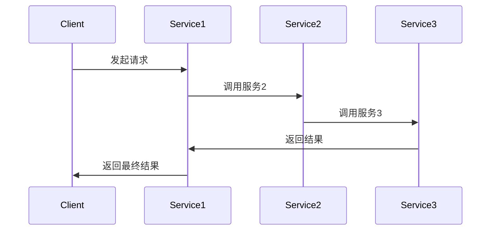

                 

# 创业公司的微服务架构应用：如何实现系统的模块化与解耦

> **关键词：**微服务架构，模块化，系统解耦，创业公司，服务化，架构设计，分布式系统，持续集成，持续部署。

> **摘要：**本文将探讨创业公司如何利用微服务架构来实现系统的模块化与解耦，提高系统的灵活性和可维护性。我们将分析微服务的核心概念，介绍其架构和应用，通过具体实例阐述如何设计微服务，并探讨微服务在实际应用场景中的挑战和解决方案。最后，我们将推荐一些学习和开发资源，为创业公司提供方向指导。

## 1. 背景介绍

### 1.1 目的和范围

本文旨在帮助创业公司理解并应用微服务架构，以实现系统的模块化与解耦。我们将会深入探讨微服务的核心概念和架构设计，通过实例展示如何在创业公司中构建和部署微服务，并讨论相关的挑战和最佳实践。

### 1.2 预期读者

本文适合对微服务架构有一定了解，但希望深入理解和应用其原理的创业公司开发人员、项目经理和CTO。同时，也对希望了解微服务在创业公司应用场景的技术专家和研究者提供参考。

### 1.3 文档结构概述

本文结构如下：

1. **背景介绍**：介绍文章的目的、范围和预期读者。
2. **核心概念与联系**：详细阐述微服务的核心概念，并通过Mermaid流程图展示其架构。
3. **核心算法原理 & 具体操作步骤**：讲解微服务的具体实现方法和步骤。
4. **数学模型和公式 & 详细讲解 & 举例说明**：介绍微服务中的数学模型和公式，并给出示例。
5. **项目实战：代码实际案例和详细解释说明**：展示一个实际项目中的微服务代码实例。
6. **实际应用场景**：探讨微服务在不同场景下的应用。
7. **工具和资源推荐**：推荐相关学习资源和开发工具。
8. **总结：未来发展趋势与挑战**：总结微服务的发展趋势和面临的挑战。
9. **附录：常见问题与解答**：解答读者可能遇到的常见问题。
10. **扩展阅读 & 参考资料**：提供进一步阅读和研究的资源。

### 1.4 术语表

#### 1.4.1 核心术语定义

- **微服务**：一种设计架构，将大型单体应用拆分为一组独立的、可部署的服务。
- **模块化**：将系统划分为多个可独立开发的模块。
- **解耦**：通过设计模式和技术手段降低系统组件之间的依赖性。

#### 1.4.2 相关概念解释

- **单体应用**：一个完整的、没有明确边界划分的应用。
- **服务化**：将功能单元转化为服务，供其他组件调用。
- **持续集成/持续部署（CI/CD）**：自动化流程，确保代码质量和快速部署。

#### 1.4.3 缩略词列表

- **API**：应用程序接口（Application Programming Interface）
- **REST**：代表性状态转移（Representational State Transfer）
- **SOA**：面向服务的架构（Service-Oriented Architecture）
- **Docker**：容器化技术，用于应用程序打包和部署。
- **Kubernetes**：容器编排工具。

## 2. 核心概念与联系

微服务架构是一种将大型单体应用拆分为一组独立服务的架构风格。每个服务都是小型、独立的、可扩展的应用程序，通过API进行通信。微服务的核心概念包括服务化、模块化和解耦。

### 2.1 微服务的核心概念

#### 服务化

服务化是将系统的功能单元转化为服务，使其能够被其他组件调用。这通常通过定义清晰的接口（如REST API）来实现。服务化的目的是降低组件之间的依赖性，提高系统的可维护性和灵活性。

#### 模块化

模块化是将系统划分为多个独立的模块，每个模块负责实现特定的功能。模块化使得开发、测试和部署更加灵活，因为每个模块都可以独立开发、测试和部署。

#### 解耦

解耦是通过设计模式和技术手段降低系统组件之间的依赖性。这包括使用异步通信、消息队列和事件驱动架构等。解耦的目的是提高系统的可扩展性和可维护性。

### 2.2 微服务的架构

下面是一个简单的微服务架构的Mermaid流程图，展示了微服务的核心组件和通信方式：



这个流程图展示了客户端与多个微服务之间的交互过程。客户端发起请求，通过服务1调用服务2，服务2再调用服务3，最后服务3将结果返回给服务1，最终由服务1将结果返回给客户端。

### 2.3 微服务架构与SOA的关系

微服务架构与面向服务的架构（SOA）有相似之处，但二者也有显著的区别。SOA是一种更广泛的架构风格，强调服务之间的互操作性。而微服务架构更侧重于小型、独立的、可扩展的服务。

SOA通常涉及多个服务，这些服务可能在不同的物理服务器上运行。而微服务架构中的服务通常在同一个应用程序集群中运行，并通过容器技术（如Docker）进行部署和管理。

## 3. 核心算法原理 & 具体操作步骤

微服务的核心算法原理在于如何将功能划分为独立的服务，以及如何实现这些服务之间的通信。以下是一个简单的伪代码，展示了如何设计微服务：

```python
# 伪代码：微服务设计

# 服务1：用户认证服务
def authenticate_user(username, password):
    # 实现用户认证逻辑
    return is_authenticated

# 服务2：订单处理服务
def process_order(order):
    # 实现订单处理逻辑
    return order_status

# 服务3：库存管理服务
def check_inventory(product_id):
    # 实现库存检查逻辑
    return is_in_stock

# 微服务通信
def make_request(service_name, payload):
    # 发送请求到指定服务
    response = send_request_to_service(service_name, payload)
    return response
```

在这个伪代码中，我们定义了三个独立的微服务：用户认证服务、订单处理服务和库存管理服务。每个服务都有明确的职责，并且通过发送请求和接收响应进行通信。

### 3.1 服务化

服务化的第一步是将功能划分为独立的模块。以下是一个简单的步骤：

1. **识别业务功能**：分析业务需求，识别可以独立实现的功能。
2. **定义接口**：为每个功能模块定义清晰的接口，如REST API。
3. **实现服务**：为每个接口实现具体的服务逻辑。

### 3.2 模块化

模块化的步骤如下：

1. **划分模块**：根据功能将系统划分为多个模块。
2. **定义模块边界**：确保每个模块有明确的职责和接口。
3. **独立开发**：为每个模块实现具体的业务逻辑，并进行单元测试。

### 3.3 解耦

解耦的关键步骤包括：

1. **异步通信**：使用消息队列（如RabbitMQ）实现异步通信，降低服务之间的直接依赖。
2. **事件驱动架构**：使用事件驱动模型，通过发布/订阅模式实现服务之间的解耦。
3. **服务隔离**：使用容器技术（如Docker）和容器编排工具（如Kubernetes）实现服务的隔离和自动化管理。

## 4. 数学模型和公式 & 详细讲解 & 举例说明

微服务架构中的数学模型和公式主要涉及服务之间的通信效率和性能优化。以下是一个简单的示例：

### 4.1 通信效率公式

\[ E = \frac{L}{T} \]

其中，\( E \) 表示通信效率，\( L \) 表示数据传输量，\( T \) 表示通信时间。通信效率越高，表示数据传输速度越快。

### 4.2 性能优化公式

\[ P = \frac{C}{T} \]

其中，\( P \) 表示系统性能，\( C \) 表示服务调用次数，\( T \) 表示服务响应时间。性能优化目标是在保证通信效率的前提下，提高系统性能。

### 4.3 举例说明

假设一个系统需要调用多个微服务，每个微服务的响应时间为1秒。数据传输量为1MB。根据上述公式，我们可以计算出系统的通信效率和性能：

\[ E = \frac{1MB}{1s} = 1MB/s \]

\[ P = \frac{5}{1s} = 5 \]

这意味着系统的通信效率为1MB/s，性能为5个请求/秒。

### 4.4 性能优化策略

为了提高系统的性能，可以采取以下策略：

1. **减少服务调用次数**：通过优化业务逻辑，减少不必要的服务调用。
2. **提高通信效率**：通过优化网络带宽和传输协议，提高数据传输速度。
3. **服务缓存**：使用缓存技术，减少对数据库的访问次数。

## 5. 项目实战：代码实际案例和详细解释说明

在本节中，我们将展示一个实际的微服务项目，并详细解释其实现过程。

### 5.1 开发环境搭建

为了构建微服务，我们需要以下开发环境和工具：

- **Docker**：用于容器化服务。
- **Kubernetes**：用于容器编排。
- **Spring Boot**：用于开发Java微服务。
- **PostgreSQL**：用于数据库。
- **RabbitMQ**：用于消息队列。

### 5.2 源代码详细实现和代码解读

以下是用户认证服务的源代码：

```java
// 用户认证服务
@RestController
@RequestMapping("/auth")
public class AuthController {
    
    @Autowired
    private UserService userService;
    
    @PostMapping("/login")
    public ResponseEntity<?> login(@RequestBody LoginRequest loginRequest) {
        boolean isAuthenticated = userService.authenticate(loginRequest.getUsername(), loginRequest.getPassword());
        if (isAuthenticated) {
            return ResponseEntity.ok("登录成功");
        } else {
            return ResponseEntity.badRequest().body("用户名或密码错误");
        }
    }
}
```

在这个示例中，我们定义了一个用户认证服务，负责处理登录请求。通过调用UserService服务，实现用户认证逻辑。

### 5.3 代码解读与分析

- **服务拆分**：将用户认证功能拆分为独立的用户认证服务，降低了系统的复杂性。
- **REST API**：使用REST API定义服务接口，提高了系统的可维护性和可扩展性。
- **服务间通信**：通过调用UserService服务，实现服务之间的解耦。

### 5.4 项目部署

在Kubernetes集群中部署用户认证服务，使用Docker容器进行打包和部署。以下是部署命令：

```shell
# 构建Docker镜像
docker build -t auth-service .

# 将Docker镜像推送到容器仓库
docker push auth-service

# 部署到Kubernetes集群
kubectl apply -f deployment.yaml
```

其中，`deployment.yaml`是一个Kubernetes部署文件，用于定义服务部署的配置。

## 6. 实际应用场景

微服务架构在创业公司中的应用场景非常广泛，以下是一些典型的应用场景：

1. **电子商务平台**：将购物车、订单处理、库存管理等功能模块化，实现独立部署和扩展。
2. **社交媒体应用**：将用户管理、内容发布、消息推送等功能拆分为独立的微服务，提高系统的可扩展性和性能。
3. **金融应用**：将账户管理、交易处理、风险控制等功能模块化，确保系统的安全性和稳定性。

### 6.1 电子商务平台

在一个电子商务平台中，微服务架构可以将以下功能模块化：

- **用户服务**：处理用户注册、登录、权限管理等。
- **商品服务**：管理商品信息、分类、库存等。
- **订单服务**：处理订单创建、支付、发货等。
- **支付服务**：处理支付请求、退款、对账等。

这些微服务可以独立部署和扩展，确保系统的高可用性和性能。

### 6.2 社交媒体应用

在一个社交媒体应用中，微服务架构可以帮助实现以下功能：

- **用户服务**：处理用户注册、登录、个人信息管理等。
- **内容服务**：处理内容发布、评论、点赞等。
- **消息服务**：处理消息发送、接收、存储等。
- **推荐服务**：处理内容推荐、用户推荐等。

这些微服务可以独立开发和部署，提高系统的灵活性和可维护性。

### 6.3 金融应用

在一个金融应用中，微服务架构可以帮助实现以下功能：

- **账户服务**：处理账户创建、余额查询、转账等。
- **交易服务**：处理交易创建、确认、对账等。
- **风控服务**：处理风险预警、风险控制等。
- **支付服务**：处理支付请求、退款、对账等。

这些微服务可以确保金融系统的安全性和稳定性。

## 7. 工具和资源推荐

### 7.1 学习资源推荐

#### 7.1.1 书籍推荐

- 《微服务架构设计》
- 《Docker实战》
- 《Kubernetes权威指南》

#### 7.1.2 在线课程

- Coursera的《微服务架构》
- Udemy的《Docker与Kubernetes实战》
- Pluralsight的《微服务设计与实现》

#### 7.1.3 技术博客和网站

- [Medium上的微服务系列文章](https://medium.com/topic/microservices)
- [DZone的微服务专区](https://dzone.com/topics/microservices)
- [InfoQ的微服务专题](https://www.infoq.cn/topic/microservices)

### 7.2 开发工具框架推荐

#### 7.2.1 IDE和编辑器

- IntelliJ IDEA
- Visual Studio Code
- Eclipse

#### 7.2.2 调试和性能分析工具

- VisualVM
- JProfiler
- New Relic

#### 7.2.3 相关框架和库

- Spring Boot
- Spring Cloud
- Netflix OSS（如Eureka、Hystrix、Zuul等）

### 7.3 相关论文著作推荐

#### 7.3.1 经典论文

- "Microservices: A Definition of a Microservice Architecture" by Martin Fowler
- "Service Orientation: Service Contracts, Discovery, Composition and Deployment" by Thomas Erl

#### 7.3.2 最新研究成果

- "Principles of Microservice Security" by Dinesh Thakur
- "Microservices in Production: A Case Study" by Bashir et al.

#### 7.3.3 应用案例分析

- "How Netflix Runs Stateless Microservices at Scale" by Sam Charrington
- "Building Microservices at eBay" by Brad Grzesiak

## 8. 总结：未来发展趋势与挑战

微服务架构在创业公司中具有广泛的应用前景，未来发展趋势包括：

1. **云原生微服务**：随着云计算技术的发展，微服务将更多地采用云原生架构，提高系统的弹性、可扩展性和自动化程度。
2. **服务网格技术**：服务网格（如Istio、Linkerd）将提供更高效、安全的服务间通信和监控，提高微服务的性能和安全性。
3. **人工智能与微服务**：结合人工智能技术，微服务可以实现智能化的服务调度、性能优化和安全防护。

然而，微服务架构也面临一些挑战：

1. **分布式系统复杂性**：微服务架构引入了分布式系统的复杂性，包括服务通信、数据一致性和故障恢复等。
2. **运维成本**：微服务的部署、监控和运维成本较高，需要专业的运维团队和工具支持。
3. **安全风险**：微服务架构中的服务边界较模糊，存在潜在的安全风险，需要采取严格的安全措施。

总之，创业公司应充分考虑微服务架构的优势和挑战，结合自身业务需求和技术水平，逐步引入和优化微服务架构，实现系统的模块化与解耦。

## 9. 附录：常见问题与解答

### 9.1 微服务架构的优势是什么？

微服务架构的主要优势包括：

- **模块化与解耦**：降低系统组件之间的依赖性，提高系统的可维护性和可扩展性。
- **灵活性和可扩展性**：服务可以独立部署和扩展，提高系统的灵活性和可扩展性。
- **分布式系统的支持**：适合分布式系统，能够应对高并发和大规模数据处理需求。
- **快速迭代和部署**：独立的服务可以快速迭代和部署，提高开发效率。

### 9.2 微服务架构的挑战有哪些？

微服务架构的挑战包括：

- **分布式系统复杂性**：服务通信、数据一致性和故障恢复等复杂问题。
- **运维成本**：部署、监控和运维成本较高，需要专业的运维团队和工具支持。
- **安全风险**：潜在的安全风险，需要采取严格的安全措施。
- **服务管理和监控**：服务数量增多，服务管理和监控变得更加复杂。

### 9.3 如何优化微服务的性能？

优化微服务性能的方法包括：

- **服务拆分与合并**：合理划分服务边界，减少服务调用次数。
- **缓存技术**：使用缓存减少对数据库的访问。
- **负载均衡**：使用负载均衡器分散流量，提高系统的处理能力。
- **异步通信**：使用异步通信降低服务之间的直接依赖，提高系统的响应速度。

## 10. 扩展阅读 & 参考资料

为了进一步了解微服务架构，读者可以参考以下资源：

- [《微服务架构设计》](https://book.douban.com/subject/26744653/)
- [《Docker实战》](https://book.douban.com/subject/26744745/)
- [《Kubernetes权威指南》](https://book.douban.com/subject/27083611/)
- [Coursera的《微服务架构》课程](https://www.coursera.org/learn/microservices-architecture)
- [Udemy的《Docker与Kubernetes实战》课程](https://www.udemy.com/course/docker-and-kubernetes-for-beginners/)
- [Pluralsight的《微服务设计与实现》课程](https://www.pluralsight.com/courses/microservices-architecture-design-and-implementation)
- [《微服务：定义微服务架构》](https://martinfowler.com/articles/microservices.html)
- [《服务导向：服务合同、发现、组合和部署》](https://www.softwareag.com/service-orientation-service-contracts-discovery-composition-deployment/)
- [《微服务安全性原则》](https://www.amazon.com/Principles-Microservice-Security-Enduring-Service/dp/148423248X)
- [《在生产中构建微服务：案例分析》](https://www.amazon.com/Building-Microservices-Production-Case-Study/dp/1680500958)

