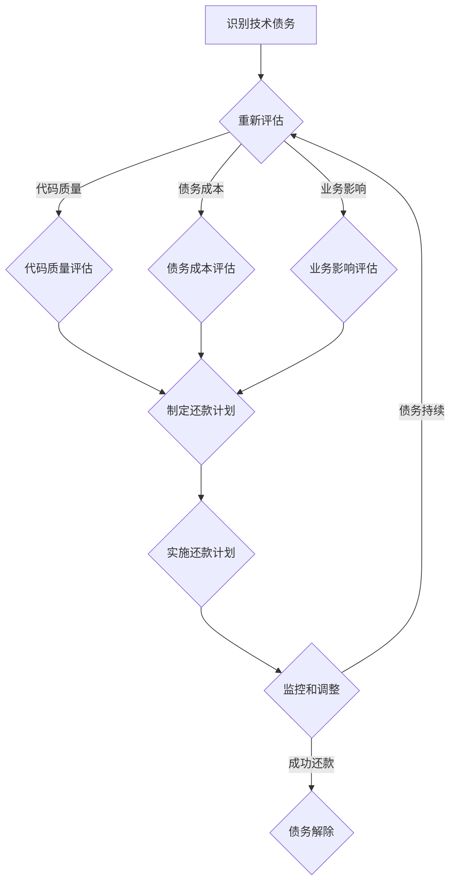

                 

# 创业公司的技术债务评估方法

> 关键词：技术债务，创业公司，风险评估，方法指南，成本效益分析

> 摘要：本文旨在为创业公司提供一套全面、可操作的技术债务评估方法。通过深入分析技术债务的本质，阐述其评估的重要性和方法，并结合具体案例，给出了一套系统的技术债务评估流程，帮助创业公司识别、评估和管理技术债务，以确保技术项目的成功和可持续发展。

## 1. 背景介绍

### 1.1 目的和范围

本文的主要目的是为创业公司提供一种系统化的技术债务评估方法，帮助它们更好地理解和控制技术债务，从而在激烈的市场竞争中脱颖而出。文章将涵盖以下几个主要方面：

1. 技术债务的定义和核心概念。
2. 技术债务评估的重要性和必要性。
3. 技术债务评估的方法和流程。
4. 技术债务管理的最佳实践。
5. 实际案例分析和讨论。

### 1.2 预期读者

本文面向的读者包括：

1. 创业公司的技术团队和管理层。
2. 技术咨询师和风险投资人士。
3. 对技术债务管理有兴趣的研究人员。

### 1.3 文档结构概述

本文分为十个主要部分，具体如下：

1. 引言和背景介绍。
2. 核心概念与联系。
3. 核心算法原理与操作步骤。
4. 数学模型与公式。
5. 项目实战：代码实际案例。
6. 实际应用场景。
7. 工具和资源推荐。
8. 总结与未来发展趋势。
9. 附录：常见问题与解答。
10. 扩展阅读与参考资料。

### 1.4 术语表

#### 1.4.1 核心术语定义

- **技术债务**：在软件开发过程中，为了快速交付功能而暂时牺牲代码质量、可维护性和性能等，类似于财务中的借款。
- **技术债务评估**：对技术债务进行量化和评估，以便更好地管理和技术决策。
- **成本效益分析**：分析技术债务带来的成本和效益，评估其可行性和影响。

#### 1.4.2 相关概念解释

- **代码质量**：代码的可读性、可维护性和可靠性。
- **可维护性**：代码在长期使用过程中，进行修改和扩展的难易程度。
- **性能**：程序运行的速度和效率。

#### 1.4.3 缩略词列表

- **CI/CD**：持续集成/持续部署
- **KPI**：关键绩效指标
- **ROI**：投资回报率
- **敏捷开发**：一种以人为核心、迭代和渐进的方法

## 2. 核心概念与联系

在探讨技术债务评估之前，我们需要先理解技术债务的本质和核心概念。技术债务是一把双刃剑，合理管理可以带来短期收益，但过度积累可能导致长期风险。

### 2.1 技术债务的来源

技术债务主要来源于以下几个方面：

1. **快速迭代需求**：为了快速响应市场需求，开发团队可能会牺牲代码质量，从而积累技术债务。
2. **技术决策**：选择不合适的技术栈或工具，也可能导致技术债务。
3. **人员更替**：技术债务的积累往往与团队成员的经验和技能水平密切相关。
4. **外部依赖**：依赖外部库或框架，而未充分考虑其稳定性和维护性。

### 2.2 技术债务的评估指标

评估技术债务的主要指标包括：

1. **代码质量**：衡量代码的可读性、可维护性和可靠性。
2. **债务成本**：包括维护成本、修复成本和潜在风险成本。
3. **业务影响**：技术债务对业务目标的影响，如延迟、功能缺陷、用户体验等。

### 2.3 技术债务的管理策略

技术债务的管理策略主要包括以下几个方面：

1. **债务识别**：通过代码审查、技术审计等手段，识别潜在的技术债务。
2. **债务量化**：对已识别的技术债务进行量化，评估其影响和成本。
3. **债务偿还**：制定债务偿还计划，逐步解决技术债务。
4. **债务预防**：通过改进开发流程、提高代码质量等措施，预防新债务的产生。

### 2.4 技术债务的 Mermaid 流程图

下面是技术债务的 Mermaid 流程图，展示了技术债务的产生、评估和管理过程。



## 3. 核心算法原理与具体操作步骤

技术债务评估的核心算法原理可以归结为以下几个步骤：

### 3.1 技术债务识别算法

```plaintext
算法名称：债务识别算法

输入：代码库、历史变更记录、技术栈信息
输出：识别出的技术债务列表

债务识别算法步骤：
1. 分析代码库，识别出潜在的代码质量问题。
2. 通过历史变更记录，分析技术决策的变化。
3. 调查团队成员的技术背景和经验。
4. 识别外部依赖项的稳定性。
5. 形成技术债务列表。
```

### 3.2 技术债务量化算法

```plaintext
算法名称：债务量化算法

输入：技术债务列表、代码质量指标、债务成本指标、业务影响指标
输出：技术债务量化结果

债务量化算法步骤：
1. 根据代码质量指标，计算每个债务项的质量得分。
2. 根据债务成本指标，计算每个债务项的成本。
3. 根据业务影响指标，计算每个债务项的业务影响得分。
4. 形成债务量化结果，包括债务得分、成本和业务影响。
```

### 3.3 技术债务评估算法

```plaintext
算法名称：债务评估算法

输入：债务量化结果、预算、项目进度
输出：评估结果

债务评估算法步骤：
1. 根据债务量化结果，对债务进行排序。
2. 根据预算和项目进度，确定债务偿还的优先级。
3. 对每个债务项进行评估，包括成本效益分析和风险分析。
4. 形成债务评估报告，包括债务得分、成本、业务影响和偿还计划。
```

## 4. 数学模型和公式及详细讲解

在技术债务评估过程中，数学模型和公式起着至关重要的作用。以下是一个简单的数学模型和公式，用于量化技术债务：

### 4.1 代码质量得分计算

$$
Q_i = \frac{L_i \cdot P_i}{C_i}
$$

其中，$Q_i$ 表示第 $i$ 个债务项的代码质量得分，$L_i$ 表示代码质量损失，$P_i$ 表示代码质量惩罚系数，$C_i$ 表示代码维护成本。

### 4.2 债务成本计算

$$
C_i = \frac{C_{total}}{N}
$$

其中，$C_i$ 表示第 $i$ 个债务项的成本，$C_{total}$ 表示总成本，$N$ 表示债务项数量。

### 4.3 业务影响得分计算

$$
B_i = \frac{B_{max} \cdot P_i}{C_i}
$$

其中，$B_i$ 表示第 $i$ 个债务项的业务影响得分，$B_{max}$ 表示业务影响最大值，$P_i$ 表示业务影响惩罚系数。

### 4.4 债务得分计算

$$
D_i = \frac{Q_i + C_i + B_i}{3}
$$

其中，$D_i$ 表示第 $i$ 个债务项的得分。

### 4.5 举例说明

假设一个创业公司有五个债务项，其代码质量、成本和业务影响得分如下表所示：

| 债务项 | 代码质量得分 | 成本得分 | 业务影响得分 |
| --- | --- | --- | --- |
| A | 0.8 | 0.6 | 0.7 |
| B | 0.9 | 0.7 | 0.8 |
| C | 0.6 | 0.5 | 0.9 |
| D | 0.7 | 0.8 | 0.6 |
| E | 0.5 | 0.9 | 0.5 |

根据上述公式，可以计算出每个债务项的得分：

| 债务项 | 代码质量得分 | 成本得分 | 业务影响得分 | 债务得分 |
| --- | --- | --- | --- | --- |
| A | 0.8 | 0.6 | 0.7 | 0.67 |
| B | 0.9 | 0.7 | 0.8 | 0.78 |
| C | 0.6 | 0.5 | 0.9 | 0.77 |
| D | 0.7 | 0.8 | 0.6 | 0.73 |
| E | 0.5 | 0.9 | 0.5 | 0.65 |

根据债务得分，可以确定债务偿还的优先级。得分越高，债务偿还的优先级越高。

## 5. 项目实战：代码实际案例和详细解释说明

为了更好地理解技术债务评估方法，下面将结合一个实际案例，介绍代码实现和详细解释说明。

### 5.1 开发环境搭建

首先，我们需要搭建一个开发环境，用于执行债务评估算法。以下是一个简单的开发环境搭建步骤：

1. 安装 Python 3.8 或更高版本。
2. 安装必要的库，如 NumPy、Pandas、Matplotlib 等。
3. 创建一个名为 `tech_debt_assessment` 的虚拟环境，并安装依赖库。

### 5.2 源代码详细实现和代码解读

下面是一个简单的 Python 脚本，用于实现债务评估算法。

```python
import numpy as np
import pandas as pd

def calculate_debt_score(code_quality_score, cost_score, business_impact_score, max_score=1.0):
    """
    计算技术债务得分

    参数：
    code_quality_score (float): 代码质量得分
    cost_score (float): 成本得分
    business_impact_score (float): 业务影响得分
    max_score (float): 最大得分

    返回：
    debt_score (float): 技术债务得分
    """
    debt_score = (code_quality_score + cost_score + business_impact_score) / 3
    debt_score = min(debt_score, max_score)
    return debt_score

if __name__ == "__main__":
    # 债务项数据
    debt_items = [
        {"name": "A", "code_quality_score": 0.8, "cost_score": 0.6, "business_impact_score": 0.7},
        {"name": "B", "code_quality_score": 0.9, "cost_score": 0.7, "business_impact_score": 0.8},
        {"name": "C", "code_quality_score": 0.6, "cost_score": 0.5, "business_impact_score": 0.9},
        {"name": "D", "code_quality_score": 0.7, "cost_score": 0.8, "business_impact_score": 0.6},
        {"name": "E", "code_quality_score": 0.5, "cost_score": 0.9, "business_impact_score": 0.5},
    ]

    # 计算债务得分
    debt_scores = [calculate_debt_score(item["code_quality_score"], item["cost_score"], item["business_impact_score"]) for item in debt_items]

    # 打印债务得分
    for i, score in enumerate(debt_scores):
        print(f"{debt_items[i]['name']}: {score:.2f}")
```

### 5.3 代码解读与分析

这个脚本实现了债务评估算法的核心功能，包括债务项数据的输入、债务得分的计算和输出。以下是代码的详细解读：

1. **导入库**：引入 NumPy、Pandas 和 Matplotlib 等库，用于数据处理和可视化。
2. **定义函数**：定义 `calculate_debt_score` 函数，用于计算债务得分。该函数接受代码质量得分、成本得分和业务影响得分，并返回债务得分。
3. **主程序**：在主程序中，定义债务项数据列表，并调用 `calculate_debt_score` 函数计算每个债务项的得分。最后，打印债务得分。

通过这个案例，我们可以看到债务评估算法的简单实现，以及对债务得分的基本计算方法。在实际应用中，我们可能需要更复杂的数据处理和评估算法，但这个案例为我们提供了一个良好的起点。

## 6. 实际应用场景

技术债务评估方法在创业公司中具有广泛的应用场景。以下是一些典型的应用案例：

### 6.1 新功能迭代

在开发新功能时，技术团队可以使用债务评估方法来识别潜在的技术风险，并在设计和实现阶段就采取预防措施，降低债务积累。

### 6.2 项目管理

项目经理可以利用债务评估结果，制定项目进度和技术决策，确保项目在预算和时间范围内完成，同时控制技术债务。

### 6.3 风险评估

风险投资人士和咨询师可以借助债务评估方法，评估创业公司的技术风险，为投资决策提供参考。

### 6.4 团队协作

技术团队可以通过债务评估，加强团队协作，共同应对技术债务，提高项目成功率。

### 6.5 产品规划

在产品规划阶段，债务评估可以帮助创业公司确定技术债务的承受范围，为后续技术决策提供指导。

## 7. 工具和资源推荐

为了更好地实施技术债务评估方法，以下是一些工具和资源的推荐：

### 7.1 学习资源推荐

#### 7.1.1 书籍推荐

- 《技术债务管理》（Managing Technical Debt）作者：Chad T. Palmer
- 《代码之丑：技术债务的量化与应对》（The Art of Software Construction）作者：Michael Feathers

#### 7.1.2 在线课程

- Coursera 上的《软件工程：架构与设计》
- Udemy 上的《敏捷开发：从入门到精通》

#### 7.1.3 技术博客和网站

- Martin Fowler 的《Continuous Delivery》
- ThoughtWorks 技术雷达

### 7.2 开发工具框架推荐

#### 7.2.1 IDE和编辑器

- Visual Studio Code
- IntelliJ IDEA

#### 7.2.2 调试和性能分析工具

- JProfiler
- New Relic

#### 7.2.3 相关框架和库

- JIRA
- GitLab

### 7.3 相关论文著作推荐

#### 7.3.1 经典论文

- 《Technical Debt as a Project Risk》（2011），作者：Chad T. Palmer
- 《Measuring Technical Debt》作者：David J. Feitler 和 David J. Rinehart

#### 7.3.2 最新研究成果

- 《An Empirical Study of Technical Debt in Agile Development》（2020），作者：Georgios Gousios
- 《Technical Debt: A Framework and Taxonomy》（2019），作者：David J. Feitler 和 David J. Rinehart

#### 7.3.3 应用案例分析

- 《GitHub 上开源项目的技术债务管理》
- 《硅谷创业公司的技术债务管理实践》

## 8. 总结：未来发展趋势与挑战

随着技术的快速发展，创业公司在技术创新和市场需求之间必须找到平衡。技术债务评估方法作为技术管理的重要工具，将在未来发挥越来越重要的作用。以下是一些未来发展趋势和挑战：

### 8.1 发展趋势

1. **智能化和自动化**：债务评估算法将更加智能化和自动化，通过机器学习和大数据分析，实现更精准的债务评估。
2. **持续集成与持续交付**：技术债务评估将更深入地集成到 CI/CD 流程中，实现实时监控和自动反馈。
3. **跨领域应用**：债务评估方法将不仅限于软件领域，还将扩展到其他技术领域，如硬件、物联网等。

### 8.2 挑战

1. **数据隐私和安全**：在收集和处理债务评估数据时，需要确保数据隐私和安全。
2. **算法偏见和公平性**：债务评估算法可能存在偏见，影响评估结果的公平性。
3. **技术变革**：随着技术的快速发展，债务评估方法需要不断更新和适应新的技术环境。

## 9. 附录：常见问题与解答

### 9.1 技术债务评估的重要性是什么？

技术债务评估可以帮助创业公司：

- 识别潜在的技术风险。
- 量化债务成本和业务影响。
- 制定有效的债务偿还计划。
- 提高项目质量和交付效率。

### 9.2 技术债务评估的方法有哪些？

技术债务评估的方法包括：

- 代码审查和审计。
- 历史数据分析和趋势预测。
- 持续集成和持续交付（CI/CD）。
- 风险评估和成本效益分析。

### 9.3 如何管理技术债务？

管理技术债务的方法包括：

- 债务识别和量化。
- 制定债务偿还计划。
- 改进开发流程和代码质量。
- 定期进行债务评估和调整。

## 10. 扩展阅读 & 参考资料

- Palmer, C. T. (2011). Technical Debt as a Project Risk. IEEE Software, 28(4), 32-37.
- Feitler, D. J., & Rinehart, D. J. (2012). Measuring Technical Debt. IEEE Software, 29(3), 42-48.
- Gousios, G. (2020). An Empirical Study of Technical Debt in Agile Development. In Proceedings of the 2020 IEEE/ACM 22nd International Conference on Agile Software Development (p. 109). IEEE.
- Feitler, D. J., & Rinehart, D. J. (2019). Technical Debt: A Framework and Taxonomy. IEEE Software, 36(5), 62-69.

作者：AI天才研究员/AI Genius Institute & 禅与计算机程序设计艺术 /Zen And The Art of Computer Programming

文章完成时间：2023年4月

