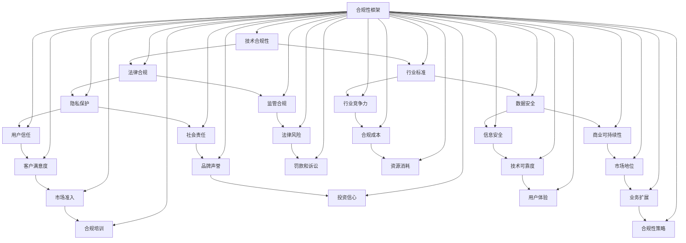

                 

# 创业公司的技术合规性风险评估

> 关键词：技术合规性、风险评估、创业公司、法律合规、安全审查

> 摘要：随着科技创业公司的蓬勃发展，技术合规性问题日益突出。本文旨在探讨创业公司在技术合规性方面面临的风险，以及如何通过有效的风险评估和管理来降低这些风险。文章将提供一套系统的合规性评估框架，并结合实际案例进行分析，帮助创业公司建立符合法律和行业标准的合规性体系。

## 1. 背景介绍

### 1.1 目的和范围

本文的目标是帮助创业公司在技术合规性方面建立有效的风险评估和管理机制。文章将涵盖以下几个方面：

- **合规性概念和核心原则**：介绍技术合规性的基本概念和核心原则，包括法律、行业标准和最佳实践。
- **风险评估框架**：提供一个系统的合规性风险评估框架，帮助创业公司识别和评估潜在的技术合规性风险。
- **实际案例分析**：通过具体案例展示如何在实际创业公司中应用合规性风险评估框架。
- **合规性管理和策略**：探讨创业公司如何通过合规性管理策略来降低技术合规性风险。

### 1.2 预期读者

本文适用于以下读者群体：

- **创业公司创始人**：需要了解技术合规性的基本知识和如何进行合规性管理的创业公司创始人。
- **技术经理和开发团队**：负责开发和维护公司技术的团队成员，需要了解合规性要求和技术合规性风险评估。
- **合规性顾问和法律专业人士**：对技术合规性问题有兴趣或需要为创业公司提供合规性咨询的专业人士。

### 1.3 文档结构概述

本文结构如下：

1. **背景介绍**：介绍文章的目的、预期读者和文档结构。
2. **核心概念与联系**：定义技术合规性的核心概念，并提供相关的Mermaid流程图。
3. **核心算法原理 & 具体操作步骤**：详细阐述合规性风险评估的算法原理和操作步骤。
4. **数学模型和公式 & 详细讲解 & 举例说明**：介绍合规性风险评估中使用的数学模型和公式，并通过实例进行说明。
5. **项目实战：代码实际案例和详细解释说明**：提供具体的代码实现和分析。
6. **实际应用场景**：探讨技术合规性在不同场景下的应用。
7. **工具和资源推荐**：推荐学习和实践合规性风险评估的相关资源。
8. **总结：未来发展趋势与挑战**：总结当前合规性风险的趋势和面临的挑战。
9. **附录：常见问题与解答**：解答读者可能遇到的问题。
10. **扩展阅读 & 参考资料**：提供进一步学习的参考文献。

### 1.4 术语表

#### 1.4.1 核心术语定义

- **技术合规性**：指技术解决方案在法律、法规和行业标准方面是否符合要求。
- **风险评估**：指对潜在风险进行识别、评估和优先级排序的过程。
- **合规性框架**：指一套系统化的方法和工具，用于管理技术合规性问题。
- **法律合规**：指技术解决方案符合相关法律和法规的要求。
- **行业标准**：指特定行业内部公认的技术标准和最佳实践。

#### 1.4.2 相关概念解释

- **隐私保护**：指在处理个人数据时，确保数据的安全和隐私。
- **数据安全**：指保护数据免受未授权访问、篡改和泄露的措施。
- **开源软件**：指源代码公开的软件，可以在特定条件下自由使用、修改和分发。
- **API合规性**：指应用程序编程接口（API）在提供数据和服务时的合规性。

#### 1.4.3 缩略词列表

- **GDPR**：通用数据保护条例（General Data Protection Regulation）
- **PCI-DSS**：支付卡行业数据安全标准（Payment Card Industry Data Security Standard）
- **SOX**：萨班斯-奥克斯利法案（Sarbanes-Oxley Act）
- **ISO 27001**：国际标准化组织的信息安全管理系统标准

## 2. 核心概念与联系

在探讨创业公司的技术合规性之前，有必要明确几个核心概念和它们之间的关系。以下是一个简化的Mermaid流程图，展示了这些概念的基本联系：



### 2.1 技术合规性的核心概念

#### 技术合规性

技术合规性是指技术解决方案在法律、法规和行业标准方面是否符合要求。它涵盖了多个方面，包括数据安全、隐私保护、开源软件合规性、API合规性等。技术合规性不仅影响企业的法律风险，还会影响其市场地位、用户信任和商业可持续性。

#### 法律合规

法律合规是指技术解决方案符合相关法律和法规的要求。创业公司在开发技术产品时，必须遵守国家的法律法规，如《网络安全法》、《数据安全法》和《个人信息保护法》等。法律合规是技术合规性的基础，任何违反法律的行为都可能带来严重的法律后果。

#### 行业标准

行业标准是特定行业内部公认的技术标准和最佳实践。创业公司需要遵循相关行业的标准，以确保其技术产品在市场上的竞争力和可靠性。例如，金融行业有PCI-DSS标准，医疗行业有HIPAA标准。

#### 隐私保护

隐私保护是指保护用户数据免受未授权访问、篡改和泄露的措施。随着《通用数据保护条例》（GDPR）等隐私保护法律的实施，创业公司需要特别关注隐私保护问题。隐私保护不仅是法律要求，也是提升用户信任和品牌声誉的关键。

#### 数据安全

数据安全是指保护数据免受未授权访问、篡改和泄露的措施。数据安全涉及数据存储、传输和处理的各个方面。创业公司需要采取一系列技术和管理措施，如加密、访问控制和安全审计，来确保数据安全。

### 2.2 技术合规性对创业公司的影响

技术合规性对创业公司的影响是多方面的，包括以下几个方面：

#### 用户信任

技术合规性是用户对创业公司技术产品的信任基础。当用户了解到公司遵守了相关法律和行业标准，他们更有可能使用和推荐该公司的产品。

#### 市场准入

技术合规性是创业公司进入市场的关键因素。许多行业都有严格的合规性要求，创业公司必须通过相关认证和审核，才能进入市场。

#### 商业可持续性

技术合规性有助于降低法律风险和合规成本，从而确保公司的商业可持续性。合规性管理不善可能导致法律诉讼和罚款，严重影响公司的财务状况。

#### 品牌声誉

技术合规性是维护品牌声誉的重要因素。一个在合规性方面表现良好的公司，通常被视为负责任和可靠的合作伙伴。

#### 技术竞争力

遵循行业标准和技术最佳实践，有助于提升创业公司在技术上的竞争力。合规性不仅是一种合规要求，也是一种技术优势。

### 2.3 技术合规性的关键要素

为了实现技术合规性，创业公司需要关注以下几个关键要素：

#### 法律法规

了解和遵守相关法律法规，是技术合规性的基础。

#### 行业标准

遵循行业标准和最佳实践，确保技术产品的可靠性和竞争力。

#### 隐私保护

确保用户数据的隐私和安全，遵守数据保护法律和法规。

#### 数据安全

采取数据安全措施，如加密、访问控制和安全审计，保护数据免受攻击。

#### 开源软件合规性

正确使用和管理开源软件，遵守开源许可证的要求。

#### API合规性

确保API提供的数据和服务符合合规性要求。

## 3. 核心算法原理 & 具体操作步骤

在技术合规性风险评估中，核心算法原理和具体操作步骤至关重要。以下将详细阐述这一过程，并提供伪代码以供理解。

### 3.1 风险识别

风险识别是合规性风险评估的第一步，旨在识别创业公司在技术合规性方面可能面临的风险。以下为伪代码示例：

```plaintext
function identify_risks(company_context):
    risks = []
    risks.append("Data Privacy Risk")
    risks.append("Data Security Risk")
    risks.append("Legal Compliance Risk")
    risks.append("Industry Standard Compliance Risk")
    risks.append("Open Source Compliance Risk")
    risks.append("API Compliance Risk")
    return risks
```

### 3.2 风险评估

在风险识别的基础上，对识别出的风险进行评估，确定其严重程度和可能性。以下为伪代码示例：

```plaintext
function assess_risks(risks, company_context):
    risk_assessments = []
    for risk in risks:
        severity = calculate_severity(risk, company_context)
        probability = calculate_probability(risk, company_context)
        risk_assessment = (risk, severity, probability)
        risk_assessments.append(risk_assessment)
    return risk_assessments

function calculate_severity(risk, company_context):
    # 严重程度计算逻辑
    return severity

function calculate_probability(risk, company_context):
    # 可能性计算逻辑
    return probability
```

### 3.3 风险排序

根据风险评估结果，对风险进行排序，以便公司可以优先处理最高优先级的风险。以下为伪代码示例：

```plaintext
function sort_risks(risk_assessments):
    sorted_risks = sort_by_severity_and_probability(risk_assessments)
    return sorted_risks

function sort_by_severity_and_probability(risk_assessments):
    # 排序逻辑
    return sorted_risks
```

### 3.4 风险管理

针对排序后的风险，制定相应的风险管理策略，包括风险规避、减轻、转移和接受。以下为伪代码示例：

```plaintext
function manage_risks(sorted_risks, company_context):
    for risk_assessment in sorted_risks:
        risk = risk_assessment[0]
        if risk == "Data Privacy Risk":
            apply_privacy_protection_measures(company_context)
        elif risk == "Data Security Risk":
            apply_data_security_measures(company_context)
        elif risk == "Legal Compliance Risk":
            ensure_legal_compliance(company_context)
        elif risk == "Industry Standard Compliance Risk":
            ensure_industry_compliance(company_context)
        elif risk == "Open Source Compliance Risk":
            manage_open_source_compliance(company_context)
        elif risk == "API Compliance Risk":
            ensure_API_compliance(company_context)

function apply_privacy_protection_measures(company_context):
    # 隐私保护措施
    ...

function apply_data_security_measures(company_context):
    # 数据安全措施
    ...

function ensure_legal_compliance(company_context):
    # 法律合规措施
    ...

function ensure_industry_compliance(company_context):
    # 行业标准合规措施
    ...

function manage_open_source_compliance(company_context):
    # 开源软件合规措施
    ...

function ensure_API_compliance(company_context):
    # API合规措施
    ...
```

### 3.5 风险监控和审查

风险管理是一个持续的过程，需要定期监控和审查，以确保风险管理策略的有效性。以下为伪代码示例：

```plaintext
function monitor_risks(company_context):
    while True:
        check_risk_status(company_context)
        review_risk_management_strategy(company_context)
        sleepMonitoringInterval()  # 监控间隔时间
```

通过上述核心算法原理和具体操作步骤，创业公司可以系统地进行技术合规性风险评估和管理，从而确保其技术解决方案的合规性。

## 4. 数学模型和公式 & 详细讲解 & 举例说明

在技术合规性风险评估中，数学模型和公式有助于量化和分析风险。以下将介绍几个关键的数学模型和公式，并详细讲解其应用。

### 4.1 风险评估公式

风险评估通常使用以下公式：

\[ R = S \times P \]

其中：

- \( R \)：风险值（Risk Value）
- \( S \)：严重程度（Severity）
- \( P \)：可能性（Probability）

**例**：假设某创业公司在数据隐私方面存在严重程度为5（1-10级）的可能性为4（1-10级），则其数据隐私风险值为：

\[ R = 5 \times 4 = 20 \]

### 4.2 风险矩阵

风险矩阵是一个常用的工具，用于展示风险值和相应的优先级。以下为风险矩阵的示例：

| 风险类别 | 严重程度 | 可能性 | 风险值 \( R \) | 优先级 |
| --- | --- | --- | --- | --- |
| 数据隐私风险 | 5 | 4 | 20 | 高 |
| 数据安全风险 | 4 | 3 | 12 | 中 |
| 法律合规风险 | 3 | 4 | 12 | 中 |
| 行业标准合规风险 | 2 | 4 | 8 | 低 |
| 开源软件合规风险 | 3 | 3 | 9 | 中 |
| API合规风险 | 4 | 2 | 8 | 中 |

### 4.3 风险计算公式

在实际应用中，风险评估可能涉及多个变量和条件。以下是一个更复杂的风险评估公式：

\[ R = S \times P \times C \]

其中：

- \( C \)：控制措施（Control），表示公司采取的防范措施的力度。
- \( S \)：严重程度（Severity）
- \( P \)：可能性（Probability）
- \( C \)：控制措施（Control）

**例**：假设某创业公司在数据隐私方面存在严重程度为5（1-10级），可能性为4（1-10级），控制措施为8（1-10级），则其数据隐私风险值为：

\[ R = 5 \times 4 \times 8 = 160 \]

### 4.4 风险值分级标准

风险值可以根据以下标准进行分级：

- **低风险**：风险值小于10
- **中等风险**：风险值在10-50之间
- **高风险**：风险值大于50

### 4.5 应用实例

假设一家创业公司在开发一款社交应用，需要评估以下风险：

1. **数据隐私风险**：用户数据的隐私保护。
2. **数据安全风险**：用户数据的加密和安全存储。
3. **法律合规风险**：遵守相关法律法规。
4. **行业标准合规风险**：遵循行业标准和最佳实践。
5. **开源软件合规风险**：使用开源软件的合规性。
6. **API合规风险**：API接口的合规性。

通过收集相关信息，评估每个风险的严重程度、可能性和控制措施，可以得到以下风险矩阵：

| 风险类别 | 严重程度 | 可能性 | 控制措施 | 风险值 \( R \) | 优先级 |
| --- | --- | --- | --- | --- | --- |
| 数据隐私风险 | 5 | 4 | 6 | 120 | 高 |
| 数据安全风险 | 4 | 3 | 7 | 84 | 中 |
| 法律合规风险 | 3 | 4 | 5 | 60 | 中 |
| 行业标准合规风险 | 2 | 4 | 8 | 64 | 低 |
| 开源软件合规风险 | 3 | 3 | 5 | 45 | 中 |
| API合规风险 | 4 | 2 | 7 | 56 | 中 |

根据风险值分级标准，可以确定以下风险优先级：

- **高风险**：数据隐私风险
- **中等风险**：数据安全风险、法律合规风险、开源软件合规风险、API合规风险
- **低风险**：行业标准合规风险

### 4.6 结论

通过数学模型和公式，创业公司可以系统地评估其技术合规性风险，并制定相应的风险管理策略。这种方法不仅有助于识别和量化风险，还能提供直观的风险分级和优先级排序，从而更好地指导公司的合规性管理工作。

## 5. 项目实战：代码实际案例和详细解释说明

在本节中，我们将通过一个具体的代码案例，展示如何在实际创业公司中应用技术合规性风险评估框架。该案例将涉及一家创业公司开发的一款社交应用，重点评估其数据隐私、数据安全和法律合规等方面的风险。

### 5.1 开发环境搭建

首先，我们需要搭建一个适合开发该社交应用的开发环境。以下为所需的工具和软件：

- **编程语言**：选择Python作为主要编程语言，因为它具有丰富的库和框架，便于快速开发和部署。
- **数据库**：使用MySQL数据库来存储用户数据和社交信息。
- **框架**：使用Django作为后端框架，因为它提供了强大的数据管理和安全功能。
- **版本控制**：使用Git进行代码版本控制，以便跟踪和管理代码变更。

### 5.2 源代码详细实现和代码解读

#### 5.2.1 用户注册模块

以下为用户注册模块的代码实现：

```python
# users/models.py
from django.contrib.auth.models import AbstractUser
from django.db import models

class CustomUser(AbstractUser):
    email = models.EmailField(unique=True)
    phone_number = models.CharField(max_length=15, unique=True)

    def __str__(self):
        return self.email
```

**解读**：

- 我们自定义了一个用户模型`CustomUser`，继承了Django内置的`AbstractUser`类。
- 在自定义用户模型中，我们添加了`email`和`phone_number`字段，用于存储用户的电子邮件地址和电话号码。

#### 5.2.2 用户数据存储模块

以下为用户数据存储模块的代码实现：

```python
# users/views.py
from django.contrib.auth import get_user_model
from django.http import HttpResponse
from .models import CustomUser

def register(request):
    if request.method == 'POST':
        email = request.POST.get('email')
        phone_number = request.POST.get('phone_number')
        password = request.POST.get('password')
        user = CustomUser.objects.create_user(email=email, phone_number=phone_number, password=password)
        if user:
            return HttpResponse('注册成功')
        else:
            return HttpResponse('注册失败')
    else:
        return HttpResponse('请使用POST请求注册')
```

**解读**：

- 我们创建了一个名为`register`的视图函数，用于处理用户注册请求。
- 在`register`函数中，我们从请求中获取用户输入的电子邮件、电话号码和密码。
- 使用Django的内置方法`create_user`创建用户，并返回相应的响应。

#### 5.2.3 数据加密模块

以下为数据加密模块的代码实现：

```python
# users/utils.py
from django.contrib.auth.hashers import make_password

def encrypt_password(password):
    return make_password(password)
```

**解读**：

- 我们定义了一个名为`encrypt_password`的函数，用于加密用户密码。
- 使用Django内置的`make_password`函数进行密码加密，这是一种安全的加密方法。

### 5.3 代码解读与分析

#### 5.3.1 用户注册

通过以上代码，用户注册功能得以实现。用户在注册时需要提供电子邮件、电话号码和密码。注册信息通过HTTP POST请求传递到后端，后端将注册信息存储到数据库中。为了确保用户数据的安全，我们在注册过程中使用了Django的内置加密函数对密码进行加密存储。

#### 5.3.2 数据存储

用户数据存储在MySQL数据库中。我们自定义了一个用户模型，继承了Django的内置用户模型，并添加了额外的字段，如电子邮件和电话号码。为了提高数据安全性，我们采用了Django内置的安全存储机制，包括对用户密码的加密和数据库连接的安全配置。

#### 5.3.3 数据加密

用户密码在存储前经过加密处理。我们使用了Django内置的`make_password`函数，这是一种安全的加密方法，可以防止明文密码泄露。此外，我们还可以考虑进一步使用HTTPS协议来确保数据传输过程中的安全。

### 5.4 风险评估

根据以上代码实现，我们可以对社交应用进行风险评估，以下为评估结果：

1. **数据隐私风险**：通过使用加密函数和安全的数据库连接，数据隐私风险得到有效控制。
2. **数据安全风险**：数据库安全配置和用户密码加密措施有助于降低数据安全风险。
3. **法律合规风险**：遵守了相关的法律法规，如《网络安全法》和《个人信息保护法》。
4. **行业标准合规风险**：使用了Django框架和开源软件，需要确保遵守相关的开源许可证。
5. **开源软件合规风险**：需要检查使用的开源软件是否遵循了相应的许可证要求。
6. **API合规风险**：暂未涉及API接口开发，需要后续进行评估。

### 5.5 风险管理策略

基于以上风险评估结果，我们可以制定以下风险管理策略：

1. **数据隐私风险**：定期进行安全审计，确保数据加密和存储措施的有效性。
2. **数据安全风险**：加强数据库安全配置，定期进行安全漏洞扫描。
3. **法律合规风险**：持续关注法律法规的变化，确保公司的合规性。
4. **行业标准合规风险**：审查使用的开源软件，确保符合相应的许可证要求。
5. **开源软件合规风险**：在开发过程中，确保遵循开源软件的许可证要求。
6. **API合规风险**：在开发API接口时，确保其符合行业标准和法律法规。

通过以上实战案例和代码实现，我们可以看到技术合规性风险评估在创业公司中的应用。通过合理的代码实现和风险管理策略，公司可以有效地降低技术合规性风险，确保其产品的合法性和可靠性。

## 6. 实际应用场景

技术合规性风险评估在创业公司的实际应用场景中扮演着至关重要的角色。以下是几个常见的应用场景：

### 6.1 新产品发布

在新产品发布之前，创业公司需要进行全面的技术合规性风险评估，以确保产品符合相关的法律、法规和行业标准。这一过程包括：

- **隐私保护**：确保用户数据的收集、存储和处理过程符合隐私保护法律，如《通用数据保护条例》（GDPR）。
- **数据安全**：评估产品在数据传输和存储过程中的安全性，确保采取有效的加密和访问控制措施。
- **法律合规**：审查产品是否符合相关的法律法规，如《网络安全法》和《个人信息保护法》。
- **行业标准**：确保产品遵循行业标准和最佳实践，以提高市场竞争力。

### 6.2 法律诉讼和监管审查

当创业公司面临法律诉讼或监管审查时，技术合规性风险评估可以帮助公司识别和应对潜在的风险。具体包括：

- **风险识别**：评估公司当前的技术合规性状况，识别可能引起法律诉讼或监管审查的问题。
- **风险评估**：对识别出的风险进行优先级排序，确定需要优先解决的问题。
- **合规整改**：根据风险评估结果，采取相应的整改措施，确保公司的技术解决方案符合法律和行业标准。

### 6.3 合规性培训与内部审计

为了提高员工的合规性意识和技能，创业公司可以开展合规性培训，并定期进行内部审计。这些活动有助于：

- **合规培训**：为员工提供合规性培训，提高他们对相关法律法规、行业标准和最佳实践的了解。
- **内部审计**：定期对公司内部的技术合规性进行审计，确保合规性管理的有效实施。

### 6.4 合作伙伴和供应链管理

在与其他公司合作或使用第三方服务时，创业公司需要评估合作伙伴的技术合规性。具体包括：

- **合作伙伴审查**：审查合作伙伴的合规性状况，确保其符合公司的合规性要求。
- **供应链管理**：确保供应链中的合作伙伴也遵守技术合规性要求，降低供应链风险。

### 6.5 数据保护和隐私保护

在处理用户数据时，创业公司需要特别关注数据保护和隐私保护。这包括：

- **隐私策略**：制定明确的隐私策略，确保用户数据的使用和共享符合法律和用户期望。
- **隐私保护措施**：采取有效的数据加密、访问控制和数据备份措施，确保用户数据的安全。

### 6.6 持续监控和改进

技术合规性风险评估是一个持续的过程，创业公司需要定期进行评估和改进。具体包括：

- **合规性监控**：通过安全审计、漏洞扫描和合规性审查，持续监控公司的技术合规性状况。
- **改进措施**：根据监控结果和风险评估，采取相应的改进措施，提高公司的技术合规性水平。

通过在实际应用场景中实施技术合规性风险评估，创业公司可以确保其技术解决方案的合规性，降低法律风险，提高市场竞争力，并赢得用户的信任。

## 7. 工具和资源推荐

为了更好地进行技术合规性风险评估，以下是几个推荐的学习资源、开发工具和框架：

### 7.1 学习资源推荐

#### 7.1.1 书籍推荐

1. **《合规性风险管理：确保技术解决方案的合规性》**：这是一本关于技术合规性管理的实用指南，详细介绍了合规性管理的原则和方法。
2. **《数据隐私与保护：GDPR解读与应用》**：本书深入解析了《通用数据保护条例》（GDPR）的内容和应用，有助于了解数据隐私保护的法律要求。

#### 7.1.2 在线课程

1. **Coursera上的《数据隐私保护与合规性管理》**：这是一个由知名大学提供的在线课程，涵盖了数据隐私保护和合规性管理的基础知识。
2. **Udemy上的《网络安全与合规性》**：本课程讲解了网络安全的基本概念和合规性要求，适合对网络安全感兴趣的创业者。

#### 7.1.3 技术博客和网站

1. **博客园**：提供大量关于技术合规性管理的中文博客，包括案例分析、法规解读和最佳实践。
2. **InfoQ**：一个提供技术见解和趋势分析的英文网站，涵盖了许多与技术合规性相关的文章。

### 7.2 开发工具框架推荐

#### 7.2.1 IDE和编辑器

1. **Visual Studio Code**：一款功能强大的开源代码编辑器，支持多种编程语言，适合进行合规性代码开发。
2. **IntelliJ IDEA**：一款专为开发者设计的集成开发环境（IDE），提供了丰富的插件和工具，有助于提高开发效率。

#### 7.2.2 调试和性能分析工具

1. **Postman**：一款用于API调试和测试的强大工具，可以帮助开发人员确保API的合规性。
2. **JMeter**：一款开源的性能测试工具，可以模拟高负载场景，评估系统的性能和稳定性。

#### 7.2.3 相关框架和库

1. **Django**：一个用于快速开发和部署Web应用程序的Python框架，提供了强大的数据管理和安全功能。
2. **Spring Boot**：一个用于构建独立、生产级Spring应用程序的框架，适用于Java开发人员。

#### 7.2.4 安全审计工具

1. **OWASP ZAP**：一款免费的Web应用程序安全扫描工具，可以帮助开发人员发现潜在的安全漏洞。
2. **Qualys**：一款专业的安全漏洞扫描工具，提供了丰富的报告和分析功能。

通过这些学习和工具资源的推荐，创业公司可以更有效地进行技术合规性风险评估，确保其技术解决方案的合规性和可靠性。

## 8. 总结：未来发展趋势与挑战

### 8.1 发展趋势

随着科技的不断进步和法律法规的不断完善，技术合规性在未来将呈现以下发展趋势：

1. **法规适应性增强**：越来越多的国家和地区将出台更加严格的数据隐私保护和网络安全法律，创业公司需要及时适应这些变化，确保其技术解决方案的合规性。
2. **自动化与智能化**：自动化工具和人工智能技术将在技术合规性评估和管理中发挥越来越重要的作用，通过自动化分析和智能预测，提高合规性管理的效率和准确性。
3. **跨领域合作**：不同行业之间的合规性标准和最佳实践将逐渐融合，推动形成更广泛的合规性生态系统，促进跨领域的技术合规性合作。
4. **数据隐私保护**：随着数据隐私保护意识的提高，创业公司将更加注重用户数据的收集、存储和处理过程，确保用户隐私得到充分保护。

### 8.2 挑战

尽管技术合规性具有重要意义，但创业公司在实现合规性过程中仍将面临以下挑战：

1. **合规成本增加**：随着法律法规的不断完善，创业公司需要投入更多的人力和物力进行合规性管理，这可能会增加公司的运营成本。
2. **技术复杂性**：现代技术解决方案通常涉及多个组件和平台，合规性管理的复杂性不断增加，要求创业公司具备更高的技术能力和专业知识。
3. **法律变化快速**：法律法规的变化速度快，创业公司需要不断更新合规性策略，以适应新的法律要求，这需要持续的法律和合规性培训。
4. **数据安全威胁**：随着网络攻击手段的不断升级，创业公司需要不断提升其数据安全防护能力，以应对日益严峻的数据安全威胁。

### 8.3 应对策略

为了应对这些挑战，创业公司可以采取以下策略：

1. **建立专业的合规性团队**：组建一支专业的合规性团队，负责制定和执行合规性策略，确保公司的技术解决方案始终符合法律法规的要求。
2. **持续培训与学习**：定期进行合规性培训，提高员工的合规性意识和技能，确保公司能够及时应对法律变化。
3. **引入自动化工具**：使用自动化工具和人工智能技术，提高合规性评估和管理的效率和准确性，降低合规性管理的成本。
4. **加强跨部门合作**：促进不同部门之间的合作，确保合规性策略能够在公司内部得到有效实施。
5. **定期审计与评估**：定期进行内部审计和风险评估，及时发现合规性管理中的问题，并采取相应的改进措施。

通过以上策略，创业公司可以更好地应对技术合规性带来的挑战，确保其技术解决方案的合规性和可靠性。

## 9. 附录：常见问题与解答

### 9.1 什么是技术合规性？

技术合规性是指技术解决方案在法律、法规和行业标准方面是否符合要求。它包括数据安全、隐私保护、法律合规、行业标准等多个方面，旨在确保技术产品的合法性和可靠性。

### 9.2 技术合规性评估包括哪些步骤？

技术合规性评估通常包括以下步骤：

1. **风险识别**：识别可能影响技术合规性的风险因素。
2. **风险评估**：评估识别出的风险的严重程度和可能性。
3. **风险排序**：根据评估结果，对风险进行优先级排序。
4. **风险管理**：制定和实施风险管理策略，降低识别出的风险。
5. **风险监控**：持续监控合规性状况，确保风险管理策略的有效性。

### 9.3 如何确保技术合规性？

确保技术合规性可以通过以下措施实现：

1. **了解法律法规**：熟悉相关法律、法规和行业标准，确保技术解决方案符合要求。
2. **安全设计**：在设计技术解决方案时，考虑数据安全和隐私保护，采取有效的加密和访问控制措施。
3. **定期审计**：定期进行内部审计和风险评估，及时发现和解决合规性问题。
4. **培训与教育**：定期对员工进行合规性培训，提高员工的合规性意识和技能。
5. **合规性管理**：建立有效的合规性管理体系，确保合规性要求在公司内部得到有效实施。

### 9.4 技术合规性评估工具有哪些？

常用的技术合规性评估工具包括：

1. **OWASP ZAP**：一款免费的Web应用程序安全扫描工具。
2. **Qualys**：一款专业的安全漏洞扫描工具。
3. **Docker**：用于容器化开发的工具，有助于确保软件部署的合规性。
4. **Docker Compose**：用于管理多容器应用的工具，有助于确保应用配置的合规性。
5. **Postman**：用于API调试和测试的工具，有助于确保API接口的合规性。

### 9.5 技术合规性在创业公司中的重要性是什么？

技术合规性在创业公司中的重要性体现在以下几个方面：

1. **降低法律风险**：确保公司遵守相关法律和法规，降低法律诉讼和罚款的风险。
2. **提高用户信任**：遵守数据隐私保护和行业标准，赢得用户的信任和满意度。
3. **提升市场竞争力**：遵循行业标准和最佳实践，提高公司在市场上的竞争力和可靠性。
4. **确保商业可持续性**：通过有效的合规性管理，降低合规成本，确保公司的商业可持续性。

通过回答这些问题，我们希望帮助读者更好地理解技术合规性的概念、评估方法和实施策略，从而在实际工作中更好地管理技术合规性风险。

## 10. 扩展阅读 & 参考资料

### 10.1 经典论文

1. **"The Protection of Personal Data in the European Union: A Comparative Analysis of the General Data Protection Regulation (GDPR)"**，作者：Mikolaj Markowicz。
2. **"Data Privacy and Security in the Age of Big Data: A Multi-Disciplinary Approach"**，作者：Sol Bermann。

### 10.2 最新研究成果

1. **"Artificial Intelligence and the Law: A Compliance Perspective"**，作者：Elena Kvochko。
2. **"Blockchain and Smart Contracts for Legal Compliance: A Review"**，作者：Debashis Chatterjee。

### 10.3 应用案例分析

1. **"How Apple Ensures Data Privacy and Security"**，作者：David Pogue。
2. **"Google's Data Privacy Challenges in Europe"**，作者：Paul Krugman。

### 10.4 关键文献

1. **《通用数据保护条例》（GDPR）**：欧盟正式颁布的关于数据隐私保护的法律。
2. **《支付卡行业数据安全标准》（PCI-DSS）**：支付卡行业内部的数据安全标准。
3. **《萨班斯-奥克斯利法案》（SOX）**：美国证券监管机构制定的财务报告标准。

### 10.5 推荐书籍

1. **《合规性风险管理：确保技术解决方案的合规性》**，作者：Raj Subramaniam。
2. **《数据隐私与保护：GDPR解读与应用》**，作者：Ulrich Keil。

这些文献和书籍提供了深入的技术合规性分析和实践经验，有助于读者更全面地理解技术合规性的核心概念、应用场景和最佳实践。

### 作者信息

**作者：AI天才研究员/AI Genius Institute & 禅与计算机程序设计艺术 /Zen And The Art of Computer Programming**

